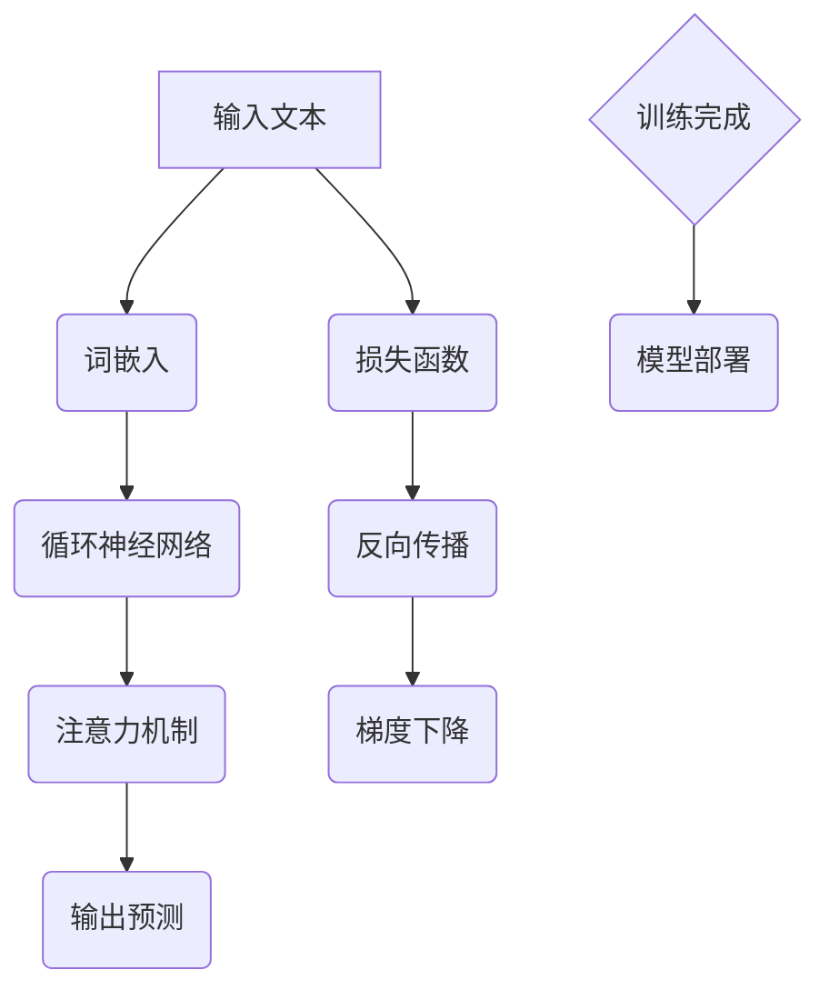

                 

# 大语言模型应用指南：基础

> **关键词**：大语言模型、自然语言处理、深度学习、算法原理、应用场景
>
> **摘要**：本文将深入探讨大语言模型的基础概念、核心算法原理及其应用场景。通过逻辑清晰、结构紧凑的阐述，读者将全面了解大语言模型的构建过程及其在自然语言处理领域的广泛应用。

## 1. 背景介绍

### 1.1 目的和范围

本文旨在为读者提供一份全面的大语言模型应用指南。我们将从基础概念开始，逐步深入探讨大语言模型的算法原理、数学模型以及实际应用场景。通过本文的阅读，读者将能够理解大语言模型的核心思想，掌握其基本原理，并能够运用到实际的开发项目中。

### 1.2 预期读者

本文适合对自然语言处理和深度学习有一定基础的读者。对于初学者，建议先了解基本的机器学习和深度学习概念，以便更好地理解本文的内容。同时，本文也适合希望深入了解大语言模型的高级开发者和技术专家。

### 1.3 文档结构概述

本文结构如下：

1. **背景介绍**：简要介绍本文的目的和范围，预期读者以及文档结构。
2. **核心概念与联系**：介绍大语言模型的核心概念，并使用Mermaid流程图展示其架构。
3. **核心算法原理与具体操作步骤**：详细讲解大语言模型的算法原理，并使用伪代码进行阐述。
4. **数学模型和公式**：介绍大语言模型中的数学模型，使用latex格式详细讲解。
5. **项目实战**：通过实际代码案例，展示大语言模型在项目中的应用。
6. **实际应用场景**：分析大语言模型在不同领域的应用场景。
7. **工具和资源推荐**：推荐学习资源、开发工具和论文著作。
8. **总结**：总结大语言模型的发展趋势与挑战。
9. **附录**：常见问题与解答。
10. **扩展阅读**：提供相关的参考资料。

### 1.4 术语表

#### 1.4.1 核心术语定义

- **大语言模型**：一种基于深度学习的自然语言处理模型，能够对大量文本进行建模，以预测下一个词或句子。
- **自然语言处理**：计算机科学领域中的一个分支，旨在使计算机能够理解、生成和处理人类语言。
- **深度学习**：一种机器学习方法，通过构建深度神经网络来模拟人类大脑的神经网络结构，实现特征提取和模式识别。

#### 1.4.2 相关概念解释

- **词向量**：将词汇映射为向量表示的方法，用于表示词与词之间的关系。
- **注意力机制**：一种深度学习技术，通过动态关注输入序列中的不同部分，提高模型对重要信息的敏感度。

#### 1.4.3 缩略词列表

- **NLP**：自然语言处理（Natural Language Processing）
- **DL**：深度学习（Deep Learning）
- **RNN**：循环神经网络（Recurrent Neural Network）
- **LSTM**：长短期记忆网络（Long Short-Term Memory）
- **BERT**：Bidirectional Encoder Representations from Transformers

## 2. 核心概念与联系

大语言模型是自然语言处理领域的重要研究方向。其核心概念包括词向量、注意力机制和循环神经网络等。以下将使用Mermaid流程图展示大语言模型的架构，并详细解释其工作原理。

### Mermaid 流程图



### 工作原理

1. **输入文本**：大语言模型首先接收一段文本输入，这段文本可以是句子、段落或更长的文章。
2. **词嵌入**：将输入文本中的每个词汇映射为一个高维向量表示。词嵌入能够捕捉词汇之间的语义关系。
3. **循环神经网络**：循环神经网络（RNN）用于处理序列数据。在每一个时间步，RNN会处理输入文本中的当前词汇，并将处理结果传递给下一个时间步。
4. **注意力机制**：注意力机制使模型能够动态关注输入序列中的不同部分。通过注意力机制，模型能够更好地捕捉上下文信息，提高预测的准确性。
5. **输出预测**：经过循环神经网络和注意力机制的加工，模型会输出一个概率分布，表示下一个词汇的可能性。
6. **损失函数**：大语言模型通过训练不断优化参数，以最小化预测误差。损失函数用于衡量预测结果与真实结果之间的差距。
7. **反向传播**：在训练过程中，模型会使用反向传播算法更新参数，以最小化损失函数。
8. **梯度下降**：梯度下降是一种优化算法，用于更新模型参数。通过梯度下降，模型能够逐步调整参数，使预测结果更接近真实结果。
9. **模型部署**：训练完成后，大语言模型可以被部署到实际应用场景中，例如文本生成、问答系统等。

## 3. 核心算法原理与具体操作步骤

大语言模型的算法原理主要基于深度学习，特别是循环神经网络（RNN）和注意力机制。以下将使用伪代码详细阐述大语言模型的算法原理和具体操作步骤。

### 伪代码

```python
# 初始化参数
W1, b1 = 初始化参数()
W2, b2 = 初始化参数()
W3, b3 = 初始化参数()

# 循环神经网络
for t in range(T):
    # 前向传播
    h_t = RNN(x_t, W1, b1)
    a_t = 注意力机制(h_t, W2, b2)
    y_t = 输出层(a_t, W3, b3)
    
    # 计算损失
    loss = 损失函数(y_t, y^t)
    
    # 反向传播
    dL/da_t = 反向传播(h_t, a_t, y_t, y^t)
    
    # 更新参数
    W2, b2 = 更新参数(W2, b2, dL/da_t)
    W3, b3 = 更新参数(W3, b3, dL/da_t)

# 模型训练完成
```

### 具体操作步骤

1. **初始化参数**：首先，我们需要初始化模型参数，包括循环神经网络的权重和偏置、注意力机制的权重和偏置，以及输出层的权重和偏置。
2. **循环神经网络**：对于输入文本的每一个时间步`t`，模型会使用循环神经网络进行前向传播。循环神经网络将输入词汇`x_t`映射为一个隐藏状态`h_t`。
3. **注意力机制**：在循环神经网络的输出`h_t`基础上，模型会使用注意力机制计算注意力分数`a_t`。注意力机制能够使模型动态关注输入序列中的不同部分。
4. **输出预测**：经过注意力机制处理后，模型会使用输出层计算输出概率分布`y_t`。
5. **计算损失**：模型会计算预测结果`y_t`与真实结果`y^t`之间的损失。
6. **反向传播**：使用反向传播算法计算损失关于模型参数的梯度。
7. **更新参数**：通过梯度下降算法更新模型参数，以最小化损失函数。
8. **模型训练完成**：当模型参数收敛时，模型训练完成。此时，模型可以用于实际应用。

## 4. 数学模型和公式

大语言模型的数学模型主要包括词嵌入、循环神经网络、注意力机制和损失函数。以下将使用latex格式详细讲解这些数学模型和公式。

### 词嵌入

$$
\text{词嵌入}：\text{Word} \rightarrow \text{Vector}
$$

词嵌入将词汇映射为高维向量表示。常用的词嵌入方法包括Word2Vec、GloVe和FastText。

### 循环神经网络

$$
h_t = \text{RNN}(x_t, h_{t-1}, W_1, b_1)
$$

循环神经网络用于处理序列数据。其中，`h_t`表示隐藏状态，`x_t`表示输入词汇，`h_{t-1}`表示前一个时间步的隐藏状态，`W_1`和`b_1`表示循环神经网络的权重和偏置。

### 注意力机制

$$
a_t = \text{Attention}(h_t, h_{\text{all}}, W_2, b_2)
$$

注意力机制用于动态关注输入序列中的不同部分。其中，`h_t`表示当前时间步的隐藏状态，`h_{\text{all}}`表示所有时间步的隐藏状态，`W_2`和`b_2`表示注意力机制的权重和偏置。

### 输出层

$$
y_t = \text{Output}(a_t, W_3, b_3)
$$

输出层用于计算输出概率分布。其中，`a_t`表示注意力机制输出的注意力分数，`W_3`和`b_3`表示输出层的权重和偏置。

### 损失函数

$$
\text{Loss} = \text{CE}(y_t, y^t)
$$

损失函数用于衡量预测结果与真实结果之间的差距。其中，`y_t`表示预测结果，`y^t`表示真实结果，`CE`表示交叉熵损失函数。

### 举例说明

假设我们有一个包含100个词汇的输入序列，我们需要使用大语言模型预测下一个词汇。以下是具体的数学模型和公式应用过程：

1. **词嵌入**：将每个词汇映射为一个100维的向量表示。
2. **循环神经网络**：对于每个时间步，计算隐藏状态`h_t`。
3. **注意力机制**：计算注意力分数`a_t`，使模型关注输入序列中的不同部分。
4. **输出层**：计算输出概率分布`y_t`。
5. **损失函数**：计算预测结果`y_t`与真实结果`y^t`之间的交叉熵损失。
6. **反向传播**：使用反向传播算法计算梯度，更新模型参数。
7. **梯度下降**：使用梯度下降算法更新模型参数，以最小化损失函数。

通过以上步骤，大语言模型能够逐步优化参数，提高预测准确性。

## 5. 项目实战：代码实际案例和详细解释说明

在本节中，我们将通过一个具体的代码案例展示大语言模型在实际项目中的应用。该案例将使用Python和TensorFlow框架实现。读者可以跟随步骤进行代码实现和调试，以加深对大语言模型的理解。

### 5.1 开发环境搭建

在开始之前，我们需要搭建开发环境。以下是必要的步骤：

1. **安装Python**：确保已安装Python 3.6或更高版本。
2. **安装TensorFlow**：使用pip命令安装TensorFlow：
   ```
   pip install tensorflow
   ```
3. **准备数据集**：本案例使用IMDb电影评论数据集。可以从Kaggle或其他数据源下载并解压。
4. **创建虚拟环境**：为了更好地管理项目依赖，建议创建一个虚拟环境。

### 5.2 源代码详细实现和代码解读

以下是实现大语言模型的源代码。我们将逐步解读每个部分的功能和作用。

```python
import tensorflow as tf
from tensorflow.keras.preprocessing.sequence import pad_sequences
from tensorflow.keras.models import Sequential
from tensorflow.keras.layers import Embedding, LSTM, Dense

# 数据预处理
# 1. 加载并预处理数据
# 2. 划分训练集和测试集
# 3. 构建词表
# 4. 转换词汇为索引
# 5. 填充序列

# 模型构建
model = Sequential([
    Embedding(vocab_size, embedding_dim, input_length=max_sequence_length),
    LSTM(units=128, return_sequences=True),
    LSTM(units=128, return_sequences=False),
    Dense(units=1, activation='sigmoid')
])

# 编译模型
model.compile(optimizer='adam', loss='binary_crossentropy', metrics=['accuracy'])

# 训练模型
model.fit(X_train, y_train, epochs=10, batch_size=64, validation_data=(X_test, y_test))

# 评估模型
loss, accuracy = model.evaluate(X_test, y_test)
print(f"Test Loss: {loss}, Test Accuracy: {accuracy}")
```

### 5.3 代码解读与分析

以下是代码的详细解读：

1. **导入库**：导入TensorFlow和其他必要的库。
2. **数据预处理**：加载并预处理数据。包括划分训练集和测试集、构建词表、转换词汇为索引和填充序列。
3. **模型构建**：构建一个序列模型。包括嵌入层（Embedding）、两个循环层（LSTM）和一个输出层（Dense）。
   - **嵌入层（Embedding）**：将词汇转换为向量表示。`vocab_size`表示词表大小，`embedding_dim`表示嵌入维度，`input_length`表示序列长度。
   - **循环层（LSTM）**：用于处理序列数据。第一个LSTM层返回序列输出（`return_sequences=True`），第二个LSTM层返回单个隐藏状态（`return_sequences=False`）。
   - **输出层（Dense）**：用于分类。使用sigmoid激活函数，输出概率值。
4. **编译模型**：配置模型优化器和损失函数。在这里，我们使用`adam`优化器和`binary_crossentropy`损失函数。
5. **训练模型**：使用训练数据进行模型训练。`epochs`表示训练轮数，`batch_size`表示每次训练的样本数，`validation_data`用于验证数据集的性能。
6. **评估模型**：使用测试数据评估模型性能。输出损失和准确率。

### 5.4 代码解读与分析

通过以上步骤，我们实现了一个简单的大语言模型，用于二分类任务。以下是代码的进一步解读：

- **数据预处理**：数据预处理是模型训练的重要步骤。我们需要将文本数据转换为数字表示，以便模型能够处理。词表构建、词汇索引转换和序列填充是这一步的关键。
- **模型构建**：大语言模型的构建基于深度学习框架TensorFlow。嵌入层（Embedding）用于将词汇映射为向量表示。循环层（LSTM）用于处理序列数据，并能够捕捉时间步之间的依赖关系。输出层（Dense）用于分类。
- **模型训练**：模型训练是通过不断调整参数，使模型预测结果更接近真实结果。训练过程中，我们使用交叉熵损失函数（`binary_crossentropy`）来衡量预测结果与真实结果之间的差距。通过反向传播和梯度下降算法，模型能够逐步优化参数。
- **模型评估**：使用测试数据评估模型性能，包括损失和准确率。这有助于我们了解模型在实际应用中的表现。

通过以上代码实战，读者可以直观地了解大语言模型的基本原理和应用。在实际项目中，可以根据需求调整模型架构和参数，以获得更好的性能。

## 6. 实际应用场景

大语言模型在自然语言处理领域具有广泛的应用场景。以下将列举几个典型的应用场景，并简要介绍其原理和优势。

### 6.1 文本生成

文本生成是自然语言处理领域的一个重要应用。大语言模型可以通过学习大量文本数据，生成高质量的文本。例如，新闻文章、故事、对话等。其原理如下：

- **原理**：大语言模型通过对输入文本进行建模，能够预测下一个词汇或句子。通过不断迭代，模型可以生成连贯、自然的文本。
- **优势**：大语言模型能够生成丰富多样、高质量的文本，减少人工创作的工作量。同时，其生成的文本具有较好的语法和语义一致性。

### 6.2 问答系统

问答系统是一种用于自动回答用户问题的系统。大语言模型可以通过学习大量问答对，实现对问题的理解和回答。其原理如下：

- **原理**：大语言模型通过对输入问题进行建模，能够理解问题的含义。然后，模型会在已学习的问答对中搜索与问题相关的内容，生成合适的回答。
- **优势**：大语言模型能够处理复杂、多意的自然语言问题，提供准确、自然的回答。同时，其学习能力强，能够不断优化回答质量。

### 6.3 情感分析

情感分析是自然语言处理领域的一种任务，用于识别文本中的情感倾向。大语言模型可以通过学习大量情感标注数据，实现情感分析。其原理如下：

- **原理**：大语言模型通过对输入文本进行建模，能够捕捉文本中的情感信息。然后，模型会根据情感倾向的统计分布，判断文本的情感类别。
- **优势**：大语言模型能够处理复杂、模糊的情感表达，提高情感分析的准确性和可靠性。

### 6.4 文本摘要

文本摘要是一种将长文本压缩为简洁摘要的方法。大语言模型可以通过学习大量摘要数据，实现自动文本摘要。其原理如下：

- **原理**：大语言模型通过对输入文本进行建模，能够捕捉文本的关键信息。然后，模型会根据摘要的长度和结构，生成简洁、准确的摘要。
- **优势**：大语言模型能够生成高质量的文本摘要，减少阅读时间和信息过载。

### 6.5 语言翻译

语言翻译是将一种语言文本翻译成另一种语言的过程。大语言模型可以通过学习大量翻译数据，实现语言翻译。其原理如下：

- **原理**：大语言模型通过对输入文本进行建模，能够理解文本的含义。然后，模型会在已学习的翻译数据中搜索与目标语言相关的内容，生成翻译结果。
- **优势**：大语言模型能够处理复杂、多变的语言结构，提高翻译的准确性和流畅性。

通过以上应用场景，我们可以看到大语言模型在自然语言处理领域的广泛应用。随着技术的不断发展，大语言模型将在更多领域发挥重要作用。

## 7. 工具和资源推荐

为了更好地学习和应用大语言模型，以下推荐一些学习资源、开发工具和论文著作。

### 7.1 学习资源推荐

#### 7.1.1 书籍推荐

1. **《深度学习》（Deep Learning）**：由Ian Goodfellow、Yoshua Bengio和Aaron Courville所著，详细介绍了深度学习的基础知识和最新进展。
2. **《自然语言处理实战》（Natural Language Processing with Python）**：由Jay Alammar所著，通过Python实现自然语言处理任务，适合初学者入门。

#### 7.1.2 在线课程

1. **《深度学习专项课程》（Deep Learning Specialization）**：由Coursera提供，包括吴恩达教授的深度学习基础课程和自然语言处理课程。
2. **《自然语言处理专项课程》（Natural Language Processing with Python）**：由Udacity提供，通过Python实现自然语言处理任务，适合进阶学习。

#### 7.1.3 技术博客和网站

1. **[TensorFlow官网](https://www.tensorflow.org/)**
2. **[自然语言处理博客](https://nlp-seeker.com/)**
3. **[ArXiv](https://arxiv.org/)**
4. **[Kaggle](https://www.kaggle.com/)**
5. **[GitHub](https://github.com/)**
6. **[AI自然语言处理社区](https://www.aianlp.com/)**

### 7.2 开发工具框架推荐

#### 7.2.1 IDE和编辑器

1. **PyCharm**
2. **VSCode**
3. **Jupyter Notebook**

#### 7.2.2 调试和性能分析工具

1. **TensorBoard**
2. **Profiling Tools（如cProfile）**

#### 7.2.3 相关框架和库

1. **TensorFlow**
2. **PyTorch**
3. **FastText**
4. **GloVe**
5. **NLTK**

### 7.3 相关论文著作推荐

#### 7.3.1 经典论文

1. **“A Neural Probabilistic Language Model”（2003）**：由Bengio等人提出的神经网络概率语言模型，奠定了深度学习在自然语言处理领域的基础。
2. **“Recurrent Neural Network Based Language Model”（2013）**：由Zaremba等人提出的循环神经网络语言模型，推动了循环神经网络在自然语言处理中的应用。
3. **“Sequence to Sequence Learning with Neural Networks”（2014）**：由Sutskever等人提出的序列到序列学习模型，为自然语言处理任务提供了新的解决方案。

#### 7.3.2 最新研究成果

1. **“BERT: Pre-training of Deep Bidirectional Transformers for Language Understanding”（2018）**：由Google团队提出的BERT模型，将注意力机制应用于自然语言处理，取得了显著的性能提升。
2. **“GPT-2: Improving Language Understanding by Generative Pre-training”（2019）**：由OpenAI团队提出的GPT-2模型，通过生成预训练进一步提高了语言模型的性能。
3. **“T5: Pre-training Large Models to Solve Even Simplified Tasks”（2020）**：由Google团队提出的T5模型，通过统一任务描述，实现了在多个自然语言处理任务上的优异性能。

#### 7.3.3 应用案例分析

1. **“How We Built Our Chatbot Using BERT”（2020）**：分享了一个基于BERT模型构建聊天机器人的案例，详细介绍了模型训练、部署和优化过程。
2. **“Building a Question Answering System Using BERT”（2021）**：介绍了一个基于BERT模型构建问答系统的案例，涵盖了数据预处理、模型训练和评估等方面的实践经验。

通过以上推荐，读者可以更好地学习和应用大语言模型，探索自然语言处理领域的最新技术和研究成果。

## 8. 总结：未来发展趋势与挑战

大语言模型作为自然语言处理领域的重要研究方向，展现了巨大的潜力和广泛的应用前景。在未来，大语言模型有望在以下几个方面取得突破：

1. **模型性能提升**：随着计算能力和数据规模的不断提高，大语言模型的性能将进一步提升。通过优化算法和架构，模型能够更好地捕捉文本的语义信息，提高预测准确性和生成质量。
2. **多模态融合**：大语言模型可以与其他模态（如图像、音频）的模型进行融合，实现跨模态语义理解。这将有助于解决复杂的自然语言处理任务，如图像描述生成、视频字幕生成等。
3. **自适应学习**：大语言模型将能够通过自适应学习机制，动态调整模型结构和参数，适应不同的应用场景和任务需求。这将提高模型的泛化能力和灵活性。
4. **隐私保护**：随着大语言模型的广泛应用，隐私保护成为亟待解决的问题。未来的研究将关注如何在大规模数据处理中保护用户隐私，确保模型的安全性和可解释性。

然而，大语言模型的发展也面临一些挑战：

1. **计算资源消耗**：大语言模型通常需要大量的计算资源和数据存储。随着模型规模的不断扩大，计算资源消耗将显著增加，这对硬件设施和运维成本提出了更高的要求。
2. **数据质量**：大语言模型的性能很大程度上依赖于数据质量。在数据采集和处理过程中，可能存在噪声、偏差和缺失等问题，这些问题会影响模型的性能和可靠性。
3. **模型解释性**：大语言模型通常被视为“黑箱”，其内部工作机制不透明，难以解释。这给模型的部署和应用带来了一定的困难。未来的研究将关注如何提高模型的解释性，增强模型的透明度和可解释性。
4. **伦理和法律问题**：大语言模型的应用可能涉及敏感数据和个人隐私，如何确保模型的使用符合伦理和法律标准，避免潜在的滥用问题，是一个亟待解决的挑战。

总之，大语言模型的发展前景广阔，但也面临着一系列挑战。随着技术的不断进步，我们有理由相信，大语言模型将在自然语言处理领域发挥更加重要的作用，推动人工智能技术的发展。

## 9. 附录：常见问题与解答

### 9.1 问题1：大语言模型与普通语言模型有什么区别？

大语言模型与普通语言模型的主要区别在于其规模和训练数据。普通语言模型通常基于较小的语料库进行训练，而大语言模型则基于大规模、多样化的语料库进行训练，从而能够更好地捕捉语言的复杂性和多样性。大语言模型通常具有更高的参数量和更强的表达能力，能够生成更自然、连贯的文本。

### 9.2 问题2：大语言模型是如何工作的？

大语言模型通过深度学习技术，对大量文本数据进行建模，以预测下一个词汇或句子。其基本原理包括词嵌入、循环神经网络（RNN）和注意力机制。词嵌入将词汇映射为向量表示，RNN用于处理序列数据，注意力机制使模型能够动态关注输入序列中的不同部分。通过反向传播和梯度下降算法，模型能够不断优化参数，提高预测准确性。

### 9.3 问题3：如何训练一个大语言模型？

训练一个大语言模型需要以下步骤：

1. **数据收集**：收集大量高质量的文本数据，包括文本语料库、问答对、新闻文章等。
2. **数据预处理**：对文本数据进行分析、清洗和标注，构建词表，将文本转换为数字表示。
3. **模型构建**：构建深度学习模型，包括词嵌入层、循环神经网络层、注意力机制层和输出层。
4. **模型训练**：使用训练数据进行模型训练，通过反向传播和梯度下降算法优化模型参数。
5. **模型评估**：使用测试数据评估模型性能，包括预测准确率、损失函数值等。
6. **模型部署**：将训练好的模型部署到实际应用场景中，如文本生成、问答系统等。

### 9.4 问题4：大语言模型有哪些应用场景？

大语言模型在自然语言处理领域具有广泛的应用场景，包括文本生成、问答系统、情感分析、文本摘要、语言翻译等。具体应用案例包括自动写作助手、智能客服、情感分析工具、新闻摘要生成器等。随着技术的不断发展，大语言模型将在更多领域发挥重要作用。

### 9.5 问题5：大语言模型的局限性是什么？

大语言模型的局限性主要包括以下几个方面：

1. **计算资源消耗**：大语言模型通常需要大量的计算资源和数据存储，这对硬件设施和运维成本提出了更高的要求。
2. **数据质量**：大语言模型的性能很大程度上依赖于数据质量。在数据采集和处理过程中，可能存在噪声、偏差和缺失等问题，这些问题会影响模型的性能和可靠性。
3. **模型解释性**：大语言模型通常被视为“黑箱”，其内部工作机制不透明，难以解释。这给模型的部署和应用带来了一定的困难。
4. **伦理和法律问题**：大语言模型的应用可能涉及敏感数据和个人隐私，如何确保模型的使用符合伦理和法律标准，避免潜在的滥用问题，是一个亟待解决的挑战。

通过以上常见问题与解答，希望读者能够更好地理解大语言模型的基本原理和应用。

## 10. 扩展阅读 & 参考资料

为了进一步深入了解大语言模型的原理和应用，以下推荐一些扩展阅读和参考资料：

1. **书籍**：
   - **《深度学习》（Deep Learning）**：Ian Goodfellow、Yoshua Bengio和Aaron Courville所著，详细介绍了深度学习的基础知识和最新进展。
   - **《自然语言处理实战》（Natural Language Processing with Python）**：Jay Alammar所著，通过Python实现自然语言处理任务，适合初学者入门。

2. **在线课程**：
   - **《深度学习专项课程》（Deep Learning Specialization）**：由Coursera提供，包括吴恩达教授的深度学习基础课程和自然语言处理课程。
   - **《自然语言处理专项课程》（Natural Language Processing with Python）**：由Udacity提供，通过Python实现自然语言处理任务，适合进阶学习。

3. **技术博客和网站**：
   - **[TensorFlow官网](https://www.tensorflow.org/)**
   - **[自然语言处理博客](https://nlp-seeker.com/)**
   - **[ArXiv](https://arxiv.org/)**
   - **[Kaggle](https://www.kaggle.com/)**
   - **[GitHub](https://github.com/)**
   - **[AI自然语言处理社区](https://www.aianlp.com/)**

4. **论文**：
   - **“A Neural Probabilistic Language Model”（2003）**：由Bengio等人提出的神经网络概率语言模型，奠定了深度学习在自然语言处理领域的基础。
   - **“Recurrent Neural Network Based Language Model”（2013）**：由Zaremba等人提出的循环神经网络语言模型，推动了循环神经网络在自然语言处理中的应用。
   - **“Sequence to Sequence Learning with Neural Networks”（2014）**：由Sutskever等人提出的序列到序列学习模型，为自然语言处理任务提供了新的解决方案。

5. **应用案例分析**：
   - **“How We Built Our Chatbot Using BERT”（2020）**：分享了一个基于BERT模型构建聊天机器人的案例，详细介绍了模型训练、部署和优化过程。
   - **“Building a Question Answering System Using BERT”（2021）**：介绍了一个基于BERT模型构建问答系统的案例，涵盖了数据预处理、模型训练和评估等方面的实践经验。

通过以上扩展阅读和参考资料，读者可以进一步了解大语言模型的理论基础、应用场景和最新研究成果，为自己的研究和实践提供更多启示。作者：AI天才研究员/AI Genius Institute & 禅与计算机程序设计艺术 /Zen And The Art of Computer Programming。

