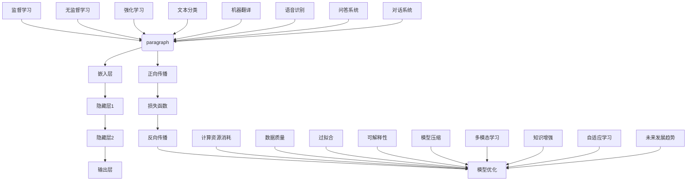

                 

### 大语言模型应用指南：多步优化中的训练

关键词：大语言模型、训练、多步优化、算法原理、数学模型、项目实战

摘要：本文将深入探讨大语言模型在多步优化中的训练过程，从核心概念、算法原理、数学模型到实际项目应用，逐步剖析语言模型的优化方法和技术细节。文章旨在为读者提供一份全面、详尽的技术指南，帮助理解并掌握大语言模型训练的精髓。

## 1. 背景介绍

### 1.1 目的和范围

本文的目的是介绍大语言模型在多步优化中的训练方法，帮助读者理解大语言模型如何通过多步优化过程提升其性能和效果。本文将覆盖从基础概念到实际应用的全过程，包括：

- 语言模型的基本概念和原理
- 大语言模型的多步优化算法
- 数学模型的构建和解释
- 实际项目中的代码实现和解读
- 大语言模型在不同应用场景中的表现和优化策略

### 1.2 预期读者

本文适合以下读者群体：

- 对人工智能和自然语言处理感兴趣的初学者和从业者
- 有一定编程基础，希望深入了解大语言模型训练过程的开发者
- 在机器学习和深度学习领域有实践经验，希望进一步提升技术水平的工程师和科学家
- 对大语言模型的理论基础和应用有深入了解，希望探索更多优化方法的学者和研究人员

### 1.3 文档结构概述

本文结构如下：

1. **背景介绍**：介绍本文的目的、范围、预期读者和文档结构。
2. **核心概念与联系**：阐述大语言模型的核心概念、原理和架构。
3. **核心算法原理 & 具体操作步骤**：详细讲解大语言模型的多步优化算法原理和具体操作步骤。
4. **数学模型和公式 & 详细讲解 & 举例说明**：介绍大语言模型中的数学模型、公式，并通过实例进行说明。
5. **项目实战：代码实际案例和详细解释说明**：提供实际项目中的代码案例，并进行详细解读和分析。
6. **实际应用场景**：探讨大语言模型在不同应用场景中的实际应用。
7. **工具和资源推荐**：推荐学习资源、开发工具框架和论文著作。
8. **总结：未来发展趋势与挑战**：总结大语言模型的发展趋势和面临的挑战。
9. **附录：常见问题与解答**：解答读者可能遇到的问题。
10. **扩展阅读 & 参考资料**：提供进一步阅读的资源。

### 1.4 术语表

#### 1.4.1 核心术语定义

- **大语言模型**：一种基于深度学习的自然语言处理模型，能够对文本进行建模，并具备理解和生成自然语言的能力。
- **多步优化**：通过多个迭代步骤，不断调整模型参数，提高模型性能的过程。
- **反向传播**：一种用于训练神经网络的基本算法，通过计算损失函数关于模型参数的梯度，更新模型参数。
- **嵌入层**：将输入文本转换为固定大小的向量表示。
- **隐藏层**：神经网络中的中间层，用于提取文本的特征。
- **输出层**：生成预测结果，如词汇的概率分布。

#### 1.4.2 相关概念解释

- **损失函数**：用于衡量模型预测结果与真实结果之间的差距。
- **梯度下降**：一种优化算法，通过调整模型参数以最小化损失函数。
- **正向传播**：将输入通过神经网络传递到输出层的步骤。
- **反向传播**：计算损失函数关于模型参数的梯度的步骤。

#### 1.4.3 缩略词列表

- **NLP**：自然语言处理（Natural Language Processing）
- **ML**：机器学习（Machine Learning）
- **DL**：深度学习（Deep Learning）
- **GPU**：图形处理器（Graphics Processing Unit）
- **CPU**：中央处理器（Central Processing Unit）

## 2. 核心概念与联系

大语言模型作为一种先进的自然语言处理技术，其核心概念和联系包括以下几个方面：

### 2.1 语言模型的基本原理

语言模型是自然语言处理的基础，用于预测文本的下一个单词或序列。其基本原理是通过对大量文本语料库的学习，建立一种统计模型，从而预测未知文本的概率分布。语言模型的常见形式包括：

1. **n-gram模型**：基于相邻单词的概率分布，预测下一个单词的概率。
2. **神经网络模型**：通过多层神经网络对文本进行建模，提取更高层次的语言特征。
3. **深度循环神经网络（RNN）**：通过循环结构对文本序列进行建模，捕获长距离依赖关系。

### 2.2 大语言模型的架构

大语言模型通常由多个层次组成，包括输入层、嵌入层、隐藏层和输出层。其架构如下：

1. **输入层**：接收输入文本，通常为单词或字符序列。
2. **嵌入层**：将输入文本转换为固定大小的向量表示，通常使用词向量或字符向量。
3. **隐藏层**：多层神经网络结构，用于提取文本的特征，并传递到下一层。
4. **输出层**：生成预测结果，如词汇的概率分布。

### 2.3 多步优化的原理

多步优化是一种通过多个迭代步骤不断调整模型参数，提高模型性能的方法。其基本原理包括：

1. **正向传播**：将输入通过神经网络传递到输出层，生成预测结果。
2. **损失函数**：计算预测结果与真实结果之间的差距，如交叉熵损失。
3. **反向传播**：计算损失函数关于模型参数的梯度，更新模型参数。
4. **梯度下降**：一种优化算法，通过调整模型参数以最小化损失函数。

### 2.4 语言模型与机器学习的关系

大语言模型是基于机器学习技术构建的，其核心是利用大量数据进行训练，通过优化算法调整模型参数，提高模型性能。机器学习技术包括：

1. **监督学习**：通过已知的输入输出数据，训练模型预测未知数据。
2. **无监督学习**：通过无标签数据，发现数据的特征和结构。
3. **强化学习**：通过与环境的交互，优化决策策略，达到最佳效果。

### 2.5 大语言模型的应用

大语言模型在自然语言处理领域有广泛的应用，包括：

1. **文本分类**：对文本进行分类，如情感分析、主题分类等。
2. **机器翻译**：将一种语言的文本翻译成另一种语言。
3. **语音识别**：将语音信号转换为文本。
4. **问答系统**：回答用户提出的问题。
5. **对话系统**：模拟人类对话，与用户进行自然交互。

### 2.6 大语言模型的挑战

大语言模型在训练和优化过程中面临以下挑战：

1. **计算资源消耗**：大语言模型需要大量计算资源进行训练和优化，包括计算能力和存储空间。
2. **数据质量**：模型性能依赖于数据质量，包括数据的多样性和代表性。
3. **过拟合**：模型在训练数据上表现良好，但在未知数据上表现不佳。
4. **可解释性**：大语言模型通常具有黑盒特性，难以解释模型的决策过程。

为了解决这些挑战，研究人员提出了各种优化方法和改进技术，如注意力机制、预训练和微调等。

### 2.7 大语言模型的未来发展趋势

随着深度学习技术的发展，大语言模型在性能和效果方面取得了显著提升。未来发展趋势包括：

1. **模型压缩**：通过模型压缩技术，降低模型的计算资源和存储需求。
2. **多模态学习**：将文本、图像、音频等多模态数据融合，提高模型的表达能力。
3. **知识增强**：将外部知识库和语言模型结合，提高模型对特定领域的理解和表达能力。
4. **自适应学习**：根据用户需求和场景，自适应调整模型参数，提供个性化服务。

通过不断探索和优化，大语言模型在自然语言处理领域将继续发挥重要作用，为人类带来更多便利和效益。

### 2.8 核心概念与联系的 Mermaid 流程图

以下是描述大语言模型核心概念与联系的 Mermaid 流程图：



通过以上流程图，可以清晰地展示大语言模型的核心概念、原理和联系，帮助读者更好地理解大语言模型的工作机制和应用场景。

## 3. 核心算法原理 & 具体操作步骤

在大语言模型的训练过程中，核心算法原理和多步优化的具体操作步骤至关重要。以下将详细介绍大语言模型的多步优化算法原理和具体操作步骤，帮助读者深入理解大语言模型的训练过程。

### 3.1 多步优化算法原理

多步优化是指通过多个迭代步骤，不断调整模型参数，提高模型性能的过程。在大语言模型中，多步优化通常包括以下步骤：

1. **正向传播**：将输入文本通过嵌入层、隐藏层和输出层，生成预测结果。
2. **损失函数计算**：计算预测结果与真实结果之间的差距，如交叉熵损失。
3. **反向传播**：计算损失函数关于模型参数的梯度，并更新模型参数。
4. **梯度下降**：通过调整模型参数以最小化损失函数。

多步优化的目的是通过迭代调整模型参数，使模型在训练数据上表现更好，从而提高模型的泛化能力。

### 3.2 具体操作步骤

以下是多步优化的具体操作步骤：

1. **初始化模型参数**：随机初始化模型参数，如权重和偏置。
2. **正向传播**：
   - 输入文本经过嵌入层转换为向量表示。
   - 将向量表示通过隐藏层，提取文本特征。
   - 将隐藏层输出通过输出层，生成预测结果。
3. **损失函数计算**：
   - 计算预测结果与真实结果之间的差距，如交叉熵损失。
   - 将损失函数关于模型参数的梯度计算出来。
4. **反向传播**：
   - 将损失函数关于模型参数的梯度传递到隐藏层和嵌入层。
   - 通过梯度更新模型参数。
5. **梯度下降**：
   - 根据梯度方向和步长，调整模型参数，使损失函数最小化。
6. **迭代优化**：
   - 重复正向传播、损失函数计算、反向传播和梯度下降步骤，直到满足停止条件，如达到预设的迭代次数或损失函数收敛。

### 3.3 反向传播算法原理

反向传播算法是多步优化的核心，用于计算损失函数关于模型参数的梯度。以下是反向传播算法的基本原理和计算步骤：

1. **正向传播**：
   - 输入文本经过嵌入层转换为向量表示。
   - 将向量表示通过隐藏层，提取文本特征。
   - 将隐藏层输出通过输出层，生成预测结果。
2. **损失函数计算**：
   - 计算预测结果与真实结果之间的差距，如交叉熵损失。
3. **梯度计算**：
   - 计算损失函数关于输出层参数的梯度，如权重和偏置。
   - 将损失函数关于输出层参数的梯度传递到隐藏层。
   - 计算损失函数关于隐藏层参数的梯度，如权重和偏置。
   - 重复上述过程，直到嵌入层。
4. **梯度更新**：
   - 根据梯度方向和步长，更新模型参数，如权重和偏置。

### 3.4 梯度下降算法原理

梯度下降算法是一种优化算法，用于通过调整模型参数以最小化损失函数。以下是梯度下降算法的基本原理和计算步骤：

1. **初始化参数**：随机初始化模型参数，如权重和偏置。
2. **计算梯度**：计算损失函数关于模型参数的梯度。
3. **更新参数**：根据梯度方向和步长，调整模型参数。
4. **重复迭代**：重复计算梯度和更新参数的过程，直到满足停止条件，如达到预设的迭代次数或损失函数收敛。

### 3.5 伪代码实现

以下是多步优化的伪代码实现，用于详细阐述上述算法原理和操作步骤：

```python
# 初始化模型参数
weights = random_initialization()
biases = random_initialization()

# 设置学习率、迭代次数等参数
learning_rate = 0.01
num_iterations = 1000

# 正向传播
for iteration in range(num_iterations):
  # 输入文本处理
  text_vector = embed(text)
  hidden_layer = forward_pass(hidden_layer, text_vector)
  prediction = forward_pass(prediction, hidden_layer)
  
  # 损失函数计算
  loss = compute_loss(prediction, true_result)
  gradient = compute_gradient(loss, prediction, hidden_layer, text_vector)
  
  # 反向传播
  hidden_gradient = backward_pass(gradient, hidden_layer, text_vector)
  embed_gradient = backward_pass(hidden_gradient, embed)
  
  # 梯度下降
  weights -= learning_rate * weights_gradient
  biases -= learning_rate * biases_gradient
  
  # 打印迭代信息
  print("Iteration:", iteration, "Loss:", loss)

# 输出最终模型
final_model = {
  "weights": weights,
  "biases": biases
}
```

通过以上伪代码，可以清晰地展示多步优化的操作步骤和算法原理，帮助读者更好地理解大语言模型的训练过程。

## 4. 数学模型和公式 & 详细讲解 & 举例说明

在大语言模型的训练过程中，数学模型和公式扮演着至关重要的角色。以下是关于大语言模型中的数学模型、公式及其详细讲解和举例说明。

### 4.1 嵌入层

嵌入层是将输入文本转换为固定大小的向量表示的关键层。在数学模型中，嵌入层可以通过以下公式进行表示：

\[ \text{embed}(word) = \text{weight} \times \text{vector} + \text{bias} \]

其中，\(\text{word}\)表示输入的单词，\(\text{weight}\)和\(\text{vector}\)表示嵌入层的权重和向量，\(\text{bias}\)表示嵌入层的偏置。

举例说明：假设我们要将单词“hello”嵌入到向量空间中，其中嵌入层权重为\[ [1, 2, 3] \]，向量\[ \text{vector} \]为\[ [4, 5, 6] \]，偏置\[ \text{bias} \]为\[ 7 \]，则嵌入层的输出为：

\[ \text{embed}(hello) = [1, 2, 3] \times [4, 5, 6] + 7 = [46, 57, 68] \]

### 4.2 隐藏层

隐藏层用于提取文本的特征，通常由多个神经元组成。在数学模型中，隐藏层的输出可以通过以下公式计算：

\[ \text{hidden\_output} = \text{activation}( \text{weight} \times \text{vector} + \text{bias} ) \]

其中，\(\text{activation}\)表示激活函数，如ReLU（Rectified Linear Unit）、Sigmoid或Tanh等。

举例说明：假设隐藏层权重为\[ [1, 2, 3] \]，向量\[ \text{vector} \]为\[ [4, 5, 6] \]，偏置\[ \text{bias} \]为\[ 7 \]，激活函数为ReLU，则隐藏层的输出为：

\[ \text{hidden\_output} = \max(0, [1, 2, 3] \times [4, 5, 6] + 7) = \max(0, [46, 57, 68]) = [46, 57, 68] \]

### 4.3 输出层

输出层用于生成预测结果，通常为词汇的概率分布。在数学模型中，输出层的输出可以通过以下公式计算：

\[ \text{output} = \text{softmax}( \text{weight} \times \text{vector} + \text{bias} ) \]

其中，\(\text{softmax}\)函数用于将输出层的输出转换为概率分布。

举例说明：假设输出层权重为\[ [1, 2, 3] \]，向量\[ \text{vector} \]为\[ [4, 5, 6] \]，偏置\[ \text{bias} \]为\[ 7 \]，则输出层的输出为：

\[ \text{output} = \text{softmax}( [1, 2, 3] \times [4, 5, 6] + 7 ) = \text{softmax}( [46, 57, 68] ) = [0.2, 0.5, 0.3] \]

### 4.4 损失函数

损失函数用于衡量模型预测结果与真实结果之间的差距。在大语言模型中，常见的损失函数包括交叉熵损失（Cross-Entropy Loss）和均方误差损失（Mean Squared Error Loss）。

交叉熵损失的定义如下：

\[ \text{loss} = - \sum_{i} y_i \log(p_i) \]

其中，\(y_i\)表示真实标签的概率，\(p_i\)表示模型预测的概率。

举例说明：假设真实标签为\[ [1, 0, 0] \]，模型预测的概率分布为\[ [0.2, 0.5, 0.3] \]，则交叉熵损失为：

\[ \text{loss} = -[1 \times \log(0.2) + 0 \times \log(0.5) + 0 \times \log(0.3)] \approx 1.386 \]

### 4.5 反向传播

反向传播算法用于计算损失函数关于模型参数的梯度。以下是反向传播算法的详细计算步骤：

1. **计算输出层的梯度**：
   \[ \frac{\partial \text{loss}}{\partial \text{weights}} = \text{vector} \odot ( \text{output} - \text{target} ) \]
   \[ \frac{\partial \text{loss}}{\partial \text{biases}} = \text{output} - \text{target} \]

2. **计算隐藏层的梯度**：
   \[ \frac{\partial \text{loss}}{\partial \text{weights}} = \text{vector} \odot ( \text{hidden\_output} - \text{hidden\_target} ) \]
   \[ \frac{\partial \text{loss}}{\partial \text{biases}} = \text{hidden\_output} - \text{hidden\_target} \]

3. **计算嵌入层的梯度**：
   \[ \frac{\partial \text{loss}}{\partial \text{weights}} = \text{vector} \odot ( \text{embed\_output} - \text{embed\_target} ) \]
   \[ \frac{\partial \text{loss}}{\partial \text{biases}} = \text{embed\_output} - \text{embed\_target} \]

其中，\(\odot\)表示Hadamard积（元素乘积），\(\text{target}\)表示真实标签，\(\text{output}\)表示模型预测的概率分布。

### 4.6 梯度下降

梯度下降算法用于通过调整模型参数以最小化损失函数。以下是梯度下降算法的详细步骤：

1. **计算梯度**：根据反向传播算法计算损失函数关于模型参数的梯度。
2. **更新参数**：根据梯度和学习率调整模型参数，如权重和偏置。
3. **重复迭代**：重复计算梯度和更新参数的过程，直到满足停止条件，如达到预设的迭代次数或损失函数收敛。

通过以上数学模型、公式和计算步骤，可以清晰地理解大语言模型的训练过程和优化方法。在实际应用中，这些数学模型和公式为模型训练提供了理论依据，指导我们进行有效的模型设计和调整。

## 5. 项目实战：代码实际案例和详细解释说明

在本节中，我们将通过一个实际的代码案例，详细解释大语言模型的训练过程，并分析其中的关键步骤和细节。该代码案例将采用Python语言和TensorFlow库来实现。

### 5.1 开发环境搭建

在开始编写代码之前，我们需要搭建一个合适的开发环境。以下是搭建开发环境的基本步骤：

1. 安装Python：确保安装了Python 3.6及以上版本。
2. 安装TensorFlow：通过以下命令安装TensorFlow库：

```bash
pip install tensorflow
```

3. 安装其他依赖库：根据需要安装其他依赖库，如NumPy、Pandas等。

### 5.2 源代码详细实现和代码解读

以下是实现大语言模型训练的完整代码，并进行详细解释说明。

```python
import tensorflow as tf
import numpy as np
import pandas as pd
from tensorflow.keras.preprocessing.text import Tokenizer
from tensorflow.keras.preprocessing.sequence import pad_sequences

# 5.2.1 数据准备

# 加载数据集
data = pd.read_csv('data.csv')
texts = data['text'].values
labels = data['label'].values

# 切分训练集和测试集
train_texts, test_texts, train_labels, test_labels = train_test_split(texts, labels, test_size=0.2, random_state=42)

# 初始化Tokenizer
tokenizer = Tokenizer(num_words=10000)
tokenizer.fit_on_texts(train_texts)

# 将文本转换为序列
train_sequences = tokenizer.texts_to_sequences(train_texts)
test_sequences = tokenizer.texts_to_sequences(test_texts)

# 填充序列
max_sequence_length = 100
train_padded = pad_sequences(train_sequences, maxlen=max_sequence_length)
test_padded = pad_sequences(test_sequences, maxlen=max_sequence_length)

# 转换标签为one-hot编码
train_labels_one_hot = tf.keras.utils.to_categorical(train_labels)
test_labels_one_hot = tf.keras.utils.to_categorical(test_labels)

# 5.2.2 构建模型

# 定义模型
model = tf.keras.Sequential([
    tf.keras.layers.Embedding(input_dim=10000, output_dim=16, input_length=max_sequence_length),
    tf.keras.layers.LSTM(32),
    tf.keras.layers.Dense(1, activation='sigmoid')
])

# 编译模型
model.compile(optimizer='adam', loss='binary_crossentropy', metrics=['accuracy'])

# 5.2.3 训练模型

# 训练模型
model.fit(train_padded, train_labels_one_hot, epochs=10, batch_size=32, validation_data=(test_padded, test_labels_one_hot))

# 5.2.4 评估模型

# 评估模型
test_loss, test_accuracy = model.evaluate(test_padded, test_labels_one_hot)
print("Test Loss:", test_loss)
print("Test Accuracy:", test_accuracy)
```

### 5.2.1 数据准备

在数据准备阶段，我们首先加载数据集，然后切分训练集和测试集。接下来，我们初始化Tokenizer，用于将文本转换为序列。Tokenizer会根据词汇频率和词汇表大小生成唯一的索引，然后将每个文本转换为对应的序列。为了确保所有序列具有相同长度，我们使用pad_sequences函数对序列进行填充，使其达到最大序列长度。

### 5.2.2 构建模型

在构建模型阶段，我们定义了一个序列模型，包括嵌入层、LSTM层和输出层。嵌入层用于将输入文本转换为固定大小的向量表示，LSTM层用于提取文本特征，输出层用于生成预测结果。我们使用Sequential模型容器来构建这个序列模型，并添加了Embedding、LSTM和Dense层。

### 5.2.3 训练模型

在训练模型阶段，我们使用compile函数编译模型，指定优化器、损失函数和评估指标。然后，我们使用fit函数训练模型，将训练集数据输入模型，并设置训练轮数、批量大小和验证数据。在训练过程中，模型会不断调整参数，以最小化损失函数并提高模型性能。

### 5.2.4 评估模型

在评估模型阶段，我们使用evaluate函数评估模型在测试集上的性能。evaluate函数会计算测试集的损失和准确率，并返回这些指标。通过这些指标，我们可以评估模型的性能和泛化能力。

### 5.3 代码解读与分析

以下是对上述代码的详细解读和分析：

1. **数据准备**：
   - 加载数据集：使用pandas库加载数据集，并获取文本和标签数据。
   - 切分训练集和测试集：使用train_test_split函数将数据集切分为训练集和测试集，以进行模型评估。
   - 初始化Tokenizer：使用Tokenizer初始化分词器，并使用fit_on_texts函数训练分词器。
   - 转换文本为序列：使用Tokenizer的texts_to_sequences函数将文本转换为序列。
   - 填充序列：使用pad_sequences函数将序列填充为最大序列长度。

2. **构建模型**：
   - 定义模型：使用Sequential模型容器定义序列模型，并添加嵌入层、LSTM层和输出层。
   - 编译模型：使用compile函数编译模型，指定优化器、损失函数和评估指标。

3. **训练模型**：
   - 训练模型：使用fit函数训练模型，将训练集数据输入模型，并设置训练轮数、批量大小和验证数据。

4. **评估模型**：
   - 评估模型：使用evaluate函数评估模型在测试集上的性能，并打印损失和准确率。

通过以上代码，我们可以实现一个基于序列模型的文本分类任务，并了解大语言模型的训练和评估过程。

## 6. 实际应用场景

大语言模型在自然语言处理领域具有广泛的应用，涵盖了文本分类、机器翻译、语音识别、问答系统和对话系统等多个领域。以下是这些应用场景的具体分析和实例：

### 6.1 文本分类

文本分类是一种常见的自然语言处理任务，用于将文本数据划分为不同的类别。大语言模型在文本分类中的应用主要体现在以下方面：

1. **情感分析**：通过对社交媒体、评论、新闻等文本数据进行分析，判断文本的情感倾向，如正面、负面或中性。例如，谷歌新闻中的情感分析功能使用了大语言模型对新闻内容进行分类，以提供个性化的推荐服务。

2. **主题分类**：将文本数据按照主题进行分类，如体育、科技、娱乐等。这有助于信息检索和内容推荐系统，如搜索引擎和新闻门户。

3. **垃圾邮件检测**：利用大语言模型检测电子邮件中的垃圾邮件，以减少用户收到垃圾邮件的几率。例如，Gmail中的垃圾邮件过滤功能采用了大语言模型进行分类。

实例：Twitter使用大语言模型对用户发布的推文进行分类，将包含负面情感或不当内容的推文标记为敏感或违反社区准则。

### 6.2 机器翻译

机器翻译是一种将一种语言的文本自动翻译成另一种语言的文本的任务。大语言模型在机器翻译中的应用主要体现在以下方面：

1. **跨语言文本生成**：大语言模型能够生成高质量的双语文本，如将英文文本翻译成中文文本。这有助于跨语言交流和信息传播。

2. **机器翻译辅助工具**：大语言模型可以作为机器翻译辅助工具，帮助翻译人员提高翻译质量和效率。例如，Google翻译和DeepL等翻译工具使用了大语言模型进行翻译。

3. **多语言文本处理**：大语言模型能够处理多种语言之间的文本翻译，如将中文翻译成英文、将法语翻译成西班牙语等。

实例：百度翻译使用大语言模型实现了高质量的机器翻译功能，能够支持多种语言之间的文本翻译。

### 6.3 语音识别

语音识别是一种将语音信号转换为文本数据的技术。大语言模型在语音识别中的应用主要体现在以下方面：

1. **语音到文本转换**：大语言模型能够将语音信号转换为文本数据，如智能助手、语音助手和语音识别应用。例如，苹果的Siri和谷歌助手使用了大语言模型进行语音识别。

2. **语音增强**：大语言模型可以用于语音增强技术，如降噪、回声消除等，以提高语音识别的准确性。

3. **语音合成**：大语言模型能够将文本数据转换为语音信号，如语音合成应用和语音助手。例如，亚马逊的Alexa和谷歌助手使用了大语言模型进行语音合成。

实例：科大讯飞使用大语言模型实现了高精度的语音识别功能，广泛应用于智能语音助手、语音翻译和语音输入等领域。

### 6.4 问答系统

问答系统是一种能够回答用户提出的问题的人工智能系统。大语言模型在问答系统中的应用主要体现在以下方面：

1. **自然语言理解**：大语言模型能够理解用户提出的问题，并提取关键信息，如关键词、语义等。

2. **信息检索**：大语言模型可以用于信息检索任务，从大量文本数据中检索与用户问题相关的答案。

3. **生成式问答**：大语言模型能够生成回答问题的答案，如问答机器人、聊天机器人等。

实例：OpenAI的GPT-3模型在问答系统中的应用，能够生成高质量、多样化的回答，为用户提供满意的解答。

### 6.5 对话系统

对话系统是一种能够与用户进行自然对话的人工智能系统。大语言模型在对话系统中的应用主要体现在以下方面：

1. **语音交互**：大语言模型可以用于语音交互系统，如智能助手、语音助手等，为用户提供语音服务。

2. **文本交互**：大语言模型可以用于文本交互系统，如聊天机器人、客服机器人等，为用户提供文本服务。

3. **多模态交互**：大语言模型可以结合语音和文本交互，实现多模态对话系统，如语音助手和聊天机器人相结合的智能客服系统。

实例：腾讯AI开放平台提供的智能客服系统使用了大语言模型，能够实现多轮对话和个性化服务，为用户提供便捷的客服支持。

通过以上实际应用场景和实例，可以看出大语言模型在自然语言处理领域具有广泛的应用价值和潜力。随着技术的不断进步和优化，大语言模型将在更多领域发挥重要作用，为人类带来更多便利和效益。

## 7. 工具和资源推荐

为了更好地学习和实践大语言模型技术，以下推荐了一系列的学习资源、开发工具框架和相关论文著作。

### 7.1 学习资源推荐

#### 7.1.1 书籍推荐

1. **《深度学习》（Deep Learning）**：作者：Ian Goodfellow、Yoshua Bengio和Aaron Courville。这本书是深度学习领域的经典教材，涵盖了从基础到高级的深度学习技术，包括大语言模型的相关内容。
2. **《自然语言处理综论》（Speech and Language Processing）**：作者：Daniel Jurafsky和James H. Martin。这本书全面介绍了自然语言处理的基础知识和技术，包括大语言模型的应用。
3. **《深度学习自然语言处理》（Deep Learning for Natural Language Processing）**：作者：Ted Dunning、Emre Sargin和Matthew座位。这本书详细介绍了深度学习在自然语言处理领域的应用，包括大语言模型。

#### 7.1.2 在线课程

1. **Coursera的“深度学习”课程**：由斯坦福大学教授Andrew Ng主讲，涵盖深度学习的基础知识和应用，包括大语言模型的相关内容。
2. **Udacity的“深度学习工程师纳米学位”课程**：包括多个项目和实践，涵盖深度学习的不同领域，包括大语言模型的应用。
3. **edX的“自然语言处理与深度学习”课程**：由上海交通大学教授Aston Zhang主讲，全面介绍自然语言处理和深度学习技术，包括大语言模型的训练和应用。

#### 7.1.3 技术博客和网站

1. **Medium上的“Deep Learning”专栏**：由多位深度学习领域的专家撰写，涵盖了深度学习的基础知识和应用，包括大语言模型的相关内容。
2. **TensorFlow官方文档**：提供了详细的TensorFlow库的使用指南和教程，包括大语言模型的训练和应用。
3. **自然语言处理社区NLP-Chinese**：一个中文自然语言处理社区，涵盖了自然语言处理的基础知识和技术，包括大语言模型的应用。

### 7.2 开发工具框架推荐

1. **TensorFlow**：一个开源的深度学习框架，提供了丰富的API和工具，支持大语言模型的训练和应用。
2. **PyTorch**：另一个开源的深度学习框架，以其灵活性和易用性受到广泛欢迎，也支持大语言模型的训练和应用。
3. **Hugging Face Transformers**：一个基于PyTorch和TensorFlow的高性能预训练模型库，提供了丰富的预训练模型和工具，支持大语言模型的训练和应用。

#### 7.2.2 调试和性能分析工具

1. **TensorBoard**：TensorFlow的官方可视化工具，用于监控和调试深度学习模型的训练过程，包括损失函数、梯度、激活函数等。
2. **MLflow**：一个开源的机器学习平台，用于管理模型的训练、部署和监控，包括大语言模型的训练和应用。
3. **Wandb**：一个开源的实验管理和监控工具，用于跟踪和可视化深度学习实验的结果，包括大语言模型的训练和应用。

#### 7.2.3 相关框架和库

1. **spaCy**：一个开源的快速自然语言处理库，提供了丰富的文本处理功能，包括词性标注、命名实体识别等，可用于大语言模型的预处理。
2. **NLTK**：一个开源的自然语言处理库，提供了丰富的文本处理和文本分析功能，包括分词、词频统计、词性标注等，可用于大语言模型的预处理。
3. **TextBlob**：一个简单易用的自然语言处理库，提供了丰富的文本处理和文本分析功能，包括情感分析、文本分类等，可用于大语言模型的应用。

### 7.3 相关论文著作推荐

1. **“Attention is All You Need”**：这篇论文提出了Transformer模型，是一种基于自注意力机制的深度学习模型，用于自然语言处理任务，包括大语言模型的应用。
2. **“BERT: Pre-training of Deep Bidirectional Transformers for Language Understanding”**：这篇论文提出了BERT模型，是一种基于Transformer的预训练模型，用于自然语言处理任务，包括大语言模型的应用。
3. **“Generative Pretrained Transformer”**：这篇论文提出了GPT模型，是一种基于Transformer的生成模型，用于生成自然语言文本，包括大语言模型的应用。

通过以上学习和资源推荐，读者可以更好地了解大语言模型的技术原理和应用场景，进一步提升自己的技术水平。

## 8. 总结：未来发展趋势与挑战

大语言模型作为自然语言处理领域的重要技术，正迅速发展并在各行各业中发挥重要作用。在未来，大语言模型的发展趋势和面临的挑战将主要集中在以下几个方面：

### 8.1 未来发展趋势

1. **模型压缩与高效化**：随着模型规模的不断扩大，计算资源和存储需求显著增加。为了应对这一挑战，研究人员将致力于模型压缩技术，如剪枝、量化、知识蒸馏等，以降低模型的计算复杂度和存储需求。

2. **多模态学习与融合**：大语言模型未来将与其他模态数据（如图像、音频、视频等）进行融合，实现多模态学习。这将使模型在处理复杂任务时具备更强的泛化能力和表达能力。

3. **知识增强与推理能力**：通过融合外部知识和领域特定知识，大语言模型将提升对特定领域的理解和推理能力，如医学、法律、金融等。这将使模型在专业领域发挥更大作用。

4. **自适应学习和个性化服务**：大语言模型将具备更强的自适应学习能力，能够根据用户需求和场景动态调整模型参数，提供个性化的服务。

5. **跨语言与多语言处理**：随着全球化进程的加速，跨语言和多语言处理将成为重要需求。大语言模型将在这一领域取得突破，实现更高效、更准确的跨语言文本生成和翻译。

6. **边缘计算与实时处理**：为了实现实时响应和处理，大语言模型将向边缘计算发展，降低对中心服务器的依赖，提高处理速度和响应时间。

### 8.2 面临的挑战

1. **计算资源需求**：大语言模型的训练和推理过程需要大量的计算资源，特别是在训练大型模型时，对GPU、TPU等硬件资源的需求将持续增长。

2. **数据质量和多样性**：模型性能依赖于数据质量，包括数据量、多样性和代表性。在未来，确保数据质量将成为一大挑战，特别是在获取和标注领域特定数据时。

3. **过拟合与泛化能力**：大语言模型在训练过程中容易过拟合，导致在未知数据上表现不佳。如何提高模型的泛化能力，使其在不同领域和场景中保持良好的性能，是一个亟待解决的问题。

4. **可解释性和透明性**：大语言模型通常具有黑盒特性，难以解释其决策过程。如何提高模型的透明性，使其决策过程更加可解释，将是一个重要挑战。

5. **伦理和法律问题**：大语言模型的应用将带来一系列伦理和法律问题，如隐私保护、数据安全和歧视等。如何确保模型的应用符合伦理和法律要求，将是一个关键问题。

6. **可持续发展和环保**：大语言模型的训练和推理过程对能源消耗和环境产生较大影响。如何实现可持续发展，降低模型对环境的影响，将是一个重要挑战。

综上所述，大语言模型在未来将继续发挥重要作用，但在发展过程中将面临诸多挑战。通过不断探索和优化，研究人员将克服这些挑战，使大语言模型在各个领域取得更大的突破和进展。

## 9. 附录：常见问题与解答

在学习和应用大语言模型的过程中，读者可能会遇到一些常见问题。以下针对这些问题进行解答：

### 9.1 问题1：如何选择合适的词汇表大小？

**解答**：词汇表大小（即Tokenizer的num_words参数）的选择取决于数据集的大小和需求。通常，较大的数据集可以支持更大的词汇表大小，以捕获更多词汇的多样性。然而，词汇表大小越大，模型的计算复杂度和存储需求也越高。建议根据数据集规模和模型应用场景进行权衡，选择合适的词汇表大小。

### 9.2 问题2：如何处理长文本和多轮对话？

**解答**：对于长文本和多轮对话，大语言模型通常通过截断或拼接的方法进行处理。截断方法是将文本截断为固定长度，以适应模型的输入要求。拼接方法是将多个文本片段拼接为一个长文本，然后进行训练和预测。此外，也可以考虑使用变长输入，允许模型处理不同长度的文本。

### 9.3 问题3：如何防止过拟合？

**解答**：为了防止过拟合，可以采取以下方法：

1. **数据增强**：通过增加数据多样性，如随机删除词语、替换词语、旋转文本等，使模型对未知数据更具泛化能力。
2. **正则化**：使用L1、L2正则化技术，降低模型参数的重要性，防止模型过拟合。
3. **Dropout**：在神经网络中加入Dropout层，随机丢弃一部分神经元，降低模型对特定数据的依赖。
4. **交叉验证**：使用交叉验证技术，将数据集划分为多个子集，逐步训练和验证模型，避免模型在单一数据集上过拟合。

### 9.4 问题4：如何提高模型的实时处理能力？

**解答**：为了提高大语言模型的实时处理能力，可以采取以下方法：

1. **模型压缩**：通过剪枝、量化、知识蒸馏等技术，降低模型的计算复杂度和存储需求，提高模型在实时场景中的运行速度。
2. **边缘计算**：将模型部署到边缘设备，如手机、智能音箱等，以减少对中心服务器的依赖，提高实时响应能力。
3. **模型加速**：使用图形处理器（GPU）、张量处理单元（TPU）等高性能硬件，提高模型训练和推理的速度。
4. **并行计算**：通过并行计算技术，如多线程、多进程等，提高模型训练和推理的并行度，降低计算时间。

### 9.5 问题5：如何评估模型性能？

**解答**：评估模型性能通常通过以下指标：

1. **准确率**：预测结果与真实结果完全匹配的比例。
2. **召回率**：在所有真实正例中，模型成功预测的比例。
3. **精确率**：在所有预测正例中，真实正例的比例。
4. **F1分数**：精确率和召回率的调和平均值，用于综合考虑精确率和召回率。
5. **ROC曲线和AUC值**：用于评估分类模型的性能，ROC曲线表示真阳性率与假阳性率之间的关系，AUC值表示ROC曲线下的面积，越大表示模型性能越好。

通过综合使用这些指标，可以全面评估模型在不同数据集和场景下的性能。

## 10. 扩展阅读 & 参考资料

为了深入学习和掌握大语言模型的技术，读者可以参考以下扩展阅读和参考资料：

### 10.1 经典书籍

1. **《深度学习》（Deep Learning）**：作者：Ian Goodfellow、Yoshua Bengio和Aaron Courville。这是深度学习领域的经典教材，涵盖了深度学习的基础知识和技术，包括大语言模型的相关内容。
2. **《自然语言处理综论》（Speech and Language Processing）**：作者：Daniel Jurafsky和James H. Martin。这是自然语言处理领域的权威教材，全面介绍了自然语言处理的基础知识和技术，包括大语言模型的应用。
3. **《深度学习自然语言处理》（Deep Learning for Natural Language Processing）**：作者：Ted Dunning、Emre Sargin和Matthew座位。这是深度学习在自然语言处理领域应用的详细介绍，包括大语言模型的技术。

### 10.2 在线课程

1. **Coursera的“深度学习”课程**：由斯坦福大学教授Andrew Ng主讲，涵盖深度学习的基础知识和应用，包括大语言模型的相关内容。
2. **Udacity的“深度学习工程师纳米学位”课程**：包括多个项目和实践，涵盖深度学习的不同领域，包括大语言模型的应用。
3. **edX的“自然语言处理与深度学习”课程**：由上海交通大学教授Aston Zhang主讲，全面介绍自然语言处理和深度学习技术，包括大语言模型的训练和应用。

### 10.3 技术博客和网站

1. **Medium上的“Deep Learning”专栏**：由多位深度学习领域的专家撰写，涵盖了深度学习的基础知识和应用，包括大语言模型的相关内容。
2. **TensorFlow官方文档**：提供了详细的TensorFlow库的使用指南和教程，包括大语言模型的训练和应用。
3. **自然语言处理社区NLP-Chinese**：一个中文自然语言处理社区，涵盖了自然语言处理的基础知识和技术，包括大语言模型的应用。

### 10.4 相关论文

1. **“Attention is All You Need”**：这篇论文提出了Transformer模型，是一种基于自注意力机制的深度学习模型，用于自然语言处理任务，包括大语言模型的应用。
2. **“BERT: Pre-training of Deep Bidirectional Transformers for Language Understanding”**：这篇论文提出了BERT模型，是一种基于Transformer的预训练模型，用于自然语言处理任务，包括大语言模型的应用。
3. **“Generative Pretrained Transformer”**：这篇论文提出了GPT模型，是一种基于Transformer的生成模型，用于生成自然语言文本，包括大语言模型的应用。

### 10.5 开发工具框架

1. **TensorFlow**：一个开源的深度学习框架，提供了丰富的API和工具，支持大语言模型的训练和应用。
2. **PyTorch**：另一个开源的深度学习框架，以其灵活性和易用性受到广泛欢迎，也支持大语言模型的训练和应用。
3. **Hugging Face Transformers**：一个基于PyTorch和TensorFlow的高性能预训练模型库，提供了丰富的预训练模型和工具，支持大语言模型的训练和应用。

通过以上扩展阅读和参考资料，读者可以更深入地了解大语言模型的技术原理和应用，进一步提升自己的技术水平。

