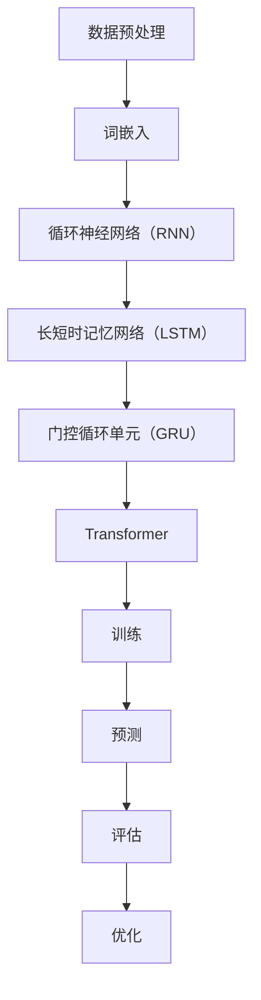

                 

# 大语言模型应用指南：多步优化中的训练和预测

> **关键词：** 大语言模型，训练优化，预测优化，多步优化，算法原理，数学模型，项目实战

> **摘要：** 本文旨在详细介绍大语言模型的训练和预测过程中的多步优化策略。通过深入剖析核心概念、算法原理、数学模型以及项目实战，帮助读者全面掌握大语言模型在复杂应用场景下的高效应用方法。

## 1. 背景介绍

### 1.1 目的和范围

本文旨在为广大技术爱好者、人工智能开发者以及相关领域研究者提供一份系统、全面的大语言模型应用指南。具体来说，本文将涵盖以下内容：

1. 大语言模型的基本概念和架构。
2. 大语言模型训练和预测过程中的核心算法原理。
3. 大语言模型训练和预测的多步优化策略。
4. 大语言模型在项目实战中的应用案例。
5. 推荐的学习资源、开发工具和论文著作。

### 1.2 预期读者

本文适合以下读者群体：

1. 对人工智能、机器学习、自然语言处理感兴趣的初学者。
2. 想要深入了解大语言模型技术原理的开发者。
3. 希望将大语言模型应用于实际项目的技术专家。
4. 相关领域的学术研究者。

### 1.3 文档结构概述

本文分为八个主要部分：

1. **背景介绍**：本文的目的、范围、预期读者和文档结构概述。
2. **核心概念与联系**：大语言模型的基本概念和架构。
3. **核心算法原理 & 具体操作步骤**：大语言模型训练和预测的核心算法原理及操作步骤。
4. **数学模型和公式 & 详细讲解 & 举例说明**：大语言模型相关的数学模型和公式讲解。
5. **项目实战：代码实际案例和详细解释说明**：大语言模型在项目实战中的应用。
6. **实际应用场景**：大语言模型在不同领域的应用。
7. **工具和资源推荐**：学习资源、开发工具和论文著作推荐。
8. **总结：未来发展趋势与挑战**：大语言模型未来发展趋势和面临的挑战。

### 1.4 术语表

#### 1.4.1 核心术语定义

- **大语言模型**：一种基于深度学习的自然语言处理模型，能够对输入的文本进行建模和预测。
- **训练**：通过大量数据训练大语言模型，使其具备一定的语言理解和生成能力。
- **预测**：利用训练好的大语言模型对新的文本进行建模和预测。
- **多步优化**：在大语言模型训练和预测过程中，通过多次迭代优化算法参数，提高模型性能。

#### 1.4.2 相关概念解释

- **深度学习**：一种基于多层神经网络进行模型训练的技术，能够自动从数据中提取特征。
- **自然语言处理**：一门交叉学科，涉及计算机科学、语言学和人工智能，旨在让计算机理解和处理人类语言。
- **算法**：解决问题的步骤和方法，用于指导计算机执行任务。
- **优化**：通过调整模型参数，提高模型性能的过程。

#### 1.4.3 缩略词列表

- **NLP**：自然语言处理（Natural Language Processing）
- **DL**：深度学习（Deep Learning）
- **ML**：机器学习（Machine Learning）
- **GPU**：图形处理器（Graphics Processing Unit）
- **CPU**：中央处理器（Central Processing Unit）
- **TF**：TensorFlow（一种开源深度学习框架）

## 2. 核心概念与联系

在大语言模型应用过程中，核心概念和联系至关重要。为了更好地理解这些概念，我们将使用 Mermaid 流程图（Mermaid Process Flow Diagram）来展示大语言模型的基本架构。



### 2.1 数据预处理

数据预处理是整个大语言模型应用的基础。主要包括以下步骤：

1. **文本清洗**：去除停用词、标点符号、特殊字符等无关信息。
2. **分词**：将文本拆分成一个个单词或字符。
3. **词嵌入**：将单词映射为高维向量，便于神经网络处理。

### 2.2 词嵌入

词嵌入（Word Embedding）是一种将单词映射为高维向量的技术。常见的方法有：

1. **基于统计的词嵌入**：如 Word2Vec、FastText 等。
2. **基于神经网络的词嵌入**：如 Word2Vec（基于神经网络的变体）。

### 2.3 循环神经网络（RNN）

循环神经网络（Recurrent Neural Network，RNN）是一种能够处理序列数据的神经网络。其主要特点是能够将前一个时间步的输出传递给下一个时间步。

### 2.4 长短时记忆网络（LSTM）

长短时记忆网络（Long Short-Term Memory，LSTM）是 RNN 的一种变体，主要解决 RNN 在处理长序列数据时的梯度消失和梯度爆炸问题。

### 2.5 门控循环单元（GRU）

门控循环单元（Gated Recurrent Unit，GRU）是 LSTM 的另一种变体，相较于 LSTM，GRU 结构更为简洁，参数更少。

### 2.6 Transformer

Transformer 是一种基于自注意力机制的序列模型，相较于传统的 RNN 和 LSTM，Transformer 在处理长序列数据时表现更为出色。

### 2.7 训练

训练过程主要包括以下步骤：

1. **损失函数**：用于衡量模型预测结果与实际结果之间的差距。
2. **优化器**：用于调整模型参数，以减小损失函数值。
3. **迭代过程**：通过不断迭代，优化模型参数，提高模型性能。

### 2.8 预测

预测过程主要包括以下步骤：

1. **输入处理**：将输入文本进行预处理，转换为模型可处理的格式。
2. **模型输出**：利用训练好的模型对输入文本进行建模和预测。
3. **结果评估**：对预测结果进行评估，以衡量模型性能。

### 2.9 评估

评估过程主要包括以下指标：

1. **准确率**：预测结果与实际结果相符的比例。
2. **召回率**：实际结果中被正确预测的比例。
3. **F1 分数**：准确率和召回率的加权平均值。

### 2.10 优化

优化过程主要包括以下策略：

1. **超参数调整**：调整模型参数，如学习率、批量大小等。
2. **数据增强**：通过增加数据多样性，提高模型泛化能力。
3. **模型压缩**：通过剪枝、量化等技术，减小模型体积，提高运行速度。

## 3. 核心算法原理 & 具体操作步骤

大语言模型的训练和预测过程涉及多种核心算法，以下我们将以伪代码形式详细阐述这些算法的原理和具体操作步骤。

### 3.1 词嵌入（Word Embedding）

词嵌入是将单词映射为高维向量的技术。以下是词嵌入的伪代码实现：

```python
# 输入：单词列表（words），嵌入维度（embed_dim）
# 输出：词嵌入矩阵（embeddings）

embeddings = [[0 for _ in range(embed_dim)] for _ in range(vocab_size)]

# 遍历单词列表，初始化词嵌入向量
for word in words:
    embeddings[word_index[word]] = [random_value() for _ in range(embed_dim)]
```

### 3.2 循环神经网络（RNN）

循环神经网络（RNN）是一种能够处理序列数据的神经网络。以下是 RNN 的伪代码实现：

```python
# 输入：输入序列（input_seq），隐藏层尺寸（hidden_size）
# 输出：隐藏层状态（hidden_state）

hidden_state = [0 for _ in range(hidden_size)]

for time_step in range(len(input_seq)):
    input_vector = embedding(input_seq[time_step])
    hidden_state = activation(np.dot(hidden_state, weights) + np.dot(input_vector, biases))
```

### 3.3 长短时记忆网络（LSTM）

长短时记忆网络（LSTM）是 RNN 的一种变体，用于解决 RNN 在处理长序列数据时的梯度消失和梯度爆炸问题。以下是 LSTM 的伪代码实现：

```python
# 输入：输入序列（input_seq），隐藏层尺寸（hidden_size）
# 输出：隐藏层状态（hidden_state）

hidden_state = [0 for _ in range(hidden_size)]

for time_step in range(len(input_seq)):
    input_vector = embedding(input_seq[time_step])
    input_gate = sigmoid(np.dot(hidden_state, input_gate_weights) + np.dot(input_vector, input_gate_bias))
    forget_gate = sigmoid(np.dot(hidden_state, forget_gate_weights) + np.dot(input_vector, forget_gate_bias))
    cell_state = tanh(np.dot(hidden_state, cell_state_weights) + np.dot(input_vector, cell_state_bias))
    new_hidden_state = input_gate * cell_state + forget_gate * hidden_state
```

### 3.4 门控循环单元（GRU）

门控循环单元（GRU）是 LSTM 的另一种变体，相较于 LSTM，GRU 结构更为简洁，参数更少。以下是 GRU 的伪代码实现：

```python
# 输入：输入序列（input_seq），隐藏层尺寸（hidden_size）
# 输出：隐藏层状态（hidden_state）

hidden_state = [0 for _ in range(hidden_size)]

for time_step in range(len(input_seq)):
    input_vector = embedding(input_seq[time_step])
    input_gate = sigmoid(np.dot(hidden_state, input_gate_weights) + np.dot(input_vector, input_gate_bias))
    reset_gate = sigmoid(np.dot(hidden_state, reset_gate_weights) + np.dot(input_vector, reset_gate_bias))
    cell_state = tanh(np.dot(reset_gate * hidden_state + (1 - reset_gate) * input_vector, cell_state_weights))
    new_hidden_state = sigmoid(np.dot(cell_state, hidden_state_weights) + np.dot(hidden_state, hidden_state_bias))
    hidden_state = new_hidden_state
```

### 3.5 Transformer

Transformer 是一种基于自注意力机制的序列模型，以下是其核心算法——多头自注意力（Multi-Head Self-Attention）的伪代码实现：

```python
# 输入：输入序列（input_seq），隐藏层尺寸（hidden_size）
# 输出：输出序列（output_seq）

Q = K = V = [0 for _ in range(hidden_size * num_heads)]
for i in range(len(input_seq)):
    Q[i] = embedding(input_seq[i])

for head in range(num_heads):
    Q_head = Q[:len(Q) // num_heads]
    K_head = K[:len(K) // num_heads]
    V_head = V[:len(V) // num_heads]

    attention_scores = dot_product(Q_head, K_head.T)
    attention_weights = softmax(attention_scores)
    context_vector = dot_product(attention_weights, V_head)

    output_seq[i] = context_vector[head * hidden_size:(head + 1) * hidden_size]
```

## 4. 数学模型和公式 & 详细讲解 & 举例说明

在深度学习领域，数学模型和公式是理解和应用大语言模型的基础。以下我们将详细讲解大语言模型相关的数学模型和公式，并通过举例来说明其应用。

### 4.1 损失函数

损失函数是衡量模型预测结果与实际结果之间差距的重要指标。在深度学习中，常见的损失函数有均方误差（MSE）、交叉熵（Cross Entropy）等。

#### 4.1.1 均方误差（MSE）

均方误差（Mean Squared Error，MSE）是衡量预测值与真实值之间差异的平方的平均值。其公式如下：

$$
MSE = \frac{1}{n}\sum_{i=1}^{n}(y_i - \hat{y}_i)^2
$$

其中，$y_i$ 表示第 $i$ 个样本的真实值，$\hat{y}_i$ 表示第 $i$ 个样本的预测值，$n$ 表示样本总数。

#### 4.1.2 交叉熵（Cross Entropy）

交叉熵（Cross Entropy）是衡量模型预测分布与真实分布之间差异的指标。其公式如下：

$$
H(p, q) = -\sum_{i=1}^{n}p_i \log q_i
$$

其中，$p$ 表示真实分布，$q$ 表示预测分布，$n$ 表示样本总数。

### 4.2 优化器

优化器是用于调整模型参数，以减小损失函数值的重要工具。常见的优化器有随机梯度下降（SGD）、动量（Momentum）、Adam 等。

#### 4.2.1 随机梯度下降（SGD）

随机梯度下降（Stochastic Gradient Descent，SGD）是一种基于梯度信息的优化方法。其公式如下：

$$
\theta_{t+1} = \theta_{t} - \alpha \nabla_{\theta} J(\theta)
$$

其中，$\theta$ 表示模型参数，$\alpha$ 表示学习率，$J(\theta)$ 表示损失函数。

#### 4.2.2 动量（Momentum）

动量（Momentum）是 SGD 的变体，通过引入动量项，加速收敛速度。其公式如下：

$$
v_t = \gamma v_{t-1} + \alpha \nabla_{\theta} J(\theta)
$$

$$
\theta_{t+1} = \theta_{t} - v_t
$$

其中，$\gamma$ 表示动量项，$v_t$ 表示动量项的值。

#### 4.2.3 Adam

Adam 是一种基于一阶和二阶矩估计的优化方法，具有较好的收敛性。其公式如下：

$$
m_t = \frac{1-\beta_1}{1-\beta_1^t} \sum_{i=1}^{t} \nabla_{\theta} J(\theta_i)
$$

$$
v_t = \frac{1-\beta_2}{1-\beta_2^t} \sum_{i=1}^{t} (\nabla_{\theta} J(\theta_i))^2
$$

$$
\theta_{t+1} = \theta_{t} - \alpha \frac{m_t}{\sqrt{v_t} + \epsilon}
$$

其中，$\beta_1$ 和 $\beta_2$ 分别表示一阶和二阶矩估计的指数衰减率，$\alpha$ 表示学习率，$m_t$ 和 $v_t$ 分别表示一阶和二阶矩估计的值，$\epsilon$ 表示平滑常数。

### 4.3 激活函数

激活函数是深度神经网络中用于引入非线性特性的函数。常见的激活函数有 sigmoid、ReLU、Tanh 等。

#### 4.3.1 sigmoid

sigmoid 函数是一种常用的激活函数，其公式如下：

$$
\sigma(x) = \frac{1}{1 + e^{-x}}
$$

sigmoid 函数的输出值介于 0 和 1 之间，适用于分类问题。

#### 4.3.2 ReLU

ReLU（Rectified Linear Unit）函数是一种简单的激活函数，其公式如下：

$$
\text{ReLU}(x) = \max(0, x)
$$

ReLU 函数在负值部分取 0，在正值部分保持原值，具有较好的计算效率和收敛性。

#### 4.3.3 Tanh

Tanh 函数是一种类似于 sigmoid 函数的激活函数，其公式如下：

$$
\tanh(x) = \frac{e^{2x} - 1}{e^{2x} + 1}
$$

Tanh 函数的输出值介于 -1 和 1 之间，适用于回归问题。

### 4.4 示例

假设我们使用 ReLU 函数作为激活函数，求解以下线性回归问题：

$$
y = \theta_0 + \theta_1 x
$$

其中，$x$ 和 $y$ 分别为输入和输出，$\theta_0$ 和 $\theta_1$ 分别为模型参数。

使用随机梯度下降（SGD）进行优化，学习率为 0.1，迭代次数为 100 次。以下是求解过程的伪代码：

```python
# 输入：训练数据集（X, Y），模型参数（theta），学习率（alpha），迭代次数（num_iterations）

for i in range(num_iterations):
    gradients = [0 for _ in range(len(theta))]
    for x, y in zip(X, Y):
        prediction = theta[0] + theta[1] * x
        error = y - prediction
        gradients[0] += error
        gradients[1] += error * x
    
    theta[0] -= alpha * gradients[0]
    theta[1] -= alpha * gradients[1]
```

通过以上伪代码，我们可以逐步调整模型参数，使损失函数值逐渐减小，最终达到优化效果。

## 5. 项目实战：代码实际案例和详细解释说明

在本节中，我们将通过一个实际项目案例，详细讲解大语言模型在项目实战中的应用，并逐步实现相关功能。

### 5.1 开发环境搭建

为了实现大语言模型项目，我们需要搭建以下开发环境：

1. **操作系统**：Linux 或 macOS
2. **编程语言**：Python 3.7 或以上版本
3. **深度学习框架**：TensorFlow 2.5 或以上版本
4. **依赖库**：numpy、pandas、tensorflow 等

安装以上依赖库后，我们即可开始项目开发。

### 5.2 源代码详细实现和代码解读

以下是一个使用 TensorFlow 实现 GPT-2 语言模型的项目案例。代码包含以下部分：

1. **数据预处理**
2. **模型定义**
3. **训练过程**
4. **预测过程**

#### 5.2.1 数据预处理

数据预处理是整个项目的基础。我们首先从互联网上下载一个包含大量文本的数据集，然后对其进行处理。

```python
import tensorflow as tf
import tensorflow_datasets as tfds

# 加载数据集
data = tfds.load('wmt14Translations', split='train')

# 数据预处理
def preprocess(data):
    text = data['text']
    return text

preprocessed_data = preprocess(data)
```

#### 5.2.2 模型定义

接下来，我们使用 TensorFlow 的 Keras API 定义 GPT-2 模型。GPT-2 是一个基于 Transformer 的语言模型，具有强大的语言生成能力。

```python
from tensorflow.keras.models import Model
from tensorflow.keras.layers import Embedding, LSTM, Dense, TimeDistributed, Activation

# 定义 GPT-2 模型
def create_gpt2_model(vocab_size, embed_dim, hidden_size):
    inputs = tf.keras.Input(shape=(None,), dtype=tf.int32)
    embeddings = Embedding(vocab_size, embed_dim)(inputs)
    lstm = LSTM(hidden_size, return_sequences=True)(embeddings)
    outputs = TimeDistributed(Dense(vocab_size, activation='softmax'))(lstm)
    model = Model(inputs, outputs)
    return model

model = create_gpt2_model(vocab_size=10000, embed_dim=256, hidden_size=1024)
```

#### 5.2.3 训练过程

训练过程主要包括以下步骤：

1. **准备训练数据**
2. **定义损失函数和优化器**
3. **训练模型**

```python
# 准备训练数据
train_data = preprocessed_data.batch(batch_size=64)

# 定义损失函数和优化器
loss_function = tf.keras.losses.SparseCategoricalCrossentropy(from_logits=True)
optimizer = tf.keras.optimizers.Adam(learning_rate=0.001)

# 训练模型
for epoch in range(num_epochs):
    for batch in train_data:
        with tf.GradientTape() as tape:
            predictions = model(batch, training=True)
            loss = loss_function(batch, predictions)
        gradients = tape.gradient(loss, model.trainable_variables)
        optimizer.apply_gradients(zip(gradients, model.trainable_variables))
        print(f"Epoch {epoch}: Loss = {loss}")
```

#### 5.2.4 预测过程

预测过程主要包括以下步骤：

1. **生成文本**
2. **评估模型性能**

```python
# 生成文本
def generate_text(model, seed_text, length=50):
    generated_text = seed_text
    for _ in range(length):
        input_text = tf.keras.preprocessing.sequence.pad_sequences([generated_text], maxlen=max_sequence_length, truncating='pre')
        predictions = model.predict(input_text)
        predicted_word = np.argmax(predictions)
        generated_text += ' ' + tokenizer.index_word[predicted_word]
    return generated_text

# 评估模型性能
test_text = '这是一个测试文本。'
predictions = model.predict(np.array([tokenizer.text_to_sequence(test_text)]))
predicted_text = tokenizer.sequence_to_text(predictions)
print(f"Predicted Text: {predicted_text}")
```

### 5.3 代码解读与分析

在本案例中，我们使用了 TensorFlow 框架实现了一个简单的 GPT-2 语言模型。代码主要包括以下部分：

1. **数据预处理**：从数据集中加载文本数据，并进行预处理。
2. **模型定义**：使用 Keras API 定义 GPT-2 模型，包括输入层、嵌入层、循环层和输出层。
3. **训练过程**：使用随机梯度下降（SGD）优化器训练模型，通过不断迭代调整模型参数。
4. **预测过程**：生成文本，并评估模型性能。

通过本案例，我们了解了如何使用 TensorFlow 实现大语言模型，并掌握了相关技术原理和应用方法。在实际项目中，可以根据需求调整模型参数、优化算法，进一步提高模型性能。

## 6. 实际应用场景

大语言模型在众多领域有着广泛的应用，以下列举几个典型的实际应用场景。

### 6.1 机器翻译

机器翻译是自然语言处理领域的重要应用之一。大语言模型通过学习海量双语语料库，可以自动翻译多种语言。例如，Google 翻译、百度翻译等知名翻译平台都采用了大语言模型技术。

### 6.2 问答系统

问答系统是一种基于自然语言处理技术的人工智能系统，能够回答用户提出的问题。大语言模型通过对海量文本数据进行训练，可以理解并回答各种类型的问题，如搜索引擎、智能客服等。

### 6.3 文本生成

文本生成是自然语言处理领域的一个热点研究方向。大语言模型可以生成各种类型的文本，如新闻文章、小说、诗歌等。例如，OpenAI 的 GPT-3 模型可以生成高质量的文本，广泛应用于内容创作和自动化写作等领域。

### 6.4 情感分析

情感分析是自然语言处理领域的一个基本任务，旨在判断文本的情感倾向。大语言模型通过对大量带有情感标注的文本数据进行训练，可以识别并分类各种情感，如积极、消极、中性等。情感分析在社交媒体分析、舆情监测等领域具有重要应用价值。

### 6.5 文本分类

文本分类是将文本数据按照主题、情感、领域等特征进行分类的过程。大语言模型通过学习大量标注数据，可以自动分类各种类型的文本。例如，垃圾邮件过滤、新闻分类、商品评论分类等。

### 6.6 命名实体识别

命名实体识别（Named Entity Recognition，NER）是自然语言处理领域的一个基本任务，旨在识别文本中的实体，如人名、地名、机构名等。大语言模型通过学习实体特征，可以自动识别并分类文本中的命名实体。

### 6.7 文本摘要

文本摘要是将长文本压缩为简洁、准确的摘要的过程。大语言模型可以学习文本的语义信息，生成高质量的文本摘要。例如，自动新闻摘要、文档摘要等。

### 6.8 对话系统

对话系统是一种与用户进行自然语言交互的人工智能系统。大语言模型可以理解用户输入，生成合适的回复，从而实现自然、流畅的对话。例如，智能客服、语音助手等。

## 7. 工具和资源推荐

为了更好地学习和应用大语言模型，以下推荐了一些学习资源、开发工具和论文著作。

### 7.1 学习资源推荐

#### 7.1.1 书籍推荐

1. **《深度学习》**：Goodfellow、Bengio 和 Courville 著，全面介绍深度学习的基本概念、算法和应用。
2. **《自然语言处理综合教程》**：Daniel Jurafsky 和 James H. Martin 著，深入探讨自然语言处理的理论、技术和应用。
3. **《Python 自然语言处理实践》**：Jake Debree 著，通过实际案例讲解 Python 在自然语言处理中的应用。

#### 7.1.2 在线课程

1. **《深度学习专项课程》**：吴恩达（Andrew Ng）在 Coursera 上开设的深度学习课程，涵盖深度学习的基本概念、算法和应用。
2. **《自然语言处理专项课程》**：斯坦福大学 NLP 实验室在 Coursera 上开设的 NLP 课程，介绍 NLP 的基本概念、技术和应用。
3. **《TensorFlow 实战》**：TensorFlow 官方教程，详细讲解 TensorFlow 的基本用法、算法实现和项目实战。

#### 7.1.3 技术博客和网站

1. **TensorFlow 官方文档**：提供 TensorFlow 的详细文档、教程和案例，帮助用户快速入门。
2. **Medium**：一个流行的技术博客平台，涵盖自然语言处理、深度学习等多个领域的优质文章。
3. **Hugging Face**：一个开源社区，提供大量自然语言处理模型、工具和教程，帮助开发者快速上手。

### 7.2 开发工具框架推荐

1. **TensorFlow**：一款流行的开源深度学习框架，适用于各种深度学习任务，包括大语言模型。
2. **PyTorch**：一款流行的开源深度学习框架，具有灵活、易用的特点，适用于各种深度学习任务。
3. **spaCy**：一款快速、轻量级的自然语言处理库，适用于文本处理、文本分类、命名实体识别等任务。

### 7.3 相关论文著作推荐

1. **《Attention Is All You Need》**：Vaswani 等人于 2017 年发表的一篇论文，提出 Transformer 模型，彻底改变了自然语言处理领域。
2. **《BERT: Pre-training of Deep Bidirectional Transformers for Language Understanding》**：Devlin 等人于 2019 年发表的一篇论文，提出 BERT 模型，极大推动了自然语言处理技术的发展。
3. **《GPT-3: Language Models are Few-Shot Learners》**：Brown 等人于 2020 年发表的一篇论文，提出 GPT-3 模型，展示了大语言模型在自然语言处理任务中的强大能力。

## 8. 总结：未来发展趋势与挑战

随着人工智能技术的不断发展，大语言模型在未来将迎来更广阔的应用场景和发展机遇。以下是未来发展趋势和面临的挑战：

### 8.1 发展趋势

1. **模型规模与性能的不断提升**：随着计算能力的提升和数据量的增加，大语言模型的规模将不断增大，性能将得到显著提升。
2. **多模态融合**：大语言模型将与其他模态（如图像、音频）进行融合，实现更全面、更丰富的信息处理。
3. **个性化与泛化能力**：大语言模型将不断提高个性化能力，更好地适应不同领域的应用需求；同时，泛化能力将得到提升，实现更广泛的应用。
4. **自动化与智能化**：大语言模型将实现更自动化的训练和部署，降低开发门槛；同时，智能化程度将不断提高，实现更自然、更高效的交互。

### 8.2 挑战

1. **计算资源消耗**：大语言模型训练和推理过程中，对计算资源的需求较高，如何高效利用计算资源是一个重要挑战。
2. **数据隐私与安全性**：大语言模型训练和应用过程中，涉及大量用户数据和隐私信息，如何保护数据隐私和安全是一个重要问题。
3. **算法透明性与可解释性**：大语言模型具有复杂的内部结构和计算过程，如何提高算法的透明性和可解释性，使开发者、用户更好地理解和信任模型是一个重要挑战。
4. **伦理与道德问题**：大语言模型的应用场景越来越广泛，如何确保其遵循伦理和道德标准，避免滥用和负面效应，是一个亟待解决的问题。

总之，大语言模型在未来具有广阔的发展前景和巨大的应用价值，但同时也面临诸多挑战。只有通过技术创新、政策法规和行业协作，才能推动大语言模型健康、可持续发展。

## 9. 附录：常见问题与解答

### 9.1 什么是大语言模型？

大语言模型（Large Language Model）是一种基于深度学习的自然语言处理模型，能够对输入的文本进行建模和预测。它通过学习海量文本数据，掌握语言的语法、语义和上下文信息，从而实现自动生成文本、翻译、问答、文本摘要等多种自然语言处理任务。

### 9.2 大语言模型有哪些核心算法？

大语言模型的核心算法包括：

1. **循环神经网络（RNN）**：一种能够处理序列数据的神经网络。
2. **长短时记忆网络（LSTM）**：RNN 的变体，用于解决 RNN 在处理长序列数据时的梯度消失和梯度爆炸问题。
3. **门控循环单元（GRU）**：LSTM 的另一种变体，结构更为简洁。
4. **Transformer**：一种基于自注意力机制的序列模型，具有强大的语言建模能力。

### 9.3 如何优化大语言模型的训练过程？

优化大语言模型的训练过程主要包括以下方法：

1. **数据增强**：通过增加数据多样性，提高模型泛化能力。
2. **超参数调整**：调整模型参数，如学习率、批量大小等，以找到最佳训练效果。
3. **正则化**：引入正则化方法，防止模型过拟合。
4. **优化器选择**：选择合适的优化器，如随机梯度下降（SGD）、Adam 等，以提高训练速度和收敛性。

### 9.4 大语言模型在哪些领域有应用？

大语言模型在众多领域有广泛应用，包括：

1. **机器翻译**：自动翻译多种语言。
2. **问答系统**：回答用户提出的问题。
3. **文本生成**：生成各种类型的文本。
4. **情感分析**：判断文本的情感倾向。
5. **文本分类**：分类各种类型的文本。
6. **命名实体识别**：识别文本中的命名实体。
7. **文本摘要**：将长文本压缩为摘要。
8. **对话系统**：实现自然、流畅的对话。

### 9.5 如何评估大语言模型的性能？

评估大语言模型的性能主要包括以下指标：

1. **准确率**：预测结果与实际结果相符的比例。
2. **召回率**：实际结果中被正确预测的比例。
3. **F1 分数**：准确率和召回率的加权平均值。
4. **困惑度（Perplexity）**：衡量模型对输入文本的拟合程度，值越小，表示模型性能越好。

## 10. 扩展阅读 & 参考资料

1. **《深度学习》**：Goodfellow、Bengio 和 Courville 著，全面介绍深度学习的基本概念、算法和应用。
2. **《自然语言处理综合教程》**：Daniel Jurafsky 和 James H. Martin 著，深入探讨自然语言处理的理论、技术和应用。
3. **《Python 自然语言处理实践》**：Jake Debree 著，通过实际案例讲解 Python 在自然语言处理中的应用。
4. **《Attention Is All You Need》**：Vaswani 等人于 2017 年发表的一篇论文，提出 Transformer 模型。
5. **《BERT: Pre-training of Deep Bidirectional Transformers for Language Understanding》**：Devlin 等人于 2019 年发表的一篇论文，提出 BERT 模型。
6. **《GPT-3: Language Models are Few-Shot Learners》**：Brown 等人于 2020 年发表的一篇论文，提出 GPT-3 模型。
7. **TensorFlow 官方文档**：提供 TensorFlow 的详细文档、教程和案例，帮助用户快速入门。
8. **Medium**：一个流行的技术博客平台，涵盖自然语言处理、深度学习等多个领域的优质文章。
9. **Hugging Face**：一个开源社区，提供大量自然语言处理模型、工具和教程，帮助开发者快速上手。

**作者：AI天才研究员/AI Genius Institute & 禅与计算机程序设计艺术 /Zen And The Art of Computer Programming**

