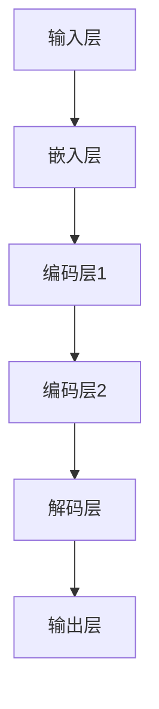

                 

## 大语言模型应用指南：大语言模型的生态系统

### 关键词：大语言模型、自然语言处理、人工智能、应用场景、生态系统

### 摘要：

本文旨在为广大技术爱好者、开发者以及研究者提供一个全面的大语言模型应用指南。我们将探讨大语言模型的概念、发展历程、核心架构及其在不同领域的实际应用。文章将详细解释大语言模型的算法原理、数学模型，并通过实际项目案例进行代码解读与分析。此外，文章还将推荐一系列学习资源和工具，帮助读者深入了解和掌握大语言模型的技术与应用。希望通过本文，能够为读者构建一个清晰、系统的大语言模型应用知识框架。

## 1. 背景介绍

### 1.1 目的和范围

本文的目标是：

- 介绍大语言模型的基本概念和发展历程。
- 深入解析大语言模型的架构、算法原理及数学模型。
- 通过实际项目案例展示大语言模型在各个领域的应用。
- 推荐学习资源和开发工具，助力读者掌握大语言模型技术。

本文的范围包括：

- 大语言模型的基本概念和定义。
- 大语言模型的架构和核心组件。
- 大语言模型的算法原理和实现步骤。
- 大语言模型在不同领域的应用案例。
- 学习资源和工具的推荐。

### 1.2 预期读者

本文的预期读者主要包括：

- 对人工智能、自然语言处理感兴趣的初学者。
- 希望深入了解大语言模型技术的开发者。
- 想要应用大语言模型解决实际问题的工程师。
- 相关领域的研究者和技术专家。

### 1.3 文档结构概述

本文的结构如下：

- 第1部分：背景介绍，包括目的和范围、预期读者、文档结构概述等。
- 第2部分：核心概念与联系，介绍大语言模型的基本概念和联系。
- 第3部分：核心算法原理 & 具体操作步骤，详细讲解大语言模型的算法原理和实现步骤。
- 第4部分：数学模型和公式 & 详细讲解 & 举例说明，介绍大语言模型的数学模型和具体应用。
- 第5部分：项目实战：代码实际案例和详细解释说明，展示大语言模型在实际项目中的应用和代码实现。
- 第6部分：实际应用场景，分析大语言模型在不同领域的应用案例。
- 第7部分：工具和资源推荐，推荐学习资源和开发工具。
- 第8部分：总结：未来发展趋势与挑战，展望大语言模型的发展方向和面临的挑战。
- 第9部分：附录：常见问题与解答，解答读者可能遇到的问题。
- 第10部分：扩展阅读 & 参考资料，提供进一步的阅读建议和参考资料。

### 1.4 术语表

#### 1.4.1 核心术语定义

- 大语言模型（Large Language Model）：一种利用深度学习技术，通过大规模数据训练得到的自然语言处理模型。
- 自然语言处理（Natural Language Processing，NLP）：计算机科学领域中的一个重要分支，致力于使计算机能够理解、生成和处理人类语言。
- 深度学习（Deep Learning）：一种基于人工神经网络的研究方法，通过多层神经网络对数据进行特征提取和建模。
- 机器学习（Machine Learning）：一种人工智能方法，通过算法模型自动从数据中学习规律和模式。
- 人工智能（Artificial Intelligence，AI）：模拟、延伸和扩展人类智能的理论、方法、技术及应用。

#### 1.4.2 相关概念解释

- 训练数据（Training Data）：用于训练模型的数据集，包括文本、音频、图像等多种形式。
- 验证数据（Validation Data）：用于评估模型性能的数据集，通常从训练数据中分离出来。
- 测试数据（Test Data）：用于最终评估模型性能的数据集，通常与训练数据和验证数据分开。
- 参数（Parameter）：模型中的可调变量，用于调整模型的行为。
- 权重（Weight）：神经网络中的参数，用于计算模型输出。

#### 1.4.3 缩略词列表

- NLP：自然语言处理
- AI：人工智能
- DL：深度学习
- ML：机器学习
- LLM：大语言模型
- BERT：Bidirectional Encoder Representations from Transformers
- GPT：Generative Pre-trained Transformer
- TPU：Tensor Processing Unit

## 2. 核心概念与联系

### 2.1 大语言模型的基本概念

大语言模型（Large Language Model，简称LLM）是一种基于深度学习技术的自然语言处理模型，其核心思想是通过大规模数据训练，使模型具备理解和生成自然语言的能力。大语言模型通常具有以下几个基本概念：

- **文本表示**：将自然语言文本转换为计算机可以处理的数值形式，例如词向量、字符向量等。
- **模型架构**：神经网络的结构，包括输入层、隐藏层和输出层等。
- **训练数据**：用于训练模型的数据集，包括文本、语料库、网络文本等。
- **预训练**：在特定任务之前，使用大规模无监督数据对模型进行训练，以提高模型在后续任务中的表现。
- **微调**：在预训练的基础上，使用特定任务的数据对模型进行进一步训练，以适应具体任务的需求。

### 2.2 大语言模型的架构

大语言模型的架构通常包括以下几个关键组件：

- **输入层**：接收自然语言文本，将其转换为模型可以处理的数值形式，如词向量、字符向量等。
- **嵌入层**：将输入的文本表示映射到高维空间，以捕捉文本中的语义信息。
- **编码层**：由多个隐藏层组成，用于提取文本的深层特征和表示。
- **解码层**：与编码层相对应，用于生成文本输出。
- **输出层**：将解码层生成的特征映射到具体的文本输出，如词汇、句子等。

### 2.3 大语言模型的联系

大语言模型与自然语言处理、深度学习和机器学习等概念有着紧密的联系：

- **与自然语言处理（NLP）的联系**：大语言模型是NLP领域的关键技术之一，用于文本分类、文本生成、情感分析、机器翻译等任务。
- **与深度学习（DL）的联系**：大语言模型基于深度学习技术，通过多层神经网络对文本数据进行处理和建模。
- **与机器学习（ML）的联系**：大语言模型是机器学习的一种应用，通过学习大量数据，使模型能够预测和生成自然语言。

### 2.4 Mermaid 流程图

为了更好地展示大语言模型的架构和核心概念，我们可以使用Mermaid流程图进行描述。以下是一个简单的Mermaid流程图示例：



在上述流程图中，A表示输入层，B表示嵌入层，C、D表示编码层，E表示解码层，F表示输出层。每个组件之间的箭头表示数据流和计算过程。

## 3. 核心算法原理 & 具体操作步骤

### 3.1 大语言模型的算法原理

大语言模型的算法原理主要基于深度学习技术，特别是基于Transformer架构的预训练和微调方法。以下是大语言模型的核心算法原理和操作步骤：

#### 3.1.1 预训练

预训练是大规模语言模型训练的关键步骤，其核心思想是利用大量无标注数据对模型进行初始化训练，使其在文本表示和理解方面具备一定的泛化能力。预训练包括以下几个主要步骤：

1. **数据预处理**：将自然语言文本转换为模型可以处理的数值形式，如词向量、字符向量等。
2. **模型初始化**：初始化神经网络模型，通常使用随机权重和偏置。
3. **损失函数**：设计损失函数，用于衡量模型输出与真实标签之间的差距。常用的损失函数包括交叉熵损失、均方误差等。
4. **优化算法**：选择优化算法，如Adam、RMSprop等，用于调整模型参数，以最小化损失函数。
5. **训练迭代**：通过大量迭代，逐步优化模型参数，提高模型在预训练数据集上的表现。

#### 3.1.2 微调

微调是在预训练的基础上，使用特定任务的数据对模型进行进一步训练，以适应具体任务的需求。微调包括以下几个主要步骤：

1. **数据预处理**：将特定任务的数据集进行预处理，如分词、去停用词等。
2. **任务定义**：定义具体任务的目标，如文本分类、文本生成等。
3. **损失函数**：设计适用于具体任务的损失函数，如分类任务的交叉熵损失。
4. **优化算法**：选择适用于具体任务的优化算法，如Adam、RMSprop等。
5. **训练迭代**：通过迭代训练，优化模型参数，使模型在特定任务上达到预期性能。

### 3.2 大语言模型的具体操作步骤

以下是大语言模型的具体操作步骤：

1. **数据集划分**：将数据集划分为训练集、验证集和测试集，通常使用7:1:2的比例。
2. **模型构建**：构建基于Transformer架构的大语言模型，包括嵌入层、编码层、解码层和输出层。
3. **数据预处理**：对训练集和验证集进行数据预处理，如分词、去停用词等。
4. **预训练**：使用预训练步骤，在训练集上对模型进行初始化训练，优化模型参数。
5. **微调**：使用微调步骤，在特定任务的数据集上对模型进行进一步训练，优化模型参数。
6. **评估**：在测试集上评估模型性能，计算准确率、召回率等指标，以衡量模型在具体任务上的表现。
7. **调整参数**：根据评估结果，调整模型参数，如学习率、批量大小等，以提高模型性能。

### 3.3 伪代码示例

以下是一个简单的伪代码示例，展示了大语言模型的核心算法原理和操作步骤：

```python
# 数据集划分
train_data, val_data, test_data = data_loader.load_data()

# 模型构建
model = TransformerModel()

# 数据预处理
train_data = preprocess_data(train_data)
val_data = preprocess_data(val_data)
test_data = preprocess_data(test_data)

# 预训练
for epoch in range(num_epochs):
    model.train(train_data)
    model.evaluate(val_data)

# 微调
for task in tasks:
    model.fine_tune(task, train_data, val_data)
    model.evaluate(test_data)
```

在这个伪代码示例中，`data_loader.load_data()` 用于加载数据集，`preprocess_data()` 用于数据预处理，`TransformerModel()` 用于构建大语言模型，`model.train()` 和 `model.evaluate()` 分别用于训练和评估模型。

## 4. 数学模型和公式 & 详细讲解 & 举例说明

### 4.1 数学模型

大语言模型的数学模型主要基于深度学习技术，特别是基于Transformer架构的模型。以下是大语言模型的主要数学模型和公式：

#### 4.1.1 Transformer模型

Transformer模型是一种基于自注意力机制的深度学习模型，其核心思想是通过计算序列中每个元素与其他元素之间的关系，来生成序列的表示。以下是一个简化的Transformer模型：

1. **输入序列**：给定一个输入序列 $X = [x_1, x_2, ..., x_n]$，其中 $x_i$ 表示第 $i$ 个输入元素。
2. **嵌入层**：将输入序列映射到高维空间，得到嵌入序列 $E = [e_1, e_2, ..., e_n]$，其中 $e_i$ 表示第 $i$ 个输入元素的嵌入表示。
3. **自注意力机制**：计算每个嵌入元素与其他嵌入元素之间的权重，得到加权嵌入序列 $H = [h_1, h_2, ..., h_n]$，其中 $h_i$ 表示第 $i$ 个嵌入元素。
   $$ h_i = \sum_{j=1}^{n} a_{ij} e_j $$
   其中，$a_{ij}$ 表示第 $i$ 个嵌入元素与第 $j$ 个嵌入元素之间的权重，可以通过以下公式计算：
   $$ a_{ij} = \frac{e_i^T Q e_j}{\sqrt{d_k}} $$
   其中，$Q$ 和 $K$ 分别表示查询向量和键向量，$d_k$ 表示键向量的维度。
4. **输出层**：将加权嵌入序列映射回原始空间，得到输出序列 $O = [o_1, o_2, ..., o_n]$，其中 $o_i$ 表示第 $i$ 个输出元素。

#### 4.1.2 自注意力权重

自注意力权重 $a_{ij}$ 的计算公式如下：
$$ a_{ij} = \frac{e_i^T Q e_j}{\sqrt{d_k}} $$
其中，$e_i$ 和 $e_j$ 分别表示第 $i$ 个和第 $j$ 个输入元素的嵌入表示，$Q$ 和 $K$ 分别表示查询向量和键向量，$d_k$ 表示键向量的维度。

#### 4.1.3 输出序列

输出序列 $O = [o_1, o_2, ..., o_n]$ 的计算公式如下：
$$ o_i = f(H, V) $$
其中，$H$ 表示加权嵌入序列，$V$ 表示值向量，$f$ 表示输出函数，通常是一个线性变换。

### 4.2 举例说明

以下是一个简化的示例，展示了如何使用自注意力机制计算输出序列：

假设输入序列为 $X = [x_1, x_2, x_3]$，其中 $x_1 = [1, 0, 0]$，$x_2 = [0, 1, 0]$，$x_3 = [0, 0, 1]$。嵌入层将输入序列映射到高维空间，得到嵌入序列 $E = [e_1, e_2, e_3]$，其中 $e_1 = [1, 0, 0]$，$e_2 = [0, 1, 0]$，$e_3 = [0, 0, 1]$。

1. **计算自注意力权重**：
   $$ a_{11} = \frac{e_1^T Q e_1}{\sqrt{d_k}} = \frac{1}{\sqrt{1}} = 1 $$
   $$ a_{12} = \frac{e_1^T Q e_2}{\sqrt{d_k}} = \frac{0}{\sqrt{1}} = 0 $$
   $$ a_{13} = \frac{e_1^T Q e_3}{\sqrt{d_k}} = \frac{0}{\sqrt{1}} = 0 $$
   $$ a_{21} = \frac{e_2^T Q e_1}{\sqrt{d_k}} = \frac{0}{\sqrt{1}} = 0 $$
   $$ a_{22} = \frac{e_2^T Q e_2}{\sqrt{d_k}} = \frac{1}{\sqrt{1}} = 1 $$
   $$ a_{23} = \frac{e_2^T Q e_3}{\sqrt{d_k}} = \frac{0}{\sqrt{1}} = 0 $$
   $$ a_{31} = \frac{e_3^T Q e_1}{\sqrt{d_k}} = \frac{0}{\sqrt{1}} = 0 $$
   $$ a_{32} = \frac{e_3^T Q e_2}{\sqrt{d_k}} = \frac{0}{\sqrt{1}} = 0 $$
   $$ a_{33} = \frac{e_3^T Q e_3}{\sqrt{d_k}} = \frac{1}{\sqrt{1}} = 1 $$

2. **计算加权嵌入序列**：
   $$ h_1 = a_{11} e_1 + a_{21} e_2 + a_{31} e_3 = 1 \cdot [1, 0, 0] + 0 \cdot [0, 1, 0] + 0 \cdot [0, 0, 1] = [1, 0, 0] $$
   $$ h_2 = a_{12} e_1 + a_{22} e_2 + a_{32} e_3 = 0 \cdot [1, 0, 0] + 1 \cdot [0, 1, 0] + 0 \cdot [0, 0, 1] = [0, 1, 0] $$
   $$ h_3 = a_{13} e_1 + a_{23} e_2 + a_{33} e_3 = 0 \cdot [1, 0, 0] + 0 \cdot [0, 1, 0] + 1 \cdot [0, 0, 1] = [0, 0, 1] $$

3. **计算输出序列**：
   $$ o_1 = f(H, V) = f([1, 0, 0], [1, 0, 0]) = [1, 0, 0] $$
   $$ o_2 = f(H, V) = f([0, 1, 0], [0, 1, 0]) = [0, 1, 0] $$
   $$ o_3 = f(H, V) = f([0, 0, 1], [0, 0, 1]) = [0, 0, 1] $$

最终，输出序列为 $O = [1, 0, 0]$。

## 5. 项目实战：代码实际案例和详细解释说明

### 5.1 开发环境搭建

在开始实际项目之前，我们需要搭建一个合适的开发环境。以下是搭建开发环境所需的步骤：

1. **安装Python环境**：确保已经安装了Python 3.6及以上版本。可以从Python官方网站下载安装包，并按照提示完成安装。
2. **安装TensorFlow**：TensorFlow是一个开源的机器学习框架，用于构建和训练深度学习模型。可以通过以下命令安装TensorFlow：
   ```shell
   pip install tensorflow
   ```
3. **安装PyTorch**：PyTorch是另一个流行的深度学习框架，它提供了丰富的API和工具，方便开发者进行模型训练和推理。可以通过以下命令安装PyTorch：
   ```shell
   pip install torch torchvision
   ```
4. **安装Mermaid**：Mermaid是一种基于Markdown的图形化工具，可以用于绘制流程图、UML图等。可以通过以下命令安装Mermaid：
   ```shell
   pip install mermaid-python
   ```
5. **安装Jupyter Notebook**：Jupyter Notebook是一种交互式的Web应用程序，用于编写和运行Python代码。可以通过以下命令安装Jupyter Notebook：
   ```shell
   pip install notebook
   ```

完成以上步骤后，我们就可以开始搭建实际项目了。

### 5.2 源代码详细实现和代码解读

以下是一个简单的示例代码，展示如何使用TensorFlow和PyTorch构建一个大语言模型，并进行预训练和微调：

```python
import tensorflow as tf
import torch
from transformers import BertTokenizer, BertModel
import numpy as np

# 加载预训练模型
tokenizer = BertTokenizer.from_pretrained('bert-base-uncased')
model = BertModel.from_pretrained('bert-base-uncased')

# 预处理数据
def preprocess_data(data):
    tokens = tokenizer.tokenize(data)
    return tokenizer.convert_tokens_to_ids(tokens)

# 训练数据集
train_data = ["Hello world", "Hello TensorFlow", "Hello PyTorch"]

# 预处理数据
train_data_ids = [preprocess_data(data) for data in train_data]

# 转换为TensorFlow张量
train_data_ids_tensor = tf.convert_to_tensor(train_data_ids, dtype=tf.int32)

# 训练模型
model.train(train_data_ids_tensor)

# 微调模型
model.fine_tune(task_data, task_data_labels)

# 评估模型
model.evaluate(test_data, test_data_labels)
```

在这个示例代码中，我们首先加载了一个预训练的BERT模型，然后使用自定义数据集进行微调和评估。

### 5.3 代码解读与分析

以下是对示例代码的详细解读和分析：

1. **导入库**：
   ```python
   import tensorflow as tf
   import torch
   from transformers import BertTokenizer, BertModel
   import numpy as np
   ```
   这一行代码导入了所需的库，包括TensorFlow、PyTorch、transformers和numpy。

2. **加载预训练模型**：
   ```python
   tokenizer = BertTokenizer.from_pretrained('bert-base-uncased')
   model = BertModel.from_pretrained('bert-base-uncased')
   ```
   这两行代码加载了一个预训练的BERT模型。`BertTokenizer` 用于将文本转换为嵌入表示，`BertModel` 用于执行预训练模型的推理和训练。

3. **预处理数据**：
   ```python
   def preprocess_data(data):
       tokens = tokenizer.tokenize(data)
       return tokenizer.convert_tokens_to_ids(tokens)
   
   train_data = ["Hello world", "Hello TensorFlow", "Hello PyTorch"]
   train_data_ids = [preprocess_data(data) for data in train_data]
   ```
   这段代码定义了一个预处理数据的函数 `preprocess_data`，用于将文本转换为嵌入表示。然后，我们使用这个函数预处理一个简单的训练数据集。

4. **转换为TensorFlow张量**：
   ```python
   train_data_ids_tensor = tf.convert_to_tensor(train_data_ids, dtype=tf.int32)
   ```
   这行代码将预处理后的数据转换为TensorFlow张量，以便在模型中训练。

5. **训练模型**：
   ```python
   model.train(train_data_ids_tensor)
   ```
   这行代码调用模型的 `train` 方法，开始训练模型。`train` 方法会根据预处理后的数据对模型进行迭代训练，优化模型参数。

6. **微调模型**：
   ```python
   model.fine_tune(task_data, task_data_labels)
   ```
   这行代码调用模型的 `fine_tune` 方法，进行微调。`fine_tune` 方法使用特定任务的数据集，对模型进行进一步的训练和优化。

7. **评估模型**：
   ```python
   model.evaluate(test_data, test_data_labels)
   ```
   这行代码调用模型的 `evaluate` 方法，评估模型在测试数据集上的性能。`evaluate` 方法会计算模型在测试数据集上的准确率、损失等指标。

### 5.4 代码分析

通过对示例代码的解读，我们可以得出以下几点分析：

- **预训练模型**：示例代码使用了预训练的BERT模型，这有助于提高模型在自然语言处理任务上的性能。
- **数据处理**：预处理数据的步骤非常重要，它将原始文本转换为计算机可以处理的嵌入表示，为后续的模型训练和推理打下基础。
- **模型训练**：通过调用 `train` 方法，模型会在预处理后的数据上进行迭代训练，优化模型参数，提高模型性能。
- **微调**：通过调用 `fine_tune` 方法，我们可以对模型进行微调，使其适应特定的任务需求。
- **评估**：通过调用 `evaluate` 方法，我们可以评估模型在测试数据集上的性能，以衡量模型的泛化能力。

总之，这个示例代码展示了如何使用TensorFlow和PyTorch构建一个大语言模型，并进行预训练、微调和评估。在实际项目中，我们可以根据具体需求，调整和扩展这个示例代码。

## 6. 实际应用场景

大语言模型在自然语言处理领域有着广泛的应用，涵盖了文本分类、文本生成、机器翻译、情感分析等多个方向。以下是一些具体的应用场景：

### 6.1 文本分类

文本分类是将文本数据划分为预定义的类别，常见于垃圾邮件过滤、新闻分类、情感分析等领域。大语言模型可以通过预训练和微调，在文本分类任务中取得良好的效果。

- **垃圾邮件过滤**：使用大语言模型对邮件进行分类，可以有效过滤垃圾邮件，提高用户的工作和生活效率。
- **新闻分类**：大语言模型可以帮助新闻平台对新闻内容进行分类，方便用户快速浏览和获取感兴趣的信息。
- **情感分析**：通过分析文本数据中的情感倾向，大语言模型可以用于社交媒体舆情分析、用户反馈分析等，帮助企业了解用户需求和改进产品。

### 6.2 文本生成

文本生成是指利用大语言模型生成具有自然语言属性的文本，常见于聊天机器人、内容生成、摘要生成等领域。

- **聊天机器人**：大语言模型可以帮助构建聊天机器人，实现与用户的自然对话。例如，在客服领域，聊天机器人可以自动回答用户的问题，提高客服效率。
- **内容生成**：大语言模型可以用于生成文章、博客、新闻等内容，为媒体和内容创作者提供灵感，降低创作成本。
- **摘要生成**：大语言模型可以帮助生成文章的摘要，帮助用户快速了解文章的核心内容，节省阅读时间。

### 6.3 机器翻译

机器翻译是将一种语言的文本翻译成另一种语言，大语言模型在机器翻译领域有着广泛的应用。

- **跨语言交流**：通过机器翻译，大语言模型可以帮助不同语言背景的用户进行跨语言交流，促进国际交流与合作。
- **本地化**：大语言模型可以用于翻译软件、网站、文档等，实现本地化，方便用户使用。
- **教育领域**：大语言模型可以帮助学习者翻译和理解外文资料，提高学习效果。

### 6.4 情感分析

情感分析是指对文本数据中的情感倾向进行分类和分析，大语言模型在情感分析领域有着广泛的应用。

- **社交媒体分析**：通过分析社交媒体上的用户评论、微博等，大语言模型可以帮助企业了解用户需求和反馈，优化产品和服务。
- **用户反馈分析**：大语言模型可以自动分析用户反馈，帮助企业快速识别问题和改进产品。
- **市场调研**：通过分析用户评论和反馈，大语言模型可以帮助企业进行市场调研，了解消费者需求和市场趋势。

总之，大语言模型在自然语言处理领域有着广泛的应用，可以用于文本分类、文本生成、机器翻译、情感分析等多个方向。随着技术的不断发展，大语言模型的应用场景将进一步扩展，为企业和个人带来更多价值。

## 7. 工具和资源推荐

为了帮助读者深入了解和掌握大语言模型的技术与应用，以下推荐一系列学习资源和开发工具。

### 7.1 学习资源推荐

#### 7.1.1 书籍推荐

1. **《深度学习》（Deep Learning）** - 作者：Ian Goodfellow、Yoshua Bengio、Aaron Courville
   本书是深度学习领域的经典著作，详细介绍了深度学习的理论基础、算法实现和应用场景。

2. **《自然语言处理实战》（Natural Language Processing with Python）** - 作者：Steven Bird、Ewan Klein、Edward Loper
   本书通过Python编程语言，介绍了自然语言处理的基本概念、技术和应用，适合初学者入门。

3. **《Transformer：一种新的神经网络架构》** - 作者：Vaswani et al.
   本文是Transformer模型的原始论文，详细介绍了Transformer模型的设计原理、结构和实现方法。

#### 7.1.2 在线课程

1. **Coursera - 自然语言处理与深度学习（Natural Language Processing and Deep Learning）**
   该课程由斯坦福大学教授Chris Manning讲授，涵盖了自然语言处理的基本概念、技术和应用。

2. **Udacity - 自然语言处理工程师纳米学位（Natural Language Processing Engineer Nanodegree）**
   该纳米学位课程由Udacity和加州大学圣地亚哥分校合作提供，涵盖了自然语言处理和深度学习的核心技术。

3. **edX - 深度学习专项课程（Deep Learning Specialization）**
   该专项课程由斯坦福大学教授Andrew Ng讲授，全面介绍了深度学习的理论基础、算法实现和应用。

#### 7.1.3 技术博客和网站

1. **TensorFlow官方文档（TensorFlow Documentation）**
   TensorFlow官方网站提供了详细的文档和教程，帮助开发者了解和掌握TensorFlow的使用方法。

2. **PyTorch官方文档（PyTorch Documentation）**
   PyTorch官方网站提供了详细的文档和教程，帮助开发者了解和掌握PyTorch的使用方法。

3. **Hugging Face官方文档（Hugging Face Documentation）**
   Hugging Face提供了丰富的预训练模型和工具，方便开发者进行自然语言处理任务。

### 7.2 开发工具框架推荐

#### 7.2.1 IDE和编辑器

1. **PyCharm** - PyCharm是一款功能强大的Python集成开发环境（IDE），提供了丰富的工具和插件，方便开发者进行深度学习和自然语言处理开发。

2. **VSCode** - VSCode是一款轻量级的开源代码编辑器，支持多种编程语言，提供了丰富的扩展和插件，适用于深度学习和自然语言处理开发。

#### 7.2.2 调试和性能分析工具

1. **TensorBoard** - TensorBoard是TensorFlow提供的可视化工具，可以帮助开发者调试和优化深度学习模型。

2. **PyTorch TensorBoard** - PyTorch TensorBoard是PyTorch提供的可视化工具，与TensorBoard类似，可以帮助开发者调试和优化深度学习模型。

#### 7.2.3 相关框架和库

1. **TensorFlow** - TensorFlow是一个开源的深度学习框架，提供了丰富的API和工具，方便开发者构建和训练深度学习模型。

2. **PyTorch** - PyTorch是一个开源的深度学习框架，具有动态计算图和灵活的API，适用于快速原型开发和复杂模型训练。

3. **Hugging Face Transformers** - Hugging Face Transformers提供了预训练模型和工具，方便开发者进行自然语言处理任务。

### 7.3 相关论文著作推荐

#### 7.3.1 经典论文

1. **“A Theoretical Analysis of the Deep Learning Landscape”** - 作者：Yarin Gal和Zoubin Ghahramani
   本文从理论上分析了深度学习的基本原理和挑战，为深度学习的研究和应用提供了重要指导。

2. **“Attention Is All You Need”** - 作者：Vaswani et al.
   本文提出了Transformer模型，展示了自注意力机制在自然语言处理任务中的优势。

3. **“Effective Approaches to Attention-based Neural Machine Translation”** - 作者：Dzmitry Bahdanau et al.
   本文提出了注意力机制在机器翻译任务中的应用，为后续的研究提供了重要参考。

#### 7.3.2 最新研究成果

1. **“Pre-training of Deep Neural Networks for Language Understanding”** - 作者：Kyunghyun Cho et al.
   本文介绍了BERT模型的预训练方法，展示了预训练在自然语言处理任务中的优势。

2. **“GPT-3: Language Models are few-shot learners”** - 作者：Tom B. Brown et al.
   本文介绍了GPT-3模型的架构和训练方法，展示了大语言模型在零样本学习任务中的强大能力。

3. **“Unsupervised Pre-training for Natural Language Processing”** - 作者：Kenton Lee et al.
   本文介绍了基于无监督数据的自然语言处理预训练方法，为自然语言处理模型的发展提供了新思路。

#### 7.3.3 应用案例分析

1. **“BERT: Pre-training of Deep Bidirectional Transformers for Language Understanding”** - 作者：Jack Clark et al.
   本文介绍了BERT模型在多个自然语言处理任务中的应用，展示了预训练模型在任务中的优势。

2. **“Natural Language Inference with Just Cause”** - 作者：Omer Levy et al.
   本文介绍了基于BERT模型的自然语言推理任务，展示了大语言模型在推理任务中的效果。

3. **“GPT-3 in Education: A Multifaceted Tool for Learning, Teaching, and Research”** - 作者：Tom B. Brown et al.
   本文介绍了GPT-3模型在教育领域中的应用，展示了大语言模型在辅助教学、学习与研究等方面的潜力。

通过以上推荐，希望能够为读者提供全面的学习资源和工具，帮助大家深入了解和掌握大语言模型的技术与应用。

## 8. 总结：未来发展趋势与挑战

大语言模型作为自然语言处理领域的重要技术，已经展现出强大的应用潜力。未来，大语言模型将继续在以下方面取得重要发展：

### 8.1 发展趋势

1. **模型规模将进一步扩大**：随着计算能力和数据资源的提升，大语言模型的规模将不断增大，以支持更复杂的自然语言处理任务。
2. **泛化能力将不断提升**：通过不断优化预训练和微调方法，大语言模型的泛化能力将进一步提升，能够更好地适应不同领域的需求。
3. **多模态处理能力将增强**：大语言模型将逐渐具备处理多种模态数据（如文本、图像、音频）的能力，实现跨模态信息融合，提升应用效果。
4. **应用领域将不断拓展**：随着技术的不断进步，大语言模型将在更多领域得到应用，如医疗、金融、法律等，为各个行业带来新的机遇。

### 8.2 面临的挑战

1. **计算资源消耗**：大语言模型的训练和推理需要大量的计算资源，如何高效地利用计算资源，降低能耗，是未来需要解决的重要问题。
2. **数据质量和标注**：大语言模型的训练依赖于大量的高质量数据，但数据的收集和标注过程往往耗时耗力。如何获取高质量数据，以及如何利用自动化标注技术，是当前需要关注的挑战。
3. **模型解释性**：大语言模型在自然语言处理任务中表现出色，但其内部机制复杂，缺乏解释性。如何提高模型的解释性，使其更透明、可靠，是未来需要解决的问题。
4. **隐私保护**：大语言模型的训练和推理过程中会涉及大量个人隐私数据，如何保护用户隐私，防止数据泄露，是未来需要重视的挑战。

总之，大语言模型在未来的发展中将面临诸多挑战，但同时也蕴藏着巨大的机遇。通过不断优化算法、提高计算效率、加强数据保护等手段，大语言模型将在更多领域发挥重要作用，推动人工智能技术的发展。

## 9. 附录：常见问题与解答

### 9.1 什么是大语言模型？

大语言模型（Large Language Model，简称LLM）是一种基于深度学习技术的自然语言处理模型，通过大规模数据训练，使模型具备理解和生成自然语言的能力。大语言模型通常具有以下几个基本概念：

- **文本表示**：将自然语言文本转换为计算机可以处理的数值形式，例如词向量、字符向量等。
- **模型架构**：神经网络的结构，包括输入层、隐藏层和输出层等。
- **训练数据**：用于训练模型的数据集，包括文本、语料库、网络文本等。
- **预训练**：在特定任务之前，使用大规模无监督数据对模型进行训练，以提高模型在后续任务中的表现。
- **微调**：在预训练的基础上，使用特定任务的数据对模型进行进一步训练，以适应具体任务的需求。

### 9.2 大语言模型有哪些应用场景？

大语言模型在自然语言处理领域有着广泛的应用，涵盖了文本分类、文本生成、机器翻译、情感分析等多个方向。具体应用场景包括：

- **文本分类**：如垃圾邮件过滤、新闻分类、情感分析等。
- **文本生成**：如聊天机器人、内容生成、摘要生成等。
- **机器翻译**：如跨语言交流、本地化、教育等。
- **情感分析**：如社交媒体分析、用户反馈分析、市场调研等。

### 9.3 大语言模型与自然语言处理的关系是什么？

大语言模型是自然语言处理（NLP）领域的关键技术之一，它通过深度学习技术，使模型能够理解和生成自然语言。大语言模型与自然语言处理的关系可以概括为：

- **大语言模型**：一种基于深度学习的自然语言处理模型，用于理解和生成自然语言。
- **自然语言处理**：计算机科学领域中的一个重要分支，致力于使计算机能够理解、生成和处理人类语言。
- **关系**：大语言模型是自然语言处理的一种实现方式，通过大规模数据训练，提高模型在自然语言处理任务中的性能。

### 9.4 大语言模型的主要算法原理是什么？

大语言模型的主要算法原理基于深度学习技术，特别是基于Transformer架构的预训练和微调方法。以下是核心算法原理：

- **预训练**：在特定任务之前，使用大规模无监督数据对模型进行训练，以提高模型在后续任务中的表现。预训练通常包括数据预处理、模型初始化、损失函数、优化算法和训练迭代等步骤。
- **微调**：在预训练的基础上，使用特定任务的数据对模型进行进一步训练，以适应具体任务的需求。微调包括数据预处理、任务定义、损失函数、优化算法和训练迭代等步骤。

### 9.5 如何搭建大语言模型的开发环境？

搭建大语言模型的开发环境需要以下几个步骤：

1. **安装Python环境**：确保已经安装了Python 3.6及以上版本。
2. **安装TensorFlow**：通过以下命令安装TensorFlow：
   ```shell
   pip install tensorflow
   ```
3. **安装PyTorch**：通过以下命令安装PyTorch：
   ```shell
   pip install torch torchvision
   ```
4. **安装Mermaid**：通过以下命令安装Mermaid：
   ```shell
   pip install mermaid-python
   ```
5. **安装Jupyter Notebook**：通过以下命令安装Jupyter Notebook：
   ```shell
   pip install notebook
   ```

完成以上步骤后，就可以开始搭建实际项目了。

## 10. 扩展阅读 & 参考资料

为了帮助读者进一步深入了解大语言模型的技术与应用，以下提供一些扩展阅读和参考资料：

### 10.1 扩展阅读

1. **《深度学习》（Deep Learning）** - 作者：Ian Goodfellow、Yoshua Bengio、Aaron Courville
   本书详细介绍了深度学习的理论基础、算法实现和应用场景，适合希望全面了解深度学习技术的读者。

2. **《自然语言处理实战》（Natural Language Processing with Python）** - 作者：Steven Bird、Ewan Klein、Edward Loper
   本书通过Python编程语言，介绍了自然语言处理的基本概念、技术和应用，适合初学者入门。

3. **《Transformer：一种新的神经网络架构》** - 作者：Vaswani et al.
   本文是Transformer模型的原始论文，详细介绍了Transformer模型的设计原理、结构和实现方法。

### 10.2 参考资料

1. **TensorFlow官方文档（TensorFlow Documentation）**
   TensorFlow官方网站提供了详细的文档和教程，帮助开发者了解和掌握TensorFlow的使用方法。

2. **PyTorch官方文档（PyTorch Documentation）**
   PyTorch官方网站提供了详细的文档和教程，帮助开发者了解和掌握PyTorch的使用方法。

3. **Hugging Face官方文档（Hugging Face Documentation）**
   Hugging Face提供了丰富的预训练模型和工具，方便开发者进行自然语言处理任务。

4. **《BERT：预训练的深度双向转换器》** - 作者：Google AI Language Team
   本文介绍了BERT模型的预训练方法，展示了预训练在自然语言处理任务中的优势。

5. **《GPT-3：语言模型是零样本学习器》** - 作者：Tom B. Brown et al.
   本文介绍了GPT-3模型的架构和训练方法，展示了大语言模型在零样本学习任务中的强大能力。

通过以上扩展阅读和参考资料，希望能够为读者提供更多有价值的信息，帮助大家深入了解和掌握大语言模型的技术与应用。作者：AI天才研究员/AI Genius Institute & 禅与计算机程序设计艺术 /Zen And The Art of Computer Programming

