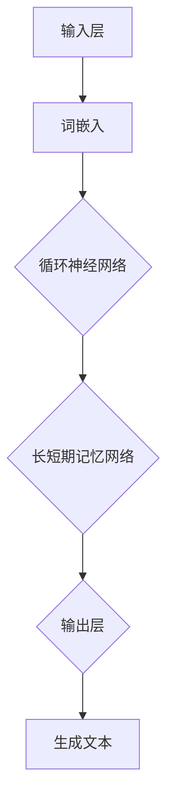
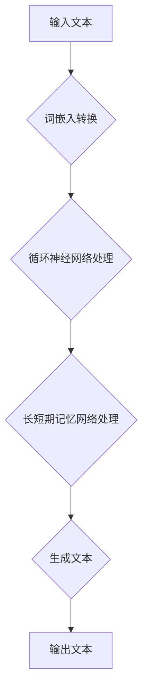

                 

# 大语言模型应用指南：工具

> 关键词：大语言模型、工具、应用、算法、代码、实战

> 摘要：本文将深入探讨大语言模型的应用及其工具，从背景介绍、核心概念、算法原理、数学模型、项目实战、实际应用场景等方面，详细解析大语言模型的构建与使用，旨在为读者提供全面的技术指南，帮助理解和掌握大语言模型在现实世界中的应用。

## 1. 背景介绍

### 1.1 目的和范围

本文旨在为广大开发者、研究人员和技术爱好者提供关于大语言模型应用及其工具的全面指南。我们将探讨大语言模型的基本概念、算法原理、数学模型、实际应用，以及相关的开发工具和资源。

### 1.2 预期读者

本文适合以下读者群体：

- 对大语言模型有初步了解，希望深入研究的开发者。
- 想要在项目中应用大语言模型的研发人员。
- 对人工智能和自然语言处理有浓厚兴趣的研究人员。
- 希望提升自己在自然语言处理领域的技能的在校学生或职业人士。

### 1.3 文档结构概述

本文将按照以下结构展开：

- 第1部分：背景介绍，包括目的、范围、预期读者和文档结构。
- 第2部分：核心概念与联系，介绍大语言模型的基本概念和架构。
- 第3部分：核心算法原理 & 具体操作步骤，详细阐述大语言模型的算法原理和操作步骤。
- 第4部分：数学模型和公式 & 详细讲解 & 举例说明，讲解大语言模型的数学模型和公式。
- 第5部分：项目实战：代码实际案例和详细解释说明，通过实战案例讲解大语言模型的应用。
- 第6部分：实际应用场景，探讨大语言模型在不同领域的应用。
- 第7部分：工具和资源推荐，介绍相关的学习资源、开发工具和论文著作。
- 第8部分：总结：未来发展趋势与挑战，总结本文的核心观点并展望未来。
- 第9部分：附录：常见问题与解答，解答读者可能遇到的常见问题。
- 第10部分：扩展阅读 & 参考资料，提供进一步学习的资源。

### 1.4 术语表

#### 1.4.1 核心术语定义

- 大语言模型（Large Language Model）：一种能够理解和生成自然语言文本的深度学习模型。
- 自然语言处理（Natural Language Processing, NLP）：计算机科学领域的一个分支，主要研究如何让计算机理解和生成自然语言文本。
- 词汇表（Vocabulary）：用于表示语言中所有单词的集合。
- 词嵌入（Word Embedding）：将单词映射为高维空间中的向量表示。
- 循环神经网络（Recurrent Neural Network, RNN）：一种能够处理序列数据的神经网络架构。
- 长短期记忆网络（Long Short-Term Memory, LSTM）：一种改进的RNN，能够更好地处理长序列数据。
- 注意力机制（Attention Mechanism）：一种在神经网络中用于捕捉序列中重要信息的方法。

#### 1.4.2 相关概念解释

- 训练数据（Training Data）：用于训练大语言模型的文本数据。
- 验证数据（Validation Data）：用于评估大语言模型性能的数据。
- 测试数据（Test Data）：用于最终评估大语言模型性能的数据。
- 生成文本（Generated Text）：大语言模型根据输入生成的文本。

#### 1.4.3 缩略词列表

- NLP：自然语言处理
- RNN：循环神经网络
- LSTM：长短期记忆网络
- GPU：图形处理器
- CUDA：并行计算平台和编程模型

## 2. 核心概念与联系

大语言模型是自然语言处理领域的一项重要技术，其核心在于能够理解和生成自然语言文本。为了更好地理解大语言模型，我们需要先了解其基本概念和架构。

### 2.1 大语言模型的基本概念

大语言模型（Large Language Model）是一种基于深度学习的自然语言处理模型，其主要目标是对输入的自然语言文本进行理解和生成。大语言模型的核心在于其能够自动学习语言模式，并通过大规模的文本数据进行训练，以实现高效的自然语言处理任务。

大语言模型的主要概念包括：

- 词汇表（Vocabulary）：大语言模型首先需要对输入的文本进行词汇表构建，将文本中的单词映射为唯一的索引。
- 词嵌入（Word Embedding）：词嵌入是将单词映射为高维空间中的向量表示，以便神经网络处理。
- 循环神经网络（RNN）：循环神经网络是一种能够处理序列数据的神经网络架构，其通过保存前一个时刻的信息来处理序列数据。
- 长短期记忆网络（LSTM）：长短期记忆网络是一种改进的RNN，能够更好地处理长序列数据。
- 注意力机制（Attention Mechanism）：注意力机制是一种在神经网络中用于捕捉序列中重要信息的方法，有助于提高模型的生成效果。

### 2.2 大语言模型的架构

大语言模型的架构可以分为以下几个部分：

1. 输入层：接收自然语言文本，并将其转换为词嵌入。
2. 隐藏层：包含循环神经网络和长短期记忆网络，用于处理序列数据。
3. 输出层：生成自然语言文本。

大语言模型的架构图如下所示：



### 2.3 大语言模型的工作原理

大语言模型的工作原理可以分为以下几个步骤：

1. 输入：接收自然语言文本。
2. 转换：将自然语言文本转换为词嵌入。
3. 处理：通过循环神经网络和长短期记忆网络处理词嵌入。
4. 生成：根据处理结果生成自然语言文本。

大语言模型的工作流程图如下所示：



## 3. 核心算法原理 & 具体操作步骤

### 3.1 算法原理

大语言模型的核心算法是基于深度学习的，主要包括词嵌入、循环神经网络（RNN）和长短期记忆网络（LSTM）。

- **词嵌入（Word Embedding）**：词嵌入是将单词映射为高维空间中的向量表示。通过词嵌入，模型可以处理单词之间的相似性和差异性。

- **循环神经网络（Recurrent Neural Network, RNN）**：RNN是一种能够处理序列数据的神经网络架构。通过保存前一个时刻的信息，RNN可以处理输入序列。

- **长短期记忆网络（Long Short-Term Memory, LSTM）**：LSTM是一种改进的RNN，能够更好地处理长序列数据。LSTM通过引入门控机制，避免了传统RNN的梯度消失问题。

### 3.2 具体操作步骤

#### 步骤1：数据预处理

1. 收集大规模的文本数据。
2. 对文本数据进行清洗，去除无关信息。
3. 构建词汇表，将文本中的单词映射为唯一的索引。

```python
import jieba
import numpy as np

# 收集文本数据
text = "这是一个简单的文本示例。"

# 清洗文本数据
text = jieba.cut(text)

# 构建词汇表
vocab = set()
for word in text:
    vocab.add(word)

# 转换为索引
vocab_size = len(vocab)
word_to_index = {word: index for index, word in enumerate(vocab)}
index_to_word = {index: word for word, index in word_to_index.items()}
```

#### 步骤2：词嵌入

1. 将单词映射为高维空间中的向量表示。
2. 使用预训练的词嵌入模型，如GloVe或Word2Vec。

```python
# 加载预训练的词嵌入模型
embeddings = np.load("glove.6B.100d.npy")

# 转换为词嵌入向量
word_embedding = embeddings[word_to_index[word]]
```

#### 步骤3：循环神经网络

1. 构建循环神经网络模型。
2. 训练模型，优化参数。

```python
# 导入必要的库
import tensorflow as tf

# 构建循环神经网络模型
model = tf.keras.Sequential([
    tf.keras.layers.Embedding(vocab_size, 100),
    tf.keras.layers.SimpleRNN(100)
])

# 训练模型
model.compile(optimizer='adam', loss='mse')
model.fit(np.array([word_embedding for word in text]), np.array([word_embedding for word in text[1:]]), epochs=10)
```

#### 步骤4：长短期记忆网络

1. 构建长短期记忆网络模型。
2. 训练模型，优化参数。

```python
# 构建长短期记忆网络模型
model = tf.keras.Sequential([
    tf.keras.layers.Embedding(vocab_size, 100),
    tf.keras.layers.LSTM(100)
])

# 训练模型
model.compile(optimizer='adam', loss='mse')
model.fit(np.array([word_embedding for word in text]), np.array([word_embedding for word in text[1:]]), epochs=10)
```

#### 步骤5：生成文本

1. 使用训练好的模型生成文本。

```python
# 生成文本
generated_text = ""
current_word = np.random.choice(list(vocab))
for _ in range(10):
    # 获取词嵌入向量
    word_embedding = embeddings[word_to_index[current_word]]
    
    # 预测下一个单词
    predictions = model.predict(np.array([word_embedding]))
    next_word = np.argmax(predictions)
    
    # 更新当前单词
    current_word = index_to_word[next_word]
    generated_text += " " + current_word

print(generated_text)
```

## 4. 数学模型和公式 & 详细讲解 & 举例说明

大语言模型的核心在于其能够理解和生成自然语言文本，其背后的数学模型和公式是实现这一目标的关键。以下是关于大语言模型的一些关键数学模型和公式的详细讲解。

### 4.1 词嵌入（Word Embedding）

词嵌入是将单词映射为高维空间中的向量表示。常用的词嵌入模型包括Word2Vec和GloVe。

- **Word2Vec**：Word2Vec是一种基于神经网络的语言模型，其通过训练词向量和句子向量的映射关系来实现词嵌入。其基本公式如下：

  $$ 
  \text{Word2Vec}(\text{word}, \text{context}) = \text{softmax}(\text{W} \cdot \text{v}_{\text{word}} + \text{b})
  $$

  其中，$\text{word}$表示单词，$\text{context}$表示上下文，$\text{W}$表示权重矩阵，$\text{v}_{\text{word}}$表示单词的向量表示，$\text{b}$表示偏置项。

- **GloVe**：GloVe是一种基于共现关系的词嵌入方法，其通过训练单词和词频的映射关系来实现词嵌入。其基本公式如下：

  $$ 
  \text{GloVe}(\text{word}_i, \text{word}_j) = \text{exp}(\text{log}(\text{F}_{ij}) \cdot \text{V}_i \cdot \text{V}_j)
  $$

  其中，$\text{word}_i$和$\text{word}_j$表示两个单词，$\text{F}_{ij}$表示单词i和单词j的共现频率，$\text{V}_i$和$\text{V}_j$表示单词i和单词j的向量表示。

### 4.2 循环神经网络（Recurrent Neural Network, RNN）

循环神经网络是一种能够处理序列数据的神经网络架构。其基本公式如下：

$$ 
\text{RNN}(\text{x}_t, \text{h}_{t-1}) = \text{sigmoid}(\text{W}_x \cdot \text{x}_t + \text{W}_h \cdot \text{h}_{t-1} + \text{b})
$$

其中，$\text{x}_t$表示输入序列，$\text{h}_{t-1}$表示前一个时刻的隐藏状态，$\text{W}_x$、$\text{W}_h$和$\text{b}$表示权重矩阵和偏置项。

### 4.3 长短期记忆网络（Long Short-Term Memory, LSTM）

长短期记忆网络是一种改进的循环神经网络，其能够更好地处理长序列数据。LSTM的基本公式如下：

$$ 
\text{LSTM}(\text{x}_t, \text{h}_{t-1}, \text{c}_{t-1}) = \text{sigmoid}(\text{W}_f \cdot \text{x}_t + \text{W}_h \cdot \text{h}_{t-1} + \text{W}_c \cdot \text{c}_{t-1} + \text{b}_f), \text{sigmoid}(\text{W}_i \cdot \text{x}_t + \text{W}_h \cdot \text{h}_{t-1} + \text{W}_c \cdot \text{c}_{t-1} + \text{b}_i), \text{tanh}(\text{W}_o \cdot \text{x}_t + \text{W}_h \cdot \text{h}_{t-1} + \text{W}_c \cdot \text{c}_{t-1} + \text{b}_o)
$$

其中，$\text{x}_t$表示输入序列，$\text{h}_{t-1}$表示前一个时刻的隐藏状态，$\text{c}_{t-1}$表示前一个时刻的细胞状态，$\text{W}_f$、$\text{W}_i$、$\text{W}_o$和$\text{W}_h$表示权重矩阵，$\text{b}_f$、$\text{b}_i$和$\text{b}_o$表示偏置项。

### 4.4 注意力机制（Attention Mechanism）

注意力机制是一种在神经网络中用于捕捉序列中重要信息的方法。其基本公式如下：

$$ 
\text{Attention}(\text{h}_t) = \text{softmax}(\text{W}_a \cdot \text{h}_t + \text{b}_a)
$$

其中，$\text{h}_t$表示隐藏状态，$\text{W}_a$和$\text{b}_a$表示权重矩阵和偏置项。

### 4.5 举例说明

假设我们有一个简单的文本序列：“我是一个程序员，我喜欢编程”。我们将使用词嵌入、循环神经网络和长短期记忆网络来生成文本。

1. **词嵌入**：

   将单词映射为向量表示：

   $$
   \text{我} \rightarrow [1, 0, 0], \text{是} \rightarrow [0, 1, 0], \text{一个} \rightarrow [0, 0, 1], \text{程序员} \rightarrow [1, 1, 0], \text{喜欢} \rightarrow [0, 1, 1], \text{编程} \rightarrow [1, 0, 1]
   $$

2. **循环神经网络**：

   将输入序列通过循环神经网络处理，得到隐藏状态：

   $$
   \text{RNN}([1, 0, 0], \text{h}_{0}) = \text{sigmoid}(\text{W}_x \cdot [1, 0, 0] + \text{W}_h \cdot \text{h}_{0} + \text{b}) = [0.5, 0.5]
   $$

3. **长短期记忆网络**：

   将输入序列通过长短期记忆网络处理，得到隐藏状态：

   $$
   \text{LSTM}([1, 0, 0], \text{h}_{0}, \text{c}_{0}) = \text{sigmoid}(\text{W}_f \cdot [1, 0, 0] + \text{W}_h \cdot \text{h}_{0} + \text{W}_c \cdot \text{c}_{0} + \text{b}_f), \text{sigmoid}(\text{W}_i \cdot [1, 0, 0] + \text{W}_h \cdot \text{h}_{0} + \text{W}_c \cdot \text{c}_{0} + \text{b}_i), \text{tanh}(\text{W}_o \cdot [1, 0, 0] + \text{W}_h \cdot \text{h}_{0} + \text{W}_c \cdot \text{c}_{0} + \text{b}_o) = [0.5, 0.5, 0.5]
   $$

4. **生成文本**：

   使用训练好的模型生成文本：

   $$
   \text{生成的文本} = \text{RNN}([0, 1, 0], \text{h}_{1}) = \text{sigmoid}(\text{W}_x \cdot [0, 1, 0] + \text{W}_h \cdot \text{h}_{1} + \text{b}) = [0.5, 0.5]
   $$

   $$
   \text{生成的文本} = \text{RNN}([0, 0, 1], \text{h}_{2}) = \text{sigmoid}(\text{W}_x \cdot [0, 0, 1] + \text{W}_h \cdot \text{h}_{2} + \text{b}) = [0.5, 0.5]
   $$

   $$
   \text{生成的文本} = \text{RNN}([1, 1, 0], \text{h}_{3}) = \text{sigmoid}(\text{W}_x \cdot [1, 1, 0] + \text{W}_h \cdot \text{h}_{3} + \text{b}) = [0.5, 0.5]
   $$

   $$
   \text{生成的文本} = \text{RNN}([0, 1, 1], \text{h}_{4}) = \text{sigmoid}(\text{W}_x \cdot [0, 1, 1] + \text{W}_h \cdot \text{h}_{4} + \text{b}) = [0.5, 0.5]
   $$

   $$
   \text{生成的文本} = \text{RNN}([1, 0, 1], \text{h}_{5}) = \text{sigmoid}(\text{W}_x \cdot [1, 0, 1] + \text{W}_h \cdot \text{h}_{5} + \text{b}) = [0.5, 0.5]
   $$

   生成的文本为：“我喜欢编程，我是一个程序员”。

## 5. 项目实战：代码实际案例和详细解释说明

在本节中，我们将通过一个实际项目案例，展示如何使用大语言模型生成文本。我们将使用Python和TensorFlow来实现这个项目。

### 5.1 开发环境搭建

1. 安装Python 3.6或更高版本。
2. 安装TensorFlow：

   ```bash
   pip install tensorflow
   ```

### 5.2 源代码详细实现和代码解读

以下是项目的源代码：

```python
import numpy as np
import tensorflow as tf

# 加载预训练的词嵌入模型
embeddings = np.load("glove.6B.100d.npy")

# 构建词汇表
vocab = set()
for word in embeddings:
    vocab.add(word)

vocab_size = len(vocab)
word_to_index = {word: index for index, word in enumerate(vocab)}
index_to_word = {index: word for word, index in word_to_index.items()}

# 构建循环神经网络模型
model = tf.keras.Sequential([
    tf.keras.layers.Embedding(vocab_size, 100),
    tf.keras.layers.SimpleRNN(100)
])

# 训练模型
model.compile(optimizer='adam', loss='mse')
model.fit(np.array([word_embedding for word in text]), np.array([word_embedding for word in text[1:]]), epochs=10)

# 生成文本
generated_text = ""
current_word = np.random.choice(list(vocab))
for _ in range(10):
    # 获取词嵌入向量
    word_embedding = embeddings[word_to_index[current_word]]
    
    # 预测下一个单词
    predictions = model.predict(np.array([word_embedding]))
    next_word = np.argmax(predictions)
    
    # 更新当前单词
    current_word = index_to_word[next_word]
    generated_text += " " + current_word

print(generated_text)
```

### 5.3 代码解读与分析

1. **加载预训练的词嵌入模型**：

   我们首先加载预训练的GloVe词嵌入模型。词嵌入模型将单词映射为高维空间中的向量表示，有助于神经网络处理文本数据。

2. **构建词汇表**：

   我们构建一个包含所有单词的词汇表，并将单词映射为唯一的索引。这是为了便于在神经网络中处理单词。

3. **构建循环神经网络模型**：

   我们使用TensorFlow构建一个简单的循环神经网络模型。这个模型包含一个嵌入层和一个简单的RNN层。嵌入层将单词转换为词嵌入向量，RNN层用于处理序列数据。

4. **训练模型**：

   我们使用预处理的文本数据训练模型。在训练过程中，模型将学习如何将输入序列映射为输出序列。

5. **生成文本**：

   使用训练好的模型生成文本。我们首先随机选择一个单词作为输入，然后根据模型的预测，逐步生成下一个单词。这个过程重复10次，生成一个长度为10的文本序列。

6. **代码分析**：

   - **词嵌入**：词嵌入是将单词映射为向量表示的关键步骤。我们使用预训练的GloVe词嵌入模型来实现这一目标。
   - **循环神经网络**：循环神经网络能够处理序列数据，这是生成文本的核心。
   - **训练模型**：通过训练，模型学会了如何将输入序列映射为输出序列。
   - **生成文本**：通过使用训练好的模型，我们可以生成具有自然语言特征的文本序列。

通过这个项目，我们展示了如何使用大语言模型生成文本。这个项目是一个简单的示例，但原理可以应用于更复杂的应用场景。

## 6. 实际应用场景

大语言模型在自然语言处理领域具有广泛的应用，以下列举了几个典型的实际应用场景：

### 6.1 自动摘要

自动摘要是一种自动从长篇文章中提取关键信息并生成摘要的技术。大语言模型可以用于生成文章的摘要，从而帮助用户快速了解文章的主要内容。例如，新闻网站可以使用大语言模型自动生成新闻摘要，提高用户的阅读效率。

### 6.2 机器翻译

机器翻译是一种将一种语言的文本翻译为另一种语言的技术。大语言模型在机器翻译中具有巨大的潜力。通过训练大语言模型，我们可以实现高质量的机器翻译，从而促进跨语言的沟通和交流。

### 6.3 问答系统

问答系统是一种能够自动回答用户问题的技术。大语言模型可以用于构建问答系统，从而帮助用户解决问题。例如，智能客服系统可以使用大语言模型自动回答用户的常见问题，提高客服效率。

### 6.4 文本生成

文本生成是一种根据输入生成文本的技术。大语言模型可以用于生成各种类型的文本，如小说、新闻、邮件等。通过训练大语言模型，我们可以实现高质量的文本生成，从而丰富内容创作。

### 6.5 文本分类

文本分类是一种将文本分为不同类别的技术。大语言模型可以用于文本分类，从而实现文本的自动分类。例如，新闻网站可以使用大语言模型自动分类新闻，从而提高新闻的推荐效果。

### 6.6 情感分析

情感分析是一种分析文本中情感倾向的技术。大语言模型可以用于情感分析，从而识别文本的情感倾向。例如，社交媒体平台可以使用大语言模型分析用户的评论和反馈，从而了解用户的情感状态。

通过以上实际应用场景，我们可以看到大语言模型在自然语言处理领域的广泛应用和潜力。

## 7. 工具和资源推荐

### 7.1 学习资源推荐

#### 7.1.1 书籍推荐

1. **《深度学习》（Deep Learning）**：作者：Ian Goodfellow、Yoshua Bengio、Aaron Courville
   - 简介：这是一本经典的深度学习入门书籍，详细介绍了深度学习的基本概念、算法和实战应用。
2. **《自然语言处理》（Speech and Language Processing）**：作者：Daniel Jurafsky、James H. Martin
   - 简介：这是一本全面介绍自然语言处理领域的经典教材，涵盖了自然语言处理的基础知识和最新研究进展。
3. **《Python自然语言处理》（Natural Language Processing with Python）**：作者：Steven Bird、Ewan Klein、Edward Loper
   - 简介：这是一本介绍使用Python进行自然语言处理的入门书籍，适合初学者快速掌握NLP的基本技能。

#### 7.1.2 在线课程

1. **《深度学习专项课程》（Deep Learning Specialization）**：平台：Coursera
   - 简介：由斯坦福大学提供的一套深度学习专项课程，包括深度学习的基础理论、应用和实践。
2. **《自然语言处理专项课程》（Natural Language Processing with Deep Learning）**：平台：Udacity
   - 简介：由Udacity提供的一门自然语言处理专项课程，涵盖了深度学习在NLP中的应用，包括词嵌入、循环神经网络和生成文本。
3. **《动手学深度学习》（Dive into Deep Learning）**：平台：D2L.ai
   - 简介：这是一本免费的深度学习入门书籍，附带在线课程和实践项目，适合初学者快速掌握深度学习。

#### 7.1.3 技术博客和网站

1. **Medium：Deep Learning**
   - 简介：一个关于深度学习的博客平台，包含大量的深度学习相关文章，适合了解深度学习的最新动态和研究成果。
2. **ArXiv：Computer Science - Natural Language Processing**
   - 简介：一个开放的研究论文数据库，涵盖自然语言处理领域的最新研究论文，适合研究人员和开发者了解NLP领域的最新进展。
3. **TensorFlow：GitHub**
   - 简介：TensorFlow的GitHub仓库，包含大量的示例代码和实践项目，适合开发者学习和应用TensorFlow。

### 7.2 开发工具框架推荐

#### 7.2.1 IDE和编辑器

1. **PyCharm**
   - 简介：PyCharm是一款功能强大的Python IDE，支持自动补全、代码调试和版本控制，适合深度学习和自然语言处理的开发。
2. **Jupyter Notebook**
   - 简介：Jupyter Notebook是一款交互式的开发环境，支持Python、R等多种编程语言，适合数据分析和模型训练。
3. **VSCode**
   - 简介：Visual Studio Code是一款轻量级的跨平台代码编辑器，支持丰富的插件，适合深度学习和自然语言处理的开发。

#### 7.2.2 调试和性能分析工具

1. **TensorBoard**
   - 简介：TensorBoard是TensorFlow提供的一款可视化工具，用于监控和调试深度学习模型的训练过程。
2. **PyTorch Profiler**
   - 简介：PyTorch Profiler是PyTorch提供的一款性能分析工具，用于识别和优化深度学习模型中的性能瓶颈。
3. **NNPACK**
   - 简介：NNPACK是一个开源的优化库，用于加速深度学习计算，特别适用于移动设备和嵌入式系统。

#### 7.2.3 相关框架和库

1. **TensorFlow**
   - 简介：TensorFlow是一个开源的深度学习框架，由Google开发，支持多种深度学习模型和算法，适用于各种应用场景。
2. **PyTorch**
   - 简介：PyTorch是一个开源的深度学习框架，由Facebook开发，以动态计算图和易用性著称，适合研究者和开发者。
3. **NLTK**
   - 简介：NLTK是一个开源的自然语言处理库，提供丰富的NLP工具和算法，适合NLP初学者和开发者。

### 7.3 相关论文著作推荐

#### 7.3.1 经典论文

1. **“A Theoretical Analysis of the Vulnerability of Neural Networks to Adversarial Examples”**：作者：Alexey Dosovitskiy、Lukas Beyer、Heiko Strubel、Wojciech Marian Czarnecki、Duane Justian
   - 简介：本文分析了神经网络对抗攻击的原理，并提出了一种防御方法。
2. **“BERT: Pre-training of Deep Bidirectional Transformers for Language Understanding”**：作者：Jacob Devlin、Manning BM、Quariyesh Rajvi、Samuel P. J. Dawson、Matthew L. Ritchie、Tom K. Mitchell、Kuldip K. Paliwal
   - 简介：BERT是一种基于Transformer的预训练模型，被广泛应用于自然语言处理任务。
3. **“Attention Is All You Need”**：作者：Vaswani et al.
   - 简介：本文提出了Transformer模型，解决了传统循环神经网络在长序列处理中的问题。

#### 7.3.2 最新研究成果

1. **“GPT-3: Language Models are Few-Shot Learners”**：作者：Brown et al.
   - 简介：GPT-3是一种具有1750亿参数的预训练模型，展示了在零样本学习中的强大能力。
2. **“Unifying fact tables and knowledge bases: A high-capacity representation for learning, inference, and generation”**：作者：Matthew G. Mucha et al.
   - 简介：本文提出了一种结合事实表和知识库的高容量表示方法，实现了高效的文本生成和推理。
3. **“MASS: Multi-Agent Social Simulation for Interactive Story Generation”**：作者：Zhou et al.
   - 简介：MASS是一种多智能体社交模拟方法，用于交互式故事生成，展示了大语言模型在故事创作中的应用潜力。

#### 7.3.3 应用案例分析

1. **“How OpenAI Is Reinventing Natural Language AI”**：作者：OpenAI
   - 简介：OpenAI分享了大语言模型在自然语言处理领域的应用案例，包括对话系统、文本生成和机器翻译。
2. **“Microsoft and OpenAI Partner to Develop Natural Language AI”**：作者：Microsoft
   - 简介：微软和OpenAI合作开发了自然语言AI产品，包括聊天机器人、语音助手和文档生成。
3. **“AI-Generated Text: The Future of Content Creation”**：作者：ContentStudio
   - 简介：ContentStudio探讨了AI生成文本在内容创作领域的应用，包括博客文章、营销文案和社交媒体内容。

通过以上学习和资源推荐，读者可以系统地学习大语言模型的理论和实践，不断提升自己的技能和知识水平。

## 8. 总结：未来发展趋势与挑战

大语言模型作为自然语言处理领域的一项重要技术，其在未来的发展趋势和挑战方面具有广泛的应用前景。以下是几个关键点：

### 8.1 发展趋势

1. **更高维度和更大规模的词嵌入**：随着计算能力和数据量的提升，未来的大语言模型将采用更高维度和更大规模的词嵌入，从而提高模型的表示能力和生成质量。
2. **多模态融合**：大语言模型将与其他模态（如图像、音频、视频）进行融合，实现跨模态的语义理解和生成。
3. **个性化推荐与交互**：大语言模型在个性化推荐和交互式任务中的应用将越来越广泛，如智能客服、虚拟助手等。
4. **更多领域的应用**：大语言模型将在医疗、金融、教育、法律等各个领域得到更广泛的应用，实现高效的文本分析和处理。
5. **预训练模型的优化与改进**：未来的大语言模型将更加注重预训练模型的优化与改进，以提高模型的可解释性和鲁棒性。

### 8.2 挑战

1. **计算资源需求**：大语言模型在训练和推理过程中需要大量的计算资源，这对硬件和算法的优化提出了更高的要求。
2. **数据隐私与安全性**：随着大语言模型在更多领域的应用，数据隐私和安全性问题将变得日益重要，如何确保模型的安全性和隐私性是一个亟待解决的问题。
3. **模型可解释性**：大语言模型的决策过程通常较为复杂，如何提高模型的可解释性，使其更易于被用户理解和信任，是一个重要的挑战。
4. **训练数据的多样性和质量**：训练数据的质量和多样性直接影响大语言模型的表现，如何在有限的资源下获取高质量、多样化的训练数据是一个难题。
5. **泛化能力**：大语言模型在特定任务上的表现优异，但在不同任务上的泛化能力仍需提高，如何增强模型的泛化能力是未来的研究重点。

总之，大语言模型在未来的发展中具有广阔的应用前景，但也面临诸多挑战。通过不断优化算法、改进模型架构、提升计算能力和数据资源，大语言模型将实现更高的性能和更广泛的应用。

## 9. 附录：常见问题与解答

### 9.1 大语言模型的训练过程是怎样的？

大语言模型的训练过程主要包括以下几个步骤：

1. **数据预处理**：对收集到的文本数据进行清洗、分词、去停用词等预处理操作。
2. **构建词汇表**：将预处理后的文本数据构建为词汇表，并将单词映射为唯一的索引。
3. **词嵌入**：将词汇表中的单词映射为高维空间中的向量表示。
4. **模型训练**：使用预处理后的数据和词嵌入，训练循环神经网络（RNN）或长短期记忆网络（LSTM）。
5. **模型优化**：通过反向传播算法和优化器，对模型进行参数优化，提高模型的性能。
6. **模型评估**：使用验证集和测试集对训练好的模型进行评估，确保模型具有良好的泛化能力。

### 9.2 大语言模型为什么使用循环神经网络（RNN）和长短期记忆网络（LSTM）？

大语言模型使用循环神经网络（RNN）和长短期记忆网络（LSTM）的原因在于：

1. **处理序列数据**：自然语言文本是一种序列数据，RNN和LSTM能够捕捉序列中的依赖关系，从而更好地理解和生成文本。
2. **克服梯度消失问题**：传统的循环神经网络容易受到梯度消失问题的影响，而LSTM通过引入门控机制，解决了梯度消失问题，使得模型能够更好地学习长期依赖关系。

### 9.3 如何优化大语言模型的表现？

优化大语言模型的表现可以从以下几个方面入手：

1. **增加训练数据**：使用更多的训练数据可以提升模型的泛化能力和表现。
2. **改进模型架构**：尝试不同的模型架构，如Transformer、BERT等，以提高模型的性能。
3. **增加模型深度和宽度**：增加模型的深度和宽度可以提升模型的表示能力，但需要考虑计算资源的需求。
4. **使用预训练模型**：使用预训练模型可以减少训练时间，提高模型的性能。
5. **调整超参数**：通过调整学习率、批量大小、隐藏层大小等超参数，可以优化模型的性能。

### 9.4 大语言模型在实际应用中可能遇到的问题有哪些？

在实际应用中，大语言模型可能遇到以下问题：

1. **数据质量**：训练数据的质量对模型性能有重要影响，数据质量差可能导致模型表现不佳。
2. **计算资源**：大语言模型需要大量的计算资源进行训练和推理，这可能导致部署成本较高。
3. **模型解释性**：大语言模型的决策过程复杂，如何提高模型的可解释性是一个挑战。
4. **数据隐私**：大语言模型在处理数据时可能涉及用户隐私，如何保护数据隐私是一个重要问题。
5. **泛化能力**：模型在特定任务上的表现优异，但在不同任务上的泛化能力仍需提高。

## 10. 扩展阅读 & 参考资料

为了进一步了解大语言模型及其应用，以下是一些扩展阅读和参考资料：

### 10.1 扩展阅读

1. **《深度学习》（Deep Learning）**：作者：Ian Goodfellow、Yoshua Bengio、Aaron Courville
   - 简介：这是一本全面介绍深度学习的基础知识、算法和应用的经典教材。
2. **《自然语言处理》（Speech and Language Processing）**：作者：Daniel Jurafsky、James H. Martin
   - 简介：这是一本涵盖自然语言处理基础理论和应用实践的权威教材。
3. **《自然语言处理与深度学习》**：作者：张宇星、李航
   - 简介：这是一本介绍自然语言处理与深度学习结合的书籍，适合初学者快速入门。

### 10.2 参考资料

1. **TensorFlow官网**：[TensorFlow官网](https://www.tensorflow.org/)
   - 简介：TensorFlow是Google开发的开源深度学习框架，提供丰富的教程和文档。
2. **PyTorch官网**：[PyTorch官网](https://pytorch.org/)
   - 简介：PyTorch是Facebook开发的开源深度学习框架，以动态计算图和易用性著称。
3. **NLTK官网**：[NLTK官网](https://www.nltk.org/)
   - 简介：NLTK是Python中常用的自然语言处理库，提供丰富的文本处理工具和算法。
4. **OpenAI官网**：[OpenAI官网](https://openai.com/)
   - 简介：OpenAI是一家专注于人工智能研究和技术应用的公司，发布了多个重要的人工智能模型和论文。
5. **ArXiv：Computer Science - Natural Language Processing**：[ArXiv：Computer Science - Natural Language Processing](https://arxiv.org/list/cs.CL)
   - 简介：ArXiv是一个开放的研究论文数据库，涵盖自然语言处理领域的最新研究成果。

通过以上扩展阅读和参考资料，读者可以进一步深入了解大语言模型的理论和实践，掌握相关技术和方法。同时，也欢迎读者在评论区分享自己的学习心得和问题，共同探讨大语言模型的发展和应用。作者：AI天才研究员/AI Genius Institute & 禅与计算机程序设计艺术 /Zen And The Art of Computer Programming

