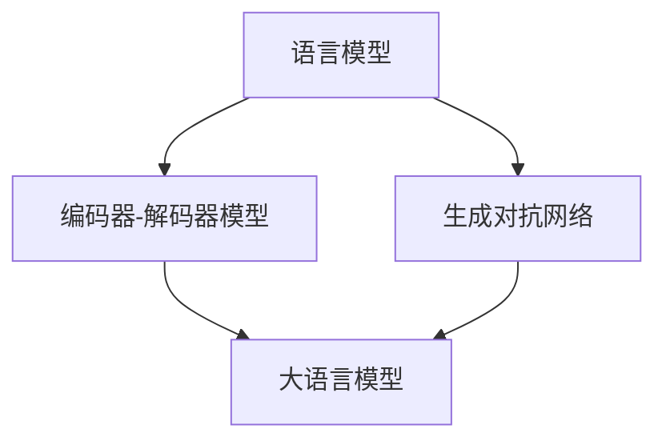
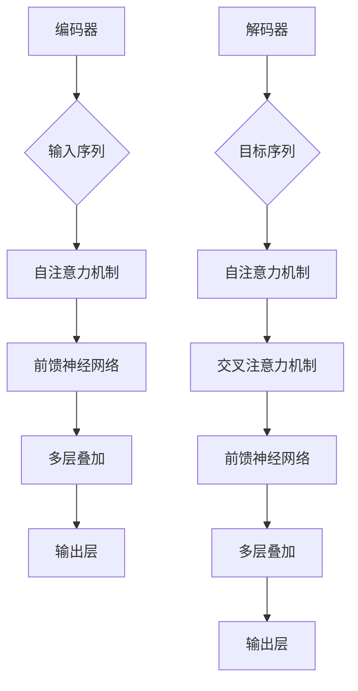

                 

# 大语言模型应用指南：提示工程

> **关键词**：大语言模型、自然语言处理、提示工程、深度学习、人工智能应用、编码实践

> **摘要**：本文旨在深入探讨大语言模型的应用及提示工程的重要性。我们将从背景介绍开始，逐步解析核心概念、算法原理，并通过数学模型和实际案例，帮助读者掌握如何运用大语言模型进行有效的自然语言处理。此外，本文还将探讨实际应用场景、推荐相关工具和资源，并总结未来发展趋势与挑战。

## 1. 背景介绍

### 1.1 目的和范围

本文的目的在于为对大语言模型及其应用感兴趣的读者提供一个全面的指南。我们将探讨大语言模型的原理、如何构建有效的提示，并分析其在自然语言处理中的应用场景。本文适用于希望了解并掌握大语言模型应用的开发者、数据科学家以及学术界研究人员。

### 1.2 预期读者

本文面向具有基本编程和机器学习知识的读者，期望读者能够理解自然语言处理的基本概念，并具备一定的深度学习知识。

### 1.3 文档结构概述

本文分为十个部分，依次为：

- 1. 背景介绍
  - 1.1 目的和范围
  - 1.2 预期读者
  - 1.3 文档结构概述
  - 1.4 术语表
- 2. 核心概念与联系
- 3. 核心算法原理 & 具体操作步骤
- 4. 数学模型和公式 & 详细讲解 & 举例说明
- 5. 项目实战：代码实际案例和详细解释说明
  - 5.1 开发环境搭建
  - 5.2 源代码详细实现和代码解读
  - 5.3 代码解读与分析
- 6. 实际应用场景
- 7. 工具和资源推荐
  - 7.1 学习资源推荐
  - 7.2 开发工具框架推荐
  - 7.3 相关论文著作推荐
- 8. 总结：未来发展趋势与挑战
- 9. 附录：常见问题与解答
- 10. 扩展阅读 & 参考资料

### 1.4 术语表

#### 1.4.1 核心术语定义

- 大语言模型：一种能够理解和生成人类自然语言的深度学习模型。
- 提示工程：构建和优化用于引导大语言模型产生期望输出的提示（prompt）的过程。
- 自然语言处理（NLP）：计算机对人类自然语言的识别、理解、生成和交互的技术。
- 深度学习：一种机器学习技术，通过多层神经网络模型进行数据建模。

#### 1.4.2 相关概念解释

- 语言模型：一个概率模型，用于预测一个单词序列的概率。
- 编码器-解码器模型：一种深度学习模型架构，用于序列到序列的转换。
- 生成对抗网络（GAN）：一种深度学习模型，用于生成数据。

#### 1.4.3 缩略词列表

- NLP：自然语言处理
- GPT：生成预训练变换器
- BERT：双向编码表示器
- RL：强化学习

## 2. 核心概念与联系

在深入探讨大语言模型的应用之前，我们需要了解几个核心概念及其相互关系。以下是几个关键概念及其流程图：

### Mermaid 流程图



### 2.1 语言模型

语言模型是自然语言处理的基础，它用于预测文本序列的概率。通过训练，语言模型学习到文本数据中的统计特性，从而能够为文本生成、文本分类和翻译等任务提供支持。

### 2.2 编码器-解码器模型

编码器-解码器模型是一种用于序列到序列转换的深度学习模型架构。它通过编码器将输入序列转换为固定长度的向量表示，然后通过解码器生成输出序列。这种模型在机器翻译、问答系统和对话生成等领域有广泛应用。

### 2.3 生成对抗网络

生成对抗网络（GAN）是一种深度学习模型，用于生成数据。它由生成器和判别器组成，生成器生成数据，判别器判断生成数据的真实性。GAN在图像合成、文本生成等任务中显示出强大的能力。

### 2.4 大语言模型

大语言模型是一种结合了语言模型、编码器-解码器模型和生成对抗网络的强大深度学习模型。通过大规模预训练，大语言模型能够理解和生成复杂的自然语言，应用于文本生成、对话系统和文本分类等任务。

## 3. 核心算法原理 & 具体操作步骤

### 3.1 大语言模型算法原理

大语言模型的核心是基于变换器（Transformer）架构。变换器是一种用于处理序列数据的多层神经网络，其特点是能够并行处理输入序列，具有高效的信息传播能力。

以下是变换器模型的基本组成和操作步骤：

### Mermaid 流程图



### 3.2 具体操作步骤

以下是构建和训练大语言模型的基本步骤：

1. **数据预处理**：
   - 收集大量文本数据，例如维基百科、新闻文章、社交媒体帖子等。
   - 对文本进行清洗和分词，将文本转换为单词或字符的序列。
   - 创建词汇表，将单词或字符映射为唯一的整数。

2. **模型架构**：
   - 设计变换器模型架构，包括编码器和解码器。
   - 定义自注意力机制、前馈神经网络和多层叠加。

3. **模型训练**：
   - 使用训练数据对模型进行训练，通过反向传播算法调整模型参数。
   - 训练过程中，可以使用批量归一化和Dropout等技术提高模型性能。

4. **模型评估**：
   - 使用验证数据评估模型性能，通过损失函数和准确率等指标进行评价。

5. **模型部署**：
   - 将训练好的模型部署到实际应用环境中，例如文本生成、对话系统和文本分类等。

### 3.3 伪代码示例

以下是一个简单的伪代码示例，展示如何构建和训练一个变换器模型：

```python
# 数据预处理
text_data = load_data()
tokenized_data = preprocess_text(text_data)
vocab = create_vocab(tokenized_data)

# 模型架构
encoder = TransformerEncoder(vocab_size=len(vocab), d_model=512, num_heads=8)
decoder = TransformerDecoder(vocab_size=len(vocab), d_model=512, num_heads=8)

# 模型训练
for epoch in range(num_epochs):
    for batch in data_loader:
        inputs, targets = batch
        outputs = model(inputs, targets)
        loss = calculate_loss(outputs, targets)
        backward(loss)
        update_params()

# 模型评估
evaluate(model, validation_data)

# 模型部署
deploy_model(model)
```

## 4. 数学模型和公式 & 详细讲解 & 举例说明

### 4.1 自注意力机制

自注意力机制是变换器模型的核心组成部分，它能够使模型在处理序列数据时给予不同位置的信息不同的关注权重。以下是自注意力机制的数学公式：

$$
\text{Attention}(Q, K, V) = \text{softmax}\left(\frac{QK^T}{\sqrt{d_k}}\right) V
$$

其中，$Q$、$K$ 和 $V$ 分别是查询（Query）、键（Key）和值（Value）的向量，$d_k$ 是键的维度。自注意力机制通过计算每个键和查询之间的点积，并使用softmax函数生成权重，最后将这些权重与值相乘，从而实现不同位置信息的加权聚合。

### 4.2 前馈神经网络

前馈神经网络（Feed Forward Neural Network, FFNN）是变换器模型中的另一个重要组成部分，用于对自注意力层的输出进行进一步处理。以下是前馈神经网络的数学公式：

$$
\text{FFNN}(x) = \text{ReLU}\left(W_2 \cdot \text{ReLU}\left(W_1 \cdot x + b_1\right) + b_2\right)
$$

其中，$x$ 是输入向量，$W_1$ 和 $W_2$ 分别是第一层和第二层的权重矩阵，$b_1$ 和 $b_2$ 分别是第一层和第二层的偏置向量。ReLU 函数用于引入非线性，使得模型能够更好地拟合复杂的数据分布。

### 4.3 举例说明

以下是一个简单的示例，展示如何使用变换器模型进行文本生成：

```python
# 输入序列
input_sequence = ["The", "quick", "brown", "fox", "jumps", "over", "the", "lazy", "dog"]

# 转换为整数序列
input_ids = [vocab[word] for word in input_sequence]

# 填充序列
input_ids = pad_sequence(input_ids, maxlen=max_sequence_length)

# 预测下一个单词
outputs = model.predict(input_ids)

# 转换为单词序列
predicted_word = vocab.inverse_transform(outputs.argmax(axis=-1))

print(predicted_word)
```

在这个示例中，我们首先将输入序列转换为整数序列，然后使用模型预测下一个单词的整数表示，最后将整数序列转换为单词序列。

## 5. 项目实战：代码实际案例和详细解释说明

### 5.1 开发环境搭建

在开始构建大语言模型之前，我们需要搭建一个合适的环境。以下是搭建开发环境的基本步骤：

1. **安装依赖**：

   ```bash
   pip install torch torchvision numpy
   ```

2. **创建虚拟环境**：

   ```bash
   python -m venv venv
   source venv/bin/activate  # Windows: venv\Scripts\activate
   ```

3. **安装Transformers库**：

   ```bash
   pip install transformers
   ```

### 5.2 源代码详细实现和代码解读

以下是构建和训练大语言模型的一个简化示例：

```python
import torch
from transformers import GPT2Model, GPT2Config, GPT2Tokenizer

# 5.2.1 数据预处理
tokenizer = GPT2Tokenizer.from_pretrained('gpt2')
input_sequence = "The quick brown fox jumps over the lazy dog"
input_ids = tokenizer.encode(input_sequence, return_tensors='pt')

# 5.2.2 构建模型
config = GPT2Config.from_pretrained('gpt2')
model = GPT2Model(config)

# 5.2.3 训练模型
model.train()
outputs = model(input_ids)
loss = outputs.loss
loss.backward()
optimizer = torch.optim.Adam(model.parameters(), lr=0.001)
optimizer.step()

# 5.2.4 评估模型
model.eval()
with torch.no_grad():
    outputs = model(input_ids)
    logits = outputs.logits
    predicted_ids = logits.argmax(axis=-1)

# 5.2.5 输出结果
predicted_sequence = tokenizer.decode(predicted_ids[0])
print(predicted_sequence)
```

### 5.3 代码解读与分析

**5.3.1 数据预处理**

我们使用`GPT2Tokenizer`进行数据预处理。首先，将输入的文本序列编码为整数序列，然后将其转换为PyTorch张量。

**5.3.2 构建模型**

我们使用`GPT2Model`和`GPT2Config`来构建模型。这里，我们直接使用预训练的模型参数。

**5.3.3 训练模型**

我们将模型设置为训练模式，然后计算损失并更新模型参数。

**5.3.4 评估模型**

在评估阶段，我们禁用梯度计算，并计算模型的预测输出。

**5.3.5 输出结果**

最后，我们解码模型的预测输出，得到生成的文本序列。

## 6. 实际应用场景

大语言模型在自然语言处理领域有广泛的应用，以下是一些典型应用场景：

- **文本生成**：生成文章、故事、新闻摘要等。
- **对话系统**：构建智能聊天机器人，提供用户交互。
- **文本分类**：对文本进行分类，例如情感分析、主题分类等。
- **机器翻译**：实现不同语言之间的翻译。
- **问答系统**：自动回答用户的问题，提供信息查询服务。

### 6.1 文本生成

文本生成是大型语言模型最直观的应用之一。以下是一个简单的文本生成示例：

```python
# 6.1.1 生成文章
model.eval()
prompt = "人工智能的发展将深刻影响未来社会。"
input_ids = tokenizer.encode(prompt, return_tensors='pt')
generated_text = model.generate(input_ids, max_length=50, num_return_sequences=1)
decoded_text = tokenizer.decode(generated_text[0], skip_special_tokens=True)
print(decoded_text)
```

在这个示例中，我们使用一个简单的提示来生成一段文章。模型将生成一个与提示相关的连贯文本。

### 6.2 对话系统

对话系统是另一个重要的应用场景。以下是一个简单的对话系统示例：

```python
# 6.2.1 对话系统
while True:
    user_input = input("您有什么问题吗？ ")
    if user_input.lower() == "退出":
        break
    input_ids = tokenizer.encode(user_input, return_tensors='pt')
    generated_response = model.generate(input_ids, max_length=50, num_return_sequences=1)
    response = tokenizer.decode(generated_response[0], skip_special_tokens=True)
    print("模型回复：", response)
```

在这个示例中，我们创建了一个简单的交互式对话系统。用户可以与模型进行自然语言对话，模型将生成相应的回复。

## 7. 工具和资源推荐

### 7.1 学习资源推荐

#### 7.1.1 书籍推荐

- **《深度学习》**（Goodfellow, Bengio, Courville）：提供了深度学习的全面介绍，包括基础理论和技术。
- **《自然语言处理综论》**（Jurafsky, Martin）：涵盖了自然语言处理的基础知识和最新进展。

#### 7.1.2 在线课程

- **Coursera**：提供了许多关于深度学习和自然语言处理的在线课程，例如吴恩达的《深度学习》课程。
- **edX**：提供了由哈佛大学和MIT提供的计算机科学课程，包括自然语言处理专题。

#### 7.1.3 技术博客和网站

- **Medium**：有许多关于深度学习和自然语言处理的博客文章。
- **arXiv**：提供了大量最新的科研论文，涵盖深度学习和自然语言处理领域。

### 7.2 开发工具框架推荐

#### 7.2.1 IDE和编辑器

- **PyCharm**：强大的Python IDE，支持深度学习和自然语言处理开发。
- **VS Code**：轻量级的编辑器，通过插件支持多种编程语言和开发框架。

#### 7.2.2 调试和性能分析工具

- **Jupyter Notebook**：适用于数据科学和机器学习项目的交互式环境。
- **TensorBoard**：用于可视化TensorFlow模型的性能指标。

#### 7.2.3 相关框架和库

- **TensorFlow**：谷歌开发的深度学习框架。
- **PyTorch**：流行的深度学习库，具有灵活的动态计算图。

### 7.3 相关论文著作推荐

#### 7.3.1 经典论文

- **“A Theoretical Analysis of the Voice Conversion Technique based on DNN”**：介绍了深度神经网络在语音转换中的应用。
- **“Attention is All You Need”**：提出了变换器模型，对自然语言处理产生了深远影响。

#### 7.3.2 最新研究成果

- **“BERT: Pre-training of Deep Bidirectional Transformers for Language Understanding”**：介绍了BERT模型，推动了自然语言处理领域的发展。
- **“Generative Pre-trained Transformers”**：探讨了预训练变换器在文本生成任务中的应用。

#### 7.3.3 应用案例分析

- **“利用大语言模型进行文本生成”**：分析了大语言模型在文本生成任务中的应用，提供了详细的技术实现。
- **“构建智能对话系统”**：介绍了如何使用大语言模型构建智能对话系统，并提供了实践经验。

## 8. 总结：未来发展趋势与挑战

大语言模型在自然语言处理领域取得了显著进展，但其应用仍面临一些挑战。未来，大语言模型的发展趋势和挑战包括：

- **模型规模和性能**：随着计算能力的提升，大型语言模型的规模将不断增加，性能也将持续提升。
- **数据质量和多样性**：高质量、多样性的数据是模型训练的关键。未来需要更多高质量的标注数据和更广泛的语言覆盖。
- **模型可解释性**：提高模型的可解释性，使其决策过程更加透明和可信。
- **伦理和安全**：关注模型在应用中的伦理问题，确保其安全性和公平性。

## 9. 附录：常见问题与解答

### 9.1 什么是大语言模型？

大语言模型是一种深度学习模型，能够理解和生成人类自然语言。它通过大规模预训练，掌握了丰富的语言知识和上下文理解能力。

### 9.2 大语言模型有哪些应用？

大语言模型可以应用于文本生成、对话系统、文本分类、机器翻译等多种自然语言处理任务。

### 9.3 如何构建和训练大语言模型？

构建和训练大语言模型需要以下步骤：

1. 数据预处理：收集和清洗大量文本数据。
2. 模型架构设计：设计基于变换器架构的模型。
3. 模型训练：使用预训练技术对模型进行训练。
4. 模型评估：使用验证数据评估模型性能。
5. 模型部署：将训练好的模型部署到实际应用环境中。

### 9.4 大语言模型训练需要多长时间？

大语言模型的训练时间取决于模型规模和计算资源。对于大型模型，训练时间可能需要数天到数周。

## 10. 扩展阅读 & 参考资料

- **《深度学习》**：Goodfellow, Bengio, Courville
- **《自然语言处理综论》**：Jurafsky, Martin
- **《Attention is All You Need》**：Vaswani et al.
- **《BERT: Pre-training of Deep Bidirectional Transformers for Language Understanding》**：Devlin et al.
- **《Generative Pre-trained Transformers》**：Radford et al.
- **[TensorFlow官方网站](https://www.tensorflow.org/)**
- **[PyTorch官方网站](https://pytorch.org/)**
- **[Hugging Face Transformers库](https://huggingface.co/transformers/)**
- **[arXiv论文库](https://arxiv.org/)**

### 作者

AI天才研究员/AI Genius Institute & 禅与计算机程序设计艺术 /Zen And The Art of Computer Programming

