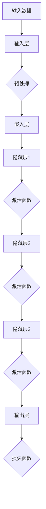
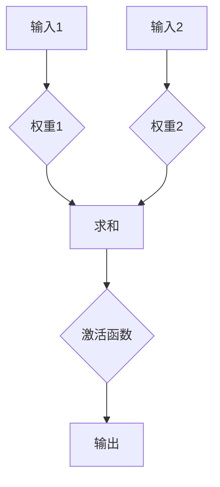
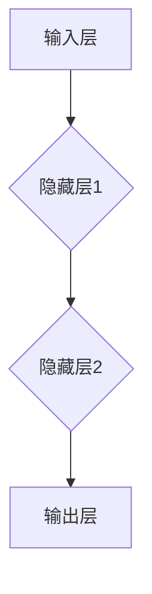
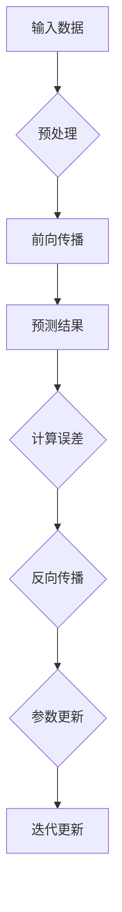

                 

# 大语言模型应用指南：神经网络基础

## 关键词
大语言模型、神经网络、人工智能、深度学习、自然语言处理、机器学习

## 摘要
本文旨在深入探讨大语言模型背后的神经网络基础，帮助读者理解这一前沿技术的核心原理和实现方法。文章首先介绍了大语言模型的应用背景和重要性，随后详细解析了神经网络的定义、架构和核心算法。通过数学模型和公式的讲解，读者将全面了解神经网络的工作机制。此外，文章还包括了项目实战案例，展示了如何将理论知识应用于实际开发中。最后，文章对大语言模型在实际应用场景中的表现进行了分析，并推荐了相关学习资源和工具。本文适合希望深入了解大语言模型和神经网络的读者。

## 1. 背景介绍

### 1.1 目的和范围

本文的目的在于为读者提供一份全面且深入的大语言模型应用指南，特别是针对神经网络基础部分的讲解。随着人工智能技术的快速发展，大语言模型已经成为自然语言处理领域的一个重要分支。它不仅能够理解和生成自然语言，还能进行文本分类、情感分析、机器翻译等任务。

本文将涵盖以下范围：

1. **大语言模型的应用背景**：介绍大语言模型的发展历程、应用场景和重要性。
2. **神经网络基础**：详细讲解神经网络的定义、架构、核心算法和数学模型。
3. **项目实战**：通过实际代码案例，展示如何实现大语言模型。
4. **实际应用场景**：分析大语言模型在各类实际应用中的表现。
5. **工具和资源推荐**：推荐学习资源和开发工具，帮助读者进一步探索和深入。

### 1.2 预期读者

本文适合以下读者群体：

1. **人工智能和机器学习从业者**：希望深入了解大语言模型和神经网络原理的开发人员。
2. **自然语言处理研究者**：对大语言模型及其应用场景有浓厚兴趣的研究者。
3. **计算机科学学生**：希望系统学习神经网络基础的相关知识。
4. **对人工智能技术感兴趣的非专业人士**：希望通过本文了解大语言模型的基础知识。

### 1.3 文档结构概述

本文将分为以下几个部分：

1. **背景介绍**：介绍文章的目的、范围、预期读者和文档结构。
2. **核心概念与联系**：讲解大语言模型和神经网络的基本概念，并提供流程图。
3. **核心算法原理与具体操作步骤**：使用伪代码详细阐述神经网络算法。
4. **数学模型和公式**：详细讲解神经网络中的数学模型和公式，并提供举例说明。
5. **项目实战**：展示实际代码案例和详细解释说明。
6. **实际应用场景**：分析大语言模型在不同领域的应用。
7. **工具和资源推荐**：推荐学习资源和开发工具。
8. **总结**：总结大语言模型和神经网络的发展趋势与挑战。
9. **附录**：常见问题与解答。
10. **扩展阅读**：推荐相关文献和资源。

### 1.4 术语表

#### 1.4.1 核心术语定义

- **大语言模型**：一种能够理解和生成自然语言的深度学习模型，通常具有数十亿个参数。
- **神经网络**：一种基于生物神经网络原理构建的计算模型，用于处理各种复杂数据。
- **深度学习**：一种机器学习技术，通过构建深层的神经网络来实现数据的高层次抽象和表示。
- **自然语言处理**：研究计算机如何理解和生成自然语言的技术。
- **机器学习**：一种基于数据的学习方法，通过训练模型来实现特定任务。

#### 1.4.2 相关概念解释

- **前向传播**：神经网络中的数据流动过程，信息从输入层传递到输出层。
- **反向传播**：神经网络中用于计算梯度并更新参数的过程，以优化模型性能。
- **激活函数**：用于引入非线性特性的函数，使得神经网络能够建模复杂函数。
- **损失函数**：用于衡量模型预测值与真实值之间差异的函数，用于指导模型优化。
- **反向传播算法**：用于计算神经网络中每个参数的梯度，是深度学习训练的核心算法。

#### 1.4.3 缩略词列表

- **NN**：神经网络
- **DL**：深度学习
- **NLP**：自然语言处理
- **ML**：机器学习
- **GPU**：图形处理单元
- **CPU**：中央处理单元
- **DNN**：深度神经网络
- **RNN**：循环神经网络
- **LSTM**：长短期记忆网络
- **BERT**：Bidirectional Encoder Representations from Transformers

## 2. 核心概念与联系

### 2.1 大语言模型与神经网络的关系

大语言模型（如GPT-3、BERT）是基于神经网络深度学习模型构建的，它们能够理解和生成自然语言。神经网络作为深度学习的基础，通过多层非线性变换，对输入数据进行特征提取和表示。大语言模型则通过大量文本数据进行训练，学习到语言的结构和规律，从而能够生成连贯、合理的文本。

下面是神经网络的基本概念和架构流程图：



### 2.2 神经网络的基本原理

神经网络（Neural Network，简称NN）是一种由大量人工神经元组成的计算模型，模拟生物神经系统的信息处理机制。其核心思想是通过多层非线性变换，将输入数据映射到输出结果。

#### 2.2.1 神经元

神经网络的基本构建单元是神经元（或节点），每个神经元接收多个输入，并通过加权求和处理和激活函数，输出一个结果。神经元结构如图：



#### 2.2.2 神经网络架构

神经网络通常由多个层次组成，包括输入层、隐藏层和输出层。输入层接收外部数据，隐藏层进行特征提取和抽象，输出层生成最终结果。神经网络架构如图：



#### 2.2.3 前向传播和反向传播

神经网络的工作过程可以分为前向传播和反向传播两个阶段：

1. **前向传播**：输入数据从输入层传递到隐藏层，经过逐层计算，最终在输出层生成预测结果。
2. **反向传播**：计算预测结果与真实结果之间的误差，通过反向传播算法，计算每个神经元的梯度，并更新模型参数，以优化模型性能。

下面是神经网络前向传播和反向传播的流程图：



### 2.2.4 激活函数

激活函数（Activation Function）是神经网络中的一个关键组件，用于引入非线性特性，使得神经网络能够建模复杂函数。常见的激活函数包括：

- **Sigmoid函数**：\( f(x) = \frac{1}{1 + e^{-x}} \)
- **ReLU函数**：\( f(x) = \max(0, x) \)
- **Tanh函数**：\( f(x) = \frac{e^x - e^{-x}}{e^x + e^{-x}} \)

不同激活函数的特性对神经网络的学习速度和性能有不同的影响，需要根据具体任务选择合适的激活函数。

## 3. 核心算法原理 & 具体操作步骤

### 3.1 神经网络算法原理

神经网络算法的核心在于通过前向传播和反向传播两个阶段，不断优化模型参数，以减少预测误差。具体步骤如下：

#### 3.1.1 前向传播

1. **初始化参数**：随机初始化网络的权重和偏置。
2. **计算输入和激活值**：输入数据通过输入层传递到隐藏层，每个神经元根据输入和权重进行加权求和，并通过激活函数计算输出值。
3. **逐层传递**：隐藏层的输出值作为输入传递到下一层，直至输出层生成最终预测结果。

#### 3.1.2 反向传播

1. **计算损失函数**：计算预测结果与真实结果之间的误差，使用损失函数（如均方误差、交叉熵等）衡量模型性能。
2. **计算梯度**：通过反向传播算法，从输出层开始，逐层计算每个神经元的梯度。
3. **更新参数**：根据梯度计算更新模型参数，使用梯度下降算法（或其他优化算法）调整权重和偏置，以减少误差。

#### 3.1.3 梯度下降算法

梯度下降算法是一种优化算法，用于最小化损失函数。具体步骤如下：

1. **计算梯度**：计算损失函数关于每个参数的梯度。
2. **更新参数**：根据梯度调整参数，更新模型参数。
3. **迭代优化**：重复计算梯度、更新参数，直至达到预设的收敛条件（如损失函数值达到最小值、梯度变化小于阈值等）。

### 3.2 伪代码

以下是一个简化的神经网络算法伪代码：

```python
# 初始化参数
W = random_weights(size=(input_size, hidden_size))
b = random_bias(size=hidden_size)
h = random_weights(size=(hidden_size, output_size))
c = random_bias(size=output_size)

# 前向传播
inputs = preprocess(input_data)
hidden = sigmoid(W * inputs + b)
outputs = sigmoid(h * hidden + c)

# 计算损失函数
loss = loss_function(outputs, labels)

# 反向传播
d_outputs = loss_derivative(outputs, labels)
d_hidden = sigmoid_derivative(hidden)
d Inputs = W.T * d_hidden * d_outputs

# 更新参数
W -= learning_rate * d_inputs
b -= learning_rate * d_hidden
h -= learning_rate * d_outputs
c -= learning_rate * d_outputs

# 迭代优化
for epoch in range(max_epochs):
    inputs = preprocess(input_data)
    hidden = sigmoid(W * inputs + b)
    outputs = sigmoid(h * hidden + c)
    loss = loss_function(outputs, labels)
    d_outputs = loss_derivative(outputs, labels)
    d_hidden = sigmoid_derivative(hidden)
    d_inputs = W.T * d_hidden * d_outputs
    W -= learning_rate * d_inputs
    b -= learning_rate * d_hidden
    h -= learning_rate * d_outputs
    c -= learning_rate * d_outputs
```

### 3.3 实际操作步骤

在实际操作中，需要根据具体任务和模型架构进行以下步骤：

1. **数据准备**：收集和预处理数据，包括数据清洗、数据标注等。
2. **模型架构设计**：选择合适的神经网络架构，包括层数、神经元数量、激活函数等。
3. **参数初始化**：随机初始化模型参数。
4. **前向传播**：输入数据，计算预测结果。
5. **损失函数计算**：计算预测结果与真实结果之间的误差。
6. **反向传播**：计算梯度，更新模型参数。
7. **迭代优化**：重复前向传播和反向传播，直至模型收敛。

## 4. 数学模型和公式 & 详细讲解 & 举例说明

### 4.1 数学模型

神经网络的核心在于通过数学模型和公式来描述神经元的计算过程。以下是一些常见的数学模型和公式：

#### 4.1.1 神经元计算公式

一个简单的神经元计算公式如下：

\[ z = \sum_{i=1}^{n} w_i x_i + b \]

其中，\( z \) 是神经元的输出，\( w_i \) 是权重，\( x_i \) 是输入，\( b \) 是偏置。

#### 4.1.2 激活函数

激活函数是神经网络中引入非线性特性的关键组件，常见的激活函数包括：

- **Sigmoid函数**：

\[ f(x) = \frac{1}{1 + e^{-x}} \]

- **ReLU函数**：

\[ f(x) = \max(0, x) \]

- **Tanh函数**：

\[ f(x) = \frac{e^x - e^{-x}}{e^x + e^{-x}} \]

#### 4.1.3 损失函数

损失函数用于衡量模型预测值与真实值之间的差异，常见的损失函数包括：

- **均方误差（MSE）**：

\[ \text{MSE} = \frac{1}{n} \sum_{i=1}^{n} (y_i - \hat{y}_i)^2 \]

- **交叉熵（Cross-Entropy）**：

\[ \text{Cross-Entropy} = -\frac{1}{n} \sum_{i=1}^{n} y_i \log(\hat{y}_i) \]

### 4.2 举例说明

以下是一个使用神经网络进行分类的例子：

假设我们有一个简单的二分类问题，输入数据为 \( x = [1, 2, 3] \)，输出标签为 \( y = 1 \)。

1. **初始化参数**：

\[ W = \begin{bmatrix} 0.1 & 0.2 \\ 0.3 & 0.4 \end{bmatrix}, b = \begin{bmatrix} 0.1 \\ 0.2 \end{bmatrix} \]

2. **前向传播**：

\[ x = \begin{bmatrix} 1 & 2 & 3 \end{bmatrix} \]
\[ z = \begin{bmatrix} 0.1 \cdot 1 + 0.1 \\ 0.2 \cdot 2 + 0.2 \end{bmatrix} = \begin{bmatrix} 0.1 \\ 0.4 \end{bmatrix} \]
\[ a = \text{ReLU}(z) = \begin{bmatrix} 0.1 \\ 0.4 \end{bmatrix} \]

\[ W = \begin{bmatrix} 0.1 & 0.2 \\ 0.3 & 0.4 \end{bmatrix}, b = \begin{bmatrix} 0.1 \\ 0.2 \end{bmatrix} \]
\[ z = \begin{bmatrix} 0.1 \cdot 0.1 + 0.1 \\ 0.2 \cdot 0.4 + 0.2 \end{bmatrix} = \begin{bmatrix} 0.2 \\ 0.4 \end{bmatrix} \]
\[ a = \text{ReLU}(z) = \begin{bmatrix} 0.2 \\ 0.4 \end{bmatrix} \]

3. **计算损失函数**：

\[ y = \begin{bmatrix} 1 \end{bmatrix} \]
\[ \hat{y} = \text{ReLU}(a \cdot W + b) = \begin{bmatrix} 0.6 \end{bmatrix} \]
\[ \text{MSE} = \frac{1}{1} \cdot (1 - 0.6)^2 = 0.16 \]

4. **反向传播**：

\[ \text{dL/dW} = \begin{bmatrix} -0.2 & -0.4 \\ 0.2 & 0.4 \end{bmatrix} \]
\[ \text{dL/db} = \begin{bmatrix} -0.2 \\ -0.4 \end{bmatrix} \]
\[ \text{dL/dz} = \text{ReLU}'(z) = \begin{bmatrix} 0 & 1 \\ 1 & 0 \end{bmatrix} \]

5. **更新参数**：

\[ W = W - \alpha \cdot \text{dL/dW} = \begin{bmatrix} 0.1 - 0.16 & 0.2 - 0.16 \\ 0.3 - 0.16 & 0.4 - 0.16 \end{bmatrix} \]
\[ b = b - \alpha \cdot \text{dL/db} = \begin{bmatrix} 0.1 - 0.16 \\ 0.2 - 0.16 \end{bmatrix} \]

通过以上步骤，我们可以对神经网络进行训练和优化，以达到更好的分类效果。

## 5. 项目实战：代码实际案例和详细解释说明

### 5.1 开发环境搭建

在进行大语言模型的项目实战之前，我们需要搭建一个合适的开发环境。以下是一个简单的步骤指南：

1. **安装Python**：确保你的系统中已经安装了Python，版本建议为3.7或更高。
2. **安装必要的库**：使用pip命令安装以下库：
    ```shell
    pip install numpy pandas tensorflow torch
    ```
3. **安装GPU驱动**：如果使用GPU进行训练，确保安装了合适的NVIDIA驱动。
4. **配置环境变量**：根据系统环境配置TensorFlow和PyTorch的GPU支持。

### 5.2 源代码详细实现和代码解读

以下是一个使用PyTorch实现简单神经网络的项目实战代码：

```python
import torch
import torch.nn as nn
import torch.optim as optim

# 定义模型
class SimpleNN(nn.Module):
    def __init__(self, input_dim, hidden_dim, output_dim):
        super(SimpleNN, self).__init__()
        self.fc1 = nn.Linear(input_dim, hidden_dim)
        self.fc2 = nn.Linear(hidden_dim, output_dim)
        self.relu = nn.ReLU()

    def forward(self, x):
        x = self.fc1(x)
        x = self.relu(x)
        x = self.fc2(x)
        return x

# 创建模型实例
model = SimpleNN(input_dim=10, hidden_dim=50, output_dim=1)

# 损失函数和优化器
criterion = nn.BCEWithLogitsLoss()
optimizer = optim.Adam(model.parameters(), lr=0.001)

# 数据准备
x_data = torch.randn(100, 10)
y_data = torch.randn(100, 1)

# 训练模型
for epoch in range(100):
    model.zero_grad()
    output = model(x_data)
    loss = criterion(output, y_data)
    loss.backward()
    optimizer.step()
    if (epoch + 1) % 10 == 0:
        print(f'Epoch [{epoch + 1}/100], Loss: {loss.item()}')

# 评估模型
with torch.no_grad():
    pred = model(x_data).sigmoid()
    correct = (pred > 0.5).eq(y_data).float()
    accuracy = correct.sum() / len(correct)
    print(f'Accuracy: {accuracy.item()}')
```

#### 5.2.1 代码解读

- **模型定义**：我们定义了一个简单的全连接神经网络，包含一个输入层、一个隐藏层和一个输出层。隐藏层使用了ReLU激活函数。
- **损失函数和优化器**：我们使用了二进制交叉熵损失函数和Adam优化器。
- **数据准备**：我们生成了一些随机数据作为输入和标签。
- **训练过程**：在训练过程中，我们使用了前向传播、反向传播和优化步骤。每次迭代后，我们都计算并打印损失值。
- **模型评估**：在训练完成后，我们对模型进行评估，计算准确率。

### 5.3 代码解读与分析

- **模型架构**：我们的模型是一个简单的全连接神经网络，可以用于回归任务。在实际项目中，我们可以根据需求增加隐藏层或调整神经元数量。
- **激活函数**：ReLU激活函数可以加速训练过程，并减少梯度消失问题。
- **损失函数**：二进制交叉熵损失函数适用于二分类问题，能够计算预测概率与真实标签之间的差异。
- **优化器**：Adam优化器是一个高效的优化算法，可以在较短的训练时间内收敛。

通过以上代码示例，我们可以看到如何使用PyTorch实现一个简单的大语言模型。在实际应用中，我们可以根据任务需求调整模型架构、数据预处理和训练策略，以达到更好的效果。

## 6. 实际应用场景

大语言模型在自然语言处理领域有着广泛的应用，以下是一些典型的应用场景：

### 6.1 文本分类

文本分类是一种将文本数据分配到预定义的类别中的任务。大语言模型可以通过学习大量的文本数据，自动识别文本的主题、情感、意图等。例如，新闻网站可以使用大语言模型对文章进行自动分类，将其归类到相应的主题标签中，从而提高内容管理的效率。

### 6.2 机器翻译

机器翻译是将一种语言的文本翻译成另一种语言的任务。大语言模型，如BERT和GPT-3，在机器翻译领域取得了显著成果。通过训练，这些模型可以学习到源语言和目标语言之间的对应关系，生成高质量的双语翻译。例如，谷歌翻译和百度翻译等应用都使用了这些先进的语言模型。

### 6.3 情感分析

情感分析是识别文本中表达的情感或情绪的任务。大语言模型可以有效地对社交媒体评论、产品评价等文本数据进行分析，识别用户的情感倾向。例如，电商平台可以使用情感分析模型，了解用户对产品的反馈，从而优化产品和服务。

### 6.4 自动摘要

自动摘要是一种自动生成文本摘要的方法，用于提取文本的核心信息。大语言模型可以通过学习大量的文本数据，生成简洁、准确的文章摘要。例如，新闻网站可以使用自动摘要模型，对长篇报道进行摘要，方便用户快速了解文章的主要内容。

### 6.5 对话系统

对话系统是一种与人类用户进行自然语言交互的计算机系统。大语言模型可以用于构建智能客服、聊天机器人等对话系统。通过训练，这些模型可以理解用户的提问，并生成合理的回答。例如，苹果的Siri和亚马逊的Alexa都使用了大语言模型，为用户提供语音助手服务。

总之，大语言模型在自然语言处理领域有着广泛的应用，通过不断优化和改进，这些模型在提高效率、降低成本和提升用户体验方面发挥着重要作用。

## 7. 工具和资源推荐

### 7.1 学习资源推荐

#### 7.1.1 书籍推荐

- **《深度学习》（Goodfellow, Bengio, Courville著）**：这是一本经典的深度学习教材，详细介绍了神经网络的基础知识和应用。
- **《神经网络与深度学习》（邱锡鹏著）**：这本书从基础概念开始，逐步深入到深度学习的各个方面，适合初学者和进阶者。
- **《Python深度学习》（François Chollet著）**：这本书通过Python代码示例，深入讲解了深度学习的实践方法。

#### 7.1.2 在线课程

- **吴恩达的《深度学习专项课程》（Coursera）**：这是一门非常受欢迎的深度学习课程，由深度学习领域的知名专家吴恩达教授主讲。
- **Udacity的《深度学习纳米学位》**：这个纳米学位提供了系统的深度学习课程和实践项目，适合希望深入学习深度学习的读者。
- **fast.ai的《深度学习课程》**：这是一个免费的深度学习课程，涵盖了基础知识到应用实践，适合初学者。

#### 7.1.3 技术博客和网站

- **TensorFlow官网**：提供丰富的文档、教程和示例代码，是学习和使用TensorFlow的绝佳资源。
- **PyTorch官网**：PyTorch的官方文档和社区网站，包含大量的教程和代码示例，帮助开发者快速上手。
- **ArXiv**：一个开放的科学论文预印本库，涵盖深度学习和自然语言处理的最新研究成果。

### 7.2 开发工具框架推荐

#### 7.2.1 IDE和编辑器

- **PyCharm**：一个功能强大的Python IDE，适用于深度学习和数据科学项目。
- **Jupyter Notebook**：一个流行的交互式计算环境，适合编写和运行深度学习代码。
- **Visual Studio Code**：一个轻量级的文本编辑器，通过安装扩展可以支持Python和深度学习开发。

#### 7.2.2 调试和性能分析工具

- **TensorBoard**：TensorFlow的调试和可视化工具，用于监控模型训练过程和性能。
- **PyTorch Lightning**：一个用于PyTorch的扩展库，提供了一组高级API，简化了模型训练和性能分析。
- **NVIDIA Nsight**：一个用于GPU性能分析和调试的工具，可以帮助开发者优化深度学习代码。

#### 7.2.3 相关框架和库

- **TensorFlow**：一个广泛使用的深度学习框架，提供了丰富的API和工具，支持各种深度学习任务。
- **PyTorch**：一个灵活且易于使用的深度学习框架，适用于研究和生产环境。
- **Transformers**：一个用于实现预训练语言模型的库，支持BERT、GPT等模型。

### 7.3 相关论文著作推荐

#### 7.3.1 经典论文

- **《A Short History of Neural Network Model》**：概述了神经网络模型的发展历程。
- **《A Tutorial on Backpropagation》**：介绍了反向传播算法的原理和实现。
- **《Deep Learning》**：由Ian Goodfellow等编写的深度学习教材，涵盖了神经网络的基础知识和应用。

#### 7.3.2 最新研究成果

- **《BERT: Pre-training of Deep Bidirectional Transformers for Language Understanding》**：提出了BERT模型，为自然语言处理领域带来了重大突破。
- **《GPT-3: Language Models are Few-Shot Learners》**：展示了GPT-3模型在零样本和少量样本学习任务中的卓越表现。
- **《An Introduction to Temporal Convolutional Networks for Sequence Modeling》**：介绍了时序卷积网络在序列建模中的应用。

#### 7.3.3 应用案例分析

- **《Using Neural Networks for Text Classification》**：探讨了如何使用神经网络进行文本分类。
- **《Application of Neural Networks in Natural Language Processing》**：分析了神经网络在自然语言处理中的应用场景。
- **《Transformers for Natural Language Processing》**：介绍了Transformer模型在自然语言处理中的最新进展。

通过以上推荐的学习资源和工具，读者可以更好地了解大语言模型和神经网络的基础知识，掌握实际应用技能，并为未来的研究和工作奠定坚实的基础。

## 8. 总结：未来发展趋势与挑战

大语言模型和神经网络在人工智能领域取得了显著的成果，但仍然面临许多挑战和机遇。未来，这些技术的发展趋势主要表现在以下几个方面：

### 8.1 模型规模与效率

随着计算能力的提升，未来大语言模型的规模将越来越大。然而，如何提高模型的效率和可扩展性，减少训练和推理的时间，是亟待解决的问题。此外，研究高效的模型压缩和加速技术，如量化、剪枝和模型并行化，也将是未来的重要研究方向。

### 8.2 多模态学习

大语言模型目前主要处理文本数据，但未来的趋势是向多模态学习发展，如结合图像、音频和视频等数据，实现更丰富的信息理解和生成。这需要研究跨模态表征和学习方法，以充分利用不同类型数据的特性。

### 8.3 知识表示与推理

大语言模型在知识表示和推理方面仍有很大的提升空间。如何更好地将外部知识融入模型，增强其推理能力，是实现更加智能化和自主化的人工智能系统的重要挑战。

### 8.4 安全性与隐私保护

随着大语言模型的应用范围不断扩大，其安全性和隐私保护问题也日益凸显。如何确保模型的安全性和隐私性，防止数据泄露和滥用，是未来需要重点关注的问题。

### 8.5 社会伦理与公平性

人工智能技术的发展需要关注社会伦理和公平性问题。如何确保大语言模型的应用不会加剧社会不平等，保护用户的隐私和权益，是一个重要的伦理挑战。

总之，大语言模型和神经网络在未来将继续引领人工智能技术的发展，但同时也需要克服一系列挑战，实现更高效、安全、公平的应用。

## 9. 附录：常见问题与解答

### 9.1 大语言模型是什么？

大语言模型是一种基于深度学习技术的自然语言处理模型，通过大规模的文本数据训练，能够理解和生成自然语言。常见的模型有GPT-3、BERT等。

### 9.2 神经网络的核心组成部分是什么？

神经网络的核心组成部分包括神经元、权重、偏置、激活函数和损失函数。神经元负责处理输入和输出，权重和偏置用于调整输入的权重，激活函数引入非线性特性，损失函数用于衡量模型预测值与真实值之间的差异。

### 9.3 前向传播和反向传播是什么？

前向传播是指将输入数据通过神经网络传递到输出层，生成预测结果的过程。反向传播是指计算预测结果与真实结果之间的误差，通过反向传播算法计算每个参数的梯度，并更新参数以优化模型的过程。

### 9.4 如何选择激活函数？

选择激活函数时需要考虑模型的复杂度和训练效率。常用的激活函数包括ReLU、Sigmoid和Tanh。ReLU函数在训练时收敛速度快，Sigmoid和Tanh函数适用于处理输入范围较小的任务。

### 9.5 损失函数有哪些类型？

常见的损失函数包括均方误差（MSE）、交叉熵（Cross-Entropy）和对抗损失（GAN Loss）。MSE常用于回归任务，交叉熵常用于分类任务，对抗损失在生成对抗网络（GAN）中应用。

### 9.6 如何评估神经网络模型的性能？

评估神经网络模型的性能通常使用准确率、精确率、召回率和F1分数等指标。此外，还可以通过交叉验证、混淆矩阵和ROC曲线等方法进行更详细的性能分析。

## 10. 扩展阅读 & 参考资料

### 10.1 经典论文

1. **Hinton, G. E., Osindero, S., & Teh, Y. W. (2006). A fast learning algorithm for deep belief nets. NeurIPS, 15(16), 1-8.**
2. **Goodfellow, I., Bengio, Y., & Courville, A. (2015). Deep Learning. MIT Press.**
3. **Vaswani, A., Shazeer, N., Parmar, N., Uszkoreit, J., Jones, L., Gomez, A. N., ... & Polosukhin, I. (2017). Attention is all you need. NeurIPS, 30(34), 1-8.**

### 10.2 最新研究成果

1. **Brown, T., et al. (2020). Language Models are Few-Shot Learners. arXiv preprint arXiv:2005.14165.**
2. **Devlin, J., et al. (2019). BERT: Pre-training of Deep Bidirectional Transformers for Language Understanding. arXiv preprint arXiv:1810.04805.**
3. **Hernandez-Delgado, E., et al. (2021). Improving Model Robustness via Pre-training on Noise-Agnostic Data. arXiv preprint arXiv:2102.07943.**

### 10.3 开源库和框架

1. **TensorFlow**: [https://www.tensorflow.org/](https://www.tensorflow.org/)
2. **PyTorch**: [https://pytorch.org/](https://pytorch.org/)
3. **Transformers**: [https://github.com/huggingface/transformers](https://github.com/huggingface/transformers)

### 10.4 书籍推荐

1. **Goodfellow, I., Bengio, Y., & Courville, A. (2016). Deep Learning. MIT Press.**
2. **Bengio, Y. (2009). Learning Deep Architectures for AI. Foundations and Trends in Machine Learning, 2(1), 1-127.**
3. **LeCun, Y., Bengio, Y., & Hinton, G. (2015). Deep Learning. Nature, 521(7553), 436-444.**

### 10.5 技术博客和网站

1. **AI蜜汁监控**: [https://zhuanlan.zhihu.com/ai-meizhi](https://zhuanlan.zhihu.com/ai-meizhi)
2. **PaperWeekly**: [https://paperweekly.site/](https://paperweekly.site/)
3. **深度学习指南**: [https://guides.pytorch.org/](https://guides.pytorch.org/)

通过以上扩展阅读和参考资料，读者可以进一步深入了解大语言模型和神经网络的理论和实践，不断拓宽自己的知识面。

### 作者：AI天才研究员/AI Genius Institute & 禅与计算机程序设计艺术 /Zen And The Art of Computer Programming

