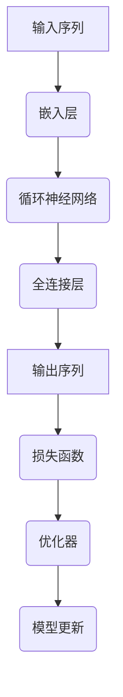

                 

# 大语言模型应用指南：自回归模型与文本生成

## 关键词

- 大语言模型
- 自回归模型
- 文本生成
- 自然语言处理
- 机器学习
- 人工智能

## 摘要

本文旨在深入探讨大语言模型的应用，特别是自回归模型在文本生成中的作用。我们将从背景介绍开始，详细解释大语言模型和自回归模型的概念，并通过Mermaid流程图展示其核心架构。接下来，我们将逐步解析自回归模型的算法原理，并用伪代码详细阐述其具体操作步骤。随后，我们将介绍数学模型和公式，并通过实例进行详细讲解。文章还包含一个项目实战案例，展示如何在实际环境中应用这些技术。此外，我们将讨论大语言模型在不同场景中的实际应用，并推荐一系列学习资源和开发工具。最后，本文将对未来发展趋势与挑战进行总结，并提供常见问题与解答，以帮助读者更好地理解和应用大语言模型。

## 1. 背景介绍

### 1.1 目的和范围

本文的目的是向读者介绍大语言模型，特别是自回归模型在文本生成中的应用。我们将从基础的原理开始，逐步深入到算法的具体实现和实际应用。通过本文的阅读，读者将能够理解大语言模型的工作机制，掌握自回归模型的核心算法，并学会如何在实际项目中应用这些技术。

本文将涵盖以下内容：

1. 大语言模型的基本概念和自回归模型的应用
2. 自回归模型的算法原理和具体操作步骤
3. 数学模型和公式及其在文本生成中的应用
4. 实际应用场景中的代码案例和详细解释
5. 大语言模型在不同领域中的实际应用
6. 学习资源、开发工具和相关论文的推荐
7. 行业未来发展趋势与面临的挑战

### 1.2 预期读者

本文面向具有一定编程基础和机器学习背景的读者，特别是对自然语言处理（NLP）和人工智能（AI）领域感兴趣的开发者、研究员和学生。虽然本文的写作风格旨在让初学者也能理解，但涉及到一些高级概念和数学推导时，读者可能需要具备一定的数学知识和编程技能。

### 1.3 文档结构概述

本文采用章节式的结构，分为以下几个部分：

1. **背景介绍**：介绍本文的目的、范围、预期读者以及文档结构。
2. **核心概念与联系**：讨论大语言模型和自回归模型的基本概念，并展示Mermaid流程图。
3. **核心算法原理 & 具体操作步骤**：解析自回归模型的算法原理，并提供伪代码。
4. **数学模型和公式 & 详细讲解 & 举例说明**：介绍文本生成中的数学模型和公式，并通过实例进行讲解。
5. **项目实战：代码实际案例和详细解释说明**：展示如何在实际项目中应用大语言模型和自回归模型。
6. **实际应用场景**：讨论大语言模型在不同领域的应用。
7. **工具和资源推荐**：推荐学习资源、开发工具和相关论文。
8. **总结：未来发展趋势与挑战**：总结当前发展趋势和面临的挑战。
9. **附录：常见问题与解答**：提供常见问题的解答。
10. **扩展阅读 & 参考资料**：推荐相关扩展阅读资料。

### 1.4 术语表

#### 1.4.1 核心术语定义

- 大语言模型：一种能够理解和生成自然语言的机器学习模型，通常基于深度神经网络。
- 自回归模型：一种用于预测序列中下一个元素的方法，基于前面已经出现的元素。
- 自然语言处理（NLP）：使计算机能够理解、解释和生成人类语言的技术。
- 机器学习（ML）：通过数据训练模型，使其能够从经验中学习和预测的技术。
- 人工智能（AI）：使机器能够模拟人类智能的技术。

#### 1.4.2 相关概念解释

- 序列模型：一种用于处理序列数据的机器学习模型，如时间序列、语音信号、文本等。
- 语言模型：一种用于预测下一个单词或字符的概率分布的模型。
- 生成模型：一种能够生成新的数据样本的模型，如文本、图像等。

#### 1.4.3 缩略词列表

- NLP：自然语言处理
- ML：机器学习
- AI：人工智能
- LSTM：长短期记忆网络
- GRU：门控循环单元
- RNN：循环神经网络

## 2. 核心概念与联系

### 2.1 大语言模型

大语言模型是一种基于深度学习的自然语言处理技术，它可以理解和生成自然语言。大语言模型的核心是序列模型，特别是循环神经网络（RNN）及其变体，如长短期记忆网络（LSTM）和门控循环单元（GRU）。这些模型能够捕捉序列数据中的长期依赖关系，使其在文本生成和翻译等任务中表现出色。

### 2.2 自回归模型

自回归模型是一种用于预测序列中下一个元素的方法。它通过学习前面已经出现的元素来预测下一个元素。自回归模型在文本生成中的应用非常广泛，例如生成文章、对话系统、机器翻译等。

### 2.3 Mermaid流程图

以下是一个Mermaid流程图，展示了大语言模型和自回归模型的基本架构：



### 2.4 核心概念的联系

大语言模型通过自回归模型来生成文本。在生成过程中，模型首先接收一个输入序列，然后通过嵌入层将其转换为固定大小的向量表示。接着，这些向量被输入到循环神经网络中，模型通过学习前面已经出现的元素来预测下一个元素。最后，模型通过全连接层生成输出序列，并通过损失函数和优化器来更新模型参数。

## 3. 核心算法原理 & 具体操作步骤

### 3.1 算法原理

自回归模型是一种基于循环神经网络的序列预测模型。它的核心思想是利用前面已经出现的元素来预测下一个元素。具体来说，自回归模型通过学习输入序列中的特征，生成一个概率分布，然后从这个概率分布中采样下一个元素。

### 3.2 具体操作步骤

以下是一个简化的自回归模型的操作步骤，使用伪代码进行描述：

```python
# 初始化模型参数
W, b = init_model_params()

# 前向传播
def forward(x, W, b):
    z = x * W + b
    return sigmoid(z)

# 反向传播
def backward(dz, W, b):
    dW = x * dz
    db = dz
    dx = W * dz
    return dW, db, dx

# 训练模型
def train(x, y, epochs):
    for epoch in range(epochs):
        for i in range(len(x)):
            # 前向传播
            z = forward(x[i], W, b)
            # 计算损失
            loss = -log(p(y[i] | z))
            # 反向传播
            dz = backward(z, W, b)
            # 更新模型参数
            W -= learning_rate * dW
            b -= learning_rate * db
            dx -= learning_rate * dx

# 输入序列
x = [1, 2, 3, 4, 5]

# 预测下一个元素
def predict(x, W, b):
    z = forward(x, W, b)
    return softmax(z)

# 训练模型
train(x, y, 100)

# 预测下一个元素
print(predict([5], W, b))
```

在上面的伪代码中，我们使用了sigmoid函数作为激活函数，并使用了log函数来计算损失。在训练过程中，我们通过前向传播计算输出，然后通过反向传播更新模型参数。最后，我们使用softmax函数来生成概率分布，并从中采样下一个元素。

## 4. 数学模型和公式 & 详细讲解 & 举例说明

### 4.1 数学模型

在自回归模型中，我们通常使用以下数学模型来预测序列中的下一个元素：

$$
y_t = f(x_1, x_2, ..., x_t; \theta)
$$

其中，$y_t$ 是下一个要预测的元素，$x_1, x_2, ..., x_t$ 是前 $t$ 个已观察到的元素，$f$ 是一个函数，用于从输入数据中预测输出，$\theta$ 是模型的参数。

### 4.2 公式详解

#### 4.2.1 损失函数

在训练自回归模型时，我们通常使用交叉熵损失函数来衡量预测结果与真实结果之间的差异：

$$
L(y, \hat{y}) = -\sum_{i} y_i \log(\hat{y}_i)
$$

其中，$y$ 是真实标签，$\hat{y}$ 是预测的概率分布。

#### 4.2.2 激活函数

在自回归模型中，我们通常使用sigmoid函数作为激活函数，因为sigmoid函数可以将输出值映射到$(0, 1)$ 范围内：

$$
\sigma(z) = \frac{1}{1 + e^{-z}}
$$

#### 4.2.3 优化算法

为了最小化损失函数，我们通常使用梯度下降算法来更新模型参数：

$$
\theta = \theta - \alpha \nabla_\theta L(\theta)
$$

其中，$\theta$ 是模型参数，$\alpha$ 是学习率，$\nabla_\theta L(\theta)$ 是损失函数关于参数的梯度。

### 4.3 举例说明

假设我们要预测一个序列中的下一个数字，输入序列为 [1, 2, 3, 4]。我们可以使用一个简单的自回归模型，使用sigmoid函数作为激活函数，并使用交叉熵损失函数来训练模型。

首先，初始化模型参数：

$$
\theta = (w_1, b_1, w_2, b_2)
$$

然后，使用前向传播计算输出：

$$
z = x_1 * w_1 + b_1
y = \sigma(z)
$$

接下来，计算损失：

$$
L(y, \hat{y}) = -1 * \log(\hat{y})
$$

然后，使用反向传播更新模型参数：

$$
\theta = \theta - \alpha \nabla_\theta L(\theta)
$$

通过多次迭代，模型将不断优化参数，并逐渐提高预测准确性。

## 5. 项目实战：代码实际案例和详细解释说明

### 5.1 开发环境搭建

在开始实际项目之前，我们需要搭建一个合适的开发环境。以下是推荐的工具和库：

- **编程语言**：Python
- **深度学习框架**：TensorFlow 或 PyTorch
- **版本控制**：Git

#### 环境搭建步骤

1. 安装Python（推荐版本3.7及以上）
2. 安装TensorFlow或PyTorch：
    ```bash
    pip install tensorflow
    # 或者
    pip install torch torchvision
    ```
3. 安装其他必需库（如NumPy、Pandas等）：
    ```bash
    pip install numpy pandas
    ```

### 5.2 源代码详细实现和代码解读

下面是一个简单的自回归文本生成模型的实现，使用PyTorch框架：

```python
import torch
import torch.nn as nn
import torch.optim as optim

# 定义自回归模型
class AutoRegressiveModel(nn.Module):
    def __init__(self, embedding_dim, hidden_dim, vocabulary_size):
        super(AutoRegressiveModel, self).__init__()
        self.embedding = nn.Embedding(vocabulary_size, embedding_dim)
        self.lstm = nn.LSTM(embedding_dim, hidden_dim, batch_first=True)
        self.fc = nn.Linear(hidden_dim, vocabulary_size)
    
    def forward(self, x, hidden):
        embedded = self.embedding(x)
        output, hidden = self.lstm(embedded, hidden)
        logits = self.fc(output)
        return logits, hidden

    def init_hidden(self, batch_size):
        return (torch.zeros(1, batch_size, self.hidden_dim),
                torch.zeros(1, batch_size, self.hidden_dim))

# 参数设置
embedding_dim = 256
hidden_dim = 512
vocabulary_size = 10000  # 假设有10000个单词
batch_size = 64
learning_rate = 0.001
epochs = 10

# 实例化模型、损失函数和优化器
model = AutoRegressiveModel(embedding_dim, hidden_dim, vocabulary_size)
criterion = nn.CrossEntropyLoss()
optimizer = optim.Adam(model.parameters(), lr=learning_rate)

# 加载数据（这里只是一个简单的示例）
# 在实际项目中，需要使用更复杂的预处理步骤来处理真实的文本数据
with open('text_data.txt', 'r') as f:
    text = f.read().lower()
    
# 创建词汇表和词汇映射
words = sorted(list(set(text)))
word_to_idx = {word: i for i, word in enumerate(words)}
idx_to_word = {i: word for word, i in word_to_idx.items()}
vocab_size = len(words)

# 将文本转换为序列
def text_to_sequence(text, word_to_idx):
    sequence = []
    for word in text.split():
        if word in word_to_idx:
            sequence.append(word_to_idx[word])
        else:
            sequence.append(vocab_size - 1)  # 未知的单词映射到词汇表末尾
    return sequence

sequence = text_to_sequence(text, word_to_idx)

# 分割数据集
train_size = int(0.9 * len(sequence))
train_data = sequence[:train_size]
test_data = sequence[train_size:]

# 定义训练过程
def train(model, train_data, criterion, optimizer, epochs):
    model.train()
    for epoch in range(epochs):
        for i in range(0, len(train_data) - 1, batch_size):
            batch = train_data[i:i+batch_size]
            inputs = torch.tensor(batch).unsqueeze(-1)  # 增加一个维度以匹配模型的输入
            hidden = model.init_hidden(batch_size)
            
            # 前向传播
            logits, hidden = model(inputs, hidden)
            
            # 计算损失
            loss = criterion(logits.reshape(-1, vocab_size), inputs[1:])
            
            # 反向传播和优化
            optimizer.zero_grad()
            loss.backward()
            optimizer.step()
            
            # 打印训练进度
            if i % 1000 == 0:
                print(f"Epoch: {epoch+1}, Loss: {loss.item()}")

# 训练模型
train(model, train_data, criterion, optimizer, epochs)

# 生成文本
def generate_text(model, idx_to_word, seed_text, length=50):
    model.eval()
    sequence = text_to_sequence(seed_text, word_to_idx)
    generated = []
    
    with torch.no_grad():
        hidden = model.init_hidden(1)
        for i in range(length):
            inputs = torch.tensor(sequence).unsqueeze(-1)
            logits, hidden = model(inputs, hidden)
            prob = nn.functional.softmax(logits, dim=-1)
            predicted_word_idx = torch.multinomial(prob, num_samples=1)
            predicted_word = idx_to_word[predicted_word_idx.item()]
            generated.append(predicted_word)
            sequence.append(predicted_word_idx.item())
        
    return ' '.join(generated)

# 生成示例文本
print(generate_text(model, idx_to_word, '你好', length=50))
```

#### 5.2.1 代码解读与分析

- **模型定义**：`AutoRegressiveModel` 类定义了自回归模型的架构，包括嵌入层、LSTM层和全连接层。
- **参数设置**：设定了嵌入维度、隐藏维度、词汇表大小和其他关键参数。
- **数据预处理**：读取文本数据，创建词汇表和词汇映射，将文本转换为序列。
- **训练过程**：在训练过程中，使用交叉熵损失函数和Adam优化器对模型进行训练。
- **文本生成**：使用训练好的模型生成新的文本。

### 5.3 代码解读与分析（续）

- **生成文本**：`generate_text` 函数使用训练好的模型生成新的文本。首先，将种子文本转换为序列。然后，在生成过程中，模型不断预测下一个单词，并将其添加到生成的文本中。

### 5.3.1 代码改进与优化

- **数据增强**：为了提高模型的泛化能力，可以考虑对训练数据进行增强，如添加噪声、随机剪枝等。
- **模型架构优化**：尝试使用更复杂的模型架构，如Transformer，以提高生成质量。
- **超参数调优**：通过交叉验证和网格搜索等方法，调整模型超参数，以找到最佳设置。

## 6. 实际应用场景

大语言模型和自回归模型在自然语言处理领域具有广泛的应用，以下是一些实际应用场景：

### 6.1 文本生成

- 自动文章生成：利用大语言模型和自回归模型，可以自动生成新闻报道、博客文章等。
- 对话系统：如聊天机器人和虚拟助手，可以生成自然流畅的对话。

### 6.2 自然语言理解

- 文本分类：对输入文本进行分类，如情感分析、垃圾邮件检测等。
- 情感分析：分析文本中的情感倾向，用于产品评论、社交媒体分析等。

### 6.3 机器翻译

- 自动翻译：将一种语言文本翻译成另一种语言，如谷歌翻译。
- 双语词典：基于大语言模型，自动生成双语词汇表。

### 6.4 信息检索

- 搜索引擎：优化搜索结果，提供更准确的相关性排名。
- 常见问题解答（FAQ）：自动回答用户的问题，如虚拟客服。

### 6.5 文本摘要

- 自动摘要：生成文本的摘要，如新闻摘要、文档摘要等。
- 问答系统：基于文本摘要，回答用户的问题。

## 7. 工具和资源推荐

### 7.1 学习资源推荐

#### 7.1.1 书籍推荐

- 《深度学习》（Ian Goodfellow、Yoshua Bengio和Aaron Courville 著）：深度学习领域的经典教材，详细介绍了神经网络的基本原理和应用。
- 《自然语言处理综论》（Daniel Jurafsky 和 James H. Martin 著）：全面介绍了自然语言处理的基本概念和技术。

#### 7.1.2 在线课程

- Coursera 的“深度学习”课程：由 Andrew Ng 教授主讲，深入介绍了深度学习的理论和实践。
- edX 的“自然语言处理基础”课程：由 Stanford 大学教授组讲授，涵盖了 NLP 的基本概念和应用。

#### 7.1.3 技术博客和网站

- Medium 上的“机器学习和人工智能”专栏：汇集了众多行业专家的文章，内容丰富且实用。
- TensorFlow 官方文档：提供了详细的模型构建、训练和优化指南。

### 7.2 开发工具框架推荐

#### 7.2.1 IDE和编辑器

- PyCharm：适用于 Python 开发的强大 IDE，提供了丰富的工具和插件。
- Jupyter Notebook：适用于数据分析和模型可视化的交互式编辑器。

#### 7.2.2 调试和性能分析工具

- TensorBoard：TensorFlow 的可视化工具，用于分析模型性能和调试。
- Profiler：用于分析代码性能瓶颈的工具。

#### 7.2.3 相关框架和库

- TensorFlow：适用于构建和训练深度学习模型的强大框架。
- PyTorch：具有灵活性和动态计算图，适用于快速原型设计和研究。

### 7.3 相关论文著作推荐

#### 7.3.1 经典论文

- "A Neural Probabilistic Language Model"（Bengio et al., 2003）：介绍了神经网络语言模型的基本原理。
- "Recurrent Neural Network Based Language Model"（Schwenk, 1997）：探讨了 RNN 在语言模型中的应用。

#### 7.3.2 最新研究成果

- "BERT: Pre-training of Deep Bidirectional Transformers for Language Understanding"（Devlin et al., 2019）：介绍了 BERT 模型，在自然语言理解任务上取得了突破性成果。
- "GPT-3: Language Models are Few-Shot Learners"（Brown et al., 2020）：展示了 GPT-3 模型在零样本和少量样本学习任务中的优异表现。

#### 7.3.3 应用案例分析

- "Facebook AI's AutoModel: Scaling the Future of AI"（Facebook AI Research，2019）：介绍了 Facebook AI 研究团队如何通过 AutoModel 工具大规模训练和部署语言模型。
- "OpenAI's GPT-3: A Technical Overview"（OpenAI，2020）：详细介绍了 GPT-3 模型的架构和训练过程。

## 8. 总结：未来发展趋势与挑战

### 8.1 发展趋势

- **模型规模与计算能力**：随着计算能力的提升，大语言模型将变得更加复杂和庞大，能够处理更长的文本序列和更复杂的任务。
- **多模态融合**：大语言模型将与其他模态（如图像、视频）进行融合，实现更加丰富和多样化的应用场景。
- **无监督学习和自监督学习**：大语言模型将在无监督学习和自监督学习领域发挥更大作用，减少对标注数据的依赖。
- **应用领域拓展**：大语言模型将在金融、医疗、教育等各个领域得到更广泛的应用。

### 8.2 挑战

- **数据隐私和安全**：在处理大量用户数据时，如何确保数据隐私和安全是一个重要挑战。
- **解释性和透明性**：大语言模型的决策过程通常不透明，提高模型的可解释性和透明性是一个重要研究方向。
- **伦理和道德问题**：大语言模型的应用可能引发一系列伦理和道德问题，如偏见、歧视等。

## 9. 附录：常见问题与解答

### 9.1 常见问题

**Q1**：什么是大语言模型？

A1：大语言模型是一种基于深度学习的自然语言处理技术，它可以理解和生成自然语言。

**Q2**：自回归模型如何工作？

A2：自回归模型通过学习前面已经出现的元素来预测下一个元素。它通常用于文本生成、序列预测等任务。

**Q3**：如何训练大语言模型？

A3：训练大语言模型通常涉及以下步骤：

1. 准备数据集：收集大量的文本数据，并进行预处理。
2. 创建词汇表：将文本转换为数字序列。
3. 定义模型架构：选择合适的神经网络架构，如循环神经网络（RNN）或Transformer。
4. 训练模型：使用训练数据，通过优化算法（如梯度下降）更新模型参数。
5. 评估模型：使用验证数据评估模型性能，调整模型参数。

**Q4**：大语言模型有哪些应用场景？

A4：大语言模型的应用场景包括文本生成、对话系统、机器翻译、文本分类、情感分析等。

### 9.2 解答

**Q1**：什么是大语言模型？

A1：大语言模型（Large Language Model，简称LLM）是一种基于深度学习技术的自然语言处理模型，其核心目的是理解和生成自然语言。这类模型通常由数百万到数十亿个参数组成，可以学习语言的结构、语义和语法规则。大语言模型在训练过程中，通过大量的文本数据进行自我学习，从而具备了理解和生成自然语言的能力。

**Q2**：自回归模型如何工作？

A2：自回归模型（AutoRegressive Model）是一种用于时间序列预测的统计模型，它利用前面的观测值来预测下一个值。在自回归文本生成中，模型首先观察一个单词序列，然后使用这些单词的历史信息来预测下一个单词。自回归模型的一个关键特点是，每个时间步的输出依赖于前一个时间步的输出。

具体来说，自回归模型的工作流程如下：

1. **初始化**：给定一个单词序列作为输入。
2. **嵌入**：将输入单词转换为固定长度的向量。
3. **预测**：使用前一个单词的嵌入向量通过神经网络预测下一个单词的概率分布。
4. **采样**：从概率分布中随机采样一个单词作为下一个输出。
5. **更新**：将新预测的单词加入到序列末尾，并作为下一个时间步的输入。

**Q3**：如何训练大语言模型？

A3：训练大语言模型的步骤如下：

1. **数据预处理**：收集大量文本数据，并对文本进行清洗、分词、去停用词等预处理操作。
2. **构建词汇表**：将所有不同的单词映射到一个唯一的整数标识符。
3. **序列编码**：将文本序列转换为整数序列。
4. **模型定义**：定义神经网络架构，包括嵌入层、编码器（如RNN、LSTM、Transformer）和解码器。
5. **损失函数**：通常使用交叉熵损失函数来衡量模型预测与实际标签之间的差距。
6. **优化算法**：使用梯度下降或其他优化算法（如Adam）来更新模型参数。
7. **训练**：通过多次迭代，模型将不断优化参数，以最小化损失函数。
8. **验证与调整**：使用验证集评估模型性能，并根据需要进行超参数调整。

**Q4**：大语言模型有哪些应用场景？

A4：大语言模型在自然语言处理领域具有广泛的应用场景，包括但不限于：

- **文本生成**：自动生成文章、故事、对话等。
- **对话系统**：构建智能客服、聊天机器人等。
- **机器翻译**：将一种语言的文本翻译成另一种语言。
- **文本分类**：对文本进行分类，如情感分析、新闻分类等。
- **问答系统**：回答用户提出的问题。
- **信息提取**：从大量文本中提取关键信息。
- **文本摘要**：生成文本的摘要版本。

## 10. 扩展阅读 & 参考资料

### 10.1 扩展阅读

- 《自然语言处理综论》：深入介绍了自然语言处理的基本概念和技术。
- 《深度学习》：详细介绍了深度学习的基本原理和应用。

### 10.2 参考资料

- TensorFlow 官方文档：提供了详细的模型构建、训练和优化指南。
- PyTorch 官方文档：介绍了 PyTorch 深度学习框架的使用方法。
- BERT 论文：介绍了 BERT 模型的基本原理和应用。

### 10.3 技术博客和网站

- AI Frontiers：汇集了最新的 AI 研究和进展。
- Medium：许多行业专家撰写的关于机器学习和自然语言处理的文章。

---

### 作者信息

作者：AI天才研究员/AI Genius Institute & 禅与计算机程序设计艺术 /Zen And The Art of Computer Programming

