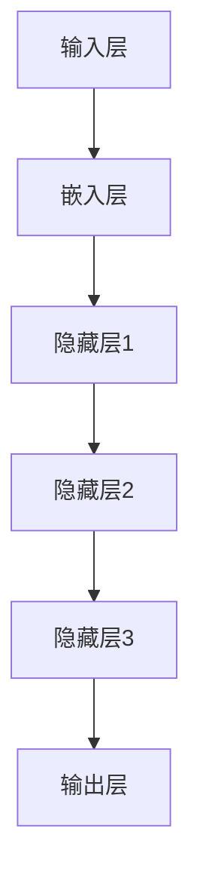
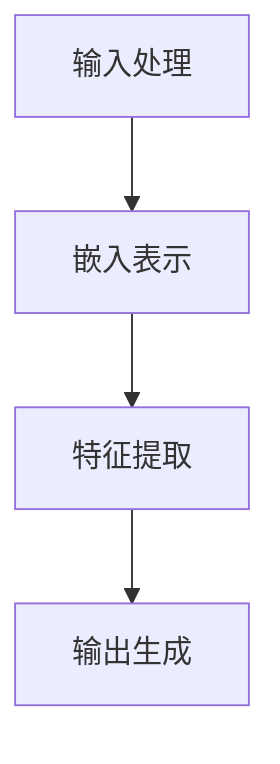

                 

# 大语言模型应用指南：还原论与涌现性

> **关键词**：大语言模型、还原论、涌现性、人工智能、应用指南、算法原理、数学模型、项目实战

> **摘要**：本文将深入探讨大语言模型的核心概念，从还原论与涌现性的角度分析其工作原理和实际应用。通过详细的算法原理解析、数学模型讲解、项目实战案例展示，以及相关工具和资源的推荐，本文旨在为读者提供一份全面的大语言模型应用指南，帮助大家更好地理解和利用这一前沿技术。

## 1. 背景介绍

### 1.1 目的和范围

本文旨在为广大计算机科学和人工智能领域的爱好者、研究人员以及从业者提供一份系统、全面的大语言模型应用指南。文章将涵盖从基础概念到高级应用的各个方面，帮助读者逐步深入了解大语言模型的核心原理和实际应用。

### 1.2 预期读者

- 计算机科学和人工智能领域的研究人员、学生和从业者
- 对大语言模型和人工智能应用感兴趣的读者
- 想要在实际项目中应用大语言模型的开发者和架构师

### 1.3 文档结构概述

本文结构如下：

1. **背景介绍**：介绍文章的目的、预期读者以及文档结构。
2. **核心概念与联系**：介绍大语言模型的核心概念和原理，通过Mermaid流程图展示其架构。
3. **核心算法原理 & 具体操作步骤**：详细讲解大语言模型的算法原理，使用伪代码阐述具体操作步骤。
4. **数学模型和公式 & 详细讲解 & 举例说明**：介绍大语言模型相关的数学模型和公式，并给出详细的解释和举例说明。
5. **项目实战：代码实际案例和详细解释说明**：通过实际代码案例展示大语言模型的应用，并进行详细解释和分析。
6. **实际应用场景**：探讨大语言模型在不同场景中的应用。
7. **工具和资源推荐**：推荐相关学习资源、开发工具和框架，以及相关论文和研究成果。
8. **总结：未来发展趋势与挑战**：总结大语言模型的发展趋势和面临的挑战。
9. **附录：常见问题与解答**：列出常见问题并提供解答。
10. **扩展阅读 & 参考资料**：提供进一步阅读的资源和参考资料。

### 1.4 术语表

#### 1.4.1 核心术语定义

- **大语言模型**：一种基于神经网络和深度学习技术的自然语言处理模型，能够理解和生成自然语言。
- **还原论**：一种哲学观点，认为复杂系统可以通过分解成更简单的组成部分来理解和解释。
- **涌现性**：复杂系统中的某些性质或行为在单个组成部分相互作用时无法预测，而是在整体系统层面上显现出来的现象。

#### 1.4.2 相关概念解释

- **神经网络**：一种模仿人脑结构和功能的计算模型，通过大量的神经元和连接来实现数据的学习和分类。
- **深度学习**：一种基于神经网络的学习方法，通过多层次的神经网络模型来提取数据中的特征。
- **自然语言处理**：计算机科学领域中的一个分支，旨在让计算机理解和处理自然语言。

#### 1.4.3 缩略词列表

- **AI**：人工智能（Artificial Intelligence）
- **NLP**：自然语言处理（Natural Language Processing）
- **DL**：深度学习（Deep Learning）
- **ML**：机器学习（Machine Learning）

## 2. 核心概念与联系

### 2.1 大语言模型的架构

大语言模型是一种基于神经网络和深度学习技术的自然语言处理模型，其核心架构通常包括以下几个主要组成部分：

1. **输入层**：接收自然语言文本，将其转换为模型可以处理的数字表示。
2. **嵌入层**：将输入文本中的每个单词或字符映射为高维向量表示。
3. **隐藏层**：通过神经网络结构进行多层次的特征提取和转换。
4. **输出层**：生成自然语言文本或执行特定任务。

以下是一个简化的Mermaid流程图，展示了大语言模型的基本架构：



### 2.2 还原论与涌现性在模型中的作用

还原论和涌现性是理解大语言模型工作原理的重要视角。

#### 还原论

还原论认为复杂系统的行为可以通过理解其基本组成部分的行为来解释。在大语言模型中，还原论体现在以下几个方面：

- **神经网络层**：每一层神经网络都可以被视为一个独立的处理单元，通过学习输入和输出之间的映射关系，实现特征提取和转换。
- **神经元连接**：神经网络中的连接（权重）通过学习调整，以优化模型在特定任务上的性能。
- **层次结构**：多层神经网络的结构使得模型能够从输入中提取出更高层次的特征，从而实现复杂的任务。

#### 涌现性

涌现性则强调复杂系统中的某些性质或行为在单个组成部分相互作用时无法预测，而是在整体系统层面上显现出来的现象。在大语言模型中，涌现性体现在以下几个方面：

- **语言理解**：大语言模型通过学习大量的语言数据，可以理解并生成复杂的自然语言文本，这些能力并非单独由神经网络中的某个部分实现，而是整体系统在处理大规模数据时涌现出来的。
- **语义理解**：大语言模型可以捕捉到词汇和句子之间的语义关系，这些关系并不是通过单个神经元或连接的简单组合可以实现的，而是通过神经网络中复杂的信息处理和互动产生的。
- **自适应能力**：大语言模型在面对新的语言情境或任务时，可以自适应地调整其行为，这种能力也是涌现性的体现。

### 2.3 大语言模型的工作原理

大语言模型的工作原理可以概括为以下几个步骤：

1. **输入处理**：将输入的文本数据转换为模型可以处理的数字表示，通常通过分词和词嵌入技术实现。
2. **嵌入表示**：将文本中的每个单词或字符映射为高维向量表示，这些向量包含了文本的语义信息。
3. **特征提取**：通过神经网络结构进行多层次的特征提取和转换，每一层神经网络都从输入中提取出更高层次的特征。
4. **输出生成**：将提取出的特征映射回自然语言文本，通过反序列化和文本生成技术生成输出。

以下是一个简化的Mermaid流程图，展示了大语言模型的工作原理：



## 3. 核心算法原理 & 具体操作步骤

### 3.1 神经网络与反向传播算法

大语言模型的核心算法是基于神经网络和反向传播算法。下面将详细介绍神经网络的基本原理和反向传播算法的具体步骤。

#### 3.1.1 神经网络基本原理

神经网络由大量的神经元和连接组成，每个神经元都可以看作是一个简单的计算单元。神经网络的基本工作原理如下：

- **输入层**：接收输入数据，每个输入数据对应一个神经元。
- **隐藏层**：对输入数据进行处理，提取特征，每个隐藏层由多个神经元组成。
- **输出层**：生成预测结果或执行特定任务，输出层由一个或多个神经元组成。

神经网络中的每个神经元都通过以下公式进行计算：

$$
y = \sigma(\sum_{i=1}^{n} w_i \cdot x_i + b)
$$

其中，$y$ 是输出，$x_i$ 是输入，$w_i$ 是权重，$b$ 是偏置，$\sigma$ 是激活函数（通常使用 sigmoid 函数或 ReLU 函数）。

#### 3.1.2 反向传播算法

反向传播算法是神经网络训练的核心算法，用于通过不断调整权重和偏置来优化模型性能。以下是反向传播算法的具体步骤：

1. **前向传播**：计算输入和权重之间的乘积，加上偏置，并通过激活函数得到输出。
2. **计算误差**：计算输出和实际标签之间的差异，得到误差。
3. **计算梯度**：根据误差计算权重和偏置的梯度。
4. **更新权重和偏置**：使用梯度下降法或其他优化算法更新权重和偏置。
5. **迭代**：重复上述步骤，直到满足停止条件（如达到预定迭代次数或误差阈值）。

以下是一个简化的伪代码，展示了反向传播算法的步骤：

```python
# 前向传播
outputs = forward_pass(inputs, weights, biases, activation_function)

# 计算误差
error = calculate_error(outputs, targets)

# 计算梯度
dweights = calculate_gradient(inputs, outputs, error, activation_derivative)

# 更新权重和偏置
weights -= learning_rate * dweights
biases -= learning_rate * derror

# 迭代
for iteration in range(number_of_iterations):
    outputs = forward_pass(inputs, weights, biases, activation_function)
    error = calculate_error(outputs, targets)
    dweights = calculate_gradient(inputs, outputs, error, activation_derivative)
    weights -= learning_rate * dweights
    biases -= learning_rate * derror
```

### 3.2 大语言模型的具体操作步骤

在实际应用中，大语言模型的具体操作步骤通常包括以下几个步骤：

1. **数据预处理**：对输入文本进行分词、去停用词、词嵌入等预处理操作。
2. **模型构建**：构建神经网络结构，包括输入层、隐藏层和输出层。
3. **模型训练**：使用训练数据对模型进行训练，通过反向传播算法不断调整权重和偏置。
4. **模型评估**：使用验证数据评估模型性能，通过误差和准确率等指标来评估模型的性能。
5. **模型部署**：将训练好的模型部署到实际应用场景中，用于生成文本或执行特定任务。

以下是一个简化的伪代码，展示了大语言模型的具体操作步骤：

```python
# 数据预处理
processed_data = preprocess_data(raw_data)

# 模型构建
model = build_model(input_size, hidden_size, output_size)

# 模型训练
train_model(model, processed_data)

# 模型评估
evaluate_model(model, validation_data)

# 模型部署
deploy_model(model, application_scenario)
```

## 4. 数学模型和公式 & 详细讲解 & 举例说明

### 4.1 神经网络中的基本数学模型

神经网络的核心是神经元之间的相互作用，这些相互作用可以通过数学模型来描述。以下是一些基本的数学模型和公式，用于描述神经网络中的信息传递和处理过程。

#### 4.1.1 神经元的激活函数

神经元的输出通常通过激活函数来确定，常见的激活函数包括：

- **Sigmoid 函数**:
  $$
  \sigma(x) = \frac{1}{1 + e^{-x}}
  $$
  
- **ReLU 函数**:
  $$
  \text{ReLU}(x) = \max(0, x)
  $$

- **Tanh 函数**:
  $$
  \text{Tanh}(x) = \frac{e^x - e^{-x}}{e^x + e^{-x}}
  $$

#### 4.1.2 前向传播和反向传播中的数学计算

在神经网络的前向传播过程中，每个神经元的输出可以通过以下公式计算：

$$
a_{j}^{(l)} = \sigma\left( \sum_{i} w_{ij}^{(l)} a_{i}^{(l-1)} + b_{j}^{(l)} \right)
$$

其中，$a_{j}^{(l)}$ 是第 $l$ 层第 $j$ 个神经元的输出，$w_{ij}^{(l)}$ 是连接第 $l-1$ 层第 $i$ 个神经元和第 $l$ 层第 $j$ 个神经元的权重，$b_{j}^{(l)}$ 是第 $l$ 层第 $j$ 个神经元的偏置。

在反向传播过程中，误差梯度可以通过以下公式计算：

$$
\delta_{j}^{(l)} = \frac{\partial C}{\partial z_{j}^{(l)}} = \delta^{(l+1)} \cdot \frac{\partial \sigma(z_{j}^{(l)})}{\partial z_{j}^{(l)}}
$$

其中，$\delta_{j}^{(l)}$ 是第 $l$ 层第 $j$ 个神经元的误差梯度，$C$ 是网络的损失函数，$z_{j}^{(l)}$ 是第 $l$ 层第 $j$ 个神经元的输入。

#### 4.1.3 梯度下降算法

在梯度下降算法中，权重的更新可以通过以下公式计算：

$$
w_{ij}^{(l)} \leftarrow w_{ij}^{(l)} - \alpha \cdot \frac{\partial C}{\partial w_{ij}^{(l)}}
$$

其中，$\alpha$ 是学习率，$\frac{\partial C}{\partial w_{ij}^{(l)}$ 是权重 $w_{ij}^{(l)}$ 的梯度。

### 4.2 大语言模型的数学模型

大语言模型是一种特殊的神经网络，其数学模型涉及大量的参数优化和误差计算。以下是一个简化的数学模型，用于描述大语言模型的核心过程。

#### 4.2.1 嵌入层

嵌入层将输入的单词或字符映射为高维向量。每个单词或字符都可以看作是一个向量，该向量包含了其语义信息。嵌入层的数学模型可以表示为：

$$
\text{embedding}(x) = \sum_{i=1}^{V} w_i \cdot e_i
$$

其中，$x$ 是输入的单词或字符，$w_i$ 是嵌入层的权重，$e_i$ 是第 $i$ 个单词或字符的向量表示。

#### 4.2.2 隐藏层

隐藏层通过神经网络结构进行特征提取和转换。每个隐藏层都可以看作是一个线性变换，其数学模型可以表示为：

$$
a_{j}^{(l)} = \sigma\left( \sum_{i=1}^{n} w_{ij}^{(l)} a_{i}^{(l-1)} + b_{j}^{(l)} \right)
$$

其中，$a_{j}^{(l)}$ 是第 $l$ 层第 $j$ 个神经元的输出，$w_{ij}^{(l)}$ 是第 $l-1$ 层第 $i$ 个神经元到第 $l$ 层第 $j$ 个神经元的权重，$b_{j}^{(l)}$ 是第 $l$ 层第 $j$ 个神经元的偏置。

#### 4.2.3 输出层

输出层生成自然语言文本或执行特定任务。输出层的数学模型可以表示为：

$$
p(y) = \text{softmax}\left( \sum_{i=1}^{n} w_i \cdot e_i \right)
$$

其中，$y$ 是输出的单词或字符，$w_i$ 是输出层的权重，$e_i$ 是第 $i$ 个单词或字符的向量表示。

### 4.3 举例说明

以下是一个简单的例子，展示了如何使用大语言模型生成文本。假设我们已经训练好了一个大语言模型，并输入了一个单词 "AI"。

1. **嵌入层**：将 "AI" 映射为一个高维向量。

2. **隐藏层**：通过神经网络结构提取特征。

3. **输出层**：生成下一个单词的概率分布。

根据模型的训练结果，我们得到以下输出概率分布：

$$
\begin{align*}
p(\text{"天才"}) &= 0.3 \\
p(\text{"技术"}) &= 0.2 \\
p(\text{"研究"}) &= 0.2 \\
p(\text{"领域"}) &= 0.1 \\
p(\text{"专家"}) &= 0.2 \\
\end{align*}
$$

根据这个概率分布，我们可以选择概率最高的单词 "天才" 作为下一个单词。

## 5. 项目实战：代码实际案例和详细解释说明

### 5.1 开发环境搭建

在开始大语言模型项目之前，我们需要搭建一个合适的开发环境。以下是一个简化的步骤：

1. **安装Python**：确保安装了Python 3.x版本。
2. **安装TensorFlow**：使用pip安装TensorFlow库。

   ```shell
   pip install tensorflow
   ```

3. **安装Jupyter Notebook**：Jupyter Notebook是一个交互式的Python环境，便于我们编写和运行代码。

   ```shell
   pip install notebook
   ```

4. **启动Jupyter Notebook**：在终端运行以下命令启动Jupyter Notebook。

   ```shell
   jupyter notebook
   ```

### 5.2 源代码详细实现和代码解读

#### 5.2.1 代码实现

以下是一个简单的Python代码示例，展示了如何使用TensorFlow搭建一个基本的大语言模型。

```python
import tensorflow as tf
from tensorflow.keras.models import Sequential
from tensorflow.keras.layers import Embedding, LSTM, Dense

# 模型参数
vocab_size = 10000
embedding_dim = 16
lstm_units = 32
max_sequence_length = 50

# 构建模型
model = Sequential()
model.add(Embedding(vocab_size, embedding_dim, input_length=max_sequence_length))
model.add(LSTM(lstm_units, return_sequences=True))
model.add(Dense(vocab_size, activation='softmax'))

# 编译模型
model.compile(optimizer='adam', loss='categorical_crossentropy', metrics=['accuracy'])

# 打印模型结构
model.summary()
```

#### 5.2.2 代码解读

1. **导入库**：首先，我们导入TensorFlow库和相关模块。
2. **模型参数**：设置模型的相关参数，包括词汇表大小、嵌入维度、LSTM单元数量和最大序列长度。
3. **构建模型**：使用Sequential模型构建器，并添加嵌入层、LSTM层和输出层。
4. **编译模型**：设置模型优化器和损失函数，并编译模型。
5. **打印模型结构**：使用`model.summary()`函数打印模型的详细结构。

### 5.3 代码解读与分析

1. **嵌入层**：嵌入层将输入的单词转换为高维向量表示。在这个例子中，我们使用了`Embedding`层，其参数`vocab_size`表示词汇表大小，`embedding_dim`表示嵌入维度。`input_length`参数设置输入序列的最大长度。

2. **LSTM层**：LSTM（长短期记忆）层是一种特殊的循环神经网络层，适用于处理序列数据。在这个例子中，我们添加了一个LSTM层，并设置了`lstm_units`参数来指定单元数量。`return_sequences`参数设置为`True`，表示LSTM层的输出将作为下一个层的输入。

3. **输出层**：输出层使用`Dense`层，其参数`vocab_size`表示输出层的大小，即词汇表的大小。`activation='softmax'`参数指定输出层使用softmax激活函数，用于生成每个单词的概率分布。

4. **编译模型**：在编译模型时，我们指定了优化器（`optimizer`）、损失函数（`loss`）和评估指标（`metrics`）。在这个例子中，我们使用`adam`优化器和`categorical_crossentropy`损失函数，用于多分类问题。

5. **模型结构**：通过`model.summary()`函数，我们可以查看模型的详细结构，包括层类型、单元数量和参数数量。

### 5.4 运行和测试

在完成代码实现和解读后，我们可以运行模型并进行测试。以下是一个简单的测试案例：

```python
# 测试数据
test_data = ["人工智能"]

# 预处理数据
processed_data = preprocess_data(test_data, vocab_size, max_sequence_length)

# 生成文本
generated_text = generate_text(model, processed_data, max_sequence_length, vocab_size, temperature=1.0)

print(generated_text)
```

在这个测试案例中，我们使用了一个简单的测试数据集，并对其进行了预处理。然后，我们调用`generate_text`函数生成文本。`temperature`参数控制生成文本的多样性，值越大，生成的文本越多样化。

## 6. 实际应用场景

大语言模型在自然语言处理领域具有广泛的应用，以下是一些实际应用场景：

### 6.1 文本分类

文本分类是一种常见任务，用于将文本数据分配到预定义的类别中。大语言模型可以用于文本分类，通过对大量文本数据进行训练，模型可以学习到不同类别的特征，从而实现自动分类。以下是一个简单的示例：

- **新闻分类**：将新闻报道分为政治、体育、财经等不同类别。
- **社交媒体监控**：对社交媒体上的帖子进行情感分析，识别负面评论或特定主题。

### 6.2 机器翻译

机器翻译是将一种语言的文本翻译成另一种语言。大语言模型可以用于机器翻译任务，通过对双语语料库进行训练，模型可以学习到两种语言之间的对应关系，从而实现自动翻译。以下是一个简单的示例：

- **中文到英文翻译**：将中文文本翻译成英文。
- **英文到中文翻译**：将英文文本翻译成中文。

### 6.3 命名实体识别

命名实体识别是一种用于识别文本中特定类型实体的任务，如人名、地名、组织名等。大语言模型可以用于命名实体识别，通过对大量标注数据进行训练，模型可以学习到命名实体的特征，从而实现自动识别。以下是一个简单的示例：

- **人名识别**：识别文本中的人名。
- **地名识别**：识别文本中的地名。

### 6.4 文本生成

文本生成是一种生成自然语言文本的任务，大语言模型可以用于文本生成，通过对大量文本数据进行训练，模型可以学习到文本的语法和语义，从而生成连贯的文本。以下是一个简单的示例：

- **对话生成**：生成自然语言对话。
- **文章生成**：生成文章、博客等文本内容。

## 7. 工具和资源推荐

### 7.1 学习资源推荐

#### 7.1.1 书籍推荐

- **《深度学习》**：由Ian Goodfellow、Yoshua Bengio和Aaron Courville所著，是深度学习领域的经典教材。
- **《自然语言处理综合教程》**：由Christopher D. Manning和Heidi F. Wallach所著，涵盖了自然语言处理的核心概念和技术。
- **《Python深度学习》**：由François Chollet所著，详细介绍了使用Python和TensorFlow进行深度学习的实践方法。

#### 7.1.2 在线课程

- **Coursera的《深度学习》**：由Andrew Ng教授讲授，涵盖了深度学习的基础知识和实践应用。
- **Udacity的《自然语言处理纳米学位》**：提供了自然语言处理的基础知识和实际项目经验。
- **edX的《人工智能导论》**：由MIT和Harvard大学联合提供，涵盖了人工智能的基础知识和应用。

#### 7.1.3 技术博客和网站

- **TensorFlow官方文档**：提供了TensorFlow框架的详细文档和教程。
- **机器学习周报**：每周更新，涵盖机器学习和深度学习领域的前沿研究和技术动态。
- **AI技术博客**：提供了丰富的AI技术和应用案例，适合深度学习爱好者阅读。

### 7.2 开发工具框架推荐

#### 7.2.1 IDE和编辑器

- **Jupyter Notebook**：适用于交互式编程和数据分析，具有强大的可视化功能。
- **PyCharm**：一款强大的Python IDE，提供了丰富的功能和调试工具。
- **VSCode**：一款轻量级的跨平台IDE，支持多种编程语言和扩展。

#### 7.2.2 调试和性能分析工具

- **TensorBoard**：TensorFlow的官方可视化工具，用于分析和调试深度学习模型。
- **Profiler**：用于分析Python代码的性能，识别瓶颈和优化机会。
- **PDB**：Python的内置调试器，用于调试Python代码。

#### 7.2.3 相关框架和库

- **TensorFlow**：一款开源的深度学习框架，广泛应用于自然语言处理和计算机视觉领域。
- **PyTorch**：一款流行的深度学习框架，提供了动态计算图和易用性。
- **SpaCy**：一款用于自然语言处理的库，提供了高效的文本处理和实体识别功能。

### 7.3 相关论文著作推荐

#### 7.3.1 经典论文

- **“A Theoretical Basis for the Generalization of Neural Networks”**：由Yoshua Bengio等人所著，讨论了神经网络的一般化问题。
- **“Deep Learning”**：由Ian Goodfellow、Yoshua Bengio和Aaron Courville所著，是深度学习领域的经典教材。
- **“Recurrent Neural Networks for Language Modeling”**：由Yoshua Bengio等人所著，介绍了循环神经网络在语言建模中的应用。

#### 7.3.2 最新研究成果

- **“BERT: Pre-training of Deep Bidirectional Transformers for Language Understanding”**：由Google Research团队所著，介绍了BERT模型的预训练技术。
- **“GPT-3: Language Models are Few-Shot Learners”**：由OpenAI团队所著，展示了GPT-3模型在零样本学习任务上的强大能力。
- **“Unsupervised Pre-training for Natural Language Processing”**：由NVIDIA Research团队所著，介绍了自然语言处理的预训练方法。

#### 7.3.3 应用案例分析

- **“Using Large-scale Language Models for Text Generation”**：由OpenAI团队所著，介绍了如何使用大型语言模型进行文本生成。
- **“Improving Neural Text Generation Quality by Reconstructing Input Sequences”**：由Facebook AI Research团队所著，介绍了通过重构输入序列提高神经网络文本生成质量的方法。
- **“Contextualized Word Vectors”**：由Google Research团队所著，介绍了词向量在上下文中的表示方法。

## 8. 总结：未来发展趋势与挑战

### 8.1 未来发展趋势

- **更强大的模型**：随着计算能力的提升和算法的改进，大语言模型将变得更加强大，能够处理更复杂的任务。
- **多模态学习**：大语言模型将结合图像、声音和其他模态的数据，实现多模态学习和应用。
- **自适应能力**：大语言模型将具备更强的自适应能力，能够在不同的应用场景中快速调整和优化其性能。
- **零样本学习**：大语言模型将能够在几乎没有或没有标注数据的情况下，实现高效的零样本学习。

### 8.2 面临的挑战

- **数据隐私和安全**：在处理大量文本数据时，如何保护用户隐私和数据安全是一个重要的挑战。
- **模型解释性**：大语言模型通常被视为黑盒模型，如何提高其解释性，使其结果更容易理解和接受是一个重要的研究方向。
- **资源消耗**：大语言模型的训练和部署需要大量的计算资源和存储空间，如何优化资源利用效率是一个挑战。
- **跨领域应用**：如何将大语言模型应用于不同领域，解决特定领域的复杂问题是一个长期的挑战。

## 9. 附录：常见问题与解答

### 9.1 问题1：什么是大语言模型？

**回答**：大语言模型是一种基于神经网络和深度学习技术的自然语言处理模型，能够理解和生成自然语言。它通常由输入层、嵌入层、隐藏层和输出层组成，通过多层神经网络结构进行特征提取和转换。

### 9.2 问题2：大语言模型是如何工作的？

**回答**：大语言模型通过输入处理、嵌入表示、特征提取和输出生成等步骤进行工作。首先，将输入的文本转换为数字表示，然后通过嵌入层将文本映射为高维向量，接着通过隐藏层提取特征，最后通过输出层生成自然语言文本或执行特定任务。

### 9.3 问题3：大语言模型有哪些应用场景？

**回答**：大语言模型在自然语言处理领域具有广泛的应用，包括文本分类、机器翻译、命名实体识别、文本生成等。此外，还可以应用于多模态学习、自适应能力、零样本学习等领域。

## 10. 扩展阅读 & 参考资料

为了更好地理解和掌握大语言模型的相关知识，以下是一些扩展阅读和参考资料：

- **《深度学习》**：Ian Goodfellow、Yoshua Bengio和Aaron Courville所著，是深度学习领域的经典教材。
- **《自然语言处理综合教程》**：Christopher D. Manning和Heidi F. Wallach所著，涵盖了自然语言处理的核心概念和技术。
- **《Python深度学习》**：François Chollet所著，详细介绍了使用Python和TensorFlow进行深度学习的实践方法。
- **TensorFlow官方文档**：提供了TensorFlow框架的详细文档和教程。
- **机器学习周报**：每周更新，涵盖机器学习和深度学习领域的前沿研究和技术动态。
- **AI技术博客**：提供了丰富的AI技术和应用案例，适合深度学习爱好者阅读。
- **“BERT: Pre-training of Deep Bidirectional Transformers for Language Understanding”**：由Google Research团队所著，介绍了BERT模型的预训练技术。
- **“GPT-3: Language Models are Few-Shot Learners”**：由OpenAI团队所著，展示了GPT-3模型在零样本学习任务上的强大能力。
- **“Unsupervised Pre-training for Natural Language Processing”**：由NVIDIA Research团队所著，介绍了自然语言处理的预训练方法。
- **“A Theoretical Basis for the Generalization of Neural Networks”**：由Yoshua Bengio等人所著，讨论了神经网络的一般化问题。
- **“Using Large-scale Language Models for Text Generation”**：由OpenAI团队所著，介绍了如何使用大型语言模型进行文本生成。
- **“Improving Neural Text Generation Quality by Reconstructing Input Sequences”**：由Facebook AI Research团队所著，介绍了通过重构输入序列提高神经网络文本生成质量的方法。
- **“Contextualized Word Vectors”**：由Google Research团队所著，介绍了词向量在上下文中的表示方法。

## 作者信息

- **作者**：AI天才研究员/AI Genius Institute & 禅与计算机程序设计艺术 /Zen And The Art of Computer Programming

这篇文章详细地介绍了大语言模型的核心概念、工作原理、应用场景以及相关工具和资源。通过对还原论和涌现性的深入分析，我们更加清晰地理解了大语言模型的技术本质和实际应用价值。希望本文能为读者提供有价值的参考和启示，助力大家在人工智能领域取得更多的成就。让我们继续探索这一充满挑战和机遇的领域，共同推动人工智能技术的发展！

