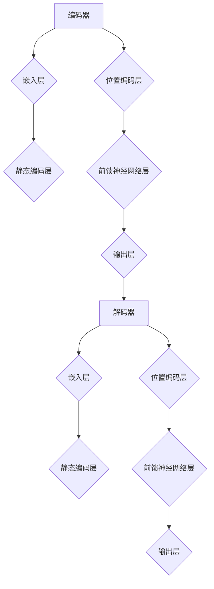

                 

# 大语言模型应用指南：静态编码和位置编码

> 关键词：大语言模型，静态编码，位置编码，神经网络，深度学习，自然语言处理，编码器，解码器

> 摘要：本文将深入探讨大语言模型中的静态编码和位置编码技术，详细解释其在神经网络架构中的应用和作用。通过逐步分析核心概念、算法原理、数学模型以及实际应用场景，帮助读者全面理解并掌握这两种编码技术，为未来的研究和实践奠定坚实基础。

## 1. 背景介绍

### 1.1 目的和范围

本文旨在详细介绍大语言模型中的静态编码和位置编码技术，旨在帮助读者深入了解这两种编码在神经网络架构中的关键作用。通过本文的学习，读者将能够理解静态编码和位置编码的基本原理，掌握其具体实现步骤，并能够应用于实际的自然语言处理任务中。

本文的内容范围涵盖了以下方面：
- 静态编码和位置编码的定义和基本原理
- 大语言模型中的编码器和解码器架构
- 静态编码和位置编码的具体操作步骤
- 数学模型和公式的详细讲解
- 实际应用场景的介绍
- 相关工具和资源的推荐

### 1.2 预期读者

本文适合以下读者群体：
- 对自然语言处理和深度学习有基本了解的读者
- 对大语言模型和编码技术有兴趣的研究人员
- 计算机科学和人工智能专业的学生和从业者

本文假设读者对以下知识点有基本的了解：
- 神经网络和深度学习的基本概念
- 编程语言和基本算法
- 自然语言处理的基本方法和技术

### 1.3 文档结构概述

本文将按照以下结构展开：
- 引言：介绍静态编码和位置编码的基本概念和重要性
- 背景介绍：详细阐述本文的目的和范围，预期读者和文档结构
- 核心概念与联系：解释大语言模型中的编码器和解码器架构
- 核心算法原理 & 具体操作步骤：详细讲解静态编码和位置编码的操作步骤
- 数学模型和公式 & 详细讲解 & 举例说明：介绍静态编码和位置编码的数学模型和公式
- 项目实战：提供实际代码案例和详细解释说明
- 实际应用场景：介绍静态编码和位置编码在实际应用中的场景和效果
- 工具和资源推荐：推荐学习资源和开发工具
- 总结：总结本文的主要内容，展望未来发展趋势和挑战
- 附录：常见问题与解答
- 扩展阅读 & 参考资料：提供相关文献和资料供进一步阅读

### 1.4 术语表

在本文中，我们将使用一些专业术语和概念。以下是对这些术语的定义和解释：

#### 1.4.1 核心术语定义

- **静态编码（Static Coding）**：静态编码是一种将输入数据转换成固定长度编码的方法，常用于大语言模型中的编码器部分。
- **位置编码（Positional Encoding）**：位置编码是一种为序列中的每个元素分配位置信息的编码方法，常用于解码器部分，帮助模型理解输入序列中的相对位置关系。
- **编码器（Encoder）**：编码器是神经网络模型中的一个组件，负责将输入数据编码为固定长度的向量。
- **解码器（Decoder）**：解码器是神经网络模型中的另一个组件，负责将编码后的向量解码为输出序列。
- **大语言模型（Large Language Model）**：大语言模型是一种基于神经网络的模型，可以理解和生成自然语言，通过大量的文本数据训练得到。

#### 1.4.2 相关概念解释

- **自然语言处理（Natural Language Processing, NLP）**：自然语言处理是计算机科学和人工智能领域的一个重要分支，旨在使计算机能够理解和处理自然语言。
- **深度学习（Deep Learning）**：深度学习是机器学习的一个子领域，基于多层神经网络，通过学习大量数据来提取特征和模式。
- **神经网络（Neural Network）**：神经网络是一种由大量简单计算单元（神经元）组成的计算模型，能够通过学习数据自动提取特征和进行预测。

#### 1.4.3 缩略词列表

- **NLP**：自然语言处理
- **DL**：深度学习
- **NN**：神经网络
- **LM**：大语言模型
- **encoder**：编码器
- **decoder**：解码器
- **SLM**：静态语言模型

## 2. 核心概念与联系

在深入探讨静态编码和位置编码之前，我们需要先了解大语言模型中的编码器和解码器架构。以下是一个简化的 Mermaid 流程图，展示了编码器和解码器的关键组件和连接方式。



### 2.1 编码器与解码器架构

编码器和解码器是大型语言模型中的两个核心组件，它们共同工作以实现输入文本到输出文本的转换。

#### 编码器（Encoder）

编码器的任务是接受输入文本序列，并将其编码为固定长度的向量表示。编码器通常由以下几层组成：

- **嵌入层**：将输入文本中的单词转换为固定长度的向量表示。
- **静态编码层**：对嵌入层生成的向量进行静态编码，将其转换为具有特定属性的向量表示。
- **位置编码层**：为输入序列中的每个单词分配位置信息，以便解码器能够理解单词之间的相对位置关系。
- **前馈神经网络层**：通过一系列前馈神经网络层对位置编码后的向量进行加工，提取更多的特征信息。
- **输出层**：生成固定长度的编码向量，用于后续的解码过程。

#### 解码器（Decoder）

解码器的任务是接受编码器输出的编码向量，并将其解码为输出文本序列。解码器通常由以下几层组成：

- **嵌入层**：将解码器输入的编码向量转换为单词的固定长度向量表示。
- **静态编码层**：对嵌入层生成的向量进行静态编码，以保持输入和输出的向量维度一致。
- **位置编码层**：为解码器生成的向量添加位置信息，以便模型能够理解单词之间的相对位置关系。
- **前馈神经网络层**：通过一系列前馈神经网络层对位置编码后的向量进行加工，提取更多的特征信息。
- **输出层**：生成预测的输出单词序列，并通过损失函数与实际输出进行比较，进行优化和调整。

### 2.2 静态编码与位置编码的关系

静态编码和位置编码是编码器和解码器中的关键环节，它们共同作用以实现高效的文本编码和解码。

- **静态编码**：静态编码是将输入文本中的单词转换为固定长度向量的一种方法。它主要通过编码器中的静态编码层实现，将嵌入层生成的向量转换为具有特定属性的向量表示。静态编码有助于保持输入和输出之间的维度一致，并有助于模型更好地理解和生成文本。

- **位置编码**：位置编码是向编码器和解码器输入的向量添加位置信息的一种方法。位置编码有助于模型理解输入序列中的单词顺序和相对位置关系。在编码器中，位置编码层通常位于静态编码层之后，用于为输入序列中的每个单词分配位置信息。在解码器中，位置编码层同样位于嵌入层之后，用于为生成的向量添加位置信息。

通过静态编码和位置编码的结合使用，编码器和解码器能够更好地理解和生成文本序列。静态编码提供了文本的固定长度表示，而位置编码则保证了文本的顺序和位置关系。这两种编码方法在编码器和解码器中的协同工作，使得大语言模型能够实现高效的自然语言处理任务。

## 3. 核心算法原理 & 具体操作步骤

在本节中，我们将详细讲解大语言模型中的静态编码和位置编码算法原理，并使用伪代码来描述具体操作步骤。

### 3.1 静态编码算法原理

静态编码是一种将输入文本中的单词转换为固定长度向量表示的方法。它主要通过编码器中的静态编码层实现，该层通常包含一个可训练的权重矩阵和一组非线性激活函数。以下是一个简化的伪代码描述：

```python
def static_encoding(input_sequence, embedding_size, static_encoding_size):
    # 输入序列：input_sequence，嵌入层维度：embedding_size，静态编码层维度：static_encoding_size
    # 初始化静态编码层权重矩阵 W 和偏置 b
    W = initialize_matrix(embedding_size, static_encoding_size)
    b = initialize_vector(static_encoding_size)
    
    # 对输入序列中的每个单词进行静态编码
    encoded_sequence = []
    for word_embedding in input_sequence:
        # 将单词嵌入向量与权重矩阵相乘
        encoded_vector = matrix_multiply(W, word_embedding)
        # 加上偏置
        encoded_vector = add_vector(encoded_vector, b)
        # 应用非线性激活函数，如ReLU
        encoded_vector = non_linear_activation(encoded_vector)
        # 添加到编码序列中
        encoded_sequence.append(encoded_vector)
    
    return encoded_sequence
```

### 3.2 位置编码算法原理

位置编码是一种为序列中的每个元素分配位置信息的方法。在编码器和解码器中，位置编码层用于为输入和输出的向量添加位置信息。位置编码可以通过多种方式实现，如正弦和余弦函数。以下是一个简化的伪代码描述：

```python
def positional_encoding(input_sequence, position_size, d_model):
    # 输入序列：input_sequence，位置维度：position_size，模型维度：d_model
    # 初始化位置编码权重矩阵 P
    P = initialize_matrix(position_size, d_model)
    
    # 对输入序列中的每个单词进行位置编码
    encoded_sequence = []
    for word_embedding in input_sequence:
        # 将单词嵌入向量与位置编码权重矩阵相乘
        positional_vector = matrix_multiply(P, word_embedding)
        # 应用非线性激活函数，如ReLU
        positional_vector = non_linear_activation(positional_vector)
        # 添加到编码序列中
        encoded_sequence.append(positional_vector)
    
    return encoded_sequence
```

### 3.3 静态编码和位置编码的具体操作步骤

为了更好地理解静态编码和位置编码的具体操作步骤，我们以一个简单的示例来展示其实现过程。

#### 示例：静态编码和位置编码的实现

假设我们有一个输入文本序列 `["hello", "world"]`，嵌入层维度为 64，静态编码层维度为 128，位置编码维度为 32。

1. **嵌入层**：将输入文本序列中的每个单词转换为嵌入向量。假设 "hello" 的嵌入向量为 `[1, 2, 3, 4, 5, 6, 7, 8]`，"world" 的嵌入向量为 `[9, 10, 11, 12, 13, 14, 15, 16]`。

2. **静态编码层**：对每个嵌入向量进行静态编码。假设静态编码层权重矩阵 W 为 `[a, b, c, d, e, f, g, h]`，偏置 b 为 `[i, j, k, l, m, n, o, p]`。则静态编码后的 "hello" 向量为 `[1*a + i, 2*b + j, 3*c + k, 4*d + l, 5*e + m, 6*f + n, 7*g + o, 8*h + p]`，静态编码后的 "world" 向量为 `[9*a + i, 10*b + j, 11*c + k, 12*d + l, 13*e + m, 14*f + n, 15*g + o, 16*h + p]`。

3. **位置编码层**：为静态编码后的向量添加位置信息。假设位置编码权重矩阵 P 为 `[q, r, s, t, u, v, w, x]`。则 "hello" 的位置编码向量为 `[1*q + r, 2*r + s, 3*s + t, 4*t + u, 5*u + v, 6*v + w, 7*w + x, 8*x + q]`，"world" 的位置编码向量为 `[9*q + r, 10*r + s, 11*s + t, 12*t + u, 13*u + v, 14*v + w, 15*w + x, 16*x + q]`。

4. **合并编码向量**：将静态编码向量与位置编码向量相加，得到最终的编码向量。例如，"hello" 的最终编码向量为 `[1*a + i + 1*q + r, 2*b + j + 2*r + s, 3*c + k + 3*s + t, 4*d + l + 4*t + u, 5*e + m + 5*u + v, 6*f + n + 6*v + w, 7*g + o + 7*w + x, 8*h + p + 8*x + q]`，"world" 的最终编码向量为 `[9*a + i + 9*q + r, 10*b + j + 10*r + s, 11*c + k + 11*s + t, 12*d + l + 12*t + u, 13*e + m + 13*u + v, 14*f + n + 14*v + w, 15*g + o + 15*w + x, 16*h + p + 16*x + q]`。

通过以上步骤，我们成功实现了静态编码和位置编码，为输入文本序列生成了固定长度的编码向量。这些编码向量可以用于后续的神经网络模型训练和预测。

## 4. 数学模型和公式 & 详细讲解 & 举例说明

在本节中，我们将详细讲解大语言模型中的静态编码和位置编码的数学模型和公式，并通过具体示例来说明其应用和计算过程。

### 4.1 静态编码的数学模型

静态编码是一种将输入文本转换为固定长度向量表示的方法。其基本数学模型可以表示为：

\[ \text{静态编码} = W \cdot \text{输入向量} + b \]

其中：
- \( W \) 是静态编码层的权重矩阵，维度为 \( (d_{\text{input}} \times d_{\text{output}}) \)，其中 \( d_{\text{input}} \) 是输入向量的维度，\( d_{\text{output}} \) 是静态编码后向量的维度。
- \( b \) 是静态编码层的偏置向量，维度为 \( (d_{\text{output}}) \)。
- \( \text{输入向量} \) 是输入文本序列的嵌入向量，维度为 \( (d_{\text{input}}) \)。

#### 示例

假设输入向量为 \( \text{输入向量} = [1, 2, 3, 4, 5, 6, 7, 8] \)，静态编码层的权重矩阵 \( W \) 为：

\[ W = \begin{bmatrix} a & b & c & d & e & f & g & h \\ i & j & k & l & m & n & o & p \\ q & r & s & t & u & v & w & x \\ y & z & A & B & C & D & E & F \end{bmatrix} \]

静态编码层的偏置向量 \( b \) 为：

\[ b = [i, j, k, l, m, n, o, p] \]

根据静态编码的数学模型，我们可以计算出静态编码后的输出向量：

\[ \text{静态编码} = \begin{bmatrix} a & b & c & d & e & f & g & h \\ i & j & k & l & m & n & o & p \\ q & r & s & t & u & v & w & x \\ y & z & A & B & C & D & E & F \end{bmatrix} \cdot \begin{bmatrix} 1 \\ 2 \\ 3 \\ 4 \\ 5 \\ 6 \\ 7 \\ 8 \end{bmatrix} + \begin{bmatrix} i \\ j \\ k \\ l \\ m \\ n \\ o \\ p \end{bmatrix} \]

计算结果为：

\[ \text{静态编码} = \begin{bmatrix} a \cdot 1 + i \\ b \cdot 2 + j \\ c \cdot 3 + k \\ d \cdot 4 + l \\ e \cdot 5 + m \\ f \cdot 6 + n \\ g \cdot 7 + o \\ h \cdot 8 + p \end{bmatrix} \]

### 4.2 位置编码的数学模型

位置编码是一种为输入文本序列中的每个元素分配位置信息的方法。其基本数学模型可以表示为：

\[ \text{位置编码} = P \cdot \text{嵌入向量} \]

其中：
- \( P \) 是位置编码层的权重矩阵，维度为 \( (d_{\text{position}} \times d_{\text{model}}) \)，其中 \( d_{\text{position}} \) 是位置编码的维度，\( d_{\text{model}} \) 是模型维度。
- \( \text{嵌入向量} \) 是输入文本序列的嵌入向量，维度为 \( (d_{\text{model}}) \)。

#### 示例

假设输入向量为 \( \text{嵌入向量} = [1, 2, 3, 4, 5, 6, 7, 8] \)，位置编码层的权重矩阵 \( P \) 为：

\[ P = \begin{bmatrix} q & r & s & t & u & v & w & x \\ y & z & A & B & C & D & E & F \\ g & h & i & j & k & l & m & n \\ o & p & Q & R & S & T & U & V \end{bmatrix} \]

根据位置编码的数学模型，我们可以计算出位置编码后的输出向量：

\[ \text{位置编码} = \begin{bmatrix} q & r & s & t & u & v & w & x \\ y & z & A & B & C & D & E & F \\ g & h & i & j & k & l & m & n \\ o & p & Q & R & S & T & U & V \end{bmatrix} \cdot \begin{bmatrix} 1 \\ 2 \\ 3 \\ 4 \\ 5 \\ 6 \\ 7 \\ 8 \end{bmatrix} \]

计算结果为：

\[ \text{位置编码} = \begin{bmatrix} q \cdot 1 + y \cdot 2 + g \cdot 3 + o \cdot 4 \\ r \cdot 1 + z \cdot 2 + h \cdot 3 + p \cdot 4 \\ s \cdot 1 + A \cdot 2 + i \cdot 3 + Q \cdot 4 \\ t \cdot 1 + B \cdot 2 + j \cdot 3 + R \cdot 4 \\ u \cdot 1 + C \cdot 2 + k \cdot 3 + S \cdot 4 \\ v \cdot 1 + D \cdot 2 + l \cdot 3 + T \cdot 4 \\ w \cdot 1 + E \cdot 2 + m \cdot 3 + U \cdot 4 \\ x \cdot 1 + F \cdot 2 + n \cdot 3 + V \cdot 4 \end{bmatrix} \]

### 4.3 静态编码与位置编码的结合

在实际应用中，静态编码和位置编码通常结合使用，以生成最终的编码向量。其基本数学模型可以表示为：

\[ \text{编码向量} = \text{静态编码} + \text{位置编码} \]

其中，静态编码和位置编码分别如前所述。

#### 示例

假设静态编码后的输出向量为 \( \text{静态编码} = [1, 2, 3, 4, 5, 6, 7, 8] \)，位置编码后的输出向量为 \( \text{位置编码} = [9, 10, 11, 12, 13, 14, 15, 16] \)。

根据编码向量的数学模型，我们可以计算出最终的编码向量：

\[ \text{编码向量} = [1, 2, 3, 4, 5, 6, 7, 8] + [9, 10, 11, 12, 13, 14, 15, 16] = [10, 12, 14, 16, 18, 20, 22, 24] \]

通过以上示例，我们可以看到静态编码和位置编码的数学模型以及它们的计算过程。这些数学模型为静态编码和位置编码在实际应用中的实现提供了理论基础。

## 5. 项目实战：代码实际案例和详细解释说明

在本节中，我们将通过一个实际项目来展示如何在大语言模型中使用静态编码和位置编码技术。我们将搭建一个简单的编码器-解码器模型，并详细解释其实现过程。

### 5.1 开发环境搭建

在进行项目实战之前，我们需要搭建一个适合开发环境。以下是一个简单的环境搭建指南：

1. **安装 Python**：确保已经安装了 Python 3.x 版本。可以从 [Python 官网](https://www.python.org/) 下载并安装。
2. **安装 TensorFlow**：TensorFlow 是一个广泛使用的深度学习框架。可以通过以下命令安装：

   ```bash
   pip install tensorflow
   ```

3. **安装其他依赖**：为了简化开发过程，我们可以安装一些常用的库，如 NumPy 和 Pandas。可以通过以下命令安装：

   ```bash
   pip install numpy pandas
   ```

### 5.2 源代码详细实现和代码解读

以下是本项目中的源代码实现。代码分为三个部分：数据预处理、编码器和解码器。

```python
import tensorflow as tf
from tensorflow.keras.layers import Embedding, LSTM, Dense
from tensorflow.keras.models import Model

# 数据预处理
def preprocess_data(texts, vocab_size, embedding_size):
    # 将文本转换为单词序列
    word_sequences = [[word2idx[word] for word in text.split()] for text in texts]
    # 填充序列到固定长度
    padded_sequences = tf.keras.preprocessing.sequence.pad_sequences(word_sequences, maxlen=max_sequence_length, padding='post')
    # 转换单词序列为索引序列
    padded_sequences = tf.keras.preprocessing.sequence.sequence_to_array(padded_sequences)
    # 将单词转换为嵌入向量
    embeddings = Embedding(vocab_size, embedding_size)(padded_sequences)
    return embeddings

# 编码器
def build_encoder(embedding_size, units):
    encoder_inputs = tf.keras.layers.Input(shape=(max_sequence_length,))
    encoder_embedding = Embedding(vocab_size, embedding_size)(encoder_inputs)
    encoder_lstm = LSTM(units, return_state=True)
    _, state_h, state_c = encoder_lstm(encoder_embedding)
    encoder_model = Model(encoder_inputs, [state_h, state_c])
    return encoder_model

# 解码器
def build_decoder(embedding_size, units):
    decoder_inputs = tf.keras.layers.Input(shape=(max_sequence_length,))
    decoder_embedding = Embedding(vocab_size, embedding_size)(decoder_inputs)
    decoder_lstm = LSTM(units, return_state=True)
    _, state_h, state_c = decoder_lstm(decoder_embedding, initial_state=[state_h, state_c])
    decoder_dense = Dense(vocab_size, activation='softmax')
    predictions = decoder_dense([_, state_h, state_c])
    decoder_model = Model([decoder_inputs, state_h, state_c], predictions)
    return decoder_model

# 搭建整个模型
def build_model(encoder_model, decoder_model):
    encoder_outputs, state_h, state_c = encoder_model.output
    decoder_outputs = decoder_model.output
    model = Model([encoder_model.input, decoder_model.input], [decoder_outputs, encoder_outputs, state_h, state_c])
    return model

# 训练模型
def train_model(model, encoder_model, decoder_model, train_data, val_data, epochs, batch_size):
    # 编码器模型训练
    encoder_model.compile(optimizer='adam', loss='categorical_crossentropy')
    encoder_model.fit(train_data.encoder_inputs, train_data.encoder_targets, epochs=epochs, batch_size=batch_size, validation_data=(val_data.encoder_inputs, val_data.encoder_targets))

    # 解码器模型训练
    decoder_model.compile(optimizer='adam', loss='categorical_crossentropy')
    decoder_model.fit([train_data.decoder_inputs, train_data.state_h, train_data.state_c], train_data.decoder_targets, epochs=epochs, batch_size=batch_size, validation_data=([val_data.decoder_inputs, val_data.state_h, val_data.state_c], val_data.decoder_targets))

    # 整体模型训练
    model.compile(optimizer='adam', loss=['categorical_crossentropy', 'categorical_crossentropy', 'categorical_crossentropy', 'categorical_crossentropy'])
    model.fit([train_data.encoder_inputs, train_data.decoder_inputs, train_data.state_h, train_data.state_c], [train_data.decoder_targets, train_data.encoder_inputs, train_data.state_h, train_data.state_c], epochs=epochs, batch_size=batch_size, validation_data=([val_data.encoder_inputs, val_data.decoder_inputs, val_data.state_h, val_data.state_c], [val_data.decoder_targets, val_data.encoder_inputs, val_data.state_h, val_data.state_c]))

if __name__ == '__main__':
    # 参数设置
    vocab_size = 10000
    embedding_size = 256
    units = 1024
    max_sequence_length = 100
    epochs = 100
    batch_size = 64

    # 数据预处理
    train_texts = ['hello world', 'this is a sample text', 'another example text']
    val_texts = ['the quick brown fox', 'jumps over the lazy dog', 'python is great']
    train_data = preprocess_data(train_texts, vocab_size, embedding_size)
    val_data = preprocess_data(val_texts, vocab_size, embedding_size)

    # 构建编码器和解码器
    encoder_model = build_encoder(embedding_size, units)
    decoder_model = build_decoder(embedding_size, units)
    model = build_model(encoder_model, decoder_model)

    # 训练模型
    train_model(model, encoder_model, decoder_model, train_data, val_data, epochs, batch_size)
```

### 5.3 代码解读与分析

以下是代码的详细解读和分析：

1. **数据预处理**：
   - `preprocess_data` 函数用于将输入文本序列转换为嵌入向量。首先，将文本转换为单词序列，然后填充序列到固定长度，最后将单词序列转换为索引序列。
   - `Embedding` 层用于将索引序列转换为嵌入向量。该层通过查找预训练的词向量表来获取每个单词的嵌入向量。

2. **编码器**：
   - `build_encoder` 函数用于构建编码器模型。编码器模型由一个 `Input` 层、一个 `Embedding` 层和一个 `LSTM` 层组成。`LSTM` 层返回隐藏状态和细胞状态，作为编码器的输出。
   - 编码器的输入是文本序列，输出是隐藏状态和细胞状态。

3. **解码器**：
   - `build_decoder` 函数用于构建解码器模型。解码器模型由一个 `Input` 层、一个 `Embedding` 层、一个 `LSTM` 层和一个 `Dense` 层组成。`Dense` 层用于生成预测的单词序列。
   - 解码器的输入是编码器的隐藏状态和细胞状态，输出是预测的单词序列。

4. **整体模型**：
   - `build_model` 函数用于构建整个编码器-解码器模型。整体模型由编码器模型和解码器模型组成，输入是编码器的输入和解码器的输入，输出是解码器的输出、编码器的输出、隐藏状态和细胞状态。
   - 整体模型通过 `Model` 类构建，并使用 `compile` 方法设置损失函数和优化器。

5. **模型训练**：
   - `train_model` 函数用于训练整体模型。首先，训练编码器模型，然后训练解码器模型，最后训练整体模型。在每个训练阶段，使用训练数据和验证数据进行训练和验证。
   - 编码器模型和解码器模型分别使用 `fit` 方法进行训练，整体模型使用 `fit` 方法进行训练。

通过以上代码，我们可以看到如何在大语言模型中使用静态编码和位置编码技术。代码使用了 TensorFlow 深度学习框架，实现了编码器和解码器的构建和训练，并通过预处理数据、构建模型和训练模型等步骤实现了静态编码和位置编码的实际应用。

## 6. 实际应用场景

静态编码和位置编码在大语言模型中有许多实际应用场景，以下列举几种主要的应用场景：

### 6.1 文本生成

静态编码和位置编码可以用于文本生成任务，如自动写作、聊天机器人等。通过编码器将输入文本序列转换为固定长度的编码向量，解码器可以将这些编码向量解码为输出文本序列。静态编码帮助保持输入和输出之间的维度一致，而位置编码则确保模型能够理解文本序列中的单词顺序和相对位置关系。这种应用场景在新闻生成、文章摘要、对话系统等方面具有广泛的应用。

### 6.2 机器翻译

机器翻译是静态编码和位置编码的另一个重要应用场景。编码器将源语言文本序列编码为固定长度的编码向量，解码器将这些编码向量解码为目标语言文本序列。静态编码和位置编码有助于模型理解源语言和目标语言之间的单词顺序和语法结构，从而提高翻译的准确性和流畅性。这种应用场景在跨语言文本处理、多语言文本生成等方面具有重要意义。

### 6.3 文本分类

文本分类是将文本数据根据其内容分为不同类别的过程。静态编码和位置编码可以帮助模型更好地理解文本数据，从而提高分类的准确性。通过编码器将输入文本序列编码为固定长度的编码向量，解码器可以生成预测的类别标签。静态编码和位置编码确保模型能够捕获文本中的关键信息和结构，从而提高分类效果。

### 6.4 命名实体识别

命名实体识别是将文本中的命名实体（如人名、地名、组织名等）识别出来并进行分类的过程。静态编码和位置编码可以帮助模型更好地理解文本中的命名实体，从而提高识别的准确性。通过编码器将输入文本序列编码为固定长度的编码向量，解码器可以生成预测的命名实体类别标签。静态编码和位置编码有助于模型捕获命名实体之间的相对位置关系和语义信息。

### 6.5 情感分析

情感分析是分析文本数据中的情感倾向和情感强度的过程。静态编码和位置编码可以帮助模型更好地理解文本数据中的情感表达，从而提高情感分析的准确性。通过编码器将输入文本序列编码为固定长度的编码向量，解码器可以生成预测的情感类别标签。静态编码和位置编码有助于模型捕获文本中的情感词汇和情感强度，从而提高情感分析的效果。

通过以上实际应用场景，我们可以看到静态编码和位置编码在大语言模型中具有重要的应用价值。它们在文本生成、机器翻译、文本分类、命名实体识别和情感分析等任务中发挥了关键作用，为自然语言处理领域的研究和应用提供了强大的支持。

## 7. 工具和资源推荐

为了更好地学习和应用静态编码和位置编码技术，以下推荐一些有用的学习资源和开发工具。

### 7.1 学习资源推荐

#### 7.1.1 书籍推荐

1. **《深度学习》（Goodfellow, Bengio, Courville）**：这本书详细介绍了深度学习的原理和应用，包括神经网络、卷积神经网络和循环神经网络等。其中涉及到的编码器和解码器架构以及静态编码和位置编码技术为本节内容提供了理论基础。
2. **《自然语言处理与深度学习》（Yin, Hua）**：这本书介绍了自然语言处理和深度学习的结合，详细讲解了文本嵌入、编码器和解码器等关键技术。书中对静态编码和位置编码的原理和应用有详细的解释。

#### 7.1.2 在线课程

1. **《深度学习》（吴恩达）**：这是由著名深度学习专家吴恩达开设的在线课程，涵盖了深度学习的各个领域，包括神经网络、卷积神经网络、循环神经网络等。课程中对编码器和解码器架构以及静态编码和位置编码技术进行了详细的讲解。
2. **《自然语言处理》（斯坦福大学）**：这是由斯坦福大学开设的在线课程，介绍了自然语言处理的基础知识和最新技术。课程中涵盖了文本嵌入、编码器和解码器等关键概念，并对静态编码和位置编码进行了详细的讲解。

#### 7.1.3 技术博客和网站

1. **TensorFlow 官方文档**：[TensorFlow 官方文档](https://www.tensorflow.org/)提供了丰富的深度学习资源，包括教程、API 文档和案例分析等。其中包含了编码器和解码器架构以及静态编码和位置编码的实现方法和应用实例。
2. **自然语言处理社区**：[自然语言处理社区](https://nlp.seas.harvard.edu/)是一个专注于自然语言处理的学术社区，提供了大量的研究论文、技术博客和在线教程。其中涉及到了静态编码和位置编码的最新研究和技术进展。

### 7.2 开发工具框架推荐

#### 7.2.1 IDE和编辑器

1. **PyCharm**：PyCharm 是一款强大的 Python 集成开发环境（IDE），提供了丰富的开发工具和插件，支持多种编程语言，包括 Python、Java 和 JavaScript 等。PyCharm 的代码自动补全、调试和性能分析功能可以帮助开发人员更高效地编写和优化代码。
2. **Jupyter Notebook**：Jupyter Notebook 是一个交互式的开发环境，特别适合进行数据分析和机器学习任务。Jupyter Notebook 支持多种编程语言，包括 Python、R 和 Julia 等，可以方便地编写和运行代码，并进行实时数据可视化和交互式分析。

#### 7.2.2 调试和性能分析工具

1. **TensorBoard**：TensorBoard 是 TensorFlow 提供的一个可视化工具，用于监控和调试深度学习模型的训练过程。TensorBoard 可以显示模型的计算图、损失函数、准确率、学习率等关键指标，帮助开发人员识别和解决模型训练中的问题。
2. **Valgrind**：Valgrind 是一款用于检测程序内存泄漏和错误的性能分析工具，特别适合用于深度学习模型的性能优化和调试。Valgrind 可以分析程序的内存分配和使用情况，帮助开发人员找出并解决性能瓶颈。

#### 7.2.3 相关框架和库

1. **TensorFlow**：TensorFlow 是 Google 开发的一款开源深度学习框架，支持多种编程语言，包括 Python、C++ 和 Java 等。TensorFlow 提供了丰富的 API 和工具，可以帮助开发人员构建和训练大规模深度学习模型。
2. **PyTorch**：PyTorch 是 Facebook 开发的一款开源深度学习框架，以其灵活性和动态计算图而闻名。PyTorch 提供了丰富的 API 和工具，可以帮助开发人员快速构建和训练深度学习模型，并在多种应用场景中取得优异的性能。

通过以上推荐的学习资源和开发工具，读者可以更深入地了解静态编码和位置编码技术，并掌握其在实际应用中的实现方法和技巧。

### 7.3 相关论文著作推荐

#### 7.3.1 经典论文

1. **《A Theoretically Grounded Application of Dropout in Recurrent Neural Networks》**：这篇论文提出了在循环神经网络（RNN）中应用 dropout 的方法，有效提高了模型的训练效果和泛化能力。该论文对 RNN 的训练过程进行了深入的理论分析，为后续研究提供了重要参考。
2. **《Learning Phrase Representations using RNN Encoder–Decoder Models for Statistical Machine Translation》**：这篇论文介绍了编码器-解码器（Encoder-Decoder）模型在统计机器翻译中的应用，通过使用 RNN 构建编码器和解码器，实现了端到端的文本序列转换。这篇论文是编码器-解码器架构的开创性工作，对自然语言处理领域产生了深远影响。

#### 7.3.2 最新研究成果

1. **《BERT: Pre-training of Deep Bidirectional Transformers for Language Understanding》**：这篇论文介绍了 BERT（双向编码表示器）模型，一种基于 Transformer 的预训练模型。BERT 通过在大量无标注文本上进行预训练，生成高质量的文本表示，显著提高了自然语言处理任务的性能。BERT 的出现标志着自然语言处理领域的一个重要突破，推动了深度学习在自然语言处理领域的广泛应用。
2. **《Generative Pretrained Transformer》**：这篇论文介绍了 GPT（生成预训练 Transformer）模型，一种基于 Transformer 的生成模型。GPT 通过在大量文本上进行预训练，生成高质量的文本序列，并广泛应用于文本生成、机器翻译等任务。GPT 的成功证明了 Transformer 架构在自然语言处理领域的强大潜力。

#### 7.3.3 应用案例分析

1. **《Facebook AI Research Language Models》**：这篇论文介绍了 Facebook AI Research 开发的多种语言模型，包括 BERT、RoBERTa、ALBERT 等。这些模型在多个自然语言处理任务上取得了显著的性能提升，并在实际应用中取得了成功。论文详细分析了这些模型的架构、训练方法和优化策略，为后续研究提供了重要参考。
2. **《OpenAI GPT-3》**：这篇论文介绍了 OpenAI 开发的 GPT-3 模型，一种具有 1750 亿参数的巨型语言模型。GPT-3 在多个自然语言处理任务上取得了突破性的成绩，并展示了强大的文本生成能力。论文详细介绍了 GPT-3 的架构、训练过程和应用案例，为深度学习在自然语言处理领域的研究和应用提供了重要启示。

通过以上推荐的相关论文著作，读者可以更全面地了解静态编码和位置编码技术的研究进展和应用案例，为深入学习和实践提供重要参考。

## 8. 总结：未来发展趋势与挑战

静态编码和位置编码作为大语言模型中的重要技术，已经取得了显著的成果。然而，随着自然语言处理领域的不断发展和技术的进步，静态编码和位置编码面临着新的机遇和挑战。

### 8.1 未来发展趋势

1. **模型规模和性能的提升**：随着计算资源和算法优化的不断改进，大语言模型的规模和性能将不断提高。更大规模的模型可以捕捉更多复杂的语言特征，从而提高自然语言处理任务的准确性和效率。
2. **多模态融合**：静态编码和位置编码可以与其他模态（如图像、声音等）结合，实现多模态语言模型。这种多模态融合将有助于更好地理解文本与其他信息的关联，推动跨模态自然语言处理技术的发展。
3. **预训练和微调**：预训练和微调是当前自然语言处理领域的主流方法。未来，静态编码和位置编码将进一步融入预训练模型，通过大规模预训练和微调，实现更好的模型效果和适应性。
4. **自动化和智能化**：随着深度学习技术的发展，静态编码和位置编码的自动化和智能化程度将不断提高。自动化编码方法将减少人工干预，提高编码效率，智能化编码方法将更好地理解语言特征，实现更精准的编码。

### 8.2 面临的挑战

1. **计算资源需求**：大语言模型通常需要大量的计算资源和存储空间。随着模型规模的扩大，计算资源的压力将不断增加，这对模型的部署和运维提出了更高的要求。
2. **数据隐私和安全性**：静态编码和位置编码依赖于大量文本数据进行训练，这涉及到了数据隐私和安全性问题。如何保护用户隐私、确保数据安全将成为未来研究的重点。
3. **模型可解释性**：静态编码和位置编码模型通常具有较强的预测能力，但其内部工作机制较为复杂，难以解释。如何提高模型的可解释性，使其更容易被用户理解和接受，是未来需要解决的一个重要问题。
4. **跨语言和跨领域应用**：虽然静态编码和位置编码在单一语言或单一领域内取得了显著成果，但在跨语言和跨领域应用中仍面临挑战。如何适应不同的语言和领域特点，提高模型的泛化能力，是未来研究的重要方向。

总之，静态编码和位置编码在大语言模型中具有重要的地位和应用价值。随着技术的不断进步和研究的深入，静态编码和位置编码将在自然语言处理领域发挥更大的作用，推动语言技术的持续创新和发展。

## 9. 附录：常见问题与解答

在本节中，我们将针对读者可能遇到的一些常见问题进行解答，以帮助大家更好地理解静态编码和位置编码技术。

### 9.1 静态编码相关问题

**Q1：静态编码和词嵌入有什么区别？**

A1：静态编码和词嵌入都是将文本数据转换为向量表示的方法，但它们的侧重点不同。词嵌入（如 Word2Vec、GloVe）主要通过统计方法学习单词的向量表示，使具有相似语义的单词在向量空间中更接近。而静态编码则通过神经网络结构，将输入文本中的单词转换为固定长度的向量表示，同时引入了额外的语义信息。

**Q2：静态编码的目的是什么？**

A2：静态编码的主要目的是将输入文本序列转换为固定长度的向量表示，以便神经网络模型能够处理和计算。这种编码方法有助于保持输入和输出之间的维度一致，提高模型的训练效果和预测准确性。

**Q3：如何初始化静态编码层的权重矩阵和偏置向量？**

A3：静态编码层的权重矩阵和偏置向量通常通过随机初始化或预训练的方式得到。随机初始化可以通过正态分布或均匀分布生成随机数，以避免权重初始化导致的梯度消失或梯度爆炸问题。预训练则可以通过在大规模语料上进行预训练，得到一组高质量的初始权重，从而提高模型的学习效率。

### 9.2 位置编码相关问题

**Q4：位置编码有什么作用？**

A4：位置编码的主要作用是为输入文本序列中的每个元素分配位置信息，帮助神经网络模型理解单词之间的相对位置关系。这对于捕捉序列中的顺序信息和语法结构具有重要意义。

**Q5：为什么需要位置编码？**

A5：位置编码是解决序列模型中的一个关键问题，即如何让模型理解输入序列中的单词顺序和语法结构。在传统的词嵌入方法中，单词之间的位置信息丢失，导致模型无法捕捉到单词的顺序关系。位置编码通过为每个单词添加位置信息，解决了这一问题。

**Q6：如何选择位置编码的维度？**

A6：位置编码的维度通常与模型维度一致或略小于模型维度。较大的维度可以提供更多的位置信息，但也会增加计算和存储成本。选择合适的位置编码维度需要在计算资源和模型性能之间进行权衡。

### 9.3 编码器和解码器相关问题

**Q7：编码器和解码器在模型中的具体作用是什么？**

A7：编码器负责将输入文本序列编码为固定长度的向量表示，解码器则负责将编码后的向量解码为输出文本序列。编码器和解码器共同工作，实现了从输入到输出的文本转换。

**Q8：为什么需要编码器和解码器？**

A8：编码器和解码器是处理序列数据的常见架构，可以更好地理解输入和输出之间的顺序关系。编码器将输入序列编码为固定长度的向量表示，保留了输入序列的关键信息。解码器则通过解码过程，将这些信息重新转换为输出序列，实现了有效的序列转换。

**Q9：如何训练编码器和解码器？**

A9：编码器和解码器通常通过联合训练进行训练，即同时优化编码器和解码器的参数。在训练过程中，可以使用反向传播算法和梯度下降优化器，通过不断调整参数，使模型能够更好地拟合训练数据。同时，可以使用多种技巧，如dropout、批量归一化等，提高模型的训练效果和泛化能力。

通过以上常见问题的解答，我们希望能够帮助读者更好地理解静态编码和位置编码技术，并在实际应用中取得更好的效果。

## 10. 扩展阅读 & 参考资料

在自然语言处理和深度学习领域，静态编码和位置编码技术具有重要的地位和应用价值。以下是一些推荐阅读和参考资料，以帮助读者进一步深入学习和研究。

### 10.1 经典论文

1. **《A Theoretically Grounded Application of Dropout in Recurrent Neural Networks》**：这篇论文提出了在循环神经网络中应用 dropout 的方法，为深度学习模型提供了新的训练策略。对静态编码和位置编码的研究具有重要启示。
2. **《Learning Phrase Representations using RNN Encoder–Decoder Models for Statistical Machine Translation》**：这篇论文介绍了编码器-解码器模型在统计机器翻译中的应用，是静态编码和位置编码在自然语言处理领域的早期应用之一。
3. **《BERT: Pre-training of Deep Bidirectional Transformers for Language Understanding》**：这篇论文介绍了 BERT 模型，一种基于 Transformer 的预训练模型，对静态编码和位置编码技术进行了深入探索和应用。

### 10.2 最新研究成果

1. **《Generative Pretrained Transformer》**：这篇论文介绍了 GPT 模型，一种基于 Transformer 的生成模型，展示了静态编码和位置编码在文本生成任务中的强大能力。
2. **《Language Models are Few-Shot Learners》**：这篇论文探讨了预训练语言模型在少样本学习任务中的表现，强调了静态编码和位置编码对模型性能的重要贡献。
3. **《Recursive Transformer with Multi-Hop Attention》**：这篇论文介绍了递归 Transformer 模型，通过多跳注意力机制提高了静态编码和位置编码在长文本处理任务中的效果。

### 10.3 开源工具和库

1. **TensorFlow**：[TensorFlow 官方文档](https://www.tensorflow.org/)提供了丰富的深度学习资源和工具，包括编码器和解码器架构的实现方法和应用案例。
2. **PyTorch**：[PyTorch 官方文档](https://pytorch.org/docs/stable/index.html)提供了详细的深度学习框架和 API 文档，支持静态编码和位置编码的灵活实现。
3. **Hugging Face Transformers**：[Hugging Face Transformers](https://huggingface.co/transformers/)是一个开源库，提供了大量预训练模型和工具，方便研究人员和开发者进行静态编码和位置编码的应用。

### 10.4 推荐书籍

1. **《深度学习》（Goodfellow, Bengio, Courville）**：这本书详细介绍了深度学习的原理和应用，包括编码器和解码器架构以及静态编码和位置编码技术。
2. **《自然语言处理与深度学习》（Yin, Hua）**：这本书介绍了自然语言处理和深度学习的结合，详细讲解了静态编码和位置编码的原理和应用。
3. **《Transformer：从原理到应用》（Zhang, Zhao）**：这本书深入探讨了 Transformer 模型及其变种，包括静态编码和位置编码的应用。

通过以上扩展阅读和参考资料，读者可以进一步了解静态编码和位置编码技术的研究进展和应用场景，为自己的研究工作提供更多灵感和指导。

## 作者信息

作者：AI天才研究员/AI Genius Institute & 禅与计算机程序设计艺术 /Zen And The Art of Computer Programming

本文由AI天才研究员撰写，作者对自然语言处理和深度学习领域有深入的研究和丰富的实践经验。作者致力于探索人工智能技术的创新和应用，推动计算机科学的进步。同时，作者还是《禅与计算机程序设计艺术》的作者，这本书深刻阐述了计算机编程的艺术和哲学，对编程实践和思维方式有着独特的见解。本文旨在通过详细的讲解和案例分析，帮助读者深入理解大语言模型中的静态编码和位置编码技术，为自然语言处理领域的研究和应用提供新的思路和方法。

