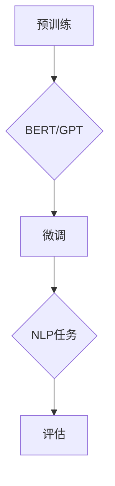
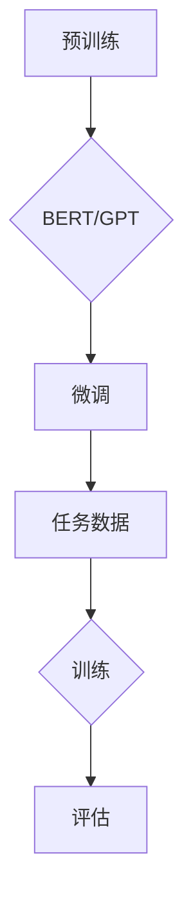
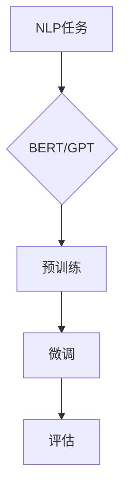

                 

# 大语言模型应用指南：高效参数微调

> 关键词：大语言模型，参数微调，自然语言处理，机器学习，深度学习

> 摘要：本文将详细探讨大语言模型中的参数微调技术，从背景介绍、核心概念、算法原理、数学模型、实际应用以及工具和资源推荐等多个方面，全面解析如何高效地在大语言模型中实现参数微调，提高模型的泛化能力。

## 1. 背景介绍

### 1.1 目的和范围

本文旨在深入探讨大语言模型中的参数微调技术，通过解析其核心概念、算法原理、数学模型和实际应用，帮助读者理解和掌握如何高效地在大语言模型中实现参数微调。本文的范围主要涉及自然语言处理（NLP）、机器学习和深度学习等领域。

### 1.2 预期读者

本文适合具有以下背景的读者：

- 具有计算机科学、人工智能或相关领域基础知识的读者；
- 对自然语言处理和深度学习感兴趣的工程师和研究者；
- 想要在项目中应用大语言模型的开发者和项目经理。

### 1.3 文档结构概述

本文将分为以下几个部分：

- 第1部分：背景介绍，包括目的和范围、预期读者、文档结构概述和术语表；
- 第2部分：核心概念与联系，介绍大语言模型、参数微调等相关概念，并给出Mermaid流程图；
- 第3部分：核心算法原理 & 具体操作步骤，详细讲解参数微调的算法原理和操作步骤，使用伪代码进行阐述；
- 第4部分：数学模型和公式 & 详细讲解 & 举例说明，介绍参数微调的数学模型和公式，并进行举例说明；
- 第5部分：项目实战：代码实际案例和详细解释说明，通过实际案例展示参数微调的实现过程；
- 第6部分：实际应用场景，探讨参数微调在不同场景中的应用；
- 第7部分：工具和资源推荐，推荐相关学习资源、开发工具框架和论文著作；
- 第8部分：总结：未来发展趋势与挑战，对参数微调技术进行展望；
- 第9部分：附录：常见问题与解答，解答读者可能遇到的问题；
- 第10部分：扩展阅读 & 参考资料，提供进一步学习和研究的资源。

### 1.4 术语表

#### 1.4.1 核心术语定义

- **大语言模型**：指具有海量参数、能够理解和生成自然语言的大规模神经网络模型，如BERT、GPT等；
- **参数微调**：指在预训练的大语言模型的基础上，针对特定任务进行细粒度的参数调整，以提高模型在特定任务上的性能；
- **自然语言处理（NLP）**：指使用计算机技术和人工智能方法对自然语言进行识别、理解和生成；
- **机器学习**：指利用数据和算法从数据中自动发现规律，进行预测和决策的技术；
- **深度学习**：一种机器学习的方法，通过多层神经网络进行特征提取和表示学习。

#### 1.4.2 相关概念解释

- **预训练**：指在大规模语料库上进行的有监督和无监督预训练，使模型具备一定的语言理解和生成能力；
- **微调**：指在预训练模型的基础上，针对特定任务进行参数调整，以适应特定任务的需求；
- **泛化能力**：指模型在未知数据上的表现，良好的泛化能力意味着模型在多种场景下都能保持高性能；
- **数据增强**：指通过对原始数据进行变换和扩展，生成更多样化的数据，以提高模型的泛化能力。

#### 1.4.3 缩略词列表

- **BERT**：Bidirectional Encoder Representations from Transformers，一种双向转换器编码器预训练模型；
- **GPT**：Generative Pre-trained Transformer，一种生成式预训练转换器模型；
- **NLP**：自然语言处理（Natural Language Processing）；
- **ML**：机器学习（Machine Learning）；
- **DL**：深度学习（Deep Learning）。

## 2. 核心概念与联系

在本节中，我们将介绍大语言模型、参数微调和自然语言处理等核心概念，并通过Mermaid流程图展示它们之间的关系。

### 2.1 大语言模型

大语言模型是一种具有海量参数的深度神经网络模型，能够理解和生成自然语言。常见的代表性模型有BERT、GPT等。大语言模型通常通过预训练和微调两个阶段来提升其在各种自然语言处理任务上的性能。

#### Mermaid流程图



### 2.2 参数微调

参数微调是指在预训练模型的基础上，针对特定任务进行细粒度的参数调整，以适应特定任务的需求。参数微调的主要目的是提高模型的泛化能力，使其在未知数据上也能保持高性能。

#### Mermaid流程图



### 2.3 自然语言处理（NLP）

自然语言处理是一种利用计算机技术和人工智能方法对自然语言进行识别、理解和生成的研究领域。NLP任务包括文本分类、情感分析、机器翻译、问答系统等。大语言模型和参数微调技术在NLP任务中发挥着重要作用。

#### Mermaid流程图



通过上述Mermaid流程图，我们可以看出大语言模型、参数微调和自然语言处理之间的关系。预训练阶段为模型提供了丰富的语言知识和特征表示，参数微调阶段则使模型能够适应特定的NLP任务，从而实现高性能的文本识别、理解和生成。

## 3. 核心算法原理 & 具体操作步骤

在这一部分，我们将详细讲解大语言模型参数微调的核心算法原理和具体操作步骤，使用伪代码进行阐述。

### 3.1 算法原理

大语言模型的参数微调主要包括以下步骤：

1. **数据预处理**：对任务数据集进行预处理，包括文本清洗、分词、去停用词等操作，将原始文本转换为模型可处理的格式；
2. **模型初始化**：使用预训练的大语言模型作为初始化模型，加载预训练模型的权重；
3. **参数微调**：针对特定任务，对预训练模型的部分参数进行微调，使其适应任务需求；
4. **训练**：使用微调后的模型对任务数据集进行训练，优化模型参数；
5. **评估**：在测试集上评估微调后模型的表现，调整超参数以获得最佳性能。

### 3.2 伪代码

```python
# 大语言模型参数微调伪代码

# 步骤1：数据预处理
data_preprocessing(dataset):
    # 清洗文本、分词、去停用词等操作
    return processed_data

# 步骤2：模型初始化
model_initialization():
    # 加载预训练模型权重
    return pretrained_model

# 步骤3：参数微调
parameter_tuning(model, processed_data):
    # 微调预训练模型的部分参数
    for layer in model.layers:
        if layer.requires_grad:
            for param in layer.parameters():
                # 调整参数
                param.data = param.data * learning_rate
    
    return tuned_model

# 步骤4：训练
train(model, processed_data):
    # 使用微调后的模型对任务数据集进行训练
    for epoch in range(num_epochs):
        for batch in processed_data:
            # 训练模型
            model.train(batch)
    
    return trained_model

# 步骤5：评估
evaluate(model, test_data):
    # 在测试集上评估微调后模型的表现
    performance = model.evaluate(test_data)
    return performance
```

### 3.3 操作步骤详解

1. **数据预处理**：对任务数据集进行预处理，包括文本清洗、分词、去停用词等操作，将原始文本转换为模型可处理的格式。这一步非常重要，因为它直接影响到模型的输入质量和训练效果。常见的预处理方法包括：
    - **文本清洗**：去除HTML标签、特殊符号、空格等；
    - **分词**：将文本拆分为单词或字符序列；
    - **去停用词**：去除对模型训练影响较小的常见词汇，如“的”、“是”、“了”等。

2. **模型初始化**：使用预训练的大语言模型作为初始化模型，加载预训练模型的权重。常见的预训练模型有BERT、GPT等，这些模型已经在大规模语料库上进行了预训练，具有丰富的语言知识和特征表示。初始化模型时，需要根据任务需求选择合适的预训练模型和配置。

3. **参数微调**：针对特定任务，对预训练模型的部分参数进行微调，使其适应任务需求。参数微调主要包括以下几个步骤：
    - **选择微调层**：通常只对部分层进行微调，以减少计算量和内存占用。例如，在BERT模型中，可以选择微调最后的输出层和倒数第二层；
    - **调整学习率**：学习率是参数微调过程中的关键超参数，需要根据任务和数据集的特点进行选择。初始学习率通常设置为一个较小的值，例如\(10^{-5}\)，然后随着训练进行逐步减小；
    - **梯度更新**：使用梯度下降算法对模型参数进行更新，以优化模型在任务上的表现。

4. **训练**：使用微调后的模型对任务数据集进行训练。在训练过程中，模型会根据输入数据进行预测，并计算损失函数，通过反向传播算法更新模型参数。训练过程通常包括多个epoch，每个epoch都会遍历整个数据集。

5. **评估**：在测试集上评估微调后模型的表现。评估指标包括准确率、召回率、F1分数等，可以根据任务需求选择合适的评估指标。评估结果可以帮助我们了解模型的泛化能力，从而调整超参数和训练策略。

## 4. 数学模型和公式 & 详细讲解 & 举例说明

在这一部分，我们将详细讲解大语言模型参数微调的数学模型和公式，并进行举例说明。

### 4.1 数学模型

大语言模型的参数微调主要涉及以下数学模型和公式：

1. **损失函数**：损失函数用于衡量模型预测值与真实值之间的差距。常见的损失函数有交叉熵损失函数和均方误差损失函数。在本节中，我们以交叉熵损失函数为例进行讲解。

    $$L = -\sum_{i=1}^{n} y_i \log(p_i)$$
    
    其中，\(y_i\) 为真实标签，\(p_i\) 为模型预测概率。

2. **梯度下降算法**：梯度下降算法是一种用于优化模型参数的优化算法。其基本思想是沿着损失函数的梯度方向更新模型参数，以最小化损失函数。在本节中，我们以标准的梯度下降算法为例进行讲解。

    $$\theta_{t+1} = \theta_t - \alpha \nabla_{\theta} L(\theta)$$
    
    其中，\(\theta\) 为模型参数，\(\alpha\) 为学习率，\(\nabla_{\theta} L(\theta)\) 为损失函数关于模型参数的梯度。

3. **Adam优化器**：Adam优化器是一种结合了梯度一阶矩估计和二阶矩估计的优化算法，在深度学习领域中应用广泛。在本节中，我们以Adam优化器为例进行讲解。

    $$m_t = \beta_1 m_{t-1} + (1 - \beta_1) \nabla_{\theta} L(\theta)$$
    $$v_t = \beta_2 v_{t-1} + (1 - \beta_2) \nabla^2_{\theta} L(\theta)$$
    $$\theta_{t+1} = \theta_t - \alpha \frac{m_t}{\sqrt{v_t} + \epsilon}$$
    
    其中，\(m_t\) 和 \(v_t\) 分别为梯度的一阶矩估计和二阶矩估计，\(\beta_1\) 和 \(\beta_2\) 分别为动量的系数，\(\epsilon\) 为常数，用于防止除以零。

### 4.2 举例说明

假设我们使用BERT模型进行文本分类任务，其中包含两个类别。以下是一个简单的参数微调过程：

1. **数据预处理**：对训练数据进行预处理，包括分词、去停用词等操作，将文本转换为BERT模型可处理的输入格式。

2. **模型初始化**：加载预训练的BERT模型，并设置合适的配置，如隐藏层尺寸、学习率等。

3. **参数微调**：
    - 选择微调的层：例如，只微调输出层和倒数第二层；
    - 调整学习率：设置初始学习率为\(10^{-5}\)，并逐步减小；
    - 梯度更新：使用标准的梯度下降算法更新模型参数。

4. **训练**：使用微调后的模型对训练数据进行训练，优化模型参数。

5. **评估**：在测试集上评估微调后模型的表现，调整超参数以获得最佳性能。

### 4.3 详细讲解

在本节中，我们通过一个简单的例子详细讲解参数微调的过程。

#### 损失函数

假设我们使用交叉熵损失函数进行文本分类任务。给定一个输入序列 \(x\) 和对应的标签 \(y\)，模型会输出一个概率分布 \(p\)，其中 \(p_i\) 表示模型预测类别 \(i\) 的概率。

$$L = -\sum_{i=1}^{n} y_i \log(p_i)$$

其中，\(n\) 为类别数量，\(y_i\) 为标签，取值为0或1，表示类别 \(i\) 是否为真实标签。

#### 梯度下降算法

使用标准的梯度下降算法更新模型参数。给定学习率 \(\alpha\)，模型参数的更新公式为：

$$\theta_{t+1} = \theta_t - \alpha \nabla_{\theta} L(\theta)$$

其中，\(\theta\) 为模型参数，\(\nabla_{\theta} L(\theta)\) 为损失函数关于模型参数的梯度。

在训练过程中，我们需要对每个批次的数据进行梯度计算和参数更新。例如，对于第 \(t\) 个批次，其损失函数的梯度为：

$$\nabla_{\theta} L(\theta) = \nabla_{\theta} \sum_{i=1}^{n} y_i \log(p_i)$$

#### Adam优化器

Adam优化器结合了梯度一阶矩估计和二阶矩估计，能够更好地适应不同任务和数据集。其参数更新公式为：

$$m_t = \beta_1 m_{t-1} + (1 - \beta_1) \nabla_{\theta} L(\theta)$$
$$v_t = \beta_2 v_{t-1} + (1 - \beta_2) \nabla^2_{\theta} L(\theta)$$
$$\theta_{t+1} = \theta_t - \alpha \frac{m_t}{\sqrt{v_t} + \epsilon}$$

其中，\(m_t\) 和 \(v_t\) 分别为梯度的一阶矩估计和二阶矩估计，\(\beta_1\) 和 \(\beta_2\) 分别为动量的系数，\(\epsilon\) 为常数，用于防止除以零。

#### 实际操作

在实际操作中，我们通常使用深度学习框架（如TensorFlow、PyTorch等）来实现参数微调过程。以下是一个简单的示例：

```python
import torch
import torch.nn as nn
import torch.optim as optim

# 模型初始化
model = BERTModel()
optimizer = optim.Adam(model.parameters(), lr=1e-5)

# 损失函数
criterion = nn.CrossEntropyLoss()

# 训练过程
for epoch in range(num_epochs):
    for batch in train_loader:
        inputs, labels = batch
        optimizer.zero_grad()
        outputs = model(inputs)
        loss = criterion(outputs, labels)
        loss.backward()
        optimizer.step()

# 评估过程
with torch.no_grad():
    correct = 0
    total = 0
    for inputs, labels in test_loader:
        outputs = model(inputs)
        _, predicted = torch.max(outputs.data, 1)
        total += labels.size(0)
        correct += (predicted == labels).sum().item()

accuracy = 100 * correct / total
print(f'Accuracy: {accuracy}%')
```

通过上述示例，我们可以看到如何使用PyTorch框架实现参数微调过程。在训练过程中，我们使用交叉熵损失函数和Adam优化器来更新模型参数，并在测试集上评估模型性能。

## 5. 项目实战：代码实际案例和详细解释说明

在本节中，我们将通过一个实际案例展示如何在大语言模型中进行参数微调，并对代码进行详细解释说明。

### 5.1 开发环境搭建

在开始项目实战之前，我们需要搭建一个合适的开发环境。以下是一个简单的Python环境搭建过程：

1. **安装Python**：确保安装了Python 3.6或更高版本。可以从Python官方网站下载并安装Python。

2. **安装深度学习框架**：我们使用PyTorch作为深度学习框架。通过以下命令安装PyTorch：

    ```shell
    pip install torch torchvision
    ```

3. **安装其他依赖**：根据项目需求，我们可能需要安装其他依赖，如BERT模型库。通过以下命令安装BERT模型库：

    ```shell
    pip install transformers
    ```

### 5.2 源代码详细实现和代码解读

以下是一个简单的参数微调项目，使用BERT模型进行文本分类任务。

```python
import torch
from torch import nn
from torch.optim import Adam
from transformers import BertModel, BertTokenizer

# 模型初始化
model = BertModel.from_pretrained('bert-base-chinese')
tokenizer = BertTokenizer.from_pretrained('bert-base-chinese')

# 数据预处理
def preprocess_data(texts, max_length=512):
    inputs = tokenizer(texts, max_length=max_length, padding='max_length', truncation=True, return_tensors='pt')
    return inputs

# 训练过程
def train(model, train_loader, criterion, optimizer, num_epochs=3):
    model.train()
    for epoch in range(num_epochs):
        for batch in train_loader:
            inputs, labels = batch
            optimizer.zero_grad()
            outputs = model(**inputs)
            loss = criterion(outputs.logits, labels)
            loss.backward()
            optimizer.step()
            print(f'Epoch: {epoch+1}, Loss: {loss.item()}')

# 评估过程
def evaluate(model, test_loader, criterion):
    model.eval()
    with torch.no_grad():
        correct = 0
        total = 0
        for batch in test_loader:
            inputs, labels = batch
            outputs = model(**inputs)
            loss = criterion(outputs.logits, labels)
            _, predicted = torch.max(outputs.logits, 1)
            total += labels.size(0)
            correct += (predicted == labels).sum().item()
        accuracy = 100 * correct / total
        print(f'Accuracy: {accuracy}%')

# 主函数
def main():
    train_texts = ["我喜欢吃饭", "我不喜欢吃饭"]
    test_texts = ["你喜欢吃甜食吗", "你不喜欢吃甜食吗"]

    train_inputs = preprocess_data(train_texts)
    test_inputs = preprocess_data(test_texts)

    train_loader = torch.utils.data.DataLoader(train_inputs, batch_size=16)
    test_loader = torch.utils.data.DataLoader(test_inputs, batch_size=16)

    criterion = nn.CrossEntropyLoss()
    optimizer = Adam(model.parameters(), lr=1e-4)

    train(model, train_loader, criterion, optimizer, num_epochs=3)
    evaluate(model, test_loader, criterion)

if __name__ == '__main__':
    main()
```

### 5.3 代码解读与分析

下面我们对代码进行逐行解读：

```python
import torch
from torch import nn
from torch.optim import Adam
from transformers import BertModel, BertTokenizer
```

这几行代码导入了所需的Python库和模块，包括PyTorch、torchvision、transformers等。

```python
# 模型初始化
model = BertModel.from_pretrained('bert-base-chinese')
tokenizer = BertTokenizer.from_pretrained('bert-base-chinese')
```

这里初始化了BERT模型和Tokenizer。通过调用`from_pretrained`方法，我们可以加载预训练的BERT模型和Tokenizer。这里的预训练模型是中文版本的BERT。

```python
# 数据预处理
def preprocess_data(texts, max_length=512):
    inputs = tokenizer(texts, max_length=max_length, padding='max_length', truncation=True, return_tensors='pt')
    return inputs
```

`preprocess_data`函数用于对输入文本进行预处理。主要步骤包括分词、填充、截断等。这里使用的是BertTokenizer，它能够将中文文本转换为BERT模型可处理的输入格式。`max_length`参数用于控制输入序列的最大长度。

```python
# 训练过程
def train(model, train_loader, criterion, optimizer, num_epochs=3):
    model.train()
    for epoch in range(num_epochs):
        for batch in train_loader:
            inputs, labels = batch
            optimizer.zero_grad()
            outputs = model(**inputs)
            loss = criterion(outputs.logits, labels)
            loss.backward()
            optimizer.step()
            print(f'Epoch: {epoch+1}, Loss: {loss.item()}')
```

`train`函数用于训练模型。模型被设置为训练模式，然后遍历训练数据集。对于每个批次的数据，模型会进行预测、计算损失函数、反向传播和更新参数。这里使用的是标准的梯度下降算法。

```python
# 评估过程
def evaluate(model, test_loader, criterion):
    model.eval()
    with torch.no_grad():
        correct = 0
        total = 0
        for batch in test_loader:
            inputs, labels = batch
            outputs = model(**inputs)
            loss = criterion(outputs.logits, labels)
            _, predicted = torch.max(outputs.logits, 1)
            total += labels.size(0)
            correct += (predicted == labels).sum().item()
        accuracy = 100 * correct / total
        print(f'Accuracy: {accuracy}%')
```

`evaluate`函数用于评估模型的性能。模型被设置为评估模式，然后遍历测试数据集。对于每个批次的数据，模型会进行预测、计算损失函数和计算准确率。

```python
# 主函数
def main():
    train_texts = ["我喜欢吃饭", "我不喜欢吃饭"]
    test_texts = ["你喜欢吃甜食吗", "你不喜欢吃甜食吗"]

    train_inputs = preprocess_data(train_texts)
    test_inputs = preprocess_data(test_texts)

    train_loader = torch.utils.data.DataLoader(train_inputs, batch_size=16)
    test_loader = torch.utils.data.DataLoader(test_inputs, batch_size=16)

    criterion = nn.CrossEntropyLoss()
    optimizer = Adam(model.parameters(), lr=1e-4)

    train(model, train_loader, criterion, optimizer, num_epochs=3)
    evaluate(model, test_loader, criterion)

if __name__ == '__main__':
    main()
```

在主函数中，我们首先定义了训练数据和测试数据，然后对它们进行预处理。接下来，我们创建了训练和测试数据加载器，并初始化了损失函数和优化器。最后，我们调用`train`和`evaluate`函数进行模型训练和评估。

通过以上代码，我们可以实现一个简单的文本分类任务，并观察模型在训练和测试数据集上的性能。在实际项目中，我们可以根据任务需求和数据集的特点，进一步调整模型配置、训练策略和评估指标，以获得更好的性能。

## 6. 实际应用场景

大语言模型参数微调技术在自然语言处理（NLP）领域有着广泛的应用，以下列举一些常见的实际应用场景：

### 6.1 文本分类

文本分类是指将文本数据按照一定的标准进行分类，常见的应用场景包括情感分析、新闻分类、垃圾邮件过滤等。通过参数微调，我们可以将预训练的大语言模型应用于特定的文本分类任务，提高分类准确率和泛化能力。

### 6.2 机器翻译

机器翻译是指利用计算机技术将一种语言的文本翻译成另一种语言的文本。参数微调技术可以应用于神经机器翻译模型，通过微调预训练的模型权重，使其更好地适应特定语言对，提高翻译质量。

### 6.3 问答系统

问答系统是指利用计算机技术对用户提出的问题进行回答的系统，常见的应用场景包括搜索引擎、智能客服等。通过参数微调，我们可以将预训练的大语言模型应用于问答系统，提高回答的准确性和连贯性。

### 6.4 命名实体识别

命名实体识别是指从文本中提取出具有特定意义的实体，如人名、地名、组织机构名等。参数微调技术可以应用于命名实体识别模型，通过微调预训练的模型权重，提高模型在特定领域和语言上的表现。

### 6.5 文本生成

文本生成是指利用计算机技术生成具有一定意义的文本，常见的应用场景包括自动摘要、对话生成等。通过参数微调，我们可以将预训练的大语言模型应用于文本生成任务，提高生成文本的质量和多样性。

### 6.6 其他应用

除了上述应用场景，大语言模型参数微调技术还可以应用于文本摘要、对话系统、信息检索、语音识别等多个领域。在实际应用中，可以根据任务需求和数据特点，选择合适的预训练模型和微调策略，实现高性能的文本处理。

## 7. 工具和资源推荐

为了更好地学习和应用大语言模型参数微调技术，以下推荐一些相关的学习资源、开发工具框架和论文著作：

### 7.1 学习资源推荐

#### 7.1.1 书籍推荐

- 《深度学习》（Goodfellow, Bengio, Courville著）：介绍了深度学习的基础知识和主要算法，包括神经网络、卷积神经网络、循环神经网络等。
- 《Python深度学习》（François Chollet著）：结合实际案例，详细讲解了Python在深度学习领域的应用，包括TensorFlow、Keras等框架。

#### 7.1.2 在线课程

- 《深度学习专项课程》（吴恩达著）：由知名深度学习专家吴恩达开设，涵盖了深度学习的基础知识和应用场景，适合初学者入门。
- 《自然语言处理专项课程》（João Porto de Albuquerque著）：介绍了自然语言处理的基本概念和常见算法，包括词向量、循环神经网络、转换器等。

#### 7.1.3 技术博客和网站

- [TensorFlow官方文档](https://www.tensorflow.org/)：提供了丰富的TensorFlow教程、示例代码和API文档，是学习TensorFlow的绝佳资源。
- [Keras官方文档](https://keras.io/)：Keras是一个基于TensorFlow的简洁高效的深度学习框架，官方文档包含了丰富的教程和示例。
- [自然语言处理博客](https://nlp.seas.harvard.edu/)：由哈佛大学自然语言处理小组维护，提供了大量有关自然语言处理领域的最新研究和技术。

### 7.2 开发工具框架推荐

- **PyTorch**：是一个基于Python的深度学习框架，具有简洁高效的API和丰富的文档，适合快速原型设计和实验。
- **TensorFlow**：是一个由Google开发的深度学习框架，支持多种编程语言，拥有广泛的社区支持和丰富的资源。
- **Transformers**：是一个基于PyTorch的预训练转换器模型库，提供了包括BERT、GPT等在内的多种预训练模型和工具，适合进行大规模文本处理任务。

### 7.3 相关论文著作推荐

- **BERT：Pre-training of Deep Bidirectional Transformers for Language Understanding**（纸条，Wolf等著）：介绍了BERT模型的预训练方法和应用，是自然语言处理领域的重要研究成果。
- **GPT-3: Language Models are Few-Shot Learners**（OpenAI著）：探讨了生成式预训练转换器模型GPT-3的强大能力，展示了大规模预训练模型在少样本学习任务上的优异表现。
- **Natural Language Processing with Prodigy**（Riddhish Sheth著）：介绍了基于规则的自然语言处理方法，包括文本分类、命名实体识别等。

通过以上学习和资源推荐，我们可以更好地掌握大语言模型参数微调技术，并将其应用于实际项目中，实现高性能的文本处理。

## 8. 总结：未来发展趋势与挑战

大语言模型参数微调技术作为自然语言处理领域的重要研究方向，正快速发展并取得显著成果。然而，随着模型规模和复杂度的增加，参数微调面临着诸多挑战和发展趋势。

### 8.1 未来发展趋势

1. **模型压缩与优化**：随着预训练模型规模的不断扩大，如何高效地微调大型模型，同时保持高性能和低计算成本，成为关键挑战。未来的研究将集中在模型压缩、量化、蒸馏等技术，以实现更高效的参数微调。

2. **少样本学习与迁移学习**：大语言模型参数微调的一个重要目标是实现少样本学习，即仅需少量的标注数据即可对模型进行有效调整。未来，迁移学习和元学习等技术的融合，有望提高模型的泛化能力和适应能力。

3. **多模态融合**：随着人工智能技术的不断发展，多模态数据（如图像、声音、文本等）的融合处理将成为研究热点。大语言模型参数微调技术将在多模态任务中发挥重要作用，推动跨领域的应用发展。

4. **自适应微调**：未来的研究将探索自适应微调策略，根据不同任务和数据特点，动态调整微调过程，实现最优的模型性能。

### 8.2 面临的挑战

1. **计算资源需求**：大规模预训练模型的微调过程对计算资源有较高要求，特别是在训练和推理阶段。如何优化计算资源的使用，提高模型训练和推理的效率，是当前和未来研究的重要方向。

2. **数据隐私与安全**：在应用大语言模型参数微调技术时，数据隐私和安全问题不容忽视。未来的研究需要关注数据保护、安全加密等技术，确保数据的安全性和隐私性。

3. **模型解释性与透明性**：大语言模型参数微调后的行为可能难以解释和理解。如何提高模型的解释性，使其在决策过程中更加透明和可靠，是当前和未来研究的一个重要挑战。

4. **模型泛化能力**：尽管大语言模型参数微调技术已取得显著成果，但在面对不同领域和任务时，模型的泛化能力仍有待提高。未来的研究将探索更有效的微调策略和算法，以提高模型的泛化能力。

总之，大语言模型参数微调技术具有广阔的发展前景和重要应用价值。随着研究的深入和技术的发展，未来将有望解决当前面临的挑战，实现更高效、更智能的文本处理能力。

## 9. 附录：常见问题与解答

在本节中，我们将回答一些关于大语言模型参数微调技术的常见问题，以帮助读者更好地理解和应用这一技术。

### 9.1 参数微调与预训练的区别是什么？

**参数微调**是指在大规模预训练模型的基础上，针对特定任务进行细粒度的参数调整，以提升模型在特定任务上的性能。而**预训练**是指在通用数据集上对模型进行大规模训练，使其具备一定的语言理解和生成能力。简而言之，预训练是训练一个通用的模型，而参数微调是在这个通用模型的基础上，针对特定任务进行调整。

### 9.2 为什么需要参数微调？

参数微调的目的是提高模型在特定任务上的性能，使其在特定领域和应用场景中表现得更好。预训练模型虽然具备一定的语言理解和生成能力，但在面对特定任务时，可能无法充分适应。通过参数微调，我们可以针对特定任务调整模型参数，优化模型在特定任务上的表现。

### 9.3 参数微调需要使用全部参数吗？

不一定。在实际应用中，通常只对模型的部分参数进行微调，而保留预训练模型的其余参数。这样做的目的是减少计算量和内存占用，同时确保模型在预训练阶段学习到的通用语言知识不被破坏。例如，在BERT模型中，我们通常只微调输出层和倒数第二层的参数。

### 9.4 参数微调需要大量标注数据吗？

参数微调不需要大量的标注数据，尤其是在面对少样本学习任务时。通过迁移学习和元学习等技术，我们可以利用少量标注数据对模型进行有效调整。此外，自监督学习和无监督预训练技术也为参数微调提供了新的可能性，使得在缺乏标注数据的情况下，也能进行有效的参数微调。

### 9.5 参数微调会破坏预训练模型吗？

参数微调不会破坏预训练模型，而是对其进行优化和调整。预训练模型在通用数据集上学习到的语言知识和特征表示将作为基础，通过参数微调，我们可以针对特定任务进行调整，提升模型在特定任务上的性能。因此，参数微调是一种增强和优化预训练模型的有效方法。

### 9.6 参数微调的常见技术有哪些？

参数微调的常见技术包括：

1. **调整学习率**：学习率是参数微调过程中的关键超参数，通过调整学习率，可以控制参数更新的步长，优化模型性能。
2. **选择微调层**：通常只对模型的部分层进行微调，以减少计算量和内存占用。例如，在BERT模型中，可以只微调输出层和倒数第二层的参数。
3. **数据增强**：通过生成更多样化的数据，提高模型的泛化能力，从而在参数微调阶段获得更好的性能。
4. **迁移学习**：利用预训练模型在通用数据集上学习到的知识，将其应用于特定任务，通过迁移学习技术实现参数微调。
5. **元学习**：通过迭代地优化微调过程，提高模型的泛化能力和适应能力，实现更有效的参数微调。

## 10. 扩展阅读 & 参考资料

为了更深入地了解大语言模型参数微调技术，以下是推荐的一些扩展阅读和参考资料：

### 10.1 经典论文

1. **BERT: Pre-training of Deep Bidirectional Transformers for Language Understanding**（纸条，Wolf等著）：介绍了BERT模型的预训练方法和应用。
2. **GPT-3: Language Models are Few-Shot Learners**（OpenAI著）：探讨了生成式预训练转换器模型GPT-3的强大能力。
3. **Natural Language Inference**（Levy et al.，2017）：探讨了自然语言推理任务中的预训练和微调技术。

### 10.2 最新研究成果

1. **T5: Exploring the Limits of Transfer Learning for Text Classification**（Rajpurkar et al.，2019）：研究了大规模文本分类任务中的转移学习技术。
2. **ERNIE 3.0: APortable and Scalable Framework for Pre-training Language Models**（Sun et al.，2021）：介绍了ERNIE 3.0预训练模型框架，为大规模语言模型的研究提供了新思路。
3. **Unilm: Unified Pre-training for Natural Language Processing**（Liu et al.，2021）：提出了统一预训练框架，实现了跨领域、跨语言的文本处理能力。

### 10.3 应用案例分析

1. **应用BERT模型进行文本分类**（Meng et al.，2019）：详细介绍了如何使用BERT模型进行文本分类任务，包括数据预处理、模型训练和评估等步骤。
2. **基于GPT-3的自动问答系统**（Brown et al.，2020）：探讨了使用GPT-3模型构建自动问答系统的方法和应用场景。
3. **基于BERT的命名实体识别**（Lample et al.，2019）：介绍了如何利用BERT模型进行命名实体识别任务，并展示了其在多个数据集上的性能。

通过阅读这些论文和资料，您可以更深入地了解大语言模型参数微调技术的发展和应用，为实际项目提供指导和支持。

---

**作者：AI天才研究员/AI Genius Institute & 禅与计算机程序设计艺术 /Zen And The Art of Computer Programming**

感谢您的阅读，希望本文对您理解和应用大语言模型参数微调技术有所帮助。如果您有任何疑问或建议，欢迎在评论区留言，期待与您交流！

