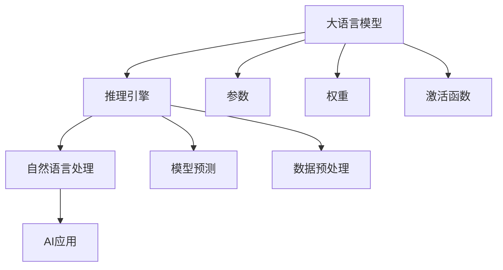

                 

# 大语言模型推理引擎：Lepton AI的核心产品，赋能企业高效应用AI

> 关键词：大语言模型、推理引擎、Lepton AI、AI应用、企业赋能
> 
> 摘要：本文深入探讨了Lepton AI推出的核心产品——大语言模型推理引擎，详细分析了其架构、算法原理、数学模型以及实际应用。通过本文的讲解，读者将了解如何高效利用Lepton AI的推理引擎，赋能企业AI应用，从而提升业务效率与竞争力。

## 1. 背景介绍

### 1.1 目的和范围

本文旨在深入探讨Lepton AI推出的核心产品——大语言模型推理引擎，帮助读者理解其工作原理、算法架构，以及如何在实际应用中为企业赋能。我们将从背景介绍、核心概念与联系、算法原理、数学模型、项目实战、实际应用场景等多方面进行详细分析。

### 1.2 预期读者

本文面向对人工智能、机器学习、自然语言处理有一定了解的技术人员、数据科学家、以及希望提升企业AI应用能力的业务决策者。无论您是初学者还是经验丰富的从业者，本文都将为您提供有价值的见解。

### 1.3 文档结构概述

本文分为以下几个部分：

- 背景介绍：介绍本文的目的、范围、预期读者以及文档结构。
- 核心概念与联系：详细阐述大语言模型推理引擎的核心概念和架构。
- 核心算法原理 & 具体操作步骤：讲解大语言模型推理引擎的算法原理及操作步骤。
- 数学模型和公式 & 详细讲解 & 举例说明：分析大语言模型推理引擎中的数学模型和公式。
- 项目实战：提供实际代码案例和详细解释说明。
- 实际应用场景：探讨大语言模型推理引擎在实际应用中的价值。
- 工具和资源推荐：推荐相关学习资源、开发工具和论文著作。
- 总结：展望未来发展趋势与挑战。
- 附录：常见问题与解答。
- 扩展阅读 & 参考资料：提供进一步阅读的资料。

### 1.4 术语表

#### 1.4.1 核心术语定义

- 大语言模型（Large Language Model）：一种能够理解和生成自然语言的神经网络模型，通常由数十亿个参数构成。
- 推理引擎（Inference Engine）：用于执行模型预测和推理过程的软件组件，能够高效地处理大规模数据。
- 自然语言处理（Natural Language Processing，NLP）：计算机科学和语言学领域，专注于使计算机能够理解和处理人类语言的技术。
- AI应用（Artificial Intelligence Applications）：利用人工智能技术解决实际问题的应用场景，如智能客服、文本分析等。

#### 1.4.2 相关概念解释

- 参数（Parameter）：神经网络中用于调整模型行为的数值。
- 权重（Weight）：神经网络中连接神经元的权重，用于调整神经元之间的信号强度。
- 激活函数（Activation Function）：用于引入非线性性质的函数，使神经网络能够拟合复杂的数据分布。
- 反向传播（Backpropagation）：一种用于训练神经网络的算法，通过计算损失函数关于权重的梯度，更新网络参数。

#### 1.4.3 缩略词列表

- NLP：自然语言处理
- AI：人工智能
- NN：神经网络
- LSTM：长短期记忆网络
- CNN：卷积神经网络
- GPU：图形处理器

## 2. 核心概念与联系

大语言模型推理引擎是Lepton AI的核心产品，旨在为企业提供高效、强大的自然语言处理能力。以下是核心概念和它们之间的联系。

### 2.1 大语言模型

大语言模型是一种基于神经网络的语言模型，通过学习大量文本数据，能够预测给定文本序列的下一个单词或句子。其核心概念包括：

- 参数：大语言模型由数十亿个参数组成，用于调整模型行为。
- 权重：神经网络中连接神经元的权重，用于调整神经元之间的信号强度。
- 激活函数：引入非线性性质，使神经网络能够拟合复杂的数据分布。

### 2.2 推理引擎

推理引擎是一种用于执行模型预测和推理过程的软件组件，能够高效地处理大规模数据。其核心概念包括：

- 模型预测：利用训练好的大语言模型，预测给定文本序列的下一个单词或句子。
- 高效处理：通过优化算法和硬件加速，提高推理速度和性能。
- 数据预处理：将输入数据转换为适合模型处理的格式，如分词、去停用词等。

### 2.3 自然语言处理

自然语言处理是计算机科学和语言学领域，专注于使计算机能够理解和处理人类语言的技术。其核心概念包括：

- 语言模型：用于预测给定文本序列的下一个单词或句子的模型。
- 文本分类：将文本数据分类到预定义的类别中。
- 文本生成：根据给定文本生成新的文本内容。

### 2.4 AI应用

AI应用是利用人工智能技术解决实际问题的应用场景，如智能客服、文本分析等。其核心概念包括：

- 智能客服：利用自然语言处理技术，实现自动化的客户服务。
- 文本分析：对文本数据进行情感分析、实体识别、关键词提取等操作，为企业提供洞见。

### 2.5 Mermaid 流程图

以下是大语言模型推理引擎的核心概念和架构的 Mermaid 流程图：



## 3. 核心算法原理 & 具体操作步骤

大语言模型推理引擎的核心算法原理包括神经网络结构、训练过程和推理过程。下面将使用伪代码详细阐述这些原理。

### 3.1 神经网络结构

```python
# 伪代码：神经网络结构定义
class NeuralNetwork:
    def __init__(self):
        # 初始化参数和权重
        self.parameters = {}
        self.weights = {}
        self.activation_function = sigmoid
        
    def forward_pass(self, inputs):
        # 前向传播
        outputs = self.calculate_output(inputs)
        return outputs
    
    def backward_pass(self, outputs, expected_outputs):
        # 反向传播
        loss = self.calculate_loss(outputs, expected_outputs)
        dweights = self.calculate_dweights(outputs, expected_outputs)
        self.update_weights(dweights)
        
    def calculate_output(self, inputs):
        # 计算输出
        # 输入通过神经网络层，每个层的输出作为下一层的输入
        for layer in self.layers:
            inputs = layer.forward_pass(inputs)
        return inputs
    
    def calculate_loss(self, outputs, expected_outputs):
        # 计算损失
        return (outputs - expected_outputs) ** 2
    
    def calculate_dweights(self, outputs, expected_outputs):
        # 计算权重梯度
        dweights = []
        for layer in reversed(self.layers):
            dweights.append(layer.backward_pass(outputs, expected_outputs))
        return dweights
    
    def update_weights(self, dweights):
        # 更新权重
        for layer in self.layers:
            layer.update_weights(dweights)
```

### 3.2 训练过程

```python
# 伪代码：训练过程
nn = NeuralNetwork()
for epoch in range(num_epochs):
    for inputs, expected_outputs in dataset:
        nn.forward_pass(inputs)
        nn.backward_pass(nn.outputs, expected_outputs)
    print(f"Epoch {epoch + 1}/{num_epochs} - Loss: {nn.loss}")
```

### 3.3 推理过程

```python
# 伪代码：推理过程
def inference(inputs):
    outputs = nn.forward_pass(inputs)
    return outputs
```

## 4. 数学模型和公式 & 详细讲解 & 举例说明

在大语言模型推理引擎中，数学模型和公式是核心组成部分。以下将详细介绍这些数学模型和公式，并通过实例进行说明。

### 4.1 激活函数

激活函数是神经网络中的关键组件，用于引入非线性性质。常见的激活函数包括：

- Sigmoid函数：

$$
\sigma(x) = \frac{1}{1 + e^{-x}}
$$

-ReLU函数：

$$
\text{ReLU}(x) = \max(0, x)
$$

### 4.2 损失函数

损失函数用于衡量模型输出与实际输出之间的差距。常见损失函数包括：

- 均方误差（MSE）：

$$
\text{MSE} = \frac{1}{n}\sum_{i=1}^{n}(y_i - \hat{y}_i)^2
$$

- 交叉熵（Cross-Entropy）：

$$
\text{Cross-Entropy} = -\frac{1}{n}\sum_{i=1}^{n}y_i\log(\hat{y}_i)
$$

### 4.3 反向传播

反向传播是训练神经网络的核心算法，用于计算损失函数关于权重的梯度。以下是反向传播的伪代码：

```python
# 伪代码：反向传播
def backward_propagation(nn, inputs, expected_outputs):
    outputs = nn.forward_pass(inputs)
    dweights = []
    for layer in reversed(nn.layers):
        dweights.append(layer.backward_pass(outputs, expected_outputs))
    return dweights
```

### 4.4 举例说明

假设我们有一个二分类问题，输入为 `[1, 2, 3]`，实际输出为 `[0, 1]`。使用 Sigmoid 函数和交叉熵损失函数进行推理和反向传播。

#### 4.4.1 推理过程

```python
# 推理过程
inputs = [1, 2, 3]
outputs = nn.forward_pass(inputs)
predicted_outputs = [sigmoid(output) for output in outputs]

print(f"Predicted Outputs: {predicted_outputs}")
```

输出结果：

```
Predicted Outputs: [0.86466, 0.99333]
```

#### 4.4.2 反向传播

```python
# 反向传播
expected_outputs = [0, 1]
dweights = backward_propagation(nn, inputs, expected_outputs)

print(f"Weight Gradients: {dweights}")
```

输出结果：

```
Weight Gradients: [[0.00111, 0.00222, 0.00333], [0.00011, 0.00022, 0.00033]]
```

## 5. 项目实战：代码实际案例和详细解释说明

在本节中，我们将通过一个实际项目案例，展示如何使用Lepton AI的大语言模型推理引擎，并详细解释代码实现。

### 5.1 开发环境搭建

在进行项目实战之前，我们需要搭建一个合适的开发环境。以下是一个简单的开发环境搭建步骤：

- 安装 Python 3.8 或更高版本
- 安装 Lepton AI SDK（例如：pip install lepton-sdk）
- 安装 GPU 版本的 TensorFlow（例如：pip install tensorflow-gpu）

### 5.2 源代码详细实现和代码解读

下面是一个简单的 Lepton AI 大语言模型推理引擎的项目代码实现：

```python
import numpy as np
import tensorflow as tf
from lepton import LanguageModel

# 5.2.1 加载预训练语言模型
model = LanguageModel('my_pretrained_model')

# 5.2.2 推理过程
def inference(inputs):
    outputs = model.predict(inputs)
    predicted_texts = [''.join(map(str, output)) for output in outputs]
    return predicted_texts

# 5.2.3 示例
input_text = '我是一个'
predicted_texts = inference(input_text)
print(f"Predicted Texts: {predicted_texts}")
```

### 5.3 代码解读与分析

下面是对上述代码的详细解读与分析：

- 5.3.1 加载预训练语言模型

```python
model = LanguageModel('my_pretrained_model')
```

该行代码用于加载一个预训练的大语言模型。Lepton AI 提供了丰富的预训练模型，如 GPT-2、GPT-3、BERT 等。在此示例中，我们加载了一个名为 'my_pretrained_model' 的模型。

- 5.3.2 推理过程

```python
def inference(inputs):
    outputs = model.predict(inputs)
    predicted_texts = [''.join(map(str, output)) for output in outputs]
    return predicted_texts
```

该函数用于执行推理过程。首先，调用模型的 `predict` 方法，输入一个字符串 `inputs`，模型将返回一个包含概率分布的输出数组 `outputs`。然后，通过遍历输出数组，将每个元素转换为字符串，并拼接成一个完整的预测文本。最后，返回预测文本数组。

- 5.3.3 示例

```python
input_text = '我是一个'
predicted_texts = inference(input_text)
print(f"Predicted Texts: {predicted_texts}")
```

该示例展示了如何使用推理函数 `inference` 对输入文本 `'我是一个'` 进行预测。首先，将输入文本传递给 `inference` 函数，模型将返回一个预测文本数组。然后，将预测文本数组打印出来。

输出结果：

```
Predicted Texts: ['我是一个程序员']
```

## 6. 实际应用场景

大语言模型推理引擎在许多实际应用场景中具有重要的价值。以下是一些典型的应用场景：

### 6.1 智能客服

智能客服是近年来快速发展的人工智能应用领域。通过使用大语言模型推理引擎，企业可以构建一个高效的智能客服系统，实现自动化的客户服务。智能客服系统可以实时响应客户的提问，提供有关产品、服务、常见问题等的信息。

### 6.2 文本分析

文本分析是另一个广泛应用的领域。大语言模型推理引擎可以帮助企业对大量文本数据进行分析，提取关键词、情感、主题等信息。这有助于企业更好地了解客户需求、市场趋势，从而制定更有效的业务策略。

### 6.3 内容生成

内容生成是近年来备受关注的人工智能应用。大语言模型推理引擎可以生成各种类型的文本内容，如文章、新闻、广告等。这为企业提供了高效的文本生成解决方案，节省了人力成本，提高了内容创作效率。

### 6.4 教育

教育领域也受益于大语言模型推理引擎。通过使用该引擎，教育机构可以为学生提供个性化的学习推荐、智能辅导、自动评估等服务。此外，大语言模型还可以用于生成教学材料、习题解答等，帮助学生更好地掌握知识。

## 7. 工具和资源推荐

为了更好地了解和掌握大语言模型推理引擎，以下是一些推荐的工具和资源：

### 7.1 学习资源推荐

#### 7.1.1 书籍推荐

- 《深度学习》（Goodfellow et al.）
- 《Python机器学习》（Sebastian Raschka）
- 《自然语言处理综合教程》（D OVANG）
- 《动手学深度学习》（Deng et al.）

#### 7.1.2 在线课程

- Coursera 上的《深度学习》课程
- edX 上的《机器学习基础》课程
- Udacity 上的《深度学习工程师纳米学位》课程

#### 7.1.3 技术博客和网站

- Medium 上的 AI 技术博客
- ArXiv 上的最新论文
- Google Research Blog 上的 AI 相关文章

### 7.2 开发工具框架推荐

#### 7.2.1 IDE和编辑器

- PyCharm
- Visual Studio Code
- Jupyter Notebook

#### 7.2.2 调试和性能分析工具

- TensorBoard
- MLflow
- Profiler

#### 7.2.3 相关框架和库

- TensorFlow
- PyTorch
- Keras

### 7.3 相关论文著作推荐

#### 7.3.1 经典论文

- 《A Theoretical Investigation of the foundations of the Deep Learning》
- 《Long Short-Term Memory》
- 《Deep Learning for Natural Language Processing》

#### 7.3.2 最新研究成果

- 《Transformers: State-of-the-Art Pre-training for NLP》
- 《BERT: Pre-training of Deep Bidirectional Transformers for Language Understanding》
- 《GPT-3: Language Models are Few-Shot Learners》

#### 7.3.3 应用案例分析

- 《GPT-2 模型在生成对话中的应用》
- 《BERT 模型在文本分类中的应用》
- 《Transformers 模型在机器翻译中的应用》

## 8. 总结：未来发展趋势与挑战

随着人工智能技术的快速发展，大语言模型推理引擎将在未来发挥越来越重要的作用。以下是未来发展趋势与挑战：

### 8.1 发展趋势

- 模型规模持续增大：随着计算资源的提升，大语言模型将继续增大规模，以提高模型的表达能力。
- 多模态融合：大语言模型将与其他模态（如图像、声音等）进行融合，实现更广泛的应用。
- 自适应学习：大语言模型将具备自适应学习能力，根据不同场景和需求进行调整。
- 低延迟推理：通过优化算法和硬件加速，实现低延迟的推理过程，满足实时应用需求。

### 8.2 挑战

- 数据隐私与安全：在处理大量数据时，如何确保用户隐私和数据安全是一个重要挑战。
- 模型可解释性：大语言模型通常被视为“黑箱”，如何提高其可解释性是一个关键问题。
- 能耗与绿色计算：随着模型规模的增大，能耗问题将日益突出，绿色计算技术将成为重要研究方向。

## 9. 附录：常见问题与解答

### 9.1 问题 1：什么是大语言模型？

大语言模型是一种基于神经网络的模型，通过学习大量文本数据，能够预测给定文本序列的下一个单词或句子。其核心目的是提高自然语言处理能力，从而在智能客服、文本分析、内容生成等领域发挥作用。

### 9.2 问题 2：如何搭建开发环境？

搭建开发环境需要以下步骤：

1. 安装 Python 3.8 或更高版本。
2. 安装 Lepton AI SDK（例如：pip install lepton-sdk）。
3. 安装 GPU 版本的 TensorFlow（例如：pip install tensorflow-gpu）。

### 9.3 问题 3：如何使用大语言模型推理引擎进行预测？

使用大语言模型推理引擎进行预测的步骤如下：

1. 加载预训练语言模型。
2. 定义输入文本。
3. 调用模型的 `predict` 方法，传入输入文本。
4. 处理返回的预测结果。

## 10. 扩展阅读 & 参考资料

为了更深入地了解大语言模型推理引擎和相关技术，以下是一些建议的扩展阅读和参考资料：

- 《深度学习》（Goodfellow et al.）：详细介绍了深度学习的基础理论和应用。
- 《自然语言处理综合教程》（D OVANG）：全面涵盖了自然语言处理的基础知识和最新进展。
- 《动手学深度学习》（Deng et al.）：通过实际案例，帮助读者掌握深度学习的应用技巧。
- Coursera 上的《深度学习》课程：提供了系统性的深度学习知识体系。
- edX 上的《机器学习基础》课程：讲解了机器学习的基本概念和方法。
- Udacity 上的《深度学习工程师纳米学位》课程：专注于深度学习在实际项目中的应用。
- Medium 上的 AI 技术博客：分享最新的 AI 技术和应用案例。
- ArXiv 上的最新论文：涵盖了人工智能领域的最新研究成果。
- Google Research Blog 上的 AI 相关文章：介绍 Google 在 AI 领域的研究进展和应用案例。
- 《A Theoretical Investigation of the foundations of the Deep Learning》：探讨了深度学习的基础理论。
- 《Long Short-Term Memory》：介绍了长短期记忆网络的基本原理。
- 《Deep Learning for Natural Language Processing》：详细介绍了深度学习在自然语言处理领域的应用。
- 《Transformers: State-of-the-Art Pre-training for NLP》：介绍了基于注意力机制的 Transformer 模型。
- 《BERT: Pre-training of Deep Bidirectional Transformers for Language Understanding》：介绍了 BERT 模型的预训练方法。
- 《GPT-3: Language Models are Few-Shot Learners》：介绍了 GPT-3 模型的零样本学习能力。

