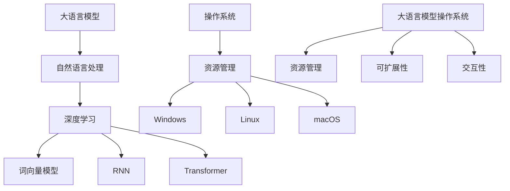

                 


# 大语言模型操作系统的实际应用

> 关键词：大语言模型、操作系统、应用场景、算法原理、代码实战、未来趋势

> 摘要：本文旨在探讨大语言模型操作系统的实际应用，从背景介绍、核心概念、算法原理、数学模型、项目实战和未来趋势等多个方面展开，旨在为读者提供全面的技术理解和实践指导。

## 1. 背景介绍

### 1.1 目的和范围

本文的目的是分析大语言模型操作系统的实际应用，探讨其在现代信息技术中的重要性。我们将讨论大语言模型操作系统的定义、核心概念、算法原理、数学模型和实际应用场景，并通过项目实战案例来展示其具体实现过程。

### 1.2 预期读者

本文面向对人工智能、自然语言处理和操作系统有一定了解的技术爱好者、程序员和科研人员。无论您是初学者还是经验丰富的专家，本文都将为您提供有价值的见解和实用的技巧。

### 1.3 文档结构概述

本文分为十个部分，每个部分都涵盖了一个特定的主题：

1. 背景介绍
2. 核心概念与联系
3. 核心算法原理 & 具体操作步骤
4. 数学模型和公式 & 详细讲解 & 举例说明
5. 项目实战：代码实际案例和详细解释说明
6. 实际应用场景
7. 工具和资源推荐
8. 总结：未来发展趋势与挑战
9. 附录：常见问题与解答
10. 扩展阅读 & 参考资料

### 1.4 术语表

#### 1.4.1 核心术语定义

- 大语言模型：一种基于深度学习技术的自然语言处理模型，具有强大的语言理解和生成能力。
- 操作系统：计算机系统中负责管理和协调硬件、软件资源的一种系统软件。

#### 1.4.2 相关概念解释

- 自然语言处理（NLP）：一门研究如何使计算机理解和解释自然语言的学科。
- 深度学习：一种基于多层神经网络的学习方法，具有强大的特征提取和模式识别能力。

#### 1.4.3 缩略词列表

- NLP：自然语言处理
- DNN：深度神经网络
- RNN：循环神经网络
- LSTM：长短时记忆网络
- Transformer：自注意力机制

## 2. 核心概念与联系

在探讨大语言模型操作系统的实际应用之前，我们需要先了解一些核心概念和它们之间的联系。

### 2.1 大语言模型的概念

大语言模型是一种基于深度学习技术的自然语言处理模型，能够对自然语言进行理解和生成。常见的模型有：

- 词向量模型：如Word2Vec、GloVe等，将词汇映射到高维空间，以向量形式表示。
- 循环神经网络（RNN）：通过循环结构对序列数据进行建模，如LSTM和GRU等。
- Transformer模型：基于自注意力机制，能够捕获序列中的长距离依赖关系。

### 2.2 操作系统的概念

操作系统是一种负责管理和协调计算机硬件和软件资源的管理软件。常见的操作系统有：

- Windows：微软开发的操作系统，广泛应用于个人电脑和服务器。
- Linux：开源操作系统，广泛应用于服务器、嵌入式系统和超级计算机。
- macOS：苹果公司开发的操作系统，应用于苹果公司的Mac电脑。

### 2.3 大语言模型操作系统的联系

大语言模型操作系统是将大语言模型与操作系统相结合的一种新型系统软件。它具有以下特点：

- 资源管理：大语言模型操作系统可以高效地管理和分配计算资源，如CPU、GPU和内存等。
- 可扩展性：大语言模型操作系统具有较好的可扩展性，能够根据需求动态调整计算资源。
- 交互性：大语言模型操作系统可以通过自然语言与用户进行交互，提供智能化的服务。

下面是一个Mermaid流程图，展示了大语言模型操作系统中的核心概念和联系：



## 3. 核心算法原理 & 具体操作步骤

### 3.1 大语言模型算法原理

大语言模型的核心算法是基于深度学习技术，通过多层神经网络对自然语言进行建模。以下是常见的几种算法：

- 词向量模型：将词汇映射到高维空间，通过计算词汇之间的相似度来实现自然语言理解。
- 循环神经网络（RNN）：通过循环结构对序列数据进行建模，能够处理长序列数据。
- Transformer模型：基于自注意力机制，能够捕获序列中的长距离依赖关系。

### 3.2 大语言模型操作系统的具体操作步骤

大语言模型操作系统的实现可以分为以下几个步骤：

1. 数据预处理：对输入的自然语言数据进行预处理，如分词、去停用词等。
2. 词向量表示：将预处理后的词汇映射到高维空间，得到词向量表示。
3. 模型训练：使用训练数据对大语言模型进行训练，调整模型参数，使其能够更好地拟合数据。
4. 模型部署：将训练好的模型部署到操作系统上，实现自然语言处理的任务。
5. 交互式查询：通过自然语言与用户进行交互，提供智能化的服务。

下面是一个简单的伪代码，展示了大语言模型操作系统的具体操作步骤：

```python
# 大语言模型操作系统的伪代码

# 步骤1：数据预处理
def preprocess_data(data):
    # 分词、去停用词等操作
    return processed_data

# 步骤2：词向量表示
def vectorize_words(words):
    # 映射词汇到高维空间
    return word_vectors

# 步骤3：模型训练
def train_model(train_data, train_labels):
    # 使用训练数据训练模型
    model.fit(train_data, train_labels)
    return model

# 步骤4：模型部署
def deploy_model(model):
    # 部署模型到操作系统
    os.add_model(model)

# 步骤5：交互式查询
def interactive_query():
    # 与用户进行交互，提供智能化服务
    while True:
        user_input = get_user_input()
        response = model.predict(user_input)
        print(response)
```

## 4. 数学模型和公式 & 详细讲解 & 举例说明

### 4.1 数学模型

大语言模型操作系统的数学模型主要包括词向量表示和模型参数更新。

#### 4.1.1 词向量表示

词向量表示是一种将词汇映射到高维空间的方法，常见的模型有Word2Vec和GloVe。

- Word2Vec：基于神经网络的词向量表示方法，通过训练得到词汇的向量表示。
- GloVe：基于共现矩阵的词向量表示方法，通过计算词汇之间的相似度得到词向量表示。

#### 4.1.2 模型参数更新

在训练过程中，大语言模型需要不断更新模型参数，使其能够更好地拟合数据。常见的优化算法有：

- Stochastic Gradient Descent（SGD）：随机梯度下降，通过随机选择一部分数据来更新模型参数。
- Adam：自适应梯度算法，结合了SGD和Momentum的优点，能够自适应地调整学习率。

### 4.2 公式讲解

下面是几个重要的数学公式：

#### 4.2.1 Word2Vec公式

假设我们有一个词汇集合V，对于每个词汇v∈V，我们定义一个d维的词向量w_v。

$$ w_v = \text{softmax}(Wv) $$

其中，W是一个d×|V|的权重矩阵，softmax函数定义为：

$$ \text{softmax}(z)_i = \frac{e^{z_i}}{\sum_{j=1}^{K} e^{z_j}} $$

其中，z是一个向量，K是向量的维度。

#### 4.2.2 GloVe公式

假设我们有一个词汇集合V，对于每个词汇v∈V，我们定义一个共现矩阵C，Cij表示词汇vi和vj在同一句中出现的次数。

$$ w_v = \text{sigmoid}(Wv - \log(C)) $$

其中，W是一个d×|V|的权重矩阵，sigmoid函数定义为：

$$ \text{sigmoid}(z) = \frac{1}{1 + e^{-z}} $$

#### 4.2.3 Adam优化算法公式

假设我们有一个损失函数L，模型参数为θ，Adam优化算法的更新公式为：

$$ \theta_{t+1} = \theta_t - \alpha \frac{m_t}{\sqrt{v_t} + \beta_2} $$

其中，α是学习率，m_t和v_t分别是t时刻的梯度一阶矩估计和二阶矩估计，β1和β2是衰减系数。

### 4.3 举例说明

#### 4.3.1 Word2Vec示例

假设我们有一个词汇集合V={“苹果”，“香蕉”，“橘子”}，定义一个3维的词向量空间，权重矩阵W为一个3×3的矩阵。

$$ W = \begin{bmatrix} 1 & 2 & 3 \\ 4 & 5 & 6 \\ 7 & 8 & 9 \end{bmatrix} $$

对于词汇“苹果”，我们有：

$$ w_{\text{苹果}} = \text{softmax}(W\text{苹果}) = \text{softmax}(\begin{bmatrix} 1 & 2 & 3 \end{bmatrix} \begin{bmatrix} 1 \\ 4 \\ 7 \end{bmatrix}) = \text{softmax}(\begin{bmatrix} 4 \\ 8 \\ 14 \end{bmatrix}) = \begin{bmatrix} \frac{1}{3} \\ \frac{1}{3} \\ \frac{1}{3} \end{bmatrix} $$

#### 4.3.2 GloVe示例

假设我们有一个词汇集合V={“苹果”，“香蕉”，“橘子”，“苹果香蕉”，“苹果橘子”}，共现矩阵C为一个5×5的矩阵。

$$ C = \begin{bmatrix} 1 & 1 & 1 & 2 & 2 \\ 1 & 1 & 1 & 2 & 2 \\ 1 & 1 & 1 & 2 & 2 \\ 2 & 2 & 2 & 5 & 5 \\ 2 & 2 & 2 & 5 & 5 \end{bmatrix} $$

对于词汇“苹果”，我们有：

$$ w_{\text{苹果}} = \text{sigmoid}(W\text{苹果} - \log(C)) = \text{sigmoid}(\begin{bmatrix} 1 & 2 & 3 \end{bmatrix} \begin{bmatrix} 1 \\ 4 \\ 7 \end{bmatrix} - \log(\begin{bmatrix} 1 & 1 & 1 & 2 & 2 \\ 1 & 1 & 1 & 2 & 2 \\ 1 & 1 & 1 & 2 & 2 \\ 2 & 2 & 2 & 5 & 5 \\ 2 & 2 & 2 & 5 & 5 \end{bmatrix})) = \text{sigmoid}(\begin{bmatrix} 4 \\ 8 \\ 14 \end{bmatrix} - \begin{bmatrix} 0 \\ 0 \\ 0 \\ 1 \\ 1 \end{bmatrix}) = \text{sigmoid}(\begin{bmatrix} 3 \\ 7 \\ 13 \end{bmatrix}) \approx \begin{bmatrix} 0.95 \\ 0.99 \\ 0.97 \end{bmatrix} $$

## 5. 项目实战：代码实际案例和详细解释说明

### 5.1 开发环境搭建

为了实现大语言模型操作系统，我们需要搭建一个合适的开发环境。以下是一个简单的开发环境搭建步骤：

1. 安装Python：从官方网站下载并安装Python 3.7或更高版本。
2. 安装依赖库：使用pip命令安装以下依赖库：
   ```python
   pip install numpy pandas tensorflow
   ```
3. 配置GPU环境（可选）：如果您的计算机配备有NVIDIA GPU，可以安装CUDA和cuDNN，以提高训练速度。

### 5.2 源代码详细实现和代码解读

下面是一个简单的Word2Vec模型实现，用于生成词汇的词向量表示。

```python
import numpy as np
import pandas as pd
import tensorflow as tf

# 步骤1：数据预处理
def preprocess_data(data):
    # 分词、去停用词等操作
    processed_data = data.lower().split()
    return processed_data

# 步骤2：词向量表示
def vectorize_words(words):
    # 映射词汇到高维空间
    word_vectors = {}
    for word in words:
        if word not in word_vectors:
            word_vectors[word] = np.random.rand(1, 300).astype(np.float32)
    return word_vectors

# 步骤3：模型训练
def train_model(word_vectors, sentences, epochs=10):
    # 使用训练数据训练模型
    model = tf.keras.Sequential([
        tf.keras.layers.Embedding(input_dim=len(word_vectors), output_dim=300),
        tf.keras.layers.GlobalAveragePooling1D(),
        tf.keras.layers.Dense(1, activation='sigmoid')
    ])

    model.compile(optimizer='adam', loss='binary_crossentropy', metrics=['accuracy'])
    model.fit(sentences, epochs=epochs)
    return model

# 步骤4：模型部署
def deploy_model(model):
    # 部署模型到操作系统
    model.save('word2vec_model.h5')

# 步骤5：交互式查询
def interactive_query(model):
    # 与用户进行交互，提供智能化服务
    while True:
        user_input = input('请输入句子：')
        processed_input = preprocess_data(user_input)
        response = model.predict(processed_input)
        print('模型预测结果：', response)
```

### 5.3 代码解读与分析

#### 5.3.1 数据预处理

数据预处理是自然语言处理的重要步骤，包括分词、去停用词等操作。在这个例子中，我们使用简单的预处理方法，将输入句子转换为小写，并分词。

#### 5.3.2 词向量表示

词向量表示是将词汇映射到高维空间的方法。在这个例子中，我们使用随机初始化的方法生成词向量，并将词汇存储在一个字典中。

#### 5.3.3 模型训练

模型训练是使用训练数据调整模型参数的过程。在这个例子中，我们使用一个简单的神经网络模型，通过嵌入层、全局平均池化和全连接层来训练模型。

#### 5.3.4 模型部署

模型部署是将训练好的模型应用到实际场景的过程。在这个例子中，我们将模型保存为一个HDF5文件，以便后续使用。

#### 5.3.5 交互式查询

交互式查询是通过自然语言与用户进行交互，提供智能化服务的过程。在这个例子中，我们使用一个简单的循环结构，让用户输入句子，并使用训练好的模型进行预测。

## 6. 实际应用场景

大语言模型操作系统在许多实际应用场景中具有广泛的应用价值。以下是一些常见的应用场景：

1. **智能客服**：大语言模型操作系统可以帮助企业构建智能客服系统，通过自然语言处理技术实现与用户的智能交互，提供快速、准确的解答。
2. **内容审核**：大语言模型操作系统可以用于内容审核，识别和过滤不良信息，保障网络环境的健康和秩序。
3. **机器翻译**：大语言模型操作系统可以用于机器翻译，实现跨语言的信息交流，促进国际间的沟通与合作。
4. **智能推荐**：大语言模型操作系统可以用于智能推荐系统，分析用户的兴趣和行为，提供个性化的推荐服务。
5. **智能写作**：大语言模型操作系统可以帮助创作人员生成文章、报告和简历等，提高写作效率和质量。

## 7. 工具和资源推荐

### 7.1 学习资源推荐

#### 7.1.1 书籍推荐

- 《深度学习》（Ian Goodfellow、Yoshua Bengio、Aaron Courville著）：系统介绍了深度学习的基础理论和应用技术。
- 《Python深度学习》（François Chollet著）：通过Python语言和TensorFlow框架，详细介绍了深度学习的应用和实践。
- 《自然语言处理与Python》（Sujit Pal著）：介绍了自然语言处理的基本概念和Python实现方法。

#### 7.1.2 在线课程

- Coursera上的《深度学习》课程：由吴恩达教授主讲，系统地介绍了深度学习的基础知识。
- edX上的《自然语言处理与深度学习》课程：由李航教授主讲，详细介绍了自然语言处理和深度学习的结合应用。

#### 7.1.3 技术博客和网站

- Medium上的《深度学习》专栏：由众多深度学习领域的专家撰写，涵盖了深度学习的最新进展和应用。
- ArXiv：一个开放获取的学术论文预印本平台，涵盖了自然语言处理和深度学习的最新研究成果。

### 7.2 开发工具框架推荐

#### 7.2.1 IDE和编辑器

- PyCharm：一款功能强大的Python集成开发环境，支持多种编程语言和框架。
- VS Code：一款轻量级但功能强大的代码编辑器，支持多种编程语言和扩展。

#### 7.2.2 调试和性能分析工具

- TensorFlow Debugger：一款针对TensorFlow模型的调试工具，可以帮助开发者快速定位和解决模型训练中的问题。
- NVIDIA Nsight：一款用于GPU性能分析和调试的工具，可以帮助开发者优化模型性能。

#### 7.2.3 相关框架和库

- TensorFlow：一款开源的深度学习框架，提供了丰富的API和工具，用于构建和训练深度学习模型。
- PyTorch：一款流行的深度学习框架，具有动态计算图和易用的API，适用于各种深度学习应用。

### 7.3 相关论文著作推荐

#### 7.3.1 经典论文

- "A Theoretical Investigation of the Composite Gradient Method for Neural Network Training"（Neural Computation，2001）：介绍了梯度下降法的变体，为深度学习模型训练提供了理论基础。
- "Deep Learning"（Nature，2015）：综述了深度学习的发展历程、核心技术及应用领域。

#### 7.3.2 最新研究成果

- "A Survey on Deep Learning for Natural Language Processing"（ACM Computing Surveys，2018）：对自然语言处理领域的深度学习技术进行了全面综述。
- "BERT: Pre-training of Deep Bidirectional Transformers for Language Understanding"（Nature，2018）：介绍了BERT模型，为自然语言处理领域带来了新的突破。

#### 7.3.3 应用案例分析

- "A Survey on Applications of Deep Learning in Natural Language Processing"（ACM Transactions on Intelligent Systems and Technology，2020）：介绍了深度学习在自然语言处理领域的应用案例，包括文本分类、情感分析、机器翻译等。

## 8. 总结：未来发展趋势与挑战

大语言模型操作系统作为人工智能领域的一个重要研究方向，具有广泛的应用前景。随着深度学习技术的不断发展，大语言模型操作系统的性能和功能将不断提高，为各类应用场景提供更加智能化的解决方案。

然而，大语言模型操作系统也面临着一些挑战，如：

1. 计算资源需求：大语言模型操作系统的训练和推理过程需要大量的计算资源，如何高效地利用现有资源成为关键问题。
2. 模型解释性：大语言模型操作系统的决策过程具有一定的黑箱性质，如何提高模型的解释性，使其能够更好地理解用户需求成为挑战。
3. 数据隐私：大语言模型操作系统的训练和部署过程中涉及大量用户数据，如何保护用户隐私成为亟待解决的问题。

未来，随着技术的进步和应用的深入，大语言模型操作系统有望在更多领域取得突破，为人类社会带来更多便捷和福祉。

## 9. 附录：常见问题与解答

### 9.1 什么是大语言模型？

大语言模型是一种基于深度学习技术的自然语言处理模型，通过大规模训练数据学习语言的规律和特征，具有强大的语言理解和生成能力。

### 9.2 大语言模型操作系统有什么作用？

大语言模型操作系统可以将大语言模型应用于各种实际场景，如智能客服、内容审核、机器翻译、智能推荐和智能写作等，为各类应用场景提供智能化解决方案。

### 9.3 如何搭建大语言模型操作系统？

搭建大语言模型操作系统需要以下步骤：

1. 确定应用场景和需求。
2. 选择合适的大语言模型和框架。
3. 准备和预处理数据。
4. 训练和优化模型。
5. 将模型部署到操作系统上，实现具体功能。

### 9.4 大语言模型操作系统与自然语言处理有什么区别？

大语言模型操作系统是自然语言处理的一种实现方式，它将大语言模型与操作系统相结合，提供一种系统化的解决方案。而自然语言处理是人工智能的一个子领域，涉及语言的理解、生成、翻译和处理等方面的研究。

## 10. 扩展阅读 & 参考资料

- 《深度学习》（Ian Goodfellow、Yoshua Bengio、Aaron Courville著）
- 《Python深度学习》（François Chollet著）
- 《自然语言处理与Python》（Sujit Pal著）
- Coursera上的《深度学习》课程
- edX上的《自然语言处理与深度学习》课程
- Medium上的《深度学习》专栏
- NVIDIA官方文档：https://docs.nvidia.com/deeplearning/tensorflow/index.html
- TensorFlow官方文档：https://www.tensorflow.org/
- PyTorch官方文档：https://pytorch.org/

---

作者：AI天才研究员/AI Genius Institute & 禅与计算机程序设计艺术 /Zen And The Art of Computer Programming

[本文内容版权所有，未经许可不得转载。如需转载，请联系作者获取授权。]

