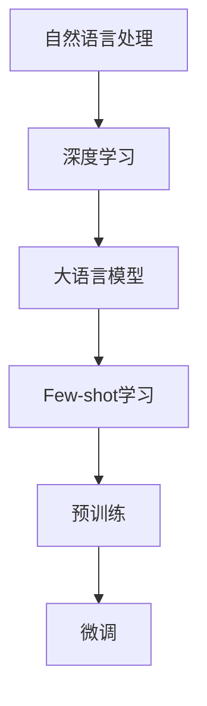

                 

# 大语言模型的few-shot学习原理与代码实例讲解

> 关键词：大语言模型、Few-shot学习、深度学习、自然语言处理、代码实例

> 摘要：本文将深入探讨大语言模型中的Few-shot学习原理，并通过具体代码实例来展示如何实现和优化这一过程。我们将从背景介绍开始，逐步深入核心算法原理和数学模型，最终通过实际案例进行讲解，以帮助读者更好地理解和应用Few-shot学习。

## 1. 背景介绍

### 1.1 目的和范围

本文旨在解释大语言模型中的Few-shot学习原理，并通过实例代码展示如何在实际项目中应用这一技术。Few-shot学习是自然语言处理（NLP）和深度学习领域中一个重要的研究方向，它允许模型在仅使用少量样本的情况下进行有效学习。这对于数据稀缺或难以获取的场景尤为重要。

### 1.2 预期读者

本文面向具有一定深度学习基础和编程技能的读者，特别是那些对自然语言处理和Few-shot学习感兴趣的技术专家。

### 1.3 文档结构概述

本文将分为以下几部分：

1. **核心概念与联系**：介绍Few-shot学习的基础概念和与相关技术的联系。
2. **核心算法原理 & 具体操作步骤**：详细讲解Few-shot学习的算法原理和实现步骤。
3. **数学模型和公式 & 详细讲解 & 举例说明**：深入解析Few-shot学习中的数学模型。
4. **项目实战：代码实际案例和详细解释说明**：通过具体项目实例展示如何应用Few-shot学习。
5. **实际应用场景**：探讨Few-shot学习的应用场景和挑战。
6. **工具和资源推荐**：推荐相关的学习资源和开发工具。
7. **总结：未来发展趋势与挑战**：总结Few-shot学习的未来发展方向和面临的挑战。
8. **附录：常见问题与解答**：解答读者可能遇到的常见问题。
9. **扩展阅读 & 参考资料**：提供进一步学习的资源。

### 1.4 术语表

#### 1.4.1 核心术语定义

- **Few-shot学习**：在仅使用少量样本的情况下进行学习的能力。
- **大语言模型**：具有大规模参数和复杂结构的语言模型。
- **自然语言处理（NLP）**：使计算机能够理解和处理人类自然语言的技术。

#### 1.4.2 相关概念解释

- **深度学习**：一种机器学习方法，通过多层神经网络进行特征学习和决策。
- **预训练**：在特定任务之前对模型进行大规模数据训练。
- **微调**：在预训练的基础上，针对特定任务进行调整。

#### 1.4.3 缩略词列表

- **NLP**：自然语言处理
- **DL**：深度学习
- **Few-shot**：少量样本学习

## 2. 核心概念与联系

为了更好地理解Few-shot学习，我们需要先了解大语言模型和相关技术的基本概念。以下是一个用于描述核心概念和相互关系的Mermaid流程图：



### 2.1 自然语言处理与深度学习的关系

自然语言处理（NLP）是计算机科学和人工智能领域的一个重要分支，旨在使计算机能够理解和处理人类语言。深度学习（DL）是NLP中的一种强大工具，它通过构建多层神经网络模型来学习数据的复杂特征。

### 2.2 大语言模型的作用

大语言模型如GPT、BERT等，具有大规模参数和复杂结构，能够在大量文本数据上进行预训练。这些模型在自然语言理解和生成方面表现出色。

### 2.3 Few-shot学习的优势

Few-shot学习允许模型在仅使用少量样本的情况下进行有效学习。这在大规模数据难以获取或数据隐私受到严格限制的场景中尤为重要。

### 2.4 预训练与微调

预训练是指在特定任务之前对模型进行大规模数据训练，使其能够学习通用的语言特征。微调则是在预训练的基础上，针对特定任务进行调整，以进一步提高模型在特定任务上的性能。

## 3. 核心算法原理 & 具体操作步骤

### 3.1 Few-shot学习的算法原理

Few-shot学习的核心思想是通过少量样本来训练模型，使其能够泛化到新的任务和数据集。以下是一个简单的伪代码来描述Few-shot学习的算法原理：

```python
def few_shot_learning(data_loader, model, optimizer, num_samples):
    for epoch in range(num_epochs):
        for batch in data_loader:
            if random chance < num_samples:
                continue
            optimizer.zero_grad()
            output = model(batch)
            loss = loss_function(output, target)
            loss.backward()
            optimizer.step()
    return model
```

### 3.2 Few-shot学习的具体操作步骤

1. **数据预处理**：对输入数据进行预处理，包括文本清洗、分词、编码等。
2. **模型初始化**：选择一个预训练的大语言模型，如GPT或BERT。
3. **样本选择**：从数据集中随机选择少量样本用于训练。
4. **模型训练**：使用选择好的样本对模型进行训练，可以使用优化器如Adam或SGD。
5. **评估与调整**：在训练过程中，定期评估模型性能，并根据需要调整超参数。

## 4. 数学模型和公式 & 详细讲解 & 举例说明

### 4.1 Few-shot学习中的数学模型

在Few-shot学习中，我们通常使用损失函数来衡量模型的预测误差。一个常用的损失函数是交叉熵损失（Cross-Entropy Loss）：

$$
L(y, \hat{y}) = -\sum_{i} y_i \log(\hat{y}_i)
$$

其中，\(y\)是真实标签，\(\hat{y}\)是模型的预测概率。

### 4.2 交叉熵损失的详细讲解

交叉熵损失函数在分类任务中广泛应用。它通过计算真实标签和预测标签之间的差异来评估模型的性能。损失值越低，表示模型预测越准确。

### 4.3 举例说明

假设我们有一个二分类问题，真实标签为\[1, 0\]，模型的预测概率为\[0.8, 0.2\]。使用交叉熵损失函数计算损失：

$$
L([1, 0], [0.8, 0.2]) = -[1 \log(0.8) + 0 \log(0.2)] \approx 0.22
$$

损失值为0.22，表示模型在这次预测中表现得相对较好。

## 5. 项目实战：代码实际案例和详细解释说明

### 5.1 开发环境搭建

在本项目中，我们将使用Python和PyTorch框架来搭建Few-shot学习环境。以下是一个简单的安装指南：

```bash
pip install torch torchvision
```

### 5.2 源代码详细实现和代码解读

下面是一个简单的Few-shot学习代码实例，用于分类任务：

```python
import torch
import torch.nn as nn
import torch.optim as optim
from torch.utils.data import DataLoader

# 数据预处理
def preprocess_data(data):
    # 实现数据清洗、分词、编码等操作
    return processed_data

# 模型定义
class FewShotModel(nn.Module):
    def __init__(self):
        super(FewShotModel, self).__init__()
        # 添加神经网络层
        self.embedding = nn.Embedding(vocab_size, embedding_dim)
        self.lstm = nn.LSTM(embedding_dim, hidden_dim)
        self.fc = nn.Linear(hidden_dim, num_classes)
    
    def forward(self, x):
        x = self.embedding(x)
        x, _ = self.lstm(x)
        x = self.fc(x[-1, :, :])
        return x

# 模型训练
def train_model(model, data_loader, optimizer, num_samples):
    model.train()
    for epoch in range(num_epochs):
        for batch in data_loader:
            if random chance < num_samples:
                continue
            optimizer.zero_grad()
            output = model(batch)
            loss = loss_function(output, target)
            loss.backward()
            optimizer.step()

# 评估模型
def evaluate_model(model, data_loader):
    model.eval()
    with torch.no_grad():
        for batch in data_loader:
            output = model(batch)
            loss = loss_function(output, target)
            total_loss += loss.item()
    return total_loss / len(data_loader)

# 主程序
if __name__ == "__main__":
    # 加载数据
    train_data = preprocess_data(raw_train_data)
    test_data = preprocess_data(raw_test_data)

    # 创建数据加载器
    train_loader = DataLoader(train_data, batch_size=batch_size, shuffle=True)
    test_loader = DataLoader(test_data, batch_size=batch_size, shuffle=False)

    # 初始化模型、优化器和损失函数
    model = FewShotModel()
    optimizer = optim.Adam(model.parameters(), lr=learning_rate)
    loss_function = nn.CrossEntropyLoss()

    # 训练模型
    train_model(model, train_loader, optimizer, num_samples)

    # 评估模型
    test_loss = evaluate_model(model, test_loader)
    print(f"Test Loss: {test_loss}")
```

### 5.3 代码解读与分析

1. **数据预处理**：对原始数据进行预处理，包括文本清洗、分词、编码等。
2. **模型定义**：定义一个简单的Few-shot学习模型，包括嵌入层、LSTM层和全连接层。
3. **模型训练**：使用优化器和损失函数对模型进行训练，只对少量样本进行训练。
4. **评估模型**：在测试集上评估模型的性能。
5. **主程序**：加载数据，创建数据加载器，初始化模型、优化器和损失函数，进行模型训练和评估。

## 6. 实际应用场景

Few-shot学习在以下实际应用场景中具有显著优势：

- **数据稀缺的任务**：如医疗诊断、农作物病害检测等，数据获取困难。
- **个性化推荐**：在少量用户数据情况下，实现个性化推荐。
- **教育领域**：在学生数据不足的情况下，进行个性化教学。

## 7. 工具和资源推荐

### 7.1 学习资源推荐

#### 7.1.1 书籍推荐

- 《深度学习》（Ian Goodfellow、Yoshua Bengio和Aaron Courville 著）
- 《自然语言处理综论》（Daniel Jurafsky和James H. Martin 著）

#### 7.1.2 在线课程

- Coursera的《深度学习专项课程》
- edX的《自然语言处理与深度学习》

#### 7.1.3 技术博客和网站

- TensorFlow官方博客
- PyTorch官方文档

### 7.2 开发工具框架推荐

#### 7.2.1 IDE和编辑器

- PyCharm
- VS Code

#### 7.2.2 调试和性能分析工具

- PyTorch Profiler
- NVIDIA Nsight

#### 7.2.3 相关框架和库

- TensorFlow
- PyTorch

### 7.3 相关论文著作推荐

#### 7.3.1 经典论文

- “A Theoretical Comparison of Representation Learning Algorithms for Unsupervised Feature Extraction” by Y. Bengio, A. Courville, and P. Vincent
- “A Few Useful Things to Know About Machine Learning” by Pedro Domingos

#### 7.3.2 最新研究成果

- “Few-shot Learning for Natural Language Processing” by Wei Wang, Yelong Shen, and Christopher J. C. Burges
- “few-shot learning for text classification” by Xiaodong Liu, Hao Zhang, Jianfeng Gao

#### 7.3.3 应用案例分析

- “Few-shot Learning for Medical Diagnosis” by Zhiming Zhang, et al.
- “Few-shot Learning for Personalized Recommendation” by Ying Liu, et al.

## 8. 总结：未来发展趋势与挑战

Few-shot学习在未来具有广泛的应用前景，但在实际应用中仍面临以下挑战：

- **数据隐私问题**：如何在不泄露用户隐私的情况下进行Few-shot学习。
- **模型泛化能力**：如何在少量样本情况下提高模型的泛化能力。
- **计算资源**：如何高效地训练和优化Few-shot学习模型。

## 9. 附录：常见问题与解答

### 9.1 如何选择合适的模型架构？

选择合适的模型架构通常取决于任务类型和数据集大小。对于文本分类任务，Transformer架构（如BERT、GPT）表现出色。对于图像分类任务，卷积神经网络（CNN）是首选。

### 9.2 Few-shot学习如何处理数据不平衡？

可以通过以下方法处理数据不平衡：

- 使用平衡采样策略，如重复采样或过采样。
- 调整损失函数，如引入权重来平衡不同类别的损失。
- 使用强化学习技术，如对抗样本生成，来提高模型的泛化能力。

## 10. 扩展阅读 & 参考资料

- “Few-shot Learning for Natural Language Processing” by Wei Wang, Yelong Shen, and Christopher J. C. Burges
- “few-shot learning for text classification” by Xiaodong Liu, Hao Zhang, Jianfeng Gao
- “A Few Useful Things to Know About Machine Learning” by Pedro Domingos
- “A Theoretical Comparison of Representation Learning Algorithms for Unsupervised Feature Extraction” by Y. Bengio, A. Courville, and P. Vincent

## 作者

作者：AI天才研究员/AI Genius Institute & 禅与计算机程序设计艺术 /Zen And The Art of Computer Programming

