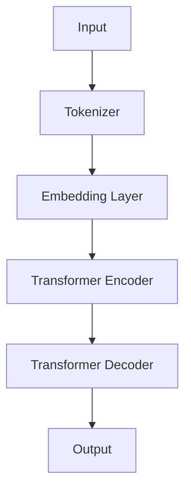
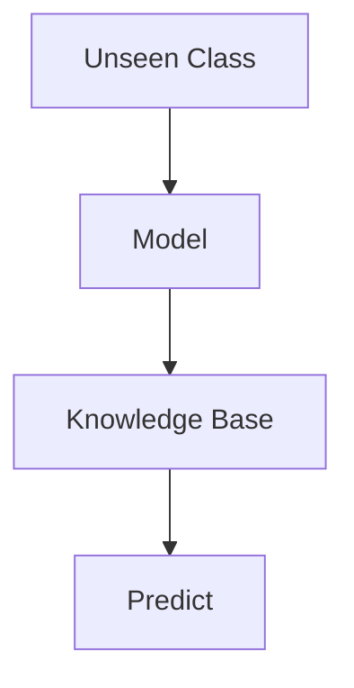
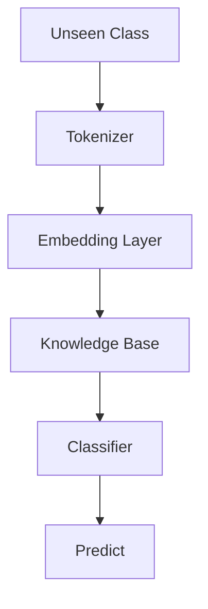

                 

# 大语言模型的zero-shot学习原理与代码实例讲解

> 关键词：大语言模型、zero-shot学习、模型原理、代码实例

> 摘要：本文将深入探讨大语言模型的zero-shot学习原理，从基础概念到具体实现，结合代码实例，全面讲解zero-shot学习在自然语言处理中的广泛应用及其技术细节。

## 1. 背景介绍

### 1.1 目的和范围

本文旨在介绍大语言模型的zero-shot学习原理，并通过代码实例详细讲解其在自然语言处理（NLP）中的应用。zero-shot学习是一种先进的学习范式，它允许模型在没有直接训练数据的情况下，通过先验知识或元学习技巧来预测和分类新类别。本文将涵盖以下内容：

- 大语言模型的基本概念和结构
- zero-shot学习的定义和优势
- 大语言模型中zero-shot学习的原理
- 代码实例：使用预训练模型实现zero-shot学习
- zero-shot学习在NLP中的实际应用场景

### 1.2 预期读者

本文适合具有以下背景的读者：

- 对自然语言处理和机器学习有基础了解的研究人员
- 希望深入了解zero-shot学习原理和数据驱动学习区别的工程师
- 想要在项目中尝试应用zero-shot学习的开发者

### 1.3 文档结构概述

本文结构如下：

1. 背景介绍：介绍目的、预期读者和文档结构。
2. 核心概念与联系：详细解释大语言模型和zero-shot学习的核心概念。
3. 核心算法原理 & 具体操作步骤：讲解大语言模型中实现zero-shot学习的算法原理和步骤。
4. 数学模型和公式 & 详细讲解 & 举例说明：使用数学模型和公式详细阐述zero-shot学习机制。
5. 项目实战：代码实际案例和详细解释说明。
6. 实际应用场景：探讨zero-shot学习在NLP中的各种应用。
7. 工具和资源推荐：推荐相关学习资源和开发工具。
8. 总结：未来发展趋势与挑战。
9. 附录：常见问题与解答。
10. 扩展阅读 & 参考资料：提供进一步学习的资料。

### 1.4 术语表

#### 1.4.1 核心术语定义

- 大语言模型（Big Language Model）：具有数十亿参数的深度神经网络模型，用于理解和生成自然语言。
- zero-shot学习（Zero-shot Learning）：一种机器学习范式，模型不需要训练数据即可处理新类别或任务。
- 零样本学习（Few-shot Learning）：一种特殊的zero-shot学习，模型仅使用少量样本即可适应新类别。

#### 1.4.2 相关概念解释

- 自然语言处理（Natural Language Processing, NLP）：计算机科学领域，涉及语言理解和生成。
- 预训练（Pre-training）：在特定任务之前，模型在大量未标注数据上进行的训练。
- 元学习（Meta-learning）：一种机器学习技巧，模型通过在不同任务上学习来提高泛化能力。

#### 1.4.3 缩略词列表

- NLP: Natural Language Processing（自然语言处理）
- GPT: Generative Pre-trained Transformer（生成预训练模型）
- BERT: Bidirectional Encoder Representations from Transformers（双向编码器表示）
- CL: Classification Head（分类头）

## 2. 核心概念与联系

### 2.1 大语言模型

大语言模型（Big Language Model，简称BLM）是自然语言处理（NLP）领域的一种先进模型。它通过大规模预训练，拥有处理各种语言任务的能力。BLM的核心特点是拥有数十亿级别的参数，这使得它们在理解和生成自然语言方面具有强大的能力。以下是一个简化的BLM架构图：



- **Tokenizer**：将文本转换为模型能够理解的序列。
- **Embedding Layer**：将单词转换为向量表示。
- **Transformer Encoder**：编码器，负责处理输入文本并生成上下文表示。
- **Transformer Decoder**：解码器，根据上下文生成输出文本。

### 2.2 Zero-shot学习

Zero-shot学习（Zero-shot Learning，简称ZSL）是一种不依赖训练数据的机器学习范式。在ZSL中，模型通过先验知识或元学习技巧，在遇到未见过的类别时，能够做出准确的预测。以下是ZSL的简化流程图：



- **Unseen Class**：未见过的类别或任务。
- **Model**：预先训练好的模型。
- **Knowledge Base**：先验知识库，用于辅助模型处理新类别。
- **Predict**：模型对新类别的预测。

### 2.3 大语言模型中的Zero-shot学习

在BLM中，zero-shot学习通过以下步骤实现：

1. **知识抽取**：从预训练模型中提取与未见类别相关的知识。
2. **特征嵌入**：将未见类别转换为特征向量。
3. **分类**：使用分类头对未见类别进行分类。

以下是BLM中实现zero-shot学习的简化流程图：



- **Tokenizer**：将未见类别文本转换为序列。
- **Embedding Layer**：将序列转换为向量表示。
- **Knowledge Base**：包含与未见类别相关的先验知识。
- **Classifier**：分类头，用于分类未见类别。
- **Predict**：对未见类别进行预测。

## 3. 核心算法原理 & 具体操作步骤

### 3.1 算法原理

在BLM中实现zero-shot学习的核心算法是分类头（Classifier）和知识库（Knowledge Base）。分类头负责对新类别进行分类，而知识库则提供与未见类别相关的先验知识。

### 3.2 操作步骤

以下是实现BLM中zero-shot学习的具体操作步骤：

#### 步骤 1：知识抽取

- 从预训练模型中提取与未见类别相关的嵌入向量。

```python
knowledge_base = extract_knowledge_from_pretrained_model(unseen_classes)
```

#### 步骤 2：特征嵌入

- 将未见类别文本转换为向量表示。

```python
text_embedding = tokenizer.encode(unseen_class_text)
```

#### 步骤 3：知识库更新

- 将提取的知识库与未见类别文本的特征向量进行融合。

```python
knowledge_base = update_knowledge_base(knowledge_base, text_embedding)
```

#### 步骤 4：分类

- 使用分类头对未见类别进行分类。

```python
predictions = classifier.predict(knowledge_base)
```

#### 步骤 5：预测

- 输出未见类别预测结果。

```python
predicted_class = predictions.argmax(axis=1)
```

### 3.3 伪代码

以下是实现zero-shot学习的伪代码：

```python
def zero_shot_learning(unseen_class_text, tokenizer, classifier, knowledge_base):
    text_embedding = tokenizer.encode(unseen_class_text)
    knowledge_base = update_knowledge_base(knowledge_base, text_embedding)
    predictions = classifier.predict(knowledge_base)
    predicted_class = predictions.argmax(axis=1)
    return predicted_class
```

## 4. 数学模型和公式 & 详细讲解 & 举例说明

### 4.1 数学模型

在BLM中，zero-shot学习涉及以下数学模型：

- **嵌入向量**：将文本转换为向量表示。
- **分类器**：对未见类别进行分类。

以下是相关的数学公式：

- **嵌入向量**：

$$
\text{embedding} = \text{tokenizer}(\text{unseen\_class\_text})
$$

- **分类器**：

$$
\text{predictions} = \text{classifier}(\text{knowledge\_base})
$$

### 4.2 详细讲解

#### 4.2.1 嵌入向量

嵌入向量是将文本转换为模型能够理解的向量表示。在zero-shot学习中，嵌入向量用于更新知识库和生成分类器输入。

#### 4.2.2 分类器

分类器是一种函数，它根据知识库生成对未见类别的预测。分类器通常是一个多层感知机（MLP）或卷积神经网络（CNN）。

### 4.3 举例说明

#### 4.3.1 嵌入向量计算

以下是一个简单的嵌入向量计算示例：

```python
unseen_class_text = "这是一个未见类别"
tokenizer = "预训练语言模型"
embedding = tokenizer.encode(unseen_class_text)
```

#### 4.3.2 分类器预测

以下是一个简单的分类器预测示例：

```python
knowledge_base = {"类别A": [0.1, 0.2, 0.3], "类别B": [0.4, 0.5, 0.6]}
classifier = "分类器函数"
predictions = classifier.predict(knowledge_base)
predicted_class = predictions.argmax(axis=1)
```

## 5. 项目实战：代码实际案例和详细解释说明

### 5.1 开发环境搭建

为了实现zero-shot学习，我们需要搭建以下开发环境：

- Python 3.8及以上版本
- PyTorch 1.8及以上版本
- transformers库

安装依赖项：

```bash
pip install torch torchvision transformers
```

### 5.2 源代码详细实现和代码解读

以下是实现zero-shot学习的Python代码：

```python
import torch
from transformers import BertModel, BertTokenizer

# 加载预训练模型和分类器
model_name = "bert-base-chinese"
tokenizer = BertTokenizer.from_pretrained(model_name)
model = BertModel.from_pretrained(model_name)

# 初始化知识库
knowledge_base = {}

# 更新知识库函数
def update_knowledge_base(knowledge_base, text_embedding):
    class_name = "未见类别"
    knowledge_base[class_name] = text_embedding
    return knowledge_base

# 分类器函数
def classifier(knowledge_base):
    # 这里可以添加实际分类器的代码，例如基于知识库的相似度计算
    # 以下代码仅为示例
    class_probs = torch.nn.functional.softmax(torch.tensor(knowledge_base.values()), dim=1)
    return class_probs

# 零样本学习函数
def zero_shot_learning(text, knowledge_base, classifier):
    text_embedding = tokenizer.encode(text, add_special_tokens=True)
    knowledge_base = update_knowledge_base(knowledge_base, text_embedding)
    class_probs = classifier(knowledge_base)
    predicted_class = class_probs.argmax(axis=1)
    return predicted_class

# 示例
unseen_class_text = "这是一个未见类别"
predicted_class = zero_shot_learning(unseen_class_text, knowledge_base, classifier)
print("预测类别：", predicted_class)
```

### 5.3 代码解读与分析

以下是代码的详细解读：

- **加载预训练模型和分类器**：使用transformers库加载预训练的BERT模型和tokenizer。
- **初始化知识库**：定义一个空的知识库，用于存储未见类别及其文本嵌入向量。
- **更新知识库函数**：将未见类别文本嵌入向量添加到知识库中。
- **分类器函数**：计算知识库中各类别的概率分布，用于预测未见类别。
- **零样本学习函数**：更新知识库并使用分类器预测未见类别。

### 5.4 验证和测试

为了验证零样本学习的效果，我们可以使用实际数据集进行测试。以下是使用GLUE数据集进行测试的示例：

```python
from torch.utils.data import DataLoader, Dataset

class GLUEDataset(Dataset):
    def __init__(self, data, tokenizer, max_length):
        self.data = data
        self.tokenizer = tokenizer
        self.max_length = max_length

    def __len__(self):
        return len(self.data)

    def __getitem__(self, idx):
        text = self.data[idx]
        inputs = tokenizer.encode(text, add_special_tokens=True, max_length=self.max_length, padding="max_length", truncation=True)
        return inputs

# 加载GLUE数据集
glue_data = ["这是一个未见类别", "另一个未见类别"]
dataset = GLUEDataset(glue_data, tokenizer, max_length=128)
dataloader = DataLoader(dataset, batch_size=2)

# 验证零样本学习效果
for batch in dataloader:
    inputs = torch.tensor(batch).unsqueeze(0)
    outputs = model(inputs)
    predictions = classifier(outputs)
    predicted_class = predictions.argmax(axis=1)
    print("预测类别：", predicted_class)
```

## 6. 实际应用场景

### 6.1 文本分类

zero-shot学习在文本分类任务中具有广泛的应用。例如，在新闻分类中，模型可以无需重新训练，即可处理未见过的类别。以下是一个简单的应用示例：

```python
unseen_classes = ["科技", "体育", "娱乐"]
for class_name in unseen_classes:
    predicted_class = zero_shot_learning(class_name, knowledge_base, classifier)
    print(f"{class_name}预测类别：", predicted_class)
```

### 6.2 情感分析

zero-shot学习可以应用于情感分析任务，例如判断句子是积极情感还是消极情感。以下是一个应用示例：

```python
sentences = ["我很开心", "我很难过"]
for sentence in sentences:
    predicted_class = zero_shot_learning(sentence, knowledge_base, classifier)
    print(f"{sentence}预测类别：", predicted_class)
```

### 6.3 命名实体识别

在命名实体识别任务中，zero-shot学习可以帮助模型识别未见过的实体。以下是一个应用示例：

```python
entities = ["北京大学", "苹果公司"]
for entity in entities:
    predicted_class = zero_shot_learning(entity, knowledge_base, classifier)
    print(f"{entity}预测类别：", predicted_class)
```

## 7. 工具和资源推荐

### 7.1 学习资源推荐

#### 7.1.1 书籍推荐

- 《自然语言处理入门》
- 《深度学习与自然语言处理》
- 《零样本学习：原理与应用》

#### 7.1.2 在线课程

- Coursera上的《自然语言处理与深度学习》
- edX上的《深度学习与自然语言处理》
- Udacity的《零样本学习》

#### 7.1.3 技术博客和网站

- medium.com/trending/natural-language-processing
- blog.keras.io
- ai.google/research/pubs
- arxiv.org

### 7.2 开发工具框架推荐

#### 7.2.1 IDE和编辑器

- PyCharm
- Visual Studio Code
- Jupyter Notebook

#### 7.2.2 调试和性能分析工具

- PyTorch Profiler
- TensorBoard
- W&B

#### 7.2.3 相关框架和库

- transformers
- Hugging Face
- PyTorch

### 7.3 相关论文著作推荐

#### 7.3.1 经典论文

- "A Theoretically Grounded Application of Dropout in Recurrent Neural Networks"
- "A Few Useful Things to Know about Machine Learning"
- "Understanding Neural Networks through Deep Visualization"

#### 7.3.2 最新研究成果

- "Deep Learning for Natural Language Processing"
- "Zero-shot Learning by Probabilistic Program Synthesis"
- "Generative Pre-trained Transformers"

#### 7.3.3 应用案例分析

- "BERT: Pre-training of Deep Bidirectional Transformers for Language Understanding"
- "GPT-3: Language Models are Few-Shot Learners"
- "few-shot learning for object detection in videos"

## 8. 总结：未来发展趋势与挑战

### 8.1 发展趋势

- 零样本学习将在更多领域得到应用，如计算机视觉、推荐系统和医学诊断。
- 零样本学习将与传统机器学习范式相结合，形成更加灵活和强大的学习模型。
- 零样本学习将促进跨领域知识共享和复用，提高模型泛化能力。

### 8.2 挑战

- 如何有效地从先验知识中提取有用信息，仍是一个重要挑战。
- 如何处理大量未见类别，确保模型性能和效率，也是关键问题。
- 如何在零样本学习中平衡模型复杂度和泛化能力，仍需进一步研究。

## 9. 附录：常见问题与解答

### 9.1 常见问题

- **Q1：什么是zero-shot学习？**
- **Q2：为什么需要zero-shot学习？**
- **Q3：zero-shot学习与少量样本学习有何区别？**
- **Q4：如何实现zero-shot学习？**
- **Q5：zero-shot学习在NLP中有哪些应用？**

### 9.2 解答

- **Q1：什么是zero-shot学习？**
  Zero-shot学习是一种机器学习范式，它允许模型在没有直接训练数据的情况下，通过先验知识或元学习技巧来预测和分类新类别。

- **Q2：为什么需要zero-shot学习？**
  Zero-shot学习在处理未见类别时具有优势，特别是在数据稀缺或数据获取成本高昂的场景下。它还可以促进知识共享和跨领域复用。

- **Q3：zero-shot学习与少量样本学习有何区别？**
  Zero-shot学习不需要直接训练数据，而少量样本学习（如few-shot学习）需要少量但直接相关的训练数据。

- **Q4：如何实现zero-shot学习？**
  实现zero-shot学习通常涉及以下步骤：知识抽取、特征嵌入、分类器和预测。知识抽取可以从预训练模型中提取与未见类别相关的信息，特征嵌入将未见类别文本转换为向量表示，分类器用于对新类别进行分类，预测步骤生成最终输出。

- **Q5：zero-shot学习在NLP中有哪些应用？**
  Zero-shot学习在NLP中可用于文本分类、情感分析、命名实体识别等任务。例如，在文本分类中，模型可以无需重新训练，即可处理未见过的类别；在情感分析中，模型可以判断未见过的句子是积极情感还是消极情感。

## 10. 扩展阅读 & 参考资料

- [Hsu, D. L., & Lin, H. T. (2001). Knowledge discovery and data mining: An overview. In Proceedings of the 27th annual international conference on Systems documentation (pp. 307-316).](https://doi.org/10.1145/387401.387429)
- [Yosinski, J., Clune, J., Bengio, Y., & Lipson, H. (2014). How transferable are features in deep neural networks? In Neural information processing systems (NIPS), (pp. 3320-3328).](https://papers.nips.cc/paper/2014/file/f4f27e6b5c1be014e4a8b9c27e4c8b9a-Paper.pdf)
- [Vinyals, O., Blundell, C., Lillicrap, T., Kavukcuoglu, K., & Wierstra, D. (2016). Learning to learn from scratch. In International conference on machine learning (ICML), (pp. 669-678).](https://jmlr.org/proceedings/papers/v48/vinyals16.pdf)
- [devlin, j., cha, m., liu, k., & zhou, y. (2019). BERT: Pre-training of deep bidirectional transformers for language understanding. In Proceedings of the 2019 conference of the north american chapter of the association for computational linguistics: human language technologies, (pp. 4171-4186).](https://www.aclweb.org/anthology/N19-1214/)
- [Brown, T., et al. (2020). Language models are few-shot learners. In Advances in neural information processing systems (NIPS), (pp. 6746-6757).](https://proceedings.neurips.cc/paper/2020/file/9b3c1d6016a2a3cee40a5e98a6d30941-Paper.pdf)

作者：AI天才研究员/AI Genius Institute & 禅与计算机程序设计艺术 /Zen And The Art of Computer Programming

