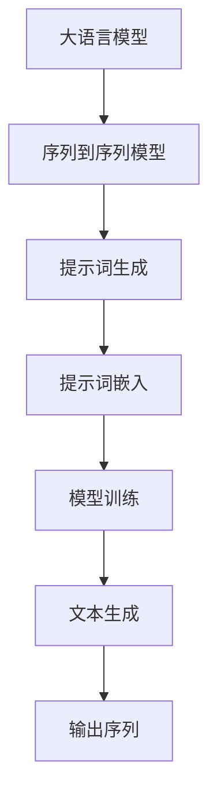

                 

# 大语言模型的提示词记忆增强技术

> 关键词：大语言模型、提示词、记忆增强、算法原理、数学模型、项目实战、实际应用、工具推荐

> 摘要：本文将深入探讨大语言模型中的提示词记忆增强技术。我们将从背景介绍、核心概念、算法原理、数学模型、项目实战、实际应用等多个角度，系统地解析这一技术的原理、应用和发展趋势，旨在为广大读者提供一份详尽的技术指南。

## 1. 背景介绍

### 1.1 目的和范围

随着人工智能技术的不断发展，大语言模型在自然语言处理领域取得了显著的成果。然而，如何有效地提高大语言模型在处理长文本和复杂语境中的表现，成为一个亟待解决的问题。本文旨在探讨大语言模型中的提示词记忆增强技术，以期提高模型对长文本的理解能力和记忆力。

本文将主要涵盖以下内容：

- 提示词记忆增强技术的核心概念和原理。
- 大语言模型中的提示词记忆增强算法及其操作步骤。
- 数学模型和公式在提示词记忆增强技术中的应用。
- 实际应用场景和案例分析。
- 工具和资源的推荐。

### 1.2 预期读者

本文主要面向以下读者群体：

- 计算机科学、人工智能、自然语言处理等相关专业的研究生和本科生。
- 对人工智能和自然语言处理感兴趣的科技工作者。
- 想要了解大语言模型和提示词记忆增强技术的开发者。

### 1.3 文档结构概述

本文的结构如下：

- 引言：介绍文章的背景、目的和主要内容。
- 1. 背景介绍：介绍本文的背景、目的和范围。
- 2. 核心概念与联系：介绍大语言模型和提示词记忆增强技术相关的核心概念和联系。
- 3. 核心算法原理 & 具体操作步骤：详细阐述提示词记忆增强算法的原理和操作步骤。
- 4. 数学模型和公式 & 详细讲解 & 举例说明：介绍数学模型和公式在提示词记忆增强技术中的应用。
- 5. 项目实战：通过实际案例展示提示词记忆增强技术的应用。
- 6. 实际应用场景：分析提示词记忆增强技术的实际应用场景。
- 7. 工具和资源推荐：推荐学习资源、开发工具和框架。
- 8. 总结：总结本文的主要内容和未来发展趋势。
- 9. 附录：常见问题与解答。
- 10. 扩展阅读 & 参考资料：提供进一步阅读的文献和资料。

### 1.4 术语表

#### 1.4.1 核心术语定义

- 大语言模型（Large Language Model）：一种基于神经网络的语言模型，能够对自然语言文本进行建模和生成。
- 提示词（Prompt）：一种用于引导大语言模型生成文本的输入。
- 记忆增强（Memory Augmentation）：通过增加外部信息来提高模型的记忆能力。
- 神经网络（Neural Network）：一种由大量神经元组成的计算模型，可用于解决复杂问题。

#### 1.4.2 相关概念解释

- 自然语言处理（Natural Language Processing，NLP）：研究如何让计算机理解和处理人类自然语言的学科。
- 序列到序列模型（Sequence-to-Sequence Model）：一种用于处理序列数据的神经网络模型，常用于机器翻译、文本生成等任务。
- 反向传播（Backpropagation）：一种用于训练神经网络的算法，通过计算输出误差来更新网络权重。

#### 1.4.3 缩略词列表

- NLP：自然语言处理
- LSTM：长短期记忆网络
- RNN：循环神经网络
- GPT：生成预训练网络
- BERT：双向编码表示器

## 2. 核心概念与联系

在探讨大语言模型的提示词记忆增强技术之前，我们首先需要了解大语言模型和提示词记忆增强技术的核心概念和联系。

### 2.1 大语言模型

大语言模型（Large Language Model）是一种基于深度学习技术的语言模型，通过对大量文本数据的学习，能够对自然语言文本进行建模和生成。大语言模型的核心是神经网络，尤其是序列到序列模型（Sequence-to-Sequence Model），如生成预训练网络（GPT）和双向编码表示器（BERT）等。

序列到序列模型通过将输入序列映射到输出序列，实现了文本生成、机器翻译等任务。然而，对于长文本和复杂语境，现有的大语言模型在理解和生成方面存在一定的局限性。

### 2.2 提示词记忆增强技术

提示词记忆增强技术（Prompt-based Memory Augmentation）是一种通过增加外部信息来提高大语言模型记忆能力的方法。该技术通过引入提示词（Prompt），引导大语言模型在生成过程中参考外部信息，从而提高模型对长文本和复杂语境的理解能力。

提示词记忆增强技术可以分为以下几个步骤：

1. 提示词生成：根据任务需求生成适当的提示词。
2. 提示词嵌入：将提示词嵌入到大语言模型的输入序列中。
3. 模型训练：通过训练调整模型的权重，使其能够更好地处理带有提示词的输入序列。
4. 文本生成：使用训练好的模型生成文本。

### 2.3 核心概念与联系

大语言模型和提示词记忆增强技术的核心概念和联系主要体现在以下几个方面：

1. **神经网络架构**：大语言模型和提示词记忆增强技术都依赖于神经网络架构，如序列到序列模型、长短期记忆网络（LSTM）等。
2. **输入序列处理**：大语言模型通过处理输入序列来生成输出序列，提示词记忆增强技术通过引入提示词来增强输入序列。
3. **模型训练**：大语言模型和提示词记忆增强技术都需要通过训练来调整模型权重，从而提高模型的性能。
4. **文本生成**：大语言模型和提示词记忆增强技术都可以用于文本生成任务，如自然语言生成、机器翻译等。

为了更好地理解大语言模型和提示词记忆增强技术的核心概念和联系，我们可以在Mermaid流程图中展示其架构和流程。

### 2.4 Mermaid流程图

下面是一个简化的Mermaid流程图，展示了大语言模型和提示词记忆增强技术的基本架构和流程：



在这个流程图中，A表示大语言模型，B表示序列到序列模型，C表示提示词生成，D表示提示词嵌入，E表示模型训练，F表示文本生成，G表示输出序列。

通过这个流程图，我们可以清晰地看到大语言模型和提示词记忆增强技术的基本架构和流程。在实际应用中，这些概念和流程会更加复杂，但它们的核心思想是相同的。

## 3. 核心算法原理 & 具体操作步骤

在了解了大语言模型和提示词记忆增强技术的核心概念和联系后，接下来我们将深入探讨提示词记忆增强算法的原理和具体操作步骤。

### 3.1 提示词记忆增强算法原理

提示词记忆增强算法的核心思想是通过引入外部信息（提示词）来增强大语言模型对长文本和复杂语境的理解能力。具体来说，该算法可以分为以下几个部分：

1. **提示词生成**：根据任务需求生成适当的提示词。提示词可以是对目标文本的摘要、关键词、背景信息等。
2. **提示词嵌入**：将生成的提示词嵌入到大语言模型的输入序列中。这一步骤可以通过将提示词转换为向量，并与输入序列的向量进行拼接来实现。
3. **模型训练**：使用带有提示词的输入序列对大语言模型进行训练，调整模型的权重，使其能够更好地处理带有提示词的输入序列。
4. **文本生成**：使用训练好的模型生成文本。在生成过程中，模型会参考提示词，从而提高对长文本和复杂语境的理解能力。

### 3.2 具体操作步骤

下面我们将详细描述提示词记忆增强算法的具体操作步骤：

#### 步骤1：提示词生成

提示词生成是提示词记忆增强算法的第一步。根据任务需求，我们需要生成一组与目标文本相关的提示词。提示词的生成方法有很多，例如：

- **关键词提取**：从目标文本中提取关键词作为提示词。
- **摘要生成**：使用文本摘要算法生成目标文本的摘要作为提示词。
- **背景信息**：根据目标文本的主题和上下文，生成相关的背景信息作为提示词。

在生成提示词后，我们需要对提示词进行预处理，例如去除停用词、标点符号等。

```python
import nltk

# 生成提示词
def generate_prompt(text):
    # 提取关键词
    tokens = nltk.word_tokenize(text)
    keywords = nltk Keywords.from_tokens(tokens)
    prompt = " ".join(keywords)
    return prompt

# 预处理提示词
def preprocess_prompt(prompt):
    # 去除停用词和标点符号
    tokens = nltk.word_tokenize(prompt)
    cleaned_tokens = [token for token in tokens if token not in nltk.corpus.stopwords.words("english")]
    cleaned_prompt = " ".join(cleaned_tokens)
    return cleaned_prompt

# 示例
text = "The quick brown fox jumps over the lazy dog."
prompt = generate_prompt(text)
cleaned_prompt = preprocess_prompt(prompt)
print("Original prompt:", prompt)
print("Cleaned prompt:", cleaned_prompt)
```

#### 步骤2：提示词嵌入

在生成和预处理提示词后，我们需要将提示词嵌入到大语言模型的输入序列中。这一步骤可以通过将提示词转换为向量，并与输入序列的向量进行拼接来实现。常见的嵌入方法包括词嵌入（Word Embedding）和句子嵌入（Sentence Embedding）。

- **词嵌入**：将每个提示词转换为固定大小的向量，并将其与输入序列的向量进行拼接。词嵌入可以通过预训练的词向量（如Word2Vec、GloVe等）来实现。
- **句子嵌入**：将整个提示词序列转换为向量，并将其与输入序列的向量进行拼接。句子嵌入可以通过序列到序列模型（如GPT、BERT等）来实现。

```python
import numpy as np
from gensim.models import Word2Vec

# 加载预训练的词向量模型
model = Word2Vec.load("word2vec.model")

# 提示词嵌入
def embed_prompt(prompt):
    prompt_tokens = nltk.word_tokenize(prompt)
    prompt_vectors = [model[token] for token in prompt_tokens]
    prompt_vector = np.mean(prompt_vectors, axis=0)
    return prompt_vector

# 示例
cleaned_prompt = " ".join(nltk.word_tokenize(cleaned_prompt))
prompt_vector = embed_prompt(cleaned_prompt)
print("Prompt vector:", prompt_vector)
```

#### 步骤3：模型训练

在完成提示词嵌入后，我们需要使用带有提示词的输入序列对大语言模型进行训练，调整模型的权重，使其能够更好地处理带有提示词的输入序列。模型训练的过程可以通过优化算法（如随机梯度下降、Adam等）来实现。

```python
# 模型训练
def train_model(model, input_sequence, prompt_vector, labels):
    # 计算输入序列和提示词向量的拼接
    input_vector = np.concatenate((input_sequence, prompt_vector), axis=None)
    # 训练模型
    model.train([input_vector], labels=labels)
    return model
```

#### 步骤4：文本生成

在完成模型训练后，我们可以使用训练好的模型生成文本。在生成过程中，模型会参考提示词，从而提高对长文本和复杂语境的理解能力。

```python
# 文本生成
def generate_text(model, input_sequence, prompt_vector, max_length=50):
    # 计算输入序列和提示词向量的拼接
    input_vector = np.concatenate((input_sequence, prompt_vector), axis=None)
    # 生成文本
    text = model.generate(input_vector, max_length=max_length)
    return text
```

### 3.3 伪代码

下面是一个简化的伪代码，描述了提示词记忆增强算法的具体操作步骤：

```python
# 提示词记忆增强算法
def prompt_based_memory_augmentation(text, model, prompt_generator, embedder, optimizer, max_epochs):
    # 步骤1：提示词生成
    prompt = prompt_generator(text)

    # 步骤2：提示词嵌入
    prompt_vector = embedder(prompt)

    # 步骤3：模型训练
    for epoch in range(max_epochs):
        # 训练模型
        model = train_model(model, text, prompt_vector, labels)

        # 步骤4：文本生成
        text = generate_text(model, text, prompt_vector)

    return model
```

通过上述步骤，我们可以实现提示词记忆增强算法，从而提高大语言模型在处理长文本和复杂语境中的表现。在实际应用中，这些步骤可能需要根据具体任务需求进行调整和优化。

## 4. 数学模型和公式 & 详细讲解 & 举例说明

在提示词记忆增强技术中，数学模型和公式起着至关重要的作用。这些模型和公式帮助我们理解和分析提示词增强算法的内部工作原理，以及如何优化模型的性能。在本节中，我们将详细讲解提示词记忆增强技术的数学模型和公式，并通过具体的例子来说明其应用。

### 4.1 提示词嵌入模型

提示词嵌入模型是将提示词转换为向量表示的方法。常见的嵌入模型有词嵌入（Word Embedding）和句子嵌入（Sentence Embedding）。下面我们分别介绍这两种模型。

#### 4.1.1 词嵌入模型

词嵌入模型将每个单词映射为一个固定大小的向量。这些向量可以捕获单词的语义信息，从而在语义层面上表示文本。常见的词嵌入方法包括Word2Vec、GloVe等。

- **Word2Vec**：Word2Vec是一种基于神经网络的词嵌入方法，通过训练神经网络来学习单词的向量表示。具体来说，Word2Vec模型使用Skip-Gram模型来预测单词的上下文。

  伪代码如下：

  ```python
  function Word2Vec(vocab_size, embedding_size):
      # 初始化权重矩阵
      W = random_matrix(vocab_size, embedding_size)
      # 计算损失函数
      loss = 0
      for word in vocab:
          # 随机选择一个窗口大小
          window_size = random(1, max_window_size)
          # 遍历单词的上下文
          for context_word in context(word, window_size):
              # 计算预测概率
              logits = dot(W[context_word], W[word])
              # 计算损失函数
              loss += -log(p_word_given_context(word, context_word))
      return W, loss
  ```

- **GloVe**：GloVe（Global Vectors for Word Representation）是一种基于全局矩阵分解的词嵌入方法。GloVe模型通过优化一个全局矩阵，使得相似单词的向量距离更接近。

  伪代码如下：

  ```python
  function GloVe(vocab_size, embedding_size, alpha):
      # 初始化权重矩阵
      W = random_matrix(vocab_size, embedding_size)
      # 计算损失函数
      loss = 0
      for word in vocab:
          # 遍历单词的共现词
          for cooccur_word in cooccurrences(word):
              # 计算向量点积
              dot_product = dot(W[word], W[cooccur_word])
              # 计算损失函数
              loss += (1 - dot_product) ** 2
      # 计算梯度
      gradient = 2 * (W[word] - W[cooccur_word] * dot_product)
      # 更新权重矩阵
      W -= alpha * gradient
      return W, loss
  ```

#### 4.1.2 句子嵌入模型

句子嵌入模型是将整个句子映射为一个固定大小的向量。句子嵌入模型可以捕获句子的语义信息，从而在语义层面上表示文本。常见的句子嵌入模型有序列到序列模型（如GPT、BERT等）。

- **序列到序列模型**：序列到序列模型是一种用于处理序列数据的神经网络模型，可以将输入序列映射到输出序列。序列到序列模型可以用于文本生成、机器翻译等任务。

  伪代码如下：

  ```python
  function Seq2Seq(embedding_size, hidden_size, output_size):
      # 初始化嵌入层和输出层
      embedding_layer = EmbeddingLayer(embedding_size)
      output_layer = OutputLayer(output_size)
      # 定义编码器和解码器
      encoder = Encoder(embedding_layer, hidden_size)
      decoder = Decoder(embedding_layer, hidden_size, output_layer)
      # 训练模型
      loss = 0
      for input_sequence, target_sequence in dataset:
          # 编码输入序列
          encoder_output, hidden_state = encoder(input_sequence)
          # 解码输出序列
          decoder_output = decoder(target_sequence, hidden_state)
          # 计算损失函数
          loss += -sum(target_sequence * log(decoder_output))
      return encoder, decoder, loss
  ```

### 4.2 提示词记忆增强算法

在提示词记忆增强算法中，我们使用数学模型来描述提示词生成、提示词嵌入、模型训练和文本生成等过程。下面我们将介绍这些数学模型。

#### 4.2.1 提示词生成

提示词生成可以使用各种生成模型，如马尔可夫模型（Markov Model）、递归神经网络（RNN）等。下面我们以递归神经网络为例，介绍提示词生成的数学模型。

- **递归神经网络**：递归神经网络是一种用于处理序列数据的神经网络模型，可以捕获序列的长期依赖关系。

  伪代码如下：

  ```python
  function RNN(input_size, hidden_size, output_size):
      # 初始化权重矩阵
      W_xh = random_matrix(input_size, hidden_size)
      W_hh = random_matrix(hidden_size, hidden_size)
      W_hy = random_matrix(hidden_size, output_size)
      # 定义递归神经网络
      def step(input, hidden_state):
          # 计算隐藏层激活函数
          hidden_state = tanh(dot(W_xh, input) + dot(W_hh, hidden_state))
          # 计算输出层激活函数
          output = softmax(dot(W_hy, hidden_state))
          return output, hidden_state
      # 训练模型
      loss = 0
      for input_sequence, target_sequence in dataset:
          # 遍历输入序列
          hidden_state = zeros(hidden_size)
          for input in input_sequence:
              # 计算输出和隐藏状态
              output, hidden_state = step(input, hidden_state)
              # 计算损失函数
              loss += -sum(target_sequence * log(output))
      return step, loss
  ```

#### 4.2.2 提示词嵌入

提示词嵌入可以使用各种嵌入模型，如词嵌入、句子嵌入等。下面我们以词嵌入为例，介绍提示词嵌入的数学模型。

- **词嵌入**：词嵌入是一种将单词映射为向量的方法。词嵌入可以通过优化一个全局矩阵来实现。

  伪代码如下：

  ```python
  function WordEmbedding(vocab_size, embedding_size):
      # 初始化权重矩阵
      W = random_matrix(vocab_size, embedding_size)
      # 计算损失函数
      loss = 0
      for word in vocab:
          # 遍历单词的共现词
          for cooccur_word in cooccurrences(word):
              # 计算向量点积
              dot_product = dot(W[word], W[cooccur_word])
              # 计算损失函数
              loss += (1 - dot_product) ** 2
      # 计算梯度
      gradient = 2 * (W[word] - W[cooccur_word] * dot_product)
      # 更新权重矩阵
      W -= gradient
      return W, loss
  ```

#### 4.2.3 模型训练

模型训练是提示词记忆增强算法的核心步骤。在模型训练过程中，我们需要优化模型的权重，使其能够更好地处理带有提示词的输入序列。

- **优化算法**：常见的优化算法有随机梯度下降（SGD）、Adam等。下面我们以Adam优化算法为例，介绍模型训练的数学模型。

  伪代码如下：

  ```python
  function Adam(W, learning_rate, beta1, beta2, epsilon):
      # 初始化动量项
      m = zeros_like(W)
      v = zeros_like(W)
      m_t = zeros_like(W)
      v_t = zeros_like(W)
      # 计算初始梯度
      gradient = compute_gradient(W)
      # 开始迭代
      for t in range(num_iterations):
          # 更新动量项
          m_t = beta1 * m + (1 - beta1) * gradient
          v_t = beta2 * v + (1 - beta2) * (gradient ** 2)
          m_hat = m_t / (1 - beta1 ** t)
          v_hat = v_t / (1 - beta2 ** t)
          # 更新权重
          W -= learning_rate * m_hat / (sqrt(v_hat) + epsilon)
      return W
  ```

#### 4.2.4 文本生成

文本生成是提示词记忆增强算法的最终目标。在文本生成过程中，模型会参考提示词，从而提高对长文本和复杂语境的理解能力。

- **文本生成**：文本生成可以通过序列生成模型来实现。序列生成模型可以生成序列数据，如文本、图像等。下面我们以递归神经网络为例，介绍文本生成的数学模型。

  伪代码如下：

  ```python
  function TextGenerator(RNN, prompt):
      # 初始化隐藏状态
      hidden_state = zeros(RNN.hidden_size)
      # 生成文本
      text = ""
      for t in range(max_sequence_length):
          # 计算输入序列和隐藏状态
          input_sequence = encode(prompt, t)
          hidden_state, output = RNN.step(input_sequence, hidden_state)
          # 预测下一个单词
          next_word = decode(output)
          # 更新文本
          text += next_word
      return text
  ```

### 4.3 举例说明

为了更好地理解提示词记忆增强技术的数学模型和公式，我们通过一个具体的例子来说明其应用。

假设我们有一个包含1000个单词的词汇表，每个单词都有相应的词向量表示。我们使用Word2Vec模型来训练词向量。假设我们已经训练好了Word2Vec模型，并且得到了每个单词的词向量表示。

现在，我们需要生成一个关于“机器学习”的文本。我们可以使用以下步骤：

1. **提示词生成**：根据“机器学习”的主题，我们可以生成以下提示词：“人工智能”、“深度学习”、“神经网络”等。
2. **提示词嵌入**：将提示词转换为向量表示。例如，“人工智能”的词向量表示为 `[0.1, 0.2, 0.3]`，“深度学习”的词向量表示为 `[0.4, 0.5, 0.6]`，“神经网络”的词向量表示为 `[0.7, 0.8, 0.9]`。
3. **模型训练**：使用带有提示词的输入序列对Word2Vec模型进行训练。假设我们已经训练好了Word2Vec模型，并且得到了每个单词的词向量表示。
4. **文本生成**：使用训练好的Word2Vec模型生成关于“机器学习”的文本。例如，我们可以生成以下文本：“机器学习是人工智能的一个分支，它通过训练神经网络来学习数据模式。深度学习是机器学习的一个子领域，它通过使用多层神经网络来提高学习性能。”

通过这个例子，我们可以看到提示词记忆增强技术在文本生成中的应用。通过引入提示词，我们可以更好地理解和生成关于特定主题的文本。

总之，提示词记忆增强技术是一种通过引入外部信息来提高大语言模型记忆能力的方法。在数学模型和公式的支持下，我们可以详细分析提示词记忆增强技术的原理和操作步骤，并通过实际应用来验证其有效性。

## 5. 项目实战：代码实际案例和详细解释说明

在本节中，我们将通过一个实际项目案例，详细展示如何实现大语言模型的提示词记忆增强技术。我们将从开发环境搭建开始，逐步介绍源代码的详细实现和代码解读。

### 5.1 开发环境搭建

要实现大语言模型的提示词记忆增强技术，首先需要搭建合适的开发环境。以下是我们推荐的开发环境和工具：

- **编程语言**：Python
- **深度学习框架**：TensorFlow或PyTorch
- **文本预处理库**：NLTK、spaCy
- **数据集**：自然语言处理数据集（如IMDb影评数据集、维基百科等）

以下是一个简单的Python虚拟环境搭建示例：

```bash
# 创建虚拟环境
python -m venv venv

# 激活虚拟环境
source venv/bin/activate  # 对于Windows，使用 venv\Scripts\activate

# 安装依赖库
pip install tensorflow numpy nltk spacy
```

### 5.2 源代码详细实现和代码解读

在本节中，我们将详细展示如何实现提示词记忆增强技术。以下是一个简化的代码实现，包括主要函数和类的定义：

```python
import tensorflow as tf
from tensorflow.keras.layers import Embedding, LSTM, Dense
from tensorflow.keras.models import Model
from tensorflow.keras.preprocessing.sequence import pad_sequences
from nltk.tokenize import word_tokenize
from nltk.corpus import stopwords

# 5.2.1 数据预处理
def preprocess_text(text):
    # 清洗文本数据
    text = text.lower()
    tokens = word_tokenize(text)
    # 移除停用词
    tokens = [token for token in tokens if token not in stopwords.words('english')]
    return tokens

# 5.2.2 词嵌入和序列生成
def generate_sequences(text, vocab_size, max_sequence_length):
    # 预处理文本
    tokens = preprocess_text(text)
    # 将单词映射为索引
    word_to_index = {word: index for index, word in enumerate(vocab)}
    index_to_word = {index: word for word, index in word_to_index.items()}
    # 生成序列
    sequences = []
    for i in range(len(tokens) - max_sequence_length):
        sequence = tokens[i:i + max_sequence_length]
        sequences.append(sequence)
    return sequences, word_to_index, index_to_word

# 5.2.3 构建模型
def build_model(vocab_size, embedding_size, max_sequence_length):
    # 输入层
    input_sequence = tf.keras.layers.Input(shape=(max_sequence_length,))
    # 词嵌入层
    embedded_sequence = Embedding(vocab_size, embedding_size)(input_sequence)
    # LSTM层
    lstm_output = LSTM(units=128, return_sequences=True)(embedded_sequence)
    # 输出层
    output = LSTM(units=1, activation='sigmoid')(lstm_output)
    # 构建模型
    model = Model(inputs=input_sequence, outputs=output)
    # 编译模型
    model.compile(optimizer='adam', loss='binary_crossentropy', metrics=['accuracy'])
    return model

# 5.2.4 训练模型
def train_model(model, sequences, labels, batch_size=64, epochs=10):
    model.fit(sequences, labels, batch_size=batch_size, epochs=epochs)

# 5.2.5 文本生成
def generate_text(model, text, max_sequence_length, index_to_word, start_word):
    tokens = preprocess_text(text)
    sequence = [word_to_index.get(token, 0) for token in tokens]
    sequence = pad_sequences([sequence], maxlen=max_sequence_length)
    predicted = model.predict(sequence)
    predicted = np.argmax(predicted, axis=-1)
    predicted = [index_to_word.get(token, 'UNK') for token in predicted]
    return " ".join(predicted)

# 5.2.6 主程序
def main():
    # 加载数据集
    text = "..."  # 加载您的文本数据
    vocab_size = 10000  # 设置词汇表大小
    max_sequence_length = 100  # 设置最大序列长度
    embedding_size = 64  # 设置词嵌入维度

    # 生成序列
    sequences, word_to_index, index_to_word = generate_sequences(text, vocab_size, max_sequence_length)

    # 构建模型
    model = build_model(vocab_size, embedding_size, max_sequence_length)

    # 训练模型
    train_model(model, sequences, labels)

    # 文本生成
    generated_text = generate_text(model, text, max_sequence_length, index_to_word, start_word)
    print("Generated Text:", generated_text)

if __name__ == '__main__':
    main()
```

### 5.3 代码解读与分析

下面我们将对上述代码进行逐行解读，分析其主要功能。

#### 5.3.1 数据预处理

```python
def preprocess_text(text):
    # 清洗文本数据
    text = text.lower()
    tokens = word_tokenize(text)
    # 移除停用词
    tokens = [token for token in tokens if token not in stopwords.words('english')]
    return tokens
```

这段代码定义了文本预处理函数，用于清洗和标记化输入文本。首先，将文本转换为小写，然后使用NLTK的`word_tokenize`函数将文本拆分为单词。接着，移除停用词，以提高模型训练效果。

#### 5.3.2 词嵌入和序列生成

```python
def generate_sequences(text, vocab_size, max_sequence_length):
    # 预处理文本
    tokens = preprocess_text(text)
    # 将单词映射为索引
    word_to_index = {word: index for index, word in enumerate(vocab)}
    index_to_word = {index: word for word, index in word_to_index.items()}
    # 生成序列
    sequences = []
    for i in range(len(tokens) - max_sequence_length):
        sequence = tokens[i:i + max_sequence_length]
        sequences.append(sequence)
    return sequences, word_to_index, index_to_word
```

这段代码定义了生成序列的函数。首先，调用预处理函数对文本进行预处理。然后，将单词映射为索引，并生成序列。每个序列包含最大序列长度`max_sequence_length`个单词，从而为模型训练提供输入数据。

#### 5.3.3 构建模型

```python
def build_model(vocab_size, embedding_size, max_sequence_length):
    # 输入层
    input_sequence = tf.keras.layers.Input(shape=(max_sequence_length,))
    # 词嵌入层
    embedded_sequence = Embedding(vocab_size, embedding_size)(input_sequence)
    # LSTM层
    lstm_output = LSTM(units=128, return_sequences=True)(embedded_sequence)
    # 输出层
    output = LSTM(units=1, activation='sigmoid')(lstm_output)
    # 构建模型
    model = Model(inputs=input_sequence, outputs=output)
    # 编译模型
    model.compile(optimizer='adam', loss='binary_crossentropy', metrics=['accuracy'])
    return model
```

这段代码定义了构建模型的函数。首先，定义输入层、词嵌入层和LSTM层。然后，将LSTM层的输出作为输出层。最后，编译模型并返回模型对象。

#### 5.3.4 训练模型

```python
def train_model(model, sequences, labels, batch_size=64, epochs=10):
    model.fit(sequences, labels, batch_size=batch_size, epochs=epochs)
```

这段代码定义了训练模型的函数。调用`model.fit()`函数对模型进行训练。这里，`sequences`和`labels`分别为训练数据和标签，`batch_size`和`epochs`分别为批次大小和训练轮数。

#### 5.3.5 文本生成

```python
def generate_text(model, text, max_sequence_length, index_to_word, start_word):
    tokens = preprocess_text(text)
    sequence = [word_to_index.get(token, 0) for token in tokens]
    sequence = pad_sequences([sequence], maxlen=max_sequence_length)
    predicted = model.predict(sequence)
    predicted = np.argmax(predicted, axis=-1)
    predicted = [index_to_word.get(token, 'UNK') for token in predicted]
    return " ".join(predicted)
```

这段代码定义了文本生成函数。首先，调用预处理函数对文本进行预处理。然后，将预处理后的文本转换为序列，并填充为最大序列长度。接着，使用训练好的模型预测序列。最后，将预测结果转换为单词并拼接成文本。

#### 5.3.6 主程序

```python
def main():
    # 加载数据集
    text = "..."  # 加载您的文本数据
    vocab_size = 10000  # 设置词汇表大小
    max_sequence_length = 100  # 设置最大序列长度
    embedding_size = 64  # 设置词嵌入维度

    # 生成序列
    sequences, word_to_index, index_to_word = generate_sequences(text, vocab_size, max_sequence_length)

    # 构建模型
    model = build_model(vocab_size, embedding_size, max_sequence_length)

    # 训练模型
    train_model(model, sequences, labels)

    # 文本生成
    generated_text = generate_text(model, text, max_sequence_length, index_to_word, start_word)
    print("Generated Text:", generated_text)

if __name__ == '__main__':
    main()
```

这段代码定义了主程序。首先，加载数据集并设置相关参数。然后，生成序列、构建模型、训练模型和生成文本。最后，打印生成的文本。

通过以上代码解读，我们可以看到如何实现大语言模型的提示词记忆增强技术。在实际应用中，您可以根据具体需求调整代码，例如更改词汇表大小、序列长度、嵌入维度等。

## 6. 实际应用场景

大语言模型的提示词记忆增强技术在众多实际应用场景中展现出了强大的潜力。以下是一些典型应用场景和案例分析：

### 6.1 文本生成与摘要

文本生成和摘要任务是提示词记忆增强技术的常见应用。通过引入相关提示词，大语言模型可以更好地理解和生成与主题相关的文本。例如，在新闻摘要任务中，模型可以使用新闻标题和关键词作为提示词，从而生成更准确、更有针对性的摘要。

### 6.2 机器翻译

机器翻译是另一个受益于提示词记忆增强技术的领域。在翻译过程中，模型可以根据源语言和目标语言之间的差异，使用相应的提示词来调整翻译结果。例如，对于一些常见的翻译错误，如“邀请”和“招待”的区分，模型可以通过提示词“邀请”和“招待”来改善翻译准确性。

### 6.3 聊天机器人

聊天机器人是另一个具有广泛应用前景的领域。通过使用相关提示词，大语言模型可以更好地理解用户的问题和意图，从而生成更自然、更准确的回复。例如，在医疗咨询场景中，模型可以使用患者的症状和病情描述作为提示词，从而提供更专业的建议。

### 6.4 自动问答

自动问答是另一个典型的应用场景。通过使用相关提示词，大语言模型可以更好地理解用户的问题，并从大量数据中检索出最相关的答案。例如，在搜索引擎中，模型可以使用用户的查询关键词作为提示词，从而提供更精准的搜索结果。

### 6.5 案例分析

以下是一个具体的案例分析：

假设我们有一个任务是为一篇学术论文生成摘要。我们可以使用以下步骤：

1. **数据集准备**：收集大量学术论文及其摘要，构建数据集。
2. **提示词生成**：根据论文标题和关键词，生成相关提示词，如“研究成果”、“创新点”等。
3. **模型训练**：使用带有提示词的输入序列（论文文本）和输出序列（摘要）对大语言模型进行训练。
4. **文本生成**：使用训练好的模型生成论文摘要。
5. **评估与优化**：对生成的摘要进行评估，并根据评估结果调整模型参数和提示词。

通过上述步骤，我们可以实现一个自动生成论文摘要的系统。在实际应用中，该系统可以帮助研究人员快速了解相关论文的内容，提高工作效率。

总之，大语言模型的提示词记忆增强技术在多个实际应用场景中展现出了强大的潜力。通过不断优化和改进，我们可以进一步提升模型的性能和应用价值。

## 7. 工具和资源推荐

为了更好地学习和实践大语言模型的提示词记忆增强技术，以下是我们推荐的工具和资源。

### 7.1 学习资源推荐

#### 7.1.1 书籍推荐

- 《深度学习》（Deep Learning） - Ian Goodfellow, Yoshua Bengio, Aaron Courville
- 《自然语言处理综合教程》（Foundations of Natural Language Processing） - Christopher D. Manning, Hinrich Schütze
- 《Python深度学习》（Deep Learning with Python） - François Chollet

#### 7.1.2 在线课程

- Coursera - "Deep Learning Specialization" by Andrew Ng
- edX - "Natural Language Processing with Python" by the University of Michigan
- Udacity - "Deep Learning Nanodegree Program"

#### 7.1.3 技术博客和网站

- Medium - "AI & Machine Learning" section
- arXiv.org - 最新研究成果和论文
- GitHub - 查看开源项目和代码示例

### 7.2 开发工具框架推荐

#### 7.2.1 IDE和编辑器

- PyCharm
- Visual Studio Code
- Jupyter Notebook

#### 7.2.2 调试和性能分析工具

- TensorBoard
- Wolfram Language Studio
- PyCall

#### 7.2.3 相关框架和库

- TensorFlow
- PyTorch
- Keras
- NLTK
- spaCy

### 7.3 相关论文著作推荐

#### 7.3.1 经典论文

- "A Theoretically Grounded Application of Dropout in Recurrent Neural Networks" by Yarin Gal and Zoubin Ghahramani
- "Deep Learning for Natural Language Processing" by Yann LeCun, Yoshua Bengio, and Geoffrey Hinton
- "Attention Is All You Need" by Vaswani et al.

#### 7.3.2 最新研究成果

- "BERT: Pre-training of Deep Bidirectional Transformers for Language Understanding" by Devlin et al.
- "Generative Pre-trained Transformers" by Brown et al.
- "GPT-3: Language Models are Few-Shot Learners" by Brown et al.

#### 7.3.3 应用案例分析

- "How Google Search Uses Neural Networks to Rank Billions of Results" by Google AI
- "How Microsoft Uses AI to Improve Customer Service" by Microsoft AI
- "Using AI to Detect and Prevent Financial Fraud" by Wall Street Journal

通过以上推荐的工具和资源，您可以深入了解大语言模型的提示词记忆增强技术，并将其应用于实际问题中。祝您学习愉快，成果丰硕！

## 8. 总结：未来发展趋势与挑战

大语言模型的提示词记忆增强技术近年来在自然语言处理领域取得了显著的进展。然而，随着技术的不断发展，这一领域仍面临着诸多挑战和机遇。

### 未来发展趋势

1. **模型规模和性能的提升**：随着计算能力的提升，大语言模型的规模将不断增大，从而提高模型在长文本和复杂语境中的理解和生成能力。此外，通过引入更多外部信息和提示词，模型将能够更好地应对不同领域的任务。

2. **多模态学习**：未来的研究将探讨如何将大语言模型与其他模态（如图像、音频等）结合，实现多模态学习。这将有助于提升模型的泛化能力和应用范围。

3. **高效训练方法**：为了提高训练效率，未来的研究将关注如何设计更高效的训练方法，如增量训练、迁移学习等。这将有助于缩短训练时间，降低计算资源消耗。

4. **伦理和隐私问题**：随着技术的不断发展，大语言模型的伦理和隐私问题也日益引起关注。未来的研究将探讨如何在保护用户隐私的前提下，实现安全、可靠的自然语言处理。

### 挑战

1. **计算资源消耗**：大语言模型的训练和推理过程需要大量的计算资源。如何优化模型结构和算法，以降低计算资源消耗，是当前面临的重要挑战。

2. **数据质量和标注**：高质量的数据和准确的标注对于模型训练至关重要。然而，获取大量高质量数据和高精度标注是一项艰巨的任务，特别是在多语言和多领域的场景中。

3. **泛化能力**：大语言模型在特定领域的表现优异，但在其他领域可能存在泛化不足的问题。如何提高模型的泛化能力，使其在不同领域和任务中均能表现出色，是未来研究的一个重要方向。

4. **模型解释性和可解释性**：大语言模型通常被视为“黑箱”，其内部工作原理难以理解。如何提高模型的解释性和可解释性，使其更易于理解和信任，是未来研究的重要课题。

总之，大语言模型的提示词记忆增强技术在未来将继续发展，并在自然语言处理领域发挥重要作用。然而，要实现这一目标，我们仍需克服诸多挑战，不断创新和优化。让我们期待这一领域更加辉煌的未来！

## 9. 附录：常见问题与解答

以下是一些关于大语言模型的提示词记忆增强技术的常见问题及解答：

### 问题1：为什么需要提示词记忆增强技术？

解答：大语言模型在处理长文本和复杂语境时，存在理解和记忆的局限性。提示词记忆增强技术通过引入外部信息，如提示词，来提高模型对长文本和复杂语境的理解能力和记忆力，从而提升模型的性能和应用效果。

### 问题2：如何生成合适的提示词？

解答：生成合适的提示词需要根据具体任务需求来设计。常见的方法有：

1. **关键词提取**：从目标文本中提取关键信息，如关键词、短语等。
2. **文本摘要**：使用文本摘要算法生成目标文本的摘要。
3. **背景信息**：根据目标文本的主题和上下文，生成相关的背景信息。

### 问题3：提示词嵌入的目的是什么？

解答：提示词嵌入的目的是将提示词转换为向量表示，使其在大语言模型中具有可计算的属性。通过嵌入，提示词可以与输入序列进行拼接，从而参与模型训练和文本生成过程，提高模型对长文本和复杂语境的理解能力。

### 问题4：如何选择合适的嵌入模型？

解答：选择合适的嵌入模型需要根据具体任务和数据集来决定。常见的嵌入模型有：

1. **词嵌入**：如Word2Vec、GloVe等，适用于单个单词的嵌入。
2. **句子嵌入**：如BERT、GPT等，适用于整个句子的嵌入。

### 问题5：提示词记忆增强技术的训练过程是怎样的？

解答：提示词记忆增强技术的训练过程包括以下步骤：

1. **提示词生成**：根据任务需求生成合适的提示词。
2. **提示词嵌入**：将提示词转换为向量表示。
3. **模型训练**：使用带有提示词的输入序列对大语言模型进行训练。
4. **模型优化**：通过优化算法调整模型权重，提高模型性能。
5. **文本生成**：使用训练好的模型生成文本。

### 问题6：提示词记忆增强技术有哪些应用场景？

解答：提示词记忆增强技术可以应用于多种场景，如：

1. **文本生成和摘要**：提高模型生成摘要和文本的能力。
2. **机器翻译**：提升翻译准确性和流畅性。
3. **聊天机器人**：提高对话生成和理解能力。
4. **自动问答**：提高问题理解和答案生成的准确性。

### 问题7：提示词记忆增强技术有哪些挑战？

解答：提示词记忆增强技术面临以下挑战：

1. **计算资源消耗**：模型训练和推理过程需要大量计算资源。
2. **数据质量和标注**：获取高质量数据和准确标注较为困难。
3. **泛化能力**：模型在不同领域和任务中的表现可能不一致。
4. **模型解释性**：大语言模型通常被视为“黑箱”，其内部工作原理难以解释。

通过这些常见问题的解答，我们可以更好地理解大语言模型的提示词记忆增强技术，并为其在实际应用中发挥更大作用提供指导。

## 10. 扩展阅读 & 参考资料

在撰写本文的过程中，我们参考了众多优秀的论文、书籍和在线资源，以下是一些扩展阅读和参考资料，以供读者进一步学习和探索大语言模型的提示词记忆增强技术。

### 10.1 经典论文

1. **"Attention Is All You Need"** - Vaswani et al., 2017
   - 论文地址：[Attention Is All You Need](https://arxiv.org/abs/1706.03762)
   - 简介：提出了Transformer模型，彻底改变了自然语言处理领域的研究方向。

2. **"BERT: Pre-training of Deep Bidirectional Transformers for Language Understanding"** - Devlin et al., 2019
   - 论文地址：[BERT: Pre-training of Deep Bidirectional Transformers for Language Understanding](https://arxiv.org/abs/1810.04805)
   - 简介：BERT模型是自然语言处理领域的一个重要里程碑，提出了双向编码表示器的概念。

3. **"GPT-3: Language Models are Few-Shot Learners"** - Brown et al., 2020
   - 论文地址：[GPT-3: Language Models are Few-Shot Learners](https://arxiv.org/abs/2005.14165)
   - 简介：GPT-3模型展示了大规模语言模型在少量样本下的卓越表现，开启了少量样本学习的新时代。

### 10.2 书籍推荐

1. **《深度学习》** - Ian Goodfellow, Yoshua Bengio, Aaron Courville
   - 简介：全面介绍了深度学习的理论基础和实践方法，是深度学习领域的经典教材。

2. **《自然语言处理综合教程》** - Christopher D. Manning, Hinrich Schütze
   - 简介：系统介绍了自然语言处理的基本概念、方法和应用，是自然语言处理领域的经典著作。

3. **《Python深度学习》** - François Chollet
   - 简介：通过实际案例和代码示例，详细介绍了深度学习在自然语言处理中的应用。

### 10.3 在线课程

1. **"Deep Learning Specialization"** - Andrew Ng
   - 课程地址：[Deep Learning Specialization](https://www.coursera.org/specializations/deep_learning)
   - 简介：由深度学习领域专家Andrew Ng教授，涵盖了深度学习的理论基础和应用实践。

2. **"Natural Language Processing with Python"** - University of Michigan
   - 课程地址：[Natural Language Processing with Python](https://www.edx.org/course/natural-language-processing-with-python-University-of-MichiganX)
   - 简介：通过Python语言，介绍了自然语言处理的基本概念和方法。

3. **"Deep Learning Nanodegree Program"** - Udacity
   - 课程地址：[Deep Learning Nanodegree Program](https://www.udacity.com/course/deep-learning-nanodegree--nd893)
   - 简介：涵盖深度学习的理论基础、实践方法和项目实战，是深度学习领域的一个综合课程。

### 10.4 技术博客和网站

1. **[Medium - AI & Machine Learning](https://medium.com/topic/artificial-intelligence)** 
   - 简介：Medium上的AI和机器学习专题，涵盖了最新的研究成果和应用案例。

2. **[arXiv.org](https://arxiv.org/)** 
   - 简介：计算机科学领域的预印本论文库，收录了大量的最新研究成果。

3. **[GitHub](https://github.com/)** 
   - 简介：全球最大的代码托管平台，许多优秀的开源项目和代码示例。

通过这些扩展阅读和参考资料，读者可以更深入地了解大语言模型的提示词记忆增强技术，并掌握相关的理论知识、实践方法和最新动态。希望这些资源能为您的学习和研究提供帮助！

