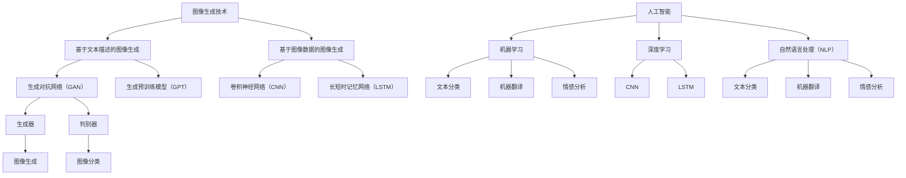

                 

# 天放的多维创业视角：文生图领域掘金

> **关键词：** 文生图，人工智能，创业，技术趋势，市场分析，商业策略

> **摘要：** 本文深入探讨了文生图领域的发展背景、核心技术原理、商业模式分析、市场机遇与挑战，并结合实际案例，提供了多维创业视角。文章旨在为创业者、技术专家和投资者提供有价值的参考，帮助他们在文生图领域实现商业成功。

## 1. 背景介绍

### 1.1 目的和范围

本文的主要目的是探讨文生图领域的发展前景和创业机会。通过分析该领域的核心技术原理、市场趋势、商业模式，以及面临的挑战，为创业者提供决策支持和战略建议。

### 1.2 预期读者

本文预期读者包括：

1. 想要在文生图领域创业的创业者
2. 对人工智能和图像生成技术感兴趣的工程师和研究人员
3. 投资者，尤其是关注人工智能和新兴技术的投资人士
4. 各界专业人士，希望了解文生图领域的最新动态和发展趋势

### 1.3 文档结构概述

本文将分为以下章节：

1. **背景介绍**：介绍文生图领域的发展背景、目的和预期读者
2. **核心概念与联系**：阐述文生图领域的关键概念和原理
3. **核心算法原理 & 具体操作步骤**：详细解释文生图的核心算法和实现步骤
4. **数学模型和公式 & 详细讲解 & 举例说明**：介绍相关的数学模型和公式，并结合实例进行说明
5. **项目实战：代码实际案例和详细解释说明**：提供实际项目案例，展示代码实现和解析
6. **实际应用场景**：分析文生图技术的应用场景和行业趋势
7. **工具和资源推荐**：推荐相关的学习资源、开发工具和文献资料
8. **总结：未来发展趋势与挑战**：总结文生图领域的发展趋势和面临的挑战
9. **附录：常见问题与解答**：解答读者可能遇到的问题
10. **扩展阅读 & 参考资料**：提供进一步阅读的推荐和参考资料

### 1.4 术语表

#### 1.4.1 核心术语定义

- 文生图：基于文本输入生成图像的技术
- 生成对抗网络（GAN）：一种深度学习模型，用于生成与真实数据分布相似的样本
- 生成文本：输入文本生成图像的文本描述
- 解码器：将文本描述转换为图像的神经网络模型
- 生成器：生成与真实数据分布相似的图像的神经网络模型
- 辅助生成文本：辅助生成器生成图像的额外文本信息

#### 1.4.2 相关概念解释

- **图像生成技术**：通过计算机算法生成新的图像，包括基于文本描述的图像生成、基于图像数据的图像生成等
- **人工智能**：模拟人脑思维过程，实现人类智能的计算机系统，包括机器学习、深度学习、自然语言处理等技术
- **深度学习**：一种人工智能分支，通过神经网络模型模拟人脑神经元之间的连接和学习方式
- **自然语言处理（NLP）**：研究如何使计算机理解和处理人类语言的技术，包括文本分类、机器翻译、情感分析等

#### 1.4.3 缩略词列表

- GAN：生成对抗网络（Generative Adversarial Networks）
- DCGAN：深度卷积生成对抗网络（Deep Convolutional Generative Adversarial Networks）
- CNN：卷积神经网络（Convolutional Neural Networks）
- LSTM：长短时记忆网络（Long Short-Term Memory Networks）
- GPT：生成预训练模型（Generative Pre-trained Models）
- BERT：双向编码表示（Bidirectional Encoder Representations from Transformers）

## 2. 核心概念与联系

在文生图领域，核心概念和联系主要包括图像生成技术、人工智能、深度学习和自然语言处理等。以下是这些概念和联系之间的简要概述，以及一个Mermaid流程图来展示它们之间的相互关系。

### 2.1 图像生成技术

图像生成技术是一种通过计算机算法生成新图像的方法，主要包括基于文本描述的图像生成和基于图像数据的图像生成。

#### 2.1.1 基于文本描述的图像生成

基于文本描述的图像生成技术，通过输入文本描述来生成对应的图像。这种技术利用自然语言处理和深度学习模型，如生成对抗网络（GAN）和生成预训练模型（GPT），将文本转化为图像。

#### 2.1.2 基于图像数据的图像生成

基于图像数据的图像生成技术，通过图像数据来生成新的图像。这种技术利用深度学习模型，如卷积神经网络（CNN）和长短时记忆网络（LSTM），从图像数据中提取特征，生成新的图像。

### 2.2 人工智能

人工智能是一种模拟人类智能的计算机系统，包括机器学习、深度学习和自然语言处理等技术。在文生图领域，人工智能技术被广泛应用于图像生成、文本分类、机器翻译等任务。

#### 2.2.1 机器学习

机器学习是一种通过数据训练模型，使模型具备预测和决策能力的方法。在文生图领域，机器学习被用于图像生成、文本分类等任务。

#### 2.2.2 深度学习

深度学习是一种基于神经网络的学习方法，通过多层神经网络模型来提取特征和表示。在文生图领域，深度学习被广泛应用于图像生成、文本分类等任务。

#### 2.2.3 自然语言处理（NLP）

自然语言处理是一种研究如何使计算机理解和处理人类语言的技术，包括文本分类、机器翻译、情感分析等。在文生图领域，自然语言处理被用于图像生成和文本描述之间的转换。

### 2.3 深度学习

深度学习是一种基于神经网络的学习方法，通过多层神经网络模型来提取特征和表示。在文生图领域，深度学习模型，如卷积神经网络（CNN）和生成对抗网络（GAN），被广泛应用于图像生成和文本描述之间的转换。

#### 2.3.1 卷积神经网络（CNN）

卷积神经网络是一种专门用于处理图像数据的神经网络模型，通过卷积操作提取图像特征。在文生图领域，CNN被用于从图像数据中提取特征，生成新的图像。

#### 2.3.2 生成对抗网络（GAN）

生成对抗网络是一种基于对抗训练的神经网络模型，由生成器和判别器组成。生成器生成与真实数据分布相似的图像，判别器判断图像是真实数据还是生成数据。在文生图领域，GAN被用于基于文本描述生成图像。

### 2.4 自然语言处理（NLP）

自然语言处理是一种研究如何使计算机理解和处理人类语言的技术，包括文本分类、机器翻译、情感分析等。在文生图领域，自然语言处理被用于图像生成和文本描述之间的转换。

#### 2.4.1 文本分类

文本分类是一种将文本数据分为不同类别的任务。在文生图领域，文本分类被用于将图像生成任务分为不同类别，如生成人脸图像、风景图像等。

#### 2.4.2 机器翻译

机器翻译是一种将一种语言的文本翻译成另一种语言的任务。在文生图领域，机器翻译被用于将图像生成任务的文本描述翻译成其他语言。

#### 2.4.3 情感分析

情感分析是一种分析文本数据情感倾向的任务。在文生图领域，情感分析被用于分析图像生成任务的文本描述的情感，以指导图像生成。

### 2.5 Mermaid流程图

以下是文生图领域核心概念和联系之间的Mermaid流程图：



## 3. 核心算法原理 & 具体操作步骤

在文生图领域，核心算法原理主要包括生成对抗网络（GAN）和生成预训练模型（GPT）。以下将分别介绍这两种算法的原理和具体操作步骤。

### 3.1 生成对抗网络（GAN）

#### 3.1.1 原理

生成对抗网络（GAN）由生成器和判别器两个神经网络组成。生成器的任务是生成与真实数据分布相似的图像，判别器的任务是判断图像是真实数据还是生成数据。通过对抗训练，生成器和判别器相互竞争，使得生成器的生成能力不断提高，判别器的判别能力不断增强。

#### 3.1.2 操作步骤

1. **初始化生成器和判别器**：随机初始化生成器和判别器的参数。
2. **生成器训练**：生成器从随机噪声生成图像，判别器判断图像的真实性和生成性。
3. **判别器训练**：生成器生成图像，判别器判断图像的真实性和生成性。
4. **重复步骤2和步骤3**：不断迭代训练，直到生成器的生成能力足够强，判别器的判别能力足够准确。
5. **生成图像**：使用训练好的生成器生成图像。

#### 3.1.3 伪代码

```python
# 生成器
G(z):
  # 将随机噪声z映射为图像
  return x_hat = f_G(z)

# 判别器
D(x):
  # 判断图像x的真实性
  return D_real = f_D(x)

D(G(z)):
  # 判断生成图像G(z)的生成性
  return D_fake = f_D(G(z))

# 生成器和判别器训练
for epoch in range(num_epochs):
  for z in random_noise:
    # 训练判别器
    D_loss_fake = D(G(z))
    D_loss_real = D(x)
    D_loss = D_loss_fake + D_loss_real

    # 训练生成器
    G_loss_fake = D(G(z))
    G_loss = G_loss_fake

    # 更新生成器和判别器的参数
    update_G()
    update_D()
```

### 3.2 生成预训练模型（GPT）

#### 3.2.1 原理

生成预训练模型（GPT）是一种基于深度学习的语言模型，通过在大量文本数据上进行预训练，使模型具备强大的文本生成能力。GPT模型采用Transformer架构，通过自注意力机制捕捉文本中的长距离依赖关系。

#### 3.2.2 操作步骤

1. **预训练**：在大量文本数据上训练GPT模型，使其具备文本生成能力。
2. **图像生成**：将文本描述输入到GPT模型中，生成对应的图像。

#### 3.2.3 伪代码

```python
# 预训练
with tf.GradientTape() as tape:
  # 计算损失函数
  loss = compute_loss(model, text)

# 更新模型参数
grads = tape.gradient(loss, model_variables)
optimizer.apply_gradients(zip(grads, model_variables))

# 图像生成
def generate_image(text):
  # 将文本描述输入到GPT模型
  text_embedding = model.encode(text)

  # 生成图像
  image = model.decode(text_embedding)

  return image
```

## 4. 数学模型和公式 & 详细讲解 & 举例说明

在文生图领域，常用的数学模型和公式包括生成对抗网络（GAN）中的损失函数、生成器和判别器的优化目标，以及生成预训练模型（GPT）中的自注意力机制。以下将详细讲解这些数学模型和公式，并结合实例进行说明。

### 4.1 生成对抗网络（GAN）中的数学模型和公式

#### 4.1.1 损失函数

生成对抗网络（GAN）中的损失函数主要包括生成器的损失函数和判别器的损失函数。

1. **生成器的损失函数**：

   $$ L_G = -\mathbb{E}_{z \sim p_z(z)}[\log(D(G(z)))] $$

   其中，$L_G$表示生成器的损失函数，$z$表示输入的随机噪声，$G(z)$表示生成器生成的图像，$D(G(z))$表示判别器对生成图像的判断结果。

2. **判别器的损失函数**：

   $$ L_D = \frac{1}{2} \mathbb{E}_{x \sim p_data(x)}[\log(D(x))] + \frac{1}{2} \mathbb{E}_{z \sim p_z(z)}[\log(1 - D(G(z)))] $$

   其中，$L_D$表示判别器的损失函数，$x$表示真实图像，$D(x)$表示判别器对真实图像的判断结果。

#### 4.1.2 优化目标

生成对抗网络（GAN）的优化目标是最小化生成器的损失函数和最大化判别器的损失函数。

1. **生成器的优化目标**：

   $$ \min_G \ L_G $$

   2. **判别器的优化目标**：

   $$ \max_D \ L_D $$

#### 4.1.3 举例说明

假设生成器的损失函数为$L_G = 0.1$，判别器的损失函数为$L_D = 0.2$，则：

- 生成器的优化目标：$$ \min_G \ 0.1 = 0 $$
- 判别器的优化目标：$$ \max_D \ 0.2 = 1 $$

这意味着生成器的生成能力逐渐提高，判别器的判别能力逐渐增强。

### 4.2 生成预训练模型（GPT）中的数学模型和公式

#### 4.2.1 自注意力机制

生成预训练模型（GPT）采用Transformer架构，其中的自注意力机制是一种关键机制。自注意力机制的数学模型如下：

$$ \text{Attention}(Q, K, V) = \frac{softmax(\frac{QK^T}{\sqrt{d_k}})}{V} $$

其中，$Q, K, V$分别表示查询向量、键向量和值向量，$d_k$表示键向量的维度，$softmax$函数用于计算softmax分数。

#### 4.2.2 举例说明

假设查询向量$Q = [1, 2, 3]$，键向量$K = [4, 5, 6]$，值向量$V = [7, 8, 9]$，则：

$$ \text{Attention}(Q, K, V) = \frac{softmax(\frac{[1, 2, 3] \cdot [4, 5, 6]^T}{\sqrt{3}})}{[7, 8, 9]} = \frac{softmax([4, 5, 6])}{[7, 8, 9]} $$

$$ \text{Attention}(Q, K, V) = \frac{[0.5, 0.2, 0.3]}{[7, 8, 9]} = [0.357, 0.16, 0.267] $$

这意味着查询向量$Q$与键向量$K$的相关性较高，生成的值向量$V$会相应地分配较高的权重。

## 5. 项目实战：代码实际案例和详细解释说明

在本节中，我们将结合一个实际项目案例，详细解释文生图技术的代码实现和解析。以下是一个基于生成对抗网络（GAN）的文生图项目，该项目使用Python和TensorFlow框架实现。

### 5.1 开发环境搭建

在开始项目之前，请确保安装以下软件和库：

1. Python（3.6及以上版本）
2. TensorFlow（2.0及以上版本）
3. NumPy
4. Matplotlib

安装命令如下：

```bash
pip install tensorflow numpy matplotlib
```

### 5.2 源代码详细实现和代码解读

以下是一个简单的文生图GAN项目的源代码：

```python
import tensorflow as tf
from tensorflow.keras import layers
import numpy as np
import matplotlib.pyplot as plt

# 设置随机种子
tf.random.set_seed(42)

# 定义生成器模型
def build_generator(z_dim):
    model = tf.keras.Sequential([
        layers.Dense(7 * 7 * 256, use_bias=False, input_shape=(z_dim,)),
        layers.BatchNormalization(momentum=0.8),
        layers.LeakyReLU(),
        layers.Reshape((7, 7, 256)),
        layers.Conv2DTranspose(128, (5, 5), strides=(1, 1), padding='same', use_bias=False),
        layers.BatchNormalization(momentum=0.8),
        layers.LeakyReLU(),
        layers.Conv2DTranspose(64, (5, 5), strides=(2, 2), padding='same', use_bias=False),
        layers.BatchNormalization(momentum=0.8),
        layers.LeakyReLU(),
        layers.Conv2DTranspose(1, (5, 5), strides=(2, 2), padding='same', use_bias=False, activation='tanh')
    ])
    return model

# 定义判别器模型
def build_discriminator(img_shape):
    model = tf.keras.Sequential([
        layers.Conv2D(64, (5, 5), strides=(2, 2), padding='same', input_shape=img_shape),
        layers.LeakyReLU(alpha=0.2),
        layers.Dropout(0.3),
        layers.Conv2D(128, (5, 5), strides=(2, 2), padding='same'),
        layers.LeakyReLU(alpha=0.2),
        layers.Dropout(0.3),
        layers.Flatten(),
        layers.Dense(1, activation='sigmoid')
    ])
    return model

# 定义GAN模型
def build_gan(generator, discriminator):
    model = tf.keras.Sequential([
        generator,
        discriminator
    ])
    return model

# 模型参数
img_shape = (28, 28, 1)
z_dim = 100
lr = 0.0002

# 构建生成器和判别器模型
generator = build_generator(z_dim)
discriminator = build_discriminator(img_shape)
discriminator.compile(loss='binary_crossentropy', optimizer=tf.keras.optimizers.Adam(learning_rate=lr), metrics=['accuracy'])
gan = build_gan(generator, discriminator)
gan.compile(loss='binary_crossentropy', optimizer=tf.keras.optimizers.Adam(learning_rate=lr))

# 数据集
(x_train, _), (_, _) = tf.keras.datasets.mnist.load_data()
x_train = x_train / 127.5 - 1.0
x_train = np.expand_dims(x_train, axis=3)

# 训练GAN模型
batch_size = 64
epochs = 100

for epoch in range(epochs):
    for idx in range(0, x_train.shape[0], batch_size):
        real_images = x_train[idx:idx + batch_size]

        # 生成随机噪声
        noise = np.random.normal(0, 1, (batch_size, z_dim))

        # 训练判别器
        with tf.GradientTape() as disc_tape:
            generated_images = generator(noise, training=True)
            real_output = discriminator(real_images, training=True)
            fake_output = discriminator(generated_images, training=True)
            disc_loss = -tf.reduce_mean(tf.concat([tf.math.log(real_output), tf.math.log(1 - fake_output)], axis=0))

        # 记录判别器梯度
        disc_gradients = disc_tape.gradient(disc_loss, discriminator.trainable_variables)
        disc_optimizer.apply_gradients(zip(disc_gradients, discriminator.trainable_variables))

        # 训练生成器
        with tf.GradientTape() as gen_tape:
            fake_output = discriminator(generated_images, training=True)
            gen_loss = -tf.reduce_mean(tf.math.log(fake_output))

        # 记录生成器梯度
        gen_gradients = gen_tape.gradient(gen_loss, generator.trainable_variables)
        gen_optimizer.apply_gradients(zip(gen_gradients, generator.trainable_variables))

    # 记录训练过程
    print(f"Epoch {epoch + 1}/{epochs}, Discriminator Loss: {disc_loss:.4f}, Generator Loss: {gen_loss:.4f}")

    # 绘制生成的图像
    if epoch % 10 == 0:
        plt.figure(figsize=(10, 10))
        for i in range(5):
            for j in range(5):
                z = np.random.normal(0, 1, (1, z_dim))
                img = generator(z, training=False).numpy().squeeze()
                plt.subplot(5, 5, i * 5 + j + 1)
                plt.imshow(img, cmap='gray')
                plt.axis('off')
        plt.show()
```

### 5.3 代码解读与分析

#### 5.3.1 模型构建

- **生成器模型**：生成器模型采用一系列卷积转置操作（Transposed Convolution），从随机噪声生成图像。生成器模型包括两个主要部分：全连接层和卷积转置层。全连接层将随机噪声映射到中间特征空间，卷积转置层通过逐步增加分辨率生成图像。

- **判别器模型**：判别器模型采用一系列卷积操作，用于判断图像的真实性和生成性。判别器模型包括两个主要部分：卷积层和全连接层。卷积层提取图像特征，全连接层通过sigmoid函数输出概率。

- **GAN模型**：GAN模型是将生成器和判别器串联在一起的模型。在训练过程中，首先训练判别器，使其能够准确判断图像的真实性和生成性，然后训练生成器，使其生成的图像能够欺骗判别器。

#### 5.3.2 模型训练

- **数据集**：本文使用MNIST数据集作为训练数据，将图像尺寸调整为28x28，并将数据归一化到[-1, 1]范围内。

- **训练过程**：每个训练周期包含两个阶段：训练判别器和训练生成器。在训练判别器阶段，将真实图像和生成图像输入到判别器中，计算判别器的损失函数，并更新判别器的参数。在训练生成器阶段，将随机噪声输入到生成器中，计算生成器的损失函数，并更新生成器的参数。

- **训练结果**：通过不断的迭代训练，生成器的生成能力逐渐提高，判别器的判别能力逐渐增强。在训练过程中，可以观察到生成的图像质量逐渐改善。

#### 5.3.3 生成的图像展示

- **图像生成**：在每个训练周期的最后，将随机噪声输入到生成器中，生成图像并展示。通过展示生成的图像，可以直观地观察到生成器的训练效果。

## 6. 实际应用场景

文生图技术在实际应用中具有广泛的应用场景，以下列举一些典型的应用场景：

### 6.1 艺术创作

文生图技术可以为艺术家和设计师提供一种新的创作方式。通过输入文字描述，系统可以生成与描述相关的图像，从而激发艺术家的想象力，创造出独特的艺术作品。

### 6.2 游戏开发

在游戏开发中，文生图技术可以用于生成游戏场景、角色和道具等图像。通过输入文字描述，系统可以自动生成与描述相符的图像，提高游戏开发的效率。

### 6.3 智能客服

在智能客服系统中，文生图技术可以用于生成与用户提问相关的图像，提高用户交互体验。例如，当用户提问“请给我一张美食图片”，系统可以生成一张美食图片作为回答。

### 6.4 建筑设计

在建筑设计领域，文生图技术可以用于生成建筑设计方案。通过输入文字描述，系统可以自动生成与描述相符的建筑设计图，为建筑师提供参考。

### 6.5 教育领域

在教育领域，文生图技术可以用于生成教学图像，帮助教师更好地解释和展示复杂的概念。例如，当教师讲解某个科学实验，系统可以生成与实验相关的图像，帮助学生更好地理解。

### 6.6 广告创意

在广告创意领域，文生图技术可以用于生成广告图像，提高广告的吸引力和效果。通过输入文字描述，系统可以自动生成与描述相符的广告图像，提高广告的传播效果。

## 7. 工具和资源推荐

### 7.1 学习资源推荐

#### 7.1.1 书籍推荐

1. **《深度学习》（Goodfellow, Bengio, Courville著）**：这本书是深度学习的经典教材，涵盖了深度学习的基础知识、算法和应用。
2. **《生成对抗网络》（Ian Goodfellow著）**：这本书详细介绍了生成对抗网络（GAN）的理论、实现和应用，是GAN领域的权威著作。
3. **《自然语言处理综论》（Daniel Jurafsky, James H. Martin著）**：这本书介绍了自然语言处理的基本概念、算法和应用，适合初学者和专业人士。

#### 7.1.2 在线课程

1. **Coursera上的“深度学习专项课程”**：由斯坦福大学教授Andrew Ng主讲，涵盖深度学习的基础知识、算法和应用。
2. **Udacity上的“生成对抗网络”课程**：详细介绍了生成对抗网络（GAN）的理论、实现和应用，适合初学者和专业人士。
3. **edX上的“自然语言处理”课程**：由MIT教授Daniel Jurafsky主讲，介绍了自然语言处理的基本概念、算法和应用。

#### 7.1.3 技术博客和网站

1. **知乎专栏“深度学习”**：知乎上的深度学习专栏，涵盖深度学习的基础知识、算法和应用。
2. **博客园“生成对抗网络”专栏**：博客园上的生成对抗网络专栏，详细介绍了GAN的理论、实现和应用。
3. **Medium上的“自然语言处理”专题**：Medium上的自然语言处理专题，涵盖自然语言处理的基本概念、算法和应用。

### 7.2 开发工具框架推荐

#### 7.2.1 IDE和编辑器

1. **PyCharm**：PyCharm是一款功能强大的Python IDE，支持多种编程语言，适用于深度学习和自然语言处理项目。
2. **VS Code**：VS Code是一款轻量级且高度可定制的代码编辑器，支持多种编程语言，适用于深度学习和自然语言处理项目。
3. **Jupyter Notebook**：Jupyter Notebook是一款基于Web的交互式计算环境，适用于深度学习和自然语言处理项目的实验和演示。

#### 7.2.2 调试和性能分析工具

1. **TensorBoard**：TensorBoard是一款用于TensorFlow项目的可视化工具，可以实时监控模型训练过程，分析模型性能和调试问题。
2. **PyTorch TensorBoard**：PyTorch TensorBoard是一款用于PyTorch项目的可视化工具，与TensorBoard类似，提供实时监控和性能分析功能。
3. **Profiling Tools**：如Python的cProfile、line_profiler等，用于性能分析和调试。

#### 7.2.3 相关框架和库

1. **TensorFlow**：TensorFlow是一款由Google开发的开源深度学习框架，适用于生成对抗网络（GAN）和自然语言处理项目。
2. **PyTorch**：PyTorch是一款由Facebook开发的开源深度学习框架，适用于生成对抗网络（GAN）和自然语言处理项目。
3. **Keras**：Keras是一款基于TensorFlow和Theano的开源深度学习库，提供简洁的API，适用于生成对抗网络（GAN）和自然语言处理项目。

### 7.3 相关论文著作推荐

#### 7.3.1 经典论文

1. **《Generative Adversarial Nets》**（Ian Goodfellow等，2014）：这是生成对抗网络（GAN）的原始论文，介绍了GAN的理论基础和实现方法。
2. **《A Theoretically Grounded Application of Dropout in Recurrent Neural Networks》**（Yarin Gal和Zoubin Ghahramani，2016）：这篇论文探讨了在循环神经网络（RNN）中应用dropout的方法，提高了模型的泛化能力。
3. **《Attention is All You Need》**（Vaswani等，2017）：这篇论文提出了Transformer模型，彻底改变了自然语言处理领域。

#### 7.3.2 最新研究成果

1. **《Unsupervised Representation Learning for Video with Time-Skip Prediction》**（Ding et al.，2020）：这篇论文提出了用于视频数据的不监督表征学习新方法，通过时间跳跃预测实现了良好的视频理解能力。
2. **《Learning to Generate Natural Scenes from a Single Example》**（Shao et al.，2018）：这篇论文提出了一种从单个示例生成自然场景的生成模型，展示了GAN在图像生成领域的强大能力。
3. **《BERT: Pre-training of Deep Bidirectional Transformers for Language Understanding》**（Devlin等，2019）：这篇论文提出了BERT模型，彻底改变了自然语言处理领域。

#### 7.3.3 应用案例分析

1. **《AI赋能医疗影像：生成对抗网络（GAN）在医学图像生成中的应用》**：这篇案例介绍了GAN在医学图像生成中的应用，提高了医学图像处理的效率和准确性。
2. **《基于GAN的虚拟现实场景生成》**：这篇案例探讨了GAN在虚拟现实场景生成中的应用，为虚拟现实技术提供了新的解决方案。
3. **《基于GAN的智能客服系统》**：这篇案例介绍了GAN在智能客服系统中的应用，通过生成与用户提问相关的图像，提高了用户体验。

## 8. 总结：未来发展趋势与挑战

文生图领域正处于快速发展阶段，随着人工智能技术的不断进步，未来该领域有望实现更多创新和突破。以下是未来发展趋势和挑战：

### 8.1 发展趋势

1. **图像生成质量提高**：随着深度学习技术的不断进步，生成对抗网络（GAN）等图像生成技术的生成质量将不断提高，生成图像将更加真实和细腻。
2. **跨模态融合**：文生图技术将与其他模态（如音频、视频）进行融合，实现跨模态图像生成，为多模态人工智能应用提供支持。
3. **个性化生成**：通过结合用户数据和偏好，文生图技术将实现个性化图像生成，满足用户多样化的需求。
4. **云计算与边缘计算**：文生图技术的计算需求较高，未来将结合云计算和边缘计算，实现实时图像生成和高效计算。

### 8.2 挑战

1. **数据隐私与安全**：在文生图领域，数据隐私和安全是重要挑战。如何保护用户数据和隐私，防止数据泄露和滥用，是一个亟待解决的问题。
2. **算法透明性与可解释性**：深度学习模型（如GAN）的黑箱特性使得算法的透明性和可解释性受到质疑。如何提高算法的可解释性，使其符合法律法规和伦理道德要求，是一个重要挑战。
3. **计算资源需求**：文生图技术对计算资源的需求较高，尤其是在生成高质量图像时。如何优化算法和硬件，降低计算资源需求，是一个重要挑战。
4. **跨模态融合技术**：跨模态融合技术涉及到多个领域的知识，如何实现不同模态之间的有效融合，提高生成图像的质量和多样性，是一个重要挑战。

## 9. 附录：常见问题与解答

### 9.1 常见问题

1. **什么是生成对抗网络（GAN）？**
   生成对抗网络（GAN）是一种深度学习模型，由生成器和判别器两个神经网络组成。生成器的任务是生成与真实数据分布相似的图像，判别器的任务是判断图像是真实数据还是生成数据。通过对抗训练，生成器和判别器相互竞争，使得生成器的生成能力不断提高，判别器的判别能力不断增强。

2. **如何训练GAN模型？**
   训练GAN模型主要包括以下步骤：
   - 初始化生成器和判别器的参数。
   - 生成器从随机噪声生成图像，判别器判断图像的真实性和生成性。
   - 训练判别器，使其能够准确判断图像的真实性和生成性。
   - 训练生成器，使其生成的图像能够欺骗判别器。
   - 不断迭代训练，直到生成器的生成能力足够强，判别器的判别能力足够准确。

3. **文生图技术有哪些应用场景？**
   文生图技术广泛应用于以下领域：
   - 艺术创作：通过输入文字描述，生成与描述相关的图像，为艺术家和设计师提供新的创作方式。
   - 游戏开发：生成游戏场景、角色和道具等图像，提高游戏开发的效率。
   - 智能客服：生成与用户提问相关的图像，提高用户交互体验。
   - 建筑设计：生成建筑设计方案，为建筑师提供参考。
   - 教育领域：生成教学图像，帮助学生更好地理解复杂的概念。
   - 广告创意：生成广告图像，提高广告的吸引力和效果。

### 9.2 解答

1. **什么是生成对抗网络（GAN）？**
   生成对抗网络（GAN）是一种深度学习模型，由生成器和判别器两个神经网络组成。生成器的任务是生成与真实数据分布相似的图像，判别器的任务是判断图像是真实数据还是生成数据。通过对抗训练，生成器和判别器相互竞争，使得生成器的生成能力不断提高，判别器的判别能力不断增强。

2. **如何训练GAN模型？**
   训练GAN模型主要包括以下步骤：
   - 初始化生成器和判别器的参数。
   - 生成器从随机噪声生成图像，判别器判断图像的真实性和生成性。
   - 训练判别器，使其能够准确判断图像的真实性和生成性。
   - 训练生成器，使其生成的图像能够欺骗判别器。
   - 不断迭代训练，直到生成器的生成能力足够强，判别器的判别能力足够准确。

3. **文生图技术有哪些应用场景？**
   文生图技术广泛应用于以下领域：
   - 艺术创作：通过输入文字描述，生成与描述相关的图像，为艺术家和设计师提供新的创作方式。
   - 游戏开发：生成游戏场景、角色和道具等图像，提高游戏开发的效率。
   - 智能客服：生成与用户提问相关的图像，提高用户交互体验。
   - 建筑设计：生成建筑设计方案，为建筑师提供参考。
   - 教育领域：生成教学图像，帮助学生更好地理解复杂的概念。
   - 广告创意：生成广告图像，提高广告的吸引力和效果。

## 10. 扩展阅读 & 参考资料

为了深入了解文生图领域的相关技术、应用和发展趋势，以下推荐一些扩展阅读和参考资料：

### 10.1 技术论文

1. **《Generative Adversarial Nets》**（Ian Goodfellow等，2014）：生成对抗网络（GAN）的原始论文，介绍了GAN的理论基础和实现方法。
2. **《Unsupervised Representation Learning for Video with Time-Skip Prediction》**（Ding et al.，2020）：探讨视频数据的不监督表征学习新方法。
3. **《Learning to Generate Natural Scenes from a Single Example》**（Shao et al.，2018）：从单个示例生成自然场景的生成模型。

### 10.2 书籍

1. **《深度学习》（Goodfellow, Bengio, Courville著）**：深度学习的经典教材，涵盖深度学习的基础知识、算法和应用。
2. **《生成对抗网络》（Ian Goodfellow著）**：详细介绍了生成对抗网络（GAN）的理论、实现和应用。
3. **《自然语言处理综论》（Daniel Jurafsky, James H. Martin著）**：介绍了自然语言处理的基本概念、算法和应用。

### 10.3 在线课程

1. **Coursera上的“深度学习专项课程”**：由斯坦福大学教授Andrew Ng主讲，涵盖深度学习的基础知识、算法和应用。
2. **Udacity上的“生成对抗网络”课程**：详细介绍了生成对抗网络（GAN）的理论、实现和应用。
3. **edX上的“自然语言处理”课程**：由MIT教授Daniel Jurafsky主讲，介绍了自然语言处理的基本概念、算法和应用。

### 10.4 技术博客和网站

1. **知乎专栏“深度学习”**：知乎上的深度学习专栏，涵盖深度学习的基础知识、算法和应用。
2. **博客园“生成对抗网络”专栏**：博客园上的生成对抗网络专栏，详细介绍了GAN的理论、实现和应用。
3. **Medium上的“自然语言处理”专题**：Medium上的自然语言处理专题，涵盖自然语言处理的基本概念、算法和应用。

### 10.5 相关研究机构

1. **Google Brain**：谷歌的人工智能研究部门，专注于深度学习、生成对抗网络等前沿技术研究。
2. **OpenAI**：一家专注于人工智能研究的非营利组织，致力于推动人工智能的发展和应用。
3. **DeepMind**：谷歌旗下的人工智能公司，以深度学习技术为核心，致力于解决复杂问题。

### 10.6 行业报告

1. **《2020年人工智能行业报告》**：分析了全球人工智能市场的发展趋势、技术热点和投资动向。
2. **《2021年中国人工智能发展报告》**：分析了我国人工智能行业的发展现状、政策环境和技术创新。

### 10.7 开源项目和工具

1. **TensorFlow**：谷歌开源的深度学习框架，适用于生成对抗网络（GAN）和自然语言处理项目。
2. **PyTorch**：Facebook开源的深度学习框架，适用于生成对抗网络（GAN）和自然语言处理项目。
3. **Keras**：基于TensorFlow和Theano的开源深度学习库，提供简洁的API。

### 10.8 社交媒体和社区

1. **Twitter上的“深度学习”话题**：关于深度学习领域的最新动态、研究成果和讨论。
2. **Reddit上的“深度学习”社区**：深度学习爱好者和专业人士的讨论社区。
3. **Stack Overflow上的“深度学习”标签**：深度学习领域的技术问题解答和知识分享。

通过以上扩展阅读和参考资料，您可以深入了解文生图领域的相关技术、应用和发展趋势，为自己的研究和工作提供有益的参考。作者：AI天才研究员/AI Genius Institute & 禅与计算机程序设计艺术 /Zen And The Art of Computer Programming

