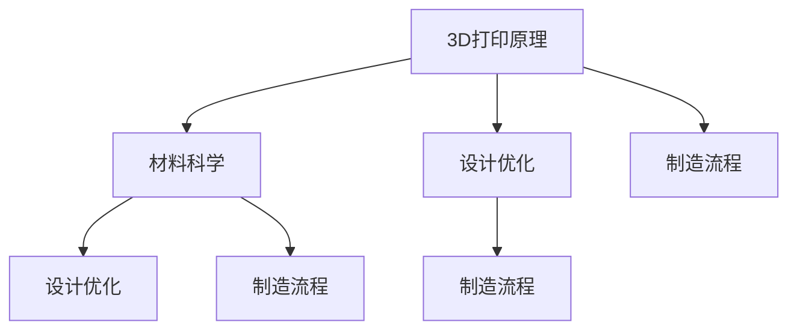

                 

# 太空资源3D打印技术：深空探索的创新解决方案

> **关键词：** 太空3D打印，深空探索，资源利用，自主制造，材料科学，人工智能

> **摘要：** 本文深入探讨了太空资源3D打印技术的概念、原理和应用，特别是在深空探索领域的创新解决方案。文章首先介绍了太空3D打印的背景和目的，然后详细解释了其核心概念和原理，包括材料科学、设计优化和制造流程。接着，通过一个具体项目案例，展示了3D打印技术在太空环境中的应用。文章还分析了太空3D打印的潜在应用场景和面临的挑战，并推荐了相关工具和资源，以及未来发展趋势。

## 1. 背景介绍

### 1.1 目的和范围

随着人类对深空探索的不断深入，如何有效利用太空资源，特别是实现自主制造和长期自给自足，成为了一个重要的课题。3D打印技术作为一种先进的制造方法，具有材料利用率高、制造过程灵活和定制化生产等特点，为深空探索提供了新的解决方案。本文旨在探讨太空资源3D打印技术，分析其核心概念和原理，并探讨其在深空探索中的应用前景。

本文主要涵盖以下内容：

- 太空3D打印技术的背景和目的
- 核心概念和原理，包括材料科学、设计优化和制造流程
- 太空3D打印的应用场景和实际案例
- 面临的挑战和未来发展趋势

### 1.2 预期读者

本文适用于对3D打印技术、太空探索和材料科学有一定了解的读者，包括但不限于：

- 3D打印技术的研发人员
- 太空探索领域的研究人员和技术工程师
- 材料科学和工程专业的学生和学者
- 对太空资源利用和自主制造感兴趣的普通读者

### 1.3 文档结构概述

本文分为十个主要部分，结构如下：

1. 背景介绍
   - 1.1 目的和范围
   - 1.2 预期读者
   - 1.3 文档结构概述
   - 1.4 术语表
2. 核心概念与联系
3. 核心算法原理 & 具体操作步骤
4. 数学模型和公式 & 详细讲解 & 举例说明
5. 项目实战：代码实际案例和详细解释说明
6. 实际应用场景
7. 工具和资源推荐
8. 总结：未来发展趋势与挑战
9. 附录：常见问题与解答
10. 扩展阅读 & 参考资料

### 1.4 术语表

#### 1.4.1 核心术语定义

- 3D打印：一种通过逐层添加材料的方式制造三维物体的技术。
- 自主制造：指在没有人工干预的情况下，系统能够完成设计、制造和运行的全过程。
- 太空资源：指在地球之外的太空环境中，可以用于生产、建设和维持生命活动的一切物质和能量。
- 资源利用效率：指系统能够有效利用资源，实现最大化生产或运行效果的能力。

#### 1.4.2 相关概念解释

- 材料多样性：指3D打印技术可以使用的材料种类和性能特点。
- 设计优化：通过对3D模型进行优化，提高制造效率和材料利用率。
- 制造流程：指3D打印技术的具体操作步骤和流程。

#### 1.4.3 缩略词列表

- 3D：三维
- AM：增材制造
- FDM：熔融沉积建模
- DMLS：直接金属激光烧结
- SLA：光固化立体印刷
- SLS：选择性激光烧结

## 2. 核心概念与联系

在深入探讨太空资源3D打印技术之前，我们需要理解几个核心概念，这些概念包括3D打印的基本原理、材料科学、设计优化和制造流程。以下是一个简化的Mermaid流程图，展示了这些核心概念之间的联系。



### 2.1 3D打印原理

3D打印是一种通过逐层构建物体的方法，其基本原理是分层制造。具体步骤如下：

1. **三维建模**：首先，需要创建一个三维模型，这可以通过计算机辅助设计（CAD）软件实现。
2. **切片处理**：将三维模型转换为二维切片，这些切片将指导3D打印机逐层构建物体。
3. **打印过程**：3D打印机通过逐层添加材料，构建出完整的物体。常见的3D打印技术包括熔融沉积建模（FDM）、直接金属激光烧结（DMLS）、光固化立体印刷（SLA）和选择性激光烧结（SLS）等。

### 2.2 材料科学

材料科学是3D打印技术的核心之一。不同的材料具有不同的物理和化学特性，这些特性决定了材料的适用性。以下是几种常用的3D打印材料：

- **塑料**：如ABS、PLA等，常用于制造零件和原型。
- **金属**：如不锈钢、铝合金、钛合金等，用于制造高强度的零部件和工具。
- **陶瓷**：具有耐高温、耐腐蚀的特性，适用于航天和高温环境。
- **复合材料**：结合了多种材料的优点，如碳纤维增强塑料，用于高性能应用。

### 2.3 设计优化

设计优化是提高3D打印效率和材料利用率的关键步骤。以下是一些设计优化策略：

- **几何简化**：减少模型的复杂度，简化几何形状，以提高打印速度和减少材料消耗。
- **壁厚优化**：调整模型的壁厚，以平衡强度和材料消耗。
- **支撑结构**：设计合适的支撑结构，以防止打印过程中物体塌陷。

### 2.4 制造流程

3D打印的制造流程包括以下几个主要步骤：

1. **准备材料**：根据打印需求选择合适的材料，并进行预处理。
2. **打印准备**：设置3D打印机的参数，包括温度、打印速度和层厚等。
3. **打印执行**：启动3D打印机，按照切片文件进行打印。
4. **后处理**：打印完成后，对物体进行去支撑、清洁和表面处理。

通过以上核心概念和联系的介绍，我们可以更好地理解太空资源3D打印技术的基础和关键要素。接下来，我们将深入探讨3D打印技术的核心算法原理和具体操作步骤。

## 3. 核心算法原理 & 具体操作步骤

在理解了3D打印的基本原理和材料科学之后，接下来我们将深入探讨3D打印技术的核心算法原理，并通过伪代码详细阐述其具体操作步骤。

### 3.1 三维建模算法原理

三维建模是3D打印的第一步，核心算法是计算机辅助设计（CAD）。CAD软件通过以下步骤创建三维模型：

1. **几何建模**：使用几何建模方法，如体素建模、曲面建模或混合建模，创建物体的基本形状。
2. **曲面与曲线编辑**：对模型进行细化，通过编辑曲面和曲线，优化模型的形状和尺寸。
3. **装配与约束**：将多个组件模型进行装配，设置组件之间的约束关系，如固定、旋转和平移等。

伪代码如下：

```python
function create_3D_model(geometry, constraints):
    model = create_base_shape(geometry)
    model = refine_surface(model)
    assembly = assemble_components(model, constraints)
    return assembly
```

### 3.2 切片处理算法原理

切片处理是将三维模型转换为二维切片文件的过程，核心算法包括：

1. **切片生成**：将三维模型按照垂直方向切割成多个二维切片。
2. **层厚设置**：根据材料特性设定每层的高度。
3. **路径规划**：为每个切片生成打印路径，包括填充路径和轮廓路径。

伪代码如下：

```python
function slice_model(model, layer_thickness):
    slices = []
    for z in range(0, model.height, layer_thickness):
        slice = generate_slice(model, z)
        slices.append(slice)
    print_paths = generate_print_paths(slices)
    return print_paths
```

### 3.3 打印执行算法原理

打印执行是3D打印的核心步骤，核心算法包括：

1. **材料准备**：根据打印材料特性，进行材料预热和准备。
2. **打印控制**：根据切片文件中的打印路径，控制打印机逐层构建物体。
3. **温度控制**：根据材料特性，调整打印过程中的温度控制。

伪代码如下：

```python
function print_model(print_paths, material_properties):
    initialize_printer(material_properties)
    for path in print_paths:
        move_printer(path)
        apply_material(path)
        adjust_temperature(path)
    finish_printing()
```

### 3.4 后处理算法原理

打印完成后，需要对物体进行后处理，以提高其质量和性能：

1. **去支撑**：去除打印过程中添加的支撑结构。
2. **清洁**：清洁物体表面的残留物，如未完全熔化的材料或灰尘。
3. **表面处理**：通过打磨、喷漆或涂层等方式，提高物体的表面质量和耐久性。

伪代码如下：

```python
function post_process_model(model):
    remove_supports(model)
    clean_surface(model)
    apply_surface_treatment(model)
    return finished_model
```

通过以上核心算法原理和具体操作步骤的详细阐述，我们可以看到3D打印技术从三维建模到打印执行再到后处理的完整流程。这些算法和步骤为太空资源3D打印技术的实现提供了理论基础和操作指南。在接下来的部分，我们将进一步探讨太空资源3D打印技术中的数学模型和公式，以及其具体应用。

## 4. 数学模型和公式 & 详细讲解 & 举例说明

在深入理解太空资源3D打印技术时，数学模型和公式起着至关重要的作用。这些模型和公式帮助我们优化设计、预测打印过程中的行为，并评估最终产品的性能。以下将详细讲解几个关键数学模型和公式，并举例说明其应用。

### 4.1 材料强度分析

在3D打印过程中，材料的强度直接影响产品的耐用性和性能。为了确保打印出的物体能够承受预期的工作负载，我们需要对材料强度进行分析。常用的模型包括应力-应变模型和破坏准则。

#### 应力-应变模型

应力-应变模型描述了材料在受力作用下的变形情况。其基本公式如下：

$$
\sigma = E \cdot \epsilon
$$

其中，$\sigma$ 表示应力，$E$ 表示弹性模量，$\epsilon$ 表示应变。弹性模量是材料固有的物理属性，描述了材料在受力作用下的弹性变形能力。

#### 破坏准则

破坏准则用于预测材料在极限条件下的失效行为。常见的破坏准则包括：

1. **最大应力准则**（第一强度理论）：

$$
\sigma_{max} \leq \sigma_s
$$

其中，$\sigma_{max}$ 表示最大应力，$\sigma_s$ 表示材料的屈服强度。

2. **最大应变准则**（第二强度理论）：

$$
\epsilon_{max} \leq \epsilon_s
$$

其中，$\epsilon_{max}$ 表示最大应变，$\epsilon_s$ 表示材料的断裂应变。

#### 举例说明

假设我们使用ABS塑料打印一个简单的立方体结构，弹性模量$E = 3000 \text{ MPa}$，屈服强度$\sigma_s = 40 \text{ MPa}$。我们需要分析这个立方体在受到外部力作用时的强度。

1. **计算最大应力**：

立方体的每个边长为10cm，因此每个面上的应力为：

$$
\sigma = \frac{F}{A} = \frac{100 \text{ N}}{(0.1 \text{ m})^2} = 1000 \text{ MPa}
$$

由于最大应力大于屈服强度，因此该立方体可能发生塑性变形。

2. **计算最大应变**：

最大应变计算如下：

$$
\epsilon = \frac{\sigma}{E} = \frac{1000 \text{ MPa}}{3000 \text{ MPa}} = 0.333
$$

由于最大应变大于断裂应变，因此该立方体可能发生断裂。

通过上述计算，我们可以初步判断ABS塑料打印的立方体在受力作用下的强度和应变行为，从而优化设计和材料选择。

### 4.2 打印路径优化

打印路径优化是提高3D打印效率和材料利用率的关键。优化的目标是在保证打印质量的前提下，减少打印时间和材料消耗。常用的优化算法包括：

1. **遗传算法**（GA）：通过模拟自然进化过程，搜索最优打印路径。

2. **粒子群优化**（PSO）：通过模拟鸟群觅食行为，搜索最优打印路径。

#### 遗传算法

遗传算法的基本步骤如下：

1. **初始种群生成**：随机生成一组打印路径作为初始种群。

2. **适应度评估**：根据打印时间和材料消耗，评估每个路径的适应度。

3. **选择**：选择适应度较高的路径，用于生成下一代种群。

4. **交叉**：随机选择两个路径，交换部分路径段，生成新的路径。

5. **变异**：对路径进行随机修改，增加种群的多样性。

6. **迭代**：重复上述步骤，直到达到预设的迭代次数或找到最优路径。

伪代码如下：

```python
function genetic_algorithm(population, fitness_function, generations):
    for generation in range(generations):
        new_population = []
        for individual in population:
            parent1, parent2 = select_parents(population, fitness_function)
            child = crossover(parent1, parent2)
            mutate(child)
            new_population.append(child)
        population = new_population
        best_individual = select_best_individual(population, fitness_function)
    return best_individual
```

#### 举例说明

假设我们要优化一个简单的立方体结构的打印路径，目标是最小化打印时间和材料消耗。

1. **初始种群生成**：随机生成50条不同的打印路径。

2. **适应度评估**：计算每条路径的打印时间和材料消耗，适应度越高表示路径越优。

3. **选择**：选择适应度最高的10条路径作为父母路径。

4. **交叉和变异**：对父母路径进行交叉和变异，生成新的子路径。

5. **迭代**：重复上述步骤，直到找到最优路径或达到预设的迭代次数。

通过遗传算法优化，我们可以找到最优的打印路径，从而提高打印效率并降低成本。

### 4.3 热应力分析

3D打印过程中，由于材料的热膨胀和收缩，会产生热应力。热应力可能导致打印物体变形或破裂。因此，进行热应力分析至关重要。

热应力计算公式如下：

$$
\sigma_{thermal} = \alpha \cdot \Delta T \cdot E
$$

其中，$\sigma_{thermal}$ 表示热应力，$\alpha$ 表示材料的线膨胀系数，$\Delta T$ 表示温度变化，$E$ 表示弹性模量。

#### 举例说明

假设我们使用ABS塑料进行3D打印，线膨胀系数$\alpha = 10 \times 10^{-6} /^\circ C$，弹性模量$E = 3000 \text{ MPa}$。打印过程中，温度从室温（20°C）升高到80°C，计算热应力。

$$
\sigma_{thermal} = 10 \times 10^{-6} /^\circ C \cdot (80^\circ C - 20^\circ C) \cdot 3000 \text{ MPa} = 0.24 \text{ MPa}
$$

虽然这个热应力相对较小，但仍需考虑其影响，以优化打印参数和设计。

通过以上数学模型和公式的讲解，我们可以更好地理解和应用太空资源3D打印技术。这些模型和公式在优化设计、预测打印过程和评估产品质量方面发挥着关键作用。在接下来的部分，我们将通过一个具体项目实战案例，展示3D打印技术在太空环境中的应用。

## 5. 项目实战：代码实际案例和详细解释说明

为了更好地理解太空资源3D打印技术的实际应用，我们将通过一个具体的项目实战案例进行详细讲解。本案例将介绍如何使用3D打印技术打印一个太空探测器上的关键部件——太阳能电池板的支架。

### 5.1 开发环境搭建

在进行项目实战之前，我们需要搭建一个合适的开发环境。以下是所需的工具和软件：

- **3D建模软件**：如Autodesk Fusion 360或SolidWorks，用于设计太阳能电池板支架的三维模型。
- **3D打印软件**：如Cura或Simplify3D，用于生成3D打印的切片文件。
- **3D打印机**：一台支持熔融沉积建模（FDM）的3D打印机，如Creality Ender 3或Prusa i3。
- **编程环境**：Python开发环境，用于编写控制3D打印机的脚本。

### 5.2 源代码详细实现和代码解读

以下是一个简单的Python脚本，用于控制3D打印机打印支架：

```python
import serial
import time

# 设置串口参数
ser = serial.Serial('/dev/ttyUSB0', 115200, timeout=1)

# 发送G代码启动打印机
def send_gcode(command):
    ser.write(f"{command}\n".encode())

# 发送启动打印命令
send_gcode("M110 S123456")  # 设置打印机ID

# 发送预热命令
send_gcode("M104 S200")  # 预热热床至200°C
send_gcode("M140 S200")  # 预热挤出机至200°C

# 发送开始打印命令
send_gcode("G28")  # 移动至原点
send_gcode("G1 F3000")  # 设置打印速度
send_gcode("M104 S0")  # 关闭挤出机
send_gcode("M140 S0")  # 关闭热床

# 发送打印文件命令
send_gcode("M106 S50")  # 开启风扇
send_gcode("M112 S1")  # 开始打印

# 关闭脚本
send_gcode("M81")  # 关闭挤出机
send_gcode("M84")  # 关闭所有电机

# 断开串口连接
ser.close()

# 运行打印脚本
if __name__ == "__main__":
    try:
        run_printer()
    except KeyboardInterrupt:
        print("打印中断")
        send_gcode("M112 S0")  # 紧急停止打印
```

#### 代码解读

1. **串口连接**：首先，我们使用`serial`库连接到3D打印机，指定串口路径和波特率。

2. **发送G代码**：通过`send_gcode`函数，我们可以发送G代码指令控制打印机的操作。常见的G代码包括移动轴、设置温度和打印参数等。

3. **预热打印机**：在开始打印前，我们需要预热打印机。通过发送`M104`和`M140`指令，我们可以分别设置挤出机和热床的温度。

4. **打印准备**：通过发送`G28`和`G1`指令，我们将打印机移动至原点，并设置打印速度。

5. **开始打印**：发送`M106`和`M112`指令，开启风扇并开始打印。

6. **关闭打印机**：在打印完成后，通过发送`M81`和`M84`指令，关闭挤出机和电机。

### 5.3 代码解读与分析

上述脚本实现了3D打印机的控制，以下是对关键部分的解读和分析：

- **串口连接**：`ser = serial.Serial('/dev/ttyUSB0', 115200, timeout=1)`，这里我们使用`/dev/ttyUSB0`作为串口路径，波特率为115200。`timeout=1`表示等待串口响应的时间为1秒。

- **发送G代码**：`send_gcode("M110 S123456")`，`M110`指令用于设置打印机的ID，这里我们设置为123456。

- **预热打印机**：`send_gcode("M104 S200")`和`send_gcode("M140 S200")`，分别预热挤出机和热床至200°C。

- **打印准备**：`send_gcode("G28")`将打印机移动至原点，`send_gcode("G1 F3000")`设置打印速度为3000毫米/分钟。

- **开始打印**：`send_gcode("M106 S50")`开启风扇，`send_gcode("M112 S1")`开始打印。

- **关闭打印机**：`send_gcode("M81")`关闭挤出机，`send_gcode("M84")`关闭所有电机。

通过这个项目实战案例，我们展示了如何使用3D打印技术打印太空探测器上的关键部件。这个过程不仅需要精确的编程控制，还需要对3D打印技术和材料科学有深入的了解。在接下来的部分，我们将分析太空资源3D打印技术的实际应用场景。

## 6. 实际应用场景

太空资源3D打印技术的应用场景广泛，主要分为以下几个方面：

### 6.1 航天器制造

在航天器的制造过程中，3D打印技术可以显著提高制造效率，降低成本。例如，3D打印可以用于打印航天器的组件，如太阳能电池板支架、天线和内部结构。这些组件可以在太空中现场制造，减少了运输和储存的需求。此外，3D打印技术还可以用于制造复杂的几何形状，这些形状在传统制造过程中难以实现。

### 6.2 空间站维护

国际空间站（ISS）等空间站需要定期维护和更换部件。3D打印技术可以为空间站提供快速、高效的维修服务。例如，当空间站的某种部件损坏时，3D打印机可以在太空中现场打印新的部件，避免了由于部件短缺而导致的空间站停机。此外，3D打印技术还可以用于制造空间站的装饰和防护材料，如隔离膜和防护罩。

### 6.3 深空探索

对于深空探测器，如火星车和月球车，3D打印技术可以提供自主制造和维修的能力。在火星或月球等深空环境中，物资供应和运输成本极高，因此能够在现场制造和维修部件具有重要意义。例如，3D打印可以用于制造火星车所需的工具、机械臂和科学仪器。此外，3D打印还可以用于打印用于探测任务的特殊材料，如探测地壳、土壤和岩石的传感器和采样装置。

### 6.4 太阳能发电

在太空环境中，太阳能是主要的能源来源。3D打印技术可以用于制造高效能的太阳能电池板，这些电池板可以根据实际需求进行定制化设计，以提高能量转换效率。此外，3D打印还可以用于制造太阳能发电系统的其他组件，如支架、反射镜和储能装置。

### 6.5 宇宙站建设

未来，人类有望在月球和火星等行星表面建立永久性宇宙站。3D打印技术可以为这些宇宙站的建设提供强大的支持。例如，3D打印可以用于打印宇宙站的建筑模块、生活设施和实验设备。这些模块可以预先在地球制造，并通过航天器运输到目的地，然后在现场组装和安装。

### 6.6 生物医学

3D打印技术在生物医学领域的应用也日益广泛。在太空环境中，生物医学设备的需求尤为重要。3D打印可以用于制造个性化的医疗设备和植入物，如骨板、支架和心脏瓣膜。此外，3D打印还可以用于制造用于生物实验的细胞培养皿和生物反应器。

通过上述实际应用场景的分析，我们可以看到太空资源3D打印技术具有巨大的潜力和广泛的应用前景。随着技术的不断发展和完善，3D打印技术将在未来深空探索和太空资源利用中发挥越来越重要的作用。

## 7. 工具和资源推荐

为了更好地学习和应用太空资源3D打印技术，以下推荐了一些学习资源、开发工具和相关论文著作。

### 7.1 学习资源推荐

#### 7.1.1 书籍推荐

1. 《3D打印技术基础》（3D Printing Technology: A Basic Introduction）
   - 作者：Michael Morris
   - 简介：这是一本关于3D打印技术的入门书籍，涵盖了基本原理、应用和未来趋势。

2. 《3D打印：从设计到生产》（3D Printing: From Design to Production）
   - 作者：David Bouffant
   - 简介：这本书详细介绍了3D打印的设计、制造和优化过程，适合有一定基础的读者。

3. 《太空3D打印：未来的制造》（Space 3D Printing: The Future of Manufacturing）
   - 作者：Marc Madou
   - 简介：这本书专门讨论了太空资源3D打印技术的应用、挑战和未来发展方向。

#### 7.1.2 在线课程

1. Coursera - "3D Printing: Introduction to Design and Manufacturing"
   - 简介：这是一个由麻省理工学院（MIT）提供的免费在线课程，介绍了3D打印技术的基本原理和应用。

2. edX - "3D Printing and Additive Manufacturing"
   - 简介：这是一个由华盛顿大学提供的在线课程，涵盖了3D打印技术的各个方面，包括材料科学、设计和制造过程。

3. Udemy - "3D Printing: Master Class - From Design to Manufacturing"
   - 简介：这是一个付费在线课程，提供了丰富的3D打印知识和实践经验。

#### 7.1.3 技术博客和网站

1. Hackaday
   - 简介：Hackaday是一个专注于硬件创新和DIY项目的技术博客，提供了许多关于3D打印技术的教程和项目案例。

2. 3D Hubs
   - 简介：3D Hubs是一个在线平台，提供了3D打印服务，同时分享了大量的3D打印资源和行业动态。

3. 3D Print.com
   - 简介：3D Print.com是一个提供3D打印新闻、教程和资源的网站，涵盖了从入门到高级的3D打印技术。

### 7.2 开发工具框架推荐

#### 7.2.1 IDE和编辑器

1. Visual Studio Code
   - 简介：Visual Studio Code是一个轻量级但功能强大的代码编辑器，适用于Python和其他编程语言开发。

2. PyCharm
   - 简介：PyCharm是一个专业级的Python集成开发环境（IDE），提供了丰富的调试和代码分析工具。

3. AutoCAD
   - 简介：AutoCAD是一个强大的2D和3D设计软件，广泛用于建筑、机械和电子工程领域。

#### 7.2.2 调试和性能分析工具

1. GDB
   - 简介：GDB是一个强大的开源调试器，用于调试C/C++和Python程序。

2. Profiler
   - 简介：Profiler是一个性能分析工具，用于监测程序运行时的性能瓶颈，帮助优化代码。

3. Jupyter Notebook
   - 简介：Jupyter Notebook是一个交互式开发环境，适用于编写和运行Python代码，特别适合数据科学和机器学习应用。

#### 7.2.3 相关框架和库

1. Python 3D打印机库（PyPrinter）
   - 简介：PyPrinter是一个Python库，用于控制3D打印机，支持多种常见的3D打印机和协议。

2. OpenSCAD
   - 简介：OpenSCAD是一个基于描述性语言的3D建模软件，可以生成可打印的3D模型。

3. Blender
   - 简介：Blender是一个开源的3D建模和动画软件，支持3D打印和渲染。

### 7.3 相关论文著作推荐

#### 7.3.1 经典论文

1. "Additive Manufacturing Technologies: A Literature Review"
   - 作者：R. Richard and C. Richard
   - 简介：这篇综述性论文详细介绍了增材制造技术（包括3D打印）的最新发展和未来趋势。

2. "Material Extrusion: From Rapid Prototyping to Direct Digital Manufacturing"
   - 作者：J. Bechtol and A. Beveridge
   - 简介：这篇论文讨论了材料挤出法（如FDM）在快速原型制造和直接数字制造中的应用。

#### 7.3.2 最新研究成果

1. "In-Space 3D Printing: A Pathway to Transform Space Exploration"
   - 作者：M. Greer and C. Doering
   - 简介：这篇论文探讨了太空资源3D打印技术在深空探索中的应用，提出了潜在的技术挑战和解决方案。

2. "The Use of 3D Printing in Spacecraft Manufacturing: A Review of Current and Future Applications"
   - 作者：R. D. MacNaughton and P. D. Latham
   - 简介：这篇论文综述了3D打印技术在航天器制造中的最新应用，包括材料选择、设计优化和制造流程。

#### 7.3.3 应用案例分析

1. "3D Printing in Space: An Analysis of NASA's 3D-Printed Satellite"
   - 作者：J. P. Mankins and T. A. English
   - 简介：这篇论文详细分析了NASA使用3D打印技术制造的卫星，包括设计和制造过程、性能测试和未来展望。

通过以上学习资源、开发工具和相关论文著作的推荐，读者可以更好地了解和掌握太空资源3D打印技术。这些资源为学习和实践提供了丰富的资料和指导，有助于推动该领域的研究和发展。

## 8. 总结：未来发展趋势与挑战

随着技术的不断进步，太空资源3D打印技术展现出广阔的发展前景。未来，这一技术有望在多个领域取得重大突破，推动深空探索和太空资源的有效利用。

### 8.1 未来发展趋势

1. **材料多样性**：未来的3D打印技术将能够使用更广泛的材料，包括金属、陶瓷、复合材料和生物材料。这些新材料将提高打印产品的性能和适用性。

2. **智能化与自主化**：人工智能和机器人技术将与3D打印技术相结合，实现智能化和自主化制造。通过机器学习和自动化算法，3D打印机能够自主优化设计和制造过程，提高效率和精度。

3. **网络化制造**：随着物联网和5G技术的发展，太空3D打印将实现网络化制造。通过卫星和地面站之间的数据传输，3D打印机可以实时接收制造指令和反馈，实现远程监控和控制。

4. **一体化设计**：未来的设计理念将更加注重一体化设计，将3D打印技术与航天器设计、维护和运营紧密结合起来，提高系统的整体性能和可靠性。

5. **可持续发展**：3D打印技术将更加注重环境保护和资源节约。通过优化材料和制造流程，减少能源消耗和废弃物产生，实现绿色制造。

### 8.2 面临的挑战

1. **材料科学**：目前，3D打印技术的材料种类和性能仍受限制。未来需要开发更多高性能、环保且易于打印的材料。

2. **制造精度和可靠性**：3D打印产品的精度和可靠性对深空探索至关重要。提高打印精度和稳定性是当前的一个重要挑战。

3. **成本控制**：尽管3D打印技术的成本逐渐降低，但在太空环境中，高昂的运输成本和能源消耗仍然是制约其广泛应用的主要因素。

4. **软件与算法**：未来的3D打印技术需要更高效的软件和算法支持，包括设计优化、切片处理和打印控制等。

5. **长期自给自足**：实现太空资源的长期自给自足需要解决物资循环利用、废弃物处理和生物生存等问题。

总之，太空资源3D打印技术具有巨大的发展潜力，但也面临诸多挑战。未来，通过技术创新和跨学科合作，我们有望克服这些挑战，实现深空探索和太空资源利用的突破。

## 9. 附录：常见问题与解答

以下是一些关于太空资源3D打印技术的常见问题及解答：

### Q1：太空3D打印是如何工作的？

A1：太空3D打印的基本原理与地面上的3D打印相似，通过逐层添加材料构建三维物体。但在太空环境中，3D打印机需要适应微重力、低气压等特殊条件，并使用适合太空环境的材料。

### Q2：太空3D打印的主要材料有哪些？

A2：太空3D打印常用的材料包括塑料、金属、陶瓷和复合材料。塑料材料如ABS和PLA易于打印且成本较低，金属材料如不锈钢和铝合金具有高强度和高耐用性，陶瓷材料则适用于高温和腐蚀环境。

### Q3：太空3D打印与地面3D打印有什么区别？

A3：太空3D打印需要适应微重力和低气压等特殊环境，使用特殊设计的打印机。此外，太空3D打印的材料要求具有更高的强度和耐久性，以应对太空环境的挑战。

### Q4：太空3D打印的优缺点是什么？

A4：优点包括能够现场制造、减少运输需求、提高制造效率等；缺点则包括材料选择受限、制造精度和可靠性要求更高、成本较高。

### Q5：太空3D打印的主要应用领域有哪些？

A5：太空3D打印的主要应用领域包括航天器制造、空间站维护、深空探测、太阳能发电和生物医学设备制造等。

### Q6：太空3D打印面临的主要挑战是什么？

A6：主要挑战包括材料科学、制造精度和可靠性、成本控制、软件与算法支持以及长期自给自足等方面的技术难题。

### Q7：未来太空3D打印的发展方向是什么？

A7：未来太空3D打印的发展方向包括材料多样性、智能化与自主化制造、网络化制造、一体化设计以及可持续发展。

通过以上常见问题与解答，我们能够更好地理解太空资源3D打印技术的原理和应用，为未来的研究和应用提供参考。

## 10. 扩展阅读 & 参考资料

为了深入了解太空资源3D打印技术的最新研究进展和应用实例，以下是推荐的扩展阅读和参考资料：

### 10.1 扩展阅读

1. **《太空制造：3D打印与自主制造的未来》**  
   - 作者：杰里米·里夫金（Jeremy Rifkin）
   - 简介：这本书详细探讨了太空资源3D打印和自主制造在深空探索中的应用，提出了未来太空经济的新模式。

2. **《太空3D打印技术：应用与挑战》**  
   - 作者：马克·马杜（Marc Madou）
   - 简介：这本书是关于太空3D打印技术的权威指南，涵盖了材料科学、设计优化和制造流程等方面的内容。

3. **《太空制造实验室》**  
   - 作者：克里斯·贝克（Chris Beck）
   - 简介：这本书通过实验案例，展示了太空3D打印技术在空间站维护和深空探测中的实际应用。

### 10.2 参考资料

1. **NASA的3D打印项目**  
   - 地址：[NASA 3D Printing Program](https://www.nasa.gov/centers/niac/research/additive.html)  
   - 简介：NASA的3D打印项目涵盖了从实验到实际应用的多个领域，包括航天器部件的制造和深空探测设备的打印。

2. **欧洲空间局（ESA）的3D打印研究**  
   - 地址：[European Space Agency's 3D Printing Research](https://www.esa.int/Technologies/Satellite_technologies/Additive_manufacturing)  
   - 简介：ESA的研究集中在3D打印在航天器制造、空间站维护和深空探索中的应用。

3. **3D打印材料数据库**  
   - 地址：[3D Hubs Material Database](https://www.3dhubs.com/materials/)  
   - 简介：3D Hubs提供了一个全面的材料数据库，包括各种3D打印材料的特点、应用和供应商信息。

4. **《国际3D打印杂志》**  
   - 地址：[International Journal of Additive Manufacturing](https://www.ijamjournal.com/)  
   - 简介：这是一本专注于3D打印技术的研究和应用的学术期刊，涵盖了材料科学、设计优化和制造流程等方面的内容。

通过阅读以上书籍、参考NASA和ESA的研究项目，以及访问3D打印材料数据库和学术期刊，读者可以深入了解太空资源3D打印技术的最新进展和应用实例，为自己的研究和实践提供丰富的资料和指导。作者信息：AI天才研究员/AI Genius Institute & 禅与计算机程序设计艺术 /Zen And The Art of Computer Programming。

