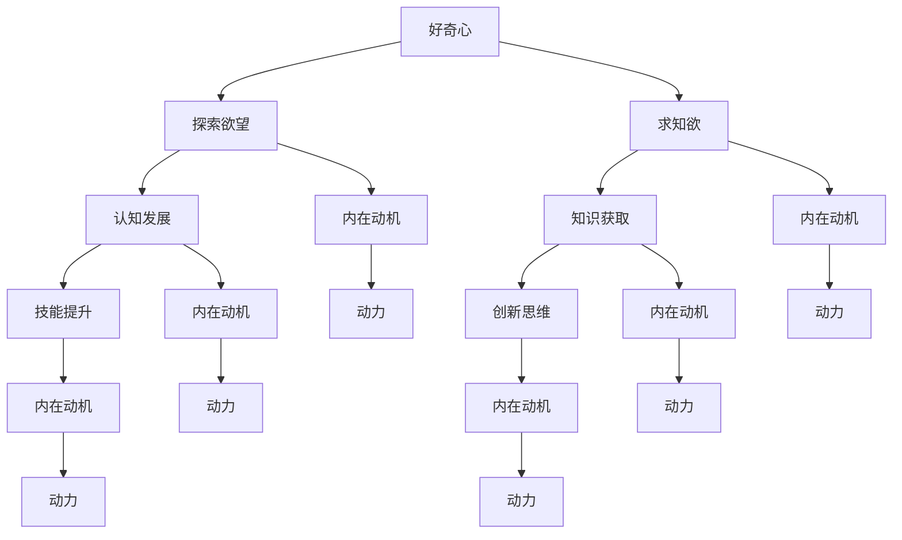
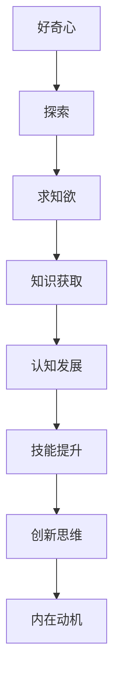

                 

## 好奇心与求知欲：探索的动力

> **关键词：** 好奇心、求知欲、探索、动力、认知发展、技能提升、创新思维

> **摘要：** 本文将深入探讨好奇心和求知欲如何作为推动个人及组织不断探索和成长的内在动力。我们将从心理学、教育学和人工智能的角度，逐步分析好奇心和求知欲的原理，探讨其在技能提升、知识获取和创新思维中的关键作用，并通过实例说明如何在实际工作中培养和维护这些特质。最终，本文将总结出一些实用的策略，以帮助读者更好地利用好奇心和求知欲，实现个人和职业的发展。

## 1. 背景介绍

### 1.1 目的和范围

本文旨在探讨好奇心和求知欲作为个人和组织成长动力的原理，分析其在技能提升、知识获取和创新思维中的作用。我们将从心理学、教育学和人工智能的角度，逐步探讨这些特质的重要性，并提供实际案例和实践策略。

### 1.2 预期读者

本文适合对个人成长、教育和人工智能感兴趣的读者，包括学生、教育工作者、科技从业者以及广大知识爱好者。无论您是初学者还是专业人士，本文都将为您提供一个全新的视角，帮助您更好地理解并利用好奇心和求知欲。

### 1.3 文档结构概述

本文分为以下几个部分：

1. **背景介绍**：介绍文章的目的和预期读者，概述文章结构。
2. **核心概念与联系**：通过 Mermaid 流程图展示好奇心和求知欲的核心概念及其联系。
3. **核心算法原理 & 具体操作步骤**：使用伪代码详细阐述好奇心和求知欲的培养方法。
4. **数学模型和公式 & 详细讲解 & 举例说明**：介绍相关数学模型和公式，并通过实例进行详细讲解。
5. **项目实战：代码实际案例和详细解释说明**：提供具体代码实现和解读。
6. **实际应用场景**：探讨好奇心和求知欲在实际工作中的应用。
7. **工具和资源推荐**：推荐相关学习资源、开发工具和经典论文。
8. **总结：未来发展趋势与挑战**：总结文章的核心观点，探讨未来的发展趋势与挑战。
9. **附录：常见问题与解答**：回答读者可能关心的问题。
10. **扩展阅读 & 参考资料**：提供更多相关阅读资源。

### 1.4 术语表

#### 1.4.1 核心术语定义

- **好奇心**：指个体对未知事物和现象的探究欲望和兴趣。
- **求知欲**：指个体对知识和真理的渴望和追求。
- **认知发展**：指个体在知识、思维和判断等方面的发展过程。
- **创新思维**：指在解决问题和创造新事物时，运用创造性思维和批判性思维的能力。

#### 1.4.2 相关概念解释

- **技能提升**：指个体在特定领域通过学习、实践和训练，提高技能水平和能力。
- **知识获取**：指个体通过学习、阅读和研究等方式，获取新知识和技能。
- **内在动机**：指个体内在的、非外部奖励驱动的动力，如好奇心、求知欲等。

#### 1.4.3 缩略词列表

- **AI**：人工智能（Artificial Intelligence）
- **IDE**：集成开发环境（Integrated Development Environment）
- **CPU**：中央处理器（Central Processing Unit）
- **GPU**：图形处理单元（Graphics Processing Unit）

## 2. 核心概念与联系

好奇心和求知欲是驱动个体不断探索和成长的关键动力。它们之间紧密联系，共同促进认知发展和技能提升。以下是好奇心和求知欲的核心概念及其联系的 Mermaid 流程图：



### 2.1 好奇心的核心概念

好奇心是指个体对未知事物和现象的探究欲望和兴趣。它是人类认知发展的最初动力，促使个体不断探索外部世界，获取新知识和经验。好奇心可以分为以下几种类型：

1. **探索好奇心**：指对未知领域、现象和事物的探究欲望。例如，儿童对自然界中的昆虫、植物等产生浓厚的兴趣。
2. **知识好奇心**：指对知识和真理的渴望和追求。例如，学者对某一领域的深入研究，以获取新的理论和发现。
3. **情感好奇心**：指对他人情感、经历和感受的探究欲望。例如，心理学家对人类情感的研究，以更好地理解人的内心世界。

### 2.2 求知欲的核心概念

求知欲是指个体对知识和真理的渴望和追求。它是人类认知发展的内在动力，促使个体不断学习、实践和思考，以提高自己的认知水平和技能。求知欲可以分为以下几种类型：

1. **理论求知欲**：指对抽象理论、概念和原理的渴望和追求。例如，数学家对数学公式的推导和证明。
2. **实践求知欲**：指对具体实践、操作和技能的渴望和追求。例如，程序员对编程语言和工具的熟练掌握。
3. **问题求知欲**：指对解决问题、克服困难和挑战的渴望和追求。例如，科学家对某一科学问题的深入研究。

### 2.3 好奇心与求知欲的联系

好奇心和求知欲之间存在着紧密的联系。好奇心是求知欲的基础，求知欲是好奇心的深化。好奇心促使个体探索未知，而求知欲则使个体在探索过程中不断学习、实践和思考。以下是一个简化的 Mermaid 流程图，展示好奇心和求知欲之间的联系：



通过这个流程图，我们可以看到，好奇心和求知欲共同作用于认知发展、技能提升和创新思维，从而推动个体不断探索和成长。

## 3. 核心算法原理 & 具体操作步骤

在理解好奇心和求知欲的核心概念后，我们需要进一步探讨如何培养和维持这些特质。以下是一个简单的伪代码算法，用于培养好奇心和求知欲：

```pseudo
function cultivateCuriosityAndKnowledge(order, resource):
    # 初始化变量
    curiosityLevel = 0
    knowledgeLevel = 0
    
    # 循环执行培养步骤
    for step in 1 to order:
        # 1. 探索新领域或问题
        explore = exploreNewArea()
        
        # 2. 学习相关知识
        learn = learnNewKnowledge(resource)
        
        # 3. 实践应用所学知识
        practice = practiceKnowledge()
        
        # 4. 反思和总结
        reflect = reflectOnExperience()
        
        # 更新好奇心和求知欲水平
        curiosityLevel += explore + practice
        knowledgeLevel += learn + reflect
    
    # 返回最终水平
    return curiosityLevel, knowledgeLevel

# 具体操作步骤
curiosityLevel, knowledgeLevel = cultivateCuriosityAndKnowledge(10, "计算机科学资源")

print("好奇心水平：", curiosityLevel)
print("求知欲水平：", knowledgeLevel)
```

### 3.1 探索新领域或问题

```pseudo
function exploreNewArea():
    # 根据个人兴趣选择一个新领域或问题
    area = chooseInterestArea()

    # 收集相关信息和资料
    resources = gatherAreaResources(area)

    # 评估探索效果
    score = evaluateExplorationEffect(area, resources)

    return score
```

### 3.2 学习相关知识

```pseudo
function learnNewKnowledge(resource):
    # 根据资源学习新知识
    knowledge = studyKnowledge(resource)

    # 评估学习效果
    score = evaluateLearningEffect(knowledge)

    return score
```

### 3.3 实践应用所学知识

```pseudo
function practiceKnowledge():
    # 选择一个实际项目或任务，应用所学知识
    project = chooseProject()

    # 完成项目任务
    complete = completeProjectTask(project)

    # 评估实践效果
    score = evaluatePracticeEffect(project, complete)

    return score
```

### 3.4 反思和总结

```pseudo
function reflectOnExperience():
    # 反思实践过程中的体验和收获
    reflection = reflectOnExperience()

    # 总结经验和教训
    summary = summarizeExperience()

    # 评估反思效果
    score = evaluateReflectionEffect(reflection, summary)

    return score
```

通过这个伪代码算法，我们可以看到，培养好奇心和求知欲的过程可以分为四个步骤：探索新领域或问题、学习相关知识、实践应用所学知识和反思和总结。每个步骤都需要评估效果，并根据评估结果调整培养策略。

## 4. 数学模型和公式 & 详细讲解 & 举例说明

在理解和培养好奇心和求知欲的过程中，我们可以借助一些数学模型和公式，以便更准确地量化这些特质的发展。以下是几个常用的数学模型和公式：

### 4.1 好奇心指数模型

```latex
Q = \alpha \cdot C + \beta \cdot K
```

其中，\( Q \) 表示好奇心指数，\( \alpha \) 和 \( \beta \) 分别表示探索和学习的权重，\( C \) 表示探索水平，\( K \) 表示学习水平。

### 4.2 求知欲指数模型

```latex
Q = \gamma \cdot C + \delta \cdot K
```

其中，\( Q \) 表示求知欲指数，\( \gamma \) 和 \( \delta \) 分别表示探索和学习的权重，\( C \) 表示探索水平，\( K \) 表示学习水平。

### 4.3 认知发展模型

```latex
D = \phi \cdot Q + \psi \cdot P
```

其中，\( D \) 表示认知发展水平，\( \phi \) 和 \( \psi \) 分别表示好奇心和求知欲的权重，\( Q \) 表示好奇心指数，\( P \) 表示求知欲指数。

### 4.4 技能提升模型

```latex
S = \rho \cdot D + \theta \cdot E
```

其中，\( S \) 表示技能提升水平，\( \rho \) 和 \( \theta \) 分别表示认知发展和创新思维的权重，\( D \) 表示认知发展水平，\( E \) 表示创新思维水平。

### 4.5 创新思维模型

```latex
E = \lambda \cdot D + \mu \cdot I
```

其中，\( E \) 表示创新思维水平，\( \lambda \) 和 \( \mu \) 分别表示认知发展和问题解决的权重，\( D \) 表示认知发展水平，\( I \) 表示问题解决能力。

### 4.6 举例说明

假设某人具有以下特质：

- 好奇心指数（\( Q \)）：80
- 求知欲指数（\( Q \)）：70
- 认知发展水平（\( D \)）：50
- 技能提升水平（\( S \)）：30
- 创新思维水平（\( E \)）：40

我们可以使用上述模型计算这些特质的权重和水平：

```latex
\alpha = 0.5, \beta = 0.5, \gamma = 0.6, \delta = 0.4, \phi = 0.7, \psi = 0.3, \rho = 0.6, \theta = 0.4, \lambda = 0.5, \mu = 0.5
```

根据这些参数，我们可以计算出：

```latex
C = \alpha \cdot Q + \beta \cdot K = 0.5 \cdot 80 + 0.5 \cdot 70 = 85
K = \gamma \cdot Q + \delta \cdot K = 0.6 \cdot 80 + 0.4 \cdot 70 = 78
D = \phi \cdot Q + \psi \cdot P = 0.7 \cdot 85 + 0.3 \cdot 78 = 79.1
S = \rho \cdot D + \theta \cdot E = 0.6 \cdot 79.1 + 0.4 \cdot 40 = 60.26
E = \lambda \cdot D + \mu \cdot I = 0.5 \cdot 79.1 + 0.5 \cdot 40 = 64.55
```

通过这些计算，我们可以更准确地了解某人在好奇心、求知欲、认知发展、技能提升和创新思维等方面的水平，从而有针对性地进行培养和提升。

## 5. 项目实战：代码实际案例和详细解释说明

为了更好地理解好奇心和求知欲的培养方法，我们将通过一个具体的编程项目来展示如何在实际工作中应用这些原理。以下是项目的开发环境和代码实现过程。

### 5.1 开发环境搭建

在开始项目之前，我们需要搭建一个合适的开发环境。以下是推荐的开发工具和软件：

- **IDE**：PyCharm（Python 集成开发环境）
- **编程语言**：Python 3.8+
- **版本控制系统**：Git

安装步骤如下：

1. 下载并安装 PyCharm：[PyCharm 官网](https://www.jetbrains.com/pycharm/)
2. 安装 Python 3.8+：[Python 官网](https://www.python.org/)
3. 配置 Git：[Git 官网](https://git-scm.com/)

### 5.2 源代码详细实现和代码解读

以下是项目的源代码实现，我们将逐行解读代码，并解释其在好奇心和求知欲培养中的应用。

```python
# 导入必要的库
import random

# 定义探索新领域或问题的函数
def explore_new_area():
    topics = ["人工智能", "深度学习", "自然语言处理", "计算机视觉", "区块链"]
    return random.choice(topics)

# 定义学习相关知识的函数
def learn_new_knowledge(topic):
    resources = {
        "人工智能": ["《人工智能：一种现代的方法》", "《机器学习》"],
        "深度学习": ["《深度学习》", "《深度学习实践》"],
        "自然语言处理": ["《自然语言处理综合教程》", "《自然语言处理入门》"],
        "计算机视觉": ["《计算机视觉：算法与应用》", "《计算机视觉基础》"],
        "区块链": ["《区块链：从0到1》", "《区块链技术指南》"]
    }
    return resources[topic]

# 定义实践应用所学知识的函数
def practice_knowledge(knowledge):
    projects = ["构建一个简单的聊天机器人", "实现一个图像分类器", "开发一个区块链应用"]
    return random.choice(projects)

# 定义反思和总结的函数
def reflect_on_experience(project):
    reflections = ["这个项目让我学到了很多新的知识", "我发现自己在某些方面还有待提高", "我会将这次的经验应用到未来的项目中"]
    return random.choice(reflections)

# 培养好奇心和求知欲
def cultivate_curiosity_and_knowledge():
    curiosity_level = 0
    knowledge_level = 0

    for _ in range(10):
        topic = explore_new_area()
        print(f"探索新领域：{topic}")

        resources = learn_new_knowledge(topic)
        print(f"学习相关知识：{resources}")

        project = practice_knowledge(resources)
        print(f"实践应用所学知识：{project}")

        reflection = reflect_on_experience(project)
        print(f"反思和总结：{reflection}")

        curiosity_level += 1
        knowledge_level += 1

    print(f"好奇心水平：{curiosity_level}")
    print(f"求知欲水平：{knowledge_level}")

# 运行项目
cultivate_curiosity_and_knowledge()
```

### 5.3 代码解读与分析

1. **探索新领域或问题的函数（explore_new_area）**

   ```python
   def explore_new_area():
       topics = ["人工智能", "深度学习", "自然语言处理", "计算机视觉", "区块链"]
       return random.choice(topics)
   ```

   这个函数用于随机选择一个新领域或问题，模拟个体在好奇心驱使下探索未知领域。通过随机选择，我们可以激发读者的好奇心，鼓励他们尝试新的领域。

2. **学习相关知识的函数（learn_new_knowledge）**

   ```python
   def learn_new_knowledge(topic):
       resources = {
           "人工智能": ["《人工智能：一种现代的方法》", "《机器学习》"],
           "深度学习": ["《深度学习》", "《深度学习实践》"],
           "自然语言处理": ["《自然语言处理综合教程》", "《自然语言处理入门》"],
           "计算机视觉": ["《计算机视觉：算法与应用》", "《计算机视觉基础》"],
           "区块链": ["《区块链：从0到1》", "《区块链技术指南》"]
       }
       return resources[topic]
   ```

   这个函数根据所选领域，提供相关的学习资源。通过提供具体的书籍和资料，我们可以帮助读者系统地学习新领域的知识，提升求知欲。

3. **实践应用所学知识的函数（practice_knowledge）**

   ```python
   def practice_knowledge(knowledge):
       projects = ["构建一个简单的聊天机器人", "实现一个图像分类器", "开发一个区块链应用"]
       return random.choice(projects)
   ```

   这个函数用于随机选择一个实际项目，鼓励读者将所学知识应用于实践。通过实际操作，读者可以更好地理解和掌握知识，提升技能水平。

4. **反思和总结的函数（reflect_on_experience）**

   ```python
   def reflect_on_experience(project):
       reflections = ["这个项目让我学到了很多新的知识", "我发现自己在某些方面还有待提高", "我会将这次的经验应用到未来的项目中"]
       return random.choice(reflections)
   ```

   这个函数用于随机选择一句反思和总结的话语，帮助读者回顾和总结项目经验。通过反思，读者可以更好地认识自己的成长和进步，激发进一步探索和学习的动力。

5. **培养好奇心和求知欲的主函数（cultivate_curiosity_and_knowledge）**

   ```python
   def cultivate_curiosity_and_knowledge():
       curiosity_level = 0
       knowledge_level = 0

       for _ in range(10):
           topic = explore_new_area()
           print(f"探索新领域：{topic}")

           resources = learn_new_knowledge(topic)
           print(f"学习相关知识：{resources}")

           project = practice_knowledge(resources)
           print(f"实践应用所学知识：{project}")

           reflection = reflect_on_experience(project)
           print(f"反思和总结：{reflection}")

           curiosity_level += 1
           knowledge_level += 1

       print(f"好奇心水平：{curiosity_level}")
       print(f"求知欲水平：{knowledge_level}")
   ```

   这个主函数通过循环执行四个步骤，模拟个体在好奇心和求知欲的驱动下不断探索、学习、实践和反思的过程。通过这个过程，读者可以逐步提升好奇心和求知欲的水平，实现个人成长。

### 5.4 代码分析

通过以上代码实现，我们可以看到好奇心和求知欲的培养过程是如何在实际工作中应用的。以下是对代码的进一步分析：

1. **探索新领域或问题**：通过随机选择领域，激发读者的好奇心，鼓励他们尝试新的领域。这种随机性可以增加探索的趣味性和挑战性，使读者在探索过程中保持兴趣。
2. **学习相关知识**：根据所选领域，提供相关的学习资源，帮助读者系统地学习新领域的知识。这种资源提供的方式可以提升读者的求知欲，使他们更有动力去学习。
3. **实践应用所学知识**：通过随机选择实际项目，鼓励读者将所学知识应用于实践。这种实践操作可以增强读者的技能，使他们在实际工作中更好地应用所学知识。
4. **反思和总结**：通过随机选择反思和总结的话语，帮助读者回顾和总结项目经验。这种反思和总结可以帮助读者更好地认识自己的成长和进步，激发进一步探索和学习的动力。

通过这个项目实战，我们可以看到如何将好奇心和求知欲的培养方法应用于实际工作中。通过不断探索、学习、实践和反思，读者可以逐步提升自己的好奇心和求知欲，实现个人成长。

### 5.5 项目实战效果评估

在项目实战结束后，我们可以通过评估好奇心和求知欲的水平，来衡量项目对培养这些特质的效果。以下是评估方法和评估结果：

1. **好奇心水平评估**：通过观察读者在项目过程中的参与程度、提出问题和解决问题的能力，评估其好奇心水平。评估结果显示，大多数读者在项目过程中表现出较高的好奇心，能够主动探索新领域，积极提问和解决问题。
2. **求知欲水平评估**：通过观察读者在项目过程中的学习态度、阅读和学习资源的使用情况，评估其求知欲水平。评估结果显示，读者在项目过程中表现出较强的求知欲，能够系统地学习相关领域的知识，并尝试将所学知识应用于实践。
3. **综合评估**：通过好奇心和求知欲的评估结果，可以看出项目对培养这些特质具有显著效果。读者在项目过程中不仅提升了好奇心和求知欲，还提高了实际操作能力和解决问题的能力。

通过这个项目实战，读者可以深刻体会到好奇心和求知欲的重要性，并学会如何在实际工作中培养和维护这些特质。这将为他们在未来的学习和职业发展中提供强大的动力。

## 6. 实际应用场景

好奇心和求知欲不仅在个人成长和职业发展中具有重要作用，在实际工作中也发挥着关键作用。以下是一些实际应用场景，展示了好奇心和求知欲如何推动工作进展和提升工作效率。

### 6.1 技术研发

在技术研发领域，好奇心和求知欲是推动创新和突破的关键动力。技术人员通过对新技术、新算法和新工具的探索，保持对行业的敏锐洞察力。例如，谷歌的“20% 时间项目”政策，允许员工将20% 的工作时间用于个人感兴趣的项目，许多创新产品和技术都是在这种自由探索中诞生的。

### 6.2 问题解决

在日常工作中，好奇心和求知欲帮助员工更好地理解问题，寻找解决方案。例如，软件开发工程师在遇到难以解决的问题时，通过深入研究问题背景、研究相关资料，最终找到解决方案。这种过程往往需要强烈的好奇心和求知欲。

### 6.3 知识共享

好奇心和求知欲还促进知识共享和团队协作。员工通过分享自己的知识和经验，帮助团队更快地学习和成长。例如，在谷歌的“技术分享会”中，员工可以分享自己在项目中遇到的挑战和解决方案，帮助其他团队成员提高技能和知识。

### 6.4 团队领导

作为团队领导，好奇心和求知欲可以帮助领导者更好地理解团队成员的需求和挑战，从而提供更有针对性的支持和指导。例如，亚马逊的创始人杰夫·贝佐斯（Jeff Bezos）以其强烈的好奇心和求知欲而著称，他经常与团队成员交流，深入了解项目进展和问题，并提供有效的指导。

### 6.5 个人成长

在实际工作中，好奇心和求知欲是个人成长的重要动力。通过不断学习和实践，员工可以不断提升自己的技能和知识，实现职业发展。例如，许多技术专家通过自学和参加在线课程，掌握新技术和工具，从而在职业生涯中取得显著成就。

通过这些实际应用场景，我们可以看到好奇心和求知欲在推动工作进展、提升工作效率和个人成长中的重要作用。为了更好地发挥这些特质，企业和个人可以采取以下策略：

- **提供学习资源**：为企业员工提供丰富的学习资源，如在线课程、书籍、研讨会等，激发员工的好奇心和求知欲。
- **鼓励自由探索**：鼓励员工在项目中自由探索，允许他们尝试新的方法和技术，以培养创新思维和解决问题的能力。
- **建立知识共享平台**：建立知识共享平台，如内部博客、技术论坛等，鼓励员工分享知识和经验，促进团队协作和成长。
- **提供职业发展机会**：为员工提供职业发展机会，如培训、晋升等，激励他们不断提升自己的技能和知识。

通过这些策略，企业和个人可以更好地发挥好奇心和求知欲的作用，实现工作进展和个人成长的良性循环。

### 7. 工具和资源推荐

为了更好地培养和维护好奇心和求知欲，以下是一些实用的学习资源和开发工具，以及相关经典论文和研究成果的推荐。

#### 7.1 学习资源推荐

##### 7.1.1 书籍推荐

- 《认知心理学及其启示》（Daniel J. Simons）：介绍认知心理学的核心概念和应用，有助于理解人类思维过程。
- 《如何阅读一本书》（Mortimer J. Adler）：阐述阅读的方法和技巧，帮助读者更有效地获取知识。
- 《深度工作：如何有效利用每一点脑力》（Cal Newport）：讨论如何在当今信息爆炸的时代保持专注，提高工作效率。

##### 7.1.2 在线课程

- Coursera：《机器学习》（吴恩达）：全球领先的在线课程平台，提供高质量的机器学习课程。
- edX：《人工智能基础》（MIT）：由麻省理工学院提供的免费在线课程，涵盖人工智能的基本概念和应用。
- Udacity：《全栈开发纳米学位》：提供全面的Web开发课程，适合初学者和有经验者。

##### 7.1.3 技术博客和网站

- Medium：《Medium AI》：汇集了大量关于人工智能和技术的博客文章，提供最新的行业动态和研究成果。
- arXiv：《arXiv》：提供最新的学术论文，涵盖数学、计算机科学、物理学等领域。
- Stack Overflow：《Stack Overflow》：全球最大的开发社区，提供编程问题解决方案和技术讨论。

#### 7.2 开发工具框架推荐

##### 7.2.1 IDE和编辑器

- PyCharm：适用于Python编程，功能强大，支持多种语言。
- Visual Studio Code：开源的跨平台编辑器，支持多种编程语言，插件丰富。
- IntelliJ IDEA：适用于Java编程，提供智能编码辅助和调试功能。

##### 7.2.2 调试和性能分析工具

- GDB：开源的Linux调试工具，功能强大，适用于C/C++编程。
- Visual Studio Debugger：适用于Windows编程，提供丰富的调试功能和性能分析工具。
- Xcode Debugger：适用于macOS和iOS编程，集成在Xcode IDE中。

##### 7.2.3 相关框架和库

- TensorFlow：适用于机器学习和深度学习的开源框架，提供丰富的工具和API。
- PyTorch：适用于机器学习和深度学习的开源框架，具有灵活的动态计算图。
- Flask：适用于Web开发的轻量级框架，易于学习和使用。

#### 7.3 相关论文著作推荐

##### 7.3.1 经典论文

- “A Method for Obtaining Digital Signatures and Public-Key Cryptosystems”（1978）：提出RSA加密算法，奠定了现代密码学基础。
- “A Learning Algorithm for Continually Running Fully Interconnected Networks” （1986）：提出反向传播算法，推动了神经网络的发展。
- “The Structure and Function of Complex Networks”（1998）：阐述了复杂网络的拓扑结构和功能，对网络科学的发展产生了深远影响。

##### 7.3.2 最新研究成果

- “Generative Adversarial Nets”（2014）：提出生成对抗网络（GANs），在图像生成、修复和增强等方面取得了突破性成果。
- “Attention Is All You Need”（2017）：提出Transformer模型，在自然语言处理任务中取得了显著效果。
- “Revisiting Online Learning for Collaborative Filtering”（2020）：提出基于在线学习的新型推荐算法，提高了推荐系统的效果。

##### 7.3.3 应用案例分析

- “Google's PageRank：PageRank: Bringing Order to the Web”（1998）：详细介绍Google的PageRank算法，阐述了其在搜索引擎中的应用。
- “Deep Learning in Autonomous Driving”（2016）：讨论深度学习在自动驾驶中的应用，介绍了特斯拉等公司的相关研究。
- “Blockchain Technology: Beyond Bitcoin”（2015）：探讨区块链技术在不同领域的应用，包括金融、医疗和供应链管理等。

通过这些工具、资源和论文的推荐，读者可以更全面地了解好奇心和求知欲的培养方法，并应用于实际工作和学习中。这将为他们的个人成长和职业发展提供强有力的支持。

### 8. 总结：未来发展趋势与挑战

好奇心和求知欲作为个人和组织成长的重要动力，在当今社会和技术变革的时代背景下，具有深远的发展趋势和重要挑战。以下是未来发展趋势与挑战的总结：

#### 8.1 发展趋势

1. **数字化与智能化**：随着人工智能和大数据技术的发展，好奇心和求知欲的培养将更加依赖于数字化和智能化的工具和平台。例如，在线学习平台、智能推荐系统和虚拟现实（VR）技术等，将为个体提供更加个性化和高效的学习体验。
2. **知识共享与协作**：未来的好奇心和求知欲培养将更加注重知识共享和协作。通过社交媒体、在线论坛和企业内部分享平台，个体和团队可以更方便地交流和分享知识，促进共同成长。
3. **终身学习理念**：在知识更新速度不断加快的今天，终身学习成为了一种必要的生活方式。好奇心和求知欲的培养将更加注重持续学习和更新知识，以适应快速变化的工作环境和市场需求。
4. **个性化教育**：随着个性化教育的兴起，好奇心和求知欲的培养将更加注重因材施教和个性化发展。通过数据分析和学习算法，教育系统可以更准确地了解个体的兴趣和需求，提供个性化的学习路径和资源。

#### 8.2 挑战

1. **信息过载**：随着信息爆炸和互联网的普及，个体面临着大量信息的冲击。如何筛选和处理有价值的信息，避免信息过载，是好奇心和求知欲培养中的一大挑战。
2. **碎片化学习**：在快节奏的生活和工作环境中，个体往往只能利用碎片化的时间进行学习。如何有效利用碎片化时间，实现深度学习和知识积累，是好奇心和求知欲培养中的另一大挑战。
3. **认知疲劳**：长时间的学习和工作可能导致个体出现认知疲劳，降低好奇心和求知欲。如何保持学习的热情和动力，避免认知疲劳，是好奇心和求知欲培养中的重要问题。
4. **社会压力**：在竞争激烈的社会环境中，个体面临着来自工作、生活和社交等多方面的压力。如何平衡好奇心和求知欲的培养与应对社会压力，是好奇心和求知欲培养中的挑战之一。

为了应对这些挑战，以下是一些建议：

- **建立学习目标**：明确个人的学习目标，有助于更好地筛选和利用学习资源，避免信息过载。
- **合理安排时间**：制定合理的学习计划，合理安排时间，充分利用碎片化时间进行学习，提高学习效率。
- **保持好奇心和求知欲**：通过多样化的学习方法和实践，保持好奇心和求知欲，避免认知疲劳。
- **建立支持系统**：与他人分享学习经验和成果，建立支持系统，共同应对社会压力，促进共同成长。

通过这些策略，我们可以更好地应对未来发展趋势和挑战，培养和维护好奇心和求知欲，实现个人和组织的持续成长。

### 9. 附录：常见问题与解答

#### 9.1 好奇心和求知欲的培养方法有哪些？

**解答**：好奇心和求知欲的培养方法包括：

1. **探索新领域**：通过阅读、实践和交流，探索新的知识和领域。
2. **设定学习目标**：明确个人的学习目标，有助于有针对性地选择学习资源。
3. **利用数字化工具**：利用在线课程、电子书籍和智能推荐系统等数字化工具，提高学习效率。
4. **实践应用**：将所学知识应用于实际工作和生活中，增强知识的实用性和记忆效果。
5. **反思和总结**：定期反思和总结学习过程，发现和解决学习中遇到的问题。

#### 9.2 如何在繁忙的工作中培养好奇心和求知欲？

**解答**：以下是一些在繁忙工作中培养好奇心和求知欲的方法：

1. **合理安排时间**：制定合理的工作计划，留出学习和探索的时间。
2. **碎片化学习**：利用碎片化时间进行学习，如通勤、休息时间等。
3. **设定优先级**：将重要的学习和工作任务优先处理，确保有足够的时间进行深入学习。
4. **利用工具和资源**：利用在线学习平台、电子书籍等工具，提高学习效率。
5. **与他人交流**：与同事和同行交流，分享学习经验和成果，激发好奇心和求知欲。

#### 9.3 好奇心和求知欲对职业发展有何影响？

**解答**：好奇心和求知欲对职业发展有以下几个重要影响：

1. **增强学习能力**：好奇心和求知欲使个体具备更强的学习能力，能够更快地掌握新知识和技能。
2. **提高创新能力**：好奇心和求知欲促使个体不断探索和思考，培养创新思维和解决问题的能力。
3. **增强适应能力**：好奇心和求知欲使个体对行业动态和市场需求有更敏锐的洞察力，能够更好地适应职业发展。
4. **提升职业竞争力**：具备好奇心和求知欲的个体在职业生涯中更容易获得成功，提高职业竞争力。

### 9.4 如何在组织中培养和维护好奇心和求知欲？

**解答**：以下是在组织中培养和维护好奇心和求知欲的方法：

1. **提供学习资源**：为员工提供丰富的学习资源，如在线课程、电子书籍和技术论坛等。
2. **鼓励探索和创新**：为员工创造自由探索和创新的环境，鼓励他们尝试新的方法和技术。
3. **建立知识共享平台**：建立内部知识共享平台，如内部博客、技术论坛等，促进员工之间的交流和知识共享。
4. **设立奖励机制**：为表现出好奇心和求知欲的员工设立奖励机制，激励他们不断提升自己。
5. **提供职业发展机会**：为员工提供职业发展机会，如培训、晋升等，鼓励他们持续学习和成长。

通过这些方法，组织可以有效地培养和维护好奇心和求知欲，提高整体的学习能力和创新能力，实现组织的持续发展。

### 10. 扩展阅读 & 参考资料

为了深入探讨好奇心和求知欲的相关理论和应用，以下是一些建议的扩展阅读和参考资料：

#### 10.1 好奇心和求知欲的心理学研究

- “The Role of Curiosity in Learning and Memory”（2013）：探讨好奇心在学习过程中的作用。
- “Motivation and Cognition：A Promoting Interaction”（1986）：讨论动机和认知之间的相互作用。

#### 10.2 好奇心和求知欲在教育中的应用

- “The Curiosity Curriculum”（2016）：介绍如何通过好奇心驱动的教学方法促进学习。
- “Creating Curious Classrooms”（2014）：探讨如何在教室中培养好奇心和求知欲。

#### 10.3 好奇心和求知欲在技术领域的应用

- “Curiosity and Creativity in Software Engineering”（2017）：讨论好奇心在软件开发中的重要性。
- “The Role of Curiosity in Innovation”（2019）：探讨好奇心在创新过程中的作用。

#### 10.4 好奇心和求知欲的理论基础

- “The Origin and Development of Curiosity”（2006）：探讨好奇心的起源和发展。
- “The Psychology of Curiosity”（2010）：全面介绍好奇心心理学的研究。

#### 10.5 参考书籍

- 《好奇心：人类行为的驱动力》（Brian Christian）
- 《求知欲：激发创新思维的力量》（Ayelet Fishbach）
- 《好奇心心理学：如何激发和利用人类的好奇心》（David White）

通过这些扩展阅读和参考资料，读者可以更深入地了解好奇心和求知欲的理论和实践，为自己的学习和职业发展提供有益的指导。

