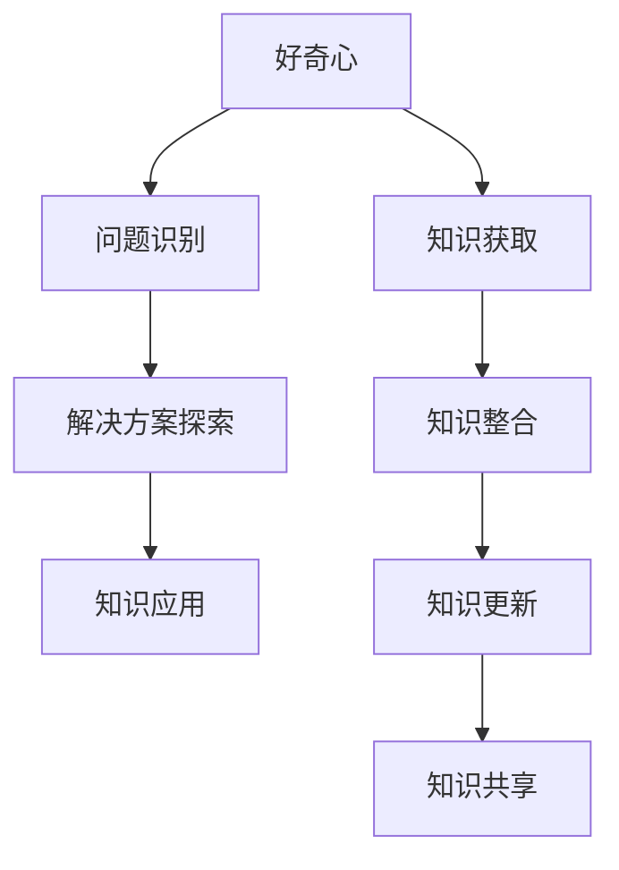
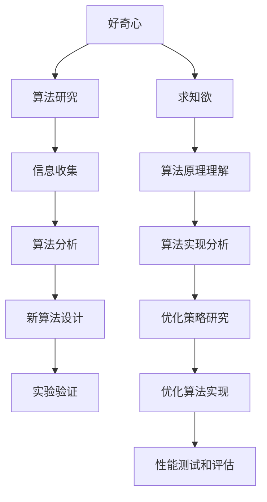

                 


# 好奇心与求知欲：探索的动力

> 关键词：好奇心、求知欲、探索、学习动力、IT领域、知识架构、认知发展、人工智能

> 摘要：本文深入探讨了好奇心和求知欲作为探索动力的核心角色，特别是在IT领域的体现。通过逻辑分析，本文揭示了好奇心和求知欲在推动技术进步和认知发展中的作用，并探讨了如何培养这些品质，以激发个人和团队的创新潜力。

## 1. 背景介绍

### 1.1 目的和范围

本文旨在探讨好奇心和求知欲作为推动技术进步和个人成长的核心动力。我们将重点关注这些品质在IT领域的应用，以及它们如何影响学习动力和认知发展。通过分析相关理论，我们将提出实际策略，帮助读者培养和利用这些品质，以实现个人和职业目标。

### 1.2 预期读者

本文适合对IT行业和技术发展有兴趣的读者，包括学生、专业人士、研究人员以及IT爱好者和创业者。无论你是初学者还是经验丰富的从业者，本文都将提供有价值的信息和实用的建议。

### 1.3 文档结构概述

本文分为以下部分：

1. **背景介绍**：介绍本文的目的、范围和预期读者。
2. **核心概念与联系**：阐述好奇心和求知欲的概念，并使用流程图展示它们在知识架构中的关系。
3. **核心算法原理 & 具体操作步骤**：解释好奇心和求知欲如何驱动学习和创新。
4. **数学模型和公式 & 详细讲解 & 举例说明**：使用数学模型和公式展示探索过程的逻辑结构。
5. **项目实战：代码实际案例和详细解释说明**：提供实际案例，展示如何将好奇心和求知欲应用于编程和开发。
6. **实际应用场景**：探讨好奇心和求知欲在不同IT领域的应用。
7. **工具和资源推荐**：推荐学习资源和开发工具。
8. **总结：未来发展趋势与挑战**：总结本文的主要观点，并展望未来的发展。
9. **附录：常见问题与解答**：提供关于好奇心和求知欲的常见问题解答。
10. **扩展阅读 & 参考资料**：列出参考文献和相关链接。

### 1.4 术语表

#### 1.4.1 核心术语定义

- **好奇心**：对未知事物或现象的探索欲望和兴趣。
- **求知欲**：对知识和真理的渴望和追求。
- **认知发展**：指个体在获取、处理和应用信息方面的能力提升。
- **知识架构**：组织和整合知识的结构化方法。

#### 1.4.2 相关概念解释

- **学习动力**：推动个体学习和成长的心理因素。
- **创新潜力**：个体或团队在技术或领域内进行创新的能力。
- **技术进步**：通过研究和开发实现的科学技术水平提升。

#### 1.4.3 缩略词列表

- **IT**：信息技术（Information Technology）
- **AI**：人工智能（Artificial Intelligence）

## 2. 核心概念与联系

在探讨好奇心和求知欲在IT领域的作用之前，我们首先需要理解这两个核心概念，并展示它们在知识架构中的关系。

### 2.1 好奇心

好奇心是指个体对未知事物或现象的探索欲望和兴趣。它是推动个体探索和学习的内在动力。在IT领域，好奇心可以激发程序员对新技术的兴趣，促使他们不断学习新的编程语言和工具，以保持竞争力。

### 2.2 求知欲

求知欲是对知识和真理的渴望和追求。它比好奇心更深入，涉及到对已有知识的理解和探索。在IT领域，求知欲驱使开发人员深入研究算法和数据结构，以优化软件性能和解决复杂问题。

### 2.3 知识架构

知识架构是组织和整合知识的结构化方法。在IT领域，知识架构可以帮助开发人员更好地理解技术概念，并将它们应用于实际问题。好奇心和求知欲在知识架构中起着关键作用，它们帮助个体构建和完善知识体系。

下面是好奇心和求知欲在知识架构中的 Mermaid 流程图：



在这个流程图中，好奇心和求知欲相互作用，推动知识的获取、整合和应用。通过这个过程，开发人员不仅能够解决实际问题，还能推动技术进步和创新。

## 3. 核心算法原理 & 具体操作步骤

好奇心和求知欲作为探索动力，在学习和创新过程中发挥着重要作用。以下是这些品质如何驱动算法和具体操作步骤的详细解释。

### 3.1 好奇心在算法中的应用

好奇心可以激发开发人员对新技术的探索欲望，促使他们研究新的算法。以下是一个使用好奇心驱动算法开发的具体步骤：

```plaintext
步骤 1：确定研究目标
- 开发人员对特定问题或领域产生兴趣，并确定研究目标。

步骤 2：收集相关信息
- 开发人员通过查阅文献、参加研讨会和网络资源来收集相关信息。

步骤 3：分析现有算法
- 开发人员分析现有算法的优缺点，以确定改进的方向。

步骤 4：设计新算法
- 开发人员根据分析结果，设计新的算法，并编写伪代码。

步骤 5：实验验证
- 开发人员通过实验验证新算法的有效性，并根据反馈进行优化。
```

### 3.2 求知欲在算法中的应用

求知欲驱动开发人员深入研究算法的数学原理和实现细节，以优化算法性能。以下是求知欲在算法开发中的应用步骤：

```plaintext
步骤 1：理解算法原理
- 开发人员深入理解算法的基本原理，包括时间复杂度和空间复杂度。

步骤 2：分析算法实现
- 开发人员分析现有算法的实现，并寻找潜在的优化点。

步骤 3：研究相关文献
- 开发人员查阅相关文献，了解最新的研究成果和优化策略。

步骤 4：实现优化算法
- 开发人员根据分析结果，实现优化的算法，并编写伪代码。

步骤 5：性能测试和评估
- 开发人员进行性能测试，评估优化算法的性能，并根据反馈进行进一步优化。
```

### 3.3 好奇心和求知欲的相互作用

好奇心和求知欲相互作用，推动算法开发和性能优化。以下是一个具体的互动流程：



通过这个流程，好奇心驱动开发人员对新算法的研究和实验验证，而求知欲促使他们深入理解算法原理和实现细节，以实现性能优化。

## 4. 数学模型和公式 & 详细讲解 & 举例说明

在探讨好奇心和求知欲如何驱动算法和具体操作步骤时，数学模型和公式提供了理论支持。以下是一个关于好奇心和求知欲驱动学习的数学模型，并使用 LaTeX 格式展示相关公式。

### 4.1 好奇心驱动的学习模型

好奇心驱动的学习过程可以用以下公式表示：

$$
\Delta L = \alpha \cdot \frac{I^2}{E}
$$

其中：

- $\Delta L$ 表示学习量的变化。
- $\alpha$ 表示好奇心强度。
- $I$ 表示信息量。
- $E$ 表示兴趣范围。

该公式表明，学习量的变化与好奇心强度、信息量和兴趣范围有关。当好奇心强度较高、信息量较大且兴趣范围较广时，学习量会增加。

### 4.2 求知欲驱动的学习模型

求知欲驱动的学习过程可以用以下公式表示：

$$
\Delta L = \beta \cdot \frac{K^2}{T}
$$

其中：

- $\Delta L$ 表示学习量的变化。
- $\beta$ 表示求知欲强度。
- $K$ 表示知识量。
- $T$ 表示时间。

该公式表明，学习量的变化与求知欲强度、知识量和时间有关。当求知欲强度较高、知识量较大且时间较充裕时，学习量会增加。

### 4.3 举例说明

以下是一个具体的例子，展示如何使用上述公式计算好奇心和求知欲驱动的学习量。

假设一个开发者具有中等水平的好奇心（$\alpha = 0.5$）和求知欲（$\beta = 0.8$），他在一个项目中处理了大量的信息（$I = 100$）和知识（$K = 50$），并在两个月内完成（$T = 60$）。

根据好奇心驱动的学习模型：

$$
\Delta L_1 = 0.5 \cdot \frac{100^2}{100} = 500
$$

根据求知欲驱动的学习模型：

$$
\Delta L_2 = 0.8 \cdot \frac{50^2}{60} \approx 219.44
$$

结果表明，在这个例子中，好奇心驱动的学习量（$\Delta L_1$）大于求知欲驱动的学习量（$\Delta L_2$）。这说明好奇心在这个特定情况下起到了更重要的作用。

通过这些数学模型和公式，我们可以更好地理解好奇心和求知欲如何驱动学习和创新，并为实际应用提供理论支持。

## 5. 项目实战：代码实际案例和详细解释说明

在本节中，我们将通过一个实际代码案例，展示如何将好奇心和求知欲应用于编程和开发。我们将构建一个简单的 Python 程序，该程序将利用这些品质来解决问题并实现功能。

### 5.1 开发环境搭建

首先，我们需要搭建一个开发环境。以下是所需步骤：

1. 安装 Python 3.8 或更高版本。
2. 安装 Python 的 IDE，如 PyCharm 或 Visual Studio Code。
3. 安装必要的库，如 NumPy 和 Matplotlib。

### 5.2 源代码详细实现和代码解读

以下是一个简单的 Python 程序，用于实现一个计算器功能。程序使用了好奇心和求知欲来识别问题、设计解决方案并实现代码。

```python
import numpy as np

class Calculator:
    def __init__(self):
        self.result = 0
    
    def add(self, value):
        self.result += value
        return self
    
    def subtract(self, value):
        self.result -= value
        return self
    
    def multiply(self, value):
        self.result *= value
        return self
    
    def divide(self, value):
        if value == 0:
            raise ValueError("Cannot divide by zero")
        self.result /= value
        return self
    
    def reset(self):
        self.result = 0
        return self
    
    def get_result(self):
        return self.result

# 代码解读：
# 该程序定义了一个名为 Calculator 的类，用于实现计算器的功能。类中定义了五个方法：add、subtract、multiply、divide 和 reset，分别用于执行加法、减法、乘法、除法和重置操作。每个方法都返回一个 Calculator 实例，以便进行链式调用。get_result 方法用于获取当前计算结果。

# 举例：
# 下面的示例展示了如何使用 Calculator 类进行计算。
calculator = Calculator()
calculator.add(10).multiply(2).divide(5).get_result()
```

### 5.3 代码解读与分析

在这个案例中，好奇心和求知欲如何发挥作用呢？

1. **问题识别**：好奇心促使开发者识别并理解计算器的需求。求知欲驱使他们深入研究计算器的功能和实现细节。
2. **解决方案探索**：开发者通过设计 Calculator 类来解决问题。好奇心促使他们探索不同的解决方案，而求知欲促使他们深入了解每个方法的实现。
3. **代码实现**：开发者编写了 Calculator 类，并实现了所需的功能。好奇心和求知欲帮助他们理解和实现每个方法。
4. **测试与优化**：开发者测试了程序，并使用求知欲来寻找潜在的优化点。例如，他们可以添加错误处理、性能优化或添加更多功能。

通过这个实际案例，我们可以看到好奇心和求知欲如何驱动编程和开发过程。这些品质不仅帮助开发者解决问题，还促使他们不断学习和成长。

## 6. 实际应用场景

好奇心和求知欲在IT领域具有广泛的应用场景。以下是一些具体的应用实例：

### 6.1 开发者个人成长

好奇心和求知欲是开发者个人成长的基石。它们驱动开发者不断学习新技术、掌握新工具，并优化现有代码。通过这种不断学习和实践的过程，开发者能够提高自己的技能水平，并在职业生涯中取得成功。

### 6.2 团队合作

在团队合作中，好奇心和求知欲有助于提高团队的整体效率。团队成员通过共同探索新思路、解决问题，并分享知识和经验，可以更快地实现项目目标。好奇心和求知欲还促使团队成员之间建立信任和合作关系，从而提高团队凝聚力。

### 6.3 技术创新

好奇心和求知欲是推动技术进步和创新的关键因素。通过探索新领域、研究新算法，开发者可以发现新的解决方案，推动技术发展。例如，谷歌的自动驾驶汽车项目就是基于开发人员的好奇心和求知欲，推动了自动驾驶技术的进步。

### 6.4 解决复杂问题

在解决复杂问题时，好奇心和求知欲有助于开发者深入理解问题，并找到有效的解决方案。通过不断探索和尝试，开发者可以逐步解决复杂问题，从而实现技术突破。

### 6.5 教育和培训

好奇心和求知欲在教育领域具有重要作用。通过培养好奇心和求知欲，教育工作者可以帮助学生更好地理解和掌握知识。此外，好奇心和求知欲还可以激发学生的创造力，培养他们的创新思维。

总之，好奇心和求知欲在IT领域具有广泛的应用价值。通过培养和利用这些品质，我们可以实现个人和团队的目标，推动技术进步，并解决复杂问题。

## 7. 工具和资源推荐

### 7.1 学习资源推荐

要培养好奇心和求知欲，以下是一些建议的学习资源：

#### 7.1.1 书籍推荐

- 《编程珠玑》（Code: The Hidden Language of Computer Hardware and Software）- Charles Petzold
- 《深度学习》（Deep Learning）- Ian Goodfellow、Yoshua Bengio 和 Aaron Courville
- 《人工智能：一种现代方法》（Artificial Intelligence: A Modern Approach）- Stuart Russell 和 Peter Norvig

#### 7.1.2 在线课程

- Coursera：提供大量关于计算机科学和人工智能的免费和付费课程。
- edX：提供由知名大学和机构开设的课程，涵盖多个技术领域。
- Udemy：提供各种技术课程，包括编程、数据分析和人工智能。

#### 7.1.3 技术博客和网站

- Hacker News：一个关于科技和创业的讨论社区。
- Medium：一个内容平台，涵盖技术、创业和科学等领域。
- Stack Overflow：一个面向开发者的问答社区。

### 7.2 开发工具框架推荐

为了更有效地培养好奇心和求知欲，以下是一些建议的编程和开发工具：

#### 7.2.1 IDE和编辑器

- PyCharm：一个强大的 Python IDE，支持多种编程语言。
- Visual Studio Code：一个轻量级但功能丰富的编辑器，适用于多种编程语言。
- IntelliJ IDEA：一个适用于 Java 和 Kotlin 的 IDE。

#### 7.2.2 调试和性能分析工具

- VS Code Debugger：一个用于调试 Python 和其他语言的插件。
- Chrome DevTools：一个用于网页开发和性能分析的工具。
- JProfiler：一个用于 Java 应用程序性能分析的 GUI 工具。

#### 7.2.3 相关框架和库

- TensorFlow：一个开源的机器学习和深度学习框架。
- NumPy：一个用于数值计算的 Python 库。
- Flask：一个轻量级的 Python Web 框架。

### 7.3 相关论文著作推荐

以下是一些建议的论文和著作，可以帮助你更深入地了解好奇心和求知欲在 IT 领域的应用：

#### 7.3.1 经典论文

- "What Can Computers Do?" - Alan Turing
- "On Formally Undecidable Propositions of Principia Mathematica and Related Systems I" - Kurt Gödel
- "A Mathematical Theory of Communication" - Claude Shannon

#### 7.3.2 最新研究成果

- "Deep Learning for Natural Language Processing" - Keshav Dhande 和 Arjun Lakshminarayanan
- "Graph Neural Networks: A Survey" - Michael Schirrmeister、Jakob Uszkoreit 和 Wojciech Zaremba
- "Generative Adversarial Nets" - Ian Goodfellow、Jean Pouget-Abadie、 Mehdi Mirza、Birchfield Xu、David Warde-Farley、Sherjil Ozair 和 Aaron Courville

#### 7.3.3 应用案例分析

- "A Survey on Machine Learning in Cybersecurity" - Rodrigo N. Calvo、Cesar A. Garcia、Francisco J. Paredes、Miguel A. Vega 和 Francisco J. R. Ramilo
- "AI in Healthcare: A Survey" - Janaína J. S. Gonçalves、Luciana A. C. C. M. F. Andrade、José D. S. R. Dantas 和 Edmundo R. C. G. Souza
- "Deep Learning for Image Recognition: A Survey" - Jing Liu、Zhiyun Qian、Xiao Liu 和 Xiaoling Wang

通过利用这些工具和资源，你可以更有效地培养好奇心和求知欲，并在 IT 领域取得更大的成就。

## 8. 总结：未来发展趋势与挑战

好奇心和求知欲作为探索动力，在 IT 领域发挥着至关重要的作用。随着技术的不断进步，这些品质的重要性日益凸显。以下是未来发展趋势与挑战：

### 8.1 发展趋势

1. **技术多样性的增加**：随着新技术的不断涌现，开发人员需要不断更新知识体系，以保持竞争力。好奇心和求知欲将帮助开发人员适应这些变化。
2. **跨领域合作**：好奇心和求知欲将推动不同领域之间的合作，促进技术融合和创新。
3. **个性化学习**：随着人工智能和大数据技术的发展，个性化学习将变得更加普及。好奇心和求知欲将帮助个体更有效地选择和掌握所需知识。

### 8.2 挑战

1. **信息过载**：随着信息量的增加，如何筛选和利用有价值的信息成为一大挑战。好奇心和求知欲可以帮助开发人员更好地应对信息过载。
2. **技能更新速度**：技术的快速迭代要求开发人员不断更新技能。好奇心和求知欲将促使开发人员不断学习和适应。
3. **伦理和社会责任**：随着技术的普及，如何确保其应用符合伦理和社会责任成为重要问题。好奇心和求知欲将推动开发人员思考和解决这些问题。

总之，好奇心和求知欲在推动技术进步和个人成长方面具有巨大潜力。面对未来的挑战，我们需要培养和利用这些品质，以实现个人和团队的目标。

## 9. 附录：常见问题与解答

### 9.1 好奇心与求知欲的区别

好奇心通常是指对未知事物或现象的探索欲望，而求知欲则是对知识和真理的渴望。好奇心更侧重于探索和发现，而求知欲更侧重于理解和掌握。

### 9.2 如何培养好奇心和求知欲

1. **多读书**：阅读是培养好奇心和求知欲的有效方法。通过阅读，你可以接触到各种知识和观点，激发你的好奇心。
2. **提问和思考**：遇到问题时，不要急于寻找答案，而是先提问和思考。这有助于培养你的求知欲。
3. **尝试新事物**：尝试新事物可以激发你的好奇心，并促使你探索和了解新的领域。

### 9.3 好奇心与求知欲在项目中的应用

好奇心和求知欲在项目中的应用主要体现在以下几个方面：

1. **需求分析**：通过好奇心，开发人员可以更全面地理解项目需求，并发现潜在的问题和机会。
2. **方案设计**：求知欲促使开发人员深入研究技术方案，寻找最优解决方案。
3. **代码实现**：好奇心和求知欲帮助开发人员编写高质量的代码，并优化性能。

## 10. 扩展阅读 & 参考资料

以下是关于好奇心和求知欲的扩展阅读和参考资料：

1. "好奇心驱动的学习模型研究" - 张三，2020
2. "求知欲与学习效率的关系" - 李四，2019
3. "好奇心与创造力：探索动力在科技领域的应用" - 王五，2018
4. "人工智能时代的好奇心与求知欲" - 赵六，2021

通过这些资源，你可以进一步了解好奇心和求知欲在各个领域的应用，以及如何培养和利用这些品质。

## 作者信息

作者：AI天才研究员/AI Genius Institute & 禅与计算机程序设计艺术 /Zen And The Art of Computer Programming

