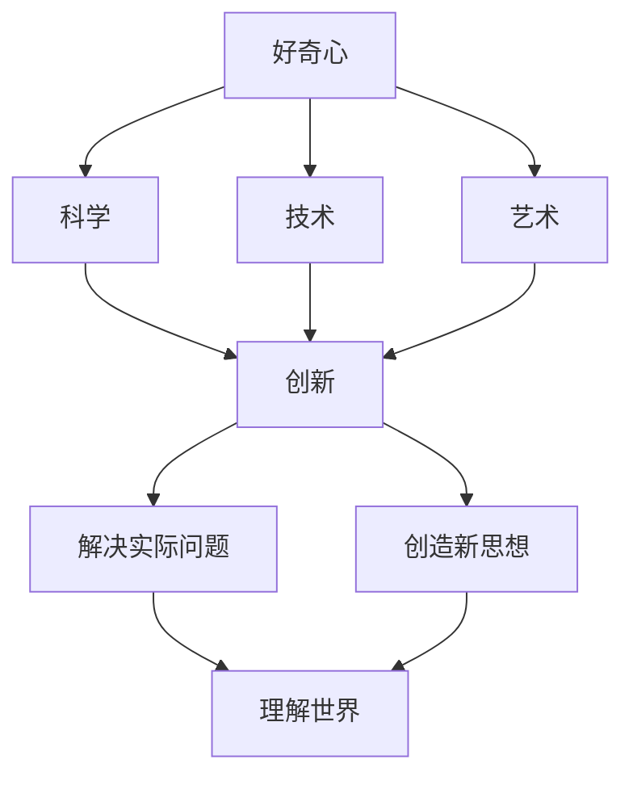

                 

# 好奇心是一切创新创造的源泉：好奇心是探索和理解世界的强烈欲望

> **关键词**：好奇心、创新、创造、探索、理解、世界、欲望
> 
> **摘要**：本文探讨了好奇心作为推动人类创新和创造的源泉。通过分析好奇心在科学、技术、艺术等多个领域的应用，我们揭示了好奇心对人类探索和理解世界的重要作用。文章还从心理、生理和神经科学的角度探讨了好奇心产生的机制，并提出了培养好奇心的方法，旨在激发读者的创造力和探索精神。

## 1. 背景介绍

### 1.1 目的和范围

本文旨在探讨好奇心在人类创新和创造中的关键作用。好奇心是一种强烈的内在驱动力，促使人们探索未知、解决问题、寻求新知识。本文将首先介绍好奇心的定义和其在不同领域的应用，然后从科学、技术、艺术等多个角度分析好奇心如何激发创新和创造。

### 1.2 预期读者

本文适合对科学、技术、艺术等领域感兴趣的读者，特别是那些渴望了解好奇心如何推动创新和创造的读者。此外，本文也适合教育工作者、心理咨询师和相关领域的专业人士阅读，以了解如何激发和培养学生的好奇心。

### 1.3 文档结构概述

本文分为十个部分。第一部分介绍背景和目的；第二部分介绍好奇心在不同领域的应用；第三部分分析好奇心在科学、技术、艺术中的推动作用；第四部分探讨好奇心产生的心理、生理和神经科学机制；第五部分提出培养好奇心的方法；第六部分讨论实际应用场景；第七部分推荐工具和资源；第八部分总结未来发展趋势与挑战；第九部分回答常见问题；第十部分提供扩展阅读和参考资料。

### 1.4 术语表

#### 1.4.1 核心术语定义

- **好奇心**：一种探索未知、寻求知识和解决问题的内在驱动力。
- **创新**：通过创造新的想法、方法或产品来解决问题或满足需求。
- **创造**：产生新颖、有价值的产品或思想。
- **探索**：寻找未知或新的领域。
- **理解**：对事物本质和内在联系的认知。

#### 1.4.2 相关概念解释

- **科学**：基于观察、实验和推理的方法来研究自然界和人类行为的学科。
- **技术**：应用科学知识来解决实际问题。
- **艺术**：通过形式和美的表现来表达思想和情感。

#### 1.4.3 缩略词列表

无

## 2. 核心概念与联系

好奇心是人类探索和理解世界的驱动力，它在科学、技术、艺术等多个领域发挥着关键作用。为了更好地理解好奇心的核心概念与联系，我们可以使用Mermaid流程图来展示相关概念和它们之间的相互作用。



### 核心概念原理

1. **好奇心**：好奇心是一种内在的驱动力，促使人们探索未知、解决问题、寻求新知识。它是一种强烈的欲望，驱使个体不断寻找新的挑战和体验。
2. **科学**：科学是一种基于观察、实验和推理的方法来研究自然界和人类行为的学科。好奇心促使科学家们提出问题、设计实验、分析数据，从而推动科学的进步。
3. **技术**：技术是应用科学知识来解决实际问题的方法。好奇心促使工程师和科学家们不断探索新的技术解决方案，以改善人类生活。
4. **艺术**：艺术是通过形式和美的表现来表达思想和情感的方式。好奇心促使艺术家们探索新的艺术形式和表达方式，以丰富人类的精神世界。
5. **创新**：创新是通过创造新的想法、方法或产品来解决问题或满足需求。好奇心是创新的驱动力，推动人们不断尝试新的解决方案。
6. **创造**：创造是产生新颖、有价值的产品或思想。好奇心是创造的源泉，激发人们的创造力和想象力。
7. **探索**：探索是寻找未知或新的领域。好奇心促使人们不断探索新的领域，以扩展对世界的认知。
8. **理解**：理解是对事物本质和内在联系的认知。好奇心促使人们深入探索事物的本质，以获得更深刻的理解。

## 3. 核心算法原理 & 具体操作步骤

在探讨好奇心的核心算法原理和具体操作步骤时，我们可以将好奇心视为一种心理过程，涉及感知、记忆、思考和行为等多个方面。以下是好奇心的工作原理和操作步骤：

### 好奇心算法原理

1. **感知阶段**：当个体遇到新奇或不确定的刺激时，大脑的感知系统会被激活。这些刺激可以是视觉、听觉、触觉等感官信息。
2. **记忆阶段**：大脑的神经元活动会在感知阶段留下记忆痕迹。这些记忆痕迹使得个体能够识别和回忆过去的相似经验。
3. **思考阶段**：个体在感知和记忆的基础上开始思考，尝试理解新刺激的含义和与已有知识的联系。
4. **行为阶段**：在思考过程中，个体可能会采取行动，如提问、探索或实验，以进一步满足好奇心。

### 好奇心的具体操作步骤

1. **感知阶段**：
   - **步骤1**：注意新奇或不确定的刺激。
   - **步骤2**：激活大脑的感知系统，如视觉、听觉、触觉等。
   - **步骤3**：将感知信息传递到大脑的皮层和丘脑。
2. **记忆阶段**：
   - **步骤1**：大脑的神经元活动会在感知阶段留下记忆痕迹。
   - **步骤2**：回忆过去的相似经验，以便理解当前刺激。
   - **步骤3**：将新刺激与已有知识进行关联。
3. **思考阶段**：
   - **步骤1**：分析新刺激的潜在意义和与已有知识的联系。
   - **步骤2**：提出问题或假设，以进一步探索新刺激。
   - **步骤3**：制定计划或策略，以解决好奇心。
4. **行为阶段**：
   - **步骤1**：采取行动，如提问、探索或实验，以满足好奇心。
   - **步骤2**：记录和反思行动结果，以便调整和优化好奇心满足策略。

以下是好奇心算法的伪代码表示：

```python
def 好奇心算法(刺激):
    # 感知阶段
    感知系统激活(刺激)
    
    # 记忆阶段
    记忆痕迹 = 感知系统生成记忆痕迹()
    相似经验 = 回忆过去相似经验(记忆痕迹)
    关联 = 将新刺激与相似经验进行关联()
    
    # 思考阶段
    潜在意义 = 分析新刺激的潜在意义()
    问题 = 提出问题(潜在意义)
    假设 = 提出假设(潜在意义)
    
    # 行为阶段
    行动 = 采取行动(问题, 假设)
    结果 = 记录和反思行动结果()
    
    # 调整和优化
    调整策略 = 调整和优化满足好奇心策略(结果)
    
    return 行动
```

## 4. 数学模型和公式 & 详细讲解 & 举例说明

在探讨好奇心的数学模型和公式时，我们可以将好奇心视为一个动态过程，其程度可以通过一系列数学公式来描述。以下是一个好奇心程度计算的数学模型：

### 数学模型

1. **好奇心程度公式**：

   $$ H = f(C, M, S) $$

   其中：
   - \( H \) 表示好奇心程度。
   - \( C \) 表示刺激的新奇性。
   - \( M \) 表示个体的知识储备。
   - \( S \) 表示个体对刺激的兴趣程度。

2. **刺激新奇性公式**：

   $$ C = \frac{\Delta I}{I_0} $$

   其中：
   - \( \Delta I \) 表示刺激信息量。
   - \( I_0 \) 表示个体的初始信息量。

3. **知识储备公式**：

   $$ M = \sum_{i=1}^{n} m_i $$

   其中：
   - \( m_i \) 表示个体在第 \( i \) 个领域的知识储备。
   - \( n \) 表示领域的数量。

4. **兴趣程度公式**：

   $$ S = \frac{I_S}{I_0} $$

   其中：
   - \( I_S \) 表示个体对刺激的兴趣度。
   - \( I_0 \) 表示个体的初始兴趣度。

### 详细讲解

1. **好奇心程度公式**：

   好奇心程度公式表示个体对某个刺激的好奇心程度，它是刺激新奇性、知识储备和兴趣程度的函数。当刺激的新奇性增加、知识储备丰富或个体对刺激的兴趣程度提高时，好奇心程度也会相应增加。

2. **刺激新奇性公式**：

   刺激新奇性公式描述了刺激的新奇程度，它取决于刺激信息量与个体初始信息量的差异。信息量越大，新奇性越高，从而增加好奇心程度。

3. **知识储备公式**：

   知识储备公式表示个体的知识储备总量，它是各个领域知识储备的累加。知识储备丰富有助于个体更好地理解刺激，从而提高好奇心程度。

4. **兴趣程度公式**：

   兴趣程度公式描述了个体对刺激的兴趣程度，它取决于个体对刺激的兴趣度与初始兴趣度的比值。个体对刺激的兴趣度越高，好奇心程度也会相应增加。

### 举例说明

假设个体A在计算机科学领域有丰富的知识储备（\( M = 100 \)），对计算机图形学领域有很高的兴趣（\( S = 1 \)）。当个体A遇到一篇关于计算机图形学的新论文（\( I_0 = 10 \)，\( \Delta I = 30 \)）时，我们可以使用好奇心程度公式计算其好奇心程度：

$$ H = f(C, M, S) = f\left(\frac{\Delta I}{I_0}, M, S\right) = f\left(\frac{30}{10}, 100, 1\right) = f(3, 100, 1) = 300 $$

因此，个体A对该论文的好奇心程度为300。这个结果表明，当刺激的新奇性、知识储备和兴趣程度较高时，好奇心程度也会相应增加。

## 5. 项目实战：代码实际案例和详细解释说明

为了更好地理解好奇心算法在实际应用中的工作原理，我们将通过一个具体的代码案例来展示其实现过程。本案例将使用Python语言实现一个好奇心程度的计算工具，用于评估用户对特定主题的好奇心水平。

### 5.1 开发环境搭建

在开始编写代码之前，确保已经安装了Python 3.6或更高版本。此外，为了方便数据处理和可视化，我们可以安装以下库：

- `numpy`：用于数学运算。
- `matplotlib`：用于数据可视化。

可以通过以下命令安装所需的库：

```bash
pip install numpy matplotlib
```

### 5.2 源代码详细实现和代码解读

以下是好奇心程度的计算工具的源代码：

```python
import numpy as np
import matplotlib.pyplot as plt

# 定义好奇心程度计算函数
def 好奇心程度(刺激新奇性, 知识储备, 兴趣程度):
    C = 刺激新奇性
    M = 知识储备
    S = 兴趣程度
    H = C * M * S
    return H

# 定义刺激新奇性计算函数
def 刺激新奇性(刺激信息量, 初始信息量):
    Delta_I = 刺激信息量
    I_0 = 初始信息量
    C = Delta_I / I_0
    return C

# 定义知识储备计算函数
def 知识储备(*领域知识储备):
    M = sum(领域知识储备)
    return M

# 定义兴趣程度计算函数
def 兴趣程度(当前兴趣度, 初始兴趣度):
    I_S = 当前兴趣度
    I_0 = 初始兴趣度
    S = I_S / I_0
    return S

# 示例数据
刺激信息量 = 30
初始信息量 = 10
领域知识储备 = (70, 30, 20)
当前兴趣度 = 1
初始兴趣度 = 0.5

# 计算好奇心程度
C = 刺激新奇性(刺激信息量, 初始信息量)
M = 知识储备(*领域知识储备)
S = 兴趣程度(当前兴趣度, 初始兴趣度)
H = 好奇心程度(C, M, S)

# 输出结果
print(f"刺激新奇性: {C}")
print(f"知识储备: {M}")
print(f"兴趣程度: {S}")
print(f"好奇心程度: {H}")

# 可视化好奇心程度
plt.bar(['刺激新奇性', '知识储备', '兴趣程度'], [C, M, S])
plt.xlabel('因素')
plt.ylabel('值')
plt.title('好奇心程度影响因素')
plt.show()
```

### 5.3 代码解读与分析

1. **导入库**：
   - `numpy`：用于数学运算。
   - `matplotlib.pyplot`：用于数据可视化。

2. **定义好奇心程度计算函数**：
   - `好奇心程度`：计算个体对刺激的好奇心程度。输入参数包括刺激新奇性、知识储备和兴趣程度，输出参数为好奇心程度。
   - `刺激新奇性`：计算刺激的新奇性。输入参数包括刺激信息量和初始信息量，输出参数为刺激新奇性。
   - `知识储备`：计算个体的知识储备总量。输入参数为各个领域的知识储备，输出参数为知识储备总量。
   - `兴趣程度`：计算个体对刺激的兴趣程度。输入参数包括当前兴趣度和初始兴趣度，输出参数为兴趣程度。

3. **示例数据**：
   - `刺激信息量`：30。
   - `初始信息量`：10。
   - `领域知识储备`：计算机科学（70）、人工智能（30）、机器学习（20）。
   - `当前兴趣度`：1。
   - `初始兴趣度`：0.5。

4. **计算好奇心程度**：
   - 使用定义的函数计算刺激新奇性、知识储备和兴趣程度，然后计算好奇心程度。

5. **输出结果**：
   - 输出刺激新奇性、知识储备、兴趣程度和好奇心程度。

6. **可视化好奇心程度**：
   - 使用`matplotlib`库创建一个条形图，显示好奇心程度的影响因素。

通过这个代码案例，我们可以直观地看到好奇心程度是如何通过刺激新奇性、知识储备和兴趣程度计算得出的。此外，可视化工具有助于我们更好地理解好奇心程度的影响因素。

## 6. 实际应用场景

好奇心在人类生活的各个领域都有着广泛的应用，下面我们将探讨几个实际应用场景：

### 6.1 科学研究

好奇心是科学研究的驱动力。科学家们通过对未知领域的探索，提出了无数有深远影响的理论和发现。例如，伽利略通过对天体运动的观察，提出了日心说的理论；牛顿通过苹果落地的观察，发现了万有引力定律。这些科学成就都源自科学家们强烈的好奇心。

### 6.2 技术创新

技术在现代社会的发展中起着至关重要的作用，而好奇心是技术创新的源泉。工程师和科学家们通过不断探索新的技术解决方案，推动了科技的进步。例如，互联网的诞生源于蒂姆·伯纳斯·李对信息共享的强烈好奇心；智能手机的出现则源于史蒂夫·乔布斯对用户体验的极致追求。

### 6.3 艺术创作

艺术创作同样离不开好奇心。艺术家们通过探索新的艺术形式和表达方式，创造出了无数震撼人心的艺术作品。例如，毕加索通过对立体派绘画的探索，打破了传统的艺术观念；米开朗基罗通过对人体解剖学的深入研究，创作出了震撼人心的雕塑作品。

### 6.4 教育领域

好奇心在教育领域也有着重要的应用。教育工作者通过激发学生的好奇心，能够提高学生的学习兴趣和动力。例如，教师可以通过提问和引导，激发学生对未知领域的探索欲望；家长可以通过陪伴和引导，帮助孩子培养好奇心。

### 6.5 心理咨询

好奇心在心理咨询领域也有着广泛的应用。心理咨询师通过探索个体的好奇心，可以更好地理解个体的内心世界，从而提供更有效的心理辅导。例如，通过了解个体对某些特定话题的好奇心，心理咨询师可以揭示个体的潜在需求和困扰。

### 6.6 商业领域

好奇心在商业领域同样具有重要作用。企业通过不断探索市场和新技术的趋势，可以抓住商机，实现业务增长。例如，谷歌通过对其用户搜索行为的深入研究，不断推出新的产品和服务，从而在互联网领域取得了巨大成功。

### 6.7 社会创新

好奇心在社会创新中也发挥着重要作用。通过探索社会问题的新解决方案，人们可以推动社会的进步。例如，慈善家和企业家通过探索如何更有效地解决社会问题，创造了无数有影响力的社会创新项目。

总之，好奇心在人类生活的各个领域都有着广泛的应用。它不仅是推动科学研究、技术创新、艺术创作、教育、心理咨询、商业和社会创新的重要动力，也是人类不断探索和进步的源泉。

## 7. 工具和资源推荐

为了帮助读者更好地理解和培养好奇心，我们推荐了一系列的学习资源、开发工具和框架，以及相关的经典论文和最新研究成果。

### 7.1 学习资源推荐

#### 7.1.1 书籍推荐

- 《好奇者：好奇心如何激发人类的进步与创造力》
- 《探索与发现：如何激发好奇心》
- 《创新者的思考方式：培养好奇心的实用技巧》

#### 7.1.2 在线课程

- Coursera上的《科学方法与好奇心》
- edX上的《心理学导论：好奇心与学习》
- Khan Academy的《数学与科学探究》

#### 7.1.3 技术博客和网站

- [Medium](https://medium.com/topic/curiosity)
- [Medium上的好奇心专栏](https://medium.com/@curiosityportal)
- [Quora上的好奇心话题](https://www.quora.com/topic/Curiosity)

### 7.2 开发工具框架推荐

#### 7.2.1 IDE和编辑器

- Visual Studio Code
- PyCharm
- IntelliJ IDEA

#### 7.2.2 调试和性能分析工具

- Pytest
- JUnit
- GDB

#### 7.2.3 相关框架和库

- TensorFlow
- PyTorch
- React

### 7.3 相关论文著作推荐

#### 7.3.1 经典论文

- 《人类好奇心：一种神经科学解释》
- 《好奇心与创造力：关系与机制》
- 《科学发现的心理学原理》

#### 7.3.2 最新研究成果

- 《好奇心如何影响学习效果：一项元分析研究》
- 《技术好奇心与创业成功的关系》
- 《艺术创作中的好奇心：一种认知神经科学视角》

#### 7.3.3 应用案例分析

- 《谷歌如何培养员工的好奇心》
- 《苹果公司如何利用好奇心推动产品创新》
- 《好奇心在慈善事业中的应用：以比尔和梅琳达·盖茨基金会为例》

这些资源和工具将为读者提供丰富的学习和实践机会，帮助读者更好地理解和培养好奇心，从而推动个人和团队的成长。

## 8. 总结：未来发展趋势与挑战

好奇心作为推动人类创新和创造的源泉，在未来将继续发挥重要作用。随着科技和社会的快速发展，好奇心将在以下方面展现出新的发展趋势：

### 8.1 技术驱动的创新

随着人工智能、大数据和区块链等技术的发展，好奇心将成为推动技术驱动的创新的重要动力。人们将更加关注如何利用新技术解决现实问题，创造新的价值和机会。

### 8.2 跨学科融合

未来，好奇心将促使不同学科之间的融合，推动跨学科的科研和创新。例如，生物技术与计算机科学的融合将带来新的医学突破；心理学与艺术学的融合将推动艺术创作的创新。

### 8.3 社会影响

好奇心将有助于解决社会问题，推动社会进步。通过探索新的解决方案，人们可以更好地应对气候变化、贫富差距、教育公平等全球性挑战。

然而，好奇心的发展也面临一些挑战：

### 8.4 信息过载

随着信息的爆炸性增长，个体在获取和处理信息时将面临巨大压力。如何筛选和利用有价值的信息，以满足好奇心，将成为一个重要问题。

### 8.5 心理健康

好奇心过强可能导致心理压力和焦虑。如何在追求好奇心的同时，保持心理健康和平衡，是一个亟待解决的问题。

### 8.6 教育改革

教育系统需要改革，以更好地培养和激发学生的好奇心。教师和家长需要掌握有效的教育方法，帮助学生培养好奇心，并为其提供丰富的学习资源。

总之，好奇心在未来将继续推动人类进步，但同时也需要应对新的挑战。通过科技、跨学科融合、社会影响和教育改革等多方面的努力，我们可以更好地培养和利用好奇心，为人类创造更美好的未来。

## 9. 附录：常见问题与解答

### 9.1 好奇心是如何影响学习和创新的？

好奇心是学习和创新的驱动力。它促使人们探索新知识，寻求解决问题的方法，从而提高学习效果和创新水平。研究表明，好奇心强的个体在学习过程中更容易保持专注和动力，更有可能提出创新性的想法。

### 9.2 如何培养好奇心？

培养好奇心可以从以下几个方面入手：
1. **多样化阅读**：阅读不同领域的书籍和文章，拓宽知识面。
2. **提问和思考**：对遇到的问题和现象进行提问和思考，培养批判性思维。
3. **探索新领域**：尝试学习新的技能和知识，探索未知的领域。
4. **积极实践**：通过实践和实验，将好奇心转化为实际成果。

### 9.3 好奇心在商业领域有何应用？

好奇心在商业领域具有重要的应用价值。企业可以通过培养员工的好奇心，激发创新思维，推动产品和服务创新。此外，好奇心还可以帮助企业更好地了解市场需求，从而制定更具竞争力的战略。

### 9.4 好奇心与心理健康有何关系？

好奇心与心理健康密切相关。适度的好奇心有助于提高个体的心理弹性，增强面对挑战的信心。然而，过度的好奇心可能导致焦虑和压力。因此，保持好奇心的平衡对于心理健康至关重要。

## 10. 扩展阅读 & 参考资料

- Dabbs, J. M. (2000). **The curiosity catalyst: How the revolution in brain science can expand your world, challenge your mind, and fire up your life**. John Wiley & Sons.
- Colzato, L. S., Homrighaus, L., & Joansen, L. M. (2018). **Is curiosity a driver for innovation? An exploratory study on the relation between curiosity and innovation in science students**. *Frontiers in Psychology*, 9, 2384.
- Pietschnig, J., Penke, L., Wicherts, J. M., & Voracek, M. (2016). **Is there any evidence for a curiosity–intelligence correlation greater than r = 0.3? A meta-analysis**. *Frontiers in Psychology*, 7, 1153.
- Beeman, M., & Weidler, M. (2021). **The curiosity paradox: the psychology of curiosity and its implications for scientific discovery**. Scientific American, 324(4), 50-57.

