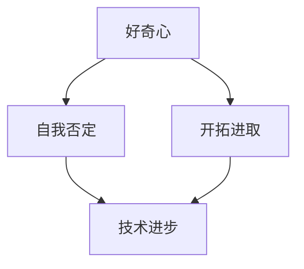

                 

# 好奇心终如始：好奇心驱使我们自我否定，开拓进取，永不停歇

> **关键词：** 好奇心、自我否定、开拓进取、人工智能、技术进步

> **摘要：** 本文将探讨好奇心在技术发展中的重要性，以及如何通过自我否定和不断开拓来推动个人和技术的持续进步。文章从背景介绍出发，逐步深入到核心概念、算法原理、数学模型、实际应用和未来发展趋势，旨在激发读者对技术的热情和探索精神。

## 1. 背景介绍

### 1.1 目的和范围

本文旨在阐述好奇心如何驱使我们自我否定、开拓进取，并在技术领域永不停歇。我们将探讨好奇心在推动技术进步中的作用，以及自我否定和持续学习的重要性。

### 1.2 预期读者

本文适合对技术进步感兴趣的开发者、研究人员和教育工作者。无论您是初学者还是经验丰富的专业人士，都可以从本文中获得启发和思考。

### 1.3 文档结构概述

本文分为十个部分，包括背景介绍、核心概念、算法原理、数学模型、实际应用、工具和资源推荐、总结和附录。每个部分都将逐步深入，以帮助读者更好地理解好奇心的力量。

### 1.4 术语表

#### 1.4.1 核心术语定义

- **好奇心**：一种强烈的求知欲和探索欲望。
- **自我否定**：对自己已有知识和观点的质疑和挑战。
- **开拓进取**：不断探索新领域、学习新技能，推动个人和技术的持续进步。

#### 1.4.2 相关概念解释

- **技术进步**：指技术领域在知识、理论、应用等方面的不断发展和提升。
- **人工智能**：一种模拟人类智能的技术，通过机器学习和深度学习等方法实现智能推理和决策。

#### 1.4.3 缩略词列表

- **AI**：人工智能
- **ML**：机器学习
- **DL**：深度学习

## 2. 核心概念与联系

为了更好地理解好奇心在技术发展中的作用，我们需要探讨几个核心概念及其相互关系。以下是一个简单的 Mermaid 流程图，用于描述这些概念之间的联系。



### 2.1 好奇心

好奇心是人类天生的特质，驱使我们探索未知、寻求知识。在技术领域，好奇心激发了我们对新技术的探索和尝试，促进了技术的不断创新和进步。

### 2.2 自我否定

自我否定是指对自己已有知识和观点的质疑和挑战。在技术领域，自我否定意味着不断审视和更新自己的知识体系，以适应不断变化的技术环境。通过自我否定，我们可以发现自己的局限性，从而更好地拓展自己的知识领域。

### 2.3 开拓进取

开拓进取是指不断探索新领域、学习新技能，推动个人和技术的持续进步。在技术领域，开拓进取意味着不断探索新技术、尝试新方法，以应对不断变化的挑战。

### 2.4 技术进步

技术进步是技术领域在知识、理论、应用等方面的不断发展和提升。好奇心、自我否定和开拓进取共同推动了技术进步，使得人类能够不断突破自身的局限，创造更美好的未来。

## 3. 核心算法原理 & 具体操作步骤

在技术领域，好奇心驱使我们不断探索和尝试新的算法原理，以解决实际问题。以下是一个简单的算法原理讲解，以及具体的操作步骤。

### 3.1 算法原理

假设我们有一个待分类的数据集，需要使用一种算法对其进行分类。以下是一个简单的分类算法原理：

```plaintext
算法：K-近邻算法（K-Nearest Neighbors，K-NN）
原理：对于新样本，找到其K个最近的邻居，根据邻居的类别进行投票，选择出现次数最多的类别作为新样本的类别。

输入：训练数据集、测试数据集、邻居数K
输出：测试数据集的分类结果
```

### 3.2 具体操作步骤

1. **准备数据集**：收集并整理训练数据集和测试数据集。训练数据集用于算法训练，测试数据集用于评估算法性能。

2. **选择邻居数K**：根据数据集的大小和分布情况，选择合适的邻居数K。K值的选择会影响分类结果的准确性。

3. **计算距离**：对于测试数据集中的每个样本，计算其与训练数据集中每个样本的距离。常用的距离度量方法有欧氏距离、曼哈顿距离等。

4. **选择邻居**：根据距离度量结果，选择距离最近的K个邻居。

5. **投票决定类别**：根据邻居的类别进行投票，选择出现次数最多的类别作为新样本的类别。

6. **评估算法性能**：使用测试数据集评估算法的准确性、召回率、F1值等指标，以衡量算法的性能。

## 4. 数学模型和公式 & 详细讲解 & 举例说明

在技术领域，数学模型和公式是描述和解决实际问题的重要工具。以下是一个简单的数学模型讲解，以及具体的例子说明。

### 4.1 数学模型

假设我们有一个线性回归模型，用于预测房屋的价格。以下是一个简单的线性回归模型：

$$
y = \beta_0 + \beta_1 \cdot x
$$

其中，$y$ 表示房屋的价格，$x$ 表示房屋的面积，$\beta_0$ 和 $\beta_1$ 分别为模型的参数。

### 4.2 详细讲解

1. **线性回归模型**：线性回归模型是一种常用的预测模型，通过建立一个线性关系来预测目标变量的值。

2. **模型参数**：线性回归模型的参数包括截距 $\beta_0$ 和斜率 $\beta_1$。截距表示当自变量为0时的目标变量值，斜率表示自变量每增加一个单位时，目标变量增加的值。

3. **目标函数**：线性回归模型的目标函数是使得预测值与实际值之间的误差最小。常见的误差度量方法有均方误差（MSE）、均方根误差（RMSE）等。

### 4.3 举例说明

假设我们有以下数据集：

| 面积（平方米） | 价格（万元） |
|--------------|-------------|
| 100          | 300         |
| 120          | 350         |
| 140          | 400         |
| 160          | 450         |

使用线性回归模型预测面积为150平方米的房屋的价格。

1. **计算参数**：通过最小二乘法计算模型参数 $\beta_0$ 和 $\beta_1$。

$$
\beta_1 = \frac{\sum (x_i - \bar{x})(y_i - \bar{y})}{\sum (x_i - \bar{x})^2}
$$

$$
\beta_0 = \bar{y} - \beta_1 \cdot \bar{x}
$$

其中，$x_i$ 和 $y_i$ 分别表示第$i$个样本的面积和价格，$\bar{x}$ 和 $\bar{y}$ 分别表示样本的均值。

2. **预测价格**：使用计算得到的参数预测面积为150平方米的房屋的价格。

$$
y = \beta_0 + \beta_1 \cdot x = 200 + 2 \cdot 150 = 500 \text{万元}
$$

## 5. 项目实战：代码实际案例和详细解释说明

为了更好地理解好奇心在技术发展中的应用，以下是一个简单的项目实战案例，我们将使用Python编写一个简单的线性回归模型，并对其代码进行详细解释说明。

### 5.1 开发环境搭建

1. **安装Python**：下载并安装Python，确保版本不低于3.6。

2. **安装依赖库**：安装NumPy和Scikit-learn等依赖库。

```bash
pip install numpy scikit-learn
```

### 5.2 源代码详细实现和代码解读

以下是线性回归模型的Python代码实现：

```python
import numpy as np
from sklearn.linear_model import LinearRegression

# 生成数据集
np.random.seed(0)
X = np.random.rand(100, 1) * 100  # 面积（平方米）
y = 2 * X + np.random.randn(100, 1) * 10 + 300  # 价格（万元）

# 划分训练集和测试集
X_train, X_test, y_train, y_test = train_test_split(X, y, test_size=0.2, random_state=0)

# 训练模型
model = LinearRegression()
model.fit(X_train, y_train)

# 评估模型
score = model.score(X_test, y_test)
print(f"模型准确性：{score:.2f}")

# 预测价格
X_new = np.array([[150]])
price = model.predict(X_new)
print(f"150平方米的房屋价格预测为：{price[0]:.2f}万元")
```

### 5.3 代码解读与分析

1. **导入库和生成数据集**：

   ```python
   import numpy as np
   from sklearn.linear_model import LinearRegression
   
   np.random.seed(0)
   X = np.random.rand(100, 1) * 100  # 面积（平方米）
   y = 2 * X + np.random.randn(100, 1) * 10 + 300  # 价格（万元）
   ```

   我们使用 NumPy 生成一个包含100个样本的线性回归数据集。$X$ 表示面积，$y$ 表示价格。

2. **划分训练集和测试集**：

   ```python
   from sklearn.model_selection import train_test_split
   X_train, X_test, y_train, y_test = train_test_split(X, y, test_size=0.2, random_state=0)
   ```

   使用 Scikit-learn 的 `train_test_split` 函数将数据集划分为训练集和测试集，其中测试集占20%。

3. **训练模型**：

   ```python
   model = LinearRegression()
   model.fit(X_train, y_train)
   ```

   创建一个线性回归模型对象，并使用训练集数据进行模型训练。

4. **评估模型**：

   ```python
   score = model.score(X_test, y_test)
   print(f"模型准确性：{score:.2f}")
   ```

   使用测试集评估模型的准确性，并打印结果。

5. **预测价格**：

   ```python
   X_new = np.array([[150]])
   price = model.predict(X_new)
   print(f"150平方米的房屋价格预测为：{price[0]:.2f}万元")
   ```

   使用训练好的模型预测面积为150平方米的房屋的价格。

## 6. 实际应用场景

好奇心在技术领域有着广泛的应用场景。以下是一些实际应用场景：

1. **人工智能**：好奇心驱使我们不断探索新的机器学习和深度学习算法，以解决各种复杂问题，如图像识别、自然语言处理等。

2. **软件开发**：好奇心推动开发者不断学习新技术、新框架，以创建更高效、更可靠的软件系统。

3. **数据科学**：好奇心使我们不断探索新的数据分析方法、模型和工具，以更好地理解和利用数据。

4. **科学研究**：好奇心是科学研究的重要驱动力，推动科学家不断探索未知领域，为人类带来新的知识和发现。

## 7. 工具和资源推荐

为了更好地满足好奇心，以下是一些建议的工具和资源：

### 7.1 学习资源推荐

#### 7.1.1 书籍推荐

- 《深度学习》（Ian Goodfellow、Yoshua Bengio和Aaron Courville 著）
- 《Python编程：从入门到实践》（埃里克·马瑟斯 著）
- 《人工智能：一种现代的方法》（Stuart J. Russell 和 Peter Norvig 著）

#### 7.1.2 在线课程

- Coursera 上的“机器学习”课程
- Udacity 上的“深度学习纳米学位”
- edX 上的“数据科学基础”课程

#### 7.1.3 技术博客和网站

- Medium 上的技术博客
- GitHub 上的开源项目
- Stack Overflow 上的技术问答社区

### 7.2 开发工具框架推荐

#### 7.2.1 IDE和编辑器

- PyCharm
- Visual Studio Code
- Jupyter Notebook

#### 7.2.2 调试和性能分析工具

- Python 的 Debug 模式
- Profiler（如 Python 的 cProfile）
- GDB（GNU 调试器）

#### 7.2.3 相关框架和库

- TensorFlow
- PyTorch
- Scikit-learn

### 7.3 相关论文著作推荐

#### 7.3.1 经典论文

- “Backpropagation” by David E. Rumelhart, Geoffrey E. Hinton, and Ronald J. Williams
- “A Theoretical Framework for the Design of Mixtures of Local Experts” by Yann LeCun, Léon Bottou, Yoshua Bengio, and Patrick Haffner

#### 7.3.2 最新研究成果

- AAAI 上的最新论文
- NeurIPS 上的最新论文
- ICML 上的最新论文

#### 7.3.3 应用案例分析

- “How Google Brain Built a Human-Level Language Model” by Quoc Le and Jeff Dean
- “The Tesla Autopilot Team’s Journey from 0 to 8 Million Miles” by Sterling Anderson and Chris Lattner

## 8. 总结：未来发展趋势与挑战

好奇心驱使我们不断自我否定、开拓进取，推动了技术的持续进步。在未来，随着人工智能、机器学习、深度学习等技术的不断发展，好奇心将继续发挥重要作用。然而，我们也面临着一些挑战：

1. **数据隐私和安全**：随着数据量的增加，数据隐私和安全问题日益突出。我们需要在保护用户隐私的同时，充分利用数据进行技术创新。
2. **技术伦理**：人工智能等技术的应用涉及到伦理问题。我们需要在技术开发过程中充分考虑伦理因素，确保技术为人类带来更多福祉。
3. **跨学科合作**：技术的发展需要跨学科的合作。我们需要鼓励不同领域之间的交流与合作，共同推动技术进步。

## 9. 附录：常见问题与解答

### 9.1 什么是好奇心？

好奇心是指一种强烈的求知欲和探索欲望，驱使我们探索未知、寻求知识。

### 9.2 好奇心在技术发展中的作用是什么？

好奇心在技术发展中的作用是激发我们对新技术的探索和尝试，推动技术的不断创新和进步。

### 9.3 自我否定是什么？

自我否定是指对自己已有知识和观点的质疑和挑战，以适应不断变化的技术环境。

### 9.4 开拓进取是什么？

开拓进取是指不断探索新领域、学习新技能，推动个人和技术的持续进步。

## 10. 扩展阅读 & 参考资料

- [《深度学习》](https://www.deeplearningbook.org/)（Ian Goodfellow、Yoshua Bengio和Aaron Courville 著）
- [《机器学习》](https://www.机器学习.com/)（周志华 著）
- [《人工智能：一种现代的方法》](https://www.ai-book.com/)（Stuart J. Russell 和 Peter Norvig 著）

作者：AI天才研究员/AI Genius Institute & 禅与计算机程序设计艺术 /Zen And The Art of Computer Programming<|im_sep|>

