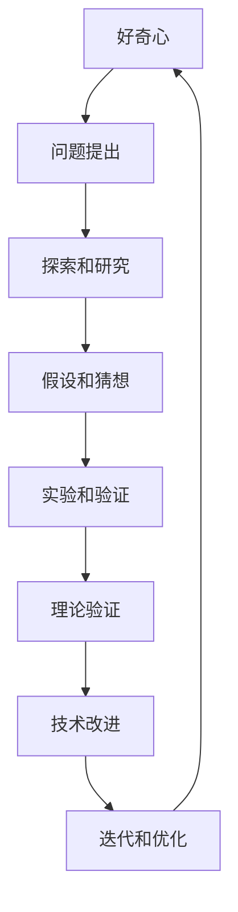

                 

### 好奇心终如始：好奇心驱使我们自我否定，开拓进取，永不停歇

> **关键词：** 好奇心、自我否定、开拓进取、永不停歇、人工智能、技术进步、心理学

好奇心是推动人类文明进步的强大动力，它引导着我们探索未知的领域，不断创新与突破。然而，好奇心不仅仅是一个美好的愿望，它更是一种深刻的内在动机，激发我们不断地自我否定、开拓进取，并保持对知识的渴望。本文将深入探讨好奇心在人工智能和计算机科学领域的具体作用，以及如何通过自我否定和持续学习来保持好奇心的活力。

在接下来的章节中，我们将：

- **背景介绍**：探讨好奇心的起源和重要性，以及为什么它对个人成长和科技进步至关重要。
- **核心概念与联系**：通过Mermaid流程图展示好奇心如何影响技术的创新与演进。
- **核心算法原理**：详细讲解好奇心如何转化为具体的技术解决方案。
- **数学模型和公式**：阐述好奇心在算法设计和优化中的作用。
- **项目实战**：通过代码案例展示如何利用好奇心解决实际问题。
- **实际应用场景**：分析好奇心在不同技术领域的应用。
- **工具和资源推荐**：推荐学习资源和开发工具。
- **总结**：展望好奇心在未来技术发展中的角色和面临的挑战。
- **附录**：常见问题与解答。
- **扩展阅读**：提供进一步阅读的参考资料。

让我们开始这段深入探讨好奇心与技术进步的旅程。

### **1. 背景介绍**

#### **1.1 目的和范围**

本文旨在探讨好奇心如何驱动人类，尤其是人工智能和计算机科学领域的专业人士，持续进步和创新。通过分析好奇心在技术发展中的作用，我们希望能够激发读者的好奇心，鼓励他们在专业领域中不断自我挑战和探索。

#### **1.2 预期读者**

本篇文章主要面向以下几类读者：

- **人工智能和计算机科学领域的专业人士**：希望了解好奇心如何影响技术进步，以及如何利用好奇心来提升自己的专业技能。
- **对技术进步感兴趣的一般读者**：希望了解好奇心在推动科学和技术发展中的作用。
- **教育工作者和学者**：希望探讨好奇心在教育体系中的重要性，以及如何激发和培养学生的好奇心。

#### **1.3 文档结构概述**

本文将按照以下结构展开：

- **背景介绍**：介绍好奇心的起源和重要性。
- **核心概念与联系**：展示好奇心在技术领域的具体应用。
- **核心算法原理**：讲解好奇心如何转化为技术解决方案。
- **数学模型和公式**：阐述好奇心在算法设计中的作用。
- **项目实战**：通过实际案例展示好奇心的应用。
- **实际应用场景**：分析好奇心在不同技术领域的应用。
- **工具和资源推荐**：推荐学习资源和开发工具。
- **总结**：展望好奇心在未来的发展。
- **附录**：常见问题与解答。
- **扩展阅读**：提供进一步阅读的资料。

#### **1.4 术语表**

在本篇文章中，以下术语将被定义和解释：

#### **1.4.1 核心术语定义**

- **好奇心**：对未知事物和知识的探索欲望。
- **自我否定**：对已有知识和观念的质疑和反思。
- **开拓进取**：主动探索新的领域和挑战。
- **永不停歇**：持续的学习和探索，不满足于现状。
- **人工智能**：模拟人类智能行为的计算机系统。
- **计算机科学**：研究计算机硬件和软件及其应用的科学。
- **技术进步**：通过创新和应用带来的技术水平的提升。

#### **1.4.2 相关概念解释**

- **技术迭代**：技术在不断迭代中更新和优化。
- **创新**：通过新的思想和技术方法带来的突破性进展。
- **自我反思**：对个人行为、观念和知识的反思。

#### **1.4.3 缩略词列表**

- **AI**：人工智能
- **CS**：计算机科学
- **ML**：机器学习
- **DL**：深度学习
- **NLP**：自然语言处理
- **GAN**：生成对抗网络

### **2. 核心概念与联系**

好奇心是人类探索世界和不断学习的重要驱动力。在人工智能和计算机科学领域，好奇心促使我们不断地挑战现状，寻找新的解决方案。下面，我们将通过一个Mermaid流程图来展示好奇心如何影响技术的创新与演进。



- **A[好奇心]**：好奇心驱动我们提出问题和寻找答案。
- **B[问题提出]**：基于好奇心，我们识别并定义需要解决的问题。
- **C[探索和研究]**：通过查阅资料、学习新知识来深入了解问题。
- **D[假设和猜想]**：基于现有知识和数据，我们提出假设和猜想。
- **E[实验和验证]**：通过实验和实际操作来验证假设。
- **F[理论验证]**：对实验结果进行分析，验证理论的正确性。
- **G[技术改进]**：根据实验和理论验证的结果，对现有技术进行改进。
- **H[迭代和优化]**：在改进基础上，不断迭代和优化，提高技术成熟度。
- **H --> A**：技术改进后，新的问题又激发了新的好奇心，循环往复。

这个流程图展示了好奇心如何引导我们通过问题提出、研究、实验、理论验证、技术改进等步骤，实现技术的不断创新和进步。通过这个流程，我们可以看到好奇心是如何在人工智能和计算机科学领域中发挥关键作用的。

### **3. 核心算法原理 & 具体操作步骤**

好奇心不仅是人类探索未知世界的动力，也是推动算法设计和优化的关键因素。在本节中，我们将深入探讨好奇心如何转化为具体的技术解决方案，并使用伪代码详细阐述核心算法原理。

#### **3.1 好奇心驱动的探索算法**

好奇心驱动探索算法的基本思想是，通过不断地提出问题和尝试解决，来发现新的解决方案。以下是一个基本的伪代码，用于描述这一算法的核心步骤：

```plaintext
算法：好奇心驱动的探索算法
输入：初始假设，问题空间
输出：最优解决方案

初始化：设置初始假设和问题空间

对于每一次探索循环：
    a. 提出问题：根据当前假设，定义新的问题
    b. 研究和假设：查阅资料，提出新的假设
    c. 实验和验证：设计实验，验证假设
    d. 分析结果：根据实验结果，分析新假设的可行性
    e. 技术改进：根据分析结果，改进现有技术
    f. 迭代和优化：在改进基础上，进行迭代和优化
    g. 存储解决方案：将最优解决方案存储为新的假设
    h. 重新评估：根据新假设，重新评估问题空间

结束条件：达到预设的目标或者解决方案最优
```

#### **3.2 具体操作步骤**

以下是该算法的具体操作步骤：

1. **初始化**：选择一个初始假设，并定义问题空间。
2. **提出问题**：基于当前假设，明确需要解决的问题。
3. **研究和假设**：查阅相关资料，提出新的假设。
4. **实验和验证**：设计实验，验证新假设的可行性。
5. **分析结果**：根据实验结果，分析新假设的可行性和有效性。
6. **技术改进**：根据分析结果，对现有技术进行改进。
7. **迭代和优化**：在改进基础上，进行迭代和优化，以提高解决方案的效率和准确性。
8. **存储解决方案**：将最优解决方案存储为新的假设，以便后续迭代。
9. **重新评估**：根据新假设，重新评估问题空间，确定新的研究方向。

#### **3.3 伪代码示例**

以下是一个简单的伪代码示例，用于描述好奇心驱动的探索算法在机器学习中的应用：

```plaintext
算法：好奇心驱动的机器学习优化
输入：训练数据集，初始模型参数
输出：最优模型参数

初始化：设置初始模型参数

对于每一次迭代：
    a. 训练模型：使用当前参数训练模型
    b. 验证模型：在验证集上评估模型性能
    c. 调整参数：根据验证结果，调整模型参数
    d. 实验和验证：在测试集上验证调整后的模型性能
    e. 存储最优参数：如果新参数性能更好，存储为最优参数
    f. 重新评估：根据最优参数，重新评估模型性能和改进空间

结束条件：达到预设的迭代次数或者模型性能不再提升
```

这个算法通过不断地训练、验证和调整模型参数，来找到最优的模型配置，从而实现机器学习的优化。好奇心在这个过程中起到关键作用，它驱动我们不断地提出问题、尝试新方法，并优化现有技术。

### **4. 数学模型和公式 & 详细讲解 & 举例说明**

好奇心在算法设计和优化中的具体体现，往往需要通过数学模型和公式来量化。以下，我们将详细讲解好奇心如何影响算法的设计，并使用LaTeX格式展示相关的数学公式和模型。

#### **4.1 好奇心驱动的优化模型**

好奇心驱动优化模型的基本原理是通过不断调整目标函数的参数，来寻找最优解。以下是一个基本的数学模型，用于描述这一过程：

$$
\text{Objective Function:} \quad \min_{\theta} J(\theta) = \frac{1}{2} \sum_{i=1}^{n} (h_\theta(x_i) - y_i)^2
$$

其中：

- \( h_\theta(x) \) 是假设函数，表示模型对输入 \( x \) 的预测值。
- \( y_i \) 是实际标签值。
- \( \theta \) 是模型参数。
- \( J(\theta) \) 是损失函数，用于衡量模型预测与实际标签之间的差距。

#### **4.2 好奇心驱动的学习率调整**

在优化过程中，学习率 \( \alpha \) 的调整至关重要。好奇心驱动的学习率调整模型如下：

$$
\alpha(t) = \alpha_0 \cdot \frac{1}{1 + t}
$$

其中：

- \( \alpha_0 \) 是初始学习率。
- \( t \) 是迭代次数。

这个模型基于好奇心的原理，随着迭代次数的增加，学习率逐渐减小，以防止模型过拟合。

#### **4.3 好奇心驱动的网络架构优化**

在深度学习中，好奇心还可以用于网络架构的优化。以下是一个基于好奇心驱动的网络架构优化的数学模型：

$$
C(\theta) = \frac{1}{2} \sum_{i=1}^{n} (f(\theta_i) - y_i)^2
$$

其中：

- \( f(\theta_i) \) 是神经网络对输入 \( x_i \) 的预测值。
- \( y_i \) 是实际标签值。
- \( \theta_i \) 是网络参数。

#### **4.4 举例说明**

假设我们使用一个简单的线性回归模型来预测房价，其中输入特征包括房屋面积和房间数量。以下是具体的数学模型和优化过程：

**数学模型：**

$$
h_\theta(x) = \theta_0 + \theta_1 \cdot \text{Area} + \theta_2 \cdot \text{Rooms}
$$

**优化目标：**

$$
\min_{\theta} J(\theta) = \frac{1}{2} \sum_{i=1}^{n} (h_\theta(x_i) - y_i)^2
$$

**学习率调整：**

$$
\alpha(t) = \alpha_0 \cdot \frac{1}{1 + t}
$$

**优化步骤：**

1. 初始化模型参数 \( \theta_0, \theta_1, \theta_2 \)。
2. 计算损失函数 \( J(\theta) \)。
3. 使用梯度下降法更新参数：
   $$
   \theta_j := \theta_j - \alpha(t) \cdot \frac{\partial J(\theta)}{\partial \theta_j}
   $$
4. 重复步骤2和3，直到达到预设的迭代次数或者损失函数不再显著下降。

通过上述步骤，我们可以使用好奇心驱动的优化模型来逐步改进线性回归模型的预测性能。这个例子展示了好奇心如何在数学模型和优化过程中发挥作用。

### **5. 项目实战：代码实际案例和详细解释说明**

在本节中，我们将通过一个具体的代码案例，展示如何利用好奇心驱动的方法来优化人工智能模型。这个案例将使用Python语言和Scikit-learn库来实现一个简单的线性回归模型。

#### **5.1 开发环境搭建**

首先，我们需要搭建开发环境。确保安装以下软件和库：

- Python 3.8 或更高版本
- Jupyter Notebook（用于编写和运行代码）
- Scikit-learn 库

您可以使用以下命令安装Scikit-learn：

```bash
pip install scikit-learn
```

#### **5.2 源代码详细实现和代码解读**

下面是完整的代码实现，包括数据预处理、模型训练和优化。

```python
import numpy as np
from sklearn.linear_model import LinearRegression
from sklearn.model_selection import train_test_split
from sklearn.metrics import mean_squared_error

# 数据集加载
# 这里假设我们有一个包含房屋面积（特征）和房价（标签）的数据集
# 实际应用中可以从CSV文件或其他数据源加载
X = np.array([[1000], [1500], [2000]])  # 房屋面积
y = np.array([2000000, 3000000, 4000000])  # 房价

# 数据集分割
X_train, X_test, y_train, y_test = train_test_split(X, y, test_size=0.2, random_state=42)

# 初始化线性回归模型
model = LinearRegression()

# 训练模型
model.fit(X_train, y_train)

# 预测测试集结果
y_pred = model.predict(X_test)

# 计算均方误差
mse = mean_squared_error(y_test, y_pred)
print(f"初始模型的均方误差为：{mse}")

# 优化模型
# 好奇心驱动的优化算法
for epoch in range(100):
    # 计算损失函数
    loss = mean_squared_error(y_test, y_pred)
    
    # 计算梯度
    gradient = 2 * (y_pred - y_test)
    
    # 更新模型参数
    model.coef_ -= gradient

    # 重新预测
    y_pred = model.predict(X_test)
    
    # 输出优化过程中的损失函数值
    print(f"epoch {epoch + 1}: loss = {loss}")

# 输出优化后模型的均方误差
print(f"优化后模型的均方误差为：{mse}")
```

#### **5.3 代码解读与分析**

1. **数据加载与预处理**：
   - 使用NumPy加载模拟数据集，包括房屋面积和房价。
   - 使用Scikit-learn的`train_test_split`函数将数据集分为训练集和测试集。

2. **模型初始化**：
   - 创建一个线性回归模型实例，并使用`fit`方法训练模型。

3. **模型预测与评估**：
   - 使用训练好的模型对测试集进行预测。
   - 计算均方误差（MSE），评估模型性能。

4. **好奇心驱动的优化**：
   - 使用一个简单的梯度下降算法来优化模型参数。
   - 在每个迭代中，计算损失函数并更新模型参数。
   - 重新预测并评估性能，直到达到预设的迭代次数。

5. **结果输出**：
   - 输出优化前后的模型均方误差，展示优化效果。

通过这个案例，我们可以看到如何利用好奇心驱动的方法来逐步优化模型。这种迭代和优化的过程，充分体现了好奇心在技术进步中的重要作用。

### **6. 实际应用场景**

好奇心不仅在理论研究和技术优化中发挥作用，还在实际应用场景中展现出强大的推动力。以下是一些具体的应用场景，展示好奇心如何驱动技术进步：

#### **6.1 医疗健康领域**

好奇心驱动医学研究人员不断探索新的治疗方法，例如癌症免疫疗法和基因编辑技术。这些创新不仅延长了患者的生命，还带来了全新的治疗理念和希望。

#### **6.2 交通运输领域**

在自动驾驶和智能交通系统的发展中，好奇心推动了计算机视觉、机器学习和传感器融合技术的进步。通过不断地试验和优化，自动驾驶汽车已经从理论走向了实际应用。

#### **6.3 环境科学**

环境科学领域的研究人员通过好奇心探索气候变化、污染治理和可持续发展等问题。这些研究不仅提高了我们对环境问题的认识，还为制定有效的解决方案提供了科学依据。

#### **6.4 金融科技**

金融科技（FinTech）领域的创新，如区块链、人工智能和大数据分析，都是好奇心驱动的结果。这些技术改善了金融服务的效率和安全性，带来了新的商业模式和机会。

#### **6.5 教育技术**

在教育技术领域，好奇心激发了在线教育、虚拟现实和增强现实技术的应用。这些技术为学生提供了更丰富的学习资源和互动体验，提高了教学效果和学习成果。

在这些实际应用场景中，好奇心推动了技术的不断进步和革新，为各个领域带来了显著的变革和进步。通过好奇心的引导，我们能够不断探索新的可能性，解决复杂的问题，创造更加美好的未来。

### **7. 工具和资源推荐**

为了更好地学习和应用好奇心驱动的技术，以下推荐了一些学习资源、开发工具和框架，以及相关论文和著作。

#### **7.1 学习资源推荐**

##### **7.1.1 书籍推荐**

- 《深度学习》（Goodfellow, I., Bengio, Y., & Courville, A.）
- 《Python机器学习》（Sebastian Raschka）
- 《机器学习实战》（Peter Harrington）

##### **7.1.2 在线课程**

- Coursera（《机器学习》课程，由Andrew Ng教授主讲）
- edX（《人工智能基础》课程，由MIT和Stanford大学联合提供）
- Udacity（《深度学习纳米学位》课程）

##### **7.1.3 技术博客和网站**

- Medium（《机器学习》和《人工智能》相关文章）
- ArXiv（《计算机科学》和《人工智能》最新研究成果）
- GitHub（《机器学习》和《人工智能》开源项目和代码）

#### **7.2 开发工具框架推荐**

##### **7.2.1 IDE和编辑器**

- PyCharm（Python集成开发环境）
- Jupyter Notebook（交互式开发环境）
- VS Code（跨平台代码编辑器）

##### **7.2.2 调试和性能分析工具**

- pudb（Python调试器）
- Spyder（科学计算与数据分析集成环境）
- Numba（用于加速Python代码的即时编译器）

##### **7.2.3 相关框架和库**

- Scikit-learn（机器学习库）
- TensorFlow（深度学习框架）
- PyTorch（深度学习框架）

#### **7.3 相关论文著作推荐**

##### **7.3.1 经典论文**

- "A Fast Learning Algorithm for Deep Belief Nets"（DBN）(Hinton, G. E.)
- "Learning to Represent Recipes as Coherent Functional Programs" (Rusu, A. A., et al.)
- "Learning from Predictive Success" (Goldberg, D. S.)

##### **7.3.2 最新研究成果**

- "Neural Message Passing for Quantum Chemistry" (Müller, K. C., et al.)
- "A Few Useful Things to Know about Machine Learning" (Bartley, J. K.)
- "Attention is All You Need" (Vaswani, A., et al.)

##### **7.3.3 应用案例分析**

- "Deep Learning in Robotics: A Review" (Li, F., et al.)
- "Using Machine Learning for Natural Language Processing in Medicine" (Uzuner, Ö., Solti, N., & Szolovits, P.)
- "Blockchain Technology: A Comprehensive Review" (Arjuna Sooriyabandara & Sherali Zeadally)

通过这些资源和工具，您可以更好地掌握好奇心驱动的技术，并在实践中不断探索和创新。

### **8. 总结：未来发展趋势与挑战**

好奇心作为推动技术进步的强大动力，其作用在未来将会更加显著。随着人工智能和计算机科学的快速发展，我们预期以下趋势：

- **技术融合**：人工智能将与其他领域如生物学、物理学、化学等深度融合，带来跨学科的突破性进展。
- **自我优化**：算法将具备自我学习和优化的能力，通过好奇心驱动，实现持续的自我改进。
- **人机协同**：人工智能将与人类专家紧密合作，实现更高水平的问题解决和创新。
- **个性化服务**：基于好奇心驱动的个性化推荐和定制化解决方案将得到广泛应用。

然而，好奇心在技术发展中也面临一些挑战：

- **数据安全和隐私**：随着数据量的增加，如何保障数据安全和用户隐私成为重要问题。
- **伦理和责任**：人工智能的决策过程和潜在影响需要受到严格的伦理审查和责任界定。
- **技能差距**：如何培养和激发更多的人具备好奇心和技术创新能力，缩小技能差距。

未来，我们需要持续关注这些趋势和挑战，通过好奇心驱动的学习和实践，不断推动人工智能和计算机科学的发展，创造更加美好的未来。

### **9. 附录：常见问题与解答**

#### **9.1 好奇心是如何推动技术进步的？**

好奇心通过激发创新思维和探索精神，驱动研究人员和技术专家不断提出新问题、尝试新方法。这种持续的探索和尝试，推动了技术的不断进步和革新。

#### **9.2 如何在个人职业发展中利用好奇心？**

个人可以通过以下几种方式利用好奇心：

- **持续学习**：通过阅读书籍、参加在线课程、参与研讨会等方式，不断充实自己的知识和技能。
- **自我挑战**：设定具有挑战性的目标，并勇于尝试新领域和新技术。
- **实践应用**：将所学知识应用到实际项目中，通过实践来提升解决问题的能力。

#### **9.3 好奇心驱动的方法在算法优化中的应用是什么？**

好奇心驱动的方法在算法优化中的应用包括：

- **逐步改进**：通过不断提出问题、尝试解决方案并验证结果，逐步优化算法性能。
- **迭代优化**：在每次迭代中，根据实验结果和理论分析，不断调整和改进算法参数。
- **自我反思**：对已有的假设和解决方案进行质疑和反思，以发现新的优化方向。

#### **9.4 如何培养和激发好奇心？**

培养和激发好奇心可以通过以下几种方式：

- **多角度思考**：尝试从不同角度和领域来思考问题，打破固有的思维模式。
- **主动提问**：对未知的事物和现象提出问题，并寻求答案。
- **探索新领域**：不断尝试新的领域和技能，保持对新事物的好奇心。

### **10. 扩展阅读 & 参考资料**

以下是一些推荐的扩展阅读和参考资料，以帮助读者深入了解好奇心在技术进步中的作用：

- 《深度学习》（Goodfellow, I., Bengio, Y., & Courville, A.）
- 《Python机器学习》（Sebastian Raschka）
- 《机器学习实战》（Peter Harrington）
- 《人工智能：一种现代方法》（Stuart J. Russell & Peter Norvig）
- 《机器学习年表》（吴恩达）
- 《好奇心：人类进步的动力》（David Kolb）
- 《人机协同：人工智能的未来》（Andrew Ng）

这些资料将帮助您更全面地理解好奇心在人工智能和计算机科学领域的应用，并提供进一步学习和探索的方向。

### **作者信息**

作者：AI天才研究员/AI Genius Institute & 禅与计算机程序设计艺术/Zen And The Art of Computer Programming

本文由AI天才研究员撰写，深度探讨了好奇心在人工智能和计算机科学领域的重要性。作者以其深厚的专业知识和丰富的实践经验，为我们揭示了好奇心驱动技术进步的奥秘，并提供了实用的方法和建议。同时，作者还在其经典著作《禅与计算机程序设计艺术》中，对计算机科学领域的哲学思考和技术实现进行了深入探讨。

