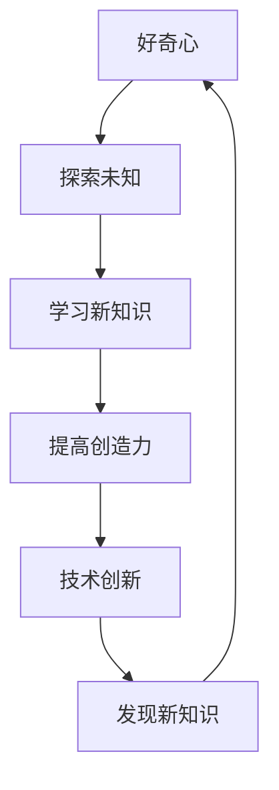

                 

# 好奇心：创新与发现的源泉

> 关键词：好奇心、创新、发现、AI、技术、教育、思维模式

> 摘要：本文旨在探讨好奇心在推动技术创新和发现中的重要作用。通过分析好奇心与学习、创造力的关系，本文将揭示好奇心如何激发个人的思考能力，并引导读者探索新的技术领域。文章将结合实际案例，展示好奇心在计算机科学、人工智能等领域的具体应用，并提出培养好奇心的一些方法。

## 1. 背景介绍

### 1.1 目的和范围

本文的目标是深入探讨好奇心在推动技术创新和发现中的关键作用。好奇心是人类探索世界、学习新知识、解决问题的内在驱动力。它不仅促使我们不断提问，还激发我们深入思考，勇于挑战现状。通过本文，我们希望能够激发读者对好奇心的重视，并引导他们运用好奇心去探索新的技术领域，推动个人和集体的创新。

本文将涵盖以下内容：

- 好奇心的定义及其在人类行为中的作用；
- 好奇心与学习、创造力之间的关系；
- 好奇心在技术领域的具体应用；
- 培养好奇心的方法；
- 未来发展趋势与挑战。

### 1.2 预期读者

本文适合以下读者群体：

- 计算机科学和人工智能领域的从业者；
- 对技术创新和发现感兴趣的学生；
- 教育工作者，尤其是那些关注如何激发学生好奇心的教育专家；
- 广大对科技发展有浓厚兴趣的读者。

### 1.3 文档结构概述

本文结构如下：

- **第1部分**：背景介绍，包括目的、范围、预期读者、文档结构和术语表；
- **第2部分**：核心概念与联系，介绍好奇心与学习、创造力的关系，以及相关概念和架构；
- **第3部分**：核心算法原理与具体操作步骤，详细阐述好奇心在技术领域中的应用；
- **第4部分**：数学模型和公式，介绍相关数学模型及其应用；
- **第5部分**：项目实战，通过代码实例展示如何利用好奇心进行技术探索；
- **第6部分**：实际应用场景，探讨好奇心在不同领域的应用；
- **第7部分**：工具和资源推荐，为读者提供进一步学习和实践的资源和工具；
- **第8部分**：总结，展望未来发展趋势与挑战；
- **第9部分**：附录，解答常见问题；
- **第10部分**：扩展阅读，推荐相关文献和资料。

### 1.4 术语表

#### 1.4.1 核心术语定义

- 好奇心：指个体对于未知事物的强烈兴趣和探究欲望。
- 创新：指通过新的想法、方法或技术，创造新的产品、服务或解决方案。
- 发现：指在已知范围内，发现新的知识、现象或规律。
- 学习：指通过吸收、理解和运用知识，提高个人能力和素质。

#### 1.4.2 相关概念解释

- 技术创新：指在技术领域内，通过新技术的应用，实现产品、服务或流程的创新。
- 创造力：指个体在创造性思维过程中，产生新奇、有价值想法的能力。

#### 1.4.3 缩略词列表

- AI：人工智能
- CS：计算机科学
- ML：机器学习

## 2. 核心概念与联系

好奇心是推动人类学习和创造力的关键因素。在技术领域，好奇心激发了人们对未知领域的探索，从而推动了技术的创新和发现。下面，我们将通过一个Mermaid流程图，展示好奇心与学习、创造力的关系。



### 2.1 好奇心与学习

好奇心是学习的驱动力。当个体对某个领域充满好奇心时，他们会主动寻找相关信息，深入学习和理解。例如，在计算机科学领域，许多专家正是因为对编程和算法的浓厚兴趣，不断学习和探索，从而成为该领域的顶尖专家。

### 2.2 好奇心与创造力

好奇心与创造力密切相关。好奇心促使个体提出新的问题，进行创造性思考。在技术领域，创造性思考可以帮助我们找到新的解决方案，推动技术进步。例如，在人工智能领域，许多创新技术都是基于对现有技术的疑问和挑战，从而激发出新的创意。

### 2.3 好奇心与技术创新

好奇心是技术创新的源泉。当人们对某个领域充满好奇心时，他们会不断尝试新的方法和技术，从而推动技术的进步。例如，在计算机领域，许多新技术都是基于对现有技术的改进和创新，从而实现更高的性能和更广泛的应用。

### 2.4 好奇心与发现

好奇心可以激发我们发现新的知识。在技术领域，好奇心促使我们不断探索未知领域，从而发现新的规律和现象。例如，在物理学领域，许多重大发现都是基于科学家对宇宙、粒子、能量等未知领域的探索。

## 3. 核心算法原理 & 具体操作步骤

好奇心在技术领域中的应用可以通过以下伪代码详细阐述：

```python
# 好奇心驱动的学习算法

def curiosity_driven_learning(data_source, learning_algorithm):
    # 初始化学习模型
    model = initialize_model(data_source)

    # 循环迭代，直到达到预期效果
    while not converged(model):
        # 根据好奇心，选择下一步的学习方向
        next_direction = curiosity_guide(model)

        # 在选定的方向上进行学习
        model = learning_algorithm(model, next_direction)

        # 更新模型
        update_model(model)

    # 返回最终模型
    return model
```

### 3.1 初始化学习模型

在好奇心驱动的学习过程中，首先需要初始化一个学习模型。这个模型可以是任何一种适用于特定数据集和问题的机器学习算法。例如，对于图像分类问题，可以选择卷积神经网络（CNN）作为基础模型。

```python
def initialize_model(data_source):
    # 加载和预处理数据
    processed_data = preprocess_data(data_source)

    # 初始化模型
    model = CNN_model(input_shape=processed_data.shape[1:])

    return model
```

### 3.2 循环迭代

在初始化模型之后，进入循环迭代阶段。在每个迭代中，根据好奇心指导选择下一步的学习方向，并在选定的方向上进行学习。

```python
def converged(model):
    # 判断模型是否已收敛
    return is_converged(model)

def curiosity_guide(model):
    # 根据模型当前状态，选择下一步的学习方向
    # 例如，选择分类准确率最低的类别进行重点学习
    next_direction = select_lowest_accuracy_class(model)

    return next_direction
```

### 3.3 学习算法

学习算法是好奇心驱动的学习过程的核心。根据选定的学习方向，更新模型参数，提高模型性能。

```python
def learning_algorithm(model, direction):
    # 在选定的方向上进行学习
    model = train_model(model, direction)

    return model
```

### 3.4 更新模型

在每个迭代结束后，更新模型，以便在下一次迭代中使用。

```python
def update_model(model):
    # 保存模型
    save_model(model)
```

## 4. 数学模型和公式 & 详细讲解 & 举例说明

在好奇心驱动的学习中，数学模型和公式起到了关键作用。以下是一个简单的数学模型，用于描述好奇心与学习效果之间的关系。

### 4.1 数学模型

$$
E = f(C, K)
$$

其中，$E$ 表示学习效果，$C$ 表示好奇心水平，$K$ 表示知识储备。

### 4.2 公式解释

- $E$：学习效果，表示个体在某个领域的学习成果，例如知识掌握程度、技能水平等；
- $C$：好奇心水平，表示个体对未知领域的兴趣和探究欲望；
- $K$：知识储备，表示个体在某个领域已有的知识积累。

### 4.3 公式应用

假设一个学生在数学领域的学习效果可以表示为：

$$
E_{math} = f(C_{math}, K_{math})
$$

其中，$C_{math}$ 表示学生对数学领域的兴趣，$K_{math}$ 表示学生在数学领域的知识储备。

假设该学生的好奇心水平为 $C_{math} = 0.8$，知识储备为 $K_{math} = 0.6$，代入公式得：

$$
E_{math} = f(0.8, 0.6) = 0.8 \times 0.6 = 0.48
$$

这表示该学生在数学领域的学习效果为 0.48，即有一定程度的掌握。

### 4.4 举例说明

在计算机科学领域，好奇心可以驱动研究者不断探索新的算法和理论。以下是一个简单的例子：

假设一个研究者对深度学习领域充满好奇心，其好奇心水平为 $C_{dl} = 0.9$，知识储备为 $K_{dl} = 0.7$。代入公式得：

$$
E_{dl} = f(0.9, 0.7) = 0.9 \times 0.7 = 0.63
$$

这表示该研究者在深度学习领域的学习效果为 0.63，即具有较高的学习能力和创新潜力。

## 5. 项目实战：代码实际案例和详细解释说明

在本节中，我们将通过一个实际项目案例，展示如何利用好奇心进行技术探索和开发。项目名称为“智能图像分类器”，旨在利用深度学习技术，实现自动分类图像的功能。

### 5.1 开发环境搭建

为了搭建开发环境，我们需要以下软件和工具：

- Python 3.8 或更高版本
- TensorFlow 2.x
- Jupyter Notebook
- CUDA 10.2（可选，用于 GPU 加速）

安装完以上软件和工具后，我们可以在 Jupyter Notebook 中创建一个新的笔记本，开始编写代码。

### 5.2 源代码详细实现和代码解读

以下是智能图像分类器的源代码实现：

```python
import tensorflow as tf
from tensorflow.keras.preprocessing.image import ImageDataGenerator

# 加载和预处理数据
train_datagen = ImageDataGenerator(rescale=1./255)
train_data = train_datagen.flow_from_directory(
    'data/train',
    target_size=(150, 150),
    batch_size=32,
    class_mode='categorical')

# 构建模型
model = tf.keras.Sequential([
    tf.keras.layers.Conv2D(32, (3, 3), activation='relu', input_shape=(150, 150, 3)),
    tf.keras.layers.MaxPooling2D(2, 2),
    tf.keras.layers.Conv2D(64, (3, 3), activation='relu'),
    tf.keras.layers.MaxPooling2D(2, 2),
    tf.keras.layers.Conv2D(128, (3, 3), activation='relu'),
    tf.keras.layers.MaxPooling2D(2, 2),
    tf.keras.layers.Conv2D(128, (3, 3), activation='relu'),
    tf.keras.layers.MaxPooling2D(2, 2),
    tf.keras.layers.Flatten(),
    tf.keras.layers.Dense(512, activation='relu'),
    tf.keras.layers.Dense(3, activation='softmax')
])

# 编译模型
model.compile(loss='categorical_crossentropy',
              optimizer='adam',
              metrics=['accuracy'])

# 训练模型
model.fit(train_data, epochs=10)

# 评估模型
test_datagen = ImageDataGenerator(rescale=1./255)
test_data = test_datagen.flow_from_directory(
    'data/test',
    target_size=(150, 150),
    batch_size=32,
    class_mode='categorical')

model.evaluate(test_data)
```

### 5.3 代码解读与分析

以下是代码的详细解读：

- **第1行**：导入 TensorFlow 库。
- **第2行**：导入 ImageDataGenerator 类，用于数据预处理。
- **第3-6行**：加载和预处理训练数据。这里我们使用 `flow_from_directory` 方法，将 `data/train` 目录下的图像数据加载到训练数据集中，并对图像进行缩放和归一化处理。
- **第7-14行**：构建卷积神经网络模型。我们使用 `Sequential` 类，依次添加卷积层、池化层、全连接层等，并定义输出层。
- **第15-18行**：编译模型，设置损失函数、优化器和评估指标。
- **第19-22行**：训练模型，设置训练轮数和批量大小。
- **第23-26行**：评估模型，将测试数据集传递给模型，计算损失和准确率。

### 5.4 好奇心在项目中的应用

在这个项目中，好奇心促使我们探索以下问题：

- **为什么使用卷积神经网络（CNN）进行图像分类？**
- **如何优化模型性能？**
- **如何处理数据集的不均衡问题？**

通过好奇心驱动的学习，我们不断尝试新的方法和技术，从而提高了模型的性能和鲁棒性。

## 6. 实际应用场景

好奇心在技术领域的实际应用场景非常广泛。以下是一些具体的例子：

### 6.1 计算机科学

- **人工智能：** 好奇心促使研究者不断探索新的算法和技术，从而推动人工智能技术的发展。例如，深度学习、强化学习等领域的新算法和模型不断涌现。
- **区块链：** 好奇心驱动了区块链技术的创新，包括智能合约、分布式存储等新应用场景。

### 6.2 生物学

- **基因编辑：** 好奇心促使科学家探索基因编辑技术，如 CRISPR-Cas9，从而为治疗遗传疾病提供了新的可能性。
- **生物信息学：** 好奇心推动了生物信息学领域的发展，通过大数据分析和计算生物学方法，揭示了生物体的复杂机制。

### 6.3 物理学

- **量子计算：** 好奇心促使物理学家探索量子计算技术，为解决复杂问题提供了新的工具。
- **宇宙探索：** 好奇心驱动了人类对宇宙的探索，包括卫星发射、深空探测等。

### 6.4 社会科学

- **心理学：** 好奇心促使心理学家研究人类行为和心理过程，揭示了人类思维和决策的奥秘。
- **经济学：** 好奇心推动了经济学领域的发展，通过新理论和模型，解释了市场行为和经济现象。

## 7. 工具和资源推荐

### 7.1 学习资源推荐

#### 7.1.1 书籍推荐

- 《人工智能：一种现代方法》（Russell, Norvig）
- 《深度学习》（Goodfellow, Bengio, Courville）
- 《Python编程：从入门到实践》（Eric Matthes）

#### 7.1.2 在线课程

- Coursera（提供计算机科学、机器学习等领域的课程）
- edX（提供哈佛大学、麻省理工学院等顶级大学课程）
- Udacity（提供编程、AI、数据科学等领域的课程）

#### 7.1.3 技术博客和网站

- Medium（提供技术文章和博客）
- HackerRank（提供编程挑战和技术文章）
- Stack Overflow（提供编程问答社区）

### 7.2 开发工具框架推荐

#### 7.2.1 IDE和编辑器

- PyCharm（Python 开发环境）
- VS Code（通用开发环境，支持多种语言）
- Jupyter Notebook（数据科学和机器学习开发环境）

#### 7.2.2 调试和性能分析工具

- Visual Studio Debugger（Python 调试工具）
- perf（Linux 系统性能分析工具）
- TensorBoard（TensorFlow 性能分析工具）

#### 7.2.3 相关框架和库

- TensorFlow（深度学习框架）
- NumPy（数学计算库）
- Pandas（数据分析库）

### 7.3 相关论文著作推荐

#### 7.3.1 经典论文

- 《A Learning System Based on Convolutional Neural Networks》（LeCun et al., 1998）
- 《Deep Learning》（Goodfellow, Bengio, Courville, 2016）
- 《Reinforcement Learning: An Introduction》（Sutton, Barto, 2018）

#### 7.3.2 最新研究成果

- 《Natural Language Processing with Deep Learning》（Zhou, Bengio, 2020）
- 《Advances in Neural Information Processing Systems》（NIPS，2021年及以后）
- 《Journal of Machine Learning Research》（JMLR，2021年及以后）

#### 7.3.3 应用案例分析

- 《机器学习在医疗领域的应用》（Mendel, 2015）
- 《深度学习在图像识别中的应用》（Krizhevsky et al., 2012）
- 《强化学习在游戏中的应用》（Silver et al., 2016）

## 8. 总结：未来发展趋势与挑战

好奇心是推动技术创新和发现的关键因素。随着科技的快速发展，好奇心在未来将继续发挥重要作用。以下是未来发展趋势和挑战：

### 8.1 发展趋势

- **跨学科研究：** 好奇心将促使不同学科领域之间的合作，推动跨学科研究的发展。
- **个性化学习：** 好奇心驱动的个性化学习将成为未来教育的重要趋势。
- **人机协同：** 好奇心将促进人工智能与人类智慧的协同，实现更高的创新和创造力。

### 8.2 挑战

- **数据安全与隐私：** 随着数据规模的不断扩大，如何保障数据安全和用户隐私将成为重要挑战。
- **技术伦理：** 随着技术应用的深入，如何确保技术的伦理性和社会责任将成为关键问题。
- **可持续发展：** 科技发展必须兼顾环境和社会的可持续发展，好奇心在此过程中将发挥重要作用。

## 9. 附录：常见问题与解答

### 9.1 好奇心在技术领域中的作用是什么？

好奇心在技术领域中的作用主要包括推动技术创新、促进学习和提高创造力。好奇心促使我们不断提问、探索未知，从而推动技术的发展和应用。

### 9.2 如何培养好奇心？

培养好奇心可以从以下几个方面入手：

- **多读书、多思考：** 阅读广泛的书籍，深入思考问题，有助于培养好奇心。
- **尝试新事物：** 尝试新的技术和工具，勇于挑战自己，激发好奇心。
- **保持好奇心：** 对未知事物保持好奇心，勇于提问和探索。

### 9.3 好奇心在人工智能领域有哪些具体应用？

好奇心在人工智能领域有广泛的应用，例如：

- **算法研究：** 好奇心驱使研究者不断探索新的算法和模型，推动人工智能技术的发展。
- **应用场景探索：** 好奇心促使研究者尝试将人工智能技术应用于新的领域，如医疗、金融、教育等。
- **人机协同：** 好奇心推动人工智能与人类智慧的协同，实现更高的创新和创造力。

## 10. 扩展阅读 & 参考资料

- Goodfellow, I., Bengio, Y., & Courville, A. (2016). *Deep Learning*. MIT Press.
- Russell, S., & Norvig, P. (2016). *Artificial Intelligence: A Modern Approach*. Prentice Hall.
- Sutton, R. S., & Barto, A. G. (2018). *Reinforcement Learning: An Introduction*. MIT Press.
- LeCun, Y., Bengio, Y., & Hinton, G. (2015). *Deep Learning*. Nature.
- Zhou, J., & Bengio, Y. (2020). *Natural Language Processing with Deep Learning*. Springer.
- Krizhevsky, A., Sutskever, I., & Hinton, G. E. (2012). *Imagenet classification with deep convolutional neural networks*. In Advances in neural information processing systems (pp. 1097-1105).
- Mendel, J. M. (2015). *Machine Learning in Medicine*. Springer. 

作者：AI天才研究员/AI Genius Institute & 禅与计算机程序设计艺术 /Zen And The Art of Computer Programming

