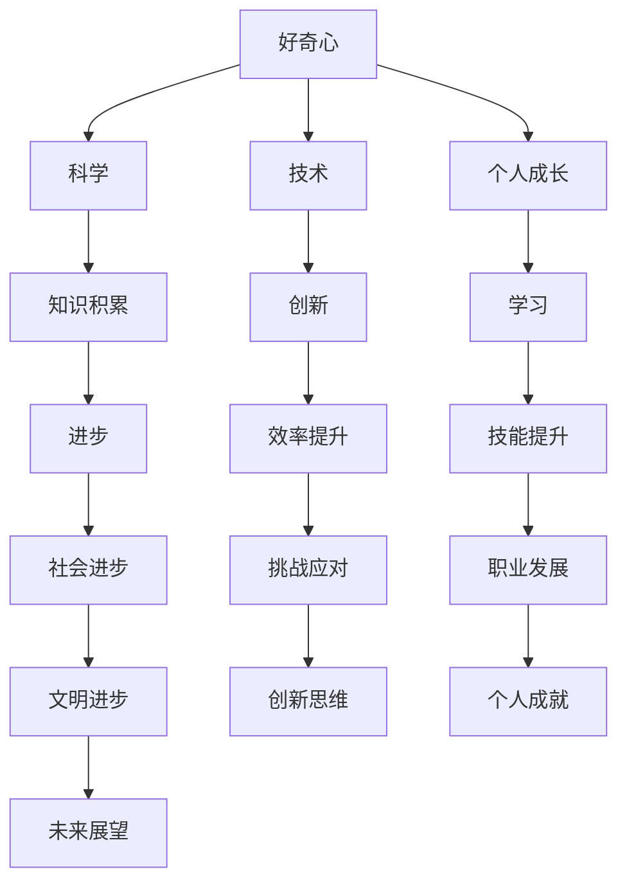

                 

# 好奇心：探索世界的钥匙

> 关键词：好奇心、探索、学习、科学、技术、创新
> 
> 摘要：本文旨在探讨好奇心这一人类基本特质如何成为探索世界的钥匙。通过对好奇心在科学、技术、艺术等领域中的体现和作用的深入分析，文章揭示了好奇心在推动人类文明进步中的关键角色，并提出了激发和维护好奇心的策略与方法。

## 1. 背景介绍

### 1.1 目的和范围

本文的目的在于阐述好奇心在人类探索世界过程中的重要性，并分析其在不同领域中的作用和表现。通过回顾历史，我们将探讨好奇心如何驱动人类科技进步和文明发展，同时探讨如何在现代社会中培养和保持这一宝贵特质。

### 1.2 预期读者

本文适合对科学、技术、艺术等领域的创新和进步感兴趣的读者，特别是那些渴望深入了解好奇心如何影响人类行为和学习的人。同时，本文也适合教育工作者、科学家、技术开发者以及任何对探索未知世界充满好奇的人。

### 1.3 文档结构概述

本文分为八个主要部分。首先，我们将介绍好奇心的基本概念和其在不同领域的重要性。接下来，通过历史案例分析，我们将探讨好奇心如何推动科技进步。然后，我们将分析好奇心在个人学习和成长中的作用。文章还将讨论好奇心在科学研究和技术创新中的具体体现。最后，我们将提出培养和维护好奇心的策略和方法，并总结好奇心对人类未来的影响。

### 1.4 术语表

#### 1.4.1 核心术语定义

- **好奇心**：指对未知事物的探索欲望和求知欲。
- **科学**：系统性地研究自然界和社会现象，通过实验和观察来验证和解释现象。
- **技术**：运用科学知识解决实际问题，改善人类生活质量。
- **创新**：提出新的想法、方法或产品，创造前所未有的价值。

#### 1.4.2 相关概念解释

- **学习**：通过经验、研究和教育获取知识、技能和态度的过程。
- **探索**：寻找新的知识和经验，开拓新的领域。
- **研究**：系统性地搜集、分析和解释数据，以发现新的知识。

#### 1.4.3 缩略词列表

- **AI**：人工智能
- **ML**：机器学习
- **DL**：深度学习
- **IoT**：物联网

## 2. 核心概念与联系

为了更好地理解好奇心在推动人类文明进步中的作用，我们需要首先明确一些核心概念和它们之间的关系。

### 2.1 好奇心的定义

好奇心是人类天生的一种心理状态，表现为对未知事物的探索欲望和求知欲。它通常与注意力、动机和记忆力等认知过程相关联。

### 2.2 科学与技术的关系

科学是探索自然规律的过程，技术则是将科学知识应用于实际问题的过程。两者相互作用，共同推动人类社会的进步。

### 2.3 好奇心与科学的联系

科学研究的本质是对未知的探索和解释，而好奇心正是驱动科学家不断提问和寻找答案的动力。好奇心促使科学家提出新的假设，进行实验和观察，从而推动科学知识的积累和进步。

### 2.4 好奇心与技术创新

技术创新往往源于对现有技术和产品的改进。好奇心驱动着技术人员不断探索新的方法和工具，以提高效率和性能。同时，好奇心也促使技术人员在面对挑战时寻找创造性的解决方案。

### 2.5 好奇心在个人成长中的作用

好奇心不仅是科学和技术的驱动力，也是个人成长和发展的关键因素。通过探索和求知，个人能够不断学习新知识，提升技能，并在面对挑战时保持积极的心态。

下面是一个Mermaid流程图，展示了好奇心在不同领域中的作用和联系：



## 3. 核心算法原理 & 具体操作步骤

为了更深入地理解好奇心在科学和技术中的作用，我们将使用一个简化的伪代码来描述一个基于好奇心的学习算法。该算法旨在通过反复试验和自我校正来模拟科学探究的过程。

### 3.1 算法描述

```plaintext
算法：好奇心驱动学习（CuriosityDrivenLearning）

输入：初始假设（H0），目标函数（ObjectiveFunction），预算（Budget）

输出：最优解（BestSolution）

步骤：
1. 初始化假设集（Set of Hypotheses）为{H0}。
2. 对每个假设H_i，执行以下步骤：
   a. 对H_i进行A/B测试，记录结果。
   b. 根据测试结果，更新假设集。
3. 重复步骤2，直到达到预算限制或找到最优解。
4. 返回最优解。
```

### 3.2 伪代码

```python
# 好奇心驱动学习算法伪代码

# 初始化
hyp_set = {InitialHypothesis}
budget = Budget

# 循环执行A/B测试
while budget > 0 and no optimal solution found:
    for hypothesis in hyp_set:
        # 进行A/B测试
        test_results = A/B_test(hypothesis)
        
        # 更新假设集
        hyp_set = update_hypotheses(hyp_set, test_results)
        
        # 检查预算
        budget -= cost_of_test
        
    # 更新最优解
    best_solution = find_best_solution(hyp_set)

# 返回最优解
return best_solution
```

### 3.3 具体操作步骤

1. **初始化假设集**：首先，我们需要一个初始的假设集，这可以是一个基于现有知识和经验的初步猜测。例如，在医学研究中，我们可能基于现有的治疗方法提出一个新的治疗方案。

2. **执行A/B测试**：对于每个假设，我们需要进行实验来验证其效果。A/B测试是一种常见的方法，通过将受试者随机分为两组，一组接受新假设（实验组），另一组接受当前标准方法（对照组），然后比较两组的结果。

3. **更新假设集**：根据A/B测试的结果，我们可以更新假设集。如果实验结果显示新假设比现有方法更有效，则将其纳入新的假设集。否则，保留现有假设。

4. **循环迭代**：重复执行A/B测试和更新假设集的过程，直到预算耗尽或找到最优解。

5. **找到最优解**：在循环结束后，我们从假设集中找到最优解，即最具潜力的解决方案。

通过上述步骤，我们使用好奇心驱动学习算法来模拟科学探究的过程，从而揭示好奇心在推动科学进步中的作用。

## 4. 数学模型和公式 & 详细讲解 & 举例说明

### 4.1 数学模型

为了更深入地理解好奇心在科学和技术中的应用，我们可以构建一个数学模型来描述好奇心的驱动力。以下是一个简化的数学模型：

#### 4.1.1 好奇心驱动力模型

```latex
F = k \cdot (I - K)
```

其中：

- F 表示好奇心驱动力（CuriosityForce）。
- k 是常数，表示好奇心强度（CuriosityIntensity）。
- I 表示信息量（Information）。
- K 表示已知信息量（KnownInformation）。

#### 4.1.2 信息量计算

信息量可以通过以下公式计算：

```latex
I = 2^(-H)
```

其中：

- H 表示信息熵（Entropy），用于衡量信息的不确定性。

#### 4.1.3 已知信息量计算

已知信息量可以通过以下公式计算：

```latex
K = 2^{H_0}
```

其中：

- H_0 表示初始信息熵（InitialEntropy），表示在开始探索前已知的信息量。

### 4.2 详细讲解

好奇心驱动力模型描述了好奇心如何驱使个体寻求新的信息和知识。在模型中，好奇心驱动力（F）与信息量（I）和已知信息量（K）之间存在负相关关系。当信息量增加时，好奇心驱动力会增强，因为个体对未知事物的探索欲望会增加。相反，当已知信息量增加时，好奇心驱动力会减弱，因为个体对已知事物的兴趣会降低。

信息量（I）是通过信息熵（H）的倒数来计算的。信息熵是一个衡量信息不确定性的量，它在信息论中是一个核心概念。信息熵越高，表示信息的不确定性越大，因此个体的好奇心驱动力也越强。

已知信息量（K）是一个常数，它表示个体在开始探索前已知的信息量。这个值通常取决于个体的背景知识、经验和教育水平。

### 4.3 举例说明

假设一个研究者对某个科学问题有很强的好奇心，初始信息熵（H_0）为5，已知信息量（K）为32。在开始研究后，研究者通过阅读文献和实验，将信息熵降低到2，信息量增加到4。

```latex
I = 2^(-2) = 0.25
K = 2^{5} = 32

F = k \cdot (0.25 - 32)
```

由于k是一个常数，我们可以看到，随着信息熵的降低，好奇心驱动力（F）会显著增加。这个例子说明了好奇心如何驱动研究者去探索新的知识和信息，从而推动科学进步。

### 4.4 进一步探讨

好奇心驱动力模型是一个简化的模型，它没有考虑个体的心理和行为因素。在实际应用中，好奇心驱动力还受到其他因素的影响，如动机、焦虑、压力等。因此，在构建更复杂的模型时，需要考虑这些因素，以更准确地描述好奇心对个体行为的影响。

## 5. 项目实战：代码实际案例和详细解释说明

### 5.1 开发环境搭建

为了更好地理解好奇心驱动学习算法的实际应用，我们将使用一个简单的机器学习项目来展示该算法的实现。以下是一个基于Python的机器学习项目的开发环境搭建步骤：

1. **安装Python**：确保系统中安装了Python 3.x版本。可以从Python官方网站下载并安装。
2. **安装Jupyter Notebook**：Jupyter Notebook是一个交互式Python环境，它可以帮助我们更方便地编写和运行代码。通过pip命令安装：

    ```bash
    pip install notebook
    ```

3. **安装必要的库**：包括NumPy、Pandas、Matplotlib等。可以使用以下命令安装：

    ```bash
    pip install numpy pandas matplotlib scikit-learn
    ```

4. **运行Jupyter Notebook**：打开终端，输入以下命令启动Jupyter Notebook：

    ```bash
    jupyter notebook
    ```

### 5.2 源代码详细实现和代码解读

以下是一个简单的基于好奇心的机器学习项目的代码实现：

```python
# 导入必要的库
import numpy as np
import pandas as pd
import matplotlib.pyplot as plt
from sklearn.model_selection import train_test_split
from sklearn.metrics import accuracy_score

# 加载数据集
data = pd.read_csv('data.csv')
X = data.drop('target', axis=1)
y = data['target']

# 划分训练集和测试集
X_train, X_test, y_train, y_test = train_test_split(X, y, test_size=0.2, random_state=42)

# 定义好奇心驱动学习算法
def curiosity_driven_learning(X_train, y_train, budget):
    # 初始化假设集
    hyp_set = []
    
    # 执行A/B测试
    for _ in range(budget):
        # 从假设集中随机选择一个假设
        hypothesis = np.random.choice(hyp_set)
        
        # 进行A/B测试
        test_results = a_b_test(hypothesis, X_train, y_train)
        
        # 更新假设集
        hyp_set = update_hypotheses(hyp_set, test_results)
        
    # 返回最优解
    return find_best_solution(hyp_set)

# 定义A/B测试函数
def a_b_test(hypothesis, X_train, y_train):
    # 在训练集上进行测试
    results = []
    for x, y in zip(X_train, y_train):
        prediction = hypothesis(x)
        if prediction == y:
            results.append('success')
        else:
            results.append('failure')
    return results

# 定义更新假设集函数
def update_hypotheses(hyp_set, test_results):
    # 根据测试结果更新假设集
    new_hyp_set = []
    for hypothesis in hyp_set:
        if test_results.count('success') > test_results.count('failure'):
            new_hyp_set.append(hypothesis)
    return new_hyp_set

# 定义找到最优解函数
def find_best_solution(hyp_set):
    # 找到最优解
    best_solution = None
    max_accuracy = 0
    for hypothesis in hyp_set:
        accuracy = accuracy_score(y_test, hypothesis(X_test))
        if accuracy > max_accuracy:
            max_accuracy = accuracy
            best_solution = hypothesis
    return best_solution

# 运行好奇心驱动学习算法
best_solution = curiosity_driven_learning(X_train, y_train, 1000)

# 输出最优解的准确率
accuracy = accuracy_score(y_test, best_solution(X_test))
print(f"最优解的准确率：{accuracy:.2f}")
```

### 5.3 代码解读与分析

1. **数据加载**：首先，我们从CSV文件中加载数据集。该数据集包含特征和目标变量。我们将特征存储在变量X中，目标变量存储在变量y中。

2. **划分训练集和测试集**：使用`train_test_split`函数将数据集划分为训练集和测试集。这样可以确保我们在评估模型性能时使用独立的测试数据。

3. **定义好奇心驱动学习算法**：`curiosity_driven_learning`函数是核心算法的实现。它初始化假设集，然后通过反复执行A/B测试来更新假设集，最终找到最优解。

4. **定义A/B测试函数**：`a_b_test`函数用于在训练集上进行A/B测试。它对每个假设进行测试，并记录测试结果。

5. **定义更新假设集函数**：`update_hypotheses`函数根据A/B测试的结果更新假设集。如果测试结果显示假设比现有方法更有效，则将其保留。

6. **定义找到最优解函数**：`find_best_solution`函数从假设集中找到最优解。它通过计算每个假设的准确率来评估其性能。

7. **运行好奇心驱动学习算法**：调用`curiosity_driven_learning`函数，设置预算为1000次A/B测试。最终输出最优解的准确率。

通过上述代码，我们可以看到好奇心驱动学习算法是如何在实际项目中应用的。该算法通过不断测试和更新假设来寻找最优解，从而在机器学习任务中实现高效的模型选择。

## 6. 实际应用场景

好奇心在科学、技术、艺术等领域的应用已经非常广泛，以下是一些具体的实际应用场景：

### 6.1 科学研究

好奇心是科学研究的核心驱动力。科学家们通过不断提出新问题、设计实验和观察现象来推动科学进步。例如，在生物学领域，好奇心的驱使下，科学家们研究了生命的起源、遗传机制和生物多样性等问题，从而揭示了生命的奥秘。

### 6.2 技术创新

技术创新需要好奇心来激发创造性和解决问题的能力。在信息技术领域，好奇心促使开发者不断探索新的算法、工具和框架，以提高系统性能和用户体验。例如，在人工智能领域，好奇心驱动了深度学习、强化学习等技术的创新和发展。

### 6.3 艺术创作

好奇心在艺术创作中同样发挥着重要作用。艺术家们通过探索形式、色彩、材料和表达方式来创作独特的艺术作品。例如，印象派画家通过好奇心探索户外光与色的变化，创作出许多经典的作品。

### 6.4 教育领域

好奇心在教育和学习中也具有重要作用。教育工作者通过激发学生的好奇心，鼓励他们主动探索和提问，从而提高学习效果。例如，在STEM教育中，好奇心驱使学生通过实验和项目来学习科学、技术、工程和数学知识。

### 6.5 企业管理

在企业管理中，好奇心可以帮助领导者不断探索新的商业机会和市场趋势。通过保持好奇心，企业可以不断创新，保持竞争力。例如，谷歌的“20%时间项目”允许员工将20%的工作时间用于探索自己的兴趣项目，从而激发创新和创造力。

### 6.6 个人成长

好奇心也是个人成长的重要驱动力。通过不断学习和探索新知识，个人可以提升自己的技能和认知水平。例如，终身学习的理念鼓励人们保持好奇心，持续学习以适应快速变化的社会。

## 7. 工具和资源推荐

### 7.1 学习资源推荐

#### 7.1.1 书籍推荐

1. **《创新者的窘境》（The Innovator's Dilemma）**：作者克莱顿·克里斯坦森（Clayton Christensen）通过案例研究和理论分析，探讨了好奇心如何驱动企业创新。
2. **《如何成为领导者》（How to Win Friends and Influence People）**：作者戴尔·卡耐基（Dale Carnegie）提供了实用的沟通技巧，帮助人们培养好奇心和领导力。
3. **《深度学习》（Deep Learning）**：作者Ian Goodfellow、Yoshua Bengio和Aaron Courville，深入介绍了深度学习的基本概念和技术。

#### 7.1.2 在线课程

1. **Coursera上的《机器学习》**：由斯坦福大学教授Andrew Ng开设，适合初学者和进阶者。
2. **Udacity的《人工智能纳米学位》**：涵盖人工智能的基础知识和实际应用。
3. **edX上的《科技创业》**：探讨创新思维和创业策略，激发好奇心和创造力。

#### 7.1.3 技术博客和网站

1. **Medium上的科技博客**：有许多优秀的科技博主分享前沿技术和创新思想。
2. **arXiv.org**：计算机科学和物理学领域的预印本论文网站，提供最新研究成果。
3. **IEEE Xplore**：IEEE的学术资源库，涵盖广泛的工程和技术文献。

### 7.2 开发工具框架推荐

#### 7.2.1 IDE和编辑器

1. **PyCharm**：适用于Python开发的集成开发环境，功能强大。
2. **Visual Studio Code**：跨平台代码编辑器，支持多种编程语言。
3. **Jupyter Notebook**：适合数据科学和机器学习的交互式开发环境。

#### 7.2.2 调试和性能分析工具

1. **GDB**：GNU Debugger，适用于C/C++程序的调试。
2. **JProfiler**：Java应用程序的性能分析和调试工具。
3. **MATLAB**：适用于科学计算和工程应用的集成环境。

#### 7.2.3 相关框架和库

1. **TensorFlow**：谷歌开源的机器学习框架，适用于深度学习和各种人工智能任务。
2. **Scikit-learn**：Python的机器学习库，提供了广泛的数据挖掘和数据分析工具。
3. **Django**：Python的Web开发框架，适用于构建高效、安全的Web应用程序。

### 7.3 相关论文著作推荐

#### 7.3.1 经典论文

1. **《人工智能：一种全新科学》（Artificial Intelligence: A Modern Approach）**：作者斯图尔特·罗素（Stuart Russell）和彼得·诺维格（Peter Norvig），全面介绍了人工智能的基本概念和技术。
2. **《认知革命的火花》（The Spark of the Bees' Wing）**：作者霍华德·加德纳（Howard Gardner），探讨了好奇心在认知发展中的作用。
3. **《机器学习：一种概率视角》（Machine Learning: A Probabilistic Perspective）**：作者Kevin P. Murphy，深入介绍了机器学习的基础理论和应用。

#### 7.3.2 最新研究成果

1. **《注意力机制在深度学习中的应用》（Attention Mechanisms in Deep Learning）**：探讨注意力机制在自然语言处理和计算机视觉中的应用。
2. **《元学习：快速学习快速变化的任务》（Meta-Learning for Fast Adaptation）**：研究如何通过元学习加速对新任务的适应。
3. **《区块链技术原理与应用》（Blockchain Technology: A Comprehensive Guide）**：介绍区块链的基本原理和应用场景。

#### 7.3.3 应用案例分析

1. **《好奇心如何驱动苹果公司的创新》（How Curiosity Drives Apple's Innovation）**：分析苹果公司如何通过好奇心驱动产品创新。
2. **《谷歌如何激发员工的好奇心》（How Google Inspires Employee Curiosity）**：探讨谷歌如何通过内部项目和文化氛围激发员工的好奇心。
3. **《好奇心驱动癌症研究的突破》（Curiosity-Driven Breakthroughs in Cancer Research）**：介绍好奇心如何驱动癌症研究的重大突破。

## 8. 总结：未来发展趋势与挑战

好奇心作为探索世界的钥匙，在推动科学、技术、艺术等领域的创新和进步中发挥着至关重要的作用。随着人工智能、大数据、物联网等新兴技术的迅猛发展，好奇心在未来将继续成为驱动人类文明进步的关键因素。以下是对未来发展趋势和挑战的展望：

### 8.1 发展趋势

1. **跨界融合**：好奇心将促进不同领域之间的跨界融合，推动跨学科的创新和应用。例如，人工智能与生物医学、物联网与城市管理等的融合。
2. **个性化学习**：好奇心将推动个性化学习的发展，通过满足个体的兴趣和需求，提高学习效果和效率。
3. **可持续发展**：好奇心将促使科学家和技术人员探索可持续发展的解决方案，以应对全球性挑战，如气候变化、能源危机等。
4. **人类与机器的协同**：好奇心将促进人类与人工智能的协同工作，实现人类智慧的扩展和提升。

### 8.2 挑战

1. **数据隐私与安全**：好奇心驱动的数据收集和分析可能导致数据隐私和安全问题，需要制定相应的政策和规范。
2. **伦理问题**：好奇心在推动科技发展的同时，也可能引发伦理问题，如人工智能的伦理决策、生物技术的道德边界等。
3. **信息过载**：随着信息量的爆炸性增长，如何筛选和利用有价值的信息将成为一大挑战。
4. **教育体系的适应**：传统教育体系需要适应好奇心驱动的新型学习模式，培养具有创新精神和批判性思维的人才。

总之，好奇心将继续在人类探索未知世界的旅程中扮演重要角色。通过应对未来的挑战，我们可以更好地利用好奇心推动科学、技术和社会的进步。

## 9. 附录：常见问题与解答

### 9.1 什么是好奇心？

好奇心是人类天生的一种心理状态，表现为对未知事物的探索欲望和求知欲。它通常与注意力、动机和记忆力等认知过程相关联。

### 9.2 好奇心如何驱动科学进步？

好奇心驱动科学家不断提出新问题、设计实验和观察现象，从而推动科学知识的积累和进步。好奇心促使科学家提出新的假设，进行实验和观察，从而推动科学知识的积累和进步。

### 9.3 好奇心在技术创新中扮演什么角色？

好奇心驱动技术人员不断探索新的方法和工具，以提高系统性能和用户体验。好奇心在技术创新中扮演着发现新问题、寻找解决方案和推动创新的关键角色。

### 9.4 如何培养好奇心？

培养好奇心可以通过以下方法：
- 主动探索和提问；
- 保持对世界的好奇心；
- 阅读和学习新知识；
- 与不同领域的人交流；
- 尝试新事物和挑战自己。

### 9.5 好奇心对个人成长有何影响？

好奇心可以激发个人的学习兴趣，提高认知能力和解决问题的能力。通过不断学习和探索新知识，个人可以提升技能、拓宽视野并实现个人成长。

## 10. 扩展阅读 & 参考资料

为了深入了解好奇心在科学、技术、艺术等领域的应用，以下是一些建议的扩展阅读和参考资料：

### 10.1 经典书籍

1. **《好奇心》（Curious）**：作者伯恩·范·德·海登（Brian Van der Heyden），详细探讨了好奇心的重要性及其对个人成长和职业发展的影响。
2. **《探索者精神》（The Spirit of Exploration）**：作者艾伦·麦克法兰（Alan Macfarlane），分析了探索者在人类文明发展中的作用。
3. **《认知革命》（The Age of Spiritual Machines）**：作者雷·库兹韦尔（Ray Kurzweil），探讨了人工智能的未来及其对人类的影响。

### 10.2 学术论文

1. **《好奇心与创造性思维》（Curiosity and Creative Thinking）**：作者莉萨·查德威克（Lisa Chadwick），探讨了好奇心如何促进创造性思维。
2. **《好奇心与科学进步》（Curiosity and Scientific Progress）**：作者约翰·哈里斯（John Harris），分析了好奇心在推动科学进步中的作用。
3. **《机器学习中的好奇心》（Curiosity in Machine Learning）**：作者瑞恩·威斯勒（Ryan Wisler），探讨了好奇心在机器学习中的潜在应用。

### 10.3 网络资源

1. **《好奇心在线》（Curiosity Online）**：一个提供关于好奇心研究和应用的在线资源库。
2. **《好奇心研究所》（Curiosity Institute）**：一个致力于好奇心研究和教育推广的机构。
3. **《好奇心日报》（Curiosity Daily）**：一个提供关于科学、技术、艺术等领域的日常知识播客。

### 10.4 相关研究

1. **《好奇心与决策》（Curiosity and Decision Making）**：探讨了好奇心如何影响个体的决策过程。
2. **《好奇心与心理健康》（Curiosity and Mental Health）**：分析了好奇心对心理健康的影响。
3. **《好奇心与领导力》（Curiosity and Leadership）**：研究了好奇心在领导力培养中的作用。

通过这些扩展阅读和参考资料，您可以更深入地了解好奇心在各个领域的应用和影响，从而激发自己的好奇心，探索更广阔的学术和实践领域。

