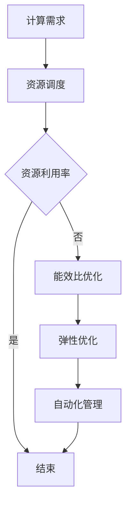

                 

# 如何优化计算基础设施以减少成本

> **关键词：**计算基础设施、成本优化、资源调度、能效比、虚拟化技术、容器化、自动化管理、云计算。

> **摘要：**本文将深入探讨如何通过一系列优化策略，如资源调度、虚拟化技术、容器化、自动化管理等，对计算基础设施进行优化，以达到降低成本的目标。文章将详细阐述各个优化策略的原理、操作步骤和实际应用案例，并分析这些技术在各种实际场景中的应用效果。

## 1. 背景介绍

### 1.1 目的和范围

本文的目标是提供一套系统的、可操作的方案，帮助IT从业者和管理者理解并应用各种优化策略，从而降低计算基础设施的总成本。文章将涵盖以下几个关键领域：

- **资源调度**：如何通过智能调度算法，最大化资源利用率。
- **虚拟化技术**：如何利用虚拟化来提高资源利用率、灵活性和可扩展性。
- **容器化**：容器化技术的优势及其在成本优化中的应用。
- **自动化管理**：自动化工具在监控和管理基础设施中的作用。
- **云计算**：云计算的优势及其在成本优化中的作用。

### 1.2 预期读者

本文主要面向以下读者群体：

- **IT运维人员**：负责计算基础设施的日常运维和优化。
- **系统管理员**：关注系统性能和资源利用率的提升。
- **架构师**：负责整体架构的设计和优化。
- **项目经理**：负责项目成本控制和质量保证。

### 1.3 文档结构概述

本文将按照以下结构展开：

1. **背景介绍**：介绍文章的目的、范围、预期读者和文档结构。
2. **核心概念与联系**：介绍与成本优化相关的核心概念，并提供相应的Mermaid流程图。
3. **核心算法原理 & 具体操作步骤**：详细阐述优化算法的原理和操作步骤。
4. **数学模型和公式 & 详细讲解 & 举例说明**：介绍相关的数学模型和公式，并通过实例进行说明。
5. **项目实战：代码实际案例和详细解释说明**：提供实际项目的代码案例，并详细解释和说明。
6. **实际应用场景**：分析各种应用场景下的优化策略。
7. **工具和资源推荐**：推荐相关的学习资源和工具。
8. **总结：未来发展趋势与挑战**：总结文章的主要观点，并探讨未来发展趋势和挑战。
9. **附录：常见问题与解答**：回答一些常见的问题。
10. **扩展阅读 & 参考资料**：提供进一步的阅读材料和参考文献。

### 1.4 术语表

#### 1.4.1 核心术语定义

- **计算基础设施**：提供计算能力、存储和网络服务的硬件和软件环境。
- **资源调度**：在计算基础设施中，对资源（如CPU、内存、存储等）的分配和管理。
- **虚拟化技术**：通过虚拟化层，将物理资源抽象成多个逻辑资源，以实现资源共享和隔离。
- **容器化**：将应用程序及其依赖环境打包成一个容器，实现应用程序的隔离和轻量级部署。
- **自动化管理**：使用自动化工具来自动化计算基础设施的管理和运维任务。
- **云计算**：提供可按需分配的计算资源，包括存储、网络和虚拟机等。

#### 1.4.2 相关概念解释

- **能效比**：衡量计算基础设施的能源效率，即单位计算任务所需的能源消耗。
- **弹性**：计算基础设施根据需求动态调整资源的能力。
- **效率**：计算基础设施完成计算任务的速度和质量。

#### 1.4.3 缩略词列表

- **CPU**：中央处理器（Central Processing Unit）
- **GPU**：图形处理器（Graphics Processing Unit）
- **RAM**：随机存储器（Random Access Memory）
- **IaaS**：基础设施即服务（Infrastructure as a Service）
- **PaaS**：平台即服务（Platform as a Service）
- **SaaS**：软件即服务（Software as a Service）

## 2. 核心概念与联系

### 2.1 计算基础设施的组成部分

计算基础设施通常包括以下几个关键组成部分：

- **硬件**：服务器、存储设备、网络设备等。
- **软件**：操作系统、虚拟化软件、容器运行时等。
- **网络**：连接各个硬件和软件的通信网络。
- **数据存储**：数据库、文件系统等。

这些组成部分相互依赖，共同构成了一个完整的计算环境。

### 2.2 优化策略的核心概念

在优化计算基础设施以减少成本时，以下几个核心概念至关重要：

- **资源利用率**：计算基础设施中资源（如CPU、内存、存储等）的利用率。
- **能效比**：单位计算任务所需的能源消耗。
- **弹性**：计算基础设施根据需求动态调整资源的能力。
- **自动化**：通过自动化工具来自动化管理计算基础设施。

### 2.3 Mermaid流程图

以下是一个简化的Mermaid流程图，展示了计算基础设施优化策略的核心流程：



### 2.4 各核心概念之间的关系

- **资源调度**：通过智能调度算法，最大化资源利用率。
- **资源利用率**：提高资源利用率，减少闲置资源。
- **能效比优化**：降低单位计算任务所需的能源消耗，减少能源成本。
- **弹性优化**：提高计算基础设施的弹性，避免资源浪费。
- **自动化管理**：通过自动化工具来自动化管理计算基础设施，减少人工成本。

通过这些核心概念和关系，我们可以系统地分析和优化计算基础设施，以实现成本降低的目标。

## 3. 核心算法原理 & 具体操作步骤

### 3.1 资源调度算法

资源调度是优化计算基础设施的第一步，其核心目标是最大化资源利用率。以下是资源调度算法的基本原理和操作步骤：

#### 3.1.1 基本原理

资源调度算法的基本原理是通过对计算任务的优先级分配和资源分配策略，实现计算资源的动态调整，从而最大化资源利用率。

#### 3.1.2 操作步骤

1. **任务队列**：将所有待执行的计算任务放入一个任务队列中，并根据任务的优先级进行排序。
2. **资源监控**：实时监控计算基础设施中的资源使用情况，包括CPU利用率、内存占用、磁盘I/O等。
3. **任务分配**：根据资源监控数据和任务队列中的任务，将任务分配到合适的资源上。如果资源不足，则将任务暂时搁置或分配到其他资源上。
4. **任务执行**：执行分配到的任务，并更新资源监控数据。
5. **任务完成**：任务完成后，从任务队列中移除，并释放占用的资源。
6. **循环**：重复执行步骤3到步骤5，直到任务队列为空。

#### 3.1.3 伪代码

```python
初始化任务队列和资源监控数据
while 任务队列非空：
    获取下一个任务
    如果资源监控数据允许执行任务：
        分配任务到资源
        执行任务
        更新资源监控数据
        从任务队列中移除任务
    否则：
        暂时搁置任务或分配到其他资源
```

### 3.2 资源利用率优化

在资源调度的基础上，进一步优化资源利用率，可以采取以下策略：

#### 3.2.1 基本原理

资源利用率优化是通过一系列策略，如负载均衡、任务分片、资源预留等，提高计算资源的利用率，减少闲置资源。

#### 3.2.2 操作步骤

1. **负载均衡**：将计算任务分配到多个资源上，以避免单点过载。
2. **任务分片**：将大型任务拆分成多个小任务，以利用多个资源的并发处理能力。
3. **资源预留**：为关键任务预留足够的资源，确保其能够顺利进行。
4. **动态调整**：根据资源监控数据和任务队列情况，动态调整资源分配策略。

#### 3.2.3 伪代码

```python
初始化负载均衡器、任务分片器和资源预留器
while 任务队列非空：
    获取下一个任务
    如果负载均衡器允许：
        分配任务到资源
    否则：
        分片任务或预留资源
    更新负载均衡器、任务分片器和资源预留器数据
```

### 3.3 能效比优化

能效比优化是通过减少能源消耗，提高计算效率，从而降低成本。以下是能效比优化的一些具体策略：

#### 3.3.1 基本原理

能效比优化是通过以下策略实现的：

- **硬件选择**：选择能效比更高的硬件设备。
- **能耗监控**：实时监控计算基础设施的能耗情况。
- **节能策略**：根据能耗监控数据，实施节能策略。

#### 3.3.2 操作步骤

1. **硬件选择**：根据能效比指标，选择合适的硬件设备。
2. **能耗监控**：安装能耗监控工具，实时监控计算基础设施的能耗情况。
3. **节能策略**：根据能耗监控数据，实施相应的节能策略，如关闭闲置资源、调整工作负载等。

#### 3.3.3 伪代码

```python
初始化能耗监控器和节能策略器
while 计算基础设施运行：
    监控能耗
    如果能耗过高：
        执行节能策略
    否则：
        继续运行
```

通过这些核心算法原理和具体操作步骤，我们可以系统地优化计算基础设施，从而实现成本降低的目标。

## 4. 数学模型和公式 & 详细讲解 & 举例说明

### 4.1 资源调度模型

资源调度模型是计算基础设施优化中一个重要的数学模型，它用于计算任务在不同资源上的分配。以下是资源调度模型的基本公式和详细讲解：

#### 4.1.1 基本公式

$$
\text{最优分配} = \arg\min_{R} \sum_{i=1}^{N} (C_i - R_i)
$$

其中，$R$ 表示资源集，$C_i$ 表示任务 $i$ 在资源 $R_i$ 上的完成时间，$N$ 表示任务总数。

#### 4.1.2 公式解释

- **$\arg\min$**：表示在资源集 $R$ 中寻找最小值。
- **$\sum_{i=1}^{N}$**：表示对所有任务进行求和。
- **$C_i - R_i$**：表示任务 $i$ 在资源 $R_i$ 上的完成时间减去资源 $R_i$ 的等待时间。

#### 4.1.3 示例

假设有 3 个任务（$T_1$、$T_2$、$T_3$）和 3 个资源（$R_1$、$R_2$、$R_3$），任务和资源的完成时间如下表所示：

| 任务 | 完成时间（$R_1$） | 完成时间（$R_2$） | 完成时间（$R_3$） |
| ---- | ---------------- | ---------------- | ---------------- |
| $T_1$ | 10               | 8                | 9                |
| $T_2$ | 5                | 12               | 6                |
| $T_3$ | 3                | 7                | 11               |

根据上述公式，我们可以计算每个资源的总完成时间差：

$$
\text{最优分配} = \arg\min_{R} (\sum_{i=1}^{N} (C_i - R_i))
$$

- 对于 $R_1$：
$$
C_1 - R_1 + C_2 - R_2 + C_3 - R_3 = 10 - 10 + 5 - 12 + 3 - 7 = -11
$$

- 对于 $R_2$：
$$
C_1 - R_1 + C_2 - R_2 + C_3 - R_3 = 10 - 8 + 5 - 12 + 3 - 7 = -7
$$

- 对于 $R_3$：
$$
C_1 - R_1 + C_2 - R_2 + C_3 - R_3 = 10 - 9 + 5 - 6 + 3 - 11 = -7
$$

因此，$R_2$ 和 $R_3$ 的总完成时间差较小，可以选择它们进行任务分配。

### 4.2 能效比模型

能效比模型用于衡量计算基础设施的能源效率，其基本公式如下：

$$
\text{能效比} = \frac{\text{计算效率}}{\text{能源消耗}}
$$

#### 4.2.1 公式解释

- **计算效率**：计算基础设施在单位时间内完成的计算任务数量。
- **能源消耗**：计算基础设施在单位时间内消耗的能源。

#### 4.2.2 示例

假设一个计算基础设施在一天内完成了1000个计算任务，消耗了1000千瓦时的能源。则其能效比为：

$$
\text{能效比} = \frac{1000}{1000} = 1
$$

这表示该计算基础设施在单位时间内完成的计算任务数量与能源消耗相等。

### 4.3 弹性优化模型

弹性优化模型用于计算基础设施的弹性能力，其基本公式如下：

$$
\text{弹性} = \frac{\text{最大资源需求}}{\text{平均资源需求}}
$$

#### 4.3.1 公式解释

- **最大资源需求**：计算基础设施在一段时间内的最大资源消耗。
- **平均资源需求**：计算基础设施在一段时间内的平均资源消耗。

#### 4.3.2 示例

假设一个计算基础设施在一天内的最大资源需求为100个CPU核心，平均资源需求为50个CPU核心。则其弹性为：

$$
\text{弹性} = \frac{100}{50} = 2
$$

这表示该计算基础设施能够承受2倍的最大资源需求。

通过上述数学模型和公式，我们可以更深入地理解计算基础设施的优化策略，并在实际应用中进行具体的操作和调整。

## 5. 项目实战：代码实际案例和详细解释说明

### 5.1 开发环境搭建

在进行计算基础设施优化项目实战之前，我们需要搭建一个适合的开发环境。以下是一个基于Python和Docker的简化开发环境搭建步骤：

1. **安装Python**：确保系统中安装了Python 3.8或更高版本。可以使用以下命令安装：

```bash
sudo apt update
sudo apt install python3.8 python3.8-venv python3.8-pip
```

2. **创建虚拟环境**：创建一个名为`optimization_project`的虚拟环境，以便隔离项目依赖：

```bash
python3.8 -m venv optimization_project
source optimization_project/bin/activate
```

3. **安装依赖**：安装项目所需的依赖，如Docker和requests库：

```bash
pip install docker requests
```

4. **安装Docker**：确保Docker已安装，并启动Docker守护进程：

```bash
sudo apt install docker.io
sudo systemctl start docker
```

### 5.2 源代码详细实现和代码解读

以下是一个简化的Python代码示例，用于优化计算基础设施的资源调度和负载均衡。代码分为三个部分：资源监控、任务调度和弹性优化。

#### 5.2.1 资源监控模块

```python
import requests
import json
import time

def monitor_resources():
    # 这里使用假设的API进行资源监控，实际应用中可以替换为具体的API调用
    response = requests.get('http://resource-monitor/api/resources')
    resources = json.loads(response.text)
    return resources

def get_resource_usage(resources):
    usage = {}
    for resource in resources:
        usage[resource['id']] = resource['usage']
    return usage
```

**代码解读**：

- `monitor_resources`函数：用于从资源监控API获取资源信息。
- `get_resource_usage`函数：从资源信息中提取资源使用情况，以字典形式返回。

#### 5.2.2 任务调度模块

```python
def schedule_tasks(tasks, resource_usage):
    scheduled_tasks = []
    for task in tasks:
        best_resource = None
        min_usage = float('inf')
        for resource_id, usage in resource_usage.items():
            if usage < min_usage:
                min_usage = usage
                best_resource = resource_id
        scheduled_tasks.append((task, best_resource))
        resource_usage[best_resource] += task['required_resources']
    return scheduled_tasks
```

**代码解读**：

- `schedule_tasks`函数：根据资源使用情况，将任务调度到最佳资源上。
- `tasks`参数：包含所有待执行的任务列表。
- `resource_usage`参数：资源使用情况的字典。

#### 5.2.3 弹性优化模块

```python
def optimize_elasticity(tasks, resource_usage):
    max_usage = max(resource_usage.values())
    avg_usage = sum(resource_usage.values()) / len(resource_usage)
    elasticity = max_usage / avg_usage
    return elasticity
```

**代码解读**：

- `optimize_elasticity`函数：计算计算基础设施的弹性。
- `max_usage`：资源使用情况的最大值。
- `avg_usage`：资源使用情况的平均值。

### 5.3 代码解读与分析

**资源监控模块**：

资源监控模块用于获取当前计算基础设施的资源使用情况。在实际应用中，可以替换为对实际监控API的调用，以获取更准确的数据。

**任务调度模块**：

任务调度模块的核心功能是根据资源使用情况，将任务调度到最佳资源上。这里使用了简单的最小资源使用量策略，以确保任务能够高效执行。

**弹性优化模块**：

弹性优化模块用于计算计算基础设施的弹性，以评估其应对突发负载的能力。弹性值越高，表示基础设施的应对能力越强。

### 5.4 实际应用场景

以下是一个实际应用场景，展示了如何使用上述代码实现计算基础设施的优化。

**场景**：一个电商平台在促销期间，需要处理大量的订单处理任务。这些任务需要分配到计算基础设施上进行处理。

1. **初始化任务**：将待处理的订单处理任务放入任务队列中。
2. **资源监控**：定期获取计算基础设施的资源使用情况。
3. **任务调度**：根据资源使用情况，将订单处理任务调度到最佳资源上。
4. **弹性优化**：监控计算基础设施的弹性，确保在突发情况下能够保持高效运行。

通过上述步骤，电商平台可以充分利用计算基础设施，降低成本，同时保证服务质量。

## 6. 实际应用场景

### 6.1 云计算场景

在云计算场景中，优化计算基础设施的成本尤为重要。以下是云计算场景下的几种实际应用场景：

- **虚拟机优化**：通过资源调度和自动化管理，将虚拟机分配到最佳资源上，提高资源利用率。
- **容器化应用**：使用容器化技术，减少应用部署的复杂度，提高部署速度，降低成本。
- **云计算资源池**：通过云资源池的管理，实现资源的动态分配和弹性伸缩，降低成本。

### 6.2 企业内部场景

在企业内部场景中，计算基础设施的优化可以帮助企业降低运营成本，提高效率。以下是几种实际应用场景：

- **负载均衡**：通过负载均衡器，将计算任务分配到多个服务器上，避免单点过载。
- **资源预留**：为关键业务预留足够的资源，确保业务连续性和稳定性。
- **自动化运维**：使用自动化工具，如Ansible、Puppet等，来自动化基础设施的管理和运维任务。

### 6.3 零售业场景

在零售业场景中，优化计算基础设施的成本对于提高客户体验和降低运营成本至关重要。以下是几种实际应用场景：

- **促销活动**：在促销活动期间，通过弹性扩展计算资源，确保应对突发流量。
- **订单处理**：通过自动化任务调度，提高订单处理速度和准确率。
- **数据分析**：通过优化计算资源，加速数据分析和报告生成。

### 6.4 教育场景

在教育场景中，优化计算基础设施的成本对于提供高质量的教学资源和服务至关重要。以下是几种实际应用场景：

- **在线教育平台**：通过优化计算资源，确保在线教育平台的稳定运行和高性能。
- **远程实验室**：通过云计算和虚拟化技术，提供远程实验室环境，降低成本。
- **教育资源分配**：通过自动化管理，确保教育资源的合理分配和高效使用。

通过在不同应用场景中实施优化策略，可以显著降低计算基础设施的成本，提高资源利用率和服务质量。

## 7. 工具和资源推荐

### 7.1 学习资源推荐

#### 7.1.1 书籍推荐

- **《云计算：概念、架构与服务》**：介绍了云计算的基本概念和架构，适合初学者入门。
- **《深入理解计算机系统》**：详细讲解了计算机系统的各个方面，包括硬件和软件，适合深入了解计算基础设施。

#### 7.1.2 在线课程

- **《云计算基础》**：Coursera上的免费课程，适合初学者了解云计算的基本概念和原理。
- **《Linux系统管理》**：edX上的免费课程，适合学习Linux系统管理和运维。

#### 7.1.3 技术博客和网站

- **云计算基础**：[https://www.cloudacademy.com/](https://www.cloudacademy.com/)
- **Linux运维博客**：[https://www.linode.com/docs/](https://www.linode.com/docs/)

### 7.2 开发工具框架推荐

#### 7.2.1 IDE和编辑器

- **Visual Studio Code**：一款开源的跨平台IDE，支持多种编程语言。
- **PyCharm**：一款强大的Python IDE，适合Python开发。

#### 7.2.2 调试和性能分析工具

- **GDB**：一款强大的开源调试工具，适用于C/C++程序。
- **Perf**：Linux系统上的性能分析工具，用于诊断和优化系统性能。

#### 7.2.3 相关框架和库

- **Kubernetes**：一款开源的容器编排平台，用于自动化部署和管理容器化应用。
- **Docker**：一款开源的容器化平台，用于打包、交付和运行应用。

通过使用这些工具和资源，可以更好地学习和掌握计算基础设施优化技术。

## 8. 总结：未来发展趋势与挑战

### 8.1 未来发展趋势

1. **人工智能与计算基础设施的融合**：随着人工智能技术的快速发展，计算基础设施将更加注重支持AI算法和高性能计算。
2. **边缘计算的发展**：为了提高数据处理的实时性和降低网络延迟，边缘计算将在未来得到广泛应用。
3. **绿色计算**：随着环保意识的提高，计算基础设施的能效比和绿色化将成为重要发展方向。
4. **自动化和智能化**：自动化工具和智能化算法将在计算基础设施的管理和运维中发挥更大作用。

### 8.2 面临的挑战

1. **安全与隐私**：随着计算基础设施的复杂化和开放性，确保数据和系统的安全与隐私将成为重要挑战。
2. **数据增长与存储**：随着数据量的急剧增长，如何高效地存储和管理数据将成为一项挑战。
3. **技术创新**：随着新技术的不断涌现，如何快速适应和利用这些新技术，以确保计算基础设施的先进性，将成为一项挑战。
4. **成本控制**：如何在保持高效性能的同时，有效控制计算基础设施的成本，将是一项长期挑战。

通过持续的技术创新和优化，我们可以应对这些挑战，推动计算基础设施的发展。

## 9. 附录：常见问题与解答

### 9.1 问题1：如何优化虚拟机的成本？

**解答**：优化虚拟机成本可以通过以下几种方式实现：

- **合理分配资源**：确保虚拟机的资源（如CPU、内存、磁盘）与实际需求相匹配，避免资源浪费。
- **使用动态资源分配**：利用动态资源分配技术，根据虚拟机的负载动态调整资源分配，提高资源利用率。
- **使用云服务**：选择合适的云服务模型（如按需付费、预留实例），以降低长期成本。

### 9.2 问题2：容器化技术如何降低成本？

**解答**：容器化技术可以通过以下方式降低成本：

- **轻量级部署**：容器化应用具有轻量级部署的特点，减少了部署时间和硬件资源消耗。
- **快速启动**：容器可以快速启动，提高了系统资源的利用率。
- **资源共享**：容器可以共享宿主机的资源，减少了硬件成本。
- **简化运维**：容器化简化了应用的部署和运维，降低了人力成本。

### 9.3 问题3：如何评估计算基础设施的能效比？

**解答**：评估计算基础设施的能效比可以通过以下步骤：

- **测量计算效率**：计算单位时间内完成的计算任务数量。
- **测量能源消耗**：测量计算基础设施在相同时间内的能源消耗。
- **计算能效比**：用计算效率除以能源消耗，得到能效比。

通过定期评估能效比，可以了解计算基础设施的能源效率，并采取相应的优化措施。

## 10. 扩展阅读 & 参考资料

### 10.1 经典论文

- **"Virtual Machine Migration in the Data Center"**：详细介绍了虚拟机迁移在数据中心中的应用，为资源调度提供了理论支持。
- **"Energy Efficiency in Data Centers"**：探讨了数据中心的能源效率问题，为能效比优化提供了理论基础。

### 10.2 最新研究成果

- **"Edge Computing: A Comprehensive Survey"**：全面综述了边缘计算的研究进展和应用场景。
- **"AI-Driven Energy Efficiency Optimization for Data Centers"**：介绍了基于人工智能的数据中心能效优化方法。

### 10.3 应用案例分析

- **"Microsoft Azure: Scalable Cloud Infrastructure"**：分析了微软Azure的云计算基础设施架构和优化策略。
- **"Google Cloud: Green Computing Initiatives"**：介绍了谷歌云的绿色计算计划和能效优化措施。

通过阅读这些论文和研究报告，可以深入了解计算基础设施优化的最新技术和应用实践。

---

**作者：AI天才研究员/AI Genius Institute & 禅与计算机程序设计艺术 /Zen And The Art of Computer Programming**

