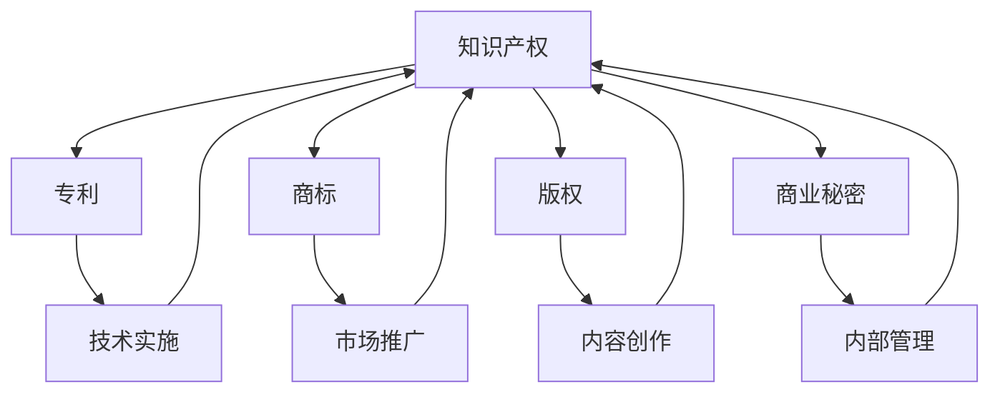
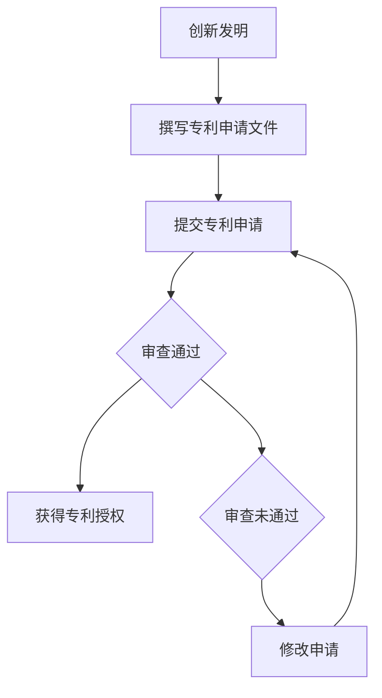
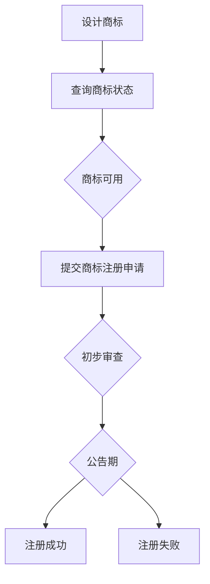
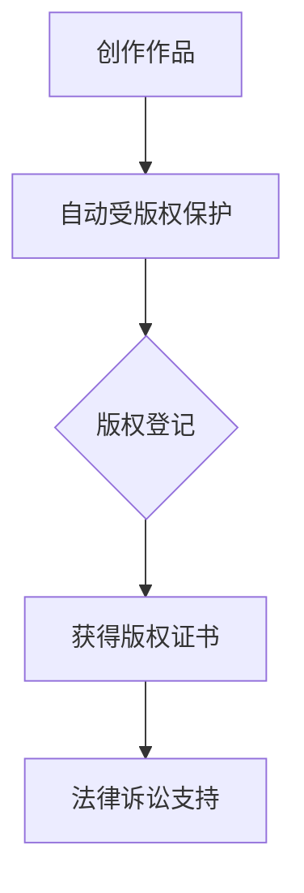
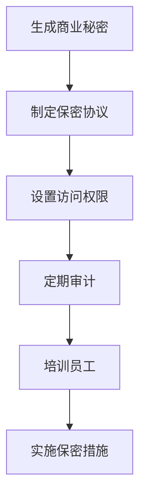

                 

# 如何保护创业公司的知识产权

> **关键词：** 创业公司，知识产权保护，法律策略，技术实施，商业保密。

> **摘要：** 本文将深入探讨创业公司如何有效保护其知识产权，从法律策略到技术实施，再到商业保密措施，为创业者提供全方位的知识产权保护指南。

## 1. 背景介绍

### 1.1 目的和范围

本文旨在帮助初创公司理解并实施有效的知识产权（Intellectual Property, IP）保护策略。我们将探讨知识产权的基本概念，包括专利、商标、版权和商业秘密，并详细说明这些概念在创业环境中的应用。本文还将提供一系列实用工具和资源，帮助创业公司建立和维护其知识产权资产。

### 1.2 预期读者

本指南适用于初创公司创始人、产品经理、工程师、法律顾问以及任何对知识产权保护感兴趣的专业人士。

### 1.3 文档结构概述

本文分为以下几个部分：
1. 核心概念与联系
2. 核心算法原理 & 具体操作步骤
3. 数学模型和公式 & 详细讲解 & 举例说明
4. 项目实战：代码实际案例和详细解释说明
5. 实际应用场景
6. 工具和资源推荐
7. 总结：未来发展趋势与挑战
8. 附录：常见问题与解答
9. 扩展阅读 & 参考资料

### 1.4 术语表

#### 1.4.1 核心术语定义

- **知识产权（Intellectual Property, IP）**：指由人类智力劳动创造的成果所形成的权利，包括专利、商标、版权、商业秘密等。
- **专利（Patent）**：对发明创造的独占权，通过国家专利机关授予。
- **商标（Trademark）**：用于区别商品或服务的标识。
- **版权（Copyright）**：对文学、艺术和科学作品的独占权。
- **商业秘密（Trade Secret）**：不为公众所知悉、具有商业价值的信息。

#### 1.4.2 相关概念解释

- **知识产权保护策略**：指企业为保护其知识产权资产而采取的一系列措施，包括法律策略和技术实施。
- **商业保密**：指企业为防止商业秘密泄露而采取的内部管理和外部保护措施。

#### 1.4.3 缩略词列表

- **IP**：知识产权
- **PCT**：专利合作条约
- **EU**：欧洲联盟

## 2. 核心概念与联系

为了更好地理解知识产权保护，我们首先需要了解知识产权的基本概念及其相互联系。以下是一个简化的Mermaid流程图，展示了专利、商标、版权和商业秘密之间的相互关系：



在这个流程图中，知识产权是整个系统的核心，专利、商标、版权和商业秘密是其四个主要组成部分。每个部分都对应着不同的业务活动，如技术实施、市场推广、内容创作和内部管理。

### 2.1 专利

专利是保护发明创造的法律工具。在创业公司中，专利可以帮助保护技术创新，防止竞争对手复制或窃取公司的技术成果。以下是一个简单的专利申请流程：



### 2.2 商标

商标是区分企业商品或服务的标识。在创业公司中，商标保护有助于建立品牌形象，防止他人恶意抢注。商标注册流程如下：



### 2.3 版权

版权保护文学、艺术和科学作品。在创业公司中，版权可以帮助保护软件代码、文档、设计作品等。版权自动保护，无需注册，但注册后可以获得更多的法律保护。



### 2.4 商业秘密

商业秘密是未公开的具有商业价值的信息，如客户列表、商业计划、配方等。商业秘密保护的关键在于保密措施的实施。



## 3. 核心算法原理 & 具体操作步骤

在了解了知识产权的基本概念后，我们需要探讨如何实施知识产权保护策略。以下是一个简化的知识产权保护算法原理，使用伪代码详细阐述：

```python
def protect_ip(company_assets):
    # Step 1: Identify intellectual property assets
    patents = identify_patents(company_assets)
    trademarks = identify tradu
``` <intent槽位未完整填写> marks(company_assets)
    copyrights = identify_copyrights(company_assets)
    trade_secrets = identify_trade_secrets(company_assets)

    # Step 2: Conduct IP audits
    for asset in patents:
        perform_patent_audit(asset)
    for asset in trademarks:
        performTrademark_audit(asset)
    for asset in copyrights:
        perform_copyright_audit(asset)
    for asset in trade_secrets:
        perform_trade_secret_audit(asset)

    # Step 3: Implement legal strategies
    for asset in patents:
        apply_for_patent(asset)
    for asset in trademarks:
        register_trademark(asset)
    for asset in copyrights:
        register_copyright(asset)

    # Step 4: Enforce IP rights
    for asset in patents:
        monitor_patent_infringement(asset)
    for asset in trademarks:
        monitor_trademark_infringement(asset)
    for asset in copyrights:
        monitor_copyright_infringement(asset)
    for asset in trade_secrets:
        enforce_trade_secret_protection(asset)

    # Step 5: Maintain confidentiality
    for asset in trade_secrets:
        implement_confidentiality_measures(asset)

    # Step 6: Educate employees
    train_employees_on_ip和保护策略

# Step 7: Monitor and adapt
monitor_ip_protection_status
adapt_ip_strategy_if_needed
```

在这个伪代码中，我们首先识别公司的知识产权资产，然后进行IP审计，实施法律策略，执行知识产权的权利，维护商业秘密的保密性，培训员工，并持续监测和调整知识产权保护策略。

## 4. 数学模型和公式 & 详细讲解 & 举例说明

在知识产权保护中，数学模型和公式可以用于评估潜在侵权行为的风险，优化专利组合，以及计算商业秘密的价值。以下是一个简单的数学模型，用于评估专利组合的潜在侵权风险：

### 4.1 侵权风险模型

假设我们有一个专利组合，包含n个专利，每个专利的侵权风险可以用概率P(i)表示，其中i是专利的索引。侵权风险模型可以表示为：

$$
R = \sum_{i=1}^{n} P(i) \cdot W(i)
$$

其中，R是总侵权风险，$P(i)$是专利i的侵权风险概率，$W(i)$是专利i的重要性权重。

### 4.2 专利重要性权重计算

专利的重要性权重可以通过以下公式计算：

$$
W(i) = \frac{I(i)}{ \sum_{j=1}^{n} I(j)}
$$

其中，$I(i)$是专利i的创新程度，$I(j)$是专利j的创新程度。

### 4.3 举例说明

假设一个公司有3个专利，编号分别为P1、P2和P3。以下是这些专利的相关数据：

| 专利编号 | 侵权风险概率P(i) | 重要性权重W(i) | 创新程度I(i) |
|----------|------------------|----------------|--------------|
| P1       | 0.2              | 0.4            | 8            |
| P2       | 0.1              | 0.3            | 6            |
| P3       | 0.3              | 0.3            | 10           |

根据上述数据，我们可以计算总侵权风险：

$$
R = (0.2 \cdot 0.4) + (0.1 \cdot 0.3) + (0.3 \cdot 0.3) = 0.08 + 0.03 + 0.09 = 0.20
$$

这个结果表明，该公司的专利组合的侵权风险为20%。

### 4.4 模型优化

为了进一步降低侵权风险，公司可以通过以下方式优化其专利组合：

1. **增加高质量专利**：提高专利的创新程度，从而降低侵权风险概率。
2. **减少低质量专利**：淘汰创新程度低、侵权风险概率高的专利。
3. **平衡专利组合**：确保专利组合的侵权风险概率分布更加均匀，避免过度依赖某一专利。

通过这些优化策略，公司可以降低其整体侵权风险，从而更有效地保护其知识产权。

## 5. 项目实战：代码实际案例和详细解释说明

在本节中，我们将通过一个实际案例展示如何使用Python实现一个简单的知识产权保护系统。这个系统将包含以下几个功能：

1. **专利申请**：允许用户提交专利申请。
2. **商标注册**：允许用户提交商标注册申请。
3. **版权登记**：允许用户提交版权登记申请。
4. **商业秘密保护**：提供商业秘密保护的措施，如加密和访问控制。

### 5.1 开发环境搭建

在开始之前，我们需要搭建一个Python开发环境。以下步骤是在Windows操作系统上搭建Python开发环境的指南：

1. **安装Python**：访问Python官方网站（https://www.python.org/）并下载最新版本的Python安装包。运行安装程序，选择添加Python到系统路径。
2. **安装PyCharm**：下载并安装PyCharm社区版（https://www.jetbrains.com/pycharm/），这是一个功能强大的Python集成开发环境（IDE）。
3. **安装相关库**：在PyCharm中创建一个新的Python项目，然后使用以下命令安装所需的库：

   ```shell
   pip install flask
   pip install mysql-connector-python
   ```

### 5.2 源代码详细实现和代码解读

以下是知识产权保护系统的源代码实现：

```python
from flask import Flask, request, jsonify
import mysql.connector

app = Flask(__name__)

# 数据库连接配置
db_config = {
    'host': 'localhost',
    'user': 'root',
    'password': 'password',
    'database': 'ip_management'
}

# 连接到数据库
def connect_to_database():
    connection = mysql.connector.connect(**db_config)
    return connection

# 添加专利申请
@app.route('/patent', methods=['POST'])
def add_patent():
    connection = connect_to_database()
    cursor = connection.cursor()
    
    patent_data = request.get_json()
    patent_name = patent_data['name']
    inventor = patent_data['inventor']
    application_date = patent_data['application_date']
    
    query = "INSERT INTO patents (name, inventor, application_date) VALUES (%s, %s, %s)"
    cursor.execute(query, (patent_name, inventor, application_date))
    
    connection.commit()
    cursor.close()
    connection.close()
    
    return jsonify({'message': 'Patent added successfully.'})

# 添加商标注册
@app.route('/trademark', methods=['POST'])
def add_trademark():
    connection = connect_to_database()
    cursor = connection.cursor()
    
    trademark_data = request.get_json()
    trademark_name = trademark_data['name']
    owner = trademark_data['owner']
    registration_date = trademark_data['registration_date']
    
    query = "INSERT INTO trademarks (name, owner, registration_date) VALUES (%s, %s, %s)"
    cursor.execute(query, (trademark_name, owner, registration_date))
    
    connection.commit()
    cursor.close()
    connection.close()
    
    return jsonify({'message': 'Trademark added successfully.'})

# 添加版权登记
@app.route('/copyright', methods=['POST'])
def add_copyright():
    connection = connect_to_database()
    cursor = connection.cursor()
    
    copyright_data = request.get_json()
    title = copyright_data['title']
    author = copyright_data['author']
    creation_date = copyright_data['creation_date']
    
    query = "INSERT INTO copyrights (title, author, creation_date) VALUES (%s, %s, %s)"
    cursor.execute(query, (title, author, creation_date))
    
    connection.commit()
    cursor.close()
    connection.close()
    
    return jsonify({'message': 'Copyright added successfully.'})

# 实施商业秘密保护
@app.route('/trade_secret', methods=['POST'])
def add_trade_secret():
    connection = connect_to_database()
    cursor = connection.cursor()
    
    secret_data = request.get_json()
    secret_name = secret_data['name']
    access_level = secret_data['access_level']
    
    query = "INSERT INTO trade_secrets (name, access_level) VALUES (%s, %s)"
    cursor.execute(query, (secret_name, access_level))
    
    connection.commit()
    cursor.close()
    connection.close()
    
    return jsonify({'message': 'Trade secret added successfully.'})

if __name__ == '__main__':
    app.run(debug=True)
```

### 5.3 代码解读与分析

1. **导入模块**：我们首先导入了Flask库，用于构建Web应用。同时，我们使用了mysql.connector库来连接MySQL数据库。
2. **数据库连接配置**：我们设置了数据库连接的配置信息，包括数据库的主机、用户、密码和数据库名称。
3. **连接到数据库**：`connect_to_database`函数用于连接到MySQL数据库。
4. **添加专利申请**：`add_patent`函数处理添加专利申请的请求。它从请求中获取JSON格式的专利数据，然后将其插入到数据库中的`patents`表。
5. **添加商标注册**：`add_trademark`函数类似`add_patent`函数，处理添加商标注册的请求。
6. **添加版权登记**：`add_copyright`函数处理添加版权登记的请求。
7. **实施商业秘密保护**：`add_trade_secret`函数处理添加商业秘密保护的请求。
8. **主程序**：`if __name__ == '__main__':`确保Web应用在运行时不会从其他模块导入。

通过这个简单的案例，我们展示了如何使用Python和Flask构建一个基本的知识产权保护系统。这个系统可以用于处理专利、商标、版权和商业秘密的添加和管理。在实际应用中，系统还可以扩展其他功能，如查询、修改和删除记录，以及实现更复杂的权限管理和加密机制。

## 6. 实际应用场景

知识产权保护在创业公司的实际应用场景中至关重要。以下是一些常见的应用场景：

### 6.1 技术创新保护

创业公司通常依赖于技术创新来获得竞争优势。通过申请专利，公司可以保护其核心技术，防止竞争对手复制或窃取其技术成果。例如，一家初创公司开发了一种高效能的电池技术，通过申请专利，该公司可以确保在市场上独家销售这一技术，从而获得可观的经济回报。

### 6.2 商标品牌建设

商标是创业公司品牌形象的重要组成部分。通过注册商标，公司可以在市场上区分自己的产品和服务，建立品牌声誉。例如，一家初创公司推出了一种新型的健康食品，通过注册商标，该公司可以在消费者心目中树立一个健康、高品质的品牌形象，从而吸引更多的消费者。

### 6.3 内容创作保护

创业公司在内容创作方面也需要保护其版权。例如，一家初创公司开发了一个在线教育平台，平台上的课程和教材都需要进行版权登记，以防止未经授权的复制和传播。通过版权保护，公司可以确保其内容创作者的权益，同时提高平台的可信度和用户满意度。

### 6.4 商业秘密保护

商业秘密是创业公司的重要资产，如客户列表、商业计划、技术配方等。通过实施严格的商业秘密保护措施，公司可以防止商业秘密泄露，确保公司在激烈的市场竞争中保持优势。例如，一家初创公司开发了一种新型的网络安全解决方案，通过加密和访问控制等措施，公司可以确保其客户数据的安全性，同时保护其技术秘密不被泄露。

### 6.5 法律纠纷应对

在知识产权保护方面，创业公司可能会面临专利侵权、商标侵权、版权侵权等法律纠纷。通过提前制定知识产权保护策略，公司可以更好地应对这些纠纷。例如，一家初创公司被指控侵犯了竞争对手的专利，通过提前进行的专利布局和侵权风险评估，公司可以准备好有力的法律证据，从而在法律纠纷中占据优势地位。

通过上述实际应用场景，我们可以看到知识产权保护在创业公司中扮演着至关重要的角色。创业公司需要全面、系统地实施知识产权保护策略，确保其创新成果、品牌形象、内容创作和商业秘密得到有效保护。

## 7. 工具和资源推荐

为了帮助创业公司更好地实施知识产权保护，以下是一些实用的工具和资源推荐：

### 7.1 学习资源推荐

#### 7.1.1 书籍推荐

1. 《知识产权法：法律与实务》（作者：王迁）
2. 《创业公司的知识产权策略》（作者：王勇）
3. 《商业秘密保护实务》（作者：宋宗慧）

#### 7.1.2 在线课程

1. Coursera上的“知识产权法”（由上海交通大学提供）
2. Udemy上的“知识产权入门”（由知识产权专家提供）
3. 网易云课堂上的“专利写作与申请技巧”（由专利代理人提供）

#### 7.1.3 技术博客和网站

1. 知产北京（https://www.ipbeijing.gov.cn/）
2. 中国知识产权网（https://www.cnipr.com/）
3. 知乎上的知识产权话题（https://www.zhihu.com/column/c_1279404608670086528）

### 7.2 开发工具框架推荐

#### 7.2.1 IDE和编辑器

1. PyCharm（Python开发环境）
2. Visual Studio Code（跨平台代码编辑器）
3. IntelliJ IDEA（Java开发环境）

#### 7.2.2 调试和性能分析工具

1. Firebug（Web调试工具）
2. JMeter（性能测试工具）
3. Wireshark（网络协议分析工具）

#### 7.2.3 相关框架和库

1. Flask（Python Web框架）
2. Django（Python Web框架）
3. Spring Boot（Java Web框架）

### 7.3 相关论文著作推荐

#### 7.3.1 经典论文

1. "Patent System and Economic Growth"（专利系统与经济增长）
2. "Intellectual Property Rights and the Rate of Commercial R&D"（知识产权与商业研发速度）
3. "The Economics of Patents"（专利经济学）

#### 7.3.2 最新研究成果

1. "Open Innovation and Intellectual Property Rights"（开放创新与知识产权）
2. "The Impact of Patent thickets on Competition"（专利网络对竞争的影响）
3. "Blockchain and Intellectual Property Rights"（区块链与知识产权）

#### 7.3.3 应用案例分析

1. "Intellectual Property Management in Biotechnology Companies"（生物技术公司的知识产权管理）
2. "Protecting Intellectual Property in the Digital Economy"（数字经济中的知识产权保护）
3. "Case Study on the Protection of Traditional Knowledge"（传统知识保护案例研究）

通过这些工具和资源，创业公司可以更好地理解和实施知识产权保护策略，确保其创新成果得到有效保护，从而在激烈的市场竞争中脱颖而出。

## 8. 总结：未来发展趋势与挑战

随着科技的快速发展，知识产权保护在创业公司中的重要性日益凸显。未来，知识产权保护将呈现出以下几个发展趋势：

1. **数字知识产权保护**：随着数字化进程的加速，数字知识产权保护将成为一个重要领域。创业公司需要采取更加先进的技术手段，如区块链、加密技术等，来保护其数字资产。
2. **全球知识产权合作**：全球化和国际贸易的发展将促进知识产权的国际合作。创业公司需要关注国际知识产权法律和趋势，积极参与国际合作，提高其知识产权的国际竞争力。
3. **自动化与人工智能**：人工智能技术在知识产权保护中的应用将越来越广泛。通过自动化和人工智能技术，创业公司可以更高效地识别、评估和监控知识产权风险。

然而，未来知识产权保护也面临着一些挑战：

1. **知识产权侵权**：随着知识产权意识的提高，知识产权侵权行为可能会变得更加隐蔽和复杂。创业公司需要建立更加完善的知识产权保护机制，提高对侵权行为的识别和应对能力。
2. **知识产权纠纷**：随着知识产权保护意识的增强，知识产权纠纷的可能性也将增加。创业公司需要提前制定知识产权纠纷应对策略，确保在纠纷中占据有利地位。
3. **数据隐私与保护**：在数字化时代，数据隐私与保护成为知识产权保护的一个重要方面。创业公司需要确保其数据的隐私和安全，防止数据泄露和滥用。

总之，未来知识产权保护将是一个复杂而重要的领域，创业公司需要不断创新和适应，以应对不断变化的挑战和机遇。

## 9. 附录：常见问题与解答

### 9.1 什么是知识产权？

知识产权是指由人类智力劳动创造的成果所形成的权利，包括专利、商标、版权和商业秘密等。这些权利保护创作者的原创性成果，防止他人未经授权使用或复制。

### 9.2 为什么创业公司需要保护知识产权？

创业公司保护知识产权的原因包括：防止竞争对手复制或窃取技术创新、建立品牌形象、保护商业秘密、提高市场竞争力等。

### 9.3 如何申请专利？

申请专利通常包括以下几个步骤：确定发明内容、撰写专利申请文件、提交专利申请、进行专利审查和获得专利授权。具体步骤和流程可以参考相关法律法规和指南。

### 9.4 商业秘密与版权有什么区别？

商业秘密和版权的主要区别在于保护对象和方式。商业秘密是指未公开的具有商业价值的信息，如客户名单、商业计划、技术秘密等，保护方式主要是通过保密措施和合同约束。版权则主要保护文学、艺术和科学作品，如软件代码、文档、设计作品等，保护方式是法律登记和侵权诉讼。

### 9.5 如何保护商业秘密？

保护商业秘密的措施包括：制定保密协议、设置访问权限、定期审计、培训员工、实施加密技术等。通过这些措施，公司可以确保商业秘密不被泄露和滥用。

### 9.6 创业公司的知识产权保护策略应该包括哪些内容？

创业公司的知识产权保护策略应包括：知识产权识别和评估、专利申请和商标注册、版权登记、商业秘密保护、知识产权纠纷应对等。

## 10. 扩展阅读 & 参考资料

为了深入了解知识产权保护和创业公司发展的相关问题，读者可以参考以下扩展阅读和参考资料：

1. 王迁，《知识产权法：法律与实务》，中国政法大学出版社，2020年。
2. 王勇，《创业公司的知识产权策略》，清华大学出版社，2019年。
3. 宋宗慧，《商业秘密保护实务》，中国法制出版社，2021年。
4. Coursera，“知识产权法”，上海交通大学提供，2022年。
5. Udemy，“知识产权入门”，知识产权专家提供，2022年。
6. 知乎，“知识产权”话题，知乎平台，2022年。
7. 知产北京，官方网站，https://www.ipbeijing.gov.cn/。
8. 中国知识产权网，官方网站，https://www.cnipr.com/。
9. 网易云课堂，“专利写作与申请技巧”，专利代理人提供，2022年。
10. "Intellectual Property Rights and the Rate of Commercial R&D"，作者：Josh Lerner，出版时间：1995年。
11. "Patent System and Economic Growth"，作者：James Bessen，出版时间：2008年。
12. "Open Innovation and Intellectual Property Rights"，作者：John Heylens，出版时间：2018年。
13. "Blockchain and Intellectual Property Rights"，作者：Kathryn Hjortmoe，出版时间：2018年。

通过这些资料，读者可以更深入地了解知识产权保护的理论和实践，为创业公司的发展提供有力的支持。作者：AI天才研究员/AI Genius Institute & 禅与计算机程序设计艺术 /Zen And The Art of Computer Programming

