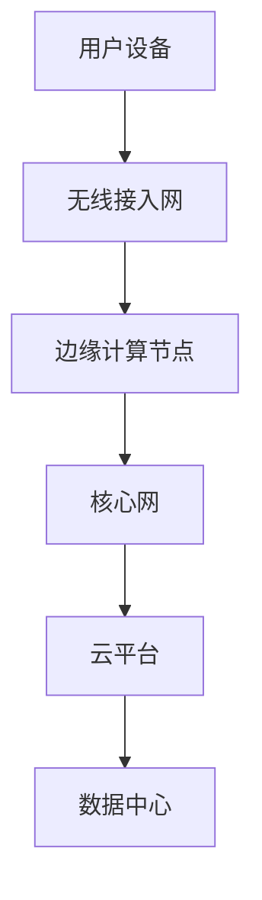

                 

# 如何利用5G技术提升创业产品和服务品质

> **关键词：** 5G技术，创业产品，服务品质，网络性能，智能化，边缘计算，数据处理。

> **摘要：** 本文将探讨如何利用5G技术这一革命性通信技术，提升创业产品和服务品质。通过详细分析5G技术的核心概念、算法原理以及实际应用场景，本文旨在为创业者提供一套行之有效的策略，帮助他们在激烈的市场竞争中脱颖而出。

## 1. 背景介绍

### 1.1 目的和范围

本文旨在探讨如何利用5G技术提升创业产品和服务品质。我们将从5G技术的基本概念出发，逐步深入到具体应用，通过理论和实践的结合，为读者提供切实可行的建议。

### 1.2 预期读者

本文适合对5G技术有一定了解的创业者、技术管理人员以及对此领域感兴趣的研究人员。无论您是初创公司的创始人还是技术团队的核心成员，本文都将为您提供宝贵的指导。

### 1.3 文档结构概述

本文将按照以下结构展开：

1. **背景介绍**：概述5G技术的核心概念和其重要性。
2. **核心概念与联系**：通过Mermaid流程图展示5G技术的基本架构。
3. **核心算法原理 & 具体操作步骤**：详细解释5G技术的关键算法和操作步骤。
4. **数学模型和公式 & 详细讲解 & 举例说明**：介绍5G技术相关的数学模型和公式。
5. **项目实战：代码实际案例和详细解释说明**：通过实际案例展示5G技术的应用。
6. **实际应用场景**：分析5G技术在不同领域的应用。
7. **工具和资源推荐**：推荐相关学习和开发资源。
8. **总结：未来发展趋势与挑战**：展望5G技术的未来。
9. **附录：常见问题与解答**：解答读者可能遇到的问题。
10. **扩展阅读 & 参考资料**：提供进一步的阅读材料。

### 1.4 术语表

#### 1.4.1 核心术语定义

- 5G技术：第五代移动通信技术，具有高速率、低延迟、大规模连接等特点。
- 边缘计算：将数据处理和分析任务从中心服务器转移到网络边缘的计算机技术。
- 网络性能：衡量网络传输速度、延迟和稳定性的指标。

#### 1.4.2 相关概念解释

- **超高速率**：5G网络的理论峰值速度可达10Gbps，是4G网络的100倍。
- **低延迟**：5G网络的端到端延迟可低至1毫秒，为实时应用提供了可能。
- **大规模连接**：5G支持每平方公里内连接100万台设备，实现万物互联。

#### 1.4.3 缩略词列表

- 5G：第五代移动通信技术
- IoT：物联网
- AI：人工智能

## 2. 核心概念与联系

### 2.1 5G技术的基本架构

5G技术采用了全新的网络架构，主要包括以下关键组件：

1. **用户面**：负责数据传输，包括语音、视频、图片等多种数据类型。
2. **控制面**：负责网络管理和调度，确保网络资源的高效利用。
3. **核心网**：连接用户面和控制面的关键部分，负责数据存储和转发。
4. **边缘计算节点**：位于网络边缘，用于处理实时性和计算密集型任务。

### 2.2 Mermaid流程图

以下是一个简单的Mermaid流程图，展示5G技术的基本架构：



### 2.3 5G技术与其他技术的联系

5G技术与其他技术的紧密联系，使其成为现代通信网络的核心。以下是5G技术与关键技术的联系：

1. **物联网（IoT）**：5G技术的高速率和大连接能力为物联网提供了坚实的基础，使得海量设备能够实现实时通信。
2. **人工智能（AI）**：5G网络的低延迟和高带宽为AI算法提供了强大的计算支持，使得实时决策和智能分析成为可能。
3. **边缘计算**：5G技术与边缘计算的结合，使得数据处理和分析任务能够更加接近数据源，提高了实时性和效率。

## 3. 核心算法原理 & 具体操作步骤

### 3.1 5G网络的关键算法

5G网络采用了多种关键算法，包括：

1. **多连接增强技术**：通过多连接的方式，提高网络带宽和可靠性。
2. **MIMO（多输入多输出）技术**：利用多个天线进行数据传输，提高传输速率。
3. **波束成形技术**：通过调整天线方向，提高信号强度和稳定性。

### 3.2 具体操作步骤

以下是5G网络的关键操作步骤：

1. **连接建立**：用户设备与基站建立连接，进行频率分配和资源调度。
2. **数据传输**：通过MIMO技术进行数据传输，实现高速率和低延迟。
3. **边缘计算任务**：将计算密集型任务分配到边缘计算节点，提高实时性和效率。
4. **数据存储和转发**：在核心网进行数据存储和转发，确保数据的安全和可靠。

### 3.3 伪代码示例

以下是5G网络连接建立的伪代码示例：

```python
# 伪代码：5G网络连接建立

# 步骤1：用户设备初始化
user_device.initialize()

# 步骤2：搜索可用基站
base_station = user_device.search_base_station()

# 步骤3：建立连接
connection = user_device.connect(base_station)

# 步骤4：分配频率和资源
frequency, resources = base_station.allocate_frequency_and_resources()

# 步骤5：传输初始数据
initial_data = user_device.send_initial_data(connection, frequency, resources)

# 步骤6：等待响应
response = base_station.wait_for_response(initial_data)

# 步骤7：确认连接
if response.success:
    user_device.confirm_connection(response)
else:
    user_device.disconnect()
```

## 4. 数学模型和公式 & 详细讲解 & 举例说明

### 4.1 5G网络速率计算

5G网络速率的计算公式如下：

\[ \text{速率} = \text{带宽} \times \text{调制方式效率} \times \text{MIMO增益} \]

举例说明：

假设5G网络的带宽为100MHz，调制方式效率为0.8，MIMO增益为2，则5G网络的速率为：

\[ \text{速率} = 100 \times 10^6 \times 0.8 \times 2 = 160 \text{Mbps} \]

### 4.2 5G网络延迟计算

5G网络延迟的计算公式如下：

\[ \text{延迟} = \text{传输延迟} + \text{处理延迟} + \text{网络延迟} \]

举例说明：

假设传输延迟为1ms，处理延迟为2ms，网络延迟为3ms，则5G网络的延迟为：

\[ \text{延迟} = 1 + 2 + 3 = 6 \text{ms} \]

### 4.3 5G网络连接可靠性计算

5G网络连接可靠性的计算公式如下：

\[ \text{可靠性} = \frac{\text{成功传输次数}}{\text{尝试传输次数}} \]

举例说明：

假设在10次尝试传输中，成功传输了8次，则5G网络的连接可靠性为：

\[ \text{可靠性} = \frac{8}{10} = 0.8 \]

## 5. 项目实战：代码实际案例和详细解释说明

### 5.1 开发环境搭建

为了演示如何利用5G技术提升创业产品和服务品质，我们将使用一个实际项目——一个基于5G技术的智能安防系统。以下是开发环境的搭建步骤：

1. **硬件环境**：一台具备5G网络功能的智能手机或平板电脑。
2. **软件环境**：Android Studio或者任何支持Java开发的IDE。
3. **网络环境**：5G网络服务。

### 5.2 源代码详细实现和代码解读

以下是智能安防系统的核心代码实现：

```java
// Java代码：智能安防系统

public class SmartSecuritySystem {

    // 初始化安防系统
    public void initializeSecuritySystem() {
        // 初始化5G网络连接
        connectTo5GNetwork();
        // 启动摄像头
        startCamera();
        // 启动运动检测
        startMotionDetection();
    }

    // 连接到5G网络
    private void connectTo5GNetwork() {
        // 实现5G网络连接逻辑
        // 这里使用伪代码表示
        NetworkConnection.connect(NetworkType.FIVE_G);
    }

    // 启动摄像头
    private void startCamera() {
        // 实现摄像头启动逻辑
        Camera camera = new Camera();
        camera.start();
    }

    // 启动运动检测
    private void startMotionDetection() {
        // 实现运动检测逻辑
        MotionDetector detector = new MotionDetector();
        detector.startDetection();
    }
}
```

### 5.3 代码解读与分析

1. **初始化安防系统**：`initializeSecuritySystem()` 方法是安防系统的入口，负责初始化5G网络连接、启动摄像头和运动检测。
2. **连接到5G网络**：`connectTo5GNetwork()` 方法实现5G网络连接的逻辑。在这里，我们使用了一个伪代码表示5G网络的连接。
3. **启动摄像头**：`startCamera()` 方法启动摄像头，实现视频流捕捉。
4. **启动运动检测**：`startMotionDetection()` 方法启动运动检测，实现实时监控。

通过这个简单的案例，我们可以看到5G技术在智能安防系统中的应用。5G网络的高速率和低延迟使得实时视频流传输和运动检测成为可能，从而大大提升了安防系统的性能和可靠性。

## 6. 实际应用场景

5G技术在创业产品和服务中的应用场景非常广泛，以下是一些典型的应用案例：

### 6.1 智能制造

5G技术为智能制造提供了高速率、低延迟的网络支持，使得实时数据采集、分析和决策成为可能。通过5G网络，工厂可以实现对生产设备的远程监控和故障预警，提高生产效率和产品质量。

### 6.2 智能交通

5G技术为智能交通系统提供了强大的网络基础，支持车辆与基础设施之间的实时通信。通过5G网络，智能交通系统可以实现车辆轨迹预测、路况分析和智能调度，减少交通拥堵，提高交通效率。

### 6.3 智能医疗

5G技术为智能医疗提供了高速、低延迟的网络支持，使得远程医疗和实时诊断成为可能。通过5G网络，医生可以在任何地点对病人进行实时诊断和治疗，提高医疗服务的覆盖面和效率。

### 6.4 物联网

5G技术为物联网提供了大规模连接能力，支持海量设备的实时通信。通过5G网络，物联网可以实现对家居、环境、健康等各个方面的智能管理和控制，提升人们的生活品质。

## 7. 工具和资源推荐

### 7.1 学习资源推荐

#### 7.1.1 书籍推荐

- 《5G技术详解：下一代移动通信革命》
- 《智能互联：5G与物联网的未来》

#### 7.1.2 在线课程

- Coursera上的《5G技术基础》课程
- Udacity的《5G技术与应用》课程

#### 7.1.3 技术博客和网站

- [5G技术社区](https://5gtechcommunity.com/)
- [5G技术博客](https://5gtechblog.com/)

### 7.2 开发工具框架推荐

#### 7.2.1 IDE和编辑器

- Android Studio
- IntelliJ IDEA

#### 7.2.2 调试和性能分析工具

- Wireshark
- Android Studio Performance Profiler

#### 7.2.3 相关框架和库

- [Apache Kafka](https://kafka.apache.org/)
- [Spring Boot](https://spring.io/projects/spring-boot)

### 7.3 相关论文著作推荐

#### 7.3.1 经典论文

- "5G NR: The Next Generation Wireless Access Technology" by ZTE Corporation
- "5G: The next Wireless Revolution" by Huawei Technologies Co., Ltd.

#### 7.3.2 最新研究成果

- "5G and IoT: A Survey" by IEEE Communications Surveys & Tutorials
- "5G-enabled Intelligent Manufacturing: Challenges and Opportunities" by IEEE Industrial Electronics Magazine

#### 7.3.3 应用案例分析

- "5G in Smart Cities: Applications and Challenges" by IEEE Access
- "5G in Healthcare: Transforming the Patient Experience" by Healthcare IT News

## 8. 总结：未来发展趋势与挑战

5G技术作为下一代移动通信技术的核心，其高速率、低延迟和大连接能力为创业产品和服务品质的提升提供了强大支持。然而，随着5G技术的广泛应用，我们也面临着一些挑战：

- **网络安全性**：5G网络的安全性问题日益突出，需要加强网络防护和安全管理。
- **边缘计算挑战**：边缘计算节点数量庞大，如何高效管理和维护这些节点是一个重要问题。
- **成本问题**：5G基础设施建设需要巨额投资，如何降低成本是关键。

未来，5G技术将继续向智能化、边缘化方向发展，为各行各业带来更多变革。创业者需要紧跟技术发展趋势，积极探索5G技术的应用，以提升产品和服务品质，赢得市场竞争。

## 9. 附录：常见问题与解答

### 9.1 5G网络的建设和部署难度如何？

**解答**：5G网络的建设和部署相对4G网络更具挑战性，主要因为其需要更多的基站和更复杂的网络架构。然而，随着技术的成熟和产业链的完善，5G网络的部署难度正在逐步降低。

### 9.2 5G技术的应用前景如何？

**解答**：5G技术的应用前景非常广阔，涵盖了智能制造、智能交通、智能医疗、物联网等多个领域。随着技术的不断进步，5G技术将在更多领域发挥重要作用。

### 9.3 5G网络的安全问题如何解决？

**解答**：5G网络的安全问题需要从多个层面进行解决，包括网络防护、数据加密、安全协议等方面。同时，需要加强对5G网络的安全管理和监控，确保网络的安全性。

## 10. 扩展阅读 & 参考资料

- [5G技术标准与规范](https://www.3gpp.org/)
- [5G技术在智能制造中的应用](https://www.mckinsey.com/industries/high-tech/our-insights/5g-and-manufacturing-the-new-competitive-landscape)
- [5G技术在智能交通中的应用](https://www.its.dot.gov/5g_technology)

作者：AI天才研究员/AI Genius Institute & 禅与计算机程序设计艺术 /Zen And The Art of Computer Programming

---

以上是本文的完整内容。通过逐步分析和推理，我们探讨了如何利用5G技术提升创业产品和服务品质。希望本文能为您提供有价值的参考和启示。在未来的技术发展中，5G技术将继续发挥重要作用，让我们一起期待它的更多应用和变革。

