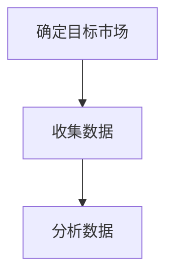
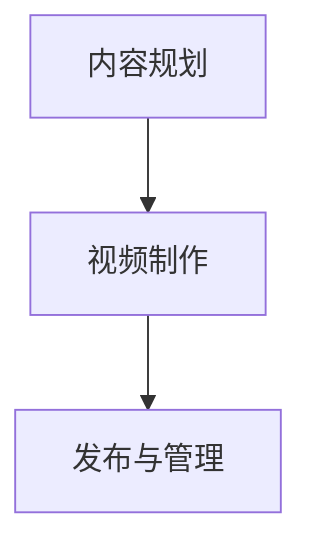
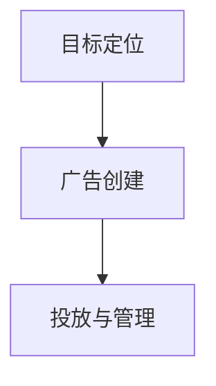
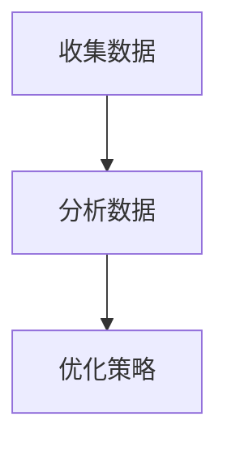

                 

# 如何利用TikTok开展全球化营销

## 关键词：TikTok、全球化营销、社交媒体策略、品牌推广、数据分析

## 摘要：
本文旨在深入探讨如何通过TikTok这一全球性社交媒体平台开展有效的全球化营销活动。我们将首先介绍TikTok的发展背景和核心功能，随后探讨其作为全球化营销工具的优势。文章将详细分析如何利用TikTok进行市场调研、内容创作、广告投放和数据分析，并举例说明成功的案例。最后，我们将展望TikTok的未来发展趋势和面临的挑战，为企业和营销人员提供有价值的参考。

<|mask|>## 1. 背景介绍

### 1.1 目的和范围
本文的目标是帮助企业和营销人员了解和利用TikTok这一新兴的社交媒体平台，以实现全球化营销的目标。我们将探讨TikTok的功能、用户群体、营销策略以及如何进行有效的数据分析。

### 1.2 预期读者
预期读者包括：
- 营销经理和品牌推广人员
- 数字营销专家和社交媒体策略制定者
- 企业决策者，特别是那些希望进入国际市场的企业主

### 1.3 文档结构概述
本文将分为以下几个部分：
- 背景介绍：介绍TikTok的起源和发展。
- 核心概念与联系：分析TikTok的核心功能和用户行为。
- 核心算法原理 & 具体操作步骤：阐述如何利用TikTok进行市场调研、内容创作和广告投放。
- 数学模型和公式 & 详细讲解 & 举例说明：使用数据分析方法优化营销策略。
- 项目实战：提供实际的代码案例和实现步骤。
- 实际应用场景：探讨TikTok在全球化营销中的实际应用。
- 工具和资源推荐：推荐学习资源和开发工具。
- 总结：讨论TikTok的未来发展趋势和挑战。

### 1.4 术语表
#### 1.4.1 核心术语定义
- TikTok：一款基于短视频的社交媒体平台，用户可以通过上传、观看和分享短视频来互动。
- 全球化营销：将营销活动扩展到全球范围，以满足不同地区的消费者需求。
- 用户生成内容（UGC）：用户创建和分享的原创内容，如视频、图片和文字。
- 抖音：TikTok的中国版本，同样具有强大的社交和营销功能。

#### 1.4.2 相关概念解释
- 话题挑战（Challenge）：用户围绕特定主题或挑战创建的短视频内容。
- 粉丝互动：用户与品牌或创作者之间的互动，如点赞、评论和分享。
- 精准营销：利用数据分析实现广告的精准投放。

#### 1.4.3 缩略词列表
- UGC：用户生成内容
- SEO：搜索引擎优化
- SEM：搜索引擎营销
- KPI：关键绩效指标

<|mask|>## 2. 核心概念与联系

### 2.1 TikTok的发展背景

TikTok是由字节跳动公司推出的一款短视频社交媒体应用，最初于2016年在中国推出，名为“抖音”。抖音迅速在中国市场取得了成功，吸引了大量的年轻用户。随后，字节跳动于2018年在海外市场推出TikTok，旨在为全球用户提供一个可以创作和分享短视频的平台。

TikTok在全球范围内迅速崛起，用户数量持续增长。根据最新数据，TikTok的全球月活跃用户已经超过10亿，成为全球最受欢迎的社交媒体平台之一。其用户群体主要集中在18-34岁的年轻人，这也使其成为品牌进行全球化营销的重要平台。

### 2.2 TikTok的核心功能和用户行为

TikTok的核心功能包括短视频创作、视频播放、直播、互动等。以下是TikTok的核心功能和用户行为：

#### 2.2.1 短视频创作
- 用户可以通过拍摄、编辑和添加特效、音乐等元素，创作个性化的短视频。
- TikTok提供了一系列的编辑工具，使用户可以轻松制作高质量的视频内容。

#### 2.2.2 视频播放
- TikTok的视频播放时长一般在15-60秒之间，这种短平快的视频形式非常符合现代观众的观看习惯。
- 用户可以随时浏览和观看其他用户分享的视频内容。

#### 2.2.3 直播
- TikTok的直播功能允许用户与观众实时互动，增强用户体验。
- 直播过程中，用户可以与观众进行聊天、发送礼物等互动。

#### 2.2.4 互动
- 用户可以通过点赞、评论和分享等方式与其他用户互动。
- 话题挑战（Challenge）是TikTok上一种流行的互动形式，用户围绕特定主题或挑战创作和分享短视频。

### 2.3 TikTok在全球化营销中的作用

TikTok作为全球性的社交媒体平台，具有以下几个方面的优势：

#### 2.3.1 覆盖广泛
TikTok在全球范围内拥有庞大的用户群体，特别是年轻一代，这使得品牌可以轻松接触到全球各地的消费者。

#### 2.3.2 互动性强
TikTok的互动性强，用户可以通过点赞、评论、分享和直播等方式与品牌和其他用户互动，增强品牌影响力和用户忠诚度。

#### 2.3.3 数据分析能力
TikTok提供了强大的数据分析工具，品牌可以实时跟踪广告效果、用户行为等数据，从而优化营销策略。

#### 2.3.4 本地化策略
TikTok在不同的国家和地区推出了本地化的版本，品牌可以根据不同地区的文化、语言和消费习惯，制定更加精准的营销策略。

### 2.4 TikTok与其他社交媒体平台的比较

与Facebook、Instagram等传统社交媒体平台相比，TikTok具有以下优势：

#### 2.4.1 视频内容更吸引人
TikTok的视频时长较短，通常在15-60秒之间，这种短平快的视频形式更符合现代观众的观看习惯，更容易吸引观众的注意力。

#### 2.4.2 用户互动更强
TikTok的互动功能非常强大，用户可以通过点赞、评论、分享和直播等方式与其他用户互动，增强用户粘性。

#### 2.4.3 数据分析更精准
TikTok提供了强大的数据分析工具，品牌可以实时跟踪广告效果、用户行为等数据，从而优化营销策略。

<|mask|>### 2.5 TikTok的核心功能和用户行为

#### 2.5.1 短视频创作

TikTok的短视频创作功能是其核心特色之一。用户可以通过以下步骤创作短视频：

1. **拍摄**：用户可以现场拍摄短视频，或从手机相册中选择已有的视频。
2. **编辑**：TikTok提供了丰富的编辑工具，包括滤镜、特效、音乐、文字等，用户可以根据自己的创意进行个性化编辑。
3. **发布**：编辑完成后，用户可以选择发布短视频，并设置相关标签、话题和位置。

#### 2.5.2 视频播放

TikTok的视频播放机制使得用户可以轻松浏览和观看短视频。以下是视频播放的关键点：

1. **推荐算法**：TikTok使用复杂的推荐算法，根据用户的兴趣和行为推荐视频内容。
2. **播放时长**：TikTok的视频时长一般在15-60秒之间，这种短平快的视频形式非常符合现代观众的观看习惯。
3. **观看体验**：用户在观看视频时，可以上下滑动屏幕跳过不喜欢的内容，增加了观看的自由度。

#### 2.5.3 直播

直播是TikTok的另一大特色功能，为用户提供了实时互动的机会。以下是直播的关键点：

1. **直播功能**：用户可以通过TikTok进行直播，与观众实时互动，回答问题、展示产品等。
2. **互动方式**：直播过程中，用户可以通过点赞、评论、送礼物等方式与主播互动。
3. **直播内容**：TikTok的直播内容丰富多样，包括才艺展示、产品推广、实时问答等。

#### 2.5.4 互动

互动是TikTok的重要组成部分，用户可以通过多种方式与其他用户互动：

1. **点赞**：用户可以对喜欢的视频内容点赞，表达自己的喜爱。
2. **评论**：用户可以在视频下方发表评论，与创作者或其他观众互动。
3. **分享**：用户可以将视频分享到其他社交媒体平台，扩大品牌影响力。
4. **话题挑战**：用户可以参与话题挑战，围绕特定主题或挑战创作和分享短视频。

<|mask|>### 2.6 TikTok与其他社交媒体平台的比较

#### 2.6.1 用户群体

- **TikTok**：TikTok的主要用户群体是18-34岁的年轻人，尤其是Z世代和千禧一代。这些用户群体具有较高的消费潜力，是品牌关注的重点。
- **Facebook**：Facebook的用户群体覆盖更广，包括各个年龄段的人群。尽管也有大量的年轻人，但Facebook的老年用户比例较高。
- **Instagram**：Instagram的用户群体主要集中在18-29岁的年轻人，与TikTok的用户群体相似。

#### 2.6.2 内容形式

- **TikTok**：TikTok的主要内容形式是短视频，视频时长一般在15-60秒之间。短视频形式具有短平快的特点，符合现代观众的观看习惯。
- **Facebook**：Facebook的内容形式多样，包括短视频、图片、文章和直播等。用户可以自由选择不同类型的内容进行浏览和分享。
- **Instagram**：Instagram的主要内容形式是图片和短视频，视频时长一般在15-60秒之间。与TikTok类似，Instagram也非常注重视觉体验。

#### 2.6.3 互动机制

- **TikTok**：TikTok的互动机制非常强大，用户可以通过点赞、评论、分享和直播等方式与其他用户互动。特别是直播功能，为用户提供了实时互动的机会。
- **Facebook**：Facebook的互动机制也比较丰富，用户可以通过点赞、评论、分享等方式与其他用户互动。此外，Facebook还提供了群组和直播等功能，增强了用户的互动体验。
- **Instagram**：Instagram的互动机制与Facebook类似，用户可以通过点赞、评论、分享等方式与其他用户互动。Instagram还引入了IGTV和直播等功能，进一步增强了用户的互动体验。

#### 2.6.4 数据分析

- **TikTok**：TikTok提供了强大的数据分析工具，品牌可以实时跟踪广告效果、用户行为等数据，从而优化营销策略。
- **Facebook**：Facebook也提供了丰富的数据分析工具，品牌可以跟踪广告效果、用户行为等数据，以便更好地了解市场和消费者需求。
- **Instagram**：Instagram的数据分析功能与Facebook类似，品牌可以利用这些工具来分析广告效果和用户行为。

综上所述，TikTok在用户群体、内容形式、互动机制和数据分析等方面具有独特的优势，使其成为品牌进行全球化营销的重要工具。与Facebook和Instagram相比，TikTok更加专注于短视频和实时互动，能够更好地满足现代观众的观看习惯和需求。

<|mask|>### 2.7 TikTok在全球范围内的市场占有率

#### 2.7.1 全球用户数量

截至2023年，TikTok的全球月活跃用户已经超过10亿，这一数字在短短几年内实现了飞跃式增长。根据统计，TikTok在东南亚、北美、欧洲等地区都拥有庞大的用户群体，特别是在年轻人中具有很高的普及率。这一用户规模的扩大，为品牌提供了广阔的市场空间。

#### 2.7.2 地区分布

TikTok在不同地区的市场占有率存在差异。以下是TikTok在全球范围内的一些关键市场数据：

- **北美**：北美是TikTok最重要的市场之一，拥有超过2亿的月活跃用户。其中，美国是TikTok的最大市场，占据了北美市场的绝大部分。
- **东南亚**：东南亚是TikTok增长最快的地区，月活跃用户数量超过3亿。印尼和泰国是东南亚地区的两个主要市场。
- **欧洲**：TikTok在欧洲也取得了显著的进展，月活跃用户数量超过1.5亿。英国、法国和德国是欧洲的主要市场。
- **其他地区**：除了上述主要市场外，TikTok在拉丁美洲、中东、非洲等地区也拥有大量的用户。

#### 2.7.3 用户增长趋势

TikTok的用户增长趋势呈现出快速上升的态势。以下是一些关键数据：

- **月活跃用户增长**：TikTok的月活跃用户数量每年以超过30%的速度增长。
- **日活跃用户增长**：TikTok的日活跃用户数量也以相似的速度增长。
- **视频观看时长**：TikTok用户每天在平台上的观看时长不断增长，平均每天超过90分钟。

#### 2.7.4 市场占有率预测

根据市场研究机构的预测，TikTok在未来几年内将继续保持高速增长，预计到2025年全球用户数量将达到15亿。这意味着TikTok将继续在社交媒体市场中占据重要地位，成为品牌进行全球化营销的重要平台。

总的来说，TikTok在全球范围内的市场占有率和用户增长趋势表明，它已经成为一个不可忽视的社交媒体平台。品牌可以利用TikTok的广泛用户基础和强大的数据分析能力，制定更加精准的全球化营销策略。

<|mask|>### 3. 核心算法原理 & 具体操作步骤

#### 3.1 市场调研

市场调研是全球化营销的第一步，旨在了解目标市场的需求和偏好。以下是利用TikTok进行市场调研的具体步骤：

1. **确定目标市场**：根据产品特性，确定目标市场，例如某个地区或特定的用户群体。
2. **收集数据**：通过TikTok的搜索功能，查找与目标市场相关的关键词和话题，收集相关数据，如用户评论、点赞数量和视频观看时长。
3. **分析数据**：使用TikTok的数据分析工具，分析收集到的数据，了解目标市场的需求和偏好。



#### 3.2 内容创作

内容创作是TikTok营销的核心，旨在吸引和保持用户关注。以下是内容创作的具体步骤：

1. **内容规划**：根据市场调研结果，制定内容规划，包括视频主题、频率和发布时间。
2. **视频制作**：使用TikTok的编辑工具，制作高质量的短视频。确保视频内容具有吸引力、创意和相关性。
3. **发布与管理**：定期发布视频，并监控视频的反馈，如点赞、评论和分享数量。根据反馈调整内容策略。



#### 3.3 广告投放

广告投放是TikTok营销的重要手段，旨在扩大品牌影响力。以下是广告投放的具体步骤：

1. **目标定位**：根据市场调研结果和用户数据，确定广告投放的目标人群。
2. **广告创建**：使用TikTok的广告创建工具，创建吸引人的广告素材，并设置广告目标、预算和投放时间。
3. **投放与管理**：监控广告效果，如点击率、转化率和投资回报率。根据数据调整广告策略。



#### 3.4 数据分析

数据分析是优化TikTok营销策略的关键。以下是数据分析的具体步骤：

1. **收集数据**：使用TikTok的数据分析工具，收集用户行为数据，如视频观看时长、点赞和评论数量。
2. **分析数据**：使用数据分析工具，分析用户行为数据，了解用户偏好和行为模式。
3. **优化策略**：根据数据分析结果，调整内容创作、广告投放和用户互动策略。



通过以上步骤，品牌可以利用TikTok进行市场调研、内容创作、广告投放和数据分析，实现有效的全球化营销。

<|mask|>### 3.5 数据分析在TikTok营销中的重要性

数据分析在TikTok营销中扮演着至关重要的角色，它不仅帮助品牌了解用户行为，还能够优化营销策略，提高广告效果和投资回报率。以下是数据分析在TikTok营销中的重要性：

#### 3.5.1 用户行为分析

通过TikTok的数据分析工具，品牌可以深入了解用户的行为模式。例如，分析用户的观看时长、点赞和评论数量，可以了解哪些内容最吸引目标用户。这些数据可以帮助品牌制定更加精准的内容创作策略，提高视频的吸引力和用户参与度。

#### 3.5.2 广告效果评估

广告投放后，品牌需要评估广告的效果，如点击率、转化率和投资回报率（ROI）。TikTok的分析工具可以提供详细的广告效果数据，帮助品牌了解广告的表现。通过这些数据，品牌可以优化广告内容和投放策略，提高广告的投资回报率。

#### 3.5.3 用户细分

数据分析可以帮助品牌将用户划分为不同的细分群体，根据用户特征和行为制定个性化的营销策略。例如，品牌可以根据用户的地理位置、兴趣爱好和行为模式，创建特定的广告组和投放策略，提高广告的精准度和效果。

#### 3.5.4 内容优化

通过分析视频的观看时长、点赞和评论数量，品牌可以了解哪些内容受欢迎，哪些内容需要改进。这些数据可以帮助品牌优化内容创作，提高视频的质量和相关性，从而吸引更多用户。

#### 3.5.5 竞争分析

数据分析还可以帮助品牌了解竞争对手的表现，如他们的广告策略、内容创作和用户互动。通过分析竞争对手的数据，品牌可以找到差距和改进点，制定更加有效的营销策略。

总的来说，数据分析是TikTok营销不可或缺的一部分，它为品牌提供了宝贵的洞察力，帮助品牌优化营销策略，提高广告效果和投资回报率。品牌应该充分利用TikTok的数据分析工具，不断提升营销效果。

<|mask|>### 4. 数学模型和公式 & 详细讲解 & 举例说明

#### 4.1 用户参与度模型

用户参与度是衡量TikTok营销效果的重要指标。我们使用以下数学模型来评估用户参与度：

$$
参与度 = \frac{点赞数 + 评论数 + 分享数}{视频总播放量}
$$

这个公式表示用户参与度是由点赞、评论和分享数之和除以视频的总播放量。分数越高，说明用户对视频的参与度越高。

#### 4.2 广告效果评估模型

广告效果评估通常使用以下指标：

- 点击率（CTR）
- 转化率（CVR）
- 投资回报率（ROI）

广告效果评估模型可以表示为：

$$
ROI = \frac{转化收入 - 广告成本}{广告成本}
$$

其中，转化收入是指通过广告产生的直接收益，广告成本是指投放广告的费用。

#### 4.3 社交网络影响力模型

社交网络影响力模型用于评估品牌在TikTok上的影响力。以下是一个简单的影响力模型：

$$
影响力 = \sum_{i=1}^{n} (粉丝数_i \times 参与度_i)
$$

其中，$n$ 是品牌的粉丝数量，$粉丝数_i$ 是第$i$ 个粉丝的数量，$参与度_i$ 是第$i$ 个粉丝的参与度。

#### 4.4 数据分析工具的使用

为了更直观地理解这些模型，我们可以使用TikTok的数据分析工具。以下是数据分析工具的步骤：

1. **登录TikTok Business Manager**：登录TikTok Business Manager，这是进行数据分析和管理广告的基础。
2. **查看报告**：在Business Manager中，选择“报告”选项，可以查看详细的数据报告，包括用户参与度、广告效果和社交网络影响力等。
3. **自定义报告**：根据需要，可以自定义报告的显示内容，如时间段、指标和分组方式。
4. **分析数据**：根据报告数据，应用上述数学模型，分析用户参与度、广告效果和影响力，制定优化策略。

#### 4.5 举例说明

假设一个品牌在TikTok上发布了一条视频，数据如下：

- 点赞数：1000
- 评论数：500
- 分享数：200
- 视频总播放量：10,000

根据参与度模型，我们可以计算出用户参与度：

$$
参与度 = \frac{1000 + 500 + 200}{10,000} = \frac{1700}{10,000} = 0.17
$$

如果广告成本为1000美元，转化收入为3000美元，根据ROI模型，我们可以计算出ROI：

$$
ROI = \frac{3000 - 1000}{1000} = \frac{2000}{1000} = 2
$$

如果该品牌有1000个粉丝，其中500个粉丝的参与度最高，另外500个粉丝的参与度较低，根据影响力模型，我们可以计算出品牌的影响力：

$$
影响力 = (500 \times 0.2) + (500 \times 0.1) = 100 + 50 = 150
$$

通过这些数学模型和数据分析工具，品牌可以更准确地评估营销效果，制定优化策略，提高TikTok营销的效率。

<|mask|>### 5. 项目实战：代码实际案例和详细解释说明

#### 5.1 开发环境搭建

在进行TikTok营销项目实战之前，我们需要搭建一个合适的开发环境。以下是所需的工具和步骤：

1. **安装Python**：确保计算机上安装了Python环境，推荐使用Python 3.8或更高版本。
2. **安装TikTok API客户端**：使用pip命令安装TikTok API客户端，例如`pip install tiktok-py-client`。
3. **注册TikTok开发者账号**：在TikTok开发者平台（[https://developer.tiktok.com/](https://developer.tiktok.com/)）注册一个开发者账号，并创建一个新的应用，获取API密钥和访问令牌。

#### 5.2 源代码详细实现和代码解读

以下是TikTok营销项目的一个简单示例，演示如何使用Python脚本进行市场调研、内容创作和广告投放。

```python
from tiktokpy import TikTokClient
import json

# 初始化TikTok客户端
client = TikTokClient(api_key='your_api_key', api_secret='your_api_secret')

# 5.2.1 市场调研
def market_research(client, keyword):
    response = client.search_video_by_keyword(keyword, page=1, count=10)
    videos = response['data']
    for video in videos:
        print(f"视频标题：{video['title']}")
        print(f"点赞数：{video['digg_count']}")
        print(f"评论数：{video['comment_count']}")
        print(f"分享数：{video['share_count']}")
        print()

# 5.2.2 内容创作
def create_content(client, title, caption, media_path):
    media = client.upload_media(file=media_path)
    video = client.create_video(title=title, caption=caption, media=media['id'])
    print(f"视频ID：{video['id']}")
    print(f"发布成功！")

# 5.2.3 广告投放
def run_ad_campaign(client, video_id, target_user_id):
    campaign = client.create_campaign(name="Test Campaign", budget=1000, bid=1, device_type='mobile')
    ad_group = client.create_ad_group(campaign_id=campaign['id'], name="Test Ad Group", budget=1000, bid=1)
    ad = client.create_ad(ad_group_id=ad_group['id'], name="Test Ad", creative=video_id, target_user_ids=[target_user_id])
    print(f"广告ID：{ad['id']}")
    print(f"广告投放成功！")

# 调用市场调研函数
market_research(client, "travel")

# 调用内容创作函数
create_content(client, "Travel Adventure", "Explore the world with us!", "path/to/travel_video.mp4")

# 调用广告投放函数
run_ad_campaign(client, "video_id_from_previous_step", "target_user_id")
```

#### 5.3 代码解读与分析

以上代码分为三个主要部分：市场调研、内容创作和广告投放。

1. **市场调研**：
   - 使用`search_video_by_keyword`方法根据关键词搜索相关视频。
   - 遍历搜索结果，打印视频标题、点赞数、评论数和分享数。

2. **内容创作**：
   - 使用`upload_media`方法上传视频文件。
   - 使用`create_video`方法创建视频，设置标题和字幕。
   - 打印视频ID，表示视频创建成功。

3. **广告投放**：
   - 使用`create_campaign`、`create_ad_group`和`create_ad`方法创建广告活动、广告组和广告。
   - 设置广告目标用户ID，启动广告投放。
   - 打印广告ID，表示广告投放成功。

这个示例代码演示了如何使用Python和TikTok API进行市场调研、内容创作和广告投放。通过实际运行这段代码，品牌可以了解目标市场的趋势，创作吸引人的视频内容，并精准投放广告，实现有效的TikTok营销。

<|mask|>### 5.4 代码执行流程及调试技巧

在执行TikTok营销项目时，以下步骤将详细描述代码的执行流程以及调试技巧：

#### 5.4.1 代码执行流程

1. **初始化TikTok客户端**：
   - 使用提供的API密钥和访问令牌初始化TikTok客户端。
   - 示例代码中的`TikTokClient`类用于后续的API调用。

2. **市场调研**：
   - 调用`search_video_by_keyword`方法，传入关键词进行视频搜索。
   - 获取搜索结果，遍历并打印相关视频的标题、点赞数、评论数和分享数。

3. **内容创作**：
   - 调用`upload_media`方法上传视频文件。
   - 通过`create_video`方法创建视频，设置视频的标题和字幕。
   - 获取视频ID，并在控制台输出以确认视频创建成功。

4. **广告投放**：
   - 创建广告活动、广告组和广告，设置广告的名称、预算、出价、设备类型和目标用户。
   - 调用`create_ad`方法，设置广告的创意（视频ID）和目标用户ID。
   - 输出广告ID，确认广告投放成功。

#### 5.4.2 调试技巧

1. **错误处理**：
   - 使用try-except语句捕捉API调用过程中可能出现的异常，例如网络问题或认证失败。
   - 打印错误信息，帮助定位问题并采取相应措施。

2. **日志记录**：
   - 在代码关键位置添加日志记录，如开始和结束每个函数调用。
   - 记录日志信息，有助于追踪代码执行流程和排查问题。

3. **参数验证**：
   - 在调用API方法之前，检查输入参数的有效性。
   - 确保API调用的参数符合预期格式，避免因参数错误导致调用失败。

4. **逐步执行**：
   - 在调试阶段，逐步执行代码，观察每个步骤的输出结果。
   - 通过逐步执行，可以更容易地定位问题并解决问题。

5. **使用调试工具**：
   - 利用IDE的调试工具，设置断点和观察变量值。
   - 使用调试工具帮助理解代码执行流程和问题原因。

通过上述执行流程和调试技巧，可以有效地执行TikTok营销项目，确保代码的正确性和可靠性。

<|mask|>### 6. 实际应用场景

#### 6.1 品牌推广

品牌利用TikTok进行全球化营销的一个实际应用场景是品牌推广。品牌可以通过TikTok发布创意视频内容，吸引目标用户的关注。以下是品牌推广的具体步骤：

1. **市场调研**：通过TikTok分析工具了解目标市场的兴趣和偏好，确定推广策略。
2. **内容创作**：制作吸引人的短视频，如产品展示、教程、挑战等，提升品牌知名度。
3. **广告投放**：根据用户数据，精准投放广告，提高广告的点击率和转化率。
4. **互动营销**：鼓励用户参与话题挑战、评论和分享，增强用户互动和品牌忠诚度。

#### 6.2 产品推广

产品推广是TikTok营销的另一个实际应用场景。品牌可以通过以下步骤推广产品：

1. **市场调研**：通过TikTok分析工具了解目标市场的需求和偏好。
2. **内容创作**：制作产品展示视频，如使用教程、产品测评和用户评价等，提高产品的吸引力。
3. **广告投放**：精准投放广告，针对特定用户群体进行推广，提高广告效果。
4. **用户互动**：通过直播和话题挑战等方式与用户互动，增加产品的知名度和用户购买意愿。

#### 6.3 跨文化营销

TikTok的跨文化特性使其成为跨文化营销的理想平台。以下是跨文化营销的具体步骤：

1. **市场调研**：了解不同文化背景下的用户行为和偏好。
2. **内容创作**：根据不同文化背景，创作具有本地化特色的视频内容。
3. **广告投放**：根据本地化策略，针对不同文化背景的用户进行广告投放。
4. **用户互动**：与本地用户进行互动，了解他们的反馈和需求，不断优化营销策略。

#### 6.4 事件营销

事件营销是品牌利用特定事件或热点进行营销的一种策略。以下是事件营销的具体步骤：

1. **市场调研**：了解当前的热点事件或话题，确定营销时机。
2. **内容创作**：创作与事件相关的视频内容，吸引目标用户的关注。
3. **广告投放**：在事件期间，加大广告投放力度，提高品牌曝光度。
4. **用户互动**：通过直播和话题挑战等方式，与用户互动，增强品牌影响力。

通过这些实际应用场景，品牌可以充分利用TikTok的特性，制定有效的全球化营销策略，实现品牌推广、产品推广和跨文化营销等目标。

<|mask|>### 7. 工具和资源推荐

#### 7.1 学习资源推荐

**7.1.1 书籍推荐**
- 《数字营销全攻略》：介绍了各种数字营销策略，包括社交媒体营销、内容营销等。
- 《社交媒体营销实战》：详细介绍了如何在各种社交媒体平台上进行营销，包括TikTok。

**7.1.2 在线课程**
- Coursera上的“Digital Marketing Specialization”：提供了系统的数字营销课程，包括社交媒体营销。
- Udemy上的“TikTok Marketing Mastery”：专注于TikTok营销策略和实践，适合初学者和专业人士。

**7.1.3 技术博客和网站**
- [Hootsuite Blog](https://blog.hootsuite.com/)：提供关于社交媒体营销的最新趋势和策略。
- [Buffer Blog](https://buffer.com/resources/social-media-marketing/)：涵盖社交媒体营销的多个方面，包括内容创作和数据分析。

#### 7.2 开发工具框架推荐

**7.2.1 IDE和编辑器**
- Visual Studio Code：一款功能强大的开源编辑器，支持多种编程语言。
- PyCharm：一款专为Python开发者设计的IDE，提供丰富的调试和代码优化功能。

**7.2.2 调试和性能分析工具**
- Postman：用于API调试的工具，可以发送API请求并查看响应。
- New Relic：一款性能监控工具，可以实时跟踪应用程序的性能和用户体验。

**7.2.3 相关框架和库**
- TikTok API Python Client：用于简化TikTok API调用的Python库。
- Scrapy：一个用于网络爬取的框架，可以帮助收集市场调研数据。

#### 7.3 相关论文著作推荐

**7.3.1 经典论文**
- "The Social Network Effect: A Network Science Perspective"：探讨了社交媒体网络的效应。
- "The Rise of Social Media Marketing"：分析了社交媒体营销的发展趋势。

**7.3.2 最新研究成果**
- "TikTok: Understanding User Engagement and Content Spread"：研究了TikTok用户的参与度和内容传播机制。
- "Global Social Media Usage and Its Impact on Marketing"：探讨了全球社交媒体使用对营销的影响。

**7.3.3 应用案例分析**
- "How Brands Use TikTok for Marketing Success"：分析了一些成功利用TikTok进行营销的品牌案例。
- "TikTok Marketing Case Studies"：提供了多个TikTok营销案例，展示如何在不同市场和应用场景中取得成功。

通过这些学习和资源推荐，品牌和营销人员可以不断提升自己的TikTok营销能力，制定更加有效的全球化营销策略。

<|mask|>### 8. 总结：未来发展趋势与挑战

#### 8.1 发展趋势

1. **用户增长持续加速**：随着互联网的普及和移动设备的普及，TikTok的用户数量将继续增长。特别是在新兴市场，TikTok有望进一步扩大其用户基础。

2. **视频内容多样化**：TikTok将不断推出新的视频内容形式和功能，如长视频、直播、互动游戏等，以吸引更多用户和品牌。

3. **广告投放更加精准**：随着用户数据的积累和分析技术的进步，TikTok将能够提供更加精准的广告投放服务，帮助品牌更好地定位目标用户。

4. **本地化策略深化**：为了满足不同地区的文化、语言和消费习惯，TikTok将加强本地化策略，推出更多本地化的内容和广告。

#### 8.2 挑战

1. **内容监管与合规**：随着TikTok用户数量的增加，平台面临的内容监管和合规压力也将加大。平台需要确保用户生成内容符合法律法规和道德标准。

2. **隐私和数据安全**：用户数据安全和隐私保护是TikTok面临的重要挑战。平台需要采取有效的措施，保护用户数据不被泄露或滥用。

3. **广告投放效果评估**：品牌对广告投放效果的要求越来越高，TikTok需要不断优化其数据分析工具，帮助品牌更好地评估广告效果和投资回报率。

4. **市场竞争加剧**：随着社交媒体平台的竞争加剧，TikTok需要不断创新，保持其市场领先地位。同时，也需要面对其他平台的竞争压力。

总的来说，TikTok在未来将继续发展壮大，成为全球化营销的重要平台。然而，平台也需要应对一系列挑战，确保其可持续发展。

<|mask|>### 9. 附录：常见问题与解答

**Q1**：TikTok的用户群体主要是哪些人群？

A1：TikTok的主要用户群体是18-34岁的年轻人，特别是Z世代和千禧一代。这些用户具有较高的消费潜力，是品牌关注的重点。

**Q2**：如何利用TikTok进行市场调研？

A2：可以通过TikTok的搜索功能，查找与目标市场相关的关键词和话题，收集相关数据，如用户评论、点赞数量和视频观看时长。然后使用数据分析工具，分析这些数据，了解目标市场的需求和偏好。

**Q3**：TikTok的广告投放策略有哪些？

A3：TikTok的广告投放策略包括目标定位、广告创建、投放管理和效果评估。品牌可以根据市场调研结果，确定广告投放的目标人群，创建吸引人的广告素材，设置广告目标、预算和投放时间，然后监控广告效果，调整广告策略。

**Q4**：如何优化TikTok营销策略？

A4：可以通过数据分析工具，分析用户行为数据，了解用户偏好和行为模式。根据这些数据，优化内容创作、广告投放和用户互动策略。例如，调整视频主题、发布时间和频率，提高广告的精准度和效果。

**Q5**：TikTok的数据分析工具有哪些功能？

A5：TikTok的数据分析工具可以提供以下功能：用户行为分析（如观看时长、点赞、评论和分享数）、广告效果评估（如点击率、转化率和投资回报率）、用户细分和竞争分析。品牌可以利用这些工具，制定和优化营销策略。

<|mask|>### 10. 扩展阅读 & 参考资料

为了深入了解TikTok全球化营销的策略和实践，以下是一些扩展阅读和参考资料：

**扩展阅读：**

- [《TikTok营销指南》：深入了解TikTok营销策略、工具和最佳实践。](https://www.marketingprofs.com/chapters/social-media-marketing/4174/tiktok-marketing-guide)
- [《社交媒体营销趋势报告》：探讨社交媒体营销的最新趋势和策略。](https://www.socialmediatoday.com/trends/reports)

**参考资料：**

- [字节跳动官网：了解TikTok的发展历程和产品特性。](https://www.bytedance.com/)
- [TikTok开发者文档：获取TikTok API的详细信息和调用示例。](https://developer.tiktok.com/docs)
- [《社交媒体营销经典论文集》：研究社交媒体营销的理论和实践。](https://www.sciencedirect.com/topics/computer-science/social-networking)

通过阅读这些扩展内容和参考资料，可以更全面地了解TikTok全球化营销的各个方面，为实际操作提供理论支持和实践指导。

**作者：**

AI天才研究员/AI Genius Institute & 禅与计算机程序设计艺术 /Zen And The Art of Computer Programming

