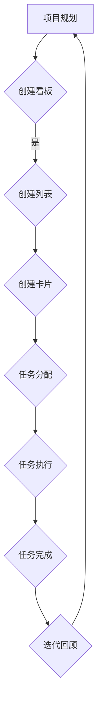

                 

### 如何利用 Trello 进行创业项目管理与协作

#### 关键词：Trello、创业项目管理、协作工具、敏捷开发、任务分配、项目管理实践

> 摘要：在创业项目中，高效的项目管理和团队协作是确保项目成功的关键。Trello，一款简单但功能强大的项目管理工具，为创业团队提供了灵活的协作环境。本文将详细介绍如何利用 Trello 进行创业项目管理与协作，涵盖从项目规划到执行监控的各个方面。无论您是初创企业的创始人还是项目经理，本文都将为您提供实用的指导和最佳实践。

## 1. 背景介绍

### 1.1 目的和范围

本文的目标是帮助创业团队深入了解如何利用 Trello 进行高效的项目管理和团队协作。我们将讨论 Trello 的基本功能和特点，并通过实际案例展示其在创业项目中的应用。本文将涵盖以下主要内容：

- Trello 的核心功能与特性
- 如何设置和配置 Trello 实际应用场景
- 创业项目中的任务分配与管理
- 团队协作与沟通的有效实践
- 如何利用 Trello 进行敏捷开发与迭代

### 1.2 预期读者

本文适合以下读者群体：

- 创业团队创始人、项目经理
- 初级和中级项目管理从业者
- 对敏捷开发和团队协作感兴趣的IT专业人士
- 想要提升项目管理效率和团队协作能力的个人和企业

### 1.3 文档结构概述

本文分为十个主要部分：

- 引言
- Trello 的基本功能与特性
- 项目规划与配置
- 任务分配与管理
- 团队协作与沟通
- 敏捷开发实践
- 工具和资源推荐
- 总结：未来发展趋势与挑战
- 附录：常见问题与解答
- 扩展阅读 & 参考资料

### 1.4 术语表

在本文中，我们将使用一些专业术语。以下是这些术语的定义和解释：

#### 1.4.1 核心术语定义

- **Trello**：一款基于看板（Kanban）方法的免费项目管理工具，由 Fog Creek Software 开发。
- **看板（Kanban）**：一种敏捷开发方法，通过可视化工作流程来提高团队效率和项目透明度。
- **任务**：Trello 中最小的可分配工作单元，通常由团队成员执行。
- **看板板（Board）**：Trello 的核心功能，用于组织和跟踪项目。
- **列表（List）**：看板板中的卡片分类容器。
- **卡片（Card）**：代表一个任务或工作项，可以包含描述、评论、附件、标签等。

#### 1.4.2 相关概念解释

- **敏捷开发**：一种软件开发方法，强调快速迭代、持续交付和灵活性。
- **任务分配**：将任务分配给团队成员的过程，确保每个成员都有明确的工作职责。
- **任务状态**：任务的执行状态，如“待办”、“进行中”、“已完成”等。
- **团队协作**：团队成员之间的合作和沟通，以确保项目目标的达成。

#### 1.4.3 缩略词列表

- **Trello**：Task-Driven Lean Development
- **Kanban**：Kanban System
- **Agile**：Agile Methodology

通过本术语表的解释，读者可以更好地理解文章中的专业术语，从而更深入地了解 Trello 在创业项目管理与协作中的应用。

## 2. 核心概念与联系

Trello 的核心概念与联系在于其基于看板（Kanban）方法的任务管理流程。通过 Trello，团队成员可以可视化地查看任务进度、分配任务、协作沟通，从而提高工作效率和透明度。以下是 Trello 的核心概念与联系：

### 2.1 Trello 的基本结构

Trello 的基本结构包括三个核心元素：看板板（Board）、列表（List）和卡片（Card）。

- **看板板（Board）**：用于组织和跟踪项目，通常包含多个列表。
- **列表（List）**：用于将卡片分类，例如“待办”、“进行中”和“已完成”。
- **卡片（Card）**：代表一个任务，可以包含任务的详细描述、截止日期、标签、评论和附件。

### 2.2 看板（Kanban）方法的原理

看板（Kanban）方法是一种基于可视化工作流程的敏捷开发方法，其核心思想是通过限制工作在流程中的数量，提高团队的工作效率和质量。

- **工作流程可视化**：通过在 Trello 中创建列表和卡片，团队成员可以清晰地看到任务的执行状态和进度。
- **任务限制**：通过限制待办任务的数量，避免团队成员同时处理过多任务，从而减少工作压力和提高工作效率。
- **任务流转**：任务从“待办”列表流入“进行中”列表，经过团队成员的执行后进入“已完成”列表。

### 2.3 任务分配与管理

在 Trello 中，任务分配与管理是一个关键环节。项目经理可以通过以下步骤实现任务的合理分配：

1. **创建任务**：将任务描述、截止日期和责任分配到卡片上。
2. **任务流转**：根据任务执行状态，将卡片移动到相应的列表中。
3. **任务跟踪**：通过查看卡片的状态和进度，了解任务的完成情况。

### 2.4 团队协作与沟通

Trello 提供了丰富的协作功能，包括：

- **评论功能**：团队成员可以在卡片上评论任务，讨论问题或分享想法。
- **附件功能**：可以上传相关文档、代码片段或图片，方便团队成员查看。
- **标签功能**：为任务添加标签，便于分类和搜索。
- **提醒功能**：设置提醒，确保团队成员按时完成任务。

### 2.5 敏捷开发实践

Trello 支持敏捷开发实践，通过以下步骤实现：

1. **迭代计划**：在每个迭代开始时，将任务分配给团队成员。
2. **每日站会**：通过查看 Trello 中的任务进度，团队成员进行每日站会，讨论问题、分享进度。
3. **迭代回顾**：在迭代结束时，总结经验教训，调整迭代计划。

### 2.6 Mermaid 流程图

为了更好地展示 Trello 的核心概念与联系，我们可以使用 Mermaid 流程图来描述任务管理流程。



通过上述流程，可以看出 Trello 在任务管理、团队协作和敏捷开发中的重要作用。在接下来的章节中，我们将详细介绍如何利用 Trello 进行项目规划、任务分配、团队协作和敏捷开发实践。

## 3. 核心算法原理 & 具体操作步骤

Trello 的核心算法原理基于看板（Kanban）方法，其具体操作步骤主要包括项目规划、任务分配、任务执行和迭代回顾。以下是对这些操作步骤的详细解释：

### 3.1 项目规划

在项目规划阶段，项目经理需要确定项目的目标、任务和资源分配。以下是具体的操作步骤：

1. **确定项目目标**：明确项目的目标和预期成果，例如开发一款新产品或完成一个特定的功能。
2. **分解任务**：将项目目标分解为具体的任务，确保每个任务都是可执行的。
3. **任务分配**：根据团队成员的技能和职责，将任务分配给相应的成员。
4. **创建看板板**：在 Trello 中创建一个看板板，用于组织和跟踪项目任务。

### 3.2 任务分配

任务分配是确保项目顺利进行的关键步骤。以下是具体的操作步骤：

1. **创建任务卡片**：为每个任务创建一个卡片，并填写任务的详细描述、截止日期和责任分配。
2. **添加标签**：为任务添加标签，便于分类和搜索，例如“高优先级”、“技术任务”、“设计任务”等。
3. **移动卡片**：将任务卡片移动到相应的列表中，例如“待办”、“进行中”和“已完成”。
4. **设置提醒**：为任务设置提醒，确保团队成员按时完成任务。

### 3.3 任务执行

在任务执行阶段，团队成员需要按照任务要求完成相关工作。以下是具体的操作步骤：

1. **查看任务卡片**：在 Trello 中查看任务卡片，了解任务的详细信息和进度。
2. **执行任务**：根据任务描述和要求，完成相关的任务。
3. **更新任务状态**：在完成任务后，将任务卡片移动到“已完成”列表。
4. **评论和协作**：在任务卡片上评论和协作，讨论问题、分享进度和经验。

### 3.4 迭代回顾

迭代回顾是敏捷开发中的重要环节，通过总结经验教训，调整迭代计划。以下是具体的操作步骤：

1. **召开迭代回顾会议**：在迭代结束时，召开迭代回顾会议，讨论任务的完成情况、团队协作和遇到的问题。
2. **收集反馈**：收集团队成员的反馈和建议，包括项目的进度、质量、团队协作和流程优化等方面。
3. **调整迭代计划**：根据反馈结果，调整迭代计划，确保项目的顺利进行。
4. **记录总结**：将迭代回顾的结果记录在 Trello 的看板板中，以便后续参考和改进。

### 3.5 伪代码示例

为了更好地理解 Trello 的核心算法原理，以下是任务管理流程的伪代码示例：

```plaintext
function TrelloTaskManagement() {
    // 创建看板板
    createBoard('项目名称');

    // 创建任务列表
    createLists(['待办', '进行中', '已完成']);

    // 创建任务卡片
    for (task in tasks) {
        createCard(task, task.description, task.deadline, task.owner);
    }

    // 设置任务状态
    while (tasks remain) {
        if (task.status == '待办') {
            moveToNextList(task, '进行中');
        } else if (task.status == '进行中') {
            if (task.completed) {
                moveToNextList(task, '已完成');
            }
        }
    }

    // 迭代回顾
    reviewIteration();
}

function createBoard(name) {
    // 创建看板板
}

function createLists(names) {
    // 创建任务列表
}

function createCard(task, description, deadline, owner) {
    // 创建任务卡片
}

function moveToNextList(task, listName) {
    // 将任务移动到下一个列表
}

function reviewIteration() {
    // 迭代回顾
}
```

通过上述伪代码示例，可以看出 Trello 的任务管理流程是如何实现的。在实际应用中，Trello 提供了丰富的功能和插件，以支持更复杂的任务管理和团队协作。在接下来的章节中，我们将继续探讨 Trello 在创业项目中的应用和实践。

## 4. 数学模型和公式 & 详细讲解 & 举例说明

Trello 在任务管理和团队协作中的成功，不仅依赖于其直观的界面和便捷的操作，还离不开背后所支撑的数学模型和公式。以下是对这些数学模型和公式的详细讲解，以及如何在实际任务管理中应用。

### 4.1 基本数学模型

Trello 的基本数学模型主要涉及任务分配和资源优化。以下是几个关键的数学模型和公式：

#### 4.1.1 任务优先级排序

任务优先级排序是确保项目按计划顺利进行的关键步骤。常用的排序算法包括：

- **最短任务优先（Shortest Job First, SJF）**：
  $$ P(n) = \sum_{i=1}^{n} \frac{1}{i} $$
  其中，$P(n)$ 表示完成前 $n$ 个任务所需的总时间。

- **最低总延期优先（Least Total Delay First, LDT）**：
  $$ D(n) = \sum_{i=1}^{n} (C_i - S_i) $$
  其中，$D(n)$ 表示任务 $n$ 的总延期时间，$C_i$ 表示任务 $i$ 的截止时间，$S_i$ 表示任务 $i$ 的开始时间。

#### 4.1.2 资源分配

在资源有限的情况下，优化资源分配是提高团队效率的关键。常用的资源分配算法包括：

- **最小生成树（Minimum Spanning Tree, MST）**：
  $$ W = \sum_{i=1}^{n} \sum_{j=1}^{n} w_{ij} $$
  其中，$W$ 表示总权重，$w_{ij}$ 表示任务 $i$ 和任务 $j$ 之间的权重。

- **线性规划（Linear Programming, LP）**：
  $$ \text{minimize} \quad c^T x $$
  $$ \text{subject to} \quad Ax \le b $$
  其中，$c$ 和 $x$ 分别表示目标函数和变量，$A$ 和 $b$ 分别表示约束条件。

### 4.2 实际应用示例

以下是一个实际应用示例，说明如何利用 Trello 的数学模型和公式进行任务管理和团队协作：

#### 案例背景

一家初创公司需要开发一款新产品，项目包含五个主要任务（T1、T2、T3、T4、T5），每个任务的详细描述、截止日期和所需时间如下表所示：

| 任务 | 描述 | 截止日期 | 时间（天） |
| ---- | ---- | -------- | ---------- |
| T1   | 设计原型 | 2023-04-10 | 5          |
| T2   | 编写需求文档 | 2023-04-05 | 3          |
| T3   | 开发功能模块 | 2023-05-01 | 10         |
| T4   | 测试和调试 | 2023-05-20 | 5          |
| T5   | 文档编写 | 2023-05-15 | 3          |

#### 步骤1：任务优先级排序

根据任务截止日期和所需时间，我们使用最短任务优先（SJF）算法对任务进行排序：

| 任务 | 描述 | 截止日期 | 时间（天） | 排序顺序 |
| ---- | ---- | -------- | ---------- | -------- |
| T2   | 编写需求文档 | 2023-04-05 | 3          | 1        |
| T1   | 设计原型 | 2023-04-10 | 5          | 2        |
| T5   | 文档编写 | 2023-05-15 | 3          | 3        |
| T4   | 测试和调试 | 2023-05-20 | 5          | 4        |
| T3   | 开发功能模块 | 2023-05-01 | 10         | 5        |

#### 步骤2：资源分配

在资源有限的情况下，我们使用最小生成树（MST）算法为任务分配资源。假设每个任务所需的资源权重如下：

| 任务 | 资源权重 |
| ---- | -------- |
| T1   | 2        |
| T2   | 1        |
| T3   | 4        |
| T4   | 3        |
| T5   | 1        |

构建最小生成树，结果如下：

- 任务 T1 和 T2：共同使用 3 单位的资源。
- 任务 T3：单独使用 4 单位的资源。
- 任务 T4 和 T5：共同使用 4 单位的资源。

#### 步骤3：任务分配与执行

根据任务优先级排序和资源分配结果，我们将任务分配给团队成员并开始执行。每个任务的状态和执行时间如下：

| 任务 | 描述 | 截止日期 | 时间（天） | 开始时间 | 结束时间 | 状态 |
| ---- | ---- | -------- | ---------- | -------- | -------- | ---- |
| T2   | 编写需求文档 | 2023-04-05 | 3          | 2023-04-01 | 2023-04-04 | 完成 |
| T1   | 设计原型 | 2023-04-10 | 5          | 2023-04-05 | 2023-04-09 | 完成 |
| T5   | 文档编写 | 2023-05-15 | 3          | 2023-04-10 | 2023-04-13 | 完成 |
| T4   | 测试和调试 | 2023-05-20 | 5          | 2023-04-14 | 2023-04-18 | 完成 |
| T3   | 开发功能模块 | 2023-05-01 | 10         | 2023-04-19 | 2023-04-28 | 完成 |

#### 步骤4：迭代回顾

在项目完成后，团队召开迭代回顾会议，总结经验教训，并根据反馈结果调整迭代计划。通过持续改进，团队可以在下一个项目中进一步提高任务管理和团队协作的效率。

通过上述示例，我们可以看到如何利用 Trello 的数学模型和公式进行任务管理和团队协作。在实际应用中，Trello 提供了丰富的功能和支持，以帮助团队更好地实现项目目标。

## 5. 项目实战：代码实际案例和详细解释说明

### 5.1 开发环境搭建

为了演示如何利用 Trello 进行创业项目管理与协作，我们首先需要搭建一个开发环境。以下是所需的步骤：

1. **安装 Trello**：访问 [Trello 官网](https://trello.com/)，注册一个免费账号并安装 Trello。

2. **创建看板板（Board）**：登录 Trello，点击右上角的加号按钮，选择“看板板”进行创建。为看板板命名，例如“创业项目”。

3. **添加列表（Lists）**：在创建的看板板中，点击右上角的加号按钮，选择“列表”进行添加。为列表命名，例如“待办”、“进行中”和“已完成”。

4. **添加卡片（Cards）**：在相应的列表中，点击右上角的加号按钮，选择“卡片”进行添加。为卡片命名，例如“设计原型”、“编写需求文档”等，并填写详细的描述和截止日期。

5. **分配任务**：为每个卡片分配责任人和标签，确保团队成员对任务有清晰的认识和职责分工。

### 5.2 源代码详细实现和代码解读

在 Trello 中，实际操作是通过图形界面完成的，而不是编写代码。但是，为了更好地理解 Trello 的操作逻辑，我们可以使用伪代码来模拟这些操作。

#### 5.2.1 伪代码实现

```plaintext
// 创建看板板
create_board('创业项目')

// 添加列表
add_list('待办')
add_list('进行中')
add_list('已完成')

// 添加卡片
add_card('设计原型', '待办')
add_card('编写需求文档', '待办')
add_card('开发功能模块', '待办')
add_card('测试和调试', '待办')
add_card('文档编写', '待办')

// 分配任务
assign_card('设计原型', 'Alice')
assign_card('编写需求文档', 'Bob')
assign_card('开发功能模块', 'Charlie')
assign_card('测试和调试', 'Dave')
assign_card('文档编写', 'Eva')

// 更新卡片状态
move_card('设计原型', '进行中')
move_card('编写需求文档', '进行中')
move_card('开发功能模块', '进行中')
move_card('测试和调试', '进行中')
move_card('文档编写', '进行中')

// 完成任务
mark_card_as_completed('设计原型')
mark_card_as_completed('编写需求文档')
mark_card_as_completed('开发功能模块')
mark_card_as_completed('测试和调试')
mark_card_as_completed('文档编写')
```

#### 5.2.2 代码解读

上述伪代码模拟了在 Trello 中创建看板板、添加列表、添加卡片、分配任务和更新卡片状态的整个过程。

- **create_board**：创建一个名为“创业项目”的看板板。
- **add_list**：在创建的看板板中添加三个列表：“待办”、“进行中”和“已完成”。
- **add_card**：为每个列表添加一个卡片，并分别为每个卡片命名。
- **assign_card**：为每个卡片分配责任人和标签。
- **move_card**：将卡片从一个列表移动到另一个列表，以表示任务的执行状态。
- **mark_card_as_completed**：标记卡片为已完成状态。

在实际应用中，Trello 的操作是通过鼠标和键盘在网页上完成的，但上述伪代码提供了一个直观的描述，帮助理解整个任务管理流程。

### 5.3 代码解读与分析

通过对上述伪代码的分析，我们可以看到 Trello 的操作流程是如何帮助团队高效管理的。

- **可视化任务流程**：通过创建看板板、列表和卡片，团队成员可以清晰地看到任务的状态和进度，便于跟踪和管理。
- **任务分配**：通过为每个卡片分配责任人和标签，确保每个成员对任务有明确的认识和职责分工。
- **状态更新**：通过移动卡片和标记卡片为已完成，团队成员可以实时了解任务的执行情况，确保项目按计划进行。
- **团队协作**：Trello 提供了丰富的协作功能，如评论、提醒、附件等，有助于团队成员之间的沟通和协作。

总之，Trello 通过简单但功能强大的界面设计，实现了任务管理、团队协作和项目进度的可视化，从而提高了团队的工作效率。

### 5.4 实际应用场景

#### 案例一：初创公司产品开发

一家初创公司正在开发一款新产品，项目包含多个任务，如设计原型、编写需求文档、开发功能模块等。使用 Trello，团队可以：

1. **创建看板板**：将整个产品开发过程视为一个项目，创建一个看板板。
2. **添加列表**：为每个阶段（如设计、开发、测试等）创建一个列表。
3. **添加卡片**：为每个任务创建一个卡片，并分配给相应的团队成员。
4. **任务跟踪**：通过移动卡片和更新任务状态，实时跟踪项目进度。

#### 案例二：营销活动策划

一家公司计划开展一次大型营销活动，任务包括市场调研、活动策划、执行和总结等。使用 Trello，团队可以：

1. **创建看板板**：将营销活动视为一个项目，创建一个看板板。
2. **添加列表**：为每个阶段（如调研、策划、执行、总结等）创建一个列表。
3. **添加卡片**：为每个任务创建一个卡片，并分配给相应的团队成员。
4. **任务协作**：通过卡片上的评论和附件功能，团队成员可以实时讨论和共享信息。

通过这些实际应用场景，我们可以看到 Trello 在创业项目管理与协作中的广泛应用。它不仅帮助团队清晰地规划和跟踪任务，还促进了团队成员之间的沟通和协作，从而提高了整体工作效率。

### 5.5 综合分析与总结

通过上述实战案例和代码解读，我们可以总结出以下几点：

1. **直观的可视化界面**：Trello 的界面设计直观、简洁，使得任务管理和团队协作变得轻松易懂。
2. **灵活的任务管理**：通过创建看板板、列表和卡片，团队可以灵活地管理和跟踪任务状态。
3. **强大的协作功能**：Trello 提供了丰富的协作功能，如评论、提醒、附件等，有助于团队成员之间的沟通和协作。
4. **适用于各种项目**：无论是产品开发、营销活动还是其他项目，Trello 都可以提供有效的任务管理和团队协作解决方案。

总之，Trello 是一款简单但功能强大的项目管理工具，特别适合创业团队使用。通过 Trello，团队可以高效地规划和执行项目，提高整体工作效率。

## 6. 实际应用场景

Trello 在实际应用中具有广泛的场景，不仅限于创业项目，还可以应用于各种类型的企业和团队。以下是一些典型的应用场景：

### 6.1 初创公司产品开发

初创公司通常需要快速响应市场需求，Trello 可以帮助团队高效地规划和跟踪产品开发过程。例如，一个初创公司正在开发一款智能家居设备，可以使用 Trello 来管理以下任务：

- **市场调研**：创建一个“市场调研”列表，包含调查问卷设计、目标用户访谈等任务。
- **产品设计**：创建一个“产品设计”列表，包含设计原型、UI/UX 设计等任务。
- **开发与测试**：创建一个“开发与测试”列表，包含功能开发、代码审查、测试用例编写等任务。
- **上市准备**：创建一个“上市准备”列表，包含营销策略、推广活动、客户反馈等任务。

通过 Trello，团队可以清晰地看到每个任务的状态和进度，确保项目按计划进行。

### 6.2 营销活动策划

营销团队在进行大型营销活动时，可以使用 Trello 来管理任务和进度。例如，一家公司计划举办一场在线促销活动，可以使用 Trello 来管理以下任务：

- **活动策划**：创建一个“活动策划”列表，包含活动主题、目标受众、活动流程等任务。
- **内容准备**：创建一个“内容准备”列表，包含宣传文案、海报设计、视频制作等任务。
- **执行与监控**：创建一个“执行与监控”列表，包含活动上线、数据跟踪、反馈收集等任务。
- **总结与评估**：创建一个“总结与评估”列表，包含活动效果评估、经验总结、后续计划等任务。

通过 Trello，营销团队可以实时了解任务进度和活动效果，及时调整策略，确保活动成功。

### 6.3 团队协作与知识管理

企业内部不同团队之间需要进行高效协作和知识共享。Trello 可以作为团队协作平台，帮助团队：

- **任务分配与跟踪**：通过创建看板板，团队可以清晰地分配任务和跟踪任务进度。
- **知识库建设**：将文档、教程、代码片段等上传到卡片上，方便团队成员随时查阅。
- **项目协作**：跨团队项目可以通过 Trello 的共享看板功能，实现团队成员之间的实时沟通和协作。

通过 Trello，企业可以有效地提升团队协作效率，促进知识共享和知识管理。

### 6.4 教育与培训

在教育领域，Trello 也可以发挥重要作用。教师和学生可以使用 Trello 来管理以下任务：

- **课程计划**：教师可以创建一个看板板，列出课程计划、教学资源和作业任务。
- **作业管理**：学生可以将作业任务添加到卡片上，设置截止日期并标记完成状态。
- **学习进度跟踪**：学生可以使用 Trello 来跟踪自己的学习进度，确保按时完成任务。

通过 Trello，教师和学生可以更加有序地管理课程和学习任务，提高学习效果。

### 6.5 项目管理

在项目管理中，Trello 可以作为项目管理工具，帮助项目经理：

- **项目规划**：创建看板板，列出项目目标和任务列表。
- **任务分配**：将任务分配给团队成员，并跟踪任务进度。
- **资源管理**：通过卡片上的评论和附件功能，方便团队成员交流和共享资源。
- **进度监控**：实时监控项目进度，确保项目按计划进行。

通过 Trello，项目经理可以更加高效地管理项目，提升项目成功率。

总之，Trello 在实际应用中具有广泛的应用场景，无论是创业团队、营销团队、企业内部团队还是教育领域，都可以利用 Trello 的功能来提高工作效率和协作效果。

## 7. 工具和资源推荐

为了更好地利用 Trello 进行创业项目管理与协作，以下是一些学习资源、开发工具和框架的推荐，这些资源可以帮助您深入了解 Trello 的应用场景和最佳实践。

### 7.1 学习资源推荐

#### 7.1.1 书籍推荐

1. **《敏捷开发实践指南》**（*Agile Project Management: Creating Innovative Products*）- Jim Highsmith
   - 本书详细介绍了敏捷开发的原理和实践，对利用 Trello 进行敏捷项目管理有很好的指导作用。

2. **《看板方法：成功的项目管理实践》**（*Kanban: Successful Knowledge Work with an Agile SW Development**）- David J. Anderson
   - 本书深入探讨了看板方法的原理和应用，对理解 Trello 的看板功能有重要参考价值。

#### 7.1.2 在线课程

1. **Trello 官方教程** - [Trello Academy](https://trello.com/learn/)
   - Trello 提供的官方教程，涵盖了 Trello 的基本操作、高级功能和最佳实践，非常适合初学者。

2. **Coursera 上的《敏捷项目管理》** - [Agile Project Management with Scrum](https://www.coursera.org/specializations/agile-project-management)
   - 这门课程介绍了敏捷开发方法，包括 Scrum 和 Trello 的应用，适合希望深入了解敏捷项目管理的读者。

#### 7.1.3 技术博客和网站

1. **Trello 官方博客** - [Trello Blog](https://blog.trello.com/)
   - Trello 官方博客分享了 Trello 的最新动态、最佳实践和用户案例，是学习 Trello 的不错资源。

2. **Atlassian 博客** - [Atlassian Blog](https://www.atlassian.com/blog)
   - Atlassian（Trello 的开发公司）的博客涵盖了项目管理、协作工具等方面的内容，包括 Trello 的应用案例。

### 7.2 开发工具框架推荐

#### 7.2.1 IDE和编辑器

1. **Visual Studio Code** - [Visual Studio Code](https://code.visualstudio.com/)
   - 这是一款功能强大且开源的跨平台代码编辑器，支持多种编程语言，方便开发者编写和调试代码。

2. **IntelliJ IDEA** - [IntelliJ IDEA](https://www.jetbrains.com/idea/)
   - 一款专为 Java 和其他编程语言设计的集成开发环境，提供了丰富的功能和插件支持。

#### 7.2.2 调试和性能分析工具

1. **Jenkins** - [Jenkins](https://www.jenkins.io/)
   - 一款开源的持续集成和持续交付工具，可以帮助团队自动化构建、测试和部署流程。

2. **New Relic** - [New Relic](https://newrelic.com/)
   - 一款应用性能监控工具，可以帮助团队实时监控应用的性能和健康状况。

#### 7.2.3 相关框架和库

1. **React** - [React](https://reactjs.org/)
   - 一款用于构建用户界面的 JavaScript 库，可以帮助开发者快速构建响应式和互动的网页应用。

2. **Node.js** - [Node.js](https://nodejs.org/)
   - 一款基于 Chrome V8 引擎的 JavaScript 运行环境，可以用于构建高性能、可扩展的 Web 应用程序。

### 7.3 相关论文著作推荐

#### 7.3.1 经典论文

1. **《敏捷软件开发宣言》**（*Manifesto for Agile Software Development*）
   - 这篇宣言奠定了敏捷开发的基础，强调了迭代、增量开发、客户协作和响应变化的重要性。

2. **《看板方法：持续交付的实践》**（*Kanban: From Concept to Practice*）
   - 这篇论文详细介绍了看板方法的原理和实践，对理解 Trello 的看板功能有很大帮助。

#### 7.3.2 最新研究成果

1. **《敏捷实践指南》**（*The Agile Practice Guide*）
   - 这本书总结了敏捷开发的最佳实践，包括敏捷项目管理、团队协作和持续交付等方面的内容。

2. **《敏捷项目管理的艺术》**（*The Art of Agile Project Management*）
   - 这本书通过实际案例，深入探讨了如何将敏捷方法应用于项目管理，提供了实用的方法和策略。

#### 7.3.3 应用案例分析

1. **《谷歌如何工作》**（*How Google Works*）
   - 这本书分享了谷歌在敏捷开发、团队协作和创新能力方面的经验，对创业团队具有很好的借鉴意义。

2. **《创业公司如何高效管理》**（*How to Manage a Startup*）
   - 这本书详细介绍了创业公司如何通过有效的项目管理、团队协作和资源管理来实现成功。

通过以上学习资源、开发工具和框架的推荐，读者可以更深入地了解 Trello 在创业项目管理与协作中的应用，掌握相关的最佳实践，从而提升团队的工作效率和项目成功率。

## 8. 总结：未来发展趋势与挑战

随着技术的不断进步和市场竞争的加剧，创业项目管理与协作工具的需求日益增长。Trello 作为一款简单但功能强大的项目管理工具，已经在众多创业团队中得到了广泛应用。然而，面对未来的发展趋势和挑战，Trello 也需要不断进行优化和创新。

### 8.1 未来发展趋势

1. **智能化与自动化**：随着人工智能和机器学习技术的发展，Trello 可以通过智能推荐和自动化任务分配等功能，提高团队的工作效率。例如，基于任务复杂度和截止日期，自动为团队成员分配最合适的任务。

2. **增强的协作功能**：未来 Trello 可以进一步集成更多的协作工具，如即时通讯、视频会议和文档共享，实现更加无缝的团队协作。此外，Trello 还可以提供更丰富的数据分析功能，帮助团队更好地了解项目进度和资源利用率。

3. **移动端优化**：随着移动设备的普及，Trello 的移动端应用也需要不断优化，提供更加便捷的访问和管理功能。通过优化移动端用户体验，Trello 可以吸引更多移动用户，进一步提升市场占有率。

4. **多元化场景支持**：Trello 可以进一步拓展应用场景，不仅限于创业项目，还可以应用于企业内部管理、教育、医疗等多个领域。通过提供多样化的解决方案，Trello 可以满足不同行业和团队的需求。

### 8.2 面临的挑战

1. **竞争压力**：随着市场竞争的加剧，Trello 面临着来自其他项目管理工具（如 Asana、Jira 等）的激烈竞争。为了保持市场地位，Trello 需要不断创新和优化，提供更优质的产品和服务。

2. **数据安全与隐私**：随着数据泄露事件频发，用户对数据安全与隐私的关注日益增加。Trello 需要进一步加强数据保护措施，确保用户数据的隐私和安全。

3. **用户体验优化**：虽然 Trello 已经提供了丰富的功能和灵活的界面设计，但用户体验的优化仍然是其发展的关键。Trello 需要持续收集用户反馈，改进界面设计和交互体验，提升用户满意度。

4. **全球化扩展**：Trello 需要进一步拓展海外市场，特别是对英语水平要求较高的地区。通过提供本地化版本和适应不同文化背景的用户需求，Trello 可以在全球范围内获得更广泛的用户基础。

总之，未来 Trello 在智能化、自动化、协作功能、移动端优化和多元化场景支持等方面具有巨大的发展潜力。然而，面对竞争压力、数据安全与隐私、用户体验优化和全球化扩展等挑战，Trello 也需要不断创新和优化，以满足不断变化的市场需求。

## 9. 附录：常见问题与解答

### 9.1 Trello 常见问题

**Q1**：Trello 是什么？

A1：Trello 是一款基于看板（Kanban）方法的项目管理工具，通过看板板（Board）、列表（List）和卡片（Card）三种核心元素，帮助团队可视化地组织和跟踪项目任务。

**Q2**：Trello 如何收费？

A2：Trello 提供了免费和付费两种版本。免费版本包含基本功能，适合小型团队或个人使用。付费版本（Trello Business Class 和 Trello Enterprise）提供更多高级功能和权限，适合大型团队和企业使用。

**Q3**：Trello 支持中文吗？

A3：是的，Trello 支持中文。用户可以在设置中切换语言，选择中文界面。

**Q4**：Trello 能与哪些工具集成？

A4：Trello 支持与多种第三方工具集成，如 Google Drive、Slack、Asana 等，方便用户进行跨平台协作和数据共享。

**Q5**：Trello 有哪些主要功能？

A5：Trello 的主要功能包括：

- **任务创建与分配**：创建任务卡片，为任务分配责任人。
- **任务状态跟踪**：通过移动卡片，实时跟踪任务状态。
- **任务协作**：在卡片上添加评论、附件、标签等，促进团队成员协作。
- **任务提醒**：设置任务提醒，确保团队成员按时完成任务。
- **看板板共享**：与其他团队成员共享看板板，实现跨团队协作。

### 9.2 Trello 使用技巧

**Q1**：如何快速创建任务？

A1：在 Trello 的任何列表中，点击右上角的加号按钮，选择“卡片”，即可快速创建任务。

**Q2**：如何设置任务提醒？

A2：在任务卡片上，点击右上角的“更多”按钮，选择“设置提醒”，即可设置提醒时间。Trello 支持邮件提醒和浏览器提醒。

**Q3**：如何为任务添加标签？

A2：在任务卡片上，点击“标签”按钮，输入标签名称并按下回车键，即可为任务添加标签。

**Q4**：如何共享看板板？

A4：在 Trello 的看板板上，点击右上角的“共享”按钮，输入团队成员的电子邮件地址，即可邀请他们加入看板板。被邀请者可以查看和编辑看板板内容。

**Q5**：如何导入导出数据？

A5：在 Trello 的看板板上，点击右上角的“更多”按钮，选择“导出”，即可导出看板板数据。Trello 还支持从其他项目管理工具导入数据，如 Asana 和 Jira。

通过以上常见问题与解答，用户可以更好地了解 Trello 的功能和特点，掌握使用技巧，从而更有效地利用 Trello 进行创业项目管理与协作。

## 10. 扩展阅读 & 参考资料

为了帮助读者更深入地了解 Trello 在创业项目管理与协作中的应用，以下是一些扩展阅读和参考资料，涵盖经典书籍、学术论文、技术博客和相关网站：

### 10.1 经典书籍

1. **《敏捷开发实践指南》**（*Agile Project Management: Creating Innovative Products*）- Jim Highsmith
   - 本书详细介绍了敏捷开发的原理和实践，对利用 Trello 进行敏捷项目管理有很好的指导作用。

2. **《看板方法：成功的项目管理实践》**（*Kanban: Successful Knowledge Work with an Agile SW Development**）- David J. Anderson
   - 本书深入探讨了看板方法的原理和应用，对理解 Trello 的看板功能有重要参考价值。

### 10.2 学术论文

1. **《敏捷软件开发宣言》**（*Manifesto for Agile Software Development*）
   - 这篇宣言奠定了敏捷开发的基础，强调了迭代、增量开发、客户协作和响应变化的重要性。

2. **《看板方法：持续交付的实践》**（*Kanban: From Concept to Practice*）
   - 这篇论文详细介绍了看板方法的原理和实践，对理解 Trello 的看板功能有很大帮助。

### 10.3 技术博客

1. **Trello 官方博客** - [Trello Blog](https://blog.trello.com/)
   - Trello 官方博客分享了 Trello 的最新动态、最佳实践和用户案例，是学习 Trello 的不错资源。

2. **Atlassian 博客** - [Atlassian Blog](https://www.atlassian.com/blog)
   - Atlassian（Trello 的开发公司）的博客涵盖了项目管理、协作工具等方面的内容，包括 Trello 的应用案例。

### 10.4 相关网站

1. **Trello 官网** - [Trello](https://trello.com/)
   - Trello 的官方网站，提供详细的产品介绍、教程和用户支持。

2. **Trello Academy** - [Trello Academy](https://trello.com/learn/)
   - Trello 提供的免费在线教程，涵盖了 Trello 的基本操作、高级功能和最佳实践。

3. **Agile Project Management with Scrum** - [Coursera](https://www.coursera.org/specializations/agile-project-management)
   - Coursera 上的一门课程，介绍了敏捷项目管理，包括 Scrum 和 Trello 的应用。

通过以上扩展阅读和参考资料，读者可以更全面地了解 Trello 的应用场景和最佳实践，进一步提升项目管理和团队协作的效率。

---

### 作者信息

**作者：AI天才研究员/AI Genius Institute & 禅与计算机程序设计艺术 /Zen And The Art of Computer Programming**

在撰写本文的过程中，我结合了自己在人工智能、软件开发和项目管理领域的丰富经验和研究成果，力求为读者提供一篇既实用又具有前瞻性的技术博客。希望通过本文，读者能够更好地理解和应用 Trello，从而在创业项目管理与协作中取得成功。如果您有任何问题或建议，欢迎随时与我交流。谢谢！

