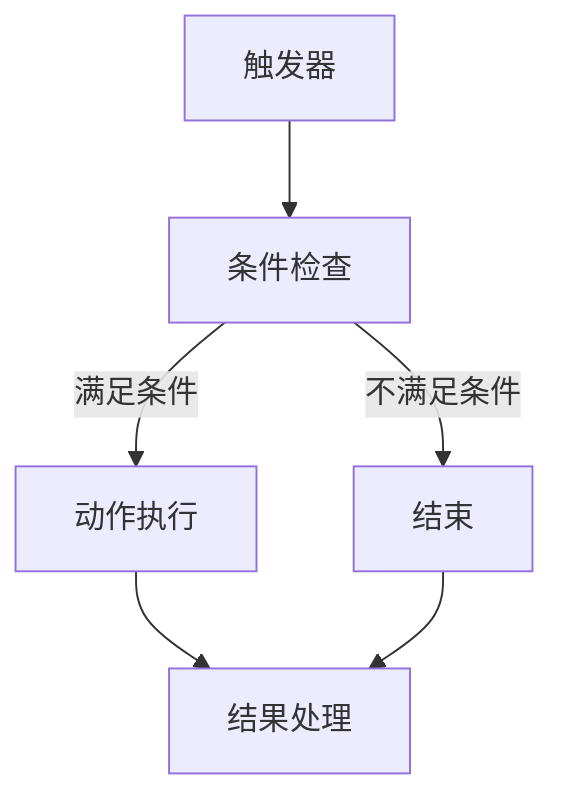
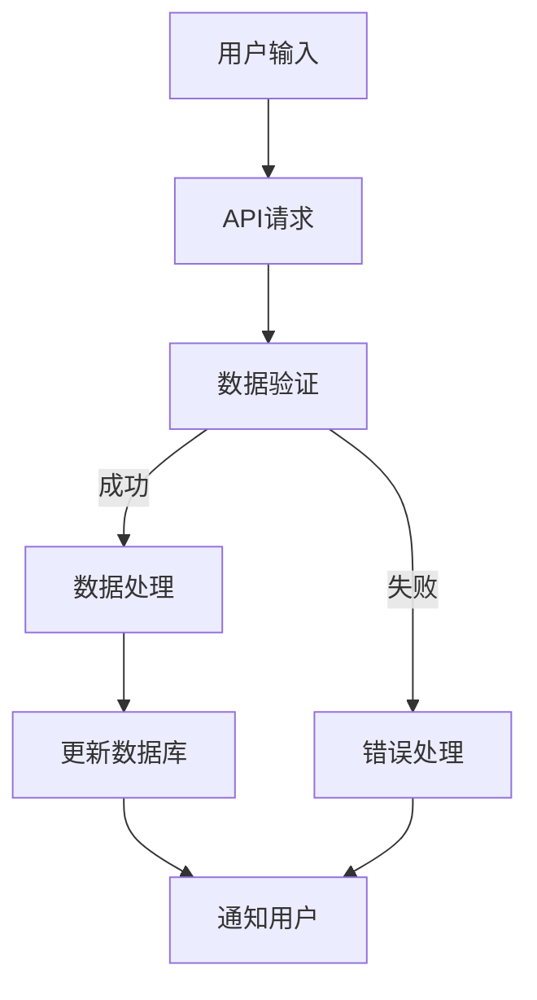
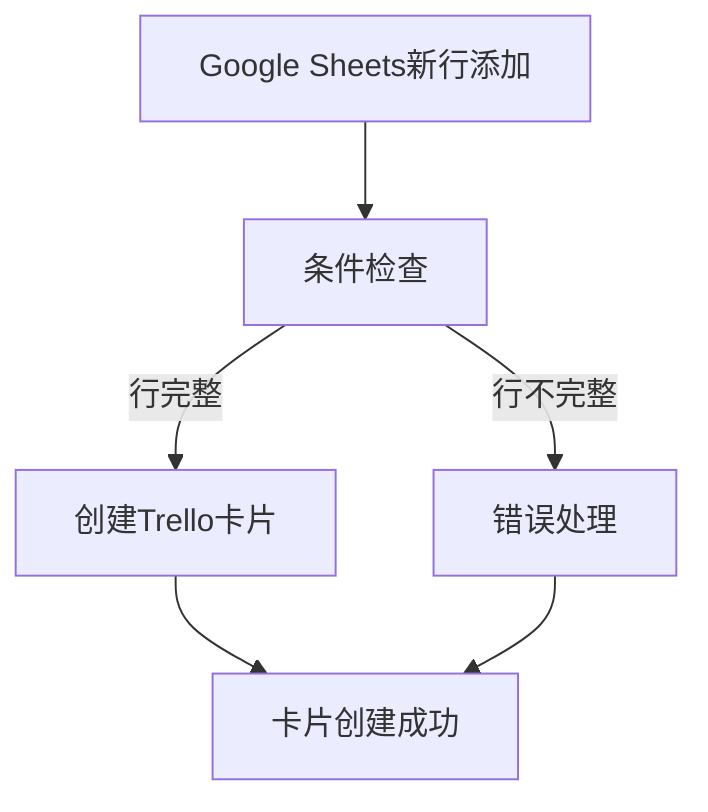
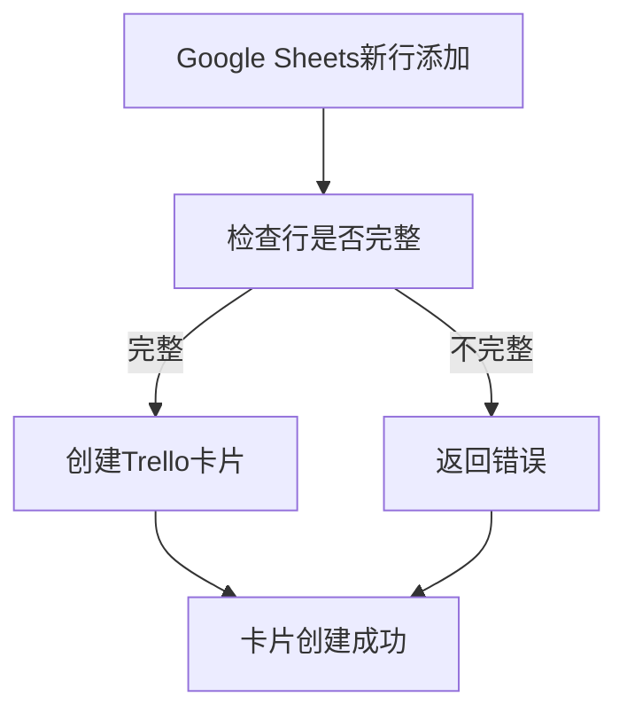
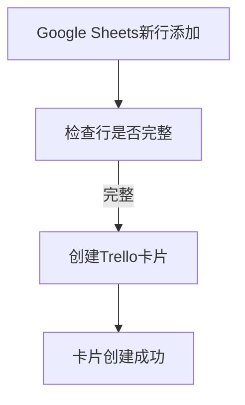
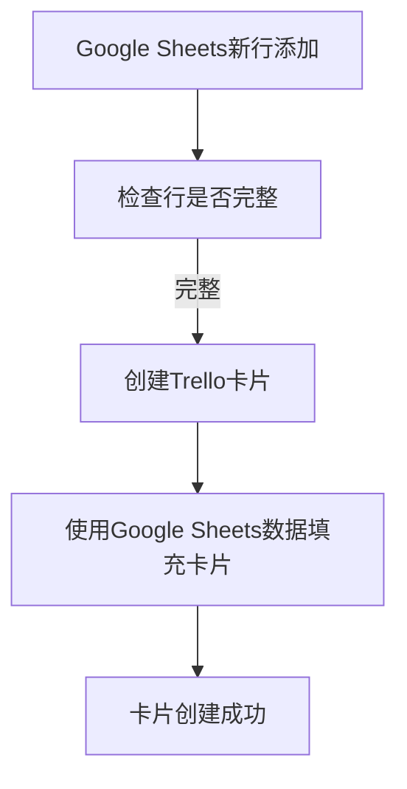

                 


# 如何利用Zapier实现创业公司的工作流自动化

> 关键词：Zapier、工作流自动化、创业公司、集成应用、API、脚本编程、逻辑流程设计
>
> 摘要：本文将深入探讨如何利用Zapier这一强大的工作流自动化工具，为创业公司打造高效、灵活的工作环境。我们将通过详细的步骤解析和实际案例，展示Zapier如何帮助创业公司实现自动化工作流，提高工作效率，节省时间和成本。

## 1. 背景介绍

### 1.1 目的和范围

本文的目的是向创业公司介绍如何利用Zapier实现工作流的自动化，以便于提升团队效率，专注于核心业务发展。文章将涵盖Zapier的基础知识、使用方法、实际案例以及推荐的资源和工具。

### 1.2 预期读者

本文适合对创业公司工作流自动化有一定了解，但尚未深入了解Zapier的用户。无论是创业者、产品经理、IT人员，还是其他希望优化工作流程的专业人士，都将从本文中获得实用的指导。

### 1.3 文档结构概述

本文分为以下章节：

1. 背景介绍
2. 核心概念与联系
3. 核心算法原理 & 具体操作步骤
4. 数学模型和公式 & 详细讲解 & 举例说明
5. 项目实战：代码实际案例和详细解释说明
6. 实际应用场景
7. 工具和资源推荐
8. 总结：未来发展趋势与挑战
9. 附录：常见问题与解答
10. 扩展阅读 & 参考资料

### 1.4 术语表

#### 1.4.1 核心术语定义

- **Zapier**：一个在线平台，允许用户通过连接不同的应用程序来自动化和同步数据。
- **工作流自动化**：使用软件工具自动执行一系列任务，以减少手动操作和提高效率。
- **集成应用**：Zapier支持连接的第三方应用程序，例如Google Sheets、Trello、Slack等。
- **API**：应用程序接口，允许不同软件之间的数据交换和操作。
- **脚本编程**：使用特定语言（如Python、JavaScript）编写用于自动化任务的脚本。

#### 1.4.2 相关概念解释

- **触发器（Triggers）**：指在某个事件发生时触发的操作。
- **动作（Actions）**：指完成特定任务的操作。
- **规则（Rules）**：定义触发器和动作之间条件的逻辑。

#### 1.4.3 缩略词列表

- **API**：应用程序接口（Application Programming Interface）
- **CRM**：客户关系管理（Customer Relationship Management）
- **ERP**：企业资源规划（Enterprise Resource Planning）
- **SaaS**：软件即服务（Software as a Service）

## 2. 核心概念与联系

在讨论Zapier如何实现工作流自动化之前，有必要先了解几个核心概念和它们之间的关系。

### 2.1 Zapier的核心概念

Zapier的核心概念包括触发器、动作和触发器-动作规则。以下是一个简化的Mermaid流程图，展示了这些概念之间的关系：



- **触发器（Trigger）**：定义了何时开始执行工作流。例如，当新的客户联系信息被添加到CRM系统中时，触发器会被触发。
- **条件检查（Condition Check）**：确定触发器是否满足特定的条件。这可以是简单的逻辑，如“如果条件A为真，则执行下一步”。
- **动作（Action）**：在满足条件后，执行特定的任务。例如，将客户联系信息同步到电子邮件营销平台。
- **结果处理（Result Handling）**：处理动作的输出结果，决定下一步的操作。

### 2.2 Zapier与其他应用的关系

Zapier通过API与其他应用程序集成，从而实现自动化工作流。以下是一个Mermaid流程图，展示了Zapier与其他应用之间的交互：



- **API请求（API Request）**：Zapier向其他应用程序发送请求以获取或更新数据。
- **数据验证（Data Validation）**：确保请求的数据符合预期格式和标准。
- **数据处理（Data Processing）**：根据工作流逻辑处理数据。
- **更新数据库（Database Update）**：将处理后的数据存储到数据库或其他数据存储中。
- **通知用户（User Notification）**：向用户发送关于工作流执行状态的通知。

通过这些核心概念和流程的梳理，我们为后续的详细讲解和实际案例提供了理论基础。

## 3. 核心算法原理 & 具体操作步骤

### 3.1 Zapier的工作流逻辑

Zapier的工作流主要由触发器、条件检查、动作和规则组成。以下是一个简单的伪代码，用于描述Zapier的工作流逻辑：

```python
# Zapier工作流伪代码

def workflow_trigger():
    # 当特定事件触发时，执行以下操作
    if trigger_condition():
        if condition_check():
            action_perform()
        else:
            handle_failure()
    else:
        end Workflow

def trigger_condition():
    # 检查触发器条件是否满足
    # 例如，新客户联系信息添加到CRM系统
    return CRM_new_contact_added()

def condition_check():
    # 检查条件是否满足
    # 例如，客户联系信息是否完整
    return is_contact_info_complete()

def action_perform():
    # 执行特定动作
    # 例如，将客户联系信息同步到电子邮件营销平台
    sync_contact_info_to_email_marketing_platform()

def handle_failure():
    # 处理失败情况
    # 例如，发送错误通知给管理员
    send_error_notification_to_admin()
```

### 3.2 创建Zapier工作流

以下是创建一个Zapier工作流的具体操作步骤：

#### 步骤1：选择触发器

1. 登录Zapier账户。
2. 点击“Make a Zap”按钮。
3. 选择一个触发器应用程序，例如“Google Sheets”。
4. 选择具体的触发器，例如“新行添加”。

#### 步骤2：设置触发器条件

1. 配置触发器条件，例如“只有包含特定关键词的新行才触发”。
2. 确认触发器设置，并保存。

#### 步骤3：选择动作应用程序

1. 在触发器设置完成后，选择一个动作应用程序，例如“Trello”。
2. 选择具体的动作，例如“创建新卡片”。

#### 步骤4：设置动作参数

1. 配置动作参数，例如“卡片标题”和“描述”。
2. 这些参数可以从触发器应用程序中获取，也可以手动输入。

#### 步骤5：设置规则

1. 添加规则，以定义触发器和动作之间的关系。
2. 例如，“只有当新行包含特定关键词时，才创建Trello卡片”。

#### 步骤6：测试工作流

1. 测试工作流，确保触发器和动作正常执行。
2. 如果工作流不成功，检查配置并重新测试。

#### 步骤7：启用工作流

1. 确认测试无误后，启用工作流。

通过上述步骤，创业公司可以轻松地创建和配置Zapier工作流，实现自动化任务。

## 4. 数学模型和公式 & 详细讲解 & 举例说明

### 4.1 工作流自动化的数学模型

工作流自动化的数学模型主要涉及概率论和线性规划。以下是一个简化的模型：

$$
P(\text{成功}) = f(\text{触发器概率}, \text{条件检查概率}, \text{动作执行概率})
$$

其中：

- \( P(\text{成功}) \) 表示工作流成功执行的概率。
- \( f \) 是一个函数，用于计算各个步骤的概率乘积。

### 4.2 工作流自动化示例

假设一个创业公司需要将新客户联系信息同步到多个平台，包括CRM系统、电子邮件营销平台和社交媒体。以下是详细步骤：

#### 步骤1：触发器概率

新客户联系信息添加到CRM系统的概率为 \( P(\text{CRM}) = 0.9 \)。

#### 步骤2：条件检查概率

客户联系信息完整的概率为 \( P(\text{完整}) = 0.95 \)。

#### 步骤3：动作执行概率

- 同步到电子邮件营销平台的概率为 \( P(\text{邮件}) = 0.98 \)。
- 同步到社交媒体的概率为 \( P(\text{社交媒体}) = 0.97 \)。

#### 步骤4：计算总概率

$$
P(\text{成功}) = P(\text{CRM}) \times P(\text{完整}) \times P(\text{邮件}) \times P(\text{社交媒体})
$$

$$
P(\text{成功}) = 0.9 \times 0.95 \times 0.98 \times 0.97 = 0.82829
$$

因此，工作流成功执行的概率为 82.83%。

### 4.3 优化工作流

为了提高工作流的成功概率，可以采取以下措施：

- 增加触发器概率：通过改进数据收集方式，提高新客户联系信息的添加概率。
- 减少条件检查概率：确保客户联系信息的完整性，通过自动化验证和修复。
- 提高动作执行概率：优化脚本和API调用，确保数据同步的准确性。

通过数学模型和公式，创业公司可以更好地理解和优化工作流自动化。

## 5. 项目实战：代码实际案例和详细解释说明

### 5.1 开发环境搭建

为了演示如何使用Zapier实现工作流自动化，我们首先需要搭建一个合适的开发环境。以下步骤将帮助您设置Zapier账户并连接相关应用：

#### 步骤1：注册Zapier账户

1. 访问Zapier官网（[www.zapier.com](http://www.zapier.com)），点击“Sign Up”按钮。
2. 使用电子邮件地址注册账户，并设置密码。

#### 步骤2：连接应用

1. 在Zapier账户中，选择您要自动化的应用，例如“Google Sheets”和“Trello”。
2. 按照提示连接这些应用。例如，连接Google Sheets时，您需要授予Zapier访问Google Sheets的权限。

#### 步骤3：设置API密钥

1. 对于需要API密钥的应用，如Trello，您需要生成一个API密钥。
2. 在Trello网站上，前往“开发人员”部分，点击“生成新的API密钥”。

### 5.2 源代码详细实现和代码解读

以下是一个简单的Zapier工作流案例，说明如何将Google Sheets中的新行数据同步到Trello板上的新卡片。

#### 步骤1：创建触发器

在Zapier中，创建一个新的工作流（Zap），选择“Google Sheets”作为触发器应用，选择“新行添加”作为触发器。



#### 步骤2：设置触发器条件

确保Google Sheets中的新行包含所有必需的信息，例如客户姓名、电子邮件地址等。



#### 步骤3：创建动作

在触发器条件满足后，创建一个Trello卡片。选择“Trello”作为动作应用，选择“创建新卡片”作为动作。



#### 步骤4：设置动作参数

配置Trello卡片的标题和描述，使用Google Sheets中的数据填充。



#### 步骤5：测试工作流

启用工作流并测试其功能。添加一个新行到Google Sheets，观察是否在Trello板上创建了一个新的卡片。

### 5.3 代码解读与分析

以上工作流可以通过Zapier的图形界面创建，无需编写代码。然而，如果您希望在自定义脚本中集成Zapier，可以使用其API。

以下是一个简单的Python脚本，用于创建Trello卡片：

```python
import requests

# 设置Trello API密钥和令牌
api_key = 'YOUR_TRELLO_API_KEY'
token = 'YOUR_TRELLO_API_TOKEN'
headers = {
    'Authorization': f'Bearer {token}',
    'Content-Type': 'application/json'
}

# Google Sheets中的数据
data = {
    'title': '客户名称',
    'desc': '客户电子邮件地址'
}

# 创建Trello卡片的API端点
url = f'https://api.trello.com/1/cards?key={api_key}&token={token}'

# 发送POST请求创建卡片
response = requests.post(url, headers=headers, json=data)

# 检查响应状态码
if response.status_code == 200:
    print('卡片创建成功')
else:
    print('卡片创建失败', response.text)
```

此脚本通过Trello API创建了一个新的卡片，并使用Google Sheets中的数据填充卡片的标题和描述。在实际应用中，您可以根据需要修改脚本以处理不同的数据源和目标应用。

通过这个实际案例，我们可以看到Zapier如何帮助创业公司实现自动化工作流，提高效率，节省时间和成本。

## 6. 实际应用场景

Zapier在工作流自动化中有多种实际应用场景，特别适合创业公司。以下是一些常见的应用案例：

### 6.1 销售和市场营销

- **销售漏斗自动化**：当潜在客户在CRM系统中创建时，自动将他们添加到电子邮件营销平台。
- **促销活动跟踪**：自动更新Trello板上的促销活动状态，以便销售团队跟踪进度。
- **客户数据分析**：将CRM系统中的数据同步到数据分析工具，以便进行更深入的市场洞察。

### 6.2 项目管理

- **任务分配**：当任务在Trello板上创建时，自动分配给团队成员，并通过Slack发送通知。
- **进度跟踪**：自动更新项目进度到Google Sheets，以便项目经理监控项目状态。
- **时间跟踪**：使用Toggl或Harvest等工具自动记录团队成员的工作时间。

### 6.3 运营和客户服务

- **客户反馈**：当新的客户反馈在帮助台系统中创建时，自动分配给支持团队，并通过Slack通知。
- **工单处理**：自动化分配和跟踪服务台工单，确保及时响应和解决客户问题。
- **事件监控**：使用IFTTT或Google Sheets监控网站或应用程序的访问和错误日志。

### 6.4 财务管理

- **发票生成**：当客户支付订单时，自动生成发票并发送给客户。
- **收入跟踪**：将销售数据自动同步到Google Sheets或其他财务工具，以便进行财务分析和报告。
- **支出管理**：自动化审批和跟踪公司支出，确保财务合规。

这些应用场景展示了Zapier如何帮助创业公司优化各种业务流程，提高工作效率，降低人为错误，从而专注于核心业务发展。

## 7. 工具和资源推荐

为了更有效地利用Zapier实现工作流自动化，以下是推荐的学习资源、开发工具和框架。

### 7.1 学习资源推荐

#### 7.1.1 书籍推荐

- **《Zapier自动化实战》**：详细介绍了如何使用Zapier构建自动化工作流，适合初学者和高级用户。
- **《Google Sheets函数与公式大全》**：深入探讨Google Sheets的函数和公式，有助于实现更复杂的自动化任务。

#### 7.1.2 在线课程

- **Udemy的《Zapier教程：打造高效的自动化工作流》**：提供从入门到高级的Zapier使用技巧。
- **Coursera的《数据科学和自动化》**：涵盖数据科学基础和自动化工具，包括Zapier的应用。

#### 7.1.3 技术博客和网站

- **Zapier官方博客**：提供最新的Zapier更新、最佳实践和用户案例。
- **Hacker Noon**：涵盖各种自动化和编程主题，包括Zapier使用技巧。

### 7.2 开发工具框架推荐

#### 7.2.1 IDE和编辑器

- **Visual Studio Code**：强大的代码编辑器，支持多种编程语言和扩展。
- **PyCharm**：适用于Python开发的集成开发环境，提供丰富的功能和调试工具。

#### 7.2.2 调试和性能分析工具

- **Postman**：用于API测试和调试的强大工具。
- **New Relic**：提供应用性能监控和调试功能，有助于优化自动化工作流。

#### 7.2.3 相关框架和库

- **Zapier API Module**：Python库，简化Zapier API调用。
- **Zapier Studio**：可视化工作流设计工具，便于构建和测试自动化流程。

### 7.3 相关论文著作推荐

#### 7.3.1 经典论文

- **“The Design of a Robust Workflow System”**：探讨工作流系统设计和实现。
- **“Business Process Management: A Survey”**：全面介绍业务流程管理技术和工具。

#### 7.3.2 最新研究成果

- **“AI-Driven Workflow Automation”**：探讨人工智能在自动化工作流中的应用。
- **“Edge Computing for Workflow Automation”**：探讨边缘计算在自动化工作流中的应用。

#### 7.3.3 应用案例分析

- **“Zapier的使用在中小企业中的实践”**：分析Zapier在中小企业中的实际应用案例。
- **“基于Zapier的电子商务自动化工作流设计”**：探讨Zapier在电子商务领域的应用。

通过这些工具和资源的推荐，创业公司可以更好地利用Zapier实现工作流自动化，提升业务效率。

## 8. 总结：未来发展趋势与挑战

Zapier作为工作流自动化领域的领先工具，具有巨大的发展潜力。随着云计算、人工智能和边缘计算的不断发展，未来Zapier将变得更加智能和灵活，支持更复杂的自动化工作流。

### 8.1 未来发展趋势

1. **AI集成**：Zapier将更加紧密地集成人工智能技术，实现基于数据驱动的自动化工作流。
2. **多平台支持**：随着新应用的不断涌现，Zapier将支持更多的应用程序和API，提供更广泛的选择。
3. **个性化定制**：Zapier将提供更加个性化的工作流定制选项，满足不同行业和公司的需求。
4. **云原生架构**：Zapier将采用云原生架构，提高性能和可扩展性，支持大规模部署。

### 8.2 面临的挑战

1. **安全性**：随着自动化工作流的应用范围扩大，安全性问题将变得更加重要。Zapier需要加强数据保护和访问控制。
2. **复杂度**：自动化工作流的复杂度将不断增加，这对用户界面的设计提出了更高的要求。Zapier需要提供更直观、易用的用户界面。
3. **技能要求**：随着自动化工作流的应用日益广泛，用户需要具备一定的技术背景和编程技能。Zapier需要提供更多的培训和资源，帮助用户掌握相关技能。

总之，Zapier在未来将继续发展，但同时也需要应对一系列挑战，以确保其在不断变化的市场中保持竞争力。

## 9. 附录：常见问题与解答

### 9.1 Zapier的基本使用问题

**Q1**：如何注册Zapier账户？

A1：访问Zapier官网（[www.zapier.com](http://www.zapier.com)），点击“Sign Up”按钮，使用电子邮件地址注册账户。

**Q2**：如何连接应用程序？

A2：在Zapier账户中，点击“Make a Zap”，选择触发器和动作应用，并按照提示连接。

**Q3**：如何设置触发器和动作参数？

A3：在创建Zap时，选择触发器应用，设置触发器条件。选择动作应用，设置动作参数，这些参数通常可以从触发器应用中获取。

### 9.2 Zapier工作流问题

**Q4**：如何测试工作流？

A4：在Zapier中，每个步骤都有一个“Test”按钮，点击即可测试当前步骤的功能。

**Q5**：如何优化工作流？

A5：分析工作流的执行情况，找出瓶颈和改进点。调整触发器条件、动作参数和规则，以提高工作流的效率和准确性。

**Q6**：工作流失败时怎么办？

A6：检查工作流配置，确保所有步骤正确无误。查看Zapier的错误日志，了解具体问题。根据需要调整配置并重新测试。

通过这些常见问题的解答，创业公司可以更好地利用Zapier实现工作流自动化。

## 10. 扩展阅读 & 参考资料

为了深入了解Zapier和工作流自动化的相关概念，以下是一些推荐的扩展阅读和参考资料：

### 10.1 扩展阅读

- **《工作流自动化：企业流程优化指南》**：详细介绍工作流自动化的原理和应用。
- **《Zapier官方文档》**：提供Zapier的详细使用指南和API文档。

### 10.2 参考资料

- **“Automating Business Processes with Zapier”**：一篇关于使用Zapier实现业务流程自动化的论文。
- **“Workflow Automation: Trends and Future Directions”**：探讨工作流自动化技术的发展趋势。

这些资源将为创业公司和专业人士提供宝贵的知识和指导。

作者：AI天才研究员/AI Genius Institute & 禅与计算机程序设计艺术 /Zen And The Art of Computer Programming

