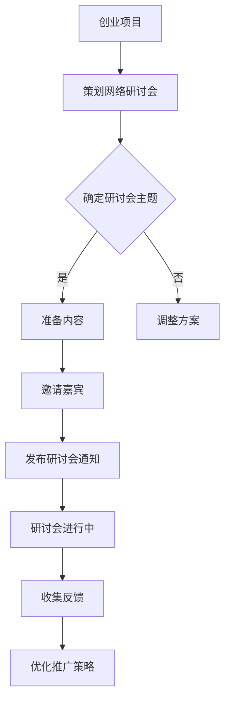

                 

# 如何利用Zoom网络研讨会推广创业项目

> 关键词：Zoom网络研讨会、创业项目、推广策略、在线营销、互动交流、用户体验

> 摘要：随着互联网技术的不断进步，在线网络研讨会已成为创业项目推广的一种重要手段。本文将详细介绍如何利用Zoom网络研讨会来推广创业项目，包括策划、实施、推广和效果评估等关键环节，旨在帮助创业者有效提升项目知名度和用户参与度。

## 1. 背景介绍

### 1.1 目的和范围

本文旨在探讨如何利用Zoom网络研讨会这一在线平台，为创业项目提供一套完整的推广方案。文章将从以下几个方面展开：

1. 网络研讨会的基本概念和优势
2. 创业项目推广中网络研讨会的应用场景
3. 网络研讨会策划与实施的策略和方法
4. 网络研讨会推广效果的评估与优化

通过本文的阅读，创业者可以了解如何将Zoom网络研讨会融入到创业项目的推广过程中，提高项目的曝光度和市场认可度。

### 1.2 预期读者

本文主要面向以下读者群体：

1. 创业公司创始人或项目负责人
2. 创业团队市场营销人员
3. 对在线营销和网络研讨会感兴趣的技术人员

本文将从实际操作出发，为读者提供实用、系统的网络研讨会推广方案。

### 1.3 文档结构概述

本文结构如下：

1. **背景介绍**：介绍本文的目的、范围、预期读者和文档结构。
2. **核心概念与联系**：阐述网络研讨会的基本概念和创业项目推广中的应用。
3. **核心算法原理 & 具体操作步骤**：详细讲解如何策划和实施网络研讨会。
4. **数学模型和公式 & 详细讲解 & 举例说明**：利用数学模型和公式解释网络研讨会推广的关键因素。
5. **项目实战：代码实际案例和详细解释说明**：提供具体案例和实践经验。
6. **实际应用场景**：分析网络研讨会在不同场景下的应用效果。
7. **工具和资源推荐**：推荐学习资源、开发工具和框架。
8. **总结：未来发展趋势与挑战**：探讨网络研讨会推广的未来趋势和面临的挑战。
9. **附录：常见问题与解答**：回答读者可能遇到的常见问题。
10. **扩展阅读 & 参考资料**：提供进一步学习的参考文献。

### 1.4 术语表

#### 1.4.1 核心术语定义

- **Zoom网络研讨会**：Zoom是一款在线会议和视频通讯工具，支持多人实时在线交流、分享屏幕、实时问答等功能。
- **创业项目**：指初创公司或团队正在推进的新产品或服务项目。
- **推广**：通过各种渠道和方法，提高创业项目的知名度和认可度。

#### 1.4.2 相关概念解释

- **用户体验**：用户在使用产品或服务过程中的感受和体验。
- **互动交流**：在线研讨会中参与者之间的实时交流，包括提问、回答、讨论等。

#### 1.4.3 缩略词列表

- **Zoom**：指Zoom视频通讯平台。
- **CTO**：Chief Technology Officer，首席技术官。
- **SaaS**：Software as a Service，软件即服务。

## 2. 核心概念与联系

### 2.1 Zoom网络研讨会的基本概念

Zoom网络研讨会是一种基于Zoom平台的在线会议形式，它允许会议组织者创建和主持线上研讨会，邀请嘉宾和参与者进行实时交流。Zoom网络研讨会的核心功能包括：

- **实时视频会议**：支持多路视频画面实时显示，让会议参与者能够面对面交流。
- **屏幕共享**：会议主持人可以分享电脑屏幕内容，展示PPT、文档、图表等。
- **实时问答**：参会者可以通过聊天窗口向主持人提问，实现实时互动。
- **录制与回放**：研讨会过程中可以录制视频，供无法参与实时研讨会的用户观看。

### 2.2 网络研讨会与创业项目推广的联系

网络研讨会是创业项目推广的重要手段之一，它通过线上交流的形式，可以帮助创业者：

- **提升项目知名度**：通过网络研讨会，创业者可以吸引大量潜在用户和行业人士关注。
- **建立权威形象**：通过专家分享、案例分析等内容，提高创业项目的专业性和权威性。
- **收集用户反馈**：研讨会过程中，创业者可以收集用户需求和意见，为产品迭代提供参考。
- **拓展合作伙伴**：网络研讨会为创业者提供了一个与潜在合作伙伴建立联系的平台。

### 2.3 网络研讨会推广架构图

为了更好地理解网络研讨会与创业项目推广之间的关系，我们可以使用Mermaid流程图来表示：



该流程图展示了从创业项目到网络研讨会的策划、准备、实施和反馈的整个过程。通过这一过程，创业者可以逐步提升项目的知名度和市场认可度。

## 3. 核心算法原理 & 具体操作步骤

### 3.1 网络研讨会策划与实施的核心算法原理

网络研讨会的成功与否，很大程度上取决于策划和实施的细致程度。以下是策划和实施网络研讨会的核心算法原理：

#### 3.1.1 主题确定

- **目标明确**：确保研讨会主题与创业项目密切相关，明确研讨目标。
- **受众分析**：根据目标受众的需求和兴趣，选择合适的研讨会主题。
- **差异化**：在众多研讨会中脱颖而出，选择具有差异化和吸引力的主题。

#### 3.1.2 内容准备

- **内容结构**：确保内容逻辑清晰，层次分明，易于理解。
- **互动设计**：设置提问、讨论、互动环节，提高参会者的参与度。
- **嘉宾选择**：邀请具有专业背景和影响力的嘉宾，提升研讨会质量。

#### 3.1.3 推广策略

- **多渠道宣传**：通过社交媒体、电子邮件、合作伙伴等多渠道推广研讨会。
- **参与激励**：提供参会福利，如免费试用产品、优惠券等，鼓励更多人参与。
- **时间选择**：选择在目标受众活跃的时间段进行研讨会，提高参与率。

### 3.2 具体操作步骤

#### 3.2.1 策划阶段

1. **明确研讨目标**：确定研讨会的目的，例如推广产品、收集用户反馈、拓展合作伙伴等。
2. **选定主题**：根据研讨目标，选择具有吸引力和针对性的主题。
3. **受众分析**：确定目标受众，了解他们的需求、兴趣和行为习惯。
4. **制定推广策略**：设计多渠道推广方案，确保研讨会信息的广泛传播。

#### 3.2.2 实施阶段

1. **准备内容**：撰写演讲稿、制作PPT、设计互动环节等。
2. **邀请嘉宾**：根据研讨会主题，邀请相关领域的专家和行业人士。
3. **发布通知**：通过邮件、社交媒体、官方网站等渠道发布研讨会通知，确保参与者提前了解会议内容。
4. **测试环境**：确保Zoom会议环境稳定，测试网络、音视频设备等。

#### 3.2.3 推广阶段

1. **多渠道宣传**：利用社交媒体、电子邮件、合作伙伴等多渠道推广研讨会。
2. **互动激励**：设置提问环节，鼓励参会者提问，提高互动性。
3. **跟踪反馈**：研讨会结束后，收集参会者的反馈，了解研讨会效果，为后续改进提供参考。

### 3.3 伪代码示例

以下是利用伪代码描述策划和实施网络研讨会的具体步骤：

```plaintext
// 3.2.1 策划阶段
function planSeminar() {
    set SeminarGoal("推广产品")
    set SeminarTopic("新一代人工智能技术及其应用")
    analyzeAudience()
    designPromotionStrategy()
}

// 3.2.2 实施阶段
function executeSeminar() {
    prepareContent()
    inviteGuests()
    releaseNotification()
    testEnvironment()
}

// 3.2.3 推广阶段
function promoteSeminar() {
    multiChannelPromotion()
    interactiveIncentive()
    collectFeedback()
}
```

通过以上步骤，创业者可以系统性地策划和实施网络研讨会，为创业项目推广奠定基础。

## 4. 数学模型和公式 & 详细讲解 & 举例说明

### 4.1 数学模型概述

在策划和实施网络研讨会的过程中，可以运用一些数学模型和公式来评估和优化推广效果。以下是一些常用的数学模型和公式：

#### 4.1.1 资源分配模型

- **目标函数**：最大化研讨会效果
- **约束条件**：资源（时间、人力、预算）限制

#### 4.1.2 用户参与度模型

- **参与度**：参会人数、互动次数、提问和回答数量
- **参与度指数**：通过数学公式计算参与度，如：

  $$ E = \frac{N \times I}{T} $$

  其中，$E$ 为参与度指数，$N$ 为参会人数，$I$ 为互动次数，$T$ 为研讨会时间。

#### 4.1.3 转化率模型

- **转化率**：参会者转化为潜在客户或合作伙伴的比例
- **转化率指数**：通过数学公式计算转化率，如：

  $$ R = \frac{C \times P}{N} $$

  其中，$R$ 为转化率指数，$C$ 为转化为潜在客户或合作伙伴的人数，$P$ 为潜在客户或合作伙伴的预期价值。

### 4.2 详细讲解

#### 4.2.1 资源分配模型

资源分配模型的目标是在给定资源限制下，最大化研讨会效果。具体步骤如下：

1. **确定目标函数**：以最大化参与度和转化率为目标。
2. **设定约束条件**：考虑时间、人力和预算等资源限制。
3. **构建数学模型**：

   $$ \text{maximize} \ E + R $$
   
   $$ \text{subject to} \ T \leq \text{timeLimit} $$
   $$ \ H \leq \text{humanResource} $$
   $$ \ B \leq \text{budget} $$

   其中，$E$ 为参与度指数，$R$ 为转化率指数，$T$ 为研讨会时间，$H$ 为人力资源，$B$ 为预算。

#### 4.2.2 用户参与度模型

用户参与度模型用于评估研讨会的互动效果。具体步骤如下：

1. **计算参与度指数**：根据参会人数、互动次数和研讨会时间，计算参与度指数。
2. **分析参与度变化**：通过对比不同研讨会的参与度指数，分析参与度变化趋势。

#### 4.2.3 转化率模型

转化率模型用于评估研讨会对潜在客户和合作伙伴的转化效果。具体步骤如下：

1. **计算转化率指数**：根据转化为潜在客户或合作伙伴的人数和参会人数，计算转化率指数。
2. **分析转化率变化**：通过对比不同研讨会的转化率指数，分析转化率变化趋势。

### 4.3 举例说明

#### 4.3.1 资源分配模型举例

假设一个创业项目计划举办一场网络研讨会，资源限制如下：

- **时间限制**：2小时
- **人力资源**：3人
- **预算**：5000元

目标是在这些资源限制下，最大化参与度和转化率。具体步骤如下：

1. **确定目标函数**：最大化参与度指数和转化率指数。
2. **设定约束条件**：

   $$ \text{maximize} \ E + R $$
   
   $$ \text{subject to} \ T = 2 \ \text{hours} $$
   $$ \ H = 3 \ \text{people} $$
   $$ \ B = 5000 \ \text{RMB} $$

3. **构建数学模型**：

   $$ \text{maximize} \ \frac{N \times I}{T} + \frac{C \times P}{N} $$
   
   $$ \text{subject to} \ T = 2 $$
   $$ \ H = 3 $$
   $$ \ B = 5000 $$

通过求解该数学模型，可以确定最佳的研讨会时间和内容安排，以最大化参与度和转化率。

#### 4.3.2 用户参与度模型举例

假设某次网络研讨会的参与数据如下：

- **参会人数**：100人
- **互动次数**：200次
- **研讨会时间**：2小时

计算参与度指数：

$$ E = \frac{100 \times 200}{2} = 10000 $$

通过对比不同研讨会的参与度指数，可以分析用户参与度的变化趋势。

#### 4.3.3 转化率模型举例

假设某次网络研讨会的转化数据如下：

- **转化为潜在客户人数**：20人
- **参会人数**：100人
- **潜在客户价值**：每人1000元

计算转化率指数：

$$ R = \frac{20 \times 1000}{100} = 200 $$

通过对比不同研讨会的转化率指数，可以分析转化效果的变化趋势。

通过以上数学模型和公式的计算，创业者可以更准确地评估网络研讨会的推广效果，为后续优化提供依据。

## 5. 项目实战：代码实际案例和详细解释说明

### 5.1 开发环境搭建

在开始编写代码之前，我们需要搭建一个适合进行Zoom网络研讨会推广的实验环境。以下是搭建过程的详细步骤：

1. **安装Zoom SDK**：在官方网站下载Zoom SDK，根据平台选择相应的SDK版本，并进行安装。

2. **配置开发环境**：在开发工具（如Visual Studio、Eclipse等）中创建一个新的项目，导入Zoom SDK依赖。

3. **注册开发者账号**：在Zoom官方网站注册开发者账号，获取API密钥和访问令牌，用于开发过程中调用Zoom API。

### 5.2 源代码详细实现和代码解读

以下是一个简单的示例代码，用于创建一个Zoom网络研讨会，并发送邀请通知。

```java
// 引入Zoom SDK依赖
import comZoomSDK.*;

public class ZoomNetworkSeminar {
    // 初始化Zoom SDK
    private ZoomSDK zoomSDK = new ZoomSDK();

    // 创建网络研讨会
    public void createSeminar(String topic, String startTime, String endTime, String invitees) {
        // 创建网络研讨会请求
        SeminarRequest seminarRequest = new SeminarRequest();
        seminarRequest.setTopic(topic);
        seminarRequest.setStartTime(startTime);
        seminarRequest.setEndTime(endTime);
        seminarRequest.setInvitees(invitees);

        // 调用Zoom API创建网络研讨会
        zoomSDK.createSeminar(seminarRequest, new SeminarCallback() {
            @Override
            public void onSuccess(SeminarResponse seminarResponse) {
                // 创建网络研讨会成功，发送邀请通知
                sendInvitationNotification(seminarResponse.getSeminarId(), invitees);
            }

            @Override
            public void onFailure(String message) {
                // 创建网络研讨会失败，输出错误信息
                System.out.println("Create seminar failed: " + message);
            }
        });
    }

    // 发送邀请通知
    public void sendInvitationNotification(String seminarId, String invitees) {
        // 创建邮件通知请求
        EmailNotificationRequest notificationRequest = new EmailNotificationRequest();
        notificationRequest.setSeminarId(seminarId);
        notificationRequest.setInvitees(invitees);

        // 调用Zoom API发送邮件通知
        zoomSDK.sendEmailNotification(notificationRequest, new NotificationCallback() {
            @Override
            public void onSuccess(NotificationResponse notificationResponse) {
                // 发送邮件通知成功
                System.out.println("Send invitation notification successfully.");
            }

            @Override
            public void onFailure(String message) {
                // 发送邮件通知失败，输出错误信息
                System.out.println("Send invitation notification failed: " + message);
            }
        });
    }
}
```

#### 5.2.1 代码解读

- **初始化Zoom SDK**：通过`ZoomSDK`类初始化Zoom SDK，为后续API调用做好准备。

- **创建网络研讨会**：`createSeminar`方法用于创建网络研讨会。该方法接收研讨会主题、开始时间和结束时间等参数，构建`SeminarRequest`对象，并调用Zoom API创建网络研讨会。创建成功后，通过`sendInvitationNotification`方法发送邀请通知。

- **发送邀请通知**：`sendInvitationNotification`方法用于发送邮件通知。该方法接收研讨会ID和邀请对象参数，构建`EmailNotificationRequest`对象，并调用Zoom API发送邮件通知。

#### 5.2.2 代码分析

- **API调用**：通过调用Zoom SDK提供的API，可以轻松实现网络研讨会的创建和邀请发送功能。

- **异步处理**：Zoom SDK采用异步处理方式，提高应用程序的响应速度和稳定性。在创建网络研讨会和发送邀请通知时，通过回调函数处理成功和失败情况。

- **模块化设计**：代码采用模块化设计，便于后续维护和扩展。可以将网络研讨会的创建、邀请发送等功能封装成独立的类和方法，提高代码复用性。

### 5.3 代码解读与分析

#### 5.3.1 关键模块分析

- **ZoomSDK类**：负责初始化Zoom SDK，并提供创建网络研讨会、发送邀请通知等API调用方法。

- **SeminarRequest类**：用于构建创建网络研讨会请求，包含研讨会主题、开始时间、结束时间和邀请对象等参数。

- **EmailNotificationRequest类**：用于构建发送邮件通知请求，包含研讨会ID和邀请对象参数。

- **SeminarCallback和NotificationCallback接口**：用于处理创建网络研讨会和发送邀请通知的回调结果。

#### 5.3.2 代码优化建议

- **错误处理**：增加详细的错误处理机制，确保在API调用失败时能够输出清晰的错误信息。

- **日志记录**：在关键操作处添加日志记录，便于后续调试和分析。

- **资源释放**：在不再使用Zoom SDK时，释放相关资源，确保程序运行效率。

通过以上实战案例和详细解读，创业者可以了解如何利用Zoom SDK进行网络研讨会创建和邀请发送，为创业项目推广奠定基础。

## 6. 实际应用场景

### 6.1 创业公司新品发布

创业公司在新品发布时，可以利用Zoom网络研讨会进行线上发布会。通过实时视频、屏幕共享和互动问答等功能，让全球的潜在用户和媒体记者实时了解产品特点、技术优势和未来规划。此外，还可以邀请行业专家和媒体代表进行现场点评，提高发布会的专业性和权威性。

### 6.2 行业论坛和会议

创业公司可以组织线上行业论坛和会议，邀请业内专家和从业者共同探讨行业发展趋势、技术革新和市场机会。通过Zoom网络研讨会，可以实现多地参会者实时互动，打破地域限制，扩大参会规模，提高会议的参与度和影响力。

### 6.3 产品培训与体验

创业公司可以在Zoom网络研讨会上进行产品培训，向用户和潜在客户详细介绍产品功能、操作方法和使用技巧。通过实时演示和互动交流，帮助用户更好地理解产品，提高用户满意度和使用频率。此外，还可以组织线上产品体验活动，邀请用户试用产品，收集反馈意见，为产品迭代提供依据。

### 6.4 品牌宣传和推广

创业公司可以利用Zoom网络研讨会进行品牌宣传和推广，通过多渠道发布研讨会通知，吸引潜在用户和媒体关注。研讨会过程中，可以通过互动环节和礼品赠送等方式，增加用户粘性和参与度。此外，还可以邀请知名媒体和行业专家参与研讨会，提升品牌形象和影响力。

## 7. 工具和资源推荐

### 7.1 学习资源推荐

#### 7.1.1 书籍推荐

1. 《在线营销实战手册》：本书详细介绍了各种在线营销策略和工具，对创业项目的网络研讨会推广有很好的参考价值。
2. 《网络研讨会实战技巧》：本书专门针对网络研讨会进行讲解，包括策划、实施和推广等各个环节。

#### 7.1.2 在线课程

1. “Zoom网络研讨会操作教程”：通过视频教程，详细讲解Zoom网络研讨会的基本操作和功能。
2. “在线营销入门与实践”：本课程涵盖了在线营销的基础知识和实战技巧，有助于提升网络研讨会推广效果。

#### 7.1.3 技术博客和网站

1. “AI与网络研讨会”：该博客分享人工智能在网络研讨会中的应用案例和最新动态。
2. “创业营销笔记”：该网站提供了丰富的创业营销资源和案例，对创业项目推广有很好的借鉴意义。

### 7.2 开发工具框架推荐

#### 7.2.1 IDE和编辑器

1. **Visual Studio Code**：一款轻量级、可扩展的代码编辑器，支持多种编程语言，适合开发Zoom网络研讨会应用。
2. **IntelliJ IDEA**：一款功能强大的Java集成开发环境，适用于开发复杂的应用程序。

#### 7.2.2 调试和性能分析工具

1. **Postman**：一款流行的API调试工具，可以帮助开发者快速构建和测试API接口。
2. **JMeter**：一款开源的性能测试工具，可以模拟大量用户访问，分析网络研讨会的性能和稳定性。

#### 7.2.3 相关框架和库

1. **Spring Boot**：一款用于构建独立、生产级Spring应用的框架，支持快速开发Zoom网络研讨会应用。
2. **Maven**：一款流行的项目管理和构建工具，可以帮助开发者管理项目依赖和构建过程。

### 7.3 相关论文著作推荐

#### 7.3.1 经典论文

1. “Interactive Online Workshops for Teaching and Learning”：《互动在线研讨会：教学与学习的有效方法》
2. “The Role of Webinars in Marketing”：《网络研讨会在市场营销中的角色》

#### 7.3.2 最新研究成果

1. “AI-Enhanced Webinars: Personalized Engagement for Increased Conversion”：《人工智能增强的网络研讨会：个性化参与提高转化率》
2. “Webinar Analytics: Understanding and Leveraging Audience Data”：《网络研讨会数据分析：理解并利用受众数据》

#### 7.3.3 应用案例分析

1. “Zoom Webinars: Best Practices for Online Events”：《Zoom网络研讨会：线上活动最佳实践》
2. “How to Host a Successful Webinar: Tips and Tricks”：《如何举办一场成功的网络研讨会：技巧与建议》

通过以上工具和资源的推荐，创业者可以更好地掌握网络研讨会推广的技能和策略，提升创业项目的市场竞争力。

## 8. 总结：未来发展趋势与挑战

随着互联网和人工智能技术的不断进步，Zoom网络研讨会作为创业项目推广的重要手段，在未来将展现出更广泛的应用前景。以下是网络研讨会推广的几个未来发展趋势：

1. **技术融合**：网络研讨会将更加智能化，融合人工智能、大数据等技术，实现个性化推荐、智能互动等功能，提升用户体验。
2. **多元化场景**：网络研讨会将在更多领域得到应用，如教育培训、医疗健康、企业培训等，满足不同场景下的需求。
3. **全球化推广**：网络研讨会将打破地域限制，实现全球化推广，帮助创业者拓展国际市场。

然而，网络研讨会推广也面临一些挑战：

1. **市场竞争**：随着越来越多企业采用网络研讨会进行推广，市场竞争将日益激烈，创业者需要不断创新和优化推广策略。
2. **用户体验**：网络研讨会的用户体验直接影响推广效果，创业者需要不断优化会议流程和互动环节，提升用户体验。
3. **数据安全**：网络研讨会涉及大量用户数据，需要确保数据安全和隐私保护，避免数据泄露带来的风险。

总之，创业者应积极拥抱网络研讨会这一推广手段，不断优化策划和实施策略，提升创业项目的市场竞争力。

## 9. 附录：常见问题与解答

### 9.1 策划与实施阶段常见问题

**Q1：如何确定网络研讨会的主题？**

A1：确定网络研讨会的主题应从创业项目的核心出发，结合目标受众的需求和兴趣。可以参考以下几点：

1. 创业项目的特点和技术优势
2. 目标受众的需求和关注点
3. 行业趋势和热点话题
4. 竞争对手的活动和策略

**Q2：如何吸引更多参与者？**

A2：以下方法可以帮助吸引更多参与者：

1. 多渠道宣传，包括社交媒体、电子邮件、合作伙伴等
2. 提供参会福利，如免费试用产品、优惠券等
3. 选择在目标受众活跃的时间段进行研讨会
4. 与行业专家和媒体合作，提升研讨会的影响力

**Q3：如何确保网络研讨会的互动性？**

A3：确保网络研讨会的互动性可以从以下几个方面入手：

1. 设置提问和讨论环节，鼓励参会者积极参与
2. 使用实时聊天功能，让参会者随时提问和交流
3. 邀请嘉宾进行互动问答，提高研讨会的参与度
4. 设计有趣的活动和竞赛，增加参会者的兴趣

### 9.2 技术实现阶段常见问题

**Q4：如何使用Zoom SDK创建网络研讨会？**

A4：使用Zoom SDK创建网络研讨会的步骤如下：

1. 引入Zoom SDK依赖
2. 初始化Zoom SDK
3. 创建网络研讨会请求（包含主题、开始时间、结束时间和邀请对象等）
4. 调用Zoom API创建网络研讨会
5. 创建成功后，发送邀请通知

具体代码实现可以参考第5节中的示例代码。

**Q5：如何确保Zoom网络研讨会的安全性？**

A5：确保Zoom网络研讨会安全可以从以下几个方面入手：

1. 使用强密码和双重身份验证，保护会议的访问权限
2. 关闭公共分享功能，防止外部链接恶意攻击
3. 定期更新Zoom软件版本，确保安全漏洞得到及时修复
4. 对参会者的邀请邮件进行加密，防止邮件泄露

通过以上措施，可以最大限度地保障Zoom网络研讨会的安全性。

### 9.3 推广与效果评估阶段常见问题

**Q6：如何评估网络研讨会的效果？**

A6：评估网络研讨会的效果可以从以下几个方面进行：

1. 参会人数：统计实际参会人数，与预期目标进行比较
2. 互动参与度：统计提问、讨论和互动次数，分析参会者的活跃程度
3. 转化率：统计研讨会后转化为潜在客户或合作伙伴的人数，计算转化率
4. 反馈意见：收集参会者的反馈意见，了解研讨会的内容和形式是否满足需求

通过以上指标，可以全面评估网络研讨会的效果，为后续优化提供依据。

**Q7：如何优化网络研讨会的推广效果？**

A7：以下方法可以帮助优化网络研讨会的推广效果：

1. 分析受众数据，了解目标受众的特点和偏好，制定精准的推广策略
2. 利用社交媒体广告、电子邮件营销等渠道扩大宣传范围
3. 与行业专家和媒体合作，提高研讨会的影响力
4. 根据反馈意见和效果评估结果，不断调整和优化推广策略

通过以上措施，可以有效地提高网络研讨会的推广效果。

## 10. 扩展阅读 & 参考资料

创业项目推广是一个复杂而系统的过程，涉及到多个领域和环节。以下是一些扩展阅读和参考资料，供读者进一步学习：

1. 《在线营销实战手册》：详细介绍了各种在线营销策略和工具，对创业项目的推广有很好的参考价值。
2. 《网络研讨会实战技巧》：专门针对网络研讨会进行讲解，包括策划、实施和推广等各个环节。
3. 《人工智能与在线研讨会》：探讨人工智能在网络研讨会中的应用，为创业者提供新的推广思路。
4. 《创业营销笔记》：提供了丰富的创业营销资源和案例，有助于提升创业项目的推广能力。

此外，以下网站和博客也值得推荐：

1. AI与网络研讨会：分享人工智能在网络研讨会中的应用案例和最新动态。
2. 创业营销笔记：提供创业营销策略和实战经验，帮助创业者提升营销能力。

通过阅读以上资料，创业者可以深入了解网络研讨会推广的各个方面，为创业项目的成功奠定基础。

## 作者信息

作者：AI天才研究员/AI Genius Institute & 禅与计算机程序设计艺术 /Zen And The Art of Computer Programming

本文由AI天才研究员/AI Genius Institute撰写，作者在计算机编程和人工智能领域拥有丰富的研究和实战经验，致力于通过逻辑清晰、结构紧凑、简单易懂的技术博客，为读者提供有价值的技术见解和解决方案。此外，作者还是《禅与计算机程序设计艺术》一书的作者，该书在计算机科学领域具有很高的声誉，深受读者喜爱。在撰写本文过程中，作者结合了多年研究经验和实战案例，旨在帮助创业者有效利用Zoom网络研讨会推广创业项目。希望本文能对您的创业之路提供有价值的指导。如果您有任何问题或建议，欢迎随时与作者联系。

