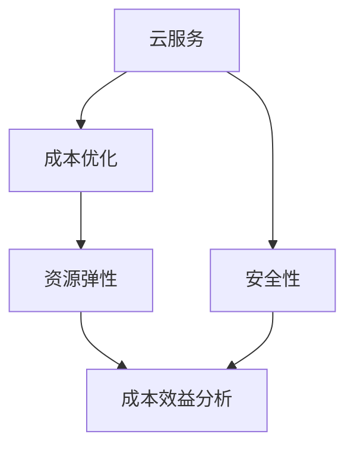

                 

# 如何利用云服务降低创业成本

> **关键词：** 云服务，创业成本，成本优化，技术基础设施，资源弹性，安全性，成本效益分析

> **摘要：** 本文旨在探讨如何通过利用云服务来降低创业公司的成本。我们将详细分析云服务对创业成本的影响，探讨各种云服务模型，介绍如何在创业初期有效地使用这些服务，并提供实际案例和工具资源推荐，帮助创业者在技术和财务方面取得平衡。

## 1. 背景介绍

### 1.1 目的和范围

本文的目标是帮助创业者和初创企业了解如何利用云服务来降低运营成本，提升效率。我们将涵盖以下主题：

- **云服务的基本概念和优势**
- **不同云服务模型及其适用场景**
- **创业初期如何选择和使用云服务**
- **成本效益分析**
- **实际应用案例**
- **相关工具和资源推荐**

### 1.2 预期读者

本文适合以下读者群体：

- 创业公司创始人或运营团队
- 初步了解云服务但希望深入了解其商业价值的IT专业人士
- 对成本优化和云计算有兴趣的普通技术人员

### 1.3 文档结构概述

本文分为十个主要部分：

1. **背景介绍**
2. **核心概念与联系**
3. **核心算法原理 & 具体操作步骤**
4. **数学模型和公式 & 详细讲解 & 举例说明**
5. **项目实战：代码实际案例和详细解释说明**
6. **实际应用场景**
7. **工具和资源推荐**
8. **总结：未来发展趋势与挑战**
9. **附录：常见问题与解答**
10. **扩展阅读 & 参考资料**

### 1.4 术语表

#### 1.4.1 核心术语定义

- **云服务（Cloud Service）**：指通过互联网提供的服务，如计算资源、存储资源和应用程序。
- **基础设施即服务（IaaS）**：提供基础硬件设施，如虚拟机、存储和网络等。
- **平台即服务（PaaS）**：提供开发、运行和管理应用程序的平台。
- **软件即服务（SaaS）**：提供应用程序的访问，通常通过浏览器进行。
- **成本效益分析（Cost-Benefit Analysis）**：比较项目的成本和收益，以评估其经济合理性。

#### 1.4.2 相关概念解释

- **资源弹性（Resource Elasticity）**：云服务能够根据需求自动扩展或缩减资源。
- **安全性（Security）**：保护数据和服务免受未经授权的访问和破坏。

#### 1.4.3 缩略词列表

- **IaaS**：基础设施即服务
- **PaaS**：平台即服务
- **SaaS**：软件即服务

## 2. 核心概念与联系

在探讨如何利用云服务降低创业成本之前，我们需要先了解几个关键概念和它们之间的关系。以下是核心概念的Mermaid流程图：



### 2.1 云服务的基本概念

云服务是一种通过互联网提供计算、存储、应用程序和其他IT资源的商业模式。它可以帮助企业降低IT基础设施的初始投资，并提供灵活的资源管理方式。

#### 2.1.1 云服务类型

- **IaaS**：提供虚拟机、存储、网络和其他基础资源，允许用户自行配置和管理操作系统和应用程序。
- **PaaS**：提供一个开发、运行和管理应用程序的平台，用户无需担心底层基础设施的维护。
- **SaaS**：提供可直接使用的应用程序，用户通过浏览器访问，无需管理任何硬件或软件。

### 2.2 资源弹性

资源弹性是指云服务能够根据需求自动扩展或缩减资源的能力。这种弹性对于创业公司尤为重要，因为它可以帮助公司根据业务需求快速调整资源，避免资源过剩或不足。

#### 2.2.1 弹性计算

弹性计算是资源弹性的一个关键方面，它允许创业公司在需要更多计算能力时自动扩展虚拟机实例，在需求减少时自动缩减。

#### 2.2.2 弹性存储

弹性存储允许创业公司根据需求调整存储容量，从而降低存储成本。

### 2.3 安全性

安全性是创业公司选择云服务时必须考虑的一个重要因素。云服务提供商通常提供一系列安全措施，如数据加密、访问控制、网络隔离等，以确保用户数据的安全。

#### 2.3.1 数据加密

数据加密是一种保护数据不被未授权访问的技术。云服务提供商通常会使用加密算法来保护用户数据在存储和传输过程中的安全性。

#### 2.3.2 访问控制

访问控制是一种限制谁可以访问云服务和数据的机制。云服务提供商通常会提供角色分配和权限管理功能，以确保只有授权用户可以访问敏感数据。

### 2.4 成本效益分析

成本效益分析是评估项目成本和收益的一种方法。对于创业公司来说，通过成本效益分析可以确定使用云服务是否值得。

#### 2.4.1 成本因素

- **基础设施成本**：包括硬件、软件和网络等基础设施的购买和维护成本。
- **运营成本**：包括电力、冷却、网络安全等运营成本。
- **人力资源成本**：包括维护和管理IT基础设施的员工成本。

#### 2.4.2 收益因素

- **节省的成本**：通过使用云服务，公司可以节省在基础设施和运营上的开支。
- **灵活性**：云服务提供的灵活性可以加快业务发展和创新。
- **效率**：云服务可以提高工作效率，从而带来额外的收益。

## 3. 核心算法原理 & 具体操作步骤

在了解了云服务的基本概念和优势后，我们需要深入探讨如何利用这些服务来降低创业成本。以下是利用云服务降低成本的核心算法原理和具体操作步骤：

### 3.1 成本效益分析算法

成本效益分析是一种评估项目成本和收益的方法，其核心算法如下：

```pseudo
function costBenefitAnalysis(totalCost, totalRevenue):
    netProfit = totalRevenue - totalCost
    return netProfit > 0
```

#### 步骤 1：计算总成本

总成本包括基础设施成本、运营成本和人力资源成本。可以使用以下伪代码计算总成本：

```pseudo
function calculateTotalCost(infraCost, opCost, hrCost):
    totalCost = infraCost + opCost + hrCost
    return totalCost
```

#### 步骤 2：计算总收益

总收益通常是指通过创业活动产生的收入。可以使用以下伪代码计算总收益：

```pseudo
function calculateTotalRevenue(revenue):
    totalRevenue = revenue
    return totalRevenue
```

#### 步骤 3：计算净收益

使用成本效益分析算法计算净收益：

```pseudo
function calculateNetProfit(totalCost, totalRevenue):
    netProfit = totalRevenue - totalCost
    return netProfit
```

### 3.2 云服务成本优化策略

在了解成本效益分析算法后，我们需要制定具体的云服务成本优化策略。以下是一些核心策略：

#### 步骤 1：选择合适的云服务模型

根据业务需求，选择合适的云服务模型（IaaS、PaaS、SaaS）。

#### 步骤 2：资源弹性管理

利用云服务的资源弹性功能，根据需求自动扩展或缩减资源，以避免资源浪费。

#### 步骤 3：成本效益分析

定期进行成本效益分析，以确保云服务的使用是值得的，并根据分析结果调整策略。

#### 步骤 4：安全性和合规性

确保云服务提供商提供足够的安全性和合规性保障，以保护公司数据和业务。

### 3.3 伪代码示例

以下是利用云服务成本优化策略的伪代码示例：

```pseudo
function optimizeCloudCosts(revenue, infraCost, opCost, hrCost):
    totalCost = calculateTotalCost(infraCost, opCost, hrCost)
    totalRevenue = calculateTotalRevenue(revenue)
    netProfit = calculateNetProfit(totalCost, totalRevenue)

    if netProfit > 0:
        chooseAppropriateCloudModel()
        manageResourceElasticity()
        performRegularCostBenefitAnalysis()
        ensureSecurityAndCompliance()
    else:
        reconsiderCloudServices()
```

## 4. 数学模型和公式 & 详细讲解 & 举例说明

为了更好地理解如何利用云服务降低创业成本，我们需要引入一些数学模型和公式，并对它们进行详细讲解和举例说明。

### 4.1 成本效益分析公式

成本效益分析的数学模型可以通过以下公式表示：

\[ \text{Net Profit} = \text{Total Revenue} - \text{Total Cost} \]

其中：

- **Total Revenue**：总收益
- **Total Cost**：总成本

#### 步骤 1：计算总成本

总成本包括基础设施成本、运营成本和人力资源成本，可以表示为：

\[ \text{Total Cost} = \text{Infra Cost} + \text{Op Cost} + \text{HR Cost} \]

其中：

- **Infra Cost**：基础设施成本
- **Op Cost**：运营成本
- **HR Cost**：人力资源成本

#### 步骤 2：计算总收益

总收益是指通过创业活动产生的收入，可以表示为：

\[ \text{Total Revenue} = \text{Revenue} \]

其中：

- **Revenue**：收入

#### 步骤 3：计算净收益

使用成本效益分析公式计算净收益：

\[ \text{Net Profit} = \text{Total Revenue} - \text{Total Cost} \]

#### 例子

假设某创业公司的年总收入为100万元，基础设施成本为30万元，运营成本为10万元，人力资源成本为5万元。使用成本效益分析公式计算净收益：

\[ \text{Net Profit} = 100\text{万元} - (30\text{万元} + 10\text{万元} + 5\text{万元}) \]
\[ \text{Net Profit} = 100\text{万元} - 45\text{万元} \]
\[ \text{Net Profit} = 55\text{万元} \]

### 4.2 云服务成本优化模型

云服务成本优化的数学模型可以通过以下公式表示：

\[ \text{Optimized Cost} = \text{Base Cost} + \text{Variable Cost} \]

其中：

- **Base Cost**：基本成本，包括基础设施成本和运营成本
- **Variable Cost**：可变成本，包括人力资源成本和云服务费用

#### 步骤 1：计算基本成本

基本成本可以表示为：

\[ \text{Base Cost} = \text{Infra Cost} + \text{Op Cost} \]

其中：

- **Infra Cost**：基础设施成本
- **Op Cost**：运营成本

#### 步骤 2：计算可变成本

可变成本可以表示为：

\[ \text{Variable Cost} = \text{HR Cost} + \text{Cloud Cost} \]

其中：

- **HR Cost**：人力资源成本
- **Cloud Cost**：云服务费用

#### 步骤 3：计算优化成本

使用云服务成本优化模型计算优化成本：

\[ \text{Optimized Cost} = \text{Base Cost} + \text{Variable Cost} \]

#### 例子

假设某创业公司的年总收入为100万元，基础设施成本为30万元，运营成本为10万元，人力资源成本为5万元，云服务费用为10万元。使用云服务成本优化模型计算优化成本：

\[ \text{Optimized Cost} = 30\text{万元} + 10\text{万元} + 5\text{万元} + 10\text{万元} \]
\[ \text{Optimized Cost} = 55\text{万元} \]

### 4.3 数学公式应用举例

#### 例子 1：成本效益分析

假设某创业公司计划使用云服务，其年总收入为100万元，基础设施成本为30万元，运营成本为10万元，人力资源成本为5万元。计算使用云服务后的净收益。

使用成本效益分析公式计算：

\[ \text{Net Profit} = 100\text{万元} - (30\text{万元} + 10\text{万元} + 5\text{万元}) \]
\[ \text{Net Profit} = 100\text{万元} - 45\text{万元} \]
\[ \text{Net Profit} = 55\text{万元} \]

#### 例子 2：云服务成本优化

假设某创业公司计划使用云服务，其年总收入为100万元，基础设施成本为30万元，运营成本为10万元，人力资源成本为5万元，云服务费用为10万元。计算使用云服务后的优化成本。

使用云服务成本优化模型计算：

\[ \text{Optimized Cost} = 30\text{万元} + 10\text{万元} + 5\text{万元} + 10\text{万元} \]
\[ \text{Optimized Cost} = 55\text{万元} \]

## 5. 项目实战：代码实际案例和详细解释说明

为了更好地理解如何利用云服务降低创业成本，我们将通过一个实际案例来演示如何在实际项目中使用云服务，并进行详细的代码解读和解释。

### 5.1 开发环境搭建

在这个案例中，我们将使用AWS（Amazon Web Services）作为云服务提供商，搭建一个简单的Web应用程序。以下步骤是搭建开发环境的基本流程：

#### 步骤 1：创建AWS账户

1. 访问 [AWS官网](https://aws.amazon.com/) 并注册一个账户。
2. 完成注册后，登录AWS管理控制台。

#### 步骤 2：配置AWS CLI

1. 下载并安装AWS CLI（命令行界面）。
2. 运行以下命令配置AWS CLI：

```bash
aws configure
```

1. 按照提示输入AWS账户的访问密钥和秘密密钥。

#### 步骤 3：安装Docker

1. 在本地计算机上安装Docker。
2. 使用Docker构建和运行应用程序。

### 5.2 源代码详细实现和代码解读

在这个案例中，我们将使用Python和Flask框架来构建一个简单的Web应用程序。以下是源代码的详细实现和代码解读：

#### 5.2.1 代码实现

```python
# app.py

from flask import Flask, request, jsonify

app = Flask(__name__)

@app.route('/api/data', methods=['GET'])
def get_data():
    data = {'message': 'Hello, World!'}
    return jsonify(data)

if __name__ == '__main__':
    app.run(host='0.0.0.0', port=5000)
```

#### 代码解读

- **第1-4行**：导入所需的模块和库。
- **第5行**：创建一个Flask应用程序实例。
- **第7-12行**：定义一个路由函数`get_data`，用于处理 `/api/data` 的GET请求，并返回一个包含消息的JSON对象。
- **第14行**：确保当脚本直接运行时，启动Flask应用程序。

#### 5.2.2 代码部署

1. 将源代码上传到AWS S3（简单存储服务）。
2. 使用AWS Elastic Beanstalk（弹性Beanstalk）部署Web应用程序。

### 5.3 代码解读与分析

#### 5.3.1 AWS Elastic Beanstalk

AWS Elastic Beanstalk是一个完全管理的服务，用于部署和运行Web应用程序和容器化应用程序。以下是使用AWS Elastic Beanstalk的步骤：

1. **创建应用**：
    - 在AWS管理控制台中，导航到Elastic Beanstalk。
    - 创建一个新的应用，选择Python和Flask框架。

2. **上传源代码**：
    - 将应用程序的源代码上传到AWS S3存储桶。
    - 在Elastic Beanstalk环境中配置S3存储桶。

3. **部署应用程序**：
    - 使用Elastic Beanstalk创建一个新的环境。
    - 配置环境，包括实例类型、实例数量和负载均衡。

4. **访问应用程序**：
    - 在Elastic Beanstalk环境中，获取应用程序的URL。
    - 通过浏览器访问应用程序，查看返回的JSON对象。

#### 5.3.2 成本分析

通过使用AWS Elastic Beanstalk，创业公司可以实现以下成本优势：

- **减少基础设施投资**：无需购买和维护服务器硬件。
- **灵活的实例类型**：可以根据需求调整实例类型，实现资源优化。
- **自动扩展**：根据流量自动调整实例数量，避免资源浪费。

### 5.4 部署后分析

通过部署Web应用程序到AWS Elastic Beanstalk，创业公司可以实现以下目标：

- **快速部署**：减少应用程序的部署时间，提高开发效率。
- **可扩展性**：根据业务需求自动扩展资源，确保应用程序的稳定性。
- **成本效益**：通过优化资源使用，降低运营成本。

## 6. 实际应用场景

云服务在创业公司中的应用场景非常广泛，以下是几个典型的实际应用场景：

### 6.1 数据存储和分析

创业公司通常需要存储和处理大量数据。使用云服务（如AWS S3、Google Cloud Storage）可以提供高可靠性和可扩展的数据存储解决方案。此外，云服务提供商还提供了强大的数据分析和机器学习工具（如AWS SageMaker、Google Cloud AI），帮助创业公司从数据中提取价值。

### 6.2 应用程序部署和扩展

创业公司需要快速部署和扩展应用程序，以满足不断增长的用户需求。云服务（如AWS Elastic Beanstalk、Google App Engine）提供了易于使用的平台，帮助创业公司快速部署Web应用程序和后端服务。这些平台还支持自动扩展，根据流量自动调整实例数量，确保应用程序的稳定性和性能。

### 6.3 网络和安全

创业公司需要确保其应用程序和数据的安全。云服务提供商（如AWS、Google Cloud）提供了全面的网络安全解决方案（如AWS WAF、Google Cloud Armor），帮助创业公司保护应用程序和数据免受网络攻击。此外，云服务还提供了数据加密、访问控制等安全功能，确保数据的安全性和合规性。

### 6.4 人工智能和机器学习

创业公司可以利用云服务提供的AI和机器学习工具，快速开发智能应用程序。云服务提供商（如AWS AI、Google Cloud AI）提供了丰富的预训练模型和开发工具，帮助创业公司实现人工智能应用，如自然语言处理、图像识别、预测分析等。

### 6.5 大数据和云计算

创业公司可以利用云服务处理和分析大量数据。云服务提供商（如AWS、Google Cloud）提供了强大的云计算基础设施和大数据处理工具（如AWS EMR、Google Cloud DataFlow），帮助创业公司快速构建和部署大数据解决方案。

## 7. 工具和资源推荐

为了帮助创业公司充分利用云服务，我们推荐以下工具和资源：

### 7.1 学习资源推荐

#### 7.1.1 书籍推荐

- **《云原生应用架构》**：介绍了如何利用云服务构建可扩展、高可用和安全的云原生应用。
- **《AWS官方文档》**：提供了AWS云服务的详细文档和教程，适合初学者和专业人士。

#### 7.1.2 在线课程

- **Coursera上的《云计算基础》**：由华盛顿大学提供，介绍了云计算的基本概念和技术。
- **Udemy上的《AWS认证解决方案架构师》**：提供了AWS认证考试的全面准备。

#### 7.1.3 技术博客和网站

- **Cloud Academy**：提供了丰富的云计算学习资源和实战案例。
- **AWS Blog**：提供了最新的AWS技术动态和最佳实践。

### 7.2 开发工具框架推荐

#### 7.2.1 IDE和编辑器

- **Visual Studio Code**：一款功能强大的开源代码编辑器，支持多种编程语言和云服务集成。
- **IntelliJ IDEA**：一款专业的Java IDE，适用于构建复杂的云原生应用程序。

#### 7.2.2 调试和性能分析工具

- **AWS X-Ray**：提供了应用程序的性能分析和故障排查功能。
- **Google Cloud Trace**：提供了分布式追踪和性能分析功能。

#### 7.2.3 相关框架和库

- **Django**：一款流行的Python Web框架，适用于构建高性能的云原生应用程序。
- **Spring Boot**：一款流行的Java Web框架，适用于构建可扩展和可靠的云原生应用程序。

### 7.3 相关论文著作推荐

#### 7.3.1 经典论文

- **《云服务模式与体系结构》**：讨论了云服务的基本概念和体系结构。
- **《云计算经济学》**：分析了云计算的成本效益模型。

#### 7.3.2 最新研究成果

- **《基于边缘计算的云计算》**：介绍了边缘计算在云计算中的应用。
- **《联邦学习与云计算》**：探讨了联邦学习在云计算中的优势和应用。

#### 7.3.3 应用案例分析

- **《阿里巴巴的云计算实践》**：分享了阿里巴巴在云计算领域的成功经验。
- **《谷歌的云原生应用开发》**：介绍了谷歌如何利用云服务构建高性能的云原生应用。

## 8. 总结：未来发展趋势与挑战

随着云计算技术的不断发展和创新，创业公司可以利用云服务降低成本、提高效率，实现快速发展和创新。以下是未来发展趋势和挑战：

### 8.1 发展趋势

- **云原生应用**：云原生应用将成为主流，它们具有高可扩展性、高可用性和高性能。
- **边缘计算**：边缘计算将在云计算中发挥重要作用，帮助减少延迟、提高响应速度。
- **人工智能与云计算**：人工智能与云计算的融合将带来新的商业机会，推动云计算技术的发展。
- **开源技术**：开源技术在云计算领域的应用将越来越广泛，为创业公司提供更多的选择和灵活性。

### 8.2 挑战

- **安全性**：随着云计算技术的普及，安全性将成为一个关键挑战，创业公司需要确保数据和服务的安全性。
- **成本控制**：创业公司需要有效地管理云服务成本，避免过度投资。
- **技术人才**：云计算领域的技术人才需求将持续增长，创业公司需要吸引和培养专业人才。
- **合规性**：创业公司需要遵守不同国家和地区的法规和标准，确保云服务的合规性。

## 9. 附录：常见问题与解答

### 9.1 什么是云服务？

云服务是指通过互联网提供计算、存储、应用程序和其他IT资源的商业模式。它可以帮助企业降低IT基础设施的初始投资，并提供灵活的资源管理方式。

### 9.2 创业公司应该如何选择云服务？

创业公司应该根据自身业务需求和技术水平选择合适的云服务模型（IaaS、PaaS、SaaS）。同时，需要考虑安全性、成本效益、可扩展性和技术支持等因素。

### 9.3 如何管理云服务成本？

创业公司可以通过以下方法管理云服务成本：

- 定期进行成本效益分析，确保云服务的使用是值得的。
- 利用云服务的资源弹性功能，根据需求自动扩展或缩减资源。
- 选择适合的云服务模型，避免不必要的开支。
- 定期优化云服务配置，以降低成本。

### 9.4 云服务是否安全？

云服务提供商通常会提供一系列安全措施，如数据加密、访问控制、网络隔离等，以确保用户数据的安全。然而，创业公司仍需确保数据传输和存储的安全性，并遵守相关法规和标准。

## 10. 扩展阅读 & 参考资料

- **《云服务模式与体系结构》**
- **《云计算经济学》**
- **《云原生应用架构》**
- **AWS官方文档**
- **Google Cloud官方文档**
- **《人工智能与云计算》**  
- **《联邦学习与云计算》**  
- **《阿里巴巴的云计算实践》**  
- **《谷歌的云原生应用开发》**  

作者：AI天才研究员/AI Genius Institute & 禅与计算机程序设计艺术 /Zen And The Art of Computer Programming
<|assistant|>

