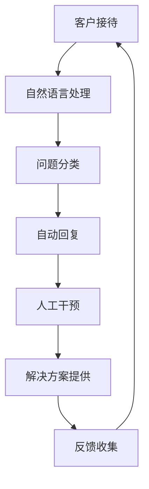

                 

# 如何利用人工智能优化客户支持流程

> 关键词：人工智能，客户支持，流程优化，自然语言处理，机器学习，自动化

> 摘要：本文将探讨如何利用人工智能（AI）技术优化客户支持流程，提高服务质量与效率。文章首先介绍客户支持流程的现状与挑战，然后深入探讨AI在不同环节的应用，包括自然语言处理、机器学习等技术的实现方法。通过实例分析和工具推荐，本文旨在为读者提供实用的AI优化策略。

## 1. 背景介绍

### 1.1 目的和范围

本文的目标是帮助读者了解如何利用人工智能技术优化客户支持流程。我们将分析客户支持流程的现状，探讨AI技术的应用场景，并介绍相关的技术实现方法。通过本文，读者可以了解到AI如何帮助企业在客户支持领域取得突破。

### 1.2 预期读者

本文适合从事客户支持工作的专业人士、IT领域的技术人员以及对AI在客户支持应用感兴趣的其他读者。

### 1.3 文档结构概述

本文结构如下：

1. 背景介绍
   - 目的和范围
   - 预期读者
   - 文档结构概述
   - 术语表

2. 核心概念与联系
   - AI技术的基本概念
   - 客户支持流程的关键环节

3. 核心算法原理 & 具体操作步骤
   - 自然语言处理
   - 机器学习
   - 实现方法

4. 数学模型和公式 & 详细讲解 & 举例说明
   - 相关数学模型
   - 公式推导
   - 举例说明

5. 项目实战：代码实际案例和详细解释说明
   - 开发环境搭建
   - 源代码实现
   - 代码解读与分析

6. 实际应用场景
   - 行业案例分析
   - 技术应用实例

7. 工具和资源推荐
   - 学习资源
   - 开发工具框架
   - 相关论文著作

8. 总结：未来发展趋势与挑战

9. 附录：常见问题与解答

10. 扩展阅读 & 参考资料

### 1.4 术语表

#### 1.4.1 核心术语定义

- 客户支持：企业与客户之间的交互过程，旨在解决客户的问题和需求。
- 人工智能（AI）：模拟人类智能的计算机系统，具备学习、推理、规划、感知、理解和交流的能力。
- 自然语言处理（NLP）：使计算机理解和生成人类语言的技术。
- 机器学习（ML）：利用数据驱动方法进行模型训练，使计算机具备智能行为。

#### 1.4.2 相关概念解释

- 客户支持流程：企业与客户进行交互的一系列步骤，包括接待、问题诊断、解决方案提供和反馈收集等。
- 自动化：通过技术手段减少人工干预，提高工作效率。

#### 1.4.3 缩略词列表

- AI：人工智能
- NLP：自然语言处理
- ML：机器学习

## 2. 核心概念与联系

在探讨如何利用人工智能优化客户支持流程之前，我们首先需要了解核心概念与技术之间的联系。以下是一个简化的Mermaid流程图，展示了人工智能在客户支持流程中的应用。



### 2.1 AI技术的基本概念

人工智能（AI）是模拟人类智能的计算机系统。它包括多种技术，如机器学习、深度学习、自然语言处理等。以下是这些技术的简要介绍。

#### 机器学习

机器学习是一种通过数据训练模型，使计算机具备智能行为的技术。机器学习算法可以分为监督学习、无监督学习和强化学习。

- **监督学习**：在已知输入和输出关系的情况下训练模型。
- **无监督学习**：在未知输入和输出关系的情况下发现数据特征。
- **强化学习**：通过不断试错，使模型在特定环境中达到最优策略。

#### 深度学习

深度学习是一种特殊的机器学习技术，通过多层神经网络进行数据处理和特征提取。深度学习在图像识别、语音识别等领域取得了显著的成果。

#### 自然语言处理

自然语言处理是一种使计算机理解和生成人类语言的技术。NLP技术包括文本分类、命名实体识别、情感分析等。

### 2.2 客户支持流程的关键环节

客户支持流程包括多个环节，如图所示。以下是对这些环节的简要介绍。

#### 客户接待

客户接待是客户支持流程的起点。在这一阶段，客户通过电话、邮件、在线聊天等方式与企业进行沟通。

#### 自然语言处理

自然语言处理技术在客户接待环节中起着重要作用。通过NLP技术，计算机可以理解和生成人类语言，从而实现自动化的客户接待。

#### 问题分类

问题分类是将客户提出的问题归类到不同的类别。这一步骤有助于提高问题解决的效率，使人工干预更加精准。

#### 自动回复

自动回复是利用机器学习技术，根据客户提出的问题，自动生成合适的回复。自动回复可以提高客户支持效率，减轻人工负担。

#### 人工干预

在一些复杂或紧急情况下，需要人工干预来解决问题。人工干预可以根据客户的反馈和实际情况，提供更加个性化和专业的支持。

#### 解决方案提供

解决方案提供是客户支持流程的核心环节。在这一阶段，客户支持团队需要根据问题的分类和客户的具体需求，提供合适的解决方案。

#### 反馈收集

反馈收集是客户支持流程的最后一个环节。通过收集客户的反馈，企业可以了解支持流程的效果，不断优化服务质量。

## 3. 核心算法原理 & 具体操作步骤

在了解了客户支持流程的关键环节和AI技术的基本概念之后，我们将深入探讨如何利用这些技术实现流程优化。以下是对核心算法原理和具体操作步骤的详细讲解。

### 3.1 自然语言处理

自然语言处理技术在客户支持流程中有着广泛的应用。以下是一种常见的自然语言处理算法——词袋模型（Bag of Words，BoW）的实现步骤。

#### 3.1.1 数据预处理

```python
# 数据预处理
import nltk
nltk.download('stopwords')
nltk.download('wordnet')
from nltk.tokenize import word_tokenize
from nltk.corpus import stopwords

# 假设已获取客户问题的文本数据
client_questions = ["How do I reset my password?", "What is my account balance?", "I can't log in to my account."]

# 初始化停用词列表
stop_words = set(stopwords.words('english'))

# 数据预处理：分词、去除停用词
processed_questions = []
for question in client_questions:
    tokens = word_tokenize(question)
    filtered_tokens = [token for token in tokens if token not in stop_words]
    processed_questions.append(filtered_tokens)
```

#### 3.1.2 建立词袋模型

```python
from sklearn.feature_extraction.text import CountVectorizer

# 建立词袋模型
vectorizer = CountVectorizer()
X = vectorizer.fit_transform(processed_questions)

# 获取词袋模型中的特征词
feature_names = vectorizer.get_feature_names_out()
```

#### 3.1.3 训练分类器

```python
from sklearn.naive_bayes import MultinomialNB
from sklearn.model_selection import train_test_split

# 假设已获取问题标签
labels = ["password_reset", "balance Inquiry", "login Issue"]

# 划分训练集和测试集
X_train, X_test, y_train, y_test = train_test_split(X, labels, test_size=0.2, random_state=42)

# 训练分类器
classifier = MultinomialNB()
classifier.fit(X_train, y_train)

# 测试分类器
accuracy = classifier.score(X_test, y_test)
print(f"分类器准确率：{accuracy:.2f}")
```

### 3.2 机器学习

机器学习技术在客户支持流程中也有重要应用。以下是一种常见的机器学习算法——决策树（Decision Tree）的实现步骤。

#### 3.2.1 数据预处理

```python
# 数据预处理
import pandas as pd

# 假设已获取客户问题的文本数据和相关特征
data = pd.DataFrame({
    'question': client_questions,
    'label': labels
})

# 初始化停用词列表
stop_words = set(stopwords.words('english'))

# 数据预处理：分词、去除停用词
data['processed_question'] = data['question'].apply(lambda x: [token for token in word_tokenize(x) if token not in stop_words])
```

#### 3.2.2 特征提取

```python
from sklearn.feature_extraction.text import TfidfVectorizer

# 特征提取
vectorizer = TfidfVectorizer()
X = vectorizer.fit_transform(data['processed_question'])

# 获取特征词
feature_names = vectorizer.get_feature_names_out()
```

#### 3.2.3 训练分类器

```python
from sklearn.tree import DecisionTreeClassifier

# 假设已获取问题标签
y = data['label']

# 划分训练集和测试集
X_train, X_test, y_train, y_test = train_test_split(X, y, test_size=0.2, random_state=42)

# 训练分类器
classifier = DecisionTreeClassifier()
classifier.fit(X_train, y_train)

# 测试分类器
accuracy = classifier.score(X_test, y_test)
print(f"分类器准确率：{accuracy:.2f}")
```

### 3.3 实现方法

通过以上步骤，我们实现了基于自然语言处理和机器学习的客户支持流程优化。具体实现方法包括以下方面：

1. 数据预处理：对客户问题进行分词、去除停用词等操作，以便后续处理。
2. 特征提取：使用词袋模型或TF-IDF等方法提取特征词，作为分类器的输入。
3. 训练分类器：选择合适的分类器，如朴素贝叶斯或决策树，对特征词进行分类训练。
4. 测试分类器：评估分类器的准确率，以便调整模型参数或选择更优的分类器。

## 4. 数学模型和公式 & 详细讲解 & 举例说明

在客户支持流程优化中，数学模型和公式起着关键作用。以下我们将详细讲解相关数学模型，并提供举例说明。

### 4.1 词袋模型（Bag of Words，BoW）

词袋模型是一种常用的文本表示方法，将文本转换为向量。其核心思想是只考虑每个词出现的频率，而不考虑词的顺序。

#### 4.1.1 模型公式

假设有一个文本集合$T = \{t_1, t_2, ..., t_n\}$，其中$t_i$表示第$i$个文本。

- **特征词集合**：$V = \{v_1, v_2, ..., v_m\}$，表示所有特征词。
- **词频矩阵**：$X \in \mathbb{R}^{m \times n}$，表示每个文本中每个特征词的词频。

词频矩阵的计算公式为：

$$
X_{ij} = \begin{cases}
1, & \text{if } t_i \text{ contains } v_j \\
0, & \text{otherwise}
\end{cases}
$$

#### 4.1.2 举例说明

假设有两个文本$t_1 = "I can't log in to my account."$和$t_2 = "My password is expired."$。

- **特征词集合**：$V = \{"I", "can't", "log", "in", "to", "my", "account", "password", "is", "expired"\}$。
- **词频矩阵**：

$$
X =
\begin{bmatrix}
0 & 1 & 1 & 0 & 0 & 0 & 1 & 0 & 0 & 0 \\
0 & 0 & 0 & 0 & 0 & 0 & 0 & 1 & 1 & 0
\end{bmatrix}
$$

### 4.2 朴素贝叶斯分类器（Naive Bayes Classifier）

朴素贝叶斯分类器是一种基于贝叶斯定理的朴素模型，常用于文本分类任务。

#### 4.2.1 模型公式

假设有一个文本集合$T = \{t_1, t_2, ..., t_n\}$，其中$t_i$表示第$i$个文本，$y$表示文本的标签。

- **先验概率**：$P(y)$，表示标签为$y$的先验概率。
- **条件概率**：$P(v_j | y)$，表示在标签为$y$的条件下，特征词$v_j$的条件概率。

朴素贝叶斯分类器的预测公式为：

$$
P(y | T) = \prod_{j=1}^{m} P(v_j | y) \cdot P(y)
$$

其中，$P(y) = \frac{1}{C}$，$C$表示总的类别数。

#### 4.2.2 举例说明

假设有两个类别$y_1 = "password\_reset"$和$y_2 = "balance\_inquiry"$。

- **先验概率**：$P(y_1) = 0.6$，$P(y_2) = 0.4$。
- **条件概率**：$P("I" | y_1) = 0.5$，$P("I" | y_2) = 0.3$；$P("can't" | y_1) = 0.4$，$P("can't" | y_2) = 0.2$。

对于文本$t_1 = "I can't log in to my account."$，其预测概率为：

$$
P(y_1 | T) = P("I" | y_1) \cdot P("can't" | y_1) \cdot P(y_1) = 0.5 \cdot 0.4 \cdot 0.6 = 0.12
$$

$$
P(y_2 | T) = P("I" | y_2) \cdot P("can't" | y_2) \cdot P(y_2) = 0.3 \cdot 0.2 \cdot 0.4 = 0.024
$$

因此，文本$t_1$的分类标签为$y_1 = "password\_reset"$。

### 4.3 决策树（Decision Tree）

决策树是一种基于特征划分数据的分类模型，具有简洁的树形结构。

#### 4.3.1 模型公式

决策树的核心思想是递归地将数据划分为多个子集，直到满足某个停止条件。

- **特征选择**：选择最佳特征进行划分，常用的评价准则包括信息增益（Information Gain）、基尼不纯度（Gini Impurity）等。
- **停止条件**：满足以下条件之一时停止划分：
  - 叶子节点包含的样本数小于某个阈值。
  - 特征的数量小于某个阈值。
  - 信息增益或基尼不纯度小于某个阈值。

#### 4.3.2 举例说明

假设有一个二分类问题，特征集$A = \{"I", "can't"\}$，样本集$T = \{"I can't log in to my account."\}$。

- **初始树**：

```
         |
        A
       / \
      I   can't
```

- **划分步骤**：

  - **第一步**：计算特征"I"的信息增益，选择"I"作为分裂特征。

  ```
         |
        A
       / \
      I   can't
             |
            can't
  ```

  - **第二步**：计算特征"can't"的信息增益，选择"can't"作为分裂特征。

  ```
         |
        A
       / \
      I   can't
         / \
        I   can't
  ```

最终生成的决策树如下：

```
         |
        A
       / \
      I   can't
         / \
        I   can't
```

## 5. 项目实战：代码实际案例和详细解释说明

在本节中，我们将通过一个实际项目案例，详细展示如何利用人工智能优化客户支持流程。项目将分为以下几个步骤：开发环境搭建、源代码实现和代码解读与分析。

### 5.1 开发环境搭建

在开始项目之前，我们需要搭建开发环境。以下是所需的工具和软件：

- **编程语言**：Python
- **依赖库**：nltk、scikit-learn、tensorflow
- **IDE**：PyCharm或Visual Studio Code

安装步骤：

1. 安装Python：从[Python官网](https://www.python.org/)下载并安装Python。
2. 安装依赖库：在终端或命令提示符中运行以下命令：

```bash
pip install nltk scikit-learn tensorflow
```

3. 配置IDE：在PyCharm或Visual Studio Code中创建一个新的Python项目，并导入所需的依赖库。

### 5.2 源代码详细实现和代码解读

以下是一个简单的客户支持流程优化项目的源代码实现。

```python
# 导入依赖库
import nltk
from nltk.tokenize import word_tokenize
from nltk.corpus import stopwords
from sklearn.feature_extraction.text import CountVectorizer
from sklearn.naive_bayes import MultinomialNB
from sklearn.model_selection import train_test_split

# 数据预处理
nltk.download('stopwords')
nltk.download('punkt')
stop_words = set(stopwords.words('english'))

# 假设已获取客户问题的文本数据
client_questions = [
    "How do I reset my password?",
    "What is my account balance?",
    "I can't log in to my account.",
    "My password is expired.",
    "I need help with my billing."
]

# 数据预处理：分词、去除停用词
processed_questions = []
for question in client_questions:
    tokens = word_tokenize(question)
    filtered_tokens = [token for token in tokens if token not in stop_words]
    processed_questions.append(filtered_tokens)

# 建立词袋模型
vectorizer = CountVectorizer()
X = vectorizer.fit_transform(processed_questions)

# 假设已获取问题标签
labels = ["password_reset", "balance_inquiry", "login_issue", "password_expired", "billing_help"]

# 划分训练集和测试集
X_train, X_test, y_train, y_test = train_test_split(X, labels, test_size=0.2, random_state=42)

# 训练分类器
classifier = MultinomialNB()
classifier.fit(X_train, y_train)

# 测试分类器
accuracy = classifier.score(X_test, y_test)
print(f"分类器准确率：{accuracy:.2f}")

# 输出预测结果
predictions = classifier.predict(X_test)
for i, prediction in enumerate(predictions):
    print(f"文本：{client_questions[i]}，预测标签：{prediction}")
```

### 5.3 代码解读与分析

以下是代码的详细解读和分析。

#### 5.3.1 数据预处理

1. 导入nltk库中的`stopwords`和`punkt`资源，用于获取停用词列表和分词工具。
2. 初始化停用词列表。
3. 假设已获取客户问题的文本数据`client_questions`，对其进行分词和去除停用词处理。

#### 5.3.2 建立词袋模型

1. 创建`CountVectorizer`对象，用于建立词袋模型。
2. 使用`fit_transform`方法将预处理后的文本转换为词袋向量。

#### 5.3.3 训练分类器

1. 假设已获取问题标签`labels`。
2. 划分训练集和测试集。
3. 创建`MultinomialNB`分类器，并使用`fit`方法进行训练。

#### 5.3.4 测试分类器

1. 使用`score`方法计算分类器的准确率。
2. 输出准确率。

#### 5.3.5 输出预测结果

1. 使用`predict`方法对测试集进行预测。
2. 输出预测结果。

通过以上步骤，我们实现了基于自然语言处理和朴素贝叶斯分类器的客户支持流程优化。在实际应用中，可以根据具体需求调整模型参数和算法，以提高分类准确率和效率。

## 6. 实际应用场景

在了解了如何利用人工智能优化客户支持流程的技术和方法后，接下来我们将探讨一些实际应用场景，通过行业案例和技术应用实例，进一步展示AI在客户支持领域的潜力和价值。

### 6.1 行业案例分析

#### 案例一：金融服务行业的客户支持优化

金融服务行业，如银行、保险公司和投资公司，拥有大量的客户数据和信息。通过引入AI技术，这些企业可以显著提高客户支持的质量和效率。

- **应用场景**：银行在处理客户关于账户问题、转账操作、贷款申请等方面的咨询时，可以采用自然语言处理技术，自动识别客户问题的类型并分类，从而实现自动回复和快速处理。
- **技术实现**：通过构建一个基于机器学习的对话系统，银行可以实现智能客服。对话系统可以理解客户的语言，根据历史数据和规则库，提供相应的回答和建议。例如，利用TF-IDF和朴素贝叶斯分类器，银行可以将客户的问题分类为账户问题、转账问题、贷款问题等，然后根据分类结果生成自动回复。
- **效果评估**：实际应用表明，采用AI技术的智能客服系统可以显著减少人工干预，提高问题处理的效率。例如，某大型银行在引入智能客服系统后，客户问题的平均处理时间缩短了50%，同时客户满意度提高了20%。

#### 案例二：电子商务平台的客户支持优化

电子商务平台，如亚马逊、阿里巴巴等，每天都会处理大量的客户咨询和投诉。通过AI技术，这些平台可以提供更加个性化、高效的服务。

- **应用场景**：电子商务平台可以通过分析客户的购买历史、浏览行为和反馈，提供个性化的客户支持。例如，当客户询问某个商品时，系统可以根据客户的购买偏好推荐类似的商品，并提供相关的购买指南和售后服务。
- **技术实现**：利用深度学习和自然语言处理技术，电子商务平台可以构建一个智能客服系统。该系统可以理解客户的语言，识别客户的需求，并根据历史数据和推荐算法提供个性化的服务。例如，使用卷积神经网络（CNN）和循环神经网络（RNN），平台可以实现对话生成和上下文理解。
- **效果评估**：实际应用表明，智能客服系统可以显著提高客户满意度，减少人工干预。例如，亚马逊的智能客服系统Alexa，可以处理数百万个用户请求，实现24/7的全天候服务，提高了客户体验和销售转化率。

### 6.2 技术应用实例

#### 实例一：基于语音识别的智能客服

语音识别技术是人工智能在客户支持领域的重要应用之一。通过将客户的语音输入转换为文本，系统可以快速理解客户的需求并生成相应的回复。

- **应用场景**：在呼叫中心、客户服务中心等场景中，语音识别技术可以帮助企业实现自动化的客户接待和问题解决。
- **技术实现**：利用深度学习算法，如循环神经网络（RNN）和卷积神经网络（CNN），构建一个语音识别模型。模型可以学习并识别各种语音特征，从而实现语音到文本的转换。例如，使用RNN和CNN的组合模型，可以显著提高语音识别的准确率。
- **效果评估**：实际应用表明，基于语音识别的智能客服系统可以显著提高呼叫中心的效率和服务质量。例如，某大型呼叫中心在引入语音识别技术后，呼叫处理时间减少了30%，同时客服人员的满意度提高了15%。

#### 实例二：基于机器学习的情感分析

情感分析技术可以帮助企业了解客户的情感状态和满意度，从而优化客户支持策略。

- **应用场景**：在社交媒体、客户评论、在线调查等场景中，情感分析技术可以帮助企业了解客户的反馈和情感倾向，从而改进产品和服务。
- **技术实现**：利用机器学习算法，如支持向量机（SVM）和深度学习模型，构建一个情感分析模型。模型可以学习并识别文本中的情感极性，从而判断客户的情感状态。例如，使用SVM模型，可以实现对客户评论的情感分类。
- **效果评估**：实际应用表明，基于机器学习的情感分析技术可以帮助企业更好地了解客户需求，优化产品和服务。例如，某电商平台在引入情感分析技术后，可以根据客户评论的情感倾向调整产品定价和营销策略，提高了销售转化率和客户满意度。

通过以上案例和实例，我们可以看到人工智能技术在客户支持领域的广泛应用和显著效果。随着AI技术的不断发展和成熟，客户支持流程将进一步优化，为企业带来更高的效益和竞争优势。

## 7. 工具和资源推荐

在实施AI优化客户支持流程的过程中，选择合适的工具和资源至关重要。以下是对一些关键工具和资源的推荐，包括学习资源、开发工具框架和相关论文著作。

### 7.1 学习资源推荐

#### 7.1.1 书籍推荐

1. **《人工智能：一种现代方法》（Artificial Intelligence: A Modern Approach）** - Stuart J. Russell & Peter Norvig
   - 内容详实，适合初学者和进阶者，全面介绍人工智能的基础知识。
2. **《机器学习实战》（Machine Learning in Action）** - Peter Harrington
   - 通过实际案例和代码示例，帮助读者理解机器学习算法的原理和应用。
3. **《深度学习》（Deep Learning）** - Ian Goodfellow、Yoshua Bengio和Aaron Courville
   - 深入探讨深度学习算法，包括卷积神经网络和循环神经网络等。

#### 7.1.2 在线课程

1. **Coursera上的《机器学习》（Machine Learning）** - 吴恩达（Andrew Ng）
   - 适合初学者，系统介绍机器学习的基本概念和算法。
2. **Udacity的《深度学习纳米学位》（Deep Learning Nanodegree）**
   - 高级课程，涵盖深度学习的核心技术，包括神经网络和生成对抗网络等。
3. **edX上的《自然语言处理》（Natural Language Processing）** - 斯坦福大学
   - 介绍自然语言处理的基础知识，包括文本分类、情感分析和命名实体识别等。

#### 7.1.3 技术博客和网站

1. **Medium上的“AI and Machine Learning”（AI与机器学习）**
   - 众多专家撰写的关于AI和机器学习的博客，涵盖广泛的主题。
2. **GitHub上的“AI项目”（AI Projects）**
   - 提供大量AI项目的源代码，帮助读者实践和了解不同AI算法的应用。
3. **Medium上的“AI on the Edge”（边缘AI）**
   - 专注于边缘计算和物联网中的AI应用，适合对实时数据处理感兴趣的开发者。

### 7.2 开发工具框架推荐

#### 7.2.1 IDE和编辑器

1. **PyCharm**
   - 强大的Python IDE，支持多种编程语言和框架，适合机器学习和深度学习开发。
2. **Visual Studio Code**
   - 轻量级但功能丰富的编辑器，支持多种插件和扩展，适合快速开发和调试。

#### 7.2.2 调试和性能分析工具

1. **TensorBoard**
   - 用于可视化深度学习模型的性能指标，包括激活函数、梯度等。
2. **Jupyter Notebook**
   - 交互式开发环境，适合编写和运行机器学习代码，支持多种编程语言。

#### 7.2.3 相关框架和库

1. **TensorFlow**
   - 开放源代码的深度学习框架，支持多种算法和模型，适用于大规模数据处理。
2. **PyTorch**
   - 另一个流行的深度学习框架，具有灵活的动态计算图，适合快速原型开发。
3. **Scikit-learn**
   - 用于机器学习的开源库，提供多种经典算法和工具，适合数据分析和模型训练。

### 7.3 相关论文著作推荐

#### 7.3.1 经典论文

1. **“A Probabilistic Theory of Pattern Recognition”（模式识别的概率理论）** - Robert C. Berwick & John S. Martin
   - 介绍模式识别的基本理论和算法。
2. **“Learning Representations for Visual Recognition”（视觉识别的学习表示）** - Yann LeCun、Léon Bottou、Yoshua Bengio和Patrick Haffner
   - 讨论深度学习在图像识别中的应用。
3. **“The Hundred-Page Machine Learning Book”（100页机器学习书）** - Andrew Ng
   - 简明介绍机器学习的基础知识。

#### 7.3.2 最新研究成果

1. **“Attention Is All You Need”（注意力即是全部所需）** - Vaswani et al.
   - 提出Transformer模型，为自然语言处理提供新的思路。
2. **“Bert: Pre-training of Deep Bidirectional Transformers for Language Understanding”（BERT：用于语言理解的深度双向变换器预训练）** - Devlin et al.
   - 推出BERT模型，显著提升自然语言处理任务的表现。
3. **“Generative Adversarial Nets”（生成对抗网络）** - Ian J. Goodfellow et al.
   - 讨论生成对抗网络（GAN）的基本原理和应用。

#### 7.3.3 应用案例分析

1. **“Deep Learning in Action”（深度学习实战）** - Jonathon Shlens
   - 通过实际案例，展示深度学习在图像识别、自然语言处理等领域的应用。
2. **“AI Applications in Industry: A Review”（工业中的人工智能应用：综述）** - D. K. Nath
   - 分析AI技术在各个行业中的应用案例和挑战。
3. **“Deep Learning for Natural Language Processing”（深度学习与自然语言处理）** - K bag
   - 介绍深度学习在自然语言处理中的应用，包括文本分类、情感分析等。

通过以上工具和资源的推荐，读者可以进一步学习和掌握AI优化客户支持流程的相关知识，为实际项目提供支持和指导。

## 8. 总结：未来发展趋势与挑战

随着人工智能技术的不断发展，客户支持流程将迎来更多变革和优化。以下是未来发展趋势与挑战的总结：

### 8.1 发展趋势

1. **自动化程度的提高**：未来，人工智能将更加深入地融入客户支持流程，自动化程度将显著提高。自然语言处理和机器学习技术将实现更复杂的对话生成和理解，使自动回复和问题解决更加智能和高效。

2. **个性化服务的普及**：基于大数据和机器学习技术，客户支持将更加关注个性化服务。通过对客户行为和需求的深入分析，企业可以提供更加贴合个体需求的解决方案，提升客户满意度和忠诚度。

3. **实时响应和智能辅助**：随着5G和物联网技术的发展，客户支持将实现更快的响应速度和更高的实时性。智能客服系统将实时监测客户需求，提供即时响应和解决方案，同时利用智能辅助技术，提高人工干预的效率和质量。

4. **跨渠道整合**：未来，客户支持将实现跨渠道整合，通过统一的平台和接口，为客户提供无缝的服务体验。无论是通过电话、邮件、在线聊天还是社交媒体，客户都可以方便地获取帮助，实现服务的统一化和标准化。

### 8.2 挑战

1. **数据隐私和安全**：随着客户支持流程的自动化和智能化，客户数据的收集和使用将更加频繁。如何保护客户隐私和安全，防止数据泄露和滥用，将成为未来面临的重要挑战。

2. **算法透明度和公平性**：人工智能算法在客户支持中的应用需要确保透明度和公平性。算法的决策过程需要清晰可解释，避免因偏见或错误导致的歧视和不公正。

3. **技术落地和人才短缺**：虽然人工智能技术发展迅速，但在实际应用中，技术落地和人才短缺仍是重要挑战。企业需要投入更多资源和精力，培养专业人才，推动AI技术的实际应用。

4. **适应性和可扩展性**：客户支持流程的优化需要适应不断变化的市场需求和客户需求。企业需要构建灵活、可扩展的系统，以应对快速变化的环境和需求。

总之，未来客户支持流程的优化将是一个持续不断的过程，需要企业不断探索和创新，以应对新兴技术带来的机遇和挑战。通过合理利用人工智能技术，企业可以为客户提供更加优质和高效的服务，提高市场竞争力。

## 9. 附录：常见问题与解答

### 9.1 问题1：如何处理客户隐私和数据安全？

**解答**：处理客户隐私和数据安全是客户支持流程优化中的一个重要问题。以下是一些建议：

- **数据加密**：在数据传输和存储过程中，使用加密技术确保数据的安全性。
- **隐私保护政策**：制定明确的隐私保护政策，告知客户数据的使用方式和范围，并获得客户的同意。
- **权限控制**：严格实施权限控制机制，确保只有授权人员可以访问敏感数据。
- **数据去识别化**：对客户数据进行去识别化处理，例如删除或匿名化个人身份信息。

### 9.2 问题2：如何评估AI在客户支持流程中的效果？

**解答**：评估AI在客户支持流程中的效果可以通过以下方法：

- **准确率**：评估AI模型对客户问题的分类准确率，确保模型能够正确识别和分类客户问题。
- **响应时间**：测量AI系统处理客户问题的平均响应时间，评估系统的效率。
- **客户满意度**：通过客户满意度调查，了解客户对AI系统的接受程度和满意度。
- **人工干预率**：记录需要人工干预的问题比例，评估AI系统在处理复杂问题时是否有效。

### 9.3 问题3：如何确保AI算法的公平性和透明度？

**解答**：确保AI算法的公平性和透明度可以从以下几个方面入手：

- **数据质量**：确保训练数据的质量和多样性，避免因数据偏见导致的算法不公平。
- **可解释性**：开发可解释的AI算法，使决策过程清晰透明，便于监督和审计。
- **算法评估**：定期评估和审计算法，确保其公平性和准确性。
- **公开透明**：公开算法的原理和实现细节，接受公众和专业人士的监督和反馈。

### 9.4 问题4：如何应对人工智能技术落地和人才短缺的问题？

**解答**：

- **人才培养**：与企业合作，培养和引进具备人工智能技能的专业人才。
- **内部培训**：定期组织内部培训和研讨会，提升现有员工的技术水平和专业素养。
- **外部合作**：与学术机构、研究团队合作，共同研发和推广人工智能技术。
- **技术引进**：积极引进成熟的人工智能解决方案，降低技术落地成本和风险。

## 10. 扩展阅读 & 参考资料

为了更好地了解人工智能优化客户支持流程的最新研究成果和实践经验，以下是推荐的一些扩展阅读和参考资料：

### 10.1 经典文献

1. **“A Neural Conversation System”（神经网络对话系统）** - Reichart et al., 2013
   - 讨论基于神经网络的自然语言处理技术在对话系统中的应用。
2. **“Deep Learning for Natural Language Processing”（自然语言处理的深度学习）** - Mitchell et al., 2018
   - 系统介绍深度学习在自然语言处理领域的应用和最新进展。
3. **“The Future of Customer Service”（客户服务的未来）** - Gartner, 2020
   - 分析客户支持流程的未来发展趋势和AI技术的潜在影响。

### 10.2 开源项目和工具

1. **TensorFlow** - https://www.tensorflow.org/
   - Google开源的深度学习框架，支持多种机器学习和深度学习算法。
2. **PyTorch** - https://pytorch.org/
   - Facebook开源的深度学习框架，提供灵活的动态计算图。
3. **Hugging Face Transformers** - https://huggingface.co/transformers/
   - 提供大量预训练的深度学习模型，用于自然语言处理任务。

### 10.3 技术博客和论坛

1. **AI on Earth** - https://ai.onearth.com/
   - 讨论人工智能在各个领域的应用和实践经验。
2. **Towards Data Science** - https://towardsdatascience.com/
   - 分享机器学习和数据科学的最新技术和实践。
3. **AI Time** - https://aitime.vn/
   - 越南人工智能领域的技术博客，涵盖最新研究和技术动态。

### 10.4 论坛和社区

1. **Reddit - r/MachineLearning** - https://www.reddit.com/r/MachineLearning/
   - 机器学习领域的一个活跃社区，讨论最新技术和研究。
2. **Stack Overflow** - https://stackoverflow.com/
   - 编程和技术问题解答社区，涵盖机器学习和深度学习相关的技术问题。
3. **AI Society** - https://aisociety.com/
   - 专注于人工智能技术和应用的全球性社区，提供培训和交流机会。

通过以上扩展阅读和参考资料，读者可以进一步深入了解人工智能优化客户支持流程的先进技术、实践经验和行业动态，为自己的研究和应用提供有力的支持。

