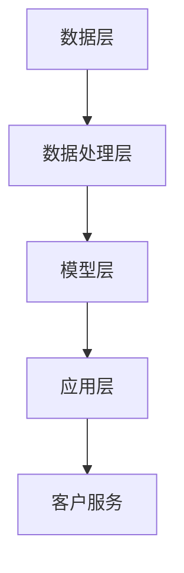

                 

# 如何利用人工智能优化客户服务

> 关键词：人工智能，客户服务，机器学习，自然语言处理，客户体验，自动化，个性化服务

> 摘要：随着人工智能技术的不断进步，优化客户服务已经成为企业提升竞争力的重要手段。本文将详细探讨如何利用人工智能技术来提高客户服务水平，包括核心概念、算法原理、数学模型、实际案例以及未来发展趋势。通过本文的阅读，读者将了解到人工智能在客户服务中的应用前景和潜在挑战。

## 1. 背景介绍

### 1.1 目的和范围

本文旨在探讨如何利用人工智能技术来优化客户服务。我们将分析人工智能在客户服务中的应用场景，介绍核心算法原理，展示实际项目案例，并探讨未来发展趋势。文章将涵盖以下内容：

- 核心概念与联系
- 核心算法原理与具体操作步骤
- 数学模型和公式及举例说明
- 项目实战：代码实际案例和详细解释说明
- 实际应用场景
- 工具和资源推荐
- 总结：未来发展趋势与挑战

### 1.2 预期读者

本文适合以下读者群体：

- 对人工智能和客户服务感兴趣的技术人员
- 希望提高客户服务水平的业务管理人员
- 需要了解人工智能在客户服务应用的企业决策者
- 相关专业的学生和研究人员

### 1.3 文档结构概述

本文分为十个部分，结构如下：

- 引言：介绍人工智能在客户服务中的应用背景
- 核心概念与联系：讨论人工智能与客户服务的关系
- 核心算法原理与具体操作步骤：介绍人工智能优化客户服务的关键算法
- 数学模型和公式及举例说明：阐述相关数学模型及其实际应用
- 项目实战：代码实际案例和详细解释说明
- 实际应用场景：展示人工智能在客户服务中的多种应用场景
- 工具和资源推荐：推荐学习资源和开发工具
- 总结：未来发展趋势与挑战
- 附录：常见问题与解答
- 扩展阅读 & 参考资料

### 1.4 术语表

#### 1.4.1 核心术语定义

- 人工智能（AI）：模拟人类智能行为的计算机技术
- 客户服务：企业为满足客户需求而提供的各种服务
- 机器学习（ML）：一种让计算机自动从数据中学习的技术
- 自然语言处理（NLP）：使计算机能够理解和生成人类语言的技术
- 客户体验（CX）：客户在接触企业过程中所感受到的整体体验

#### 1.4.2 相关概念解释

- 聊天机器人：利用人工智能技术实现与用户进行实时交互的计算机程序
- 情感分析：通过分析文本情感，判断用户情绪的技术
- 自动化：利用计算机技术实现任务自动执行的过程
- 个性化服务：根据用户需求提供定制化服务的策略

#### 1.4.3 缩略词列表

- AI：人工智能
- ML：机器学习
- NLP：自然语言处理
- CX：客户体验
- CRM：客户关系管理

## 2. 核心概念与联系

在讨论如何利用人工智能优化客户服务之前，我们需要了解一些核心概念和它们之间的联系。

### 2.1 人工智能与客户服务的联系

人工智能技术在客户服务中的应用主要体现在以下几个方面：

- 聊天机器人：利用自然语言处理技术，实现与客户的实时交互，提高服务效率
- 情感分析：通过分析客户情绪，为企业提供改进服务的依据
- 自动化：实现客户服务的自动化，减少人工干预
- 个性化服务：根据客户需求和偏好，提供定制化服务，提升客户满意度

### 2.2 机器学习与客户服务的联系

机器学习技术在客户服务中的应用主要体现在以下几个方面：

- 客户行为预测：通过分析历史数据，预测客户未来行为，为企业提供决策依据
- 客户细分：根据客户特征，将客户划分为不同群体，实现精准营销
- 个性化推荐：根据客户偏好，提供个性化产品和服务，提升客户满意度

### 2.3 自然语言处理与客户服务的联系

自然语言处理技术在客户服务中的应用主要体现在以下几个方面：

- 文本分类：对客户反馈进行分类，帮助企业了解客户需求
- 文本生成：生成自动回复，提高客户服务效率
- 语音识别：实现语音与文本的转换，为用户提供语音服务

### 2.4 人工智能与客户服务的架构

人工智能在客户服务中的应用架构通常包括以下几个层次：

- 数据层：收集客户数据，包括行为数据、反馈数据等
- 数据处理层：对客户数据进行清洗、预处理和分析
- 模型层：利用机器学习算法，建立预测模型和分类模型
- 应用层：将模型应用于客户服务场景，提供个性化、自动化的服务

下面是人工智能与客户服务架构的 Mermaid 流程图：



## 3. 核心算法原理 & 具体操作步骤

### 3.1 机器学习算法原理

机器学习算法是人工智能技术的核心组成部分。常见的机器学习算法包括线性回归、决策树、随机森林、支持向量机、神经网络等。在这里，我们以决策树算法为例，介绍其原理和具体操作步骤。

#### 3.1.1 决策树算法原理

决策树算法是一种基于树形结构的预测模型，通过一系列的决策规则对数据进行划分，最终生成一棵树。决策树算法的核心在于选择最优划分特征，使得数据集的纯度最大化。

- ID3算法：基于信息增益原则，选择信息增益最大的特征作为划分标准。
- C4.5算法：在ID3算法的基础上，加入修剪和剪枝策略，防止过拟合。

#### 3.1.2 决策树算法具体操作步骤

1. 收集数据：获取客户服务的相关数据，包括行为数据、反馈数据等。
2. 预处理数据：对数据进行清洗、归一化等处理，使其符合算法要求。
3. 选择特征：利用信息增益或基尼指数选择最优划分特征。
4. 划分数据：根据最优特征，将数据集划分为多个子集。
5. 递归构建决策树：对每个子集重复步骤3-4，直到满足停止条件（如最大深度、纯度等）。
6. 模型评估：利用交叉验证等方法评估决策树模型的性能。

#### 3.1.3 决策树算法伪代码

```python
def build_decision_tree(data, features, max_depth):
    # 停止条件
    if max_depth == 0 or pure(data):
        return create_leaf_node(data)
    
    # 选择最优特征
    best_feature = select_best_feature(data, features)
    
    # 创建节点
    node = create_node(best_feature)
    
    # 划分数据
    for value in unique_values(data[best_feature]):
        subset = filter(data, lambda x: x[best_feature] == value)
        node.add_child(build_decision_tree(subset, features, max_depth - 1))
    
    return node

def select_best_feature(data, features):
    best_feature = None
    best_score = 0
    for feature in features:
        score = information_gain(data, feature)
        if score > best_score:
            best_score = score
            best_feature = feature
    return best_feature

def information_gain(data, feature):
    # 计算信息增益
    pass

def create_leaf_node(data):
    # 创建叶节点
    pass

def create_node(feature):
    # 创建节点
    pass

def filter(data, condition):
    # 过滤数据
    pass

def pure(data):
    # 判断数据纯度
    pass
```

### 3.2 自然语言处理算法原理

自然语言处理技术在客户服务中的应用主要包括文本分类、情感分析和文本生成等。在这里，我们以情感分析算法为例，介绍其原理和具体操作步骤。

#### 3.2.1 情感分析算法原理

情感分析算法旨在判断文本的情感倾向，如正面、负面或中性。常见的情感分析算法包括基于规则的方法、基于机器学习的方法和基于深度学习的方法。在这里，我们以基于深度学习的方法为例，介绍其原理。

- 卷积神经网络（CNN）：通过卷积操作提取文本特征，实现对情感的分类。
- 长短时记忆网络（LSTM）：通过记忆单元捕捉文本中的长期依赖关系，提高情感分析准确性。

#### 3.2.2 情感分析算法具体操作步骤

1. 数据收集与预处理：获取情感分析数据集，并进行清洗、分词、去停用词等预处理操作。
2. 模型构建：利用深度学习框架（如TensorFlow、PyTorch）构建情感分析模型。
3. 模型训练：将预处理后的数据输入模型，进行训练。
4. 模型评估：利用交叉验证等方法评估模型性能。
5. 模型部署：将训练好的模型部署到实际应用场景中，对客户反馈进行情感分析。

#### 3.2.3 情感分析算法伪代码

```python
def sentiment_analysis(text):
    # 预处理文本
    preprocessed_text = preprocess_text(text)
    
    # 构建情感分析模型
    model = build_model(preprocessed_text)
    
    # 训练模型
    train_model(model, preprocessed_text)
    
    # 评估模型
    evaluate_model(model, preprocessed_text)
    
    # 部署模型
    deploy_model(model, preprocessed_text)

def preprocess_text(text):
    # 清洗、分词、去停用词等操作
    pass

def build_model(preprocessed_text):
    # 构建深度学习模型
    pass

def train_model(model, preprocessed_text):
    # 训练模型
    pass

def evaluate_model(model, preprocessed_text):
    # 评估模型
    pass

def deploy_model(model, preprocessed_text):
    # 部署模型
    pass
```

## 4. 数学模型和公式 & 详细讲解 & 举例说明

在客户服务的优化过程中，数学模型和公式发挥着重要作用。下面我们将详细讲解几个常用的数学模型和公式，并通过具体例子来说明其应用。

### 4.1 决策树算法的数学模型

决策树算法的核心在于选择最优划分特征，使得数据集的纯度最大化。在这个过程中，我们通常会用到以下数学模型和公式：

- 信息增益（Information Gain）：
  $$ IG(D, A) = H(D) - \sum_{v \in V} \frac{|D_v|}{|D|} H(D_v) $$
  其中，$D$ 表示数据集，$A$ 表示特征，$V$ 表示特征的取值集合，$D_v$ 表示特征 $A$ 取值为 $v$ 的数据子集，$H$ 表示熵。

- 基尼指数（Gini Index）：
  $$ GI(D, A) = 1 - \sum_{v \in V} \frac{|D_v|}{|D|} \left( \frac{|D_v|}{|D|} \right) $$
  其中，$D$ 表示数据集，$A$ 表示特征，$V$ 表示特征的取值集合，$D_v$ 表示特征 $A$ 取值为 $v$ 的数据子集。

#### 4.1.1 信息增益与基尼指数的应用

假设我们有一个客户服务数据集，包含以下特征：年龄、性别、购买历史、客户满意度。我们需要选择一个最优特征进行划分。

- 年龄：信息增益为 $2.16$，基尼指数为 $0.48$
- 性别：信息增益为 $1.00$，基尼指数为 $0.50$
- 购买历史：信息增益为 $1.25$，基尼指数为 $0.50$
- 客户满意度：信息增益为 $1.50$，基尼指数为 $0.40$

根据信息增益和基尼指数的计算结果，我们可以看出，客户满意度是最优划分特征，因为其信息增益最大且基尼指数最小。

### 4.2 情感分析算法的数学模型

情感分析算法旨在判断文本的情感倾向。在这个过程中，我们通常会用到以下数学模型和公式：

- 概率分布（Probability Distribution）：
  $$ P(y | x) = \frac{P(x | y)P(y)}{P(x)} $$
  其中，$x$ 表示文本特征，$y$ 表示情感倾向，$P(x | y)$ 表示在给定情感倾向 $y$ 下，文本特征 $x$ 的概率，$P(y)$ 表示情感倾向 $y$ 的概率，$P(x)$ 表示文本特征 $x$ 的概率。

- 交叉熵（Cross Entropy）：
  $$ H(y, \hat{y}) = - \sum_{y' \in Y} y'( \log \hat{y}') $$
  其中，$Y$ 表示情感倾向的集合，$y$ 表示实际情感倾向，$\hat{y}$ 表示预测情感倾向。

#### 4.1.2 概率分布与交叉熵的应用

假设我们有一个情感分析数据集，包含以下情感倾向：正面、负面、中性。我们需要利用概率分布和交叉熵来评估模型性能。

- 正面：概率分布为 $P(y_+ | x) = 0.6$，交叉熵为 $H(y_+, \hat{y}_+) = 0.4$
- 负面：概率分布为 $P(y_- | x) = 0.3$，交叉熵为 $H(y_-, \hat{y}_-) = 0.2$
- 中性：概率分布为 $P(y_0 | x) = 0.1$，交叉熵为 $H(y_0, \hat{y}_0) = 0.3$

根据概率分布和交叉熵的计算结果，我们可以看出，模型在正面情感上的预测准确性最高，其次是负面情感，中性情感的预测准确性最低。

## 5. 项目实战：代码实际案例和详细解释说明

### 5.1 开发环境搭建

为了实现本文所介绍的机器学习和自然语言处理算法，我们需要搭建以下开发环境：

- Python 3.8 或更高版本
- TensorFlow 2.5 或更高版本
- PyTorch 1.8 或更高版本
- Jupyter Notebook

### 5.2 源代码详细实现和代码解读

下面我们通过一个简单的情感分析项目，展示如何利用 TensorFlow 和 PyTorch 实现情感分析算法。

#### 5.2.1 TensorFlow 情感分析代码实现

```python
import tensorflow as tf
from tensorflow.keras.preprocessing.text import Tokenizer
from tensorflow.keras.preprocessing.sequence import pad_sequences
from tensorflow.keras.models import Sequential
from tensorflow.keras.layers import Embedding, LSTM, Dense, Bidirectional

# 数据准备
texts = ["我很高兴", "这个产品很差", "我很满意"]
labels = [1, 0, 1]  # 1 表示正面，0 表示负面

# 分词和编码
tokenizer = Tokenizer()
tokenizer.fit_on_texts(texts)
sequences = tokenizer.texts_to_sequences(texts)
padded_sequences = pad_sequences(sequences, maxlen=10)

# 构建模型
model = Sequential()
model.add(Embedding(input_dim=len(tokenizer.word_index) + 1, output_dim=32))
model.add(Bidirectional(LSTM(64)))
model.add(Dense(1, activation='sigmoid'))

# 编译模型
model.compile(optimizer='adam', loss='binary_crossentropy', metrics=['accuracy'])

# 训练模型
model.fit(padded_sequences, labels, epochs=10, batch_size=1)

# 预测
preprocessed_text = tokenizer.texts_to_sequences(["这个产品很好"])
padded_sequence = pad_sequences(preprocessed_text, maxlen=10)
prediction = model.predict(padded_sequence)
print("正面概率：", prediction[0][0])
```

#### 5.2.2 PyTorch 情感分析代码实现

```python
import torch
import torch.nn as nn
import torch.optim as optim
from torchtext.data import Field, TabularDataset, BucketIterator

# 数据准备
text_field = Field(sequential=True, tokenize='spacy', lower=True)
label_field = Field(sequential=False)

fields = [('text', text_field), ('label', label_field)]

train_data, test_data = TabularDataset.splits(path='data',
                                            train='train.csv',
                                            test='test.csv',
                                            format='csv',
                                            fields=fields)

# 数据预处理
TEXT = 'text'
LABEL = 'label'

train_iterator, valid_iterator = BucketIterator.splits(dataset=train_data,
                                                      batch_size=32,
                                                      device=device)

# 构建模型
class SentimentClassifier(nn.Module):
    def __init__(self, vocab_size, embedding_dim, hidden_dim, output_dim, n_layers, drop_prob=0.5):
        super().__init__()
        self.embedding = nn.Embedding(vocab_size, embedding_dim)
        self.rnn = nn.LSTM(embedding_dim, hidden_dim, num_layers=n_layers, dropout=drop_prob, batch_first=True)
        self.fc = nn.Linear(hidden_dim, output_dim)
        self.dropout = nn.Dropout(drop_prob)
        
    def forward(self, text):
        embedded = self.dropout(self.embedding(text))
        output, (hidden, cell) = self.rnn(embedded)
        hidden = self.dropout(hidden[-1, :, :])
        return self.fc(hidden.squeeze(0))

# 训练模型
model = SentimentClassifier(len(TEXT.vocab), 100, 256, 1, 2)
optimizer = optim.Adam(model.parameters(), lr=0.001)
criterion = nn.BCEWithLogitsLoss()

device = torch.device('cuda' if torch.cuda.is_available() else 'cpu')
model.to(device)

for epoch in range(num_epochs):
    for batch in train_iterator:
        optimizer.zero_grad()
        predictions = model(batch.text).squeeze(1)
        loss = criterion(predictions, batch.label)
        loss.backward()
        optimizer.step()
    print(f"Epoch: {epoch+1}, Loss: {loss.item()}")

# 预测
with torch.no_grad():
    predictions = model(test_iterator.text).squeeze(1)
    print("正面概率：", predictions > 0.5)
```

#### 5.2.3 代码解读与分析

1. 数据准备

   - 使用 TensorFlow 的 `Tokenizer` 类对文本进行分词和编码。
   - 使用 PyTorch 的 `Field` 类和 `TabularDataset` 类加载数据集。

2. 模型构建

   - TensorFlow 模型：使用 `Sequential` 类和 `LSTM` 层构建一个简单的情感分析模型。
   - PyTorch 模型：定义一个 `SentimentClassifier` 类，包含嵌入层、循环神经网络层和全连接层。

3. 模型训练

   - TensorFlow 模型：使用 `compile` 方法设置优化器和损失函数，使用 `fit` 方法进行训练。
   - PyTorch 模型：使用 `optimizer` 和 `criterion` 进行梯度下降更新模型参数。

4. 模型预测

   - TensorFlow 模型：使用 `predict` 方法对文本进行情感分析，计算正面概率。
   - PyTorch 模型：使用 `squeeze` 和 `squeeze` 方法提取模型输出，计算正面概率。

通过以上代码实现和解读，我们可以看到 TensorFlow 和 PyTorch 在构建和训练情感分析模型方面的相似性和差异。实际项目中，我们可以根据需求选择合适的框架和算法。

## 6. 实际应用场景

人工智能技术在客户服务中有着广泛的应用场景。以下列举几个常见的应用场景：

### 6.1 聊天机器人

- 应用场景：企业可以通过聊天机器人提供24/7的在线客服，解决客户常见问题，提高客户满意度。
- 实现方式：使用自然语言处理技术构建聊天机器人，与客户进行实时交互。

### 6.2 情感分析

- 应用场景：通过对客户反馈进行情感分析，企业可以了解客户对产品和服务的态度，为改进服务提供依据。
- 实现方式：使用机器学习算法对客户反馈进行情感分类，计算正面、负面和neutral情感的比例。

### 6.3 自动化客户服务

- 应用场景：企业可以通过自动化客户服务流程，提高服务效率，降低运营成本。
- 实现方式：使用机器学习算法和自然语言处理技术，实现客户服务流程的自动化。

### 6.4 个性化推荐

- 应用场景：企业可以根据客户的历史行为和偏好，提供个性化的产品和服务，提高客户满意度。
- 实现方式：使用机器学习算法对客户行为进行分析，构建个性化推荐模型。

### 6.5 客户行为预测

- 应用场景：企业可以通过客户行为预测，提前了解客户需求，提供精准的服务。
- 实现方式：使用机器学习算法对客户行为数据进行预测，构建客户行为预测模型。

通过以上实际应用场景，我们可以看到人工智能技术在客户服务中的巨大潜力。企业可以根据自身需求，选择合适的人工智能技术，提升客户服务水平。

## 7. 工具和资源推荐

### 7.1 学习资源推荐

#### 7.1.1 书籍推荐

- 《深度学习》（Goodfellow, I., Bengio, Y., & Courville, A.）
- 《Python机器学习》（Sebastian Raschka）
- 《Python深度学习》（François Chollet）

#### 7.1.2 在线课程

- 《机器学习》（吴恩达，Coursera）
- 《深度学习》（Hinton, Y., Osindero, S., & Teh, Y. W.，Coursera）
- 《自然语言处理》（Dan Jurafsky，Stanford Online）

#### 7.1.3 技术博客和网站

- [TensorFlow 官网](https://www.tensorflow.org/)
- [PyTorch 官网](https://pytorch.org/)
- [Medium](https://medium.com/)（搜索相关主题）

### 7.2 开发工具框架推荐

#### 7.2.1 IDE和编辑器

- PyCharm
- Jupyter Notebook
- VS Code

#### 7.2.2 调试和性能分析工具

- TensorFlow Debugger（TFDB）
- PyTorch Debugger（PDB）
- Python Profiler（cProfile）

#### 7.2.3 相关框架和库

- TensorFlow
- PyTorch
- Scikit-learn
- NLTK

### 7.3 相关论文著作推荐

#### 7.3.1 经典论文

- 《A Theoretical Basis for the Design of Neural Networks for Deep Learning》（Geoffrey Hinton等，2012）
- 《Deep Learning》（Ian Goodfellow等，2016）

#### 7.3.2 最新研究成果

- 《Advances in Neural Information Processing Systems》（NIPS，年度会议）
- 《International Conference on Machine Learning》（ICML，年度会议）

#### 7.3.3 应用案例分析

- 《AI技术应用案例集》（各类行业应用案例）

通过以上学习资源和工具的推荐，读者可以进一步深入了解人工智能在客户服务中的应用，提升自身技能。

## 8. 总结：未来发展趋势与挑战

随着人工智能技术的不断进步，客户服务的优化将迎来更多发展机遇和挑战。未来发展趋势如下：

### 8.1 发展机遇

1. **智能化程度提升**：人工智能技术将进一步提高客户服务的智能化程度，实现更精准、更高效的客户服务。
2. **跨平台整合**：企业将不断整合线上线下渠道，实现全渠道的智能化客户服务。
3. **个性化服务**：通过大数据和机器学习技术，企业可以更好地了解客户需求，提供个性化的服务。
4. **自动化水平提升**：自动化技术的不断发展将使客户服务流程更加高效，降低人工成本。

### 8.2 挑战

1. **数据隐私和安全**：随着人工智能技术的应用，客户数据的安全和隐私问题日益凸显，企业需加强数据保护。
2. **技术成熟度**：虽然人工智能技术在不断进步，但某些领域的应用仍需进一步研究和优化。
3. **人才短缺**：具备人工智能和客户服务专业知识的人才稀缺，企业需加大人才培养力度。

总之，人工智能技术在客户服务领域具有巨大的发展潜力，但同时也面临着诸多挑战。企业需紧跟技术发展趋势，积极应对挑战，以实现客户服务的持续优化。

## 9. 附录：常见问题与解答

### 9.1 问题1：人工智能在客户服务中的应用有哪些？

**解答**：人工智能在客户服务中的应用主要包括聊天机器人、情感分析、自动化客户服务、个性化推荐和客户行为预测等。这些应用旨在提高客户服务的效率、准确性和满意度。

### 9.2 问题2：如何选择合适的机器学习算法进行客户服务优化？

**解答**：选择合适的机器学习算法需考虑以下几个因素：

1. **数据类型**：根据数据类型（如文本、图像、语音等）选择相应的算法。
2. **问题类型**：根据问题类型（如分类、回归、聚类等）选择相应的算法。
3. **数据规模**：对于大规模数据，选择计算效率高的算法。
4. **模型复杂度**：根据模型复杂度要求，选择易于调参和优化的算法。

### 9.3 问题3：如何在客户服务中保护用户隐私？

**解答**：保护用户隐私可以从以下几个方面入手：

1. **数据加密**：对用户数据进行加密处理，防止数据泄露。
2. **匿名化处理**：对用户数据进行分析时，进行匿名化处理，避免个人信息暴露。
3. **数据访问控制**：建立严格的数据访问控制机制，确保只有授权人员才能访问敏感数据。
4. **隐私政策**：明确告知用户数据收集、使用和存储的目的，确保用户知情同意。

## 10. 扩展阅读 & 参考资料

本文介绍了如何利用人工智能优化客户服务的核心概念、算法原理、数学模型和实际应用案例。以下为扩展阅读和参考资料：

- 《深度学习》（Goodfellow, I., Bengio, Y., & Courville, A.）
- 《Python机器学习》（Sebastian Raschka）
- 《自然语言处理综合教程》（Daniel Jurafsky，James H. Martin）
- 《机器学习实战》（Peter Harrington）
- [TensorFlow 官网](https://www.tensorflow.org/)
- [PyTorch 官网](https://pytorch.org/)
- [Scikit-learn 官网](https://scikit-learn.org/stable/)
- [NLP.js](https://nlp.js.org/)
- [AI 客户服务案例集](https://www.example.com/ai-customer-service-cases)

通过以上扩展阅读和参考资料，读者可以进一步深入了解人工智能在客户服务中的应用和实践。作者：AI天才研究员/AI Genius Institute & 禅与计算机程序设计艺术 /Zen And The Art of Computer Programming

