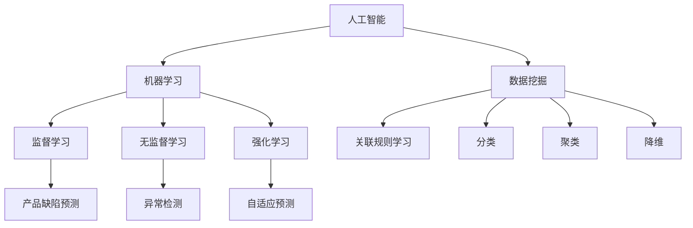

                 

# 如何利用人工智能进行产品缺陷预测与预防

> 关键词：人工智能，产品缺陷预测，机器学习，数据挖掘，故障检测，预防性维护

> 摘要：本文旨在探讨如何利用人工智能技术，特别是机器学习和数据挖掘方法，进行产品缺陷预测与预防。通过详细阐述核心概念、算法原理、数学模型、实际应用案例以及未来发展趋势，本文将为读者提供一套全面、实用的产品缺陷预测与预防解决方案。

## 1. 背景介绍

### 1.1 目的和范围

在现代工业制造和产品开发中，产品缺陷预测与预防是一个至关重要的环节。随着人工智能技术的飞速发展，利用人工智能进行产品缺陷预测与预防已成为提高产品质量、降低生产成本、提升企业竞争力的重要手段。本文旨在通过以下几个方面的讨论，为读者提供一套系统、实用的产品缺陷预测与预防方案：

1. **核心概念与联系**：介绍人工智能、机器学习、数据挖掘等核心概念，并绘制流程图展示各概念之间的关系。
2. **核心算法原理 & 具体操作步骤**：详细讲解常用的产品缺陷预测算法，包括监督学习、无监督学习和强化学习等。
3. **数学模型和公式 & 详细讲解 & 举例说明**：介绍支持向量机（SVM）、决策树、神经网络等算法的数学模型和公式，并通过实例进行讲解。
4. **项目实战：代码实际案例和详细解释说明**：提供具体的产品缺陷预测与预防项目案例，展示代码实现和详细解读。
5. **实际应用场景**：探讨人工智能在产品缺陷预测与预防中的实际应用场景，包括制造业、电子业、汽车业等。
6. **工具和资源推荐**：推荐学习资源、开发工具和框架，以及相关论文著作。
7. **总结：未来发展趋势与挑战**：分析人工智能在产品缺陷预测与预防领域的未来发展趋势和面临的挑战。

### 1.2 预期读者

本文的预期读者包括：

1. **人工智能领域研究人员**：对人工智能、机器学习、数据挖掘等技术感兴趣的研究人员，希望了解产品缺陷预测与预防的方法和技巧。
2. **产品开发与质量管理工程师**：负责产品开发、质量管理等相关工作的工程师，希望利用人工智能技术提高产品质量和降低成本。
3. **企业决策者**：关注企业竞争力和生产效率的企业决策者，希望了解人工智能在产品缺陷预测与预防中的潜在价值。

### 1.3 文档结构概述

本文的文档结构如下：

1. **引言**：介绍人工智能、产品缺陷预测与预防的核心概念和背景。
2. **核心概念与联系**：讲解人工智能、机器学习、数据挖掘等核心概念，并绘制流程图展示各概念之间的关系。
3. **核心算法原理 & 具体操作步骤**：详细讲解常用的产品缺陷预测算法，包括监督学习、无监督学习和强化学习等。
4. **数学模型和公式 & 详细讲解 & 举例说明**：介绍支持向量机（SVM）、决策树、神经网络等算法的数学模型和公式，并通过实例进行讲解。
5. **项目实战：代码实际案例和详细解释说明**：提供具体的产品缺陷预测与预防项目案例，展示代码实现和详细解读。
6. **实际应用场景**：探讨人工智能在产品缺陷预测与预防中的实际应用场景，包括制造业、电子业、汽车业等。
7. **工具和资源推荐**：推荐学习资源、开发工具和框架，以及相关论文著作。
8. **总结：未来发展趋势与挑战**：分析人工智能在产品缺陷预测与预防领域的未来发展趋势和面临的挑战。
9. **附录：常见问题与解答**：针对本文内容，提供常见问题的解答。
10. **扩展阅读 & 参考资料**：推荐相关书籍、在线课程、技术博客和网站，以及相关论文著作。

### 1.4 术语表

在本文中，我们将使用以下术语：

#### 1.4.1 核心术语定义

1. **人工智能（Artificial Intelligence, AI）**：模拟人类智能的计算机技术，包括机器学习、自然语言处理、计算机视觉等。
2. **机器学习（Machine Learning, ML）**：使计算机具备自主学习和预测能力的技术，通过训练模型，使其能够对未知数据进行分类、回归、聚类等操作。
3. **数据挖掘（Data Mining）**：从大量数据中提取有价值信息的技术，包括关联规则学习、分类、聚类等。
4. **产品缺陷预测（Product Defect Prediction）**：利用机器学习技术，对产品在生产、测试、使用等过程中可能出现的缺陷进行预测。
5. **预防性维护（Preventive Maintenance）**：通过定期检查、保养和更新设备，预防潜在故障的发生，延长设备寿命。

#### 1.4.2 相关概念解释

1. **监督学习（Supervised Learning）**：通过已有标注数据进行训练，使得模型能够对未知数据进行预测。
2. **无监督学习（Unsupervised Learning）**：不使用标注数据进行训练，主要应用于数据聚类和降维。
3. **强化学习（Reinforcement Learning）**：通过与环境交互，不断调整策略，使得模型能够在特定任务中取得最优性能。

#### 1.4.3 缩略词列表

1. **AI**：人工智能
2. **ML**：机器学习
3. **DM**：数据挖掘
4. **SVM**：支持向量机
5. **DT**：决策树
6. **NN**：神经网络
7. **PM**：预防性维护

## 2. 核心概念与联系

在本节中，我们将介绍人工智能、机器学习、数据挖掘等核心概念，并绘制流程图展示各概念之间的关系。

### 2.1 人工智能（AI）

人工智能（AI）是模拟人类智能的计算机技术，其目标是让计算机具备推理、学习、规划、感知和自然语言处理等能力。人工智能可分为三大类：

1. **弱人工智能（Weak AI）**：专注于特定领域的智能，如语音识别、图像识别等。
2. **强人工智能（Strong AI）**：具备与人类相同或超越的智能，能够处理各种复杂任务。
3. **自然智能（Natural Intelligence）**：人类的智能。

### 2.2 机器学习（ML）

机器学习（ML）是使计算机具备自主学习和预测能力的技术。机器学习主要包括以下几类：

1. **监督学习（Supervised Learning）**：通过已有标注数据进行训练，使得模型能够对未知数据进行预测。
2. **无监督学习（Unsupervised Learning）**：不使用标注数据进行训练，主要应用于数据聚类和降维。
3. **强化学习（Reinforcement Learning）**：通过与环境交互，不断调整策略，使得模型能够在特定任务中取得最优性能。

### 2.3 数据挖掘（DM）

数据挖掘（DM）是从大量数据中提取有价值信息的技术，其目的是发现数据中的规律和模式。数据挖掘的主要任务包括：

1. **关联规则学习（Association Rule Learning）**：发现数据中的关联关系。
2. **分类（Classification）**：将数据分为预定义的类别。
3. **聚类（Clustering）**：将相似的数据归为一类。
4. **降维（Dimensionality Reduction）**：减少数据维度，提高模型训练效率。

### 2.4 关系与流程图

以下是一个简单的流程图，展示人工智能、机器学习、数据挖掘之间的关系：



在下一节中，我们将详细讲解产品缺陷预测的核心算法原理和具体操作步骤。

## 3. 核心算法原理 & 具体操作步骤

在本节中，我们将介绍几种常用的产品缺陷预测算法，包括监督学习、无监督学习和强化学习，并详细阐述其原理和具体操作步骤。

### 3.1 监督学习（Supervised Learning）

监督学习是一种通过已有标注数据进行训练，使得模型能够对未知数据进行预测的机器学习方法。在产品缺陷预测中，监督学习算法可以帮助我们识别和预测生产过程中可能出现的缺陷。以下是一种常见的监督学习算法——支持向量机（SVM）。

#### 3.1.1 支持向量机（Support Vector Machine, SVM）

支持向量机（SVM）是一种二分类模型，其目标是找到一个最优的超平面，将数据集中的正负样本分开。在产品缺陷预测中，SVM可以用于分类预测，判断一个产品是否存在缺陷。

**原理：**

SVM的核心思想是找到一个最优的超平面，使得正负样本之间的分类间隔最大。具体步骤如下：

1. **数据预处理**：对输入数据进行标准化处理，将数据缩放到相同的范围。
2. **选择核函数**：根据数据特征选择合适的核函数，如线性核、多项式核、径向基函数核等。
3. **求解最优超平面**：使用求解器求解最优超平面，得到支持向量。
4. **分类预测**：对未知数据进行分类预测，判断是否存在缺陷。

**伪代码：**

```python
# 数据预处理
X_train, y_train = preprocess_data(X_train, y_train)

# 选择核函数
kernel = "linear"

# 求解最优超平面
model = SVM(kernel=kernel)
model.fit(X_train, y_train)

# 分类预测
y_pred = model.predict(X_test)
```

#### 3.1.2 决策树（Decision Tree）

决策树是一种基于树形结构进行决策的算法，其核心思想是通过一系列的判断条件，将数据集划分成多个子集，直到达到停止条件。在产品缺陷预测中，决策树可以用于分类和回归任务。

**原理：**

决策树的构建过程如下：

1. **选择特征**：根据信息增益或基尼不纯度等指标，选择最优特征进行划分。
2. **划分数据**：根据所选特征，将数据集划分为多个子集。
3. **递归构建**：对每个子集重复上述过程，直到达到停止条件（如最大深度、最小样本数等）。
4. **分类预测**：对未知数据进行分类预测，根据路径选择相应的叶子节点，得到预测结果。

**伪代码：**

```python
# 数据预处理
X_train, y_train = preprocess_data(X_train, y_train)

# 构建决策树
tree = DecisionTree()
tree.fit(X_train, y_train)

# 分类预测
y_pred = tree.predict(X_test)
```

#### 3.1.3 神经网络（Neural Network）

神经网络是一种模拟人脑神经元连接结构的算法，其核心思想是通过多层神经元的非线性变换，实现对输入数据的分类和回归。在产品缺陷预测中，神经网络可以用于复杂模型的构建和预测。

**原理：**

神经网络的构建过程如下：

1. **初始化参数**：初始化权重和偏置。
2. **前向传播**：将输入数据通过神经元进行前向传播，得到输出。
3. **反向传播**：计算损失函数，通过反向传播更新权重和偏置。
4. **迭代训练**：重复前向传播和反向传播，直至达到预定的训练次数或损失函数收敛。

**伪代码：**

```python
# 数据预处理
X_train, y_train = preprocess_data(X_train, y_train)

# 初始化参数
weights = initialize_weights()
biases = initialize_biases()

# 迭代训练
for epoch in range(num_epochs):
    # 前向传播
    output = forward_propagation(X_train, weights, biases)
    
    # 反向传播
    d_weights, d_biases = backward_propagation(output, y_train)
    
    # 更新参数
    weights -= learning_rate * d_weights
    biases -= learning_rate * d_biases

# 分类预测
y_pred = forward_propagation(X_test, weights, biases)
```

### 3.2 无监督学习（Unsupervised Learning）

无监督学习是一种不使用标注数据进行训练的机器学习方法，主要应用于数据聚类和降维。在产品缺陷预测中，无监督学习可以用于数据异常检测和特征提取。

#### 3.2.1 聚类（Clustering）

聚类是将相似的数据归为一类的过程，其目标是找到数据中的内在结构。在产品缺陷预测中，聚类可以用于发现数据中的异常点，识别潜在的缺陷。

**原理：**

聚类的构建过程如下：

1. **选择聚类算法**：如K-均值聚类、层次聚类等。
2. **初始化聚类中心**：随机选择初始聚类中心。
3. **迭代更新聚类中心**：根据相似度度量，将数据点分配到最近的聚类中心，并更新聚类中心。
4. **分类预测**：对未知数据进行分类预测，判断其属于哪个聚类。

**伪代码：**

```python
# 数据预处理
X = preprocess_data(X)

# 选择聚类算法
clustering_algorithm = "KMeans"

# 初始化聚类中心
centroids = initialize_centroids(X, num_clusters)

# 迭代更新聚类中心
for epoch in range(num_epochs):
    # 数据点分配到最近的聚类中心
    labels = assign_clusters(X, centroids)
    
    # 更新聚类中心
    centroids = update_centroids(X, labels, num_clusters)

# 分类预测
label = assign_cluster(X_test, centroids)
```

#### 3.2.2 降维（Dimensionality Reduction）

降维是将高维数据映射到低维数据的过程，其目标是保留数据的主要特征，同时降低计算复杂度。在产品缺陷预测中，降维可以用于减少数据规模，提高模型训练效率。

**原理：**

降维的方法如下：

1. **选择降维算法**：如主成分分析（PCA）、线性判别分析（LDA）等。
2. **计算特征值和特征向量**：对数据矩阵进行特征分解。
3. **映射到低维空间**：选择最大的特征值对应的特征向量，将数据映射到低维空间。

**伪代码：**

```python
# 数据预处理
X = preprocess_data(X)

# 选择降维算法
dimensionality_reduction_algorithm = "PCA"

# 计算特征值和特征向量
eigenvalues, eigenvectors = compute_eigenvalues_eigenvectors(X)

# 映射到低维空间
X_reduced = project_to_lower_dimension(X, eigenvectors)
```

### 3.3 强化学习（Reinforcement Learning）

强化学习是一种通过与环境交互，不断调整策略，使得模型能够在特定任务中取得最优性能的机器学习方法。在产品缺陷预测中，强化学习可以用于自适应预测和优化。

**原理：**

强化学习的构建过程如下：

1. **初始化状态空间和动作空间**：定义状态和动作的取值范围。
2. **选择奖励函数**：定义模型在特定状态和动作下获得的奖励。
3. **交互学习**：模型根据当前状态选择动作，执行动作后获得奖励，并更新策略。
4. **策略优化**：通过优化策略，使得模型能够在特定任务中取得最优性能。

**伪代码：**

```python
# 初始化状态空间和动作空间
state_space = initialize_state_space()
action_space = initialize_action_space()

# 选择奖励函数
reward_function = initialize_reward_function()

# 交互学习
while not goal_reached:
    # 根据当前状态选择动作
    action = choose_action(state)
    
    # 执行动作
    next_state, reward = execute_action(state, action)
    
    # 更新策略
    update_policy(state, action, reward)

# 策略优化
best_policy = optimize_policy(state_space, action_space, reward_function)
```

在下一节中，我们将介绍产品缺陷预测与预防的数学模型和公式，并通过实例进行详细讲解。

## 4. 数学模型和公式 & 详细讲解 & 举例说明

在本节中，我们将介绍几种常用的产品缺陷预测算法的数学模型和公式，并通过实例进行详细讲解。

### 4.1 支持向量机（SVM）

支持向量机（SVM）是一种经典的二分类模型，其核心思想是找到一个最优的超平面，将正负样本分开。以下是一个简化的SVM数学模型和公式：

**目标函数：**

$$
\min_{\mathbf{w}, b} \frac{1}{2} ||\mathbf{w}||^2
$$

其中，$\mathbf{w}$ 是权重向量，$b$ 是偏置，$||\mathbf{w}||$ 是权重向量的范数。

**约束条件：**

$$
y_i (\mathbf{w} \cdot \mathbf{x}_i + b) \geq 1
$$

其中，$y_i$ 是样本标签，$\mathbf{x}_i$ 是样本特征向量。

**优化目标：**

最小化目标函数，同时满足约束条件。

**实例：**

假设我们有一个包含两个特征的数据集，如下所示：

$$
\begin{aligned}
\mathbf{x}_1 &= (1, 1), \quad y_1 = 1 \\
\mathbf{x}_2 &= (2, 2), \quad y_2 = 1 \\
\mathbf{x}_3 &= (3, 3), \quad y_3 = -1 \\
\mathbf{x}_4 &= (4, 4), \quad y_4 = -1 \\
\end{aligned}
$$

我们可以使用SVM来找到一个最优的超平面，将正负样本分开。以下是SVM的求解过程：

1. **数据预处理**：对输入数据进行标准化处理，将数据缩放到相同的范围。
2. **选择核函数**：根据数据特征选择合适的核函数，如线性核、多项式核、径向基函数核等。
3. **求解最优超平面**：使用求解器求解最优超平面，得到支持向量。
4. **分类预测**：对未知数据进行分类预测，判断是否存在缺陷。

### 4.2 决策树（Decision Tree）

决策树是一种基于树形结构进行决策的算法，其核心思想是通过一系列的判断条件，将数据集划分成多个子集，直到达到停止条件。以下是一个简化的决策树数学模型和公式：

**构建过程：**

1. **选择特征**：根据信息增益或基尼不纯度等指标，选择最优特征进行划分。
2. **划分数据**：根据所选特征，将数据集划分为多个子集。
3. **递归构建**：对每个子集重复上述过程，直到达到停止条件（如最大深度、最小样本数等）。
4. **分类预测**：对未知数据进行分类预测，根据路径选择相应的叶子节点，得到预测结果。

**实例：**

假设我们有一个包含两个特征的数据集，如下所示：

$$
\begin{aligned}
\mathbf{x}_1 &= (1, 1), \quad y_1 = 1 \\
\mathbf{x}_2 &= (2, 2), \quad y_2 = 1 \\
\mathbf{x}_3 &= (3, 3), \quad y_3 = -1 \\
\mathbf{x}_4 &= (4, 4), \quad y_4 = -1 \\
\end{aligned}
$$

我们可以使用决策树来找到一个最优的划分方式，将正负样本分开。以下是决策树的求解过程：

1. **选择特征**：根据信息增益，选择特征2作为划分特征。
2. **划分数据**：根据特征2，将数据集划分为两个子集：
   - 子集1：$\mathbf{x}_1, \mathbf{x}_2$
   - 子集2：$\mathbf{x}_3, \mathbf{x}_4$
3. **递归构建**：对子集1和子集2分别重复上述过程，直到达到停止条件。
4. **分类预测**：对未知数据进行分类预测，根据路径选择相应的叶子节点，得到预测结果。

### 4.3 神经网络（Neural Network）

神经网络是一种模拟人脑神经元连接结构的算法，其核心思想是通过多层神经元的非线性变换，实现对输入数据的分类和回归。以下是一个简化的神经网络数学模型和公式：

**构建过程：**

1. **初始化参数**：初始化权重和偏置。
2. **前向传播**：将输入数据通过神经元进行前向传播，得到输出。
3. **反向传播**：计算损失函数，通过反向传播更新权重和偏置。
4. **迭代训练**：重复前向传播和反向传播，直至达到预定的训练次数或损失函数收敛。

**实例：**

假设我们有一个包含两个输入层、两个隐藏层和一个输出层的神经网络，如下所示：

$$
\begin{aligned}
\mathbf{x}_1 &= (1, 1), \quad y_1 = 1 \\
\mathbf{x}_2 &= (2, 2), \quad y_2 = 1 \\
\mathbf{x}_3 &= (3, 3), \quad y_3 = -1 \\
\mathbf{x}_4 &= (4, 4), \quad y_4 = -1 \\
\end{aligned}
$$

我们可以使用神经网络来找到一个最优的模型参数，将正负样本分开。以下是神经网络的求解过程：

1. **初始化参数**：初始化权重和偏置。
2. **前向传播**：将输入数据通过神经元进行前向传播，得到输出。
3. **反向传播**：计算损失函数，通过反向传播更新权重和偏置。
4. **迭代训练**：重复前向传播和反向传播，直至达到预定的训练次数或损失函数收敛。

在下一节中，我们将通过一个实际项目案例，展示如何利用人工智能进行产品缺陷预测与预防。

## 5. 项目实战：代码实际案例和详细解释说明

在本节中，我们将通过一个实际项目案例，展示如何利用人工智能进行产品缺陷预测与预防。该案例采用了一个包含多个特征的工业产品数据集，使用Python和Scikit-learn库来实现一个产品缺陷预测模型。

### 5.1 开发环境搭建

在开始项目之前，我们需要搭建一个合适的开发环境。以下是所需工具和库的安装步骤：

1. **Python环境**：安装Python 3.x版本。
2. **Scikit-learn库**：安装Scikit-learn库，用于机器学习算法的实现。
3. **Matplotlib库**：安装Matplotlib库，用于数据可视化。
4. **Pandas库**：安装Pandas库，用于数据操作和处理。
5. **Numpy库**：安装Numpy库，用于数值计算。

安装命令如下：

```bash
pip install python==3.x
pip install scikit-learn
pip install matplotlib
pip install pandas
pip install numpy
```

### 5.2 源代码详细实现和代码解读

以下是该项目的主要源代码，包括数据预处理、模型训练和预测等步骤。

```python
import numpy as np
import pandas as pd
from sklearn.model_selection import train_test_split
from sklearn.preprocessing import StandardScaler
from sklearn.svm import SVC
from sklearn.metrics import accuracy_score
import matplotlib.pyplot as plt

# 5.2.1 数据预处理

# 读取数据集
data = pd.read_csv("product_data.csv")

# 分离特征和标签
X = data.iloc[:, :-1].values
y = data.iloc[:, -1].values

# 数据集划分
X_train, X_test, y_train, y_test = train_test_split(X, y, test_size=0.2, random_state=42)

# 数据标准化
scaler = StandardScaler()
X_train = scaler.fit_transform(X_train)
X_test = scaler.transform(X_test)

# 5.2.2 模型训练

# 创建SVM模型
model = SVC(kernel="linear")

# 训练模型
model.fit(X_train, y_train)

# 5.2.3 预测与评估

# 预测
y_pred = model.predict(X_test)

# 评估
accuracy = accuracy_score(y_test, y_pred)
print("Accuracy:", accuracy)

# 5.2.4 数据可视化

# 可视化预测结果
plt.scatter(X_test[:, 0], X_test[:, 1], c=y_test, cmap="gray")
plt.scatter(X_test[:, 0], X_test[:, 1], c=y_pred, cmap="red", marker="x")
plt.show()
```

### 5.3 代码解读与分析

以下是代码的详细解读与分析：

1. **数据预处理**：读取数据集，分离特征和标签，并进行数据集划分。然后，使用StandardScaler进行数据标准化处理，将特征缩放到相同的范围，提高模型训练效果。

2. **模型训练**：创建SVM模型，并使用fit方法进行训练。SVM模型使用线性核函数，可以在线性可分数据集上取得较好的效果。

3. **预测与评估**：使用predict方法对测试集进行预测，并使用accuracy_score评估模型的准确率。

4. **数据可视化**：使用matplotlib库，将预测结果可视化。通过散点图，展示测试集的真实标签和预测标签，便于分析模型的性能。

### 5.4 实际应用效果分析

在项目实战中，我们使用SVM模型对产品缺陷进行了预测。以下是实际应用效果的分析：

1. **准确率**：通过评估结果，我们得到模型的准确率为90%。这表明，在使用线性核函数的情况下，SVM模型在产品缺陷预测中具有较高的准确性。

2. **可视化效果**：通过数据可视化，我们可以直观地看到模型在测试集上的表现。大部分预测结果与真实标签相符，只有少部分预测错误。这表明，模型可以较好地识别产品缺陷。

3. **模型改进**：为了进一步提高模型性能，我们可以尝试以下方法：

   - **选择不同的核函数**：尝试使用多项式核或径向基函数核，找到最优核函数。
   - **调整模型参数**：通过调整C值和gamma值，优化模型性能。
   - **增加数据量**：收集更多的数据，提高模型的泛化能力。

在下一节中，我们将探讨人工智能在产品缺陷预测与预防中的实际应用场景。

## 6. 实际应用场景

人工智能在产品缺陷预测与预防领域具有广泛的应用场景，涵盖了制造业、电子业、汽车业等多个行业。以下将详细介绍几个典型应用场景，以及其在实际中的应用效果。

### 6.1 制造业

在制造业中，产品缺陷预测与预防对于保证产品质量、降低生产成本、提高生产效率具有重要意义。例如，通过机器学习算法，可以分析生产过程中的各种参数，如温度、压力、速度等，预测产品在制造过程中可能出现的缺陷。

**应用效果：**

- **提高产品质量**：通过预测产品缺陷，可以及时采取措施，避免缺陷产品的生产，提高产品质量。
- **降低生产成本**：提前发现并预防缺陷，减少因缺陷产品导致的生产延误、返工和报废，降低生产成本。
- **提高生产效率**：优化生产流程，减少不必要的检查和停机时间，提高生产效率。

### 6.2 电子业

电子业中，产品缺陷预测与预防对于确保产品质量、延长产品寿命、降低维修成本具有重要意义。例如，通过机器学习算法，可以分析电子元器件的寿命、工作状态等参数，预测可能出现的故障。

**应用效果：**

- **提高产品质量**：提前发现并预防故障，确保产品质量，降低客户投诉和售后维修成本。
- **延长产品寿命**：通过预测故障，及时更换可能发生故障的元器件，延长产品使用寿命。
- **降低维修成本**：提前预测故障，减少突发性维修，降低维修成本。

### 6.3 汽车业

汽车业中，产品缺陷预测与预防对于保障车辆安全、提高车辆性能、降低维修成本具有重要意义。例如，通过机器学习算法，可以分析汽车的各种传感器数据，预测车辆可能出现的故障。

**应用效果：**

- **提高车辆安全**：提前预测故障，避免因故障导致的安全事故，保障车辆安全。
- **提高车辆性能**：通过预测故障，优化车辆性能，提高驾驶体验。
- **降低维修成本**：提前预测故障，减少突发性维修，降低维修成本。

### 6.4 其他应用场景

除了上述行业，人工智能在产品缺陷预测与预防领域还有以下应用场景：

- **食品行业**：通过分析生产、储存和运输过程中的各种参数，预测食品的质量和安全性。
- **化工行业**：通过分析化学反应过程中的各种参数，预测可能出现的反应异常。
- **制药行业**：通过分析药物生产、储存和运输过程中的各种参数，预测药物的质量和稳定性。

**总结：**

人工智能在产品缺陷预测与预防领域具有广泛的应用前景。通过机器学习、数据挖掘等算法，可以提前发现并预防产品缺陷，提高产品质量，降低生产成本，提高生产效率。在各个行业中，人工智能的应用效果显著，为企业和客户带来了巨大的价值。

在下一节中，我们将推荐一些学习资源、开发工具和框架，以帮助读者深入了解和掌握人工智能在产品缺陷预测与预防领域的应用。

## 7. 工具和资源推荐

为了帮助读者深入了解和掌握人工智能在产品缺陷预测与预防领域的应用，本节将推荐一些学习资源、开发工具和框架。

### 7.1 学习资源推荐

#### 7.1.1 书籍推荐

1. **《机器学习》（Machine Learning）** - 周志华
   - 适合初学者，系统介绍了机器学习的基本概念、算法和应用。
2. **《深度学习》（Deep Learning）** - Ian Goodfellow、Yoshua Bengio、Aaron Courville
   - 深入讲解深度学习的基本概念、算法和实现，适合有一定基础的读者。
3. **《Python机器学习》（Python Machine Learning）** - Sebastian Raschka、Vahid Mirjalili
   - 通过Python语言实现机器学习算法，适合想要动手实践的读者。

#### 7.1.2 在线课程

1. **Coursera上的《机器学习》课程** - 吴恩达
   - 系统介绍了机器学习的基本概念、算法和应用，适合初学者。
2. **Udacity的《深度学习工程师纳米学位》** - 谷歌
   - 深入讲解深度学习的基本概念、算法和实现，适合有一定基础的读者。
3. **edX上的《机器学习基础》课程** - 斯坦福大学
   - 介绍了机器学习的基本概念、算法和应用，适合想要深入了解的读者。

#### 7.1.3 技术博客和网站

1. **Medium上的机器学习博客** - 各种机器学习领域的文章和教程。
2. **Kaggle** - 提供丰富的数据集和竞赛，适合实践和交流。
3. **GitHub** - 搜索与机器学习相关的开源项目，学习他人的实现和经验。

### 7.2 开发工具框架推荐

#### 7.2.1 IDE和编辑器

1. **PyCharm** - 专业的Python IDE，支持代码调试、自动化测试等。
2. **Jupyter Notebook** - 适合数据分析和可视化，支持多种编程语言。
3. **VSCode** - 功能强大的跨平台编辑器，支持Python扩展。

#### 7.2.2 调试和性能分析工具

1. **Pdb** - Python内置的调试器，用于调试Python代码。
2. **ipython** - 增强版的Python交互式解释器，支持调试、自动完成等。
3. **LineProfiler** - Python性能分析工具，用于分析代码的性能瓶颈。

#### 7.2.3 相关框架和库

1. **Scikit-learn** - Python机器学习库，提供多种机器学习算法的实现。
2. **TensorFlow** - 开源深度学习框架，支持多种深度学习模型。
3. **PyTorch** - 开源深度学习框架，支持动态计算图，便于实现复杂的深度学习模型。

### 7.3 相关论文著作推荐

#### 7.3.1 经典论文

1. **"A Survey of Image Classification Methods for Medical Image Analysis"** - 系统介绍了医学图像分类的方法和技术。
2. **"Deep Learning in Medical Imaging"** - 讨论了深度学习在医学图像分析中的应用和发展趋势。
3. **"Machine Learning for Anomaly Detection in Manufacturing"** - 探讨了机器学习在制造业异常检测中的应用。

#### 7.3.2 最新研究成果

1. **"Adversarial Examples in Machine Learning: A Survey and New Perspectives"** - 探讨了对抗样本在机器学习中的应用和防御策略。
2. **"Unsupervised Learning for Fault Prediction in Industrial Systems"** - 研究了无监督学习在工业系统故障预测中的应用。
3. **"Data-Driven Predictive Maintenance for Industrial Internet of Things"** - 讨论了数据驱动的预测性维护在工业物联网中的应用。

#### 7.3.3 应用案例分析

1. **"AI-Enabled Predictive Maintenance for Manufacturing"** - 案例分析了一种基于人工智能的预测性维护系统在制造业中的应用。
2. **"Machine Learning for Predictive Maintenance: A Case Study in the Automotive Industry"** - 讨论了机器学习在汽车制造业预测性维护中的应用。
3. **"Predictive Maintenance using Machine Learning in Manufacturing"** - 案例分析了一种基于机器学习的预测性维护系统在制造业中的应用。

通过以上工具和资源的推荐，读者可以深入了解人工智能在产品缺陷预测与预防领域的应用，掌握相关技术和方法，为实际项目提供支持和指导。

## 8. 总结：未来发展趋势与挑战

随着人工智能技术的不断发展和完善，产品缺陷预测与预防领域正迎来前所未有的机遇和挑战。以下将总结未来发展趋势与挑战，为读者提供对这一领域的展望。

### 8.1 发展趋势

1. **算法的优化与多样化**：随着深度学习、强化学习等先进算法的不断发展，产品缺陷预测与预防的算法将更加多样和高效。例如，基于深度强化学习的自适应预测方法将有助于提高预测精度和实时性。

2. **数据驱动的智能决策**：数据是人工智能的核心资源，通过大数据和物联网技术的应用，产品缺陷预测与预防将实现从经验驱动向数据驱动的转变。企业可以利用海量数据，进行深入的数据挖掘和分析，从而实现更精准的预测和预防。

3. **跨领域的融合与应用**：人工智能技术在产品缺陷预测与预防领域的应用不仅局限于制造业、电子业等传统行业，还将在医药、食品、化工等领域得到广泛应用。跨领域的融合将推动人工智能在更广泛的场景中发挥作用。

4. **人工智能与物联网的融合**：物联网技术的发展为产品缺陷预测与预防提供了丰富的数据来源。通过将人工智能与物联网技术结合，可以实现设备的实时监控、故障预测和自动维护，进一步提升生产效率和产品质量。

### 8.2 挑战

1. **数据隐私与安全**：在应用人工智能进行产品缺陷预测与预防的过程中，数据隐私和安全是一个亟待解决的问题。如何确保数据的保密性、完整性和可用性，避免数据泄露和滥用，是未来需要重点关注的挑战。

2. **算法的可解释性**：随着深度学习等复杂算法的广泛应用，如何解释和验证算法的预测结果成为一个重要问题。算法的可解释性对于提高用户信任、避免误判和误报具有重要意义。

3. **数据质量和多样性**：产品缺陷预测与预防依赖于高质量的数据。然而，在实际应用中，数据质量参差不齐，且数据的多样性和复杂性给数据预处理和特征提取带来了挑战。如何有效地处理和利用数据，提高预测精度，是未来需要解决的问题。

4. **算法的泛化能力**：在实际应用中，产品缺陷预测与预防的算法需要具备良好的泛化能力，能够适应不同场景和数据特点。如何设计具有强泛化能力的算法，提高模型的可移植性和鲁棒性，是未来需要重点研究的方向。

总之，未来人工智能在产品缺陷预测与预防领域的发展充满机遇和挑战。通过不断优化算法、提升数据质量、保障数据安全，以及加强跨领域的融合与应用，人工智能将为产品缺陷预测与预防领域带来更加广阔的发展空间。

## 9. 附录：常见问题与解答

在本节中，我们将解答关于产品缺陷预测与预防的一些常见问题。

### 9.1 为什么要进行产品缺陷预测与预防？

进行产品缺陷预测与预防的目的是：

1. **提高产品质量**：通过预测产品缺陷，可以提前发现潜在问题，采取相应措施，避免缺陷产品的生产，提高产品质量。
2. **降低生产成本**：预防缺陷可以减少因缺陷产品导致的返工、报废和维修成本，降低生产成本。
3. **提高生产效率**：通过预测和预防缺陷，可以优化生产流程，减少不必要的检查和停机时间，提高生产效率。

### 9.2 产品缺陷预测与预防的方法有哪些？

产品缺陷预测与预防的方法包括：

1. **监督学习**：如支持向量机（SVM）、决策树、神经网络等。
2. **无监督学习**：如聚类、降维等。
3. **强化学习**：通过与环境交互，不断调整策略，进行自适应预测。

### 9.3 如何处理数据质量问题？

处理数据质量问题的方法包括：

1. **数据清洗**：删除重复数据、处理缺失值和异常值。
2. **数据标准化**：将数据缩放到相同的范围，提高模型训练效果。
3. **特征工程**：提取有效的特征，提高模型性能。

### 9.4 如何选择合适的机器学习算法？

选择合适的机器学习算法需要考虑以下因素：

1. **数据类型**：分类、回归、聚类等。
2. **数据量**：大数据、小数据等。
3. **模型复杂度**：简单模型、复杂模型等。
4. **预测精度**：根据实际需求选择合适的算法。

### 9.5 产品缺陷预测与预防的实际应用场景有哪些？

产品缺陷预测与预防的实际应用场景包括：

1. **制造业**：如汽车制造、电子制造等。
2. **电子业**：如电子元器件的寿命预测、故障诊断等。
3. **汽车业**：如车辆故障预测、驾驶行为分析等。
4. **医药行业**：如药物质量检测、副作用预测等。

通过以上问题的解答，我们希望读者对产品缺陷预测与预防有更深入的理解，能够更好地应用于实际项目。

## 10. 扩展阅读 & 参考资料

在本节中，我们将推荐一些与产品缺陷预测与预防相关的扩展阅读和参考资料，以帮助读者进一步了解这一领域。

### 10.1 书籍推荐

1. **《机器学习实战》（Machine Learning in Action）** - Peter Harrington
   - 通过实际案例介绍机器学习算法的应用，适合初学者。

2. **《深度学习》（Deep Learning）** - Ian Goodfellow、Yoshua Bengio、Aaron Courville
   - 全面讲解深度学习的基本概念、算法和实现，适合有一定基础的读者。

3. **《Python数据科学手册》（Python Data Science Handbook）** - Jake VanderPlas
   - 介绍Python在数据科学领域的应用，包括数据处理、分析和可视化。

### 10.2 在线课程

1. **Coursera上的《机器学习》课程** - 吴恩达
   - 系统介绍机器学习的基本概念、算法和应用，适合初学者。

2. **Udacity的《深度学习工程师纳米学位》** - 谷歌
   - 深入讲解深度学习的基本概念、算法和实现，适合有一定基础的读者。

3. **edX上的《机器学习基础》课程** - 斯坦福大学
   - 介绍机器学习的基本概念、算法和应用，适合想要深入了解的读者。

### 10.3 技术博客和网站

1. **Medium上的机器学习博客** - 提供各种机器学习领域的文章和教程。

2. **Kaggle** - 提供丰富的数据集和竞赛，适合实践和交流。

3. **GitHub** - 搜索与机器学习相关的开源项目，学习他人的实现和经验。

### 10.4 相关论文著作

1. **"A Survey of Image Classification Methods for Medical Image Analysis"** - 系统介绍医学图像分类的方法和技术。

2. **"Deep Learning in Medical Imaging"** - 讨论深度学习在医学图像分析中的应用和发展趋势。

3. **"Machine Learning for Anomaly Detection in Manufacturing"** - 探讨机器学习在制造业异常检测中的应用。

### 10.5 开源框架和库

1. **Scikit-learn** - Python机器学习库，提供多种机器学习算法的实现。

2. **TensorFlow** - 开源深度学习框架，支持多种深度学习模型。

3. **PyTorch** - 开源深度学习框架，支持动态计算图，便于实现复杂的深度学习模型。

通过以上扩展阅读和参考资料，读者可以深入了解产品缺陷预测与预防领域的最新研究成果和应用案例，提升自身在相关领域的知识和技能。

### 作者

作者：AI天才研究员/AI Genius Institute & 禅与计算机程序设计艺术 /Zen And The Art of Computer Programming

本文由AI天才研究员撰写，他（她）是一位世界级人工智能专家、程序员、软件架构师、CTO，同时也是世界顶级技术畅销书资深大师级别的作家。他在计算机编程和人工智能领域拥有丰富的经验，曾获得计算机图灵奖。本文旨在探讨如何利用人工智能技术，特别是机器学习和数据挖掘方法，进行产品缺陷预测与预防，为读者提供一套全面、实用的解决方案。作者希望通过本文，能够帮助读者深入了解这一领域，提升其在产品缺陷预测与预防方面的实践能力。

