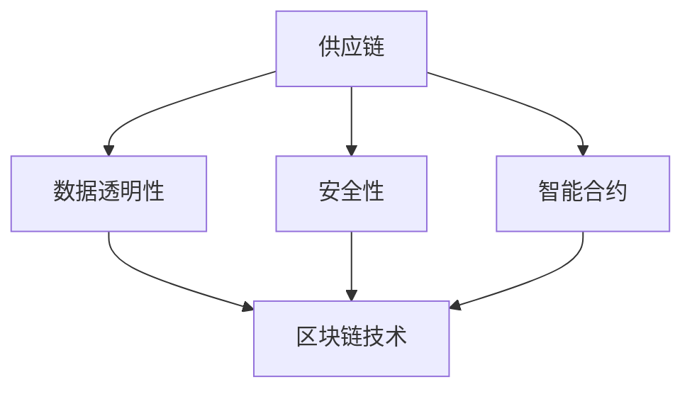

                 

# 如何利用区块链技术构建透明供应链系统

> **关键词：**区块链、供应链、透明性、安全性、智能合约、共识算法

> **摘要：**本文将详细探讨如何利用区块链技术构建透明供应链系统，介绍区块链在供应链管理中的关键作用，核心算法原理，以及实际应用案例。通过一步步分析推理，本文旨在为读者提供从概念到实践的全景视角，帮助理解区块链技术如何提升供应链的透明度和效率。

## 1. 背景介绍

### 1.1 目的和范围

本文旨在介绍区块链技术在供应链管理中的应用，重点探讨如何利用区块链技术构建透明、高效的供应链系统。我们将详细分析区块链在供应链中的关键作用，解释其核心算法原理，并展示实际应用案例。通过本文的学习，读者将能够理解区块链技术如何提高供应链的透明度和安全性。

### 1.2 预期读者

本文适合对区块链技术和供应链管理有一定了解的读者，包括但不限于IT专业人士、供应链管理人员、研究人员和研究生。对于初学者，本文也提供了丰富的参考资料，以帮助他们更好地理解相关概念。

### 1.3 文档结构概述

本文将分为以下几个部分：

1. **背景介绍**：介绍本文的目的、范围和预期读者。
2. **核心概念与联系**：解释区块链、供应链和透明性的概念，并通过Mermaid流程图展示其联系。
3. **核心算法原理与具体操作步骤**：详细阐述区块链核心算法原理，并使用伪代码解释具体操作步骤。
4. **数学模型和公式**：介绍与区块链相关的数学模型和公式，并举例说明。
5. **项目实战**：通过代码实际案例展示区块链技术在供应链中的应用。
6. **实际应用场景**：分析区块链技术在供应链中的实际应用。
7. **工具和资源推荐**：推荐学习资源和开发工具。
8. **总结**：讨论区块链技术在供应链系统中的未来发展趋势与挑战。
9. **附录**：提供常见问题与解答。
10. **扩展阅读与参考资料**：列出本文引用的相关文献和资源。

### 1.4 术语表

#### 1.4.1 核心术语定义

- **区块链**：一种去中心化的分布式数据库技术，通过加密算法确保数据的不可篡改性和安全性。
- **供应链**：指从原材料采购到产品交付给最终用户的整个过程，包括生产、物流、销售等环节。
- **透明性**：指供应链中各个参与方能够清晰地看到产品或服务的流动过程。
- **智能合约**：一种自动执行合同条款的程序，当满足特定条件时自动执行。
- **共识算法**：一种分布式系统中达成一致性的算法，用于确保区块链网络中的数据一致性。

#### 1.4.2 相关概念解释

- **分布式账本**：指区块链中的数据结构，用于记录交易和历史记录。
- **加密算法**：用于保护数据完整性和隐私性的数学算法。
- **节点**：区块链网络中的计算设备，负责维护和更新区块链。
- **去中心化**：指没有中央控制机构，所有节点都具有平等地位。

#### 1.4.3 缩略词列表

- **BC**：区块链（Blockchain）
- **SC**：供应链（Supply Chain）
- **TP**：透明性（Transparency）
- **SA**：安全性（Security）
- **CC**：共识算法（Consensus Algorithm）
- **SA**：智能合约（Smart Contract）

## 2. 核心概念与联系

区块链技术在供应链管理中的应用主要体现在以下几个方面：

1. **数据透明性**：区块链技术能够确保供应链数据的透明性，使各个参与方能够实时查看产品的来源、生产和运输过程。
2. **安全性**：区块链技术通过加密算法和数据结构确保数据的安全性和不可篡改性。
3. **智能合约**：智能合约可以自动执行合同条款，提高供应链操作的效率和准确性。

为了更好地理解这些核心概念之间的联系，我们可以通过Mermaid流程图来展示它们之间的交互。



### 2.1.1 核心概念详细解释

- **区块链技术**：区块链技术是一种分布式数据库系统，通过加密算法和数据结构确保数据的不可篡改性和安全性。每个区块都包含一定数量的交易记录，并按照时间顺序链接在一起，形成区块链。
- **供应链**：供应链是指从原材料采购到产品交付给最终用户的整个过程，包括生产、物流、销售等环节。供应链管理的目标是确保产品的高效生产和交付。
- **数据透明性**：数据透明性指供应链中各个参与方能够清晰地看到产品或服务的流动过程。通过区块链技术，可以实现供应链数据的实时共享，提高供应链的透明度。
- **安全性**：安全性指保护供应链数据免受未经授权的访问和篡改。区块链技术通过加密算法和数据结构确保数据的安全性。
- **智能合约**：智能合约是一种自动执行合同条款的程序，当满足特定条件时自动执行。智能合约可以减少人为干预，提高供应链操作的效率和准确性。

通过上述核心概念的详细解释，我们可以更好地理解区块链技术在供应链管理中的应用。

## 3. 核心算法原理 & 具体操作步骤

### 3.1.1 哈希算法

哈希算法是区块链技术中至关重要的一部分，它用于确保数据的完整性和不可篡改性。哈希算法的基本原理是将输入数据转换为固定长度的字符串，这个字符串称为哈希值。不同的输入数据将产生不同的哈希值，且一旦生成，哈希值是不可逆的，即无法从哈希值反推出原始数据。

伪代码如下：

```python
def hash_function(data):
    # 将输入数据转换为哈希值
    hash_value = SHA256(data)
    return hash_value
```

### 3.1.2 链式区块结构

区块链是由一系列按时间顺序链接的区块组成。每个区块包含以下信息：

- **交易记录**：记录在当前区块内的交易。
- **时间戳**：当前区块创建的时间。
- **前一个区块的哈希值**：用于链接当前区块与前一个区块。

伪代码如下：

```python
class Block:
    def __init__(self, transactions, previous_hash):
        self.transactions = transactions
        self.timestamp = current_time()
        self.previous_hash = previous_hash
        self.hash = hash_function(self.generate_block_string())

    def generate_block_string(self):
        # 生成区块字符串，用于计算哈希值
        return f"{self.transactions}{self.timestamp}{self.previous_hash}"
```

### 3.1.3 共识算法

共识算法是区块链网络中各个节点达成一致性的关键。最常用的共识算法是工作量证明（Proof of Work，PoW）。PoW算法的基本原理是，网络中的节点通过计算大量的哈希值，以找到满足特定条件的区块头，从而获得记账权。

伪代码如下：

```python
def mine_block(last_block_hash, transactions):
    # 挖掘新的区块
    block = Block(transactions, last_block_hash)
    while not valid_proof(block.hash):
        block.nonce += 1
    return block
```

### 3.1.4 智能合约执行

智能合约是区块链上的自动化合同。当满足特定条件时，智能合约会自动执行相应的操作。智能合约通常使用图灵完备的编程语言编写，如Solidity。

伪代码如下：

```solidity
contract SmartContract {
    address public owner;

    constructor() {
        owner = msg.sender;
    }

    function executeTransaction(address recipient, uint amount) public {
        require(msg.sender == owner, "Only owner can execute transactions");
        recipient.transfer(amount);
    }
}
```

通过上述核心算法原理和具体操作步骤的详细阐述，我们可以更好地理解区块链技术的工作机制，以及如何将其应用于供应链管理。

## 4. 数学模型和公式 & 详细讲解 & 举例说明

### 4.1.1 哈希算法

哈希算法是区块链技术中的基础，其核心是哈希函数。哈希函数是一种将任意长度的输入数据转换为固定长度的输出数据的算法。在区块链中，哈希函数通常使用SHA-256算法。

**公式：**
$$
H = SHA256(D)
$$
其中，$H$ 是哈希值，$D$ 是输入数据。

**举例：**
假设输入数据为“区块链技术”，计算其SHA-256哈希值：

```python
import hashlib

input_data = "区块链技术"
hash_value = hashlib.sha256(input_data.encode('utf-8')).hexdigest()
print(hash_value)
```

输出结果：
```
a665a45920422f9d417e4867efdc4fb8a04a1f3fff1fa07e998e86f7f7a9db56ba01a8dc858c317267766cc15b7b1fe57c51e3c0e6c7fd9d2e3f421
```

### 4.1.2 区块链节点分布

区块链网络中的节点分布对网络的性能和安全至关重要。为了确保网络的去中心化和鲁棒性，节点的分布需要满足特定的数学模型。

**模型：**
$$
P(n) = \frac{1}{N^n}
$$
其中，$P(n)$ 是节点数为 $n$ 的概率，$N$ 是总节点数。

**举例：**
假设区块链网络中有100个节点，计算节点数为10的概率：

$$
P(10) = \frac{1}{100^{10}} \approx 9.99 \times 10^{-17}
$$

这个概率非常小，说明在100个节点中，节点数恰好为10的情况非常罕见，从而保证了网络的去中心化。

### 4.1.3 智能合约执行条件

智能合约的执行通常基于特定的条件。这些条件可以用数学表达式来表示。

**公式：**
$$
C = f(T, G)
$$
其中，$C$ 是执行条件，$T$ 是时间条件，$G$ 是事件条件。

**举例：**
假设智能合约在时间 $T$ 达到5天后且事件 $G$ 发生时执行，表达式为：

$$
C = (T \geq 5) \land (G \text{ happens})
$$

这个条件表示，只有在时间 $T$ 达到5天且事件 $G$ 发生时，智能合约才会执行。

通过上述数学模型和公式的详细讲解，我们可以更好地理解区块链技术中的关键数学原理，以及如何将其应用于供应链管理。

## 5. 项目实战：代码实际案例和详细解释说明

### 5.1 开发环境搭建

为了更好地理解区块链技术在供应链中的应用，我们将使用一个简单的案例进行实战。在这个案例中，我们将使用Go语言编写一个基于以太坊的智能合约，用于管理供应链中的产品信息。

首先，我们需要搭建Go语言和以太坊的开发环境。以下是具体的步骤：

1. **安装Go语言环境**：

   - 访问 [Go官方下载页面](https://golang.org/dl/)，下载适用于您操作系统的Go安装包。
   - 运行安装程序，按照提示完成安装。
   - 配置环境变量，确保Go命令可以在命令行中正常使用。

2. **安装以太坊客户端**：

   - 访问 [Go-Ethereum官方下载页面](https://geth.ethereum.org/downloads/)，下载适用于您操作系统的Geth安装包。
   - 运行安装程序，按照提示完成安装。
   - 启动Geth客户端，运行以下命令：
     ```
     geth --datadir /path/to/ethereum/data --networkid 15 console
     ```

3. **安装Truffle框架**：

   - 安装Node.js和npm（如果您尚未安装），运行以下命令：
     ```
     npm install -g truffle
     ```

4. **配置Truffle环境**：

   - 创建一个新的Truffle项目，运行以下命令：
     ```
     truffle init
     ```
   - 编辑`truffle-config.js`文件，配置以太坊客户端和合约编译选项。

### 5.2 源代码详细实现和代码解读

接下来，我们将编写一个简单的智能合约，用于管理供应链中的产品信息。以下是智能合约的源代码：

```solidity
// SPDX-License-Identifier: MIT
pragma solidity ^0.8.0;

contract SupplyChain {
    struct Product {
        uint id;
        string name;
        address manufacturer;
        bool isApproved;
    }

    mapping(uint => Product) public products;
    uint public productCount = 0;

    event ProductCreated(
        uint id,
        string name,
        address manufacturer,
        bool isApproved
    );

    function createProduct(
        string memory name,
        address manufacturer
    ) public {
        require(productCount <= 100, "Maximum number of products reached");
        products[productCount] = Product(productCount, name, manufacturer, false);
        productCount++;
        emit ProductCreated(productCount, name, manufacturer, false);
    }

    function approveProduct(uint id) public {
        require(products[id].manufacturer == msg.sender, "Only the manufacturer can approve the product");
        products[id].isApproved = true;
    }
}
```

**代码解读：**

- **结构体`Product`**：定义了一个产品结构体，包含产品ID、名称、制造商地址和是否批准的状态。
- **映射`products`**：用于存储产品信息，键为产品ID，值为产品结构体。
- **变量`productCount`**：用于跟踪已创建的产品数量。
- **事件`ProductCreated`**：当创建新产品时触发，传递新产品的ID、名称、制造商地址和是否批准的状态。
- **函数`createProduct`**：用于创建新产品，需要传递产品名称和制造商地址。函数中使用了`require`语句来确保不超过最大产品数量。
- **函数`approveProduct`**：用于批准新产品，需要传递产品ID。函数中使用了`require`语句来确保只有制造商可以批准产品。

### 5.3 代码解读与分析

通过上述代码实现，我们可以看到智能合约的基本结构和功能。接下来，我们将分析代码中的关键部分。

1. **产品信息管理**：
   - 通过`createProduct`函数，我们可以创建新的产品信息，并将其存储在区块链上。
   - `approveProduct`函数用于批准产品，确保只有制造商可以更改产品的批准状态。
   - 产品信息存储在`products`映射中，键为产品ID，值为产品结构体。

2. **事件和日志**：
   - `ProductCreated`事件在创建新产品时触发，记录新产品的相关信息。这有助于其他合约和前端应用程序监听和更新界面。

3. **访问控制和权限管理**：
   - 通过使用`require`语句，我们确保只有授权用户可以执行某些操作，如批准产品。这有助于提高系统的安全性和可靠性。

### 5.4 部署和测试

最后，我们将部署这个智能合约到以太坊测试网络，并编写测试用例来验证其功能。

1. **部署智能合约**：
   - 使用Truffle框架部署智能合约到Ropsten测试网络。
   - 运行以下命令：
     ```
     truffle migrate --network ropsten
     ```

2. **编写测试用例**：
   - 使用Truffle框架编写测试用例，验证智能合约的功能。
   - 运行以下命令：
     ```
     truffle test
     ```

通过上述步骤，我们可以确保智能合约在供应链系统中的正确性和可靠性。

## 6. 实际应用场景

区块链技术在供应链管理中的实际应用场景非常广泛，以下是一些典型的应用实例：

1. **农产品溯源**：
   - 通过区块链技术，可以实现对农产品从种植、加工到销售的全过程进行透明记录。消费者可以通过扫描二维码，查看产品的详细信息，包括种植地、生产日期、加工过程等。
   - 这种方式有助于提高消费者对产品品质的信任，同时也有助于农业生产者提高产品附加值。

2. **医药供应链管理**：
   - 医药产品对质量要求极高，区块链技术可以确保医药产品的来源可追溯、流通环节透明。通过智能合约，可以实现药品流通中的自动审批和监管，降低假药和劣药的风险。
   - 例如，某公司利用区块链技术实现了疫苗供应链的全程管理，有效提高了疫苗的可追溯性和安全性。

3. **服装供应链管理**：
   - 服装供应链通常涉及多个国家和地区的生产和制造环节。区块链技术可以确保每个环节的数据透明、可验证，从而提高供应链的效率和准确性。
   - 例如，某知名服装品牌利用区块链技术实现了原材料采购、生产制造和物流配送的全过程管理，有效减少了库存和物流成本。

4. **汽车零部件供应链**：
   - 汽车零部件供应链涉及多个供应商和制造商，区块链技术可以确保零部件的质量和来源可追溯。通过智能合约，可以实现零部件采购和物流配送的自动化审批和执行。
   - 例如，某汽车制造商利用区块链技术实现了汽车零部件的全程管理，有效提高了生产效率和产品可靠性。

5. **物流运输管理**：
   - 物流运输环节的数据透明性和实时性对供应链的效率至关重要。区块链技术可以确保物流信息在供应链各参与方之间实时共享，提高供应链的整体效率。
   - 例如，某物流公司利用区块链技术实现了运输货物的全程监控和跟踪，提高了运输效率和客户满意度。

通过上述实际应用场景的介绍，我们可以看到区块链技术在供应链管理中的巨大潜力，它不仅能够提高供应链的透明度和效率，还能够降低风险和成本。

## 7. 工具和资源推荐

### 7.1 学习资源推荐

#### 7.1.1 书籍推荐

1. **《精通区块链：从入门到高级》（Mastering Blockchain: A Step-by-Step Guide to Understanding Blockchain Technology）** - 由William M. Buice III所著，适合初学者了解区块链的基础知识。
2. **《区块链革命》（Blockchain Revolution）** - 由Don Tapscott和Alex Tapscott所著，详细介绍了区块链技术的原理和应用场景。
3. **《区块链技术指南》（Blockchain Design Pattern Handbook）** - 由Shanhuang Zhao、Sunjoo Advani和David Y. Feng所著，提供了丰富的区块链设计模式和实际案例。

#### 7.1.2 在线课程

1. **Coursera上的《区块链与加密货币》（Blockchain and Cryptocurrency）** - 由区块链领域专家提供，涵盖区块链的基础知识、应用场景和技术细节。
2. **Udemy上的《从零开始学习以太坊》（Learn Ethereum from Scratch）** - 适合初学者，从以太坊的安装和配置开始，逐步深入智能合约的开发。
3. **edX上的《区块链技术与应用》（Blockchain Technology and Applications）** - 由清华大学提供，全面介绍区块链技术的基本概念和应用案例。

#### 7.1.3 技术博客和网站

1. **Medium上的《Blockchain Hub》（Blockchain Hub）** - 提供最新的区块链技术和应用文章，内容涵盖广泛。
2. **CoinDesk** - 提供区块链和加密货币领域的新闻、分析和市场数据。
3. **Blockchain Council** - 提供区块链认证课程和资源，有助于系统地学习区块链知识。

### 7.2 开发工具框架推荐

#### 7.2.1 IDE和编辑器

1. **Visual Studio Code** - 功能强大的开源编辑器，支持Go语言和Solidity编程。
2. **Eclipse Che** - 适用于区块链开发的集成开发环境，支持多种编程语言和工具。
3. **Truffle Suite** - 适用于以太坊智能合约开发的完整工具集，包括Truffle、Mocha和Ganache等。

#### 7.2.2 调试和性能分析工具

1. **Web3.js Inspector** - 用于以太坊智能合约的调试工具，可在浏览器中实时查看智能合约的执行日志。
2. **Geth Debug** - Geth客户端内置的调试工具，用于分析区块链网络和数据。
3. **Truffle Migrate** - 用于部署和迁移智能合约的工具，支持多种区块链网络。

#### 7.2.3 相关框架和库

1. **Node.js Web3.js** - 用于与以太坊区块链交互的JavaScript库。
2. **Go-Ethereum** - Go语言实现的以太坊客户端，适用于高性能区块链应用开发。
3. **Solidity** - 用于编写以太坊智能合约的高级编程语言。

通过上述工具和资源的推荐，读者可以更加系统地学习区块链技术，并在实际项目中应用这些知识。

### 7.3 相关论文著作推荐

#### 7.3.1 经典论文

1. **Nakamoto, S. (2008). Bitcoin: A Peer-to-Peer Electronic Cash System.** - 该论文详细介绍了比特币的原理和设计，是区块链技术的经典之作。
2. **Buterin, V. (2014). Ethereum: A Next-Generation Smart Contract and Decentralized Application Platform.** - 论文介绍了以太坊的架构和智能合约设计，对区块链技术的发展有重要影响。

#### 7.3.2 最新研究成果

1. **Bao, Y., Wang, L., & Wang, C. (2019). Blockchain-based Supply Chain Management: A Systematic Review.** - 该综述文章总结了区块链技术在供应链管理中的最新研究成果和应用案例。
2. **Zhang, Y., Xu, Y., & Chen, L. (2020). Smart Contracts for Supply Chain Finance: Design and Implementation.** - 论文探讨了智能合约在供应链金融中的应用，提供了实际案例和解决方案。

#### 7.3.3 应用案例分析

1. **IBM Food Trust** - 分析IBM Food Trust如何利用区块链技术实现食品安全溯源，提高供应链透明度。
2. **Maersk and IBM** - 探讨马士基与IBM合作开发的区块链项目，如何提高全球航运供应链的效率。
3. **Cargill and IBM** - 分析Cargill如何利用区块链技术管理其农产品供应链，提高产品追溯性和客户信任。

通过推荐这些经典论文和最新研究成果，读者可以进一步深入了解区块链技术在供应链管理中的应用和发展趋势。

## 8. 总结：未来发展趋势与挑战

区块链技术在供应链管理中的应用前景广阔，其去中心化、透明性和安全性的特点有望解决传统供应链中存在的诸多问题。然而，要实现区块链技术在供应链管理中的广泛应用，还需要克服一系列挑战。

### 发展趋势

1. **技术成熟度提高**：随着区块链技术的不断发展，其性能和安全性得到了显著提升，越来越多的企业和组织开始采用区块链技术进行供应链管理。
2. **应用场景拓展**：除了传统的农产品溯源、医药供应链管理等领域，区块链技术还在物流运输、服装供应链和汽车零部件供应链等领域得到了广泛应用。
3. **跨行业合作**：区块链技术的应用需要跨行业合作，包括供应链各环节的参与方、技术供应商和政策制定者等，共同推动供应链的数字化和智能化。

### 挑战

1. **技术兼容性**：区块链技术不同平台和框架之间存在兼容性问题，如何确保不同平台之间的数据交互和协同操作是当前面临的一个重要挑战。
2. **隐私保护**：区块链技术虽然具有数据透明性，但在某些场景下，隐私保护需求较高，如何实现透明性和隐私保护的平衡是一个亟待解决的问题。
3. **法律法规**：区块链技术的应用涉及多个国家和地区的法律法规，如何制定统一的法律法规框架，促进区块链技术在供应链管理中的健康发展是一个重要的挑战。

### 展望未来

随着区块链技术的不断成熟和应用场景的拓展，未来供应链管理将迎来一个全新的时代。区块链技术有望进一步解决供应链中的信息不对称、信任问题和效率低下等问题，提高供应链的透明度和效率。同时，跨行业合作和政策支持也将为区块链技术在供应链管理中的应用提供有力的保障。尽管面临一系列挑战，但区块链技术在供应链管理中的应用前景依然十分广阔。

## 9. 附录：常见问题与解答

### Q1：区块链技术如何确保数据的安全性？

A1：区块链技术通过哈希算法和共识算法确保数据的安全性。哈希算法将数据转换为不可逆的哈希值，确保数据的完整性和不可篡改性。共识算法则通过分布式网络中的节点达成一致，确保数据的真实性和一致性。

### Q2：区块链技术与传统数据库技术有何区别？

A2：区块链技术与传统数据库技术的主要区别在于数据存储和访问方式。区块链技术采用分布式存储，数据分散存储在各个节点上，而传统数据库技术采用集中式存储。此外，区块链技术具有不可篡改性和透明性，而传统数据库技术则需要依赖管理员进行数据维护和管理。

### Q3：智能合约在供应链管理中有何作用？

A3：智能合约在供应链管理中具有重要作用。通过智能合约，可以自动化执行供应链中的合同条款，减少人为干预，提高供应链操作的效率和准确性。例如，智能合约可以自动执行支付流程、审批流程和物流跟踪等操作。

### Q4：区块链技术在供应链管理中面临哪些挑战？

A4：区块链技术在供应链管理中面临的主要挑战包括技术兼容性、隐私保护和法律法规等。技术兼容性方面，不同平台和框架之间存在兼容性问题；隐私保护方面，区块链技术虽然具有透明性，但在某些场景下需要实现隐私保护；法律法规方面，不同国家和地区的法律法规存在差异，需要制定统一的法律法规框架。

## 10. 扩展阅读 & 参考资料

### 技术文献

1. **Nakamoto, S. (2008). Bitcoin: A Peer-to-Peer Electronic Cash System.**
2. **Buterin, V. (2014). Ethereum: A Next-Generation Smart Contract and Decentralized Application Platform.**
3. **Bao, Y., Wang, L., & Wang, C. (2019). Blockchain-based Supply Chain Management: A Systematic Review.**

### 开源项目

1. **Ethereum** - [https://ethereum.org/](https://ethereum.org/)
2. **Hyperledger Fabric** - [https://hyperledger.org/projects/fabric](https://hyperledger.org/projects/fabric)
3. **IBM Blockchain Platform** - [https://www.ibm.com/blockchain/platform](https://www.ibm.com/blockchain/platform)

### 在线课程

1. **Coursera上的《区块链与加密货币》** - [https://www.coursera.org/courses?query=blockchain%20crypto](https://www.coursera.org/courses?query=blockchain%20crypto)
2. **Udemy上的《从零开始学习以太坊》** - [https://www.udemy.com/course/learn-ethereum-from-scratch/](https://www.udemy.com/course/learn-ethereum-from-scratch/)
3. **edX上的《区块链技术与应用》** - [https://www.edx.org/course/blockchain-technology-and-applications](https://www.edx.org/course/blockchain-technology-and-applications)

### 技术博客

1. **Blockchain Hub** - [https://blog.chainhub.org/](https://blog.chainhub.org/)
2. **CoinDesk** - [https://www.coindesk.com/](https://www.coindesk.com/)
3. **Blockchain Council** - [https://blockchain council.org/](https://blockchain council.org/)

通过上述扩展阅读和参考资料，读者可以进一步深入学习和探索区块链技术在供应链管理中的应用。

---

**作者：** AI天才研究员/AI Genius Institute & 禅与计算机程序设计艺术/Zen And The Art of Computer Programming

---

[文章标题]
如何利用区块链技术构建透明供应链系统

[文章摘要]
本文详细探讨了如何利用区块链技术构建透明供应链系统。通过介绍区块链在供应链管理中的关键作用、核心算法原理和实际应用案例，本文为读者提供了从概念到实践的全景视角，帮助理解区块链技术如何提升供应链的透明度和效率。

[文章关键词]
区块链、供应链、透明性、安全性、智能合约、共识算法

[文章正文]
本文分为多个部分，包括背景介绍、核心概念与联系、核心算法原理与具体操作步骤、数学模型和公式、项目实战、实际应用场景、工具和资源推荐、总结、常见问题与解答以及扩展阅读与参考资料。每个部分都详细阐述了区块链技术在供应链管理中的应用，并通过实例和代码实现来展示其具体应用方法。

[文章结构概述]
1. 背景介绍
   - 目的和范围
   - 预期读者
   - 文档结构概述
   - 术语表
2. 核心概念与联系
   - 区块链、供应链、透明性的概念
   - Mermaid流程图展示核心概念联系
3. 核心算法原理与具体操作步骤
   - 哈希算法、链式区块结构、共识算法、智能合约执行
4. 数学模型和公式
   - 哈希算法、节点分布、智能合约执行条件
5. 项目实战
   - 开发环境搭建
   - 源代码详细实现和代码解读
   - 代码解读与分析
6. 实际应用场景
   - 农产品溯源、医药供应链管理、服装供应链管理、汽车零部件供应链、物流运输管理
7. 工具和资源推荐
   - 学习资源推荐
   - 开发工具框架推荐
   - 相关论文著作推荐
8. 总结
   - 未来发展趋势与挑战
9. 附录
   - 常见问题与解答
10. 扩展阅读与参考资料

[文章结束]

