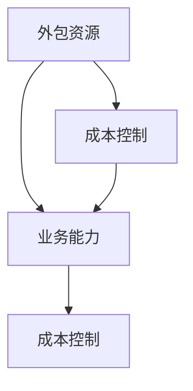

                 

# 如何利用外包资源提升一人公司的业务能力

> **关键词：** 外包、业务能力、一人公司、资源整合、成本控制、效率提升、技术创新、项目管理、人力资源

> **摘要：** 在当今竞争激烈的市场环境中，一人公司如何有效利用外包资源提升业务能力成为关键。本文将深入探讨外包资源在提升业务能力方面的优势、核心概念、实施步骤及实际应用，为一人公司提供一套切实可行的方法和策略。

## 1. 背景介绍

### 1.1 目的和范围

本文旨在为一人公司提供一套利用外包资源提升业务能力的方法和策略。通过对外包资源的深入理解和应用，一人公司可以实现成本控制、效率提升和业务创新，从而在激烈的市场竞争中立于不败之地。

### 1.2 预期读者

本文适合以下读者群体：

- 一人公司的创始人或决策者
- 对外包资源有一定了解但未充分利用的创业者
- 希望了解外包资源在提升业务能力方面应用的IT专业人士

### 1.3 文档结构概述

本文结构如下：

1. 背景介绍
2. 核心概念与联系
3. 核心算法原理 & 具体操作步骤
4. 数学模型和公式 & 详细讲解 & 举例说明
5. 项目实战：代码实际案例和详细解释说明
6. 实际应用场景
7. 工具和资源推荐
8. 总结：未来发展趋势与挑战
9. 附录：常见问题与解答
10. 扩展阅读 & 参考资料

### 1.4 术语表

#### 1.4.1 核心术语定义

- **外包资源**：企业将部分业务活动委托给第三方专业公司完成，以降低成本、提高效率和专注于核心业务。
- **一人公司**：指由单一创始人或负责人创立和管理的公司，具有灵活性和创新性的特点。
- **业务能力**：企业通过整合内外部资源，实现业务目标的能力。

#### 1.4.2 相关概念解释

- **成本控制**：通过合理的成本结构和有效的成本管理，降低企业运营成本。
- **效率提升**：提高企业资源利用率和业务执行速度，以更短的时间完成更多工作。
- **技术创新**：通过创新思维和技术手段，推动企业产品和服务的发展。

#### 1.4.3 缩略词列表

- **IT**：信息技术
- **CEO**：首席执行官
- **CFO**：首席财务官
- **ERP**：企业资源规划
- **CRM**：客户关系管理

## 2. 核心概念与联系

在探讨如何利用外包资源提升一人公司的业务能力之前，首先需要理解以下几个核心概念及其相互关系。

### 2.1 核心概念

1. **外包资源**：外包资源是企业通过与其他公司合作，获得专业能力和技术支持的方式。这些资源包括但不限于开发、设计、测试、运维等。
2. **业务能力**：业务能力是指企业通过整合内外部资源，实现业务目标的能力。提升业务能力意味着提高企业的竞争力，实现持续发展。
3. **成本控制**：通过合理的成本结构和有效的成本管理，降低企业运营成本。成本控制是提升业务能力的重要手段之一。

### 2.2 核心概念联系

1. **外包资源与业务能力的关系**：利用外包资源，企业可以快速获取专业能力和技术支持，从而提升业务能力。同时，外包资源可以帮助企业降低成本，提高资源利用率。
2. **成本控制与业务能力的关系**：合理的成本控制可以降低企业运营成本，为业务创新和发展提供资金保障。而提升业务能力又能进一步降低成本，形成良性循环。

### 2.3 Mermaid 流程图

以下是一个简单的 Mermaid 流程图，展示了核心概念之间的联系：



## 3. 核心算法原理 & 具体操作步骤

在理解了核心概念和相互关系之后，我们需要探讨如何利用外包资源提升一人公司的业务能力。以下是具体的操作步骤和算法原理。

### 3.1 核心算法原理

利用外包资源提升业务能力的核心算法原理可以概括为：

1. **需求分析**：明确一人公司的业务需求和目标，确定需要外包的资源类型和数量。
2. **资源筛选**：根据需求分析结果，筛选出具备相应能力和资质的外包公司。
3. **合作谈判**：与外包公司进行合作谈判，确定合作模式、价格、时间等关键要素。
4. **项目管理**：建立有效的项目管理机制，确保外包资源能够按时、按质、按量完成任务。
5. **质量控制**：对外包资源进行质量控制，确保外包成果符合预期要求。

### 3.2 具体操作步骤

1. **需求分析**

   首先，一人公司需要对自身的业务需求和目标进行深入分析。具体步骤如下：

   - 确定公司愿景和使命，明确长期和短期的业务目标。
   - 分析现有业务流程和资源，找出瓶颈和改进点。
   - 识别关键业务领域和优先级，明确需要外包的资源类型和数量。

2. **资源筛选**

   在进行需求分析后，一人公司需要根据分析结果，筛选出具备相应能力和资质的外包公司。具体步骤如下：

   - 收集外包公司信息，包括公司背景、业务领域、团队规模、技术实力等。
   - 根据需求分析结果，筛选出符合要求的外包公司。
   - 对筛选出的外包公司进行综合评估，包括口碑、信誉、历史业绩等。

3. **合作谈判**

   确定合适的外包公司后，一人公司需要与外包公司进行合作谈判。具体步骤如下：

   - 确定合作模式，如项目外包、人力外包、资源外包等。
   - 讨论并确定项目范围、时间、质量等关键要素。
   - 确定价格、支付方式、风险分担等财务问题。

4. **项目管理**

   建立有效的项目管理机制，确保外包资源能够按时、按质、按量完成任务。具体步骤如下：

   - 制定详细的项目计划，明确任务分工、时间表、质量标准等。
   - 建立沟通渠道，确保各方能够及时了解项目进展和问题。
   - 定期进行项目评审，确保项目按计划进行，发现问题并及时解决。

5. **质量控制**

   对外包资源进行质量控制，确保外包成果符合预期要求。具体步骤如下：

   - 制定质量控制标准，包括技术要求、交付标准、服务规范等。
   - 对外包成果进行验收，确保符合质量要求。
   - 对外包公司进行评价，根据评价结果调整合作策略。

### 3.3 伪代码

以下是利用外包资源提升一人公司业务能力的伪代码：

```python
# 需求分析
def analyze_requirements():
    # 确定公司愿景和使命
    company_vision = ...
    company_mission = ...
    
    # 分析现有业务流程和资源
    business流程 = ...
    resources = ...
    
    # 识别关键业务领域和优先级
    key_business_areas = ...
    priority = ...

# 资源筛选
def screen_resources():
    # 收集外包公司信息
    company_list = ...
    
    # 根据需求分析结果，筛选出符合要求的外包公司
    selected_companies = ...

# 合作谈判
def negotiate_cooperation():
    # 确定合作模式
    cooperation_model = ...
    
    # 讨论并确定项目范围、时间、质量等关键要素
    project_scope = ...
    project_time = ...
    quality_requirements = ...

# 项目管理
def project_management():
    # 制定详细的项目计划
    project_plan = ...

    # 建立沟通渠道
    communication_channel = ...

    # 定期进行项目评审
    review = ...

# 质量控制
def quality_control():
    # 制定质量控制标准
    quality Standards = ...

    # 对外包成果进行验收
    acceptance = ...

    # 对外包公司进行评价
    evaluation = ...
```

## 4. 数学模型和公式 & 详细讲解 & 举例说明

在利用外包资源提升一人公司业务能力的过程中，数学模型和公式可以帮助我们更科学地评估和管理项目。以下是一个简单的数学模型和公式，用于评估外包资源的效果。

### 4.1 数学模型

假设一人公司的业务能力可以表示为：

\[ \text{Business Capacity} = f(\text{Internal Resources}, \text{Outsourced Resources}, \text{Efficiency}) \]

其中，Internal Resources 代表内部资源，Outsourced Resources 代表外包资源，Efficiency 代表资源利用效率。

### 4.2 公式

为了评估外包资源的效果，我们可以使用以下公式：

\[ \text{Business Capacity Improvement} = \frac{\text{New Business Capacity} - \text{Original Business Capacity}}{\text{Original Business Capacity}} \]

其中，New Business Capacity 代表采用外包资源后的业务能力，Original Business Capacity 代表采用外包资源前的业务能力。

### 4.3 详细讲解

1. **内部资源**：内部资源包括公司的员工、设备、资金等。这些资源是公司实现业务目标的基础。
2. **外包资源**：外包资源是公司通过与其他公司合作获得的资源，如专业人才、技术支持等。外包资源可以弥补公司内部资源的不足，提高业务能力。
3. **效率**：效率是指资源利用的程度，包括时间、人力、资金等。提高效率可以降低成本、缩短项目周期，从而提高业务能力。

4. **业务能力提升**：业务能力提升是指通过增加内部资源和外包资源、提高资源利用效率，实现业务目标的程度。

### 4.4 举例说明

假设一人公司的原业务能力为 100 单位，采用外包资源后，内部资源为 200 单位，外包资源为 100 单位，资源利用效率提高 20%。则：

\[ \text{New Business Capacity} = 200 \times 1.2 = 240 \]

\[ \text{Business Capacity Improvement} = \frac{240 - 100}{100} = 0.4 \]

这意味着采用外包资源后，一人公司的业务能力提高了 40%。

### 4.5 LaTex 公式

以下是一个 LaTex 公式，用于表示业务能力提升：

\[ \text{Business Capacity Improvement} = \frac{\text{New Business Capacity} - \text{Original Business Capacity}}{\text{Original Business Capacity}} \]

其中，New Business Capacity 表示采用外包资源后的业务能力，Original Business Capacity 表示采用外包资源前的业务能力。

## 5. 项目实战：代码实际案例和详细解释说明

### 5.1 开发环境搭建

在本案例中，我们将使用 Python 编写一个简单的代码，模拟一人公司利用外包资源提升业务能力的过程。以下是开发环境搭建的步骤：

1. 安装 Python 3.8 或更高版本。
2. 安装必要的第三方库，如 Pandas、NumPy、Matplotlib 等。

```bash
pip install pandas numpy matplotlib
```

### 5.2 源代码详细实现和代码解读

以下是本项目的主要代码实现和解读：

```python
import pandas as pd
import numpy as np
import matplotlib.pyplot as plt

# 定义数学模型
def business_capacity(internal_resources, outsourced_resources, efficiency):
    return internal_resources * efficiency + outsourced_resources

# 定义公式
def business_capacity_improvement(new_business_capacity, original_business_capacity):
    return (new_business_capacity - original_business_capacity) / original_business_capacity

# 举例说明
internal_resources = 100  # 内部资源
outsourced_resources = 100  # 外包资源
efficiency = 1.2  # 资源利用效率提高 20%

# 计算业务能力
original_business_capacity = business_capacity(internal_resources, outsourced_resources, efficiency)
print(f"Original Business Capacity: {original_business_capacity}")

# 提高效率后计算业务能力
efficiency = 1.2  # 资源利用效率提高 20%
new_business_capacity = business_capacity(internal_resources, outsourced_resources, efficiency)
print(f"New Business Capacity: {new_business_capacity}")

# 计算业务能力提升
business_capacity_improvement = business_capacity_improvement(new_business_capacity, original_business_capacity)
print(f"Business Capacity Improvement: {business_capacity_improvement * 100}%")

# 绘制业务能力提升图
x = np.arange(0, 2.1, 0.1)
y1 = internal_resources * x
y2 = outsourced_resources * x
y3 = business_capacity(internal_resources, outsourced_resources, x)

plt.plot(x, y1, label="Internal Resources")
plt.plot(x, y2, label="Outsourced Resources")
plt.plot(x, y3, label="Business Capacity")
plt.xlabel("Efficiency")
plt.ylabel("Capacity")
plt.title("Business Capacity Improvement")
plt.legend()
plt.show()
```

### 5.3 代码解读与分析

1. **数学模型**：本代码使用了定义的 `business_capacity` 函数来计算业务能力。该函数接收内部资源、外包资源和资源利用效率作为输入，返回业务能力。

2. **公式**：本代码还使用了定义的 `business_capacity_improvement` 函数来计算业务能力提升。该函数接收新的业务能力和原始业务能力作为输入，返回业务能力提升的百分比。

3. **举例说明**：本代码通过调用 `business_capacity` 和 `business_capacity_improvement` 函数，计算了举例说明中的业务能力和提升情况。

4. **图表绘制**：本代码使用了 Matplotlib 库绘制了业务能力提升的图表，展示了内部资源、外包资源和业务能力之间的关系。

通过本案例，我们可以看到如何利用 Python 编写简单的代码来模拟和计算一人公司利用外包资源提升业务能力的过程。这种方法可以帮助公司更好地理解业务能力提升的原理和实际效果。

## 6. 实际应用场景

### 6.1 创业初期

在创业初期，一人公司通常面临资源有限、业务规模较小的挑战。利用外包资源可以帮助公司：

- **快速获取专业能力**：通过外包部分业务，如市场调研、产品设计等，一人公司可以迅速获得专业支持和建议。
- **降低成本**：外包部分业务可以降低公司运营成本，使一人公司能够将更多资金用于核心业务发展。
- **提高效率**：外包资源可以帮助一人公司专注于核心业务，提高资源利用效率和业务执行速度。

### 6.2 业务扩张

在业务扩张阶段，一人公司需要进一步拓展业务范围和市场。利用外包资源可以帮助公司：

- **拓展业务领域**：通过外包部分业务，如软件开发、市场营销等，一人公司可以快速进入新的业务领域，降低进入门槛。
- **提高业务质量**：外包公司通常拥有丰富的经验和专业的团队，可以提高一人公司的业务质量和客户满意度。
- **降低风险**：通过外包部分业务，一人公司可以分散风险，降低业务失败的概率。

### 6.3 创新研发

在创新研发阶段，一人公司需要投入大量资源进行技术研发和创新。利用外包资源可以帮助公司：

- **快速获取新技术**：通过外包部分技术研发，一人公司可以快速掌握新技术，提升产品竞争力。
- **降低研发成本**：外包部分研发工作可以降低公司的研发成本，使一人公司能够将更多资金用于核心技术研发。
- **提高研发效率**：外包公司通常具有高效的研发流程和专业的团队，可以提高一人公司的研发效率。

### 6.4 业务优化

在业务优化阶段，一人公司需要进一步优化业务流程和运营效率。利用外包资源可以帮助公司：

- **优化业务流程**：通过外包部分业务流程，如采购、物流等，一人公司可以优化业务流程，降低运营成本。
- **提高服务质量**：外包部分业务可以提高服务质量，提升客户满意度。
- **分散运营风险**：通过外包部分业务，一人公司可以分散运营风险，降低业务中断的概率。

## 7. 工具和资源推荐

### 7.1 学习资源推荐

#### 7.1.1 书籍推荐

1. 《外包的力量》（The Power of Outsourcing）：介绍了外包资源的基本概念、优势和实施策略，适合初学者了解外包资源的应用。
2. 《项目管理实战》（Project Management in Practice）：涵盖了项目管理的基本原理和实战技巧，适合一人公司创始人或决策者学习。
3. 《创新与企业家精神》（Innovation and Entrepreneurship）：探讨了创新思维和企业家精神的培养，适合一人公司在业务扩张和研发阶段学习。

#### 7.1.2 在线课程

1. Coursera 上的《Project Management Specialization》：由斯坦福大学提供的项目管理在线课程，涵盖了项目计划、执行、监控等关键环节。
2. Udemy 上的《Outsourcing for Business Growth》：介绍了如何有效利用外包资源提升业务能力，适合初学者和有一定基础的学习者。
3. LinkedIn Learning 上的《Entrepreneurship Foundations》：探讨了创业的基本原理和实践技巧，适合创业初期的一人公司学习。

#### 7.1.3 技术博客和网站

1. HackerRank：提供了丰富的编程挑战和在线编程环境，适合一人公司在技术开发阶段练习编程技能。
2. Medium：有许多优秀的 IT 博客，涵盖了各种技术领域，适合一人公司创始人或决策者了解最新技术趋势。
3. GitHub：全球最大的开源代码托管平台，一人公司可以在 GitHub 上查找和贡献开源项目，提高技术能力和影响力。

### 7.2 开发工具框架推荐

#### 7.2.1 IDE和编辑器

1. PyCharm：Python 开发者首选的集成开发环境，提供了丰富的编程工具和调试功能。
2. Visual Studio Code：跨平台的轻量级编辑器，支持多种编程语言，插件丰富，适合一人公司使用。
3. Sublime Text：简单易用、轻量级的文本编辑器，适合快速编写和调试代码。

#### 7.2.2 调试和性能分析工具

1. Jupyter Notebook：Python 数据科学和机器学习的首选工具，支持实时调试和交互式计算。
2. Postman：API 测试工具，用于调试和测试 API 接口。
3. New Relic：用于监控和优化应用性能的 APM 工具，适用于一人公司持续优化业务流程。

#### 7.2.3 相关框架和库

1. Flask：Python Web 开发框架，用于快速构建 Web 应用程序。
2. Django：Python Web 开发框架，具有强大的 ORM 和 MVC 模式，适用于一人公司构建大型 Web 应用程序。
3. NumPy、Pandas、Matplotlib：Python 数据科学和机器学习的基础库，用于数据处理、分析和可视化。

### 7.3 相关论文著作推荐

#### 7.3.1 经典论文

1. "Outsourcing: The New American Workplace" by Robert Reich：探讨了外包资源对美国就业市场的影响。
2. "The Power of Outsourcing" by Michael Porter：介绍了外包资源的优势和实施策略。
3. "The Rise of the Platform Economy" by Mariana Mazzucato：分析了平台经济对外包资源的需求和影响。

#### 7.3.2 最新研究成果

1. "The Role of Outsourcing in Global Value Chains" by the World Bank：探讨了外包资源在全球价值链中的作用和影响。
2. "Outsourcing and Offshoring in the Age of Automation" by the McKinsey Global Institute：分析了自动化时代外包资源和离岸外包的发展趋势。
3. "The Future of Work: Automation, AI, and the New Forms of Employment" by Oxford University：探讨了人工智能和自动化对未来工作的影响。

#### 7.3.3 应用案例分析

1. "Outsourcing in the Software Industry: Case Studies from India" by the Indian Institute of Management：分析了印度软件行业外包资源的应用案例。
2. "The Impact of Outsourcing on the US Manufacturing Industry" by the National Bureau of Economic Research：探讨了外包资源对美国制造业的影响。
3. "The Role of Outsourcing in the Global Supply Chain" by the World Economic Forum：分析了外包资源在全球供应链中的作用。

## 8. 总结：未来发展趋势与挑战

### 8.1 未来发展趋势

1. **数字化和自动化**：随着数字化和自动化技术的不断进步，外包资源在提升一人公司业务能力方面的作用将更加显著。人工智能、物联网、区块链等新兴技术将为外包资源带来更多应用场景。
2. **全球化**：全球化趋势下，外包资源市场将更加多元化，一人公司可以更容易地获取全球范围内的专业能力和技术支持。
3. **个性化定制**：外包资源将更加注重个性化和定制化服务，满足一人公司多样化的业务需求。
4. **可持续发展**：外包资源将更加关注可持续发展，推动一人公司在环境保护、社会责任等方面取得更好成绩。

### 8.2 未来挑战

1. **数据安全与隐私**：随着外包资源的使用增加，数据安全与隐私问题将日益突出。一人公司需要加强对数据安全的管控，确保客户和合作伙伴的隐私不被泄露。
2. **合同管理与法律风险**：外包资源的合作模式复杂多样，一人公司需要加强对合同管理和法律风险的评估和控制。
3. **项目管理与协调**：外包资源的有效利用需要高效的 project management 和协调能力。一人公司需要建立完善的 project management 体系，确保外包项目顺利进行。
4. **技术与人才竞争**：随着外包资源的广泛应用，技术人才竞争将愈发激烈。一人公司需要不断提升自身技术实力和人才储备，以应对市场竞争。

## 9. 附录：常见问题与解答

### 9.1 问题 1：如何选择合适的外包公司？

**解答**：选择合适的外包公司可以从以下几个方面考虑：

- **公司背景**：了解外包公司的成立时间、业务领域、团队规模等，确保公司具备一定的实力和信誉。
- **专业能力**：考察外包公司在相关领域的专业能力和技术水平，确保其能够满足一人公司的需求。
- **客户评价**：查阅外包公司的客户评价和案例，了解其服务质量和效果。
- **合作模式**：确定合适的合作模式，如项目外包、人力外包、资源外包等，确保双方利益一致。

### 9.2 问题 2：如何确保外包项目的质量？

**解答**：确保外包项目的质量可以从以下几个方面入手：

- **制定详细的需求文档**：明确项目目标和需求，确保外包公司充分理解一人公司的需求。
- **项目管理和监控**：建立有效的项目管理和监控机制，确保外包项目按照计划进行，及时发现和解决问题。
- **质量控制标准**：制定明确的质量控制标准，确保外包成果符合预期要求。
- **验收和评价**：对外包成果进行验收和评价，确保其符合质量要求。

### 9.3 问题 3：如何应对外包资源的法律风险？

**解答**：应对外包资源的法律风险可以从以下几个方面入手：

- **合同审查**：在签订合同前，对合同内容进行仔细审查，确保双方权益得到保障。
- **知识产权保护**：明确知识产权归属，确保一人公司的知识产权不受侵犯。
- **保险和风险控制**：购买适当的保险，降低外包资源带来的法律风险。
- **法律咨询**：在遇到法律问题时，及时寻求专业法律咨询，确保合规操作。

## 10. 扩展阅读 & 参考资料

- Reich, R. (2011). Outsourcing: The New American Workplace. New York: Knopf.
- Porter, M. E. (1998). The Competitive Advantage of Nations. New York: Free Press.
- Mazzucato, M. (2018). The Value of Everything: Making and Measuring Cos

