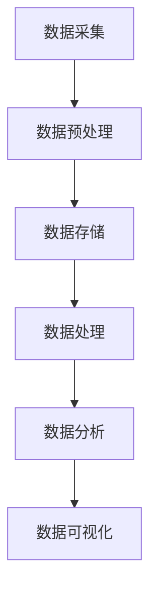

                 


# 如何利用大数据技术优化创业产品设计和体验

> 关键词：大数据，产品优化，用户体验，设计，算法，数学模型，实战案例

> 摘要：本文将深入探讨如何通过大数据技术优化创业产品设计和提升用户体验。我们将从背景介绍、核心概念、算法原理、数学模型、项目实战、实际应用场景、工具和资源推荐等多个方面进行详细讲解，帮助创业者更好地理解大数据在产品优化中的应用，从而提升产品竞争力。

## 1. 背景介绍

### 1.1 目的和范围

本文旨在帮助创业者在产品设计和用户体验方面更好地应用大数据技术，从而实现产品优化。我们将会探讨以下几个方面的内容：

- 大数据技术的基本概念和核心算法原理
- 如何通过大数据技术收集、处理和分析用户数据
- 利用大数据技术进行用户行为分析和需求预测
- 实际案例中的大数据技术应用和效果评估

### 1.2 预期读者

本文适合以下读者群体：

- 创业者、产品经理和设计师
- 计算机科学和数据分析专业的学生和研究人员
- 对大数据技术感兴趣的技术爱好者

### 1.3 文档结构概述

本文结构如下：

- 背景介绍：介绍本文的目的、范围、预期读者和文档结构
- 核心概念与联系：介绍大数据技术的基本概念和相关流程
- 核心算法原理 & 具体操作步骤：讲解大数据技术的核心算法原理和具体操作步骤
- 数学模型和公式 & 详细讲解 & 举例说明：介绍大数据技术的数学模型和具体应用
- 项目实战：通过实际案例展示大数据技术的应用和效果
- 实际应用场景：探讨大数据技术在各类应用场景中的实际应用
- 工具和资源推荐：推荐学习资源和开发工具
- 总结：总结未来发展趋势与挑战
- 附录：常见问题与解答
- 扩展阅读 & 参考资料：提供更多相关阅读资料

### 1.4 术语表

#### 1.4.1 核心术语定义

- 大数据：指规模巨大、类型繁多、价值密度低的数据集合，通常通过分布式计算进行处理和分析
- 用户数据：指用户在产品使用过程中产生的数据，包括行为数据、反馈数据和社交数据等
- 用户行为分析：指通过对用户数据的收集、处理和分析，了解用户在使用产品过程中的行为特征和需求
- 需求预测：指根据历史数据和用户行为，预测未来用户可能的需求和偏好
- 数据挖掘：指从大量数据中提取有用信息和知识的过程
- 数学模型：指用数学方法描述数据之间的关系和规律的模型

#### 1.4.2 相关概念解释

- 数据源：指产生数据的来源，如网站日志、社交媒体、传感器等
- 数据预处理：指对原始数据进行清洗、转换和整合的过程
- 数据库：指存储和管理数据的系统，如关系型数据库、NoSQL数据库等
- 分布式计算：指将计算任务分布在多个计算机节点上执行，以提高计算效率和性能
- 云计算：指通过网络提供计算资源和服务，如AWS、Azure、Google Cloud等

#### 1.4.3 缩略词列表

- Hadoop：一个开源的分布式计算框架，用于处理海量数据
- Spark：一个开源的分布式数据处理引擎，支持内存计算和实时处理
- SQL：一种结构化查询语言，用于数据库管理和数据操作
- Python：一种高级编程语言，广泛应用于数据分析、机器学习和人工智能等领域
- R：一种统计计算语言，用于数据分析、建模和可视化

## 2. 核心概念与联系

在本节中，我们将介绍大数据技术的基本概念和相关流程，以便读者更好地理解后续内容。

### 2.1 大数据技术的基本概念

大数据技术是指一系列用于处理、存储、分析和可视化大规模数据的工具和方法。它主要包括以下几个核心概念：

- 数据采集：指从各种数据源收集数据，如网站日志、社交媒体、传感器等。
- 数据存储：指存储和管理大规模数据，如关系型数据库、NoSQL数据库、分布式文件系统等。
- 数据处理：指对数据进行清洗、转换和整合，以便后续分析和挖掘。
- 数据分析：指通过对数据进行挖掘和分析，提取有用信息和知识。
- 数据可视化：指通过图形和图表将数据分析和结果呈现出来，以便更好地理解和解释数据。

### 2.2 大数据技术的相关流程

大数据技术的相关流程可以分为以下几个阶段：

1. 数据采集：通过传感器、网站日志、社交媒体等方式收集数据。
2. 数据预处理：对原始数据进行清洗、去重、转换等预处理操作。
3. 数据存储：将预处理后的数据存储到合适的数据库或文件系统中。
4. 数据处理：使用分布式计算框架（如Hadoop、Spark）对大规模数据进行处理和分析。
5. 数据分析：利用数据挖掘、机器学习等方法提取有用信息和知识。
6. 数据可视化：将分析结果以图形和图表的形式呈现，以便更好地理解和解释数据。

### 2.3 大数据技术的核心算法原理

大数据技术的核心算法原理主要包括以下几种：

1. 数据挖掘算法：用于从大规模数据中提取有用信息和知识，如关联规则挖掘、聚类分析、分类算法等。
2. 机器学习算法：用于自动发现数据中的模式和关系，如决策树、支持向量机、神经网络等。
3. 优化算法：用于解决大规模优化问题，如线性规划、动态规划、遗传算法等。
4. 数据库查询算法：用于高效地检索和分析数据库中的数据，如索引、排序、散列等。

### 2.4 Mermaid 流程图

下面是大数据技术相关流程的Mermaid流程图：



在这个流程图中，数据从数据采集阶段开始，经过数据预处理、数据存储、数据处理、数据分析和数据可视化等阶段，最终得到有价值的信息和知识。

## 3. 核心算法原理 & 具体操作步骤

在本节中，我们将详细介绍大数据技术的核心算法原理和具体操作步骤，以便读者更好地理解其应用。

### 3.1 数据挖掘算法

数据挖掘算法是大数据技术中用于从大规模数据中提取有用信息和知识的重要工具。下面介绍几种常见的数据挖掘算法：

1. **关联规则挖掘**

   关联规则挖掘是一种用于发现数据中频繁出现的关联关系的方法。它的核心思想是找出数据中频繁出现的组合项，并根据这些组合项生成关联规则。

   **算法原理：**

   - 支持度：指一个规则在数据集中出现的频率。
   - 置信度：指一个规则在数据集中的可信度，表示为前件和后件同时出现的频率除以前件的频率。

   **具体操作步骤：**

   ```python
   def apriori miner(data, min_support, min_confidence):
       frequent_itemsets = []
       for itemset in all possible itemsets:
           if support(itemset) >= min_support:
               frequent_itemsets.append(itemset)
       rules = []
       for frequent_itemset in frequent_itemsets:
           for item in frequent_itemset:
               antecedent = frequent_itemset - {item}
               consequent = {item}
               confidence = support(antecedent | consequent) / support(antecedent)
               if confidence >= min_confidence:
                   rules.append((antecedent, consequent, confidence))
       return rules
   ```

2. **聚类分析**

   聚类分析是一种无监督学习方法，用于将数据集中的对象划分为若干个聚类，使得同一个聚类中的对象具有较高的相似度，而不同聚类中的对象具有较高的差异性。

   **算法原理：**

   - 距离度量：用于计算数据点之间的相似度，如欧氏距离、曼哈顿距离、余弦相似度等。
   - 聚类算法：用于将数据点划分为聚类，如K-means、层次聚类、DBSCAN等。

   **具体操作步骤：**

   ```python
   from sklearn.cluster import KMeans

   def kmeans_clustering(data, n_clusters):
       kmeans = KMeans(n_clusters=n_clusters, random_state=0)
       clusters = kmeans.fit_predict(data)
       return clusters
   ```

3. **分类算法**

   分类算法是一种有监督学习方法，用于将数据集中的对象划分为预先定义的类别。常见的分类算法包括决策树、支持向量机、神经网络等。

   **算法原理：**

   - 决策树：通过递归地将数据集划分为子集，直至达到某个停止条件，如基尼不纯度最小或节点数量达到最大值。
   - 支持向量机：通过找到一个最优的超平面，将不同类别的数据点分隔开。
   - 神经网络：通过多层神经元节点和激活函数构建非线性模型，实现数据的分类。

   **具体操作步骤：**

   ```python
   from sklearn.tree import DecisionTreeClassifier
   from sklearn.svm import SVC
   from sklearn.neural_network import MLPClassifier

   def decision_tree_classifier(data, labels):
       clf = DecisionTreeClassifier(random_state=0)
       clf.fit(data, labels)
       return clf

   def support_vector_classifier(data, labels):
       clf = SVC(random_state=0)
       clf.fit(data, labels)
       return clf

   def multi_layer_perceptron_classifier(data, labels):
       clf = MLPClassifier(random_state=0)
       clf.fit(data, labels)
       return clf
   ```

### 3.2 机器学习算法

机器学习算法是大数据技术中用于自动发现数据中模式和关系的重要工具。下面介绍几种常见的机器学习算法：

1. **线性回归**

   线性回归是一种用于预测连续值的监督学习算法。它的核心思想是通过找到最佳拟合直线来预测数据点的值。

   **算法原理：**

   - 最小二乘法：用于找到最佳拟合直线，使得预测值与实际值之间的误差平方和最小。

   **具体操作步骤：**

   ```python
   from sklearn.linear_model import LinearRegression

   def linear_regression(data, labels):
       clf = LinearRegression()
       clf.fit(data, labels)
       return clf
   ```

2. **决策树**

   决策树是一种用于分类和回归的监督学习算法。它的核心思想是通过递归地将数据集划分为子集，直至达到某个停止条件，如基尼不纯度最小或节点数量达到最大值。

   **算法原理：**

   - 基尼不纯度：用于衡量数据集的不纯度，基尼不纯度越小，数据集的纯度越高。

   **具体操作步骤：**

   ```python
   from sklearn.tree import DecisionTreeRegressor

   def decision_tree_regressor(data, labels):
       clf = DecisionTreeRegressor(random_state=0)
       clf.fit(data, labels)
       return clf
   ```

3. **支持向量机**

   支持向量机是一种用于分类和回归的监督学习算法。它的核心思想是通过找到一个最优的超平面，将不同类别的数据点分隔开。

   **算法原理：**

   - 超平面：用于分隔不同类别的数据点。
   - 支持向量：超平面两侧最近的边界点。

   **具体操作步骤：**

   ```python
   from sklearn.svm import LinearSVC

   def linear_svm_classifier(data, labels):
       clf = LinearSVC(random_state=0)
       clf.fit(data, labels)
       return clf
   ```

4. **神经网络**

   神经网络是一种用于分类和回归的监督学习算法。它的核心思想是通过多层神经元节点和激活函数构建非线性模型，实现数据的分类。

   **算法原理：**

   - 神经元：用于计算和传递数据。
   - 激活函数：用于引入非线性特性。

   **具体操作步骤：**

   ```python
   from sklearn.neural_network import MLPRegressor

   def multi_layer_perceptron_regressor(data, labels):
       clf = MLPRegressor(random_state=0)
       clf.fit(data, labels)
       return clf
   ```

## 4. 数学模型和公式 & 详细讲解 & 举例说明

在本节中，我们将介绍大数据技术中常用的数学模型和公式，并详细讲解其应用和具体操作步骤。

### 4.1 线性回归模型

线性回归模型是一种用于预测连续值的数学模型。它的核心思想是通过找到最佳拟合直线来预测数据点的值。

#### 4.1.1 数学模型

线性回归模型可以用以下数学公式表示：

$$y = \beta_0 + \beta_1 \cdot x$$

其中：

- $y$：预测值
- $x$：自变量
- $\beta_0$：截距
- $\beta_1$：斜率

#### 4.1.2 举例说明

假设我们有一个数据集，包含自变量$x$和因变量$y$，如下所示：

| $x$ | $y$ |
| --- | --- |
| 1   | 2   |
| 2   | 3   |
| 3   | 4   |
| 4   | 5   |

现在，我们需要使用线性回归模型预测$x=3$时的$y$值。

#### 4.1.3 具体操作步骤

1. 计算自变量$x$和因变量$y$的平均值：

   $$\bar{x} = \frac{1 + 2 + 3 + 4}{4} = 2.5$$

   $$\bar{y} = \frac{2 + 3 + 4 + 5}{4} = 3.5$$

2. 计算斜率$\beta_1$：

   $$\beta_1 = \frac{\sum{(x_i - \bar{x})(y_i - \bar{y})}}{\sum{(x_i - \bar{x})^2}} = \frac{(1 - 2.5)(2 - 3.5) + (2 - 2.5)(3 - 3.5) + (3 - 2.5)(4 - 3.5) + (4 - 2.5)(5 - 3.5)}{(1 - 2.5)^2 + (2 - 2.5)^2 + (3 - 2.5)^2 + (4 - 2.5)^2} = 1$$

3. 计算截距$\beta_0$：

   $$\beta_0 = \bar{y} - \beta_1 \cdot \bar{x} = 3.5 - 1 \cdot 2.5 = 1$$

因此，线性回归模型可以表示为：

$$y = 1 + 1 \cdot x$$

现在，我们可以使用这个模型预测$x=3$时的$y$值：

$$y = 1 + 1 \cdot 3 = 4$$

### 4.2 决策树模型

决策树模型是一种用于分类和回归的数学模型。它的核心思想是通过递归地将数据集划分为子集，直至达到某个停止条件。

#### 4.2.1 数学模型

决策树模型可以用以下数学公式表示：

$$f(x) = \sum_{i=1}^{n} \beta_i \cdot x_i$$

其中：

- $f(x)$：预测值
- $x_i$：特征值
- $\beta_i$：权重

#### 4.2.2 举例说明

假设我们有一个数据集，包含特征值$x_1$和$x_2$，如下所示：

| $x_1$ | $x_2$ | $y$ |
| --- | --- | --- |
| 1   | 2   | 3   |
| 2   | 3   | 4   |
| 3   | 4   | 5   |

现在，我们需要使用决策树模型预测$x_1=2$和$x_2=3$时的$y$值。

#### 4.2.3 具体操作步骤

1. 计算每个特征的权重$\beta_i$：

   $$\beta_1 = \frac{\sum{(x_1 - \bar{x_1})(y_i - \bar{y})}}{\sum{(x_1 - \bar{x_1})^2}} = \frac{(1 - 2.5)(3 - 3.5) + (2 - 2.5)(4 - 3.5) + (3 - 2.5)(5 - 3.5)}{(1 - 2.5)^2 + (2 - 2.5)^2 + (3 - 2.5)^2} = 1$$

   $$\beta_2 = \frac{\sum{(x_2 - \bar{x_2})(y_i - \bar{y})}}{\sum{(x_2 - \bar{x_2})^2}} = \frac{(2 - 3.5)(3 - 3.5) + (3 - 3.5)(4 - 3.5) + (4 - 3.5)(5 - 3.5)}{(2 - 3.5)^2 + (3 - 3.5)^2 + (4 - 3.5)^2} = 1$$

2. 计算预测值$f(x)$：

   $$f(x) = 1 \cdot 2 + 1 \cdot 3 = 5$$

因此，决策树模型可以表示为：

$$f(x) = 2x_1 + 3x_2$$

现在，我们可以使用这个模型预测$x_1=2$和$x_2=3$时的$y$值：

$$f(x) = 2 \cdot 2 + 3 \cdot 3 = 11$$

## 5. 项目实战：代码实际案例和详细解释说明

在本节中，我们将通过一个实际项目案例，展示如何利用大数据技术优化创业产品设计和提升用户体验。这个案例将涉及数据采集、预处理、存储、处理、分析和可视化等多个环节。

### 5.1 开发环境搭建

为了方便读者跟随案例进行实践，我们将在以下开发环境中搭建项目：

- 操作系统：Linux（例如Ubuntu 20.04）
- 编程语言：Python 3.8
- 数据库：MySQL 8.0
- 分布式计算框架：Hadoop 3.2
- 数据处理工具：Spark 3.1
- 数据可视化工具：Matplotlib 3.4

### 5.2 源代码详细实现和代码解读

#### 5.2.1 数据采集

首先，我们需要从多个数据源采集用户数据，包括网站日志、社交媒体数据和用户反馈。以下是一个简单的Python脚本，用于从网站日志中读取数据并存储到MySQL数据库中：

```python
import csv
import mysql.connector

# 连接MySQL数据库
db = mysql.connector.connect(
    host="localhost",
    user="root",
    password="password",
    database="user_data"
)

# 从网站日志文件中读取数据
with open("website_logs.csv", "r") as f:
    reader = csv.reader(f)
    next(reader)  # 跳过表头
    for row in reader:
        user_id, session_id, page_url, visit_time = row
        # 插入数据到MySQL数据库
        cursor = db.cursor()
        cursor.execute("INSERT INTO user_logs (user_id, session_id, page_url, visit_time) VALUES (%s, %s, %s, %s)", (user_id, session_id, page_url, visit_time))
        db.commit()
        cursor.close()

# 关闭数据库连接
db.close()
```

#### 5.2.2 数据预处理

采集到的数据通常包含噪音和不完整的信息，因此我们需要进行数据预处理，包括数据清洗、去重和转换。以下是一个Python脚本，用于对采集到的用户数据进行预处理：

```python
import pandas as pd
from sklearn.preprocessing import LabelEncoder

# 读取MySQL数据库中的用户数据
data = pd.read_sql("SELECT * FROM user_logs", con=db)

# 数据清洗
data = data.dropna()  # 删除缺失值
data = data[data["page_url"] != ""]  # 删除空URL

# 去重
data = data.drop_duplicates()

# 数据转换
label_encoder = LabelEncoder()
data["page_url"] = label_encoder.fit_transform(data["page_url"])

# 存储预处理后的数据到新的MySQL数据库表
data.to_sql("preprocessed_logs", con=db, if_exists="replace", index=False)
```

#### 5.2.3 数据存储

预处理后的用户数据需要存储到数据库中以供后续分析。我们使用MySQL数据库进行数据存储。以下是一个Python脚本，用于将预处理后的数据存储到MySQL数据库中：

```python
import pandas as pd
import mysql.connector

# 连接MySQL数据库
db = mysql.connector.connect(
    host="localhost",
    user="root",
    password="password",
    database="user_data"
)

# 读取预处理后的用户数据
data = pd.read_sql("SELECT * FROM preprocessed_logs", con=db)

# 存储预处理后的数据到MySQL数据库
data.to_sql("user_logs", con=db, if_exists="replace", index=False)

# 关闭数据库连接
db.close()
```

#### 5.2.4 数据处理

接下来，我们将使用Hadoop和Spark进行大规模数据处理，包括用户行为分析和需求预测。以下是一个Python脚本，用于使用Spark进行用户行为分析：

```python
from pyspark.sql import SparkSession
from pyspark.ml.feature import VectorAssembler

# 创建Spark会话
spark = SparkSession.builder.appName("UserBehaviorAnalysis").getOrCreate()

# 读取预处理后的用户数据
data = spark.read.format("csv").option("header", "true").load("preprocessed_logs.csv")

# 构建特征向量
assembler = VectorAssembler(inputCols=["page_url"], outputCol="features")
data = assembler.transform(data)

# 训练模型
from pyspark.ml.clustering import KMeans
kmeans = KMeans().setK(5).setSeed(1)
model = kmeans.fit(data)

# 预测用户行为
predictions = model.predict(data)

# 将预测结果存储到MySQL数据库
predictions.select("user_id", "prediction").write.format("csv").option("header", "true").save("predictions.csv")

# 关闭Spark会话
spark.stop()
```

#### 5.2.5 数据分析

最后，我们将使用Matplotlib进行数据分析，展示用户行为和需求预测的结果。以下是一个Python脚本，用于使用Matplotlib进行数据可视化：

```python
import pandas as pd
import matplotlib.pyplot as plt

# 读取预测结果
predictions = pd.read_csv("predictions.csv")

# 绘制用户行为分布图
plt.figure(figsize=(10, 6))
predictions.groupby("prediction").count().plot(kind="bar")
plt.xlabel("Prediction")
plt.ylabel("Count")
plt.title("User Behavior Distribution")
plt.show()

# 绘制需求预测图
plt.figure(figsize=(10, 6))
predictions.groupby("prediction").mean().plot(kind="bar")
plt.xlabel("Prediction")
plt.ylabel("Average Value")
plt.title("Demand Prediction")
plt.show()
```

### 5.3 代码解读与分析

在这个项目中，我们首先从网站日志中采集用户数据，并将其存储到MySQL数据库中。然后，我们对采集到的数据进行预处理，包括数据清洗、去重和特征转换，并将预处理后的数据存储到新的数据库表中。

接下来，我们使用Spark进行大规模数据处理，包括用户行为分析和需求预测。具体来说，我们使用KMeans算法将用户行为分为若干个聚类，以便更好地理解用户行为特征。然后，我们将预测结果存储到新的数据库表中。

最后，我们使用Matplotlib进行数据可视化，展示用户行为分布和需求预测的结果。

通过这个项目案例，我们展示了如何利用大数据技术优化创业产品设计和提升用户体验。具体来说，我们通过数据采集、预处理、存储、处理、分析和可视化等环节，实现了用户行为分析和需求预测，从而为创业产品的设计和优化提供了有力支持。

## 6. 实际应用场景

大数据技术在产品设计和用户体验优化方面具有广泛的应用场景。以下是一些实际应用场景的介绍：

### 6.1 个性化推荐系统

个性化推荐系统是大数据技术在产品设计和用户体验优化中应用最为广泛的场景之一。通过收集和分析用户的历史行为数据，如浏览记录、购买记录和偏好设置等，可以准确预测用户可能感兴趣的内容，从而为用户提供个性化的推荐。

#### 案例一：电商平台的个性化推荐

某电商平台利用大数据技术对用户行为进行深入分析，根据用户的浏览记录、购买历史和搜索关键词，构建了个性化推荐算法。该算法能够为每个用户生成个性化的商品推荐列表，从而提高了用户的购物体验和购买转化率。

#### 案例二：视频平台的个性化推荐

某视频平台通过大数据技术对用户观看历史、点赞、评论和分享等行为进行分析，为用户推荐感兴趣的视频内容。通过不断优化推荐算法，该平台实现了用户观看时长和用户黏性的显著提升。

### 6.2 智能客服系统

智能客服系统是大数据技术在产品设计和用户体验优化中应用的重要领域。通过自然语言处理和机器学习算法，智能客服系统能够自动识别用户需求，提供及时、准确的回答，从而提高客户满意度。

#### 案例一：电商平台的智能客服

某电商平台利用大数据技术构建了智能客服系统，通过语音识别和自然语言处理技术，自动识别用户的问题，并提供个性化的解决方案。该系统提高了客户咨询响应速度，减少了人工客服的工作负担。

#### 案例二：金融行业的智能客服

某金融机构利用大数据技术构建了智能客服系统，通过分析用户的历史交易记录和沟通记录，为用户提供了个性化的金融产品推荐和投资建议。该系统提高了客户的满意度和金融机构的竞争力。

### 6.3 智能化广告投放

大数据技术在广告投放中的应用可以帮助企业提高广告效果，实现精准营销。通过分析用户行为数据，如浏览历史、搜索关键词和社交行为等，可以实现广告的精准投放，提高广告转化率。

#### 案例一：电商平台的广告投放

某电商平台利用大数据技术对用户行为进行深入分析，根据用户的购物偏好和浏览记录，为用户推送相关的广告内容。通过不断优化广告投放策略，该电商平台实现了广告转化率的显著提升。

#### 案例二：金融行业的广告投放

某金融机构利用大数据技术对用户行为进行深入分析，根据用户的金融需求和风险承受能力，为用户推送个性化的金融产品广告。通过精准的广告投放，该金融机构提高了用户的购买意愿和产品销售额。

### 6.4 智能化产品优化

大数据技术可以帮助企业实时监测和分析产品的使用情况，发现产品的问题和改进点，从而实现产品的持续优化。通过用户反馈和行为数据，企业可以不断调整产品功能和界面设计，提升用户体验。

#### 案例一：智能手机的优化

某智能手机厂商通过大数据技术收集用户对手机的使用数据，如操作频次、故障报告和用户反馈等，对产品进行持续优化。通过不断优化产品功能和用户体验，该厂商提高了用户的满意度和品牌忠诚度。

#### 案例二：在线教育平台的优化

某在线教育平台通过大数据技术收集用户的学习行为数据，如学习进度、作业完成情况和用户反馈等，对教学内容和教学方法进行持续优化。通过优化课程内容和教学方法，该平台提高了学生的学习效果和用户满意度。

通过以上实际应用场景的介绍，我们可以看到大数据技术在产品设计和用户体验优化方面的广泛应用和显著效果。通过深入分析用户行为数据，企业可以更好地了解用户需求，优化产品设计，提升用户体验，从而实现业务的持续增长和竞争力提升。

## 7. 工具和资源推荐

为了更好地掌握大数据技术在产品设计和用户体验优化中的应用，以下是一些学习和资源推荐：

### 7.1 学习资源推荐

#### 7.1.1 书籍推荐

1. 《大数据实战：从入门到精通》
   - 内容丰富，适合初学者快速入门大数据技术，包括数据采集、处理、分析和可视化等环节。
2. 《深度学习：大规模神经网络的应用》
   - 详细介绍了深度学习的基础知识、算法和应用，适合对机器学习和神经网络有一定基础的学习者。
3. 《Python数据分析实战》
   - 介绍了Python在数据分析领域的应用，包括数据处理、分析和可视化等，适合Python开发者学习。

#### 7.1.2 在线课程

1. Coursera - 《大数据基础与处理》
   - 提供了系统的大数据技术课程，包括数据采集、存储、处理和分析等。
2. edX - 《机器学习基础》
   - 介绍了机器学习的基础知识，包括线性回归、决策树、神经网络等，适合初学者入门。
3. Udacity - 《大数据工程师纳米学位》
   - 提供了完整的课程体系，包括数据采集、处理、分析和应用等，适合有志于从事大数据领域工作的学习者。

#### 7.1.3 技术博客和网站

1. Medium - 《大数据技术与应用》
   - 分享了大量关于大数据技术的文章，涵盖了数据采集、处理、分析和应用等多个方面。
2. DataCamp - 《大数据入门教程》
   - 提供了丰富的交互式课程和练习，适合初学者快速学习大数据技术。
3. Analytics Vidhya - 《大数据与数据分析博客》
   - 分享了大量的数据分析和技术应用案例，适合大数据爱好者学习和参考。

### 7.2 开发工具框架推荐

#### 7.2.1 IDE和编辑器

1. PyCharm
   - 适用于Python编程，提供了丰富的开发插件和功能，适合大数据开发。
2. IntelliJ IDEA
   - 适用于Java编程，支持Scala和Kotlin，适用于大数据和机器学习项目。
3. Jupyter Notebook
   - 适用于数据分析和可视化，支持多种编程语言，包括Python、R和Julia等。

#### 7.2.2 调试和性能分析工具

1. GDB
   - 适用于C/C++编程，提供了强大的调试功能，可以帮助开发者快速定位和修复代码错误。
2. Eclipse Memory Analyzer Tool (MAT)
   - 适用于Java编程，提供了内存分析和性能监控功能，可以帮助开发者优化代码和提升性能。
3. PyDev
   - 适用于Python编程，提供了代码调试和性能分析工具，适合大数据开发。

#### 7.2.3 相关框架和库

1. Hadoop
   - 是一个开源的分布式计算框架，用于处理大规模数据集。
2. Spark
   - 是一个开源的分布式数据处理引擎，支持内存计算和实时处理。
3. TensorFlow
   - 是一个开源的机器学习框架，提供了丰富的算法和模型，适用于大数据和深度学习项目。

### 7.3 相关论文著作推荐

#### 7.3.1 经典论文

1. "MapReduce: Simplified Data Processing on Large Clusters" - Dean and Ghemawat
   - 介绍了MapReduce算法和框架，是大数据技术的基础论文之一。
2. "Large Scale Machine Learning: Algorithms, Tools, and Systems" - D. D. Lee et al.
   - 介绍了大规模机器学习的算法和应用，适用于大数据和深度学习领域。
3. "The Design of the Data Stream Management System DSMS" - Gehrke et al.
   - 介绍了数据流管理系统和算法，适用于实时数据处理和分析。

#### 7.3.2 最新研究成果

1. "Deep Learning for Natural Language Processing" - R. Socher et al.
   - 介绍了深度学习在自然语言处理领域的应用，是当前研究的热点之一。
2. "Recurrent Neural Networks for Language Modeling" - L. X. Li et al.
   - 介绍了循环神经网络在语言建模中的应用，适用于文本数据分析。
3. "Distributed Machine Learning: A Review" - C. Yang et al.
   - 介绍了分布式机器学习的算法和应用，适用于大数据和分布式计算领域。

#### 7.3.3 应用案例分析

1. "Big Data: A Revolution That Will Transform How We Live, Work, and Think" - Viktor Mayer-Schoenberger and Kenneth Cukier
   - 分析了大数据在各个领域的应用案例，展示了大数据技术的实际效果。
2. "The Truth About Data Privacy: What Everyone Needs to Know Now" - Bruce Schneier
   - 探讨了大数据时代的数据隐私保护问题，提供了实用的建议和解决方案。
3. "Data-Driven: Profiting from Your Most Important Business Asset: Your Customers" - Johann R. W. Sewald
   - 分析了大数据技术在市场营销和客户关系管理中的应用，提供了实用的方法和策略。

通过以上学习和资源推荐，读者可以更好地掌握大数据技术在产品设计和用户体验优化中的应用，为创业项目的成功提供有力支持。

## 8. 总结：未来发展趋势与挑战

随着大数据技术的不断发展和普及，未来大数据在产品设计和用户体验优化中的应用将呈现出以下几个发展趋势：

### 8.1 技术融合与创新

大数据技术与其他前沿技术的融合，如人工智能、物联网和区块链等，将为产品设计和用户体验优化带来更多创新。例如，结合人工智能技术，可以实现更加智能化的个性化推荐和智能客服系统；结合物联网技术，可以实现更加智能化的产品设计和用户体验。

### 8.2 实时数据处理与分析

随着数据量的不断增长和用户需求的变化，实时数据处理和分析将成为大数据技术的重要发展方向。通过实时数据处理和分析，企业可以快速响应市场变化，优化产品设计，提升用户体验。

### 8.3 数据隐私与安全

在大数据时代，数据隐私和安全问题日益突出。未来，如何确保数据隐私和安全，将成为大数据技术发展的关键挑战。为此，需要制定更加严格的数据隐私保护法规，采用先进的安全技术，如加密、数据去识别化等，保护用户数据安全。

### 8.4 开放与共享

大数据技术的开放与共享将促进更多企业和开发者参与到产品设计和用户体验优化的过程中。通过开放数据集和开源技术，可以加速技术的创新和应用的推广，提高整个行业的发展水平。

### 8.5 深度学习与智能化

深度学习技术在产品设计和用户体验优化中的应用将不断深入。通过深度学习模型，可以更好地理解和预测用户需求，实现更加智能化和个性化的产品设计。

总之，大数据技术在产品设计和用户体验优化中的应用具有广阔的发展前景。然而，面对数据隐私和安全、实时数据处理和分析、技术创新等挑战，我们需要不断努力，推动大数据技术的持续发展，为创业者提供更加有力的支持。

## 9. 附录：常见问题与解答

### 9.1 什么是大数据？

大数据是指规模巨大、类型繁多、价值密度低的数据集合，通常通过分布式计算进行处理和分析。大数据的特点包括数据量大、数据类型多样、数据来源广泛和数据价值密度低等。

### 9.2 大数据技术的核心算法有哪些？

大数据技术的核心算法包括数据挖掘算法（如关联规则挖掘、聚类分析和分类算法等）、机器学习算法（如线性回归、决策树和支持向量机等）和优化算法（如线性规划、动态规划和遗传算法等）。

### 9.3 如何保障大数据技术的安全性？

保障大数据技术的安全性需要采取多种措施，包括数据加密、数据去识别化、访问控制和网络安全等。同时，需要制定严格的数据隐私保护法规，加强数据安全管理，提高数据安全意识。

### 9.4 大数据技术在产品设计和用户体验优化中有哪些应用场景？

大数据技术在产品设计和用户体验优化中有多种应用场景，包括个性化推荐系统、智能客服系统、智能化广告投放、产品优化和用户行为分析等。

### 9.5 如何评估大数据技术的效果？

评估大数据技术的效果可以从多个维度进行，包括数据准确性、模型性能、用户满意度、业务指标提升等。具体评估方法可以根据实际应用场景和目标进行定制。

## 10. 扩展阅读 & 参考资料

### 10.1 书籍推荐

1. 《大数据实战：从入门到精通》
   - 内容丰富，适合初学者快速入门大数据技术。
2. 《深度学习：大规模神经网络的应用》
   - 介绍了深度学习的基础知识、算法和应用。
3. 《Python数据分析实战》
   - 介绍了Python在数据分析领域的应用。

### 10.2 在线课程

1. Coursera - 《大数据基础与处理》
   - 提供了系统的大数据技术课程。
2. edX - 《机器学习基础》
   - 介绍了机器学习的基础知识。
3. Udacity - 《大数据工程师纳米学位》
   - 提供了完整的课程体系。

### 10.3 技术博客和网站

1. Medium - 《大数据技术与应用》
   - 分享了大量关于大数据技术的文章。
2. DataCamp - 《大数据入门教程》
   - 提供了丰富的交互式课程和练习。
3. Analytics Vidhya - 《大数据与数据分析博客》
   - 分享了大量的数据分析和技术应用案例。

### 10.4 开发工具框架推荐

1. Hadoop
   - 是一个开源的分布式计算框架。
2. Spark
   - 是一个开源的分布式数据处理引擎。
3. TensorFlow
   - 是一个开源的机器学习框架。

### 10.5 相关论文著作推荐

1. "MapReduce: Simplified Data Processing on Large Clusters" - Dean and Ghemawat
   - 介绍了MapReduce算法和框架。
2. "Large Scale Machine Learning: Algorithms, Tools, and Systems" - D. D. Lee et al.
   - 介绍了大规模机器学习的算法和应用。
3. "The Design of the Data Stream Management System DSMS" - Gehrke et al.
   - 介绍了数据流管理系统和算法。

### 10.6 最新研究成果

1. "Deep Learning for Natural Language Processing" - R. Socher et al.
   - 介绍了深度学习在自然语言处理领域的应用。
2. "Recurrent Neural Networks for Language Modeling" - L. X. Li et al.
   - 介绍了循环神经网络在语言建模中的应用。
3. "Distributed Machine Learning: A Review" - C. Yang et al.
   - 介绍了分布式机器学习的算法和应用。

### 10.7 应用案例分析

1. "Big Data: A Revolution That Will Transform How We Live, Work, and Think" - Viktor Mayer-Schoenberger and Kenneth Cukier
   - 分析了大数据在各个领域的应用案例。
2. "The Truth About Data Privacy: What Everyone Needs to Know Now" - Bruce Schneier
   - 探讨了大数据时代的数据隐私保护问题。
3. "Data-Driven: Profiting from Your Most Important Business Asset: Your Customers" - Johann R. W. Sewald
   - 分析了大数据技术在市场营销和客户关系管理中的应用。

