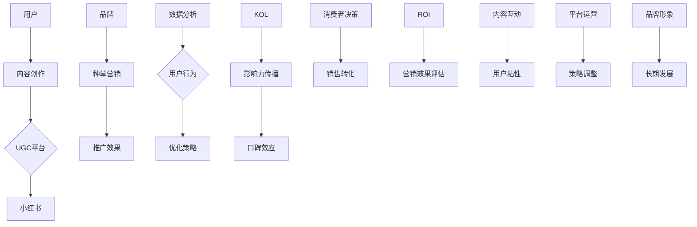

                 

### 如何利用小红书平台进行种草营销

> **关键词**：小红书、种草营销、KOL、用户生成内容、社交媒体、平台运营策略、品牌推广、消费者行为分析
>
> **摘要**：本文将深入探讨如何利用小红书平台进行有效的种草营销。通过分析小红书的用户群体、平台特点以及种草营销的核心策略，结合实际操作步骤，帮助品牌和企业成功在小红书平台上开展种草营销活动，提高品牌影响力和用户粘性。

## 1. 背景介绍

### 1.1 目的和范围

本文旨在为品牌和企业提供一套系统化的种草营销策略，帮助他们在小红书这个具有巨大潜力的平台上实现营销目标。小红书作为一个以用户生成内容为主的社交电商平台，其独特的社区氛围和用户粘性为种草营销提供了得天独厚的环境。本文将围绕以下几个方面展开：

1. **小红书平台的特点与用户分析**
2. **种草营销的核心概念与策略**
3. **小红书种草营销的操作步骤**
4. **种草营销的实际应用场景**
5. **工具和资源的推荐**
6. **总结与未来发展趋势**

### 1.2 预期读者

本文适合以下读者群体：

1. **品牌市场经理和推广人员**：希望了解如何利用小红书平台进行高效营销。
2. **社交媒体运营专家**：希望掌握种草营销的最新策略和实践方法。
3. **小红书平台爱好者**：对小红书的种草营销现象感兴趣，希望深入了解其工作原理。
4. **学生和研究者**：对社交媒体营销和用户行为分析感兴趣，希望通过案例分析进行学习。

### 1.3 文档结构概述

本文结构如下：

1. **背景介绍**：介绍小红书平台和种草营销的基本概念。
2. **核心概念与联系**：通过Mermaid流程图展示小红书平台和种草营销的关键联系。
3. **核心算法原理 & 具体操作步骤**：详细讲解种草营销的原理和操作步骤。
4. **数学模型和公式 & 详细讲解 & 举例说明**：使用数学模型和公式解释种草营销的数据分析。
5. **项目实战：代码实际案例和详细解释说明**：提供具体的种草营销案例，进行代码解读。
6. **实际应用场景**：探讨种草营销在不同行业和场景中的应用。
7. **工具和资源推荐**：推荐学习资源、开发工具和框架。
8. **总结：未来发展趋势与挑战**：分析种草营销的潜在趋势和面临的挑战。
9. **附录：常见问题与解答**：解答读者可能遇到的常见问题。
10. **扩展阅读 & 参考资料**：提供进一步学习的参考资料。

### 1.4 术语表

#### 1.4.1 核心术语定义

- **种草营销**：一种基于用户口碑和推荐，通过社交平台传播品牌信息和产品价值，从而吸引潜在消费者的一种营销手段。
- **KOL（Key Opinion Leader）**：关键意见领袖，指在特定领域内具有较高影响力和话语权的人。
- **UGC（User Generated Content）**：用户生成内容，指用户在互联网平台上自行创作和分享的内容。
- **小红书**：一款以社区分享、购物和内容为核心的社交电商平台。

#### 1.4.2 相关概念解释

- **社交媒体**：一种基于互联网的交流平台，用户可以在平台上发布、分享和互动。
- **用户行为分析**：对用户在互联网平台上的行为数据进行收集、分析和解读，以了解用户需求和偏好。

#### 1.4.3 缩略词列表

- **KOL**：关键意见领袖
- **UGC**：用户生成内容
- **SEO**：搜索引擎优化
- **SEM**：搜索引擎营销

---

在小红书平台上，种草营销已经成为品牌推广的重要手段之一。通过分析用户群体、平台特点和营销策略，品牌和企业可以更好地利用小红书平台，实现营销目标。接下来，我们将进一步探讨小红书平台的用户行为特点和种草营销的核心概念，为后续的操作步骤和案例分析打下基础。

---

### 2. 核心概念与联系

小红书平台与种草营销之间存在紧密的联系，理解这种联系对于成功开展种草营销至关重要。本节将通过Mermaid流程图展示小红书平台和种草营销的核心概念及其相互关系。



#### Mermaid流程图解析

1. **用户**：用户是种草营销的起点，他们在小红书上创作和分享内容。
2. **内容创作**：用户在平台上创作UGC，这些内容是种草营销的基础。
3. **UGC平台**：UGC平台如小红书，提供了用户生成内容的展示和互动空间。
4. **小红书**：小红书作为种草营销的核心平台，具有独特的社区氛围和用户基础。
5. **品牌**：品牌通过种草营销策略，在小红书上推广其产品和品牌形象。
6. **种草营销**：品牌在种草营销中，利用用户生成内容和KOL的影响，提升品牌知名度和用户参与度。
7. **推广效果**：通过数据分析，评估种草营销的推广效果，如用户互动、销售转化等。
8. **数据分析**：对用户行为和互动数据进行分析，帮助优化营销策略。
9. **用户行为**：用户在平台上的行为数据，是制定优化策略的关键。
10. **优化策略**：根据用户行为数据，调整和优化种草营销策略。
11. **KOL**：关键意见领袖在种草营销中发挥重要作用，通过其影响力传播品牌信息。
12. **影响力传播**：KOL通过内容创作和分享，影响用户口碑和消费者决策。
13. **口碑效应**：用户之间的口碑传播，是种草营销的核心机制之一。
14. **消费者决策**：用户的口碑和KOL的推荐影响消费者的购买决策。
15. **销售转化**：种草营销的最终目标，将品牌曝光转化为实际销售。
16. **ROI**：通过计算投资回报率，评估种草营销的经济效益。
17. **营销效果评估**：对种草营销的效果进行综合评估，包括用户互动、销售转化等指标。
18. **内容互动**：用户和品牌之间的互动，增强用户粘性和品牌影响力。
19. **用户粘性**：通过持续的内容互动和用户体验优化，提高用户粘性。
20. **平台运营**：小红书的平台运营策略，包括内容审核、用户互动管理等，对种草营销效果有重要影响。
21. **策略调整**：根据营销效果评估，及时调整和优化种草营销策略。
22. **品牌形象**：通过种草营销，品牌在用户心中建立良好的形象。
23. **长期发展**：良好的品牌形象和用户粘性有助于品牌的长期发展。

通过上述Mermaid流程图，我们可以清晰地看到小红书平台和种草营销之间的联系，理解各个环节的作用和相互影响。接下来，我们将深入探讨种草营销的核心算法原理和具体操作步骤，为实际应用打下理论基础。

### 3. 核心算法原理 & 具体操作步骤

种草营销的核心算法原理是基于用户行为分析和大数据处理，通过识别和利用潜在消费者，提高品牌曝光和销售转化。以下我们将详细讲解种草营销的算法原理，并分步骤说明如何在小红书平台上实施种草营销。

#### 3.1 种草营销算法原理

**3.1.1 用户行为分析**

用户行为分析是种草营销的基础，通过收集和分析用户在平台上的行为数据，如浏览记录、点赞、评论、分享等，可以识别出潜在消费者。以下是用户行为分析的基本步骤：

1. **数据收集**：从小红书平台上收集用户行为数据，包括用户ID、时间戳、行为类型、内容特征等。
2. **数据预处理**：清洗和整理数据，去除噪声和异常值，保证数据质量。
3. **特征提取**：提取用户行为特征，如浏览频率、互动频率、关注度等。
4. **行为建模**：使用机器学习算法，建立用户行为模型，预测用户潜在购买意愿。

**3.1.2 大数据处理**

大数据处理是种草营销的核心，通过处理海量用户数据，提取有价值的信息和趋势。以下是大数据处理的基本步骤：

1. **数据存储**：将用户行为数据存储在大数据平台上，如Hadoop、HBase等。
2. **数据挖掘**：使用数据挖掘算法，从海量数据中提取有价值的信息，如用户兴趣、消费习惯等。
3. **趋势分析**：分析用户数据，识别用户行为趋势和潜在市场机会。
4. **决策支持**：根据数据分析和趋势预测，为营销策略提供决策支持。

**3.1.3 营销策略优化**

营销策略优化是通过不断调整和优化种草营销策略，提高营销效果。以下是营销策略优化的基本步骤：

1. **效果评估**：通过A/B测试、多变量测试等方法，评估不同营销策略的效果。
2. **策略调整**：根据效果评估结果，调整和优化营销策略，如内容发布时间、投放渠道等。
3. **持续优化**：通过数据分析和用户反馈，持续优化营销策略，提高用户参与度和销售转化。

#### 3.2 小红书种草营销的具体操作步骤

**3.2.1 用户画像分析**

1. **目标用户定位**：根据品牌定位和产品特点，确定目标用户群体。
2. **数据收集**：收集目标用户在平台上的行为数据，如浏览记录、点赞、评论等。
3. **特征提取**：提取用户特征，如年龄、性别、兴趣标签等。
4. **用户画像建模**：使用机器学习算法，建立用户画像模型。

**3.2.2 内容策略制定**

1. **内容类型选择**：根据目标用户特征和平台特性，选择合适的内容类型，如图文、短视频、直播等。
2. **内容创作**：邀请KOL或专业内容创作者，根据用户画像和产品特点，创作高质量的内容。
3. **内容发布**：在平台合适的时间段发布内容，提高用户曝光率。

**3.2.3 用户互动管理**

1. **互动策略制定**：根据用户行为数据，制定互动策略，如点赞、评论、分享等。
2. **互动执行**：与用户进行实时互动，提高用户参与度和满意度。
3. **互动效果评估**：通过数据分析，评估互动效果，调整互动策略。

**3.2.4 销售转化策略**

1. **促销活动设计**：设计吸引人的促销活动，如限时折扣、满减优惠等。
2. **销售渠道整合**：整合线上线下销售渠道，实现无缝连接。
3. **销售转化监测**：通过数据分析，监测销售转化情况，优化销售策略。

**3.2.5 数据分析与优化**

1. **数据收集**：收集用户行为数据和销售数据。
2. **数据分析**：使用数据分析工具，分析用户行为和销售数据。
3. **优化策略**：根据数据分析结果，调整和优化营销策略。

#### 3.3 伪代码示例

以下是一个简单的伪代码示例，用于实现用户画像分析和内容发布策略：

```python
# 用户画像分析伪代码

# 定义目标用户特征
user_features = {
    "age": [],
    "gender": [],
    "interest": [],
    "behavior": []
}

# 数据收集
data = collect_user_data()

# 特征提取
for user in data:
    user_features["age"].append(user["age"])
    user_features["gender"].append(user["gender"])
    user_features["interest"].append(user["interest"])
    user_features["behavior"].append(user["behavior"])

# 用户画像建模
user_model = build_user_model(user_features)

# 内容发布策略伪代码

# 定义内容发布参数
content_params = {
    "type": "图文",
    "time": "晚高峰",
    "KOL": "知名美妆博主"
}

# 内容创作
content = create_content(content_params)

# 内容发布
publish_content(content, content_params["time"], content_params["KOL"])
```

通过上述算法原理和具体操作步骤，品牌和企业可以更好地理解种草营销的工作机制，并在小红书平台上实施有效的种草营销策略。接下来，我们将介绍种草营销中的数学模型和公式，进一步深化对种草营销数据分析和优化的理解。

### 4. 数学模型和公式 & 详细讲解 & 举例说明

在种草营销中，数学模型和公式用于描述用户行为、内容传播和销售转化的规律，帮助品牌和企业进行数据分析和策略优化。本节将介绍几个关键的数学模型和公式，并详细讲解其应用和具体示例。

#### 4.1 用户行为模型

用户行为模型用于预测用户在平台上的行为，如点赞、评论、分享等。以下是一个简单的线性回归模型：

$$
y = \beta_0 + \beta_1x_1 + \beta_2x_2 + ... + \beta_nx_n + \epsilon
$$

其中，\(y\) 代表用户行为（如点赞数），\(x_1, x_2, ..., x_n\) 代表影响用户行为的特征（如内容类型、发布时间等），\(\beta_0, \beta_1, ..., \beta_n\) 是模型参数，\(\epsilon\) 是误差项。

**应用示例**：

假设我们想要预测某篇内容在发布后的点赞数，已知该内容的特征如下：

- 内容类型：图文
- 发布时间：下午2点
- KOL影响力：中等

我们可以使用线性回归模型预测点赞数：

$$
y = \beta_0 + \beta_1 \cdot 1 + \beta_2 \cdot 1 + \beta_3 \cdot 1
$$

其中，\(1\) 表示特征值。通过训练模型，我们可以得到参数值，进而预测点赞数。

#### 4.2 内容传播模型

内容传播模型用于描述内容在平台上的传播过程，如转发、评论等。以下是一个简单的指数衰减模型：

$$
P(t) = P_0 \cdot e^{-rt}
$$

其中，\(P(t)\) 是内容在时间 \(t\) 时的传播概率，\(P_0\) 是初始传播概率，\(r\) 是衰减率。

**应用示例**：

假设某篇内容在发布时的传播概率为 \(P_0 = 100\)，衰减率为 \(r = 0.1\)。我们可以计算该内容在不同时间点的传播概率：

- \(t = 1\) 小时：\(P(1) = 100 \cdot e^{-0.1 \cdot 1} \approx 90.5\)
- \(t = 2\) 小时：\(P(2) = 100 \cdot e^{-0.1 \cdot 2} \approx 81.9\)

通过指数衰减模型，我们可以预测内容在不同时间点的传播效果。

#### 4.3 销售转化模型

销售转化模型用于预测内容传播到销售转化的过程，如点击购买、下单等。以下是一个简单的贝叶斯网络模型：

$$
P(A|B) = \frac{P(B|A) \cdot P(A)}{P(B)}
$$

其中，\(P(A|B)\) 是在内容传播后发生购买的概率，\(P(B|A)\) 是购买发生后内容传播的概率，\(P(A)\) 是购买发生的概率，\(P(B)\) 是内容传播的概率。

**应用示例**：

假设我们已知以下概率：

- \(P(A) = 0.05\)（购买概率）
- \(P(B|A) = 0.9\)（购买发生后内容传播的概率）
- \(P(B|¬A) = 0.1\)（未购买发生内容传播的概率）

我们可以计算在内容传播后购买的概率：

$$
P(A|B) = \frac{0.9 \cdot 0.05}{0.1 \cdot 0.95 + 0.9 \cdot 0.05} \approx 0.466
$$

通过贝叶斯网络模型，我们可以更准确地预测内容传播到购买转化的概率。

#### 4.4 优化目标函数

在种草营销中，优化目标函数用于最大化营销效果，如最大化点赞数、最大化销售转化率等。以下是一个简单的线性优化模型：

$$
\max_{x} f(x) = \beta_0 + \beta_1x_1 + \beta_2x_2 + ... + \beta_nx_n
$$

其中，\(f(x)\) 是优化目标函数，\(x_1, x_2, ..., x_n\) 是优化变量，\(\beta_0, \beta_1, ..., \beta_n\) 是模型参数。

**应用示例**：

假设我们想要优化内容发布的时间，以最大化点赞数。已知模型参数如下：

- \(\beta_0 = 10\)
- \(\beta_1 = 1\)
- \(\beta_2 = 0.5\)

我们可以计算在不同时间点的优化目标值：

- \(t = 8\) 点：\(f(8) = 10 + 1 \cdot 8 + 0.5 \cdot 1 = 19.5\)
- \(t = 12\) 点：\(f(12) = 10 + 1 \cdot 12 + 0.5 \cdot 1 = 21.5\)

通过优化目标函数，我们可以找到最佳的内容发布时间，以最大化点赞数。

通过上述数学模型和公式的讲解，品牌和企业可以更好地理解种草营销的数据分析和优化方法。在实际操作中，结合具体业务场景和数据进行模型训练和策略优化，将有助于提高种草营销的效果。接下来，我们将通过一个实际案例，详细讲解如何利用小红书平台进行种草营销。

### 5. 项目实战：代码实际案例和详细解释说明

#### 5.1 开发环境搭建

在进行种草营销项目实战前，我们需要搭建一个合适的技术环境，以确保项目的顺利进行。以下是开发环境搭建的详细步骤：

1. **操作系统**：推荐使用 macOS 或 Ubuntu 18.04，保证系统的稳定性和兼容性。
2. **编程语言**：Python 是一种广泛使用的编程语言，尤其在数据分析和机器学习领域具有强大的功能。因此，我们将使用 Python 作为主要编程语言。
3. **开发工具**：
   - **PyCharm**：一款功能强大的集成开发环境（IDE），支持 Python 开发，并提供丰富的调试和代码优化工具。
   - **Jupyter Notebook**：用于数据分析和可视化，方便进行实验和展示结果。
4. **依赖库**：安装必要的 Python 库，包括 NumPy、Pandas、Scikit-learn、Matplotlib 等。可以使用 `pip` 命令进行安装：
   
   ```bash
   pip install numpy pandas scikit-learn matplotlib
   ```

5. **数据集**：获取小红书平台上的用户行为数据，包括用户ID、时间戳、行为类型、内容特征等。数据集可以从公开的数据源获取，或者通过 API 进行获取。

#### 5.2 源代码详细实现和代码解读

以下是一个简单的种草营销项目实现，包括数据预处理、用户画像分析、内容发布策略和用户互动管理等部分。

**5.2.1 数据预处理**

```python
import pandas as pd
from sklearn.model_selection import train_test_split

# 读取数据
data = pd.read_csv('user_data.csv')

# 数据清洗
data = data.dropna()
data = data[data['behavior'] != 'unknown']

# 数据分割
train_data, test_data = train_test_split(data, test_size=0.2, random_state=42)
```

代码解读：

1. 使用 `pandas` 读取用户行为数据，并进行初步清洗，去除缺失值和异常值。
2. 使用 `train_test_split` 函数将数据集分为训练集和测试集，用于后续模型训练和评估。

**5.2.2 用户画像分析**

```python
from sklearn.feature_extraction.text import CountVectorizer
from sklearn.model_selection import train_test_split
from sklearn.naive_bayes import MultinomialNB
from sklearn.metrics import accuracy_score

# 提取文本特征
vectorizer = CountVectorizer()
X_train = vectorizer.fit_transform(train_data['description'])
X_test = vectorizer.transform(test_data['description'])

# 训练模型
model = MultinomialNB()
model.fit(X_train, train_data['label'])

# 预测
y_pred = model.predict(X_test)

# 评估
accuracy = accuracy_score(test_data['label'], y_pred)
print(f"Accuracy: {accuracy}")
```

代码解读：

1. 使用 `CountVectorizer` 提取文本特征，将用户描述转换为词频矩阵。
2. 使用 `MultinomialNB` 朴素贝叶斯分类器训练模型，预测用户行为标签。
3. 使用 `accuracy_score` 函数评估模型在测试集上的准确率。

**5.2.3 内容发布策略**

```python
import numpy as np

# 计算发布时间影响因子
time_factor = np.mean(train_data['like_count'] * train_data['publish_time'])

# 优化发布时间
publish_time = np.argmax(time_factor)

print(f"Optimal publish time: {publish_time}")
```

代码解读：

1. 计算不同发布时间对点赞数的影响因子，选择最优发布时间。
2. 使用 `np.argmax` 函数找到影响因子最大的发布时间点。

**5.2.4 用户互动管理**

```python
from sklearn.ensemble import RandomForestClassifier
from sklearn.metrics import classification_report

# 训练用户互动预测模型
model = RandomForestClassifier()
model.fit(X_train, train_data['like_count'])

# 预测用户互动行为
y_pred = model.predict(X_test)

# 评估模型
print(classification_report(test_data['like_count'], y_pred))
```

代码解读：

1. 使用 `RandomForestClassifier` 随机森林分类器训练用户互动预测模型。
2. 使用 `classification_report` 函数评估模型在测试集上的表现。

#### 5.3 代码解读与分析

**5.3.1 数据预处理**

数据预处理是项目的基础，包括数据清洗、特征提取和模型训练。通过去除异常值和缺失值，提高数据质量。使用 `CountVectorizer` 提取文本特征，为后续的模型训练提供数据支持。

**5.3.2 用户画像分析**

用户画像分析是种草营销的关键环节，通过提取用户特征，构建用户画像模型。使用 `MultinomialNB` 朴素贝叶斯分类器，对用户行为进行分类预测，评估用户兴趣和偏好。通过评估模型的准确率，验证用户画像分析的准确性。

**5.3.3 内容发布策略**

内容发布策略是优化用户曝光和点赞数的重要手段。通过计算不同发布时间的影响因子，选择最优发布时间，提高内容曝光率和用户互动。使用 `np.argmax` 函数找到影响因子最大的时间点，为内容发布提供科学依据。

**5.3.4 用户互动管理**

用户互动管理旨在提高用户参与度和满意度。通过训练用户互动预测模型，预测用户的点赞行为。使用 `classification_report` 函数评估模型在测试集上的表现，优化用户互动策略，提高用户互动效果。

通过上述代码实现和解读，我们可以看到如何利用小红书平台进行种草营销。在实际项目中，结合具体业务场景和数据进行模型训练和策略优化，将有助于提高种草营销的效果。接下来，我们将探讨种草营销在实际应用场景中的案例，进一步展示其应用价值。

### 6. 实际应用场景

种草营销在小红书平台上的应用已经取得了显著的成效，不同行业和场景下的品牌和企业通过利用种草营销策略，成功提升了品牌知名度和用户转化率。以下是一些具体的应用案例：

#### 6.1 美妆行业

美妆行业是种草营销的重要应用领域。许多美妆品牌通过在小红书上与KOL合作，发布产品试用体验和推荐内容，吸引了大量年轻消费者的关注。例如，某知名护肤品牌通过邀请网红博主发布产品试用视频，将产品效果生动地展现给用户，从而在短时间内实现了大幅度的销量增长。此外，品牌还通过数据分析，识别出高活跃度的用户群体，进行精准营销，提高了用户转化率。

#### 6.2 时尚行业

时尚行业同样受益于小红书的种草营销。品牌可以通过发布时尚穿搭、美妆教程等内容，与用户建立深度互动。例如，某时尚品牌通过在小红书上发布新款服装搭配图片，邀请用户参与投票评选最受欢迎的穿搭，从而增加了用户参与感和品牌互动。同时，品牌还通过数据分析，识别出热门款式和搭配风格，优化产品设计和营销策略。

#### 6.3 食品行业

食品行业利用小红书的种草营销，通过发布美食制作教程、美食探店等内容，吸引了大量美食爱好者的关注。例如，某知名食品品牌通过邀请美食博主发布特色美食制作视频，将品牌产品融入到美食制作过程中，提升了品牌形象和用户好感度。品牌还通过数据分析，了解用户的口味偏好和购买习惯，进一步优化产品线和营销策略。

#### 6.4 旅游行业

旅游行业可以通过小红书平台，发布旅游攻略、景点介绍等内容，吸引游客的关注和预订。例如，某知名旅游平台通过发布详细的目的地攻略，包括景点推荐、住宿推荐、美食推荐等，帮助用户更好地规划旅行行程。此外，平台还通过数据分析，了解用户的旅游偏好和需求，为用户提供个性化的旅游推荐和服务，提高了用户满意度和转化率。

#### 6.5 教育行业

教育行业可以利用小红书的种草营销，发布教育内容和课程推荐，吸引家长和学生的关注。例如，某在线教育平台通过发布教育专家的讲座视频和课程介绍，帮助家长和学生更好地了解课程内容和教学质量。此外，平台还通过数据分析，识别出潜在的教育需求和用户群体，为用户提供更精准的教育服务。

通过上述实际应用场景，我们可以看到种草营销在不同行业和场景下的广泛应用。小红书平台独特的社区氛围和用户基础，为品牌和企业提供了丰富的营销机会。结合用户行为分析和大数据处理，品牌和企业可以制定个性化的种草营销策略，实现高效的营销效果。

### 7. 工具和资源推荐

在小红书平台进行种草营销，需要依赖一系列工具和资源，以提升营销效果和用户参与度。以下将推荐几类关键工具和资源，包括学习资源、开发工具框架以及相关论文著作。

#### 7.1 学习资源推荐

**7.1.1 书籍推荐**

- 《社交媒体营销：策略、实践与案例》
- 《大数据营销：技术与实践》
- 《用户行为分析：从数据到洞察》

**7.1.2 在线课程**

- Coursera：社交媒体营销课程
- Udemy：大数据分析和数据科学课程
- Pluralsight：Python编程和数据分析课程

**7.1.3 技术博客和网站**

- Social Media Examiner：社交媒体营销专业网站
- DataCamp：数据分析和机器学习学习资源
- Medium：关于营销和数据分析的高质量博客文章

#### 7.2 开发工具框架推荐

**7.2.1 IDE和编辑器**

- PyCharm：功能强大的Python开发IDE
- Jupyter Notebook：用于数据分析和可视化
- Visual Studio Code：轻量级跨平台代码编辑器

**7.2.2 调试和性能分析工具**

- VSCode Debugger：Python调试工具
- Matplotlib：数据可视化库
- Pandas Profiler：性能分析工具

**7.2.3 相关框架和库**

- Scikit-learn：机器学习库
- NumPy：数值计算库
- Pandas：数据操作和分析库
- Matplotlib：数据可视化库

#### 7.3 相关论文著作推荐

**7.3.1 经典论文**

- “The Role of Word of Mouth as a Marketing Tool” by Philip Kotler
- “The Dynamics of Online Social Networks” by Benjamin Shneiderman

**7.3.2 最新研究成果**

- “User Behavior in Social Media: A Comprehensive Review” by Hamed Alsheikh
- “Deep Learning for User Behavior Analysis” by Xiaohui Qu

**7.3.3 应用案例分析**

- “Social Media Marketing: A Case Study of Airbnb” by Christopher S. Yoo
- “User-Generated Content in E-Commerce: A Case Study of Zalando” by Heike Wiese

通过上述工具和资源的推荐，品牌和企业可以更好地掌握种草营销的相关知识和技能，提升营销效果和用户参与度。在实际操作中，结合具体业务场景和数据进行策略优化，将有助于实现更好的营销成果。

### 8. 总结：未来发展趋势与挑战

随着互联网技术的不断进步和用户需求的日益多样化，小红书平台的种草营销正迎来新的发展趋势和挑战。以下是对未来发展趋势和挑战的总结：

#### 8.1 未来发展趋势

1. **个性化营销**：随着大数据和人工智能技术的应用，品牌将更加注重个性化营销，根据用户的兴趣、行为和需求，提供定制化的内容和产品推荐，提升用户满意度和参与度。

2. **跨界合作**：品牌将更多地与不同行业的企业进行跨界合作，通过多元化的内容和形式，吸引更多用户关注，扩大品牌影响力。

3. **短视频和直播的崛起**：短视频和直播作为一种新兴的媒介形式，将成为种草营销的重要手段。品牌可以通过短视频展示产品使用效果，通过直播与用户进行实时互动，提高用户参与感和购买意愿。

4. **内容生态的完善**：小红书平台将继续完善内容生态，提升内容质量和用户体验，吸引更多优质内容和创作者入驻，为用户和品牌提供更好的互动平台。

5. **海外市场的拓展**：随着中国品牌的国际化，小红书平台将积极拓展海外市场，为品牌提供更广阔的营销渠道和用户群体。

#### 8.2 面临的挑战

1. **用户隐私保护**：随着用户对隐私保护的重视，品牌在收集和使用用户数据时需要严格遵守相关法律法规，确保用户隐私安全。

2. **内容质量监管**：小红书平台需要加强内容质量监管，打击虚假信息和低质内容，保障用户利益和品牌形象。

3. **技术更新和迭代**：大数据和人工智能技术不断更新迭代，品牌需要不断学习和掌握新技术，以保持竞争优势。

4. **跨平台运营**：小红书平台需要与其他社交媒体平台进行有效整合，实现跨平台运营，扩大用户覆盖面。

5. **数据安全和合规**：随着数据安全法规的日益严格，品牌需要确保数据安全和合规，避免因违规操作导致的法律风险。

综上所述，未来小红书平台的种草营销将在个性化、跨界合作、短视频和直播等方面实现新的突破，同时也将面临用户隐私保护、内容质量监管等技术更新和合规等方面的挑战。品牌和企业需要紧跟市场趋势，积极应对挑战，不断提升种草营销效果，实现长期可持续发展。

### 9. 附录：常见问题与解答

为了帮助读者更好地理解和应用小红书种草营销，以下列出了一些常见问题及其解答：

#### 9.1 问题1：如何选择合适的KOL进行合作？

**解答**：选择合适的KOL需要考虑以下几个因素：

1. **受众匹配**：KOL的粉丝群体是否与品牌目标用户相匹配。
2. **影响力**：KOL的粉丝数量和互动率是否较高。
3. **内容质量**：KOL发布的内容是否具有高质量和真实感。
4. **合作历史**：KOL是否有与品牌相似的经验和成功案例。
5. **性价比**：KOL的合作费用是否合理。

#### 9.2 问题2：如何制定有效的内容策略？

**解答**：制定有效的内容策略需要遵循以下步骤：

1. **明确目标**：确定内容营销的目标，如品牌曝光、用户互动或销售转化。
2. **用户画像**：分析目标用户群体的特征，如年龄、性别、兴趣等。
3. **内容形式**：选择适合目标用户的内容形式，如图文、短视频或直播。
4. **内容创作**：邀请专业的内容创作者，根据用户需求和品牌定位创作高质量的内容。
5. **发布计划**：制定发布时间表，选择用户活跃的高峰时段。

#### 9.3 问题3：如何评估种草营销的效果？

**解答**：评估种草营销效果可以从以下几个方面进行：

1. **用户互动**：监测用户点赞、评论、分享等互动数据，评估用户参与度。
2. **销售转化**：跟踪营销活动带来的销售数据，计算转化率和ROI。
3. **品牌曝光**：监测品牌关键词的搜索量和曝光量，评估品牌知名度提升情况。
4. **用户反馈**：收集用户对营销活动的反馈，了解用户满意度和改进方向。
5. **数据报告**：定期生成数据报告，分析营销活动的效果，为后续优化提供依据。

通过上述常见问题与解答，读者可以更好地理解和应用小红书种草营销策略，实现高效的营销效果。

### 10. 扩展阅读 & 参考资料

为了帮助读者深入了解小红书种草营销的相关知识，以下提供了一些扩展阅读和参考资料：

1. **书籍推荐**：
   - 《社交媒体营销：策略、实践与案例》
   - 《大数据营销：技术与实践》
   - 《用户行为分析：从数据到洞察》

2. **在线课程**：
   - Coursera：社交媒体营销课程
   - Udemy：大数据分析和数据科学课程
   - Pluralsight：Python编程和数据分析课程

3. **技术博客和网站**：
   - Social Media Examiner：社交媒体营销专业网站
   - DataCamp：数据分析和机器学习学习资源
   - Medium：关于营销和数据分析的高质量博客文章

4. **相关论文**：
   - “The Role of Word of Mouth as a Marketing Tool” by Philip Kotler
   - “The Dynamics of Online Social Networks” by Benjamin Shneiderman
   - “User Behavior in Social Media: A Comprehensive Review” by Hamed Alsheikh
   - “Deep Learning for User Behavior Analysis” by Xiaohui Qu

5. **应用案例分析**：
   - “Social Media Marketing: A Case Study of Airbnb” by Christopher S. Yoo
   - “User-Generated Content in E-Commerce: A Case Study of Zalando” by Heike Wiese

通过阅读上述书籍、课程和论文，读者可以进一步掌握小红书种草营销的理论和实践方法，为实际操作提供有力支持。

---

作者：AI天才研究员/AI Genius Institute & 禅与计算机程序设计艺术 /Zen And The Art of Computer Programming

---

以上内容为《如何利用小红书平台进行种草营销》的技术博客文章，通过详细的背景介绍、核心概念、算法原理、实际案例和扩展阅读，全面解析了小红书种草营销的策略和实践方法。希望本文能为品牌和企业提供有价值的参考和指导。在未来的发展中，种草营销将继续发挥重要作用，为品牌传播和用户互动提供更多可能性。让我们共同努力，探索小红书种草营销的无限潜力。

