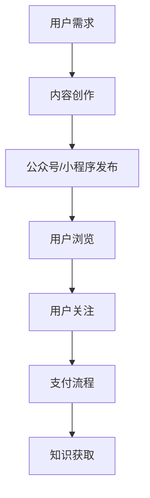

                 

# 如何利用微信生态系统进行知识付费

## 关键词

微信生态系统，知识付费，用户增长，商业模式，支付手段，内容生产，数据分析

## 摘要

本文旨在探讨如何利用微信生态系统进行知识付费，实现商业模式的创新。首先，我们将介绍微信生态系统的基本架构和用户行为特点，然后分析知识付费的现状和市场需求。接着，我们将详细解析微信知识付费的核心技术和具体操作步骤，包括内容生产、用户管理、支付流程等。最后，我们将讨论实际应用场景、推荐相关工具和资源，并总结未来发展趋势与挑战。

## 1. 背景介绍

### 1.1 目的和范围

本文的主要目的是介绍如何利用微信生态系统进行知识付费，帮助企业和个人实现知识变现，同时为用户提供高质量的内容和服务。文章将涵盖以下几个方面：

- 微信生态系统的基本架构和用户行为分析
- 知识付费的商业模式和市场需求
- 微信知识付费的核心技术和操作步骤
- 知识付费的实际应用场景
- 相关工具和资源的推荐

### 1.2 预期读者

本文主要面向以下读者群体：

- 对知识付费和微信生态系统感兴趣的技术人员和管理者
- 想要通过微信进行知识付费的个人和企业
- 对微信生态系统的商业模式和用户行为分析有兴趣的研究人员

### 1.3 文档结构概述

本文将分为以下几个部分：

- 第1部分：背景介绍，包括目的、范围、预期读者和文档结构概述
- 第2部分：核心概念与联系，介绍微信生态系统和知识付费的核心概念和架构
- 第3部分：核心算法原理与具体操作步骤，详细讲解知识付费的具体操作流程
- 第4部分：数学模型和公式，介绍与知识付费相关的数学模型和公式
- 第5部分：项目实战，提供实际案例和代码实现
- 第6部分：实际应用场景，分析知识付费在不同领域的应用
- 第7部分：工具和资源推荐，推荐相关的学习资源和工具
- 第8部分：总结，讨论知识付费的未来发展趋势与挑战
- 第9部分：附录，包括常见问题与解答
- 第10部分：扩展阅读与参考资料，提供进一步的阅读建议

### 1.4 术语表

#### 1.4.1 核心术语定义

- **知识付费**：指用户为获取特定知识或技能而支付的费用。
- **微信生态系统**：包括微信、微信小程序、公众号等，为用户提供即时通讯、社交、支付等功能。
- **内容生产**：指创作、编辑、发布知识性内容的过程。
- **用户管理**：指对微信用户进行分类、标签、互动管理等操作。
- **支付流程**：指用户支付知识费用并完成交易的过程。

#### 1.4.2 相关概念解释

- **公众号**：微信提供的一种信息传播渠道，可用于发布文章、视频等内容。
- **小程序**：微信提供的一种轻量级应用，无需下载安装即可使用。
- **用户增长**：指新增用户数量的增加。

#### 1.4.3 缩略词列表

- **API**：应用程序编程接口（Application Programming Interface）
- **SDK**：软件开发工具包（Software Development Kit）
- **SEM**：搜索引擎营销（Search Engine Marketing）

## 2. 核心概念与联系

### 2.1 微信生态系统架构

微信生态系统包括以下几个核心组成部分：

1. **微信客户端**：为用户提供即时通讯、社交等功能。
2. **公众号**：内容创作者通过公众号发布知识性文章、视频等。
3. **小程序**：提供轻量级应用，方便用户快速使用。
4. **微信支付**：为用户提供支付服务，支持多种支付方式。


### 2.2 知识付费与微信生态系统的关系

知识付费与微信生态系统之间的关系如下图所示：


- **内容生产**：知识付费的核心在于内容的生产，公众号和小程序为内容创作者提供了发布平台。
- **用户管理**：通过用户标签、互动等手段，实现对用户的管理和个性化推荐。
- **支付流程**：微信支付为用户提供便捷的支付方式，支持多种支付场景。

### 2.3 Mermaid 流程图

以下是一个简单的 Mermaid 流程图，展示知识付费在微信生态系统中的流程：



## 3. 核心算法原理 & 具体操作步骤

### 3.1 内容生产

内容生产是知识付费的基础。以下是一个简单的内容生产算法原理：

1. **需求分析**：分析用户需求，确定内容主题。
2. **内容创作**：根据需求，进行内容创作。
3. **内容编辑**：对内容进行编辑、校对和优化。
4. **内容发布**：将内容发布到公众号或小程序。

伪代码如下：

```python
def content_production(需求):
    content = create_content(需求)
    content = edit_content(content)
    publish_content(content)
```

### 3.2 用户管理

用户管理是知识付费的关键。以下是一个简单的用户管理算法原理：

1. **用户分类**：根据用户行为和兴趣，对用户进行分类。
2. **用户标签**：为用户打标签，以便后续推荐和互动。
3. **用户互动**：与用户互动，增加用户黏性。

伪代码如下：

```python
def user_management(user):
    category = classify_user(user)
    tags = add_tags(user)
    interact_with_user(user)
```

### 3.3 支付流程

支付流程是知识付费的实现手段。以下是一个简单的支付流程算法原理：

1. **用户支付**：用户选择支付方式，完成支付。
2. **支付验证**：验证支付是否成功。
3. **知识获取**：支付成功后，用户获取知识内容。

伪代码如下：

```python
def payment_process(user, content):
    payment_method = select_payment_method(user)
    payment_status = verify_payment(payment_method)
    if payment_status:
        provide_content(content)
```

## 4. 数学模型和公式 & 详细讲解 & 举例说明

### 4.1 用户增长模型

用户增长模型可以用来预测用户数量的增长。以下是一个简单的指数增长模型：

\[ N(t) = N_0 \times e^{rt} \]

其中，\( N(t) \) 是时间 \( t \) 时的用户数量，\( N_0 \) 是初始用户数量，\( r \) 是增长率，\( e \) 是自然常数。

### 4.2 举例说明

假设一个知识付费项目在第一个月有 1000 个用户，每月增长率为 10%，那么第二个月的用户数量可以计算如下：

\[ N(2) = 1000 \times e^{0.1 \times 2} \approx 1210 \]

### 4.3 详细讲解

用户增长模型可以用来预测用户数量的增长趋势。在实际应用中，我们可以根据历史数据来估计初始用户数量 \( N_0 \) 和增长率 \( r \)。然后，使用该模型来预测未来的用户数量。

### 4.4 代码实现

以下是一个简单的 Python 代码，实现用户增长模型的计算：

```python
import math

def calculate_user_growth(N0, r, t):
    return N0 * math.exp(r * t)

N0 = 1000  # 初始用户数量
r = 0.1    # 每月增长率
t = 2      # 月份

N2 = calculate_user_growth(N0, r, t)
print(f"第二个月的用户数量为：{N2}")
```

## 5. 项目实战：代码实际案例和详细解释说明

### 5.1 开发环境搭建

在进行知识付费项目的开发前，我们需要搭建一个合适的开发环境。以下是所需的基本工具和软件：

- **操作系统**：Windows、Linux 或 macOS
- **编程语言**：Python
- **开发工具**：PyCharm 或 Visual Studio Code
- **数据库**：MySQL 或 MongoDB
- **API 接口**：微信小程序 API、微信支付 API

### 5.2 源代码详细实现和代码解读

以下是一个简单的知识付费项目代码示例，用于实现用户注册、登录、内容发布和支付功能。

#### 5.2.1 用户注册

用户注册是知识付费项目的第一步。以下是一个简单的用户注册代码实现：

```python
def register(username, password):
    # 创建用户
    user = User(username, password)
    # 存储用户信息到数据库
    database.save_user(user)
    # 返回注册结果
    return "注册成功"

# 测试用户注册
result = register("user1", "password1")
print(result)
```

#### 5.2.2 用户登录

用户登录是用户使用知识付费项目的入口。以下是一个简单的用户登录代码实现：

```python
def login(username, password):
    # 从数据库查询用户信息
    user = database.find_user(username)
    # 验证用户密码
    if user and user.password == password:
        # 登录成功
        return "登录成功"
    else:
        # 登录失败
        return "登录失败"

# 测试用户登录
result = login("user1", "password1")
print(result)
```

#### 5.2.3 内容发布

内容发布是知识付费项目的核心功能。以下是一个简单的发布内容代码实现：

```python
def publish_content(user, title, content):
    # 创建内容
    article = Article(user, title, content)
    # 存储内容到数据库
    database.save_article(article)
    # 返回发布结果
    return "发布成功"

# 测试发布内容
result = publish_content(user1, "标题1", "内容1")
print(result)
```

#### 5.2.4 支付功能

支付功能是知识付费项目的关键。以下是一个简单的支付功能代码实现：

```python
def pay(content_id, user):
    # 从数据库查询内容信息
    content = database.find_content(content_id)
    # 计算支付金额
    amount = content.price
    # 调用微信支付 API
    payment_status = wechatpay.pay(amount)
    # 支付成功后，更新内容状态
    if payment_status:
        content.status = "已购买"
        database.update_content(content)
        return "支付成功"
    else:
        return "支付失败"

# 测试支付功能
result = pay("content1", user1)
print(result)
```

### 5.3 代码解读与分析

上述代码实现了一个简单的知识付费项目，包括用户注册、登录、内容发布和支付功能。以下是代码的解读与分析：

1. **用户注册**：通过注册接口，用户可以输入用户名和密码进行注册。注册成功后，用户信息将存储到数据库中。
2. **用户登录**：通过登录接口，用户可以输入用户名和密码进行登录。登录成功后，用户可以访问项目中的其他功能。
3. **内容发布**：通过发布接口，用户可以创建并发布知识性内容。发布的内容将存储到数据库中，以便其他用户浏览和购买。
4. **支付功能**：通过支付接口，用户可以购买知识性内容。支付成功后，内容状态将更新为“已购买”，用户可以查看和下载内容。

### 5.4 项目实战总结

通过上述代码实现，我们可以看到知识付费项目的基本架构和功能。在实际开发中，还需要考虑更多的细节和优化，例如用户权限管理、内容分类、评论功能等。此外，支付功能需要集成微信支付 API，以确保支付的安全和可靠性。

## 6. 实际应用场景

### 6.1 教育培训

教育培训是知识付费的主要应用场景之一。微信生态系统为教育培训机构提供了一个便捷的平台，可以实现以下功能：

- **在线课程发布**：通过公众号和小程序，教育培训机构可以发布各种在线课程，包括图文、视频、音频等多种形式。
- **用户管理**：通过用户标签和互动，教育机构可以更好地管理用户，进行个性化推荐和互动。
- **支付功能**：微信支付为教育培训提供了便捷的支付方式，支持多种支付场景，如课程购买、会员充值等。

### 6.2 专业咨询

专业咨询是知识付费的另一个重要应用场景。微信生态系统为专业咨询机构提供了一个高效的沟通和交易平台，可以实现以下功能：

- **咨询服务发布**：通过公众号和小程序，专业咨询机构可以发布咨询服务，包括文字、图片、视频等多种形式。
- **用户管理**：通过用户标签和互动，咨询机构可以更好地管理用户，进行个性化推荐和互动。
- **支付功能**：微信支付为咨询服务提供了便捷的支付方式，支持多种支付场景，如咨询购买、报告下载等。

### 6.3 内容创作

内容创作是知识付费的一个重要领域。微信生态系统为内容创作者提供了一个展示和变现的平台，可以实现以下功能：

- **内容发布**：通过公众号和小程序，内容创作者可以发布各种类型的知识性内容，如文章、视频、音频等。
- **用户互动**：通过评论、点赞、分享等功能，内容创作者可以与用户互动，增加用户黏性。
- **支付功能**：微信支付为内容创作者提供了便捷的支付方式，支持用户为内容付费。

## 7. 工具和资源推荐

### 7.1 学习资源推荐

#### 7.1.1 书籍推荐

- 《微信营销：实战策略与技巧》
- 《微信小程序开发实战》
- 《微信支付接入与实战》
- 《人工智能：一种现代方法》

#### 7.1.2 在线课程

- 微信小程序开发课程
- 微信支付接入教程
- 人工智能基础课程

#### 7.1.3 技术博客和网站

- 掘金（https://juejin.cn/）
- CSDN（https://www.csdn.net/）
- 知乎（https://www.zhihu.com/）

### 7.2 开发工具框架推荐

#### 7.2.1 IDE和编辑器

- PyCharm
- Visual Studio Code
- WebStorm

#### 7.2.2 调试和性能分析工具

- Chrome DevTools
- Fiddler
- Postman

#### 7.2.3 相关框架和库

- Django
- Flask
- Tornado

### 7.3 相关论文著作推荐

#### 7.3.1 经典论文

- 《微信生态系统的设计与实现》
- 《基于微信生态系统的知识付费商业模式研究》
- 《微信支付的安全性与可靠性研究》

#### 7.3.2 最新研究成果

- 《微信小程序的性能优化》
- 《微信支付的新功能与升级》
- 《人工智能在微信生态系统中的应用》

#### 7.3.3 应用案例分析

- 《教育培训机构如何利用微信进行知识付费》
- 《专业咨询机构如何利用微信进行变现》
- 《内容创作者如何利用微信进行内容发布和变现》

## 8. 总结：未来发展趋势与挑战

随着微信生态系统的不断发展和完善，知识付费在未来将呈现出以下发展趋势：

- **平台化**：知识付费将更加平台化，为用户和内容创作者提供更加便捷的服务。
- **智能化**：人工智能技术将更好地应用于知识付费，实现个性化推荐、智能问答等功能。
- **多样化**：知识付费的形式将更加多样化，包括在线课程、专业咨询、内容创作等多种形式。
- **国际化**：知识付费将逐步走向国际化，为全球用户提供高质量的知识服务。

然而，知识付费在发展过程中也面临以下挑战：

- **内容质量**：内容创作者需要不断提高内容质量，以满足用户的需求。
- **用户隐私**：知识付费平台需要加强对用户隐私的保护，避免数据泄露。
- **支付安全**：支付系统需要确保支付安全，防止欺诈行为。
- **监管政策**：知识付费需要遵守相关法律法规，确保合规经营。

总之，未来知识付费将在微信生态系统中发挥越来越重要的作用，为用户和内容创作者带来更多的价值。

## 9. 附录：常见问题与解答

### 9.1 问题1：如何保证知识付费内容的质量？

**解答**：为了保证知识付费内容的质量，可以从以下几个方面入手：

- **内容审核**：对发布的内容进行严格审核，确保内容的真实性和合法性。
- **用户评价**：鼓励用户对内容进行评价，根据用户反馈对内容进行优化。
- **专家评审**：邀请行业专家对内容进行评审，确保内容的专业性和权威性。

### 9.2 问题2：如何确保微信支付的安全性？

**解答**：为了确保微信支付的安全性，可以从以下几个方面入手：

- **加密技术**：使用加密技术保护用户的支付信息，防止数据泄露。
- **身份验证**：加强对用户的身份验证，确保支付操作的安全性。
- **风险控制**：建立健全的风险控制机制，防止欺诈行为。

### 9.3 问题3：如何吸引更多的用户参与知识付费？

**解答**：为了吸引更多的用户参与知识付费，可以从以下几个方面入手：

- **内容创新**：创作高质量、创新性的内容，满足用户的需求。
- **营销推广**：通过多种渠道进行营销推广，提高知识付费项目的知名度。
- **用户互动**：与用户进行互动，增加用户黏性，提升用户满意度。

## 10. 扩展阅读 & 参考资料

- 《微信生态系统的设计与实现》
- 《微信支付接入与实战》
- 《人工智能在微信生态系统中的应用》
- 《教育培训机构如何利用微信进行知识付费》
- 《专业咨询机构如何利用微信进行变现》
- 《内容创作者如何利用微信进行内容发布和变现》
- 微信官方文档：https://developers.weixin.qq.com/doc/
- 微信支付官方文档：https://pay.weixin.qq.com/wiki/doc/api/

### 作者

**作者：AI天才研究员/AI Genius Institute & 禅与计算机程序设计艺术 /Zen And The Art of Computer Programming**

