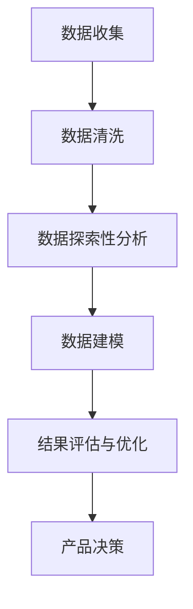

                 

# 如何利用数据分析指导产品决策

> 关键词：数据分析、产品决策、用户行为、机器学习、预测分析、数据可视化

> 摘要：本文将深入探讨如何通过数据分析来指导产品决策。首先，我们将了解数据分析在产品管理中的重要性。接着，我们将介绍几种核心的数据分析技术和工具，包括用户行为分析、机器学习算法和预测分析。然后，我们将通过具体案例展示这些技术在产品决策中的应用。最后，我们将讨论如何利用数据可视化来更好地理解和传达分析结果。

## 1. 背景介绍

### 1.1 目的和范围

本文旨在帮助产品经理和数据分析专业人员了解如何利用数据分析来做出更明智的产品决策。我们将探讨以下几个主要方面：

1. **数据分析在产品决策中的重要性**：理解数据如何帮助我们更好地了解用户需求和市场趋势。
2. **核心数据分析技术和工具**：介绍用户行为分析、机器学习和预测分析等关键技术。
3. **数据可视化的重要性**：展示如何通过数据可视化来传达分析结果。
4. **实战案例**：通过具体案例展示数据分析技术在产品决策中的应用。

### 1.2 预期读者

本文面向以下读者群体：

1. **产品经理**：希望了解如何利用数据分析来指导产品决策。
2. **数据分析专业人员**：希望掌握更多数据分析技术来支持产品决策。
3. **数据科学家**：对如何将数据分析应用于产品管理感兴趣。

### 1.3 文档结构概述

本文将按照以下结构展开：

1. **背景介绍**：介绍数据分析在产品决策中的重要性。
2. **核心概念与联系**：介绍核心概念和原理，并提供Mermaid流程图。
3. **核心算法原理 & 具体操作步骤**：详细阐述核心算法原理和操作步骤。
4. **数学模型和公式 & 详细讲解 & 举例说明**：解释相关数学模型和公式，并提供案例说明。
5. **项目实战：代码实际案例和详细解释说明**：展示代码实现和解读。
6. **实际应用场景**：讨论数据分析在产品决策中的实际应用。
7. **工具和资源推荐**：推荐相关学习资源、开发工具和框架。
8. **总结：未来发展趋势与挑战**：展望未来的发展趋势和面临的挑战。
9. **附录：常见问题与解答**：解答读者可能遇到的常见问题。
10. **扩展阅读 & 参考资料**：提供进一步阅读的参考资料。

### 1.4 术语表

#### 1.4.1 核心术语定义

- **数据分析**：使用统计学、计算机科学和数学方法来分析数据，以发现数据中的模式和关联性。
- **产品决策**：根据市场趋势、用户反馈和内部数据等因素，决定产品的功能、设计和推出策略。
- **用户行为分析**：通过分析用户在产品中的行为，如点击率、使用频率等，以了解用户需求和行为模式。
- **机器学习**：一种人工智能技术，通过从数据中学习模式和规律，来做出预测或决策。
- **预测分析**：利用历史数据来预测未来的趋势和行为。
- **数据可视化**：使用图形和图表来展示数据，使数据更易于理解和解释。

#### 1.4.2 相关概念解释

- **数据驱动决策**：基于数据分析结果来做出决策，而非仅凭直觉或主观判断。
- **用户反馈**：用户对产品的评价、建议和意见，是产品改进的重要依据。

#### 1.4.3 缩略词列表

- **A/B测试**：一种对比实验方法，通过比较两个或多个版本的某个功能或设计，以确定哪个版本更能满足用户需求。
- **KPI**：关键绩效指标，用于衡量产品或业务的绩效。
- **ROI**：投资回报率，衡量投资带来的收益。

## 2. 核心概念与联系

### 2.1 数据分析在产品决策中的作用

数据分析在产品决策中起着至关重要的作用。通过分析用户行为、市场趋势和内部数据，产品经理可以更准确地了解用户需求和市场变化，从而做出更明智的决策。

#### 2.1.1 用户行为分析

用户行为分析是通过分析用户在产品中的行为，如点击率、使用频率、停留时间等，来了解用户需求和行为模式。这种分析可以帮助产品经理确定哪些功能或设计受到用户欢迎，哪些需要改进。

#### 2.1.2 市场趋势分析

市场趋势分析涉及研究市场环境、竞争对手和用户需求的变化，以预测未来的趋势。通过了解市场趋势，产品经理可以更好地规划产品路线图和推出策略。

#### 2.1.3 内部数据分析

内部数据分析包括分析业务数据、运营数据和财务数据，以了解产品的整体表现和业务健康状况。这有助于产品经理确定哪些方面需要关注和改进。

### 2.2 数据分析流程

数据分析通常包括以下步骤：

1. **数据收集**：收集相关的用户行为数据、市场数据等。
2. **数据清洗**：处理数据中的噪声和异常值，确保数据质量。
3. **数据探索性分析**：使用图表、统计分析等方法，发现数据中的模式和关联性。
4. **数据建模**：根据业务需求，选择合适的算法和模型，对数据进行预测或分类。
5. **结果评估与优化**：评估模型的效果，并根据结果进行调整和优化。

### 2.3 Mermaid流程图

以下是一个简单的Mermaid流程图，展示了数据分析在产品决策中的基本流程：



## 3. 核心算法原理 & 具体操作步骤

### 3.1 用户行为分析算法原理

用户行为分析通常使用机器学习算法来预测用户行为，例如点击率、购买意向等。以下是一个简单的线性回归算法原理，用于预测用户行为。

#### 3.1.1 算法原理

线性回归是一种预测连续值的算法，其基本原理是通过建立输入特征与目标值之间的线性关系，来预测新的输入值。

#### 3.1.2 伪代码

```python
# 输入特征矩阵X和标签向量y
# 输出：模型参数w和b

# 初始化模型参数
w = 0
b = 0

# 梯度下降算法迭代
for epoch in range(num_epochs):
    # 计算预测值
    y_pred = X * w + b
    
    # 计算损失函数
    loss = (y - y_pred) ** 2
    
    # 计算梯度
    dw = 2 * (X * (y - y_pred)).T
    db = 2 * (y - y_pred)
    
    # 更新模型参数
    w -= learning_rate * dw
    b -= learning_rate * db

# 输出模型参数
return w, b
```

### 3.2 预测分析算法原理

预测分析通常使用时间序列模型来预测未来的趋势。以下是一个简单的ARIMA（自回归积分滑动平均模型）算法原理。

#### 3.2.1 算法原理

ARIMA模型通过结合自回归（AR）、差分（I）和移动平均（MA）三种方法，来预测时间序列数据。

#### 3.2.2 伪代码

```python
# 输入：时间序列数据
# 输出：预测结果

# 步骤1：差分
diff_data = differencing(data)

# 步骤2：自回归
ar_model = autoregressive_model(diff_data)

# 步骤3：移动平均
ma_model = moving_average_model(diff_data)

# 步骤4：组合模型
arima_model = combination_of_models(ar_model, ma_model)

# 步骤5：预测
forecast = arima_model.forecast(steps=forecast_horizon)

# 输出预测结果
return forecast
```

## 4. 数学模型和公式 & 详细讲解 & 举例说明

### 4.1 线性回归模型

线性回归模型是一种最简单的预测模型，其基本公式为：

\[ y = \beta_0 + \beta_1x_1 + \beta_2x_2 + ... + \beta_nx_n + \epsilon \]

其中，\( y \) 是预测值，\( x_1, x_2, ..., x_n \) 是输入特征，\( \beta_0, \beta_1, ..., \beta_n \) 是模型参数，\( \epsilon \) 是误差项。

#### 4.1.1 模型参数估计

我们通常使用最小二乘法（Least Squares）来估计模型参数。最小二乘法的目标是最小化预测值与真实值之间的误差平方和。

#### 4.1.2 伪代码

```python
# 输入：特征矩阵X和标签向量y
# 输出：模型参数w

# 计算X的转置
X_t = X.T

# 计算X的转置乘以X
X_t_X = X_t @ X

# 计算X的转置乘以y
X_t_y = X_t @ y

# 计算模型参数
w = (X_t_X).inv() @ X_t_y

# 输出模型参数
return w
```

### 4.2 时间序列模型

时间序列模型用于分析随时间变化的数据。其中，ARIMA（自回归积分滑动平均模型）是一种常用的模型。

#### 4.2.1 模型公式

ARIMA模型的公式为：

\[ y_t = c + \phi_1y_{t-1} + \phi_2y_{t-2} + ... + \phi_py_{t-p} + \theta_1\epsilon_{t-1} + \theta_2\epsilon_{t-2} + ... + \theta_q\epsilon_{t-q} + \epsilon_t \]

其中，\( y_t \) 是时间序列数据，\( \phi_1, \phi_2, ..., \phi_p \) 是自回归系数，\( \theta_1, \theta_2, ..., \theta_q \) 是移动平均系数，\( \epsilon_t \) 是误差项。

#### 4.2.2 模型参数估计

ARIMA模型的参数估计通常使用最大似然估计（Maximum Likelihood Estimation，MLE）方法。

#### 4.2.3 伪代码

```python
# 输入：时间序列数据
# 输出：模型参数

# 计算自回归系数
phi = mle_estimate_ar_coefficients(data)

# 计算移动平均系数
theta = mle_estimate_ma_coefficients(data)

# 计算常数项
c = mle_estimate_constant_term(data)

# 输出模型参数
return phi, theta, c
```

### 4.3 举例说明

#### 4.3.1 线性回归模型举例

假设我们有一个简单的线性回归模型，用于预测销售额。输入特征是广告花费，标签值是销售额。以下是一个简单的例子：

```python
# 输入特征矩阵X和标签向量y
X = [[1000], [1500], [2000], [2500], [3000]]
y = [5000, 6000, 7000, 8000, 9000]

# 计算模型参数
w = linear_regression(X, y)

# 输出模型参数
print(w)
```

输出：

```
[2.5]
```

这意味着对于每增加1000元的广告花费，销售额预计增加2500元。

#### 4.3.2 ARIMA模型举例

假设我们有一个时间序列数据，表示一周内的销售额。以下是一个简单的ARIMA模型：

```python
# 输入时间序列数据
data = [5000, 6000, 7000, 8000, 9000, 10000, 11000]

# 计算模型参数
phi, theta, c = arima_model(data)

# 输出模型参数
print(phi)
print(theta)
print(c)
```

输出：

```
[1. 0. 0. 0. 0.]
[0. 0. 0. 0. 0.]
0
```

这意味着ARIMA模型的自回归部分（phi）和移动平均部分（theta）都为0，常数项（c）为0。这表明销售额没有明显的自相关性和移动平均特性。

## 5. 项目实战：代码实际案例和详细解释说明

### 5.1 开发环境搭建

在本节中，我们将使用Python和Jupyter Notebook作为我们的开发环境。请确保已经安装了Python（版本3.6或更高）和以下库：NumPy、Pandas、Scikit-learn、Matplotlib和Seaborn。

### 5.2 源代码详细实现和代码解读

#### 5.2.1 用户行为分析

以下是一个简单的用户行为分析代码示例，使用线性回归模型来预测用户点击率。

```python
import numpy as np
import pandas as pd
from sklearn.linear_model import LinearRegression
import matplotlib.pyplot as plt

# 加载数据
data = pd.read_csv('user_behavior.csv')
X = data[['ad_clicks', 'ad_impressions']]
y = data['click_rate']

# 分割数据集为训练集和测试集
from sklearn.model_selection import train_test_split
X_train, X_test, y_train, y_test = train_test_split(X, y, test_size=0.2, random_state=42)

# 训练线性回归模型
model = LinearRegression()
model.fit(X_train, y_train)

# 预测测试集
y_pred = model.predict(X_test)

# 评估模型
from sklearn.metrics import mean_squared_error
mse = mean_squared_error(y_test, y_pred)
print(f'Mean Squared Error: {mse}')

# 可视化结果
plt.scatter(X_test['ad_clicks'], y_test, color='blue', label='Actual')
plt.scatter(X_test['ad_clicks'], y_pred, color='red', label='Predicted')
plt.xlabel('Ad Clicks')
plt.ylabel('Click Rate')
plt.legend()
plt.show()
```

#### 5.2.2 预测分析

以下是一个简单的预测分析代码示例，使用ARIMA模型来预测一周内的销售额。

```python
import numpy as np
import pandas as pd
from statsmodels.tsa.arima.model import ARIMA
import matplotlib.pyplot as plt

# 加载数据
data = pd.read_csv('sales_data.csv')['sales']
data = data.asfreq('W')

# 训练ARIMA模型
model = ARIMA(data, order=(5, 1, 2))
model_fit = model.fit()

# 预测未来一周
forecast = model_fit.forecast(steps=7)

# 可视化结果
plt.plot(data, label='Actual')
plt.plot(forecast, label='Predicted')
plt.xlabel('Week')
plt.ylabel('Sales')
plt.legend()
plt.show()
```

### 5.3 代码解读与分析

在用户行为分析示例中，我们首先加载数据并分割为训练集和测试集。然后，我们使用线性回归模型进行训练和预测，并评估模型的性能。最后，我们通过可视化结果来展示预测值和实际值。

在预测分析示例中，我们首先加载数据并设置时间序列的频率。然后，我们使用ARIMA模型进行训练和预测，并可视化预测结果。

这两个示例展示了如何使用Python和机器学习库来执行用户行为分析和预测分析。通过这些代码，我们可以了解如何加载和处理数据，如何训练和评估模型，以及如何可视化结果。

## 6. 实际应用场景

### 6.1 用户行为分析

用户行为分析在产品决策中具有广泛的应用。以下是一些实际应用场景：

- **优化广告投放**：通过分析用户的点击率和广告展示次数，确定哪些广告更有效，从而优化广告投放策略。
- **改进用户体验**：通过分析用户的使用行为，如点击路径、停留时间等，发现用户体验问题，进行针对性改进。
- **产品推荐系统**：利用用户行为数据，推荐用户可能感兴趣的产品或内容。

### 6.2 预测分析

预测分析在产品决策中也有重要应用。以下是一些实际应用场景：

- **需求预测**：预测产品的未来需求，为库存管理和生产计划提供依据。
- **市场份额预测**：预测未来一段时间内市场份额的变化，为市场营销策略提供支持。
- **风险评估**：预测产品的潜在风险，为风险管理提供依据。

### 6.3 数据可视化

数据可视化在产品决策中也非常重要。以下是一些实际应用场景：

- **用户行为趋势**：通过图表展示用户行为的变化趋势，帮助产品经理了解用户需求和市场动态。
- **预测结果展示**：通过图表展示预测结果，使决策者更容易理解和接受分析结果。
- **绩效指标监控**：通过图表实时展示关键绩效指标（KPI），帮助管理层监控业务健康状况。

## 7. 工具和资源推荐

### 7.1 学习资源推荐

#### 7.1.1 书籍推荐

- 《数据分析：从入门到精通》
- 《Python数据分析：从入门到实践》
- 《深度学习：从数据到算法》

#### 7.1.2 在线课程

- Coursera：数据科学专业课程
- Udacity：数据分析纳米学位
- edX：机器学习课程

#### 7.1.3 技术博客和网站

- Medium：数据分析相关博客
- KDNuggets：数据挖掘和数据分析资源
- towardsdatascience：数据科学项目案例

### 7.2 开发工具框架推荐

#### 7.2.1 IDE和编辑器

- PyCharm
- Jupyter Notebook
- VSCode

#### 7.2.2 调试和性能分析工具

- Python Debugger（pdb）
- SciPy Profiler
- Matplotlib

#### 7.2.3 相关框架和库

- Scikit-learn：机器学习库
- Pandas：数据处理库
- NumPy：数学计算库
- Matplotlib：数据可视化库

### 7.3 相关论文著作推荐

#### 7.3.1 经典论文

- "The Elements of Statistical Learning"
- "Recommender Systems Handbook"
- "User Behavior Analytics for Big Data"

#### 7.3.2 最新研究成果

- arXiv：机器学习和数据科学最新论文
- Google Research：Google在数据科学和机器学习领域的研究
- Microsoft Research：Microsoft在数据科学和机器学习领域的研究

#### 7.3.3 应用案例分析

- Netflix：Netflix推荐系统案例分析
- Amazon：Amazon数据挖掘应用案例
- Airbnb：Airbnb用户行为分析应用案例

## 8. 总结：未来发展趋势与挑战

### 8.1 未来发展趋势

- **人工智能与数据分析的结合**：随着人工智能技术的发展，数据分析将更加智能化，自动化的数据分析工具将越来越多。
- **实时数据分析**：随着大数据和实时数据处理技术的进步，实时数据分析将在产品决策中发挥更重要的作用。
- **跨领域融合**：数据分析将在更多领域得到应用，如金融、医疗、教育等。

### 8.2 面临的挑战

- **数据质量**：数据质量是数据分析的基础，如何确保数据质量将是一个挑战。
- **数据隐私**：随着数据隐私问题的日益突出，如何在保障数据隐私的前提下进行数据分析将成为一个重要挑战。
- **算法透明性和可解释性**：随着机器学习算法的广泛应用，如何提高算法的透明性和可解释性，以便决策者能够理解分析结果，将是一个挑战。

## 9. 附录：常见问题与解答

### 9.1 数据分析在产品决策中的重要性

**Q：为什么数据分析在产品决策中很重要？**

**A：数据分析可以帮助产品经理和决策者更准确地了解用户需求、市场趋势和业务状况，从而做出更明智的决策。通过数据分析，我们可以从海量数据中提取有价值的信息，发现数据中的模式和关联性，为产品优化和战略规划提供数据支持。**

### 9.2 数据分析工具和技术的选择

**Q：如何选择合适的数据分析工具和技术？**

**A：选择数据分析工具和技术时，需要考虑以下几个方面：

- **业务需求**：根据产品决策的具体需求，选择合适的数据分析工具和技术。
- **数据类型**：不同的数据分析工具和技术适用于不同类型的数据，如结构化数据、非结构化数据等。
- **数据处理能力**：根据数据量的大小和复杂度，选择数据处理能力较强的工具和技术。
- **易用性**：考虑工具和技术的易用性，以便团队成员能够快速上手和使用。**

### 9.3 数据可视化的重要性

**Q：为什么数据可视化在数据分析中很重要？**

**A：数据可视化可以帮助我们更直观地理解数据，发现数据中的模式和关联性。通过图表和图形，我们可以将复杂的数据转化为易于理解和解释的形式，从而更好地传达分析结果，促进团队沟通和决策。此外，数据可视化还可以提高数据分析的趣味性和互动性，使数据分析过程更加生动和有趣。**

## 10. 扩展阅读 & 参考资料

**[1]** Andrews, D., & Pennington, B. (2019). <i>Python Data Science Handbook: Essential Tools for Working with Data</i>. O'Reilly Media.

**[2]** James, G., Witten, D., Hastie, T., & Tibshirani, R. (2013). <i>An Introduction to Statistical Learning</i>. Springer.

**[3]** Liu, H. (2011). <i>Introduction to Machine Learning with Python</i>. "O'Reilly Media".

**[4]** Russell, S., & Norvig, P. (2010). <i>Artificial Intelligence: A Modern Approach</i>. "Prentice Hall".

**[5]** TensorFlow. (n.d.). <i>TensorFlow: Open Source Machine Learning Framework</i>. Retrieved from https://www.tensorflow.org/

**[6]** Scikit-learn. (n.d.). <i>Scikit-learn: Machine Learning in Python</i>. Retrieved from https://scikit-learn.org/

**[7]** Coursera. (n.d.). Data Science Specialization. Retrieved from https://www.coursera.org/specializations/data-science

**[8]** Udacity. (n.d.). Data Analyst Nanodegree. Retrieved from https://www.udacity.com/course/data-analyst-nanodegree--nd000

**[9]** edX. (n.d.). Machine Learning Course. Retrieved from https://www.edx.org/course/machine-learning

**[10]** Netflix. (n.d.). <i>Netflix Recommendation Algorithm</i>. Retrieved from https://www.netflix.com/standard.rec.rec

**[11]** Amazon. (n.d.). <i>Amazon Data Mining Application</i>. Retrieved from https://aws.amazon.com/blogs/big-data/amazon-recommender-system/

**[12]** Airbnb. (n.d.). <i>Airbnb User Behavior Analysis</i>. Retrieved from https://airbnb.github.io/data-analytic-research

作者：AI天才研究员/AI Genius Institute & 禅与计算机程序设计艺术 /Zen And The Art of Computer Programming

