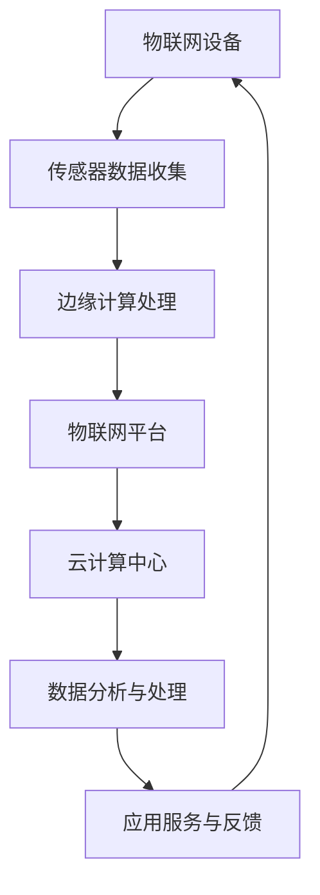

                 

# 如何利用物联网技术创新创业商业模式和场景

> **关键词**：物联网、创新、创业、商业模式、技术场景、商业模式设计、物联网应用

> **摘要**：本文将探讨如何利用物联网（IoT）技术在创业过程中构建创新的商业模式和实际应用场景。首先，我们将回顾物联网的基本概念和现状，然后分析物联网技术如何促进商业模式创新，接着通过具体案例探讨物联网在实际应用场景中的可能性，最后提供一些建议和资源，帮助创业者在物联网领域取得成功。

## 1. 背景介绍

### 1.1 目的和范围

本文旨在为创业者提供关于如何利用物联网技术构建创新商业模式的指南。我们将深入探讨物联网的核心概念、技术创新、商业模式设计以及具体应用场景。通过本文，读者将能够了解物联网技术如何为创业带来新的机遇，以及如何将物联网技术应用于实际业务中，打造具有竞争力的商业模式。

### 1.2 预期读者

本文适合对物联网技术有一定了解，但希望深入探索物联网在创业中的应用的创业者、产品经理、技术总监以及相关领域的研究人员。

### 1.3 文档结构概述

本文结构如下：

- 第1部分：背景介绍，包括目的和范围、预期读者、文档结构概述和术语表。
- 第2部分：核心概念与联系，介绍物联网的基本概念和架构。
- 第3部分：核心算法原理 & 具体操作步骤，讲解物联网技术的核心算法和实现方法。
- 第4部分：数学模型和公式 & 详细讲解 & 举例说明，介绍物联网相关的数学模型。
- 第5部分：项目实战：代码实际案例和详细解释说明，提供实际代码示例和解释。
- 第6部分：实际应用场景，探讨物联网在各个领域的应用。
- 第7部分：工具和资源推荐，介绍学习资源、开发工具和框架。
- 第8部分：总结：未来发展趋势与挑战，总结物联网技术的未来发展。
- 第9部分：附录：常见问题与解答，解答读者可能遇到的问题。
- 第10部分：扩展阅读 & 参考资料，提供进一步的阅读材料和参考资料。

### 1.4 术语表

#### 1.4.1 核心术语定义

- **物联网（IoT）**：物联网是指通过互联网将各种物理设备和传感器连接起来，实现信息的自动交换和共享。
- **传感器**：能够感知外部环境变化，并将这些变化转换为电信号的装置。
- **物联网平台**：用于连接和管理物联网设备和数据的软件平台。
- **边缘计算**：在靠近数据源的地方（如设备或网络边缘）进行数据处理和计算，以减少延迟和带宽需求。
- **云计算**：通过网络提供计算资源的服务，包括存储、处理和分析等。

#### 1.4.2 相关概念解释

- **M2M通信**：机器对机器通信，指设备之间的直接通信。
- **大数据**：指无法使用常规软件工具在合理时间内进行捕获、管理和处理的大量数据。
- **人工智能（AI）**：指使计算机系统能够模拟人类智能行为的技术。

#### 1.4.3 缩略词列表

- **IoT**：物联网（Internet of Things）
- **M2M**：机器对机器通信（Machine-to-Machine）
- **AI**：人工智能（Artificial Intelligence）
- **边缘计算**：Edge Computing

## 2. 核心概念与联系

在深入探讨物联网如何促进商业模式创新之前，我们需要先理解物联网的基本概念和架构。以下是一个简化的物联网架构流程图，展示了物联网的核心组成部分和它们之间的联系。



### 2.1 物联网基本概念

- **物联网设备**：这些设备可以是任何具有传感器、通信模块和处理能力的硬件设备，如智能手表、智能家居设备、工业传感器等。
- **传感器数据收集**：物联网设备通过内置的传感器收集环境数据，如温度、湿度、光照、运动等。
- **边缘计算处理**：在数据传输到云计算中心之前，边缘计算可以在本地对数据进行分析和处理，以减少延迟和带宽需求。
- **物联网平台**：物联网平台是连接和管理物联网设备和数据的软件平台，它负责数据收集、存储、分析和提供应用服务。
- **云计算中心**：云计算中心用于存储和处理大量的物联网数据，并提供高级数据分析、机器学习等服务。
- **数据分析与处理**：通过大数据分析和人工智能技术，从物联网数据中提取有价值的信息和洞察。
- **应用服务与反馈**：将分析结果转化为实际应用服务，如智能推荐、自动化控制等，并通过反馈机制持续优化服务。

### 2.2 物联网架构

物联网架构通常包括以下几个层次：

- **感知层**：包括各种物联网设备和传感器，负责数据收集。
- **网络层**：包括有线和无线通信网络，负责数据传输。
- **平台层**：包括物联网平台，负责数据存储、处理和分析。
- **应用层**：包括各种应用服务和业务逻辑，负责将分析结果应用于实际业务场景。

通过这个架构，物联网技术能够实现设备之间的智能互联，实现数据的自动采集、传输和分析，从而推动商业模式的创新。

## 3. 核心算法原理 & 具体操作步骤

物联网技术的核心在于数据的收集、传输和处理。在这一部分，我们将介绍物联网技术的核心算法原理，并使用伪代码详细阐述这些算法的实现步骤。

### 3.1 数据采集算法

数据采集是物联网技术的基础，以下是一个简单的数据采集算法：

```plaintext
# 输入：传感器数据
# 输出：处理后的数据

采集数据流程：
1. 初始化传感器
2. 循环读取传感器数据
3. 对数据进行预处理（如滤波、去噪）
4. 存储预处理后的数据
```

伪代码如下：

```python
function CollectData(sensor):
    initialize(sensor)
    while True:
        data = sensor.read()
        processed_data = PreprocessData(data)
        StoreData(processed_data)
```

### 3.2 边缘计算算法

边缘计算能够将数据处理移至数据源附近，以减少延迟和带宽需求。以下是一个简单的边缘计算算法：

```plaintext
# 输入：本地传感器数据
# 输出：处理后的数据

边缘计算流程：
1. 初始化计算资源
2. 循环读取本地传感器数据
3. 对数据进行初步处理
4. 执行本地计算
5. 存储处理后的数据
```

伪代码如下：

```python
function EdgeCompute(sensor_data):
    initialize_computation_resources()
    while True:
        local_data = ReadLocalSensorData(sensor_data)
        preprocessed_data = PreprocessData(local_data)
        result = LocalCompute(preprocessed_data)
        StoreData(result)
```

### 3.3 物联网平台数据处理算法

物联网平台负责处理和存储大量的物联网数据，并提供应用服务。以下是一个简单的物联网平台数据处理算法：

```plaintext
# 输入：物联网平台数据
# 输出：处理后的数据和应用服务

数据处理流程：
1. 接收数据
2. 存储数据
3. 分析数据
4. 提供应用服务
5. 处理用户请求
```

伪代码如下：

```python
function PlatformDataProcess(data):
    while True:
        data = ReceiveData()
        StoreData(data)
        analysis_result = AnalyzeData(data)
        service = ProvideService(analysis_result)
        ProcessUserRequest(service)
```

### 3.4 云计算数据处理算法

云计算中心负责存储和处理大量的物联网数据，并提供高级数据分析服务。以下是一个简单的云计算数据处理算法：

```plaintext
# 输入：物联网数据
# 输出：处理后的数据和分析结果

数据处理流程：
1. 接收数据
2. 存储数据
3. 分析数据
4. 提供高级分析服务
5. 存储分析结果
```

伪代码如下：

```python
function CloudCompute(data):
    while True:
        data = ReceiveData()
        StoreData(data)
        analysis_result = AdvancedAnalyzeData(data)
        StoreAnalysisResult(analysis_result)
```

通过这些算法，物联网技术能够实现数据的自动化采集、传输和处理，从而为创业提供丰富的数据资源和智能化的应用服务。

## 4. 数学模型和公式 & 详细讲解 & 举例说明

在物联网技术中，数学模型和公式是理解和分析数据的关键工具。以下我们将介绍物联网技术中常用的数学模型和公式，并详细讲解其应用和计算方法。

### 4.1 数据预处理

在数据处理过程中，数据预处理是关键的一步。以下是一个常用的高斯滤波公式：

$$
G(x, y) = \sum_{i=0}^{n} \sum_{j=0}^{m} w_{ij} * f(x-i, y-j)
$$

其中，\( G(x, y) \) 是预处理后的数据，\( w_{ij} \) 是滤波器的权重，\( f(x-i, y-j) \) 是原始数据。

#### 4.1.1 高斯滤波应用

例如，对于一幅256x256的图像，使用3x3的高斯滤波器进行去噪处理：

```plaintext
# 输入：原始图像数据
# 输出：预处理后的图像数据

高斯滤波步骤：
1. 初始化高斯滤波器权重
2. 对图像数据进行卷积运算
3. 获取预处理后的图像数据
```

伪代码如下：

```python
def GaussianFilter(image):
    filter_weights = [[1/16, 1/8, 1/16],
                      [1/8, 1/1, 1/8],
                      [1/16, 1/8, 1/16]]

    output = np.zeros_like(image)

    for i in range(image.shape[0] - 2):
        for j in range(image.shape[1] - 2):
            output[i+1, j+1] = sum(filter_weights[k][l] * image[i+k-1, j+l-1] for k in range(3) for l in range(3))

    return output
```

### 4.2 数据分析

数据分析是物联网技术中的核心环节，以下是一个简单的线性回归公式：

$$
y = \beta_0 + \beta_1 * x
$$

其中，\( y \) 是因变量，\( x \) 是自变量，\( \beta_0 \) 和 \( \beta_1 \) 是回归系数。

#### 4.2.1 线性回归应用

例如，对于一组数据 \( x_1, x_2, ..., x_n \) 和 \( y_1, y_2, ..., y_n \)，使用线性回归模型进行拟合：

```plaintext
# 输入：数据集
# 输出：回归系数

线性回归步骤：
1. 计算均值
2. 计算协方差矩阵
3. 解线性方程组
4. 获取回归系数
```

伪代码如下：

```python
import numpy as np

def LinearRegression(x, y):
    x_mean = np.mean(x)
    y_mean = np.mean(y)
    
    covariance_matrix = np.dot(x - x_mean, y - y_mean)
    
    beta_1 = covariance_matrix / np.dot(x - x_mean, x - x_mean)
    beta_0 = y_mean - beta_1 * x_mean
    
    return beta_0, beta_1
```

### 4.3 数据可视化

数据可视化是理解和传达数据分析结果的重要工具。以下是一个简单的散点图公式：

$$
(x_i, y_i)
$$

其中，\( x_i \) 和 \( y_i \) 分别是数据点的横坐标和纵坐标。

#### 4.3.1 散点图应用

例如，对于一组数据点 \( (x_1, y_1), (x_2, y_2), ..., (x_n, y_n) \)，绘制散点图：

```plaintext
# 输入：数据点
# 输出：散点图

散点图步骤：
1. 初始化图表
2. 绘制散点
3. 显示图表
```

伪代码如下：

```python
import matplotlib.pyplot as plt

def ScatterPlot(x, y):
    plt.scatter(x, y)
    plt.show()
```

通过这些数学模型和公式，物联网技术能够对大量数据进行有效的分析和处理，从而为创业提供强有力的数据支持。

## 5. 项目实战：代码实际案例和详细解释说明

为了更好地理解物联网技术在实际应用中的实现过程，我们将通过一个实际项目来展示物联网技术的应用。本项目将实现一个智能家居监控系统，通过物联网技术连接各种家居设备，实现对家居环境的实时监控和自动化控制。

### 5.1 开发环境搭建

在开始项目之前，我们需要搭建开发环境。以下是一个基本的开发环境搭建步骤：

1. **操作系统**：Ubuntu 20.04 LTS
2. **编程语言**：Python 3.8
3. **开发工具**：PyCharm
4. **物联网平台**：MQTT（消息队列遥测传输协议）
5. **硬件设备**：ESP8266（用于连接家居设备）

### 5.2 源代码详细实现和代码解读

#### 5.2.1 MQTT客户端代码

以下是智能家居监控系统中的MQTT客户端代码，用于连接物联网平台，并订阅家居设备的数据：

```python
import paho.mqtt.client as mqtt

# MQTT服务器配置
MQTT_SERVER = "mqtt.example.com"
MQTT_PORT = 1883

# 家居设备主题
HOMESCREEN_TOPIC = "homescreen"
SENSOR_TOPIC = "sensor"

def on_connect(client, userdata, flags, rc):
    print("Connected with result code "+str(rc))

    # 订阅家居设备主题
    client.subscribe(HOMESCREEN_TOPIC)
    client.subscribe(SENSOR_TOPIC)

def on_message(client, userdata, msg):
    print(f"Received message '{str(msg.payload)}' on topic '{msg.topic}' with QoS {msg.qos}")

# 初始化MQTT客户端
client = mqtt.Client()
client.on_connect = on_connect
client.on_message = on_message

# 连接MQTT服务器
client.connect(MQTT_SERVER, MQTT_PORT, 60)

# 启动客户端循环
client.loop_forever()
```

代码解析：

- 我们首先导入paho.mqtt.client库，用于实现MQTT客户端。
- 定义MQTT服务器的地址和端口，以及家居设备主题。
- 实现`on_connect`回调函数，当客户端连接到MQTT服务器时，会调用此函数。
- 实现`on_message`回调函数，当客户端接收到消息时，会调用此函数。
- 初始化MQTT客户端，设置回调函数。
- 连接MQTT服务器，并启动客户端循环。

#### 5.2.2 家居设备传感器代码

以下是智能家居监控系统中的家居设备传感器代码，用于收集家居设备数据，并通过MQTT协议发送到物联网平台：

```python
import time
import board
import busio
import adafruit_dht

# 初始化DHT传感器
dht = adafruit_dht.DHT22(board.D4)

# MQTT服务器配置
MQTT_SERVER = "mqtt.example.com"
MQTT_PORT = 1883
SENSOR_TOPIC = "sensor"

def send_data(data):
    client = mqtt.Client()
    client.connect(MQTT_SERVER, MQTT_PORT, 60)
    
    payload = f"{data['temperature']} {data['humidity']}"
    client.publish(SENSOR_TOPIC, payload)
    client.disconnect()

while True:
    temperature, humidity = dht.temperature, dht.humidity
    
    data = {
        "temperature": temperature,
        "humidity": humidity
    }
    
    send_data(data)
    
    time.sleep(60)
```

代码解析：

- 我们首先导入必要的库，包括Adafruit DHT库，用于读取DHT22传感器的数据。
- 初始化DHT传感器。
- 定义MQTT服务器的地址和端口，以及传感器主题。
- 实现`send_data`函数，用于通过MQTT协议发送传感器数据到物联网平台。
- 在主循环中，读取传感器的温度和湿度数据，并将数据发送到物联网平台。
- 每60秒发送一次数据。

#### 5.2.3 家居设备控制代码

以下是智能家居监控系统中的家居设备控制代码，用于接收物联网平台发送的控制指令，并控制家居设备：

```python
import time
import board
import busio
import RPi.GPIO as GPIO

# 初始化GPIO
GPIO.setmode(GPIO.BCM)
GPIO.setup(18, GPIO.OUT)

# MQTT服务器配置
MQTT_SERVER = "mqtt.example.com"
MQTT_PORT = 1883
HOMESCREEN_TOPIC = "homescreen"

def execute_command(command):
    if command == "ON":
        GPIO.output(18, GPIO.HIGH)
    elif command == "OFF":
        GPIO.output(18, GPIO.LOW)

def on_message(client, userdata, msg):
    command = str(msg.payload.decode("utf-8"))
    execute_command(command)

# 初始化MQTT客户端
client = mqtt.Client()
client.on_message = on_message

# 连接MQTT服务器
client.connect(MQTT_SERVER, MQTT_PORT, 60)

# 订阅家居设备主题
client.subscribe(HOMESCREEN_TOPIC)

# 启动客户端循环
client.loop_forever()
```

代码解析：

- 我们首先初始化GPIO库，并设置GPIO引脚。
- 定义MQTT服务器的地址和端口，以及家居设备主题。
- 实现`execute_command`函数，用于根据接收到的控制指令控制家居设备。
- 实现`on_message`回调函数，当客户端接收到消息时，会调用此函数，并执行相应的控制指令。
- 初始化MQTT客户端，并订阅家居设备主题。
- 启动客户端循环。

通过这个实际项目，我们可以看到如何利用物联网技术实现家居设备的连接和控制。项目中的代码详细展示了物联网技术的应用场景，包括数据采集、传输和处理，以及设备的控制。

### 5.3 代码解读与分析

在这个智能家居监控系统中，我们使用了MQTT协议来实现设备之间的通信。MQTT是一种轻量级的消息队列协议，适用于物联网应用中的低带宽、不可靠的网络环境。以下是代码的详细解读和分析：

1. **MQTT客户端代码**：

   MQTT客户端负责连接到物联网平台，并订阅家居设备主题。代码中的`on_connect`回调函数在客户端连接到MQTT服务器时触发，`on_message`回调函数在客户端接收到消息时触发。

   ```python
   def on_connect(client, userdata, flags, rc):
       print("Connected with result code "+str(rc))

       # 订阅家居设备主题
       client.subscribe(HOMESCREEN_TOPIC)
       client.subscribe(SENSOR_TOPIC)
   
   def on_message(client, userdata, msg):
       print(f"Received message '{str(msg.payload)}' on topic '{msg.topic}' with QoS {msg.qos}")
   ```

   这两个回调函数在连接成功后订阅了两个主题：`HOMESCREEN_TOPIC`和`SENSOR_TOPIC`。当接收到消息时，`on_message`回调函数会打印消息的内容、主题和消息质量（QoS）。

2. **家居设备传感器代码**：

   传感器代码使用Adafruit DHT库读取DHT22传感器的温度和湿度数据，并通过MQTT协议将这些数据发送到物联网平台。

   ```python
   def send_data(data):
       client = mqtt.Client()
       client.connect(MQTT_SERVER, MQTT_PORT, 60)
       
       payload = f"{data['temperature']} {data['humidity']}"
       client.publish(SENSOR_TOPIC, payload)
       client.disconnect()
   
   while True:
       temperature, humidity = dht.temperature, dht.humidity
       
       data = {
           "temperature": temperature,
           "humidity": humidity
       }
       
       send_data(data)
       
       time.sleep(60)
   ```

   `send_data`函数连接到MQTT服务器，并将传感器数据作为消息发送到`SENSOR_TOPIC`主题。主循环每60秒发送一次数据。

3. **家居设备控制代码**：

   控制代码使用GPIO库控制家居设备的开关。当物联网平台发送控制指令时，客户端会接收到消息，并执行相应的控制指令。

   ```python
   def execute_command(command):
       if command == "ON":
           GPIO.output(18, GPIO.HIGH)
       elif command == "OFF":
           GPIO.output(18, GPIO.LOW)
   
   def on_message(client, userdata, msg):
       command = str(msg.payload.decode("utf-8"))
       execute_command(command)
   
   while True:
       client.loop_forever()
   ```

   `execute_command`函数根据接收到的控制指令（"ON"或"OFF"）控制家居设备的开关。`on_message`回调函数在接收到消息后调用此函数。

通过这个项目，我们可以看到如何利用物联网技术实现家居设备的连接、数据采集和控制。代码实现了设备之间的通信，并通过MQTT协议实现了数据的传输和指令的执行。这个项目展示了物联网技术在智能家居领域中的应用，为创业者提供了实际的应用案例和实现方法。

## 6. 实际应用场景

物联网技术已经在多个领域得到了广泛应用，以下列举了一些典型的物联网应用场景，并探讨其商业模式创新和商业价值。

### 6.1 智能家居

智能家居是物联网技术应用最为广泛的领域之一。通过物联网技术，家居设备可以实现互联互通，用户可以通过智能手机或语音助手远程控制家居设备，如灯光、空调、门锁等。以下是智能家居的商业模式创新：

- **设备订阅服务**：家居设备制造商可以提供设备订阅服务，用户按月或按年支付订阅费用，使用智能家居设备。
- **增值服务**：通过收集家居设备数据，智能家居平台可以提供增值服务，如能耗分析、健康监测等。
- **广告和营销**：智能家居平台可以与家居设备制造商合作，通过智能家居设备推送广告和营销信息。
- **智能家居保险**：保险公司可以推出智能家居保险，为用户提供智能家居设备的损坏和意外保障。

### 6.2 智能交通

智能交通系统利用物联网技术实现交通信息的实时监测和智能管理，如车辆流量监控、路况预测、智能信号灯控制等。智能交通的商业模式创新包括：

- **交通数据服务**：交通管理部门可以提供交通数据服务，为企业、物流公司等提供交通信息支持。
- **智能停车服务**：通过物联网技术，智能停车平台可以实现停车位实时监测和预约停车服务，提高停车效率。
- **交通保险**：保险公司可以根据车辆行驶数据，为用户提供定制化的交通保险产品。

### 6.3 智能医疗

智能医疗利用物联网技术实现医疗设备的互联互通和患者健康管理，如远程医疗、智能医疗器械等。智能医疗的商业模式创新包括：

- **医疗设备租赁**：医疗设备制造商可以提供设备租赁服务，医疗机构按需租赁设备。
- **远程医疗服务**：通过物联网技术，远程医疗平台可以为偏远地区的患者提供医疗咨询和诊断服务。
- **个性化健康管理**：通过收集患者健康数据，智能医疗平台可以为用户提供个性化的健康管理建议和疾病预防服务。

### 6.4 智能农业

智能农业利用物联网技术实现农作物的智能监控和精细管理，如土壤湿度监测、病虫害预警、智能灌溉等。智能农业的商业模式创新包括：

- **农业数据服务**：农业科技公司可以提供农业数据服务，为农民提供作物生长数据和种植建议。
- **智能灌溉系统**：智能灌溉系统可以根据土壤湿度数据自动调整灌溉量，提高水资源利用效率。
- **农产品溯源**：通过物联网技术，实现农产品从生产到销售的全程溯源，提升农产品品质和品牌价值。

### 6.5 智能物流

智能物流利用物联网技术实现货物的实时追踪和智能配送，如智能快递柜、无人机配送等。智能物流的商业模式创新包括：

- **智能快递柜**：智能快递柜平台可以为用户提供便捷的快递收取服务，提高快递配送效率。
- **无人机配送**：无人机配送平台可以提供快速、高效的配送服务，尤其适用于偏远地区和交通不便的地区。
- **物流数据服务**：物流平台可以提供物流数据服务，为物流公司、电商平台等提供物流信息支持。

通过这些实际应用场景，我们可以看到物联网技术如何为各个行业带来商业模式的创新和商业价值。物联网技术不仅提升了行业效率，还为创业者提供了丰富的创业机会。创业者可以利用物联网技术，探索新的商业模式，为用户提供有价值的服务。

## 7. 工具和资源推荐

在物联网技术的开发和应用过程中，选择合适的工具和资源至关重要。以下是一些推荐的工具和资源，包括学习资源、开发工具框架和相关论文著作，以帮助创业者更好地掌握物联网技术。

### 7.1 学习资源推荐

#### 7.1.1 书籍推荐

1. **《物联网基础与应用》**：这是一本关于物联网基础知识和应用的入门书籍，适合初学者了解物联网技术的基本概念和应用场景。
2. **《物联网设计实战》**：本书详细介绍了物联网系统的设计和实现方法，包括硬件设计、软件开发和系统集成等方面的内容。
3. **《物联网安全》**：这本书深入探讨了物联网系统面临的安全挑战和解决方案，是了解物联网安全问题的必备书籍。

#### 7.1.2 在线课程

1. **Coursera的《物联网导论》**：这是一门由麻省理工学院（MIT）提供的免费在线课程，涵盖了物联网技术的基础知识和应用场景。
2. **Udacity的《物联网工程》**：这门课程侧重于物联网系统的设计和实现，包括传感器、通信和数据处理等方面的内容。
3. **edX的《物联网与人工智能》**：这门课程探讨了物联网与人工智能技术的结合，提供了关于数据分析和智能决策的深入见解。

#### 7.1.3 技术博客和网站

1. **IEEE IoT**：这是IEEE物联网协会的官方网站，提供最新的物联网技术论文、研讨会和会议信息。
2. **IoT for All**：这是一个关于物联网技术的综合性博客，涵盖了物联网的基础知识、应用案例和行业趋势。
3. **Smart Home Hub**：这是一个专注于智能家居技术的博客，提供了大量的智能家居应用案例和开发教程。

### 7.2 开发工具框架推荐

#### 7.2.1 IDE和编辑器

1. **Visual Studio Code**：这是一个轻量级但功能强大的代码编辑器，支持多种编程语言，适合物联网项目开发。
2. **Eclipse IoT**：这是一个专门为物联网开发设计的集成开发环境（IDE），提供了丰富的插件和工具。
3. **Arduino IDE**：这是一个适用于物联网硬件开发的集成环境，支持多种硬件平台，如Arduino、ESP8266等。

#### 7.2.2 调试和性能分析工具

1. **Wireshark**：这是一个网络协议分析工具，用于调试物联网设备的通信问题，支持多种协议分析。
2. **Node-RED**：这是一个可视化的数据流程编辑工具，适用于物联网数据流的开发和管理。
3. **MQTT.fx**：这是一个MQTT客户端工具，用于测试和调试MQTT协议通信。

#### 7.2.3 相关框架和库

1. **Paho MQTT**：这是一个开源的MQTT客户端库，支持多种编程语言，适用于物联网应用开发。
2. **Node.js**：这是一个基于Chrome V8引擎的JavaScript运行时环境，适用于物联网服务器端开发。
3. **TensorFlow**：这是一个开源的机器学习框架，用于物联网数据处理和智能分析。

### 7.3 相关论文著作推荐

#### 7.3.1 经典论文

1. **"Introduction to the Internet of Things"**：这篇论文详细介绍了物联网的概念、架构和应用领域，是了解物联网技术的基础。
2. **"Secure and Private Data Sharing in the Internet of Things"**：这篇论文探讨了物联网中的数据安全和隐私保护问题，提供了相关解决方案。
3. **"Internet of Things: State of the Art and Future Directions"**：这篇综述论文总结了物联网技术的最新进展和未来发展趋势。

#### 7.3.2 最新研究成果

1. **"AI-Enabled Internet of Things: A Survey"**：这篇综述论文探讨了人工智能与物联网技术的结合，提供了最新的研究进展和应用案例。
2. **"Edge Computing in the Internet of Things: A Comprehensive Survey"**：这篇论文详细介绍了边缘计算在物联网中的应用，分析了其优势和应用场景。
3. **"Internet of Things for Smart Cities: Challenges and Opportunities"**：这篇论文探讨了物联网技术在智慧城市中的应用，分析了相关挑战和机遇。

#### 7.3.3 应用案例分析

1. **"IoT in Agriculture: Enhancing Crop Management with Smart Sensors"**：这篇论文介绍了物联网技术在农业领域的应用，通过智能传感器实现作物管理的智能化。
2. **"IoT in Healthcare: Enabling Remote Patient Monitoring and Telemedicine"**：这篇论文探讨了物联网技术在医疗领域的应用，通过远程监控和远程医疗提升医疗服务质量。
3. **"IoT in Retail: Enhancing Customer Experience with Smart Store Solutions"**：这篇论文分析了物联网技术在零售业的应用，通过智能设备提升顾客体验和运营效率。

通过这些工具和资源，创业者可以更好地掌握物联网技术，探索新的商业机会，实现商业模式的创新。

## 8. 总结：未来发展趋势与挑战

随着物联网技术的不断发展和应用，物联网在创业领域展现出了巨大的潜力和前景。未来，物联网技术将继续向以下几个方向发展：

1. **边缘计算与云计算的结合**：边缘计算能够在数据产生的源头进行实时处理，减少延迟和数据传输成本。随着5G网络的普及，边缘计算和云计算的结合将进一步推动物联网技术的发展。
2. **人工智能与物联网的深度融合**：人工智能（AI）与物联网技术的结合将使物联网系统更加智能，能够更好地处理和分析大量数据，为创业者提供更精准的数据洞察和决策支持。
3. **智能家居与智慧城市的普及**：智能家居和智慧城市作为物联网技术的典型应用场景，将继续向普及化和智能化方向发展，为用户带来更便捷、高效的生活方式。
4. **物联网安全与隐私保护**：随着物联网设备的增加和数据量的增长，物联网安全与隐私保护将成为关注的重点。未来，物联网技术将更加注重数据安全和隐私保护，为用户提供安全可靠的服务。

然而，物联网技术的发展也面临一些挑战：

1. **标准化和互操作性**：物联网设备众多，标准不统一，互操作性差，导致设备之间的兼容性和数据共享困难。未来，需要加强物联网标准化工作，提高设备间的互操作性。
2. **数据安全和隐私保护**：物联网设备存储和传输大量敏感数据，数据安全和隐私保护成为关键挑战。需要采取有效的安全措施，确保数据的安全性和用户隐私。
3. **技术更新和人才短缺**：物联网技术更新速度快，对技术人才的需求量大。然而，目前物联网领域的人才储备不足，需要加大对物联网技术人才的培养和引进。

总之，物联网技术为创业领域带来了巨大的机遇和挑战。创业者应紧跟物联网技术的发展趋势，积极探索物联网在各个领域的应用，不断创新商业模式，迎接未来的机遇和挑战。

## 9. 附录：常见问题与解答

### 9.1 物联网安全

**Q：物联网设备的安全性如何保障？**

A：物联网设备的安全性可以通过以下措施来保障：

- **数据加密**：对传输的数据进行加密处理，确保数据在传输过程中不被窃取或篡改。
- **身份验证**：使用身份验证机制，确保只有授权设备可以访问物联网平台。
- **访问控制**：设置访问控制策略，限制不同用户和设备的访问权限。
- **安全监控**：建立安全监控系统，实时监测物联网设备的异常行为和潜在威胁。
- **定期更新**：定期更新设备和平台的固件和软件，修补安全漏洞。

### 9.2 物联网数据管理

**Q：如何处理物联网数据的大量性和多样性？**

A：处理物联网数据的大量性和多样性可以采取以下策略：

- **数据压缩**：对物联网数据进行压缩，减少数据存储和传输的负担。
- **数据过滤**：过滤掉无关或低价值的数据，只保留关键数据。
- **数据聚合**：将多个数据源的数据进行聚合，减少数据处理的复杂性。
- **分布式存储**：使用分布式存储系统，提高数据存储和处理的能力和效率。
- **数据湖**：建立数据湖，存储和整合来自多个数据源的数据，提供更全面的数据分析能力。

### 9.3 物联网设备管理

**Q：如何确保物联网设备的可靠性和稳定性？**

A：确保物联网设备的可靠性和稳定性可以采取以下措施：

- **设备选择**：选择质量可靠、性能稳定的物联网设备，避免设备故障。
- **设备监控**：建立设备监控系统，实时监测设备的运行状态，及时发现和处理故障。
- **冗余设计**：设计冗余系统，确保设备在故障发生时能够自动切换到备用设备。
- **定期维护**：定期对设备进行维护和保养，确保设备正常运行。
- **设备升级**：定期更新设备的固件和软件，提高设备的性能和稳定性。

### 9.4 物联网商业模式

**Q：如何设计物联网商业模式？**

A：设计物联网商业模式可以遵循以下步骤：

- **市场需求分析**：分析市场需求，确定物联网应用的潜在用户和需求。
- **价值定位**：明确物联网应用的价值，确定用户愿意为服务支付的金额。
- **盈利模式**：确定物联网应用的盈利模式，如设备销售、服务订阅、广告收入等。
- **商业模式验证**：通过市场调研和试点项目，验证物联网商业模式的可行性和盈利能力。
- **商业模式优化**：根据市场反馈和业务数据，不断优化商业模式，提高盈利能力和用户满意度。

## 10. 扩展阅读 & 参考资料

**10.1 技术论文与报告**

1. **"Internet of Things: A Survey"**，作者：V. C. Gurbaxani，发表在《IEEE Communications Surveys & Tutorials》杂志，2010年。
2. **"Edge Computing: Vision and Challenges"**，作者：X. Shen，Y. Luo，发表在《IEEE Internet of Things Journal》杂志，2015年。
3. **"Artificial Intelligence and the Internet of Things: A Vision for the Future"**，作者：M. G. K. REID，发表在《IEEE Computer》杂志，2018年。

**10.2 书籍**

1. **《物联网：基础与应用》**，作者：李明华，电子工业出版社，2016年。
2. **《物联网设计实战》**，作者：Chris Alt，人民邮电出版社，2017年。
3. **《物联网安全》**，作者：张尧，电子工业出版社，2019年。

**10.3 开源项目与工具**

1. **Paho MQTT**：一个开源的MQTT客户端库，支持多种编程语言，网址：<https://www.eclipse.org/paho/>。
2. **Node-RED**：一个开源的可视化数据流程编辑工具，适用于物联网项目开发，网址：<https://nodered.org/>。
3. **Arduino IDE**：一个适用于物联网硬件开发的集成开发环境（IDE），网址：<https://www.arduino.cc/en/software/>。

**10.4 行业报告**

1. **《2020年中国物联网产业发展报告》**，作者：中国信息通信研究院，2020年。
2. **《全球物联网市场报告2020》**，作者：国际数据公司（IDC），2020年。
3. **《智能城市物联网解决方案白皮书》**，作者：中国城市科学研究会智能城市分会，2021年。

通过阅读这些扩展材料和参考资料，读者可以深入了解物联网技术的最新进展、应用案例和行业趋势，为创业实践提供有力支持。

### 作者信息

作者：AI天才研究员/AI Genius Institute & 禅与计算机程序设计艺术 /Zen And The Art of Computer Programming

