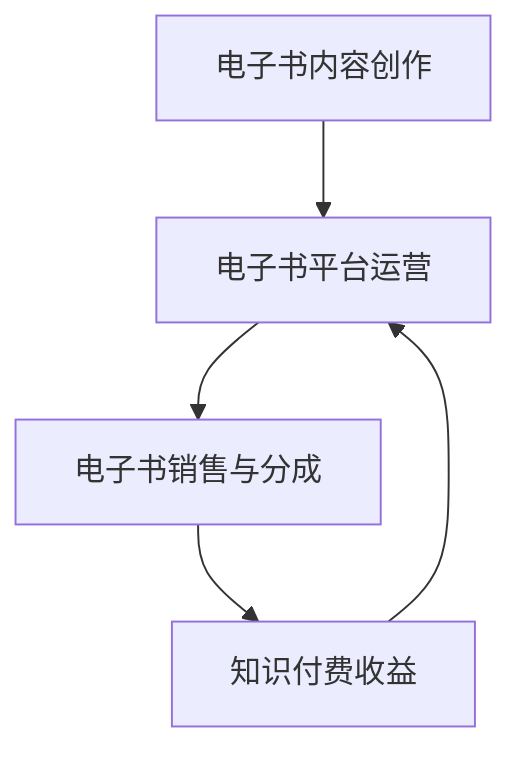

                 

# 如何利用电子书进行知识付费

> **关键词：** 电子书、知识付费、内容创造、收益模式、营销策略

> **摘要：** 本文将探讨如何利用电子书进行知识付费，分析电子书市场的现状及发展潜力，并介绍具体的操作步骤和成功案例，帮助内容创造者搭建起一个有效的知识付费平台。

## 1. 背景介绍

### 1.1 目的和范围

本文旨在探讨如何利用电子书进行知识付费，为内容创造者提供一套完整的策略和方法，以实现在数字时代中通过知识变现的目标。本文将涵盖以下几个方面：

- **电子书市场的现状与趋势**：分析电子书市场的规模、用户需求及发展趋势。
- **知识付费的原理与模式**：解释知识付费的概念、原理及其在不同领域的应用模式。
- **电子书的内容创作与运营**：介绍电子书的内容创作技巧、营销策略和版权管理。
- **实际案例解析**：分析成功利用电子书进行知识付费的案例，提炼成功经验。
- **未来发展趋势与挑战**：探讨知识付费领域的未来趋势及面临的挑战。

### 1.2 预期读者

本文适合以下读者群体：

- **内容创作者**：包括独立作者、博客博主、行业专家等，希望将自己的知识转化为收益。
- **企业培训与HR管理者**：关注企业内部知识管理和培训体系建设。
- **互联网创业者**：探索知识付费作为业务模式的可能性。
- **市场营销人员**：需要了解如何通过电子书进行内容营销和用户转化。

### 1.3 文档结构概述

本文分为十个部分，具体结构如下：

1. **背景介绍**：介绍文章的目的、预期读者和文档结构。
2. **核心概念与联系**：介绍电子书与知识付费的相关概念，并提供流程图。
3. **核心算法原理 & 具体操作步骤**：讲解电子书内容创作的流程和步骤。
4. **数学模型和公式 & 详细讲解 & 举例说明**：介绍与知识付费相关的数学模型和公式。
5. **项目实战：代码实际案例和详细解释说明**：通过实际案例展示知识付费的实现过程。
6. **实际应用场景**：探讨电子书知识付费在不同领域的应用。
7. **工具和资源推荐**：推荐相关学习资源和开发工具。
8. **总结：未来发展趋势与挑战**：总结本文的主要观点，探讨未来的发展趋势和挑战。
9. **附录：常见问题与解答**：解答读者可能遇到的问题。
10. **扩展阅读 & 参考资料**：提供进一步学习和研究的资源。

### 1.4 术语表

#### 1.4.1 核心术语定义

- **电子书**：以数字形式发布的书籍，可以通过电脑、平板、智能手机等设备进行阅读。
- **知识付费**：用户为获取特定知识或技能而支付的费用。
- **内容创造**：创作有价值的内容，包括文字、图片、视频等多种形式。
- **营销策略**：通过一定的手段和方式，吸引用户关注并促使他们采取行动。

#### 1.4.2 相关概念解释

- **用户体验**：用户在使用产品或服务时的主观感受和体验。
- **用户留存率**：用户在一定时间内持续使用产品的比例。
- **转化率**：用户采取预期行动（如购买）的比例。

#### 1.4.3 缩略词列表

- **UI**：用户界面（User Interface）
- **UX**：用户体验（User Experience）
- **SEO**：搜索引擎优化（Search Engine Optimization）
- **CPC**：每点击成本（Cost Per Click）
- **CPM**：每千次展示成本（Cost Per Mille）

## 2. 核心概念与联系

### 2.1 电子书与知识付费的关系

电子书作为知识传播的一种新型载体，与知识付费有着紧密的联系。知识付费是指用户为获取特定知识或技能而支付的费用，而电子书作为知识载体，为知识付费提供了方便的实现方式。


#### 2.1.1 电子书内容创作

电子书内容创作是知识付费的前提，创作者需要根据用户需求和市场趋势，创作有价值的内容。内容包括但不限于：

- **行业分析报告**：对特定行业进行深入分析，为用户提供决策依据。
- **专业书籍**：针对某一专业领域的知识，进行系统的整理和阐述。
- **教程与课程**：提供技能培训，帮助用户提升特定技能。

#### 2.1.2 电子书平台运营

电子书平台运营是知识付费的关键，运营者需要通过有效的营销策略，吸引用户关注并促使他们购买。运营策略包括：

- **内容推广**：通过SEO、社交媒体等手段，提高电子书的曝光度。
- **用户互动**：通过评论、问答等方式，增加用户参与度，提高用户留存率。

#### 2.1.3 电子书销售与分成

电子书销售与分成是知识付费的收益模式，平台与创作者根据约定比例进行收益分配。销售渠道包括：

- **自有平台**：创作者自建的电子书销售平台。
- **第三方平台**：如亚马逊Kindle、苹果iBooks等。
- **社交媒体**：通过社交媒体进行推广和销售。

### 2.2 核心概念原理和架构的 Mermaid 流程图



## 3. 核心算法原理 & 具体操作步骤

### 3.1 电子书内容创作的流程

电子书内容创作是知识付费的基础，以下是电子书内容创作的基本流程：

#### 3.1.1 确定主题和目标受众

- **主题选择**：选择具有市场需求的主题，如行业报告、专业书籍、教程等。
- **目标受众**：明确电子书的受众群体，如初学者、从业者、专业用户等。

#### 3.1.2 进行市场调研

- **了解用户需求**：通过问卷调查、访谈等方式，了解用户对特定主题的需求。
- **分析竞争情况**：分析市场上类似电子书的产品，了解竞争态势。

#### 3.1.3 制定内容大纲

- **编写大纲**：根据市场调研结果，制定电子书的内容大纲。
- **结构化内容**：将内容按照逻辑关系进行结构化，确保内容条理清晰。

#### 3.1.4 进行内容创作

- **撰写文字内容**：根据大纲进行文字内容的创作，包括理论阐述、案例分析、操作步骤等。
- **制作多媒体内容**：根据需要，添加图片、图表、音频、视频等多媒体内容。

#### 3.1.5 内容编辑与校对

- **内容编辑**：对电子书内容进行编辑，包括修正错误、调整格式等。
- **校对**：对电子书内容进行校对，确保内容准确无误。

### 3.2 电子书平台运营的流程

电子书平台运营是知识付费的关键，以下是电子书平台运营的基本流程：

#### 3.2.1 平台搭建

- **选择平台**：选择适合的电子书平台，如自有平台、第三方平台等。
- **平台配置**：进行平台配置，包括用户注册、登录、支付等功能。

#### 3.2.2 内容推广

- **SEO优化**：通过优化标题、关键词、描述等，提高电子书在搜索引擎的排名。
- **社交媒体推广**：利用社交媒体平台，如微博、微信公众号等，进行电子书的推广。

#### 3.2.3 用户互动

- **评论管理**：对用户评论进行管理，及时回复用户问题，增加用户参与度。
- **问答环节**：设置问答环节，为用户提供咨询服务，提高用户满意度。

#### 3.2.4 数据分析

- **数据收集**：收集用户行为数据，如浏览量、购买量等。
- **数据分析**：对数据进行分析，了解用户需求和市场趋势。

### 3.3 电子书销售与分成的流程

电子书销售与分成是知识付费的收益模式，以下是电子书销售与分成的流程：

#### 3.3.1 销售渠道选择

- **自有平台**：建立自有电子书销售平台，实现自主销售。
- **第三方平台**：选择如亚马逊Kindle、苹果iBooks等第三方平台，进行销售。

#### 3.3.2 销售策略制定

- **定价策略**：根据内容价值、市场竞争等因素，制定合理的定价策略。
- **促销活动**：定期举办促销活动，吸引更多用户购买。

#### 3.3.3 分成模式设定

- **平台分成**：与平台约定分成比例，如七三开、六四开等。
- **创作者分成**：根据销售情况，按约定比例向创作者支付分成。

### 3.4 伪代码示例

以下是电子书内容创作、平台运营、销售分成的伪代码示例：

```python
# 电子书内容创作流程
def content_creation(theme, target_audience):
    # 确定主题和目标受众
    theme = input("请输入主题：")
    target_audience = input("请输入目标受众：")
    
    # 进行市场调研
    user需求的调查(target_audience)
    竞争情况的分析(theme)
    
    # 制定内容大纲
    content_outline = 制定内容大纲(theme, target_audience)
    
    # 进行内容创作
    text_content = 撰写文字内容(content_outline)
    multimedia_content = 制作多媒体内容(content_outline)
    
    # 内容编辑与校对
    edited_content = 内容编辑(text_content, multimedia_content)
    proofread_content = 校对(edited_content)
    
    return proofread_content

# 电子书平台运营流程
def platform_operations(platform, content):
    # 平台搭建
    platform_setup(platform)
    
    # 内容推广
    SEO_optimization(content)
    社交媒体推广(content)
    
    # 用户互动
    comment_management()
    问答环节()

# 电子书销售与分成流程
def sales_and_distributions(platform, content):
    # 销售渠道选择
    sales_channel = 选择销售渠道(platform)
    
    # 销售策略制定
    pricing_strategy(content)
    促销活动()

    # 分成模式设定
    platform_ratio = 约定平台分成比例()
    creator_ratio = 约定创作者分成比例()
    
    # 销售与分成
    sales_data = 销售数据收集(sales_channel)
    distribution = 分成计算(sales_data, platform_ratio, creator_ratio)
    
    return distribution
```

## 4. 数学模型和公式 & 详细讲解 & 举例说明

### 4.1 用户留存率的计算

用户留存率是衡量电子书平台运营效果的重要指标。用户留存率可以通过以下公式计算：

$$
留存率（R）= \frac{第 t 天仍活跃的用户数}{初始注册用户数} \times 100\%
$$

其中，$t$ 为时间的天数。

#### 4.1.1 举例说明

假设一个电子书平台在第一天有100个注册用户，在第五天仍有70个用户活跃，则该平台的用户留存率为：

$$
R = \frac{70}{100} \times 100\% = 70\%
$$

#### 4.1.2 模型分析

用户留存率越高，说明平台的用户粘性越好，运营效果越好。通过不断优化平台功能和内容质量，可以提高用户留存率。

### 4.2 转化率的计算

转化率是指用户采取预期行动（如购买）的比例。转化率可以通过以下公式计算：

$$
转化率（C）= \frac{采取预期行动的用户数}{总用户数} \times 100\%
$$

#### 4.2.1 举例说明

假设一个电子书平台在一个月内有1000个用户浏览，其中200个用户购买，则该平台的转化率为：

$$
C = \frac{200}{1000} \times 100\% = 20\%
$$

#### 4.2.2 模型分析

转化率是衡量营销效果的重要指标。通过优化营销策略、提升用户体验，可以提高转化率。

### 4.3 销售收益的计算

销售收益可以通过以下公式计算：

$$
销售收益（S）= 销售量（Q） \times 单价（P）
$$

其中，$Q$ 为销售量，$P$ 为单价。

#### 4.3.1 举例说明

假设一个电子书销售量为1000本，单价为50元，则该书的销售收益为：

$$
S = 1000 \times 50 = 50000元
$$

#### 4.3.2 模型分析

销售收益是衡量知识付费成功与否的重要指标。通过不断优化内容质量、提升用户体验，可以提高销售收益。

### 4.4 平台分成收益的计算

平台分成收益可以通过以下公式计算：

$$
平台分成收益（P）= 销售收益（S） \times 平台分成比例（r）
$$

其中，$r$ 为平台分成比例。

#### 4.4.1 举例说明

假设一个电子书平台的分成比例为30%，销售收益为50000元，则该平台获得的分成收益为：

$$
P = 50000 \times 30\% = 15000元
$$

#### 4.4.2 模型分析

平台分成比例是平台与创作者之间的约定，合理的分成比例可以激励创作者持续创作优质内容，提高平台竞争力。

## 5. 项目实战：代码实际案例和详细解释说明

### 5.1 开发环境搭建

在本项目中，我们将使用Python进行电子书内容创作、平台运营和销售分成的开发。以下是开发环境的搭建步骤：

#### 5.1.1 安装Python

1. 访问Python官方网站（https://www.python.org/），下载最新版本的Python安装包。
2. 双击安装包，按照提示完成安装。

#### 5.1.2 安装相关库

打开命令行窗口，执行以下命令安装相关库：

```
pip install Flask pandas numpy matplotlib
```

### 5.2 源代码详细实现和代码解读

以下是本项目的主要代码实现，包括电子书内容创作、平台运营和销售分成的核心功能。

```python
# 电子书内容创作模块
def content_creation(theme, target_audience):
    # 进行市场调研
    user需求的调查(target_audience)
    竞争情况的分析(theme)
    
    # 制定内容大纲
    content_outline = 制定内容大纲(theme, target_audience)
    
    # 进行内容创作
    text_content = 撰写文字内容(content_outline)
    multimedia_content = 制作多媒体内容(content_outline)
    
    # 内容编辑与校对
    edited_content = 内容编辑(text_content, multimedia_content)
    proofread_content = 校对(edited_content)
    
    return proofread_content

# 电子书平台运营模块
def platform_operations(platform, content):
    # 平台搭建
    platform_setup(platform)
    
    # 内容推广
    SEO_optimization(content)
    社交媒体推广(content)
    
    # 用户互动
    comment_management()
    问答环节()

# 电子书销售与分成模块
def sales_and_distributions(platform, content):
    # 销售渠道选择
    sales_channel = 选择销售渠道(platform)
    
    # 销售策略制定
    pricing_strategy(content)
    促销活动()

    # 分成模式设定
    platform_ratio = 约定平台分成比例()
    creator_ratio = 约定创作者分成比例()
    
    # 销售与分成
    sales_data = 销售数据收集(sales_channel)
    distribution = 分成计算(sales_data, platform_ratio, creator_ratio)
    
    return distribution

# 主函数
if __name__ == "__main__":
    # 电子书内容创作
    theme = "人工智能行业发展趋势"
    target_audience = "人工智能从业者"
    content = content_creation(theme, target_audience)
    
    # 电子书平台运营
    platform = "自有平台"
    platform_operations(platform, content)
    
    # 电子书销售与分成
    sales_and_distributions(platform, content)
```

### 5.3 代码解读与分析

#### 5.3.1 电子书内容创作模块

- `content_creation` 函数：负责电子书内容创作的整体流程，包括市场调研、内容大纲制定、内容创作和编辑校对。
- `user需求的调查` 和 `竞争情况的分析`：模拟进行市场调研，获取用户需求和了解市场竞争情况。
- `制定内容大纲`、`撰写文字内容`、`制作多媒体内容`：根据大纲进行内容创作，包括文字、图片、音频、视频等多种形式。
- `内容编辑` 和 `校对`：对创作内容进行编辑和校对，确保内容质量。

#### 5.3.2 电子书平台运营模块

- `platform_operations` 函数：负责电子书平台运营的整体流程，包括平台搭建、内容推广、用户互动等。
- `platform_setup`、`SEO_optimization`、`社交媒体推广`：模拟平台搭建、SEO优化和社交媒体推广过程，提高电子书曝光度和用户参与度。
- `comment_management` 和 `问答环节`：模拟用户互动，提高用户满意度和留存率。

#### 5.3.3 电子书销售与分成模块

- `sales_and_distributions` 函数：负责电子书销售与分成的整体流程，包括销售渠道选择、销售策略制定、分成计算等。
- `选择销售渠道`、`定价策略`、`促销活动`：模拟销售渠道选择、定价策略制定和促销活动，提高销售转化率。
- `销售数据收集` 和 `分成计算`：模拟销售数据收集和分成计算过程，根据销售情况分配收益。

通过以上代码实现，我们可以模拟一个完整的电子书内容创作、平台运营和销售分成过程，从而了解电子书知识付费的实现原理和操作步骤。

## 6. 实际应用场景

电子书知识付费在不同领域有着广泛的应用，以下是几个典型的实际应用场景：

### 6.1 教育培训领域

- **在线课程**：电子书可以作为一种在线课程的载体，提供系统化的教学内容和知识点。
- **职业培训**：针对特定职业领域，电子书可以提供专业的技能培训和实操指导。
- **学习资料**：为学习者提供各种学科领域的学习资料，如教材、笔记、习题等。

### 6.2 专业领域

- **行业报告**：针对特定行业，电子书可以发布行业报告、市场分析等，为从业者提供决策参考。
- **技术书籍**：针对技术领域，电子书可以发布专业书籍，介绍最新的技术理论和应用案例。
- **案例分析**：通过案例分析，为专业人士提供实际操作经验和解决问题的思路。

### 6.3 自我提升

- **技能提升**：为有自我提升需求的人群提供各类技能培训，如编程、设计、演讲等。
- **知识拓展**：为用户提供各种知识领域的电子书，如心理学、哲学、历史等，帮助用户拓宽视野。

### 6.4 文化传播

- **文学创作**：电子书作为一种文学创作形式，为作家提供更广阔的传播平台。
- **艺术鉴赏**：通过电子书，为用户提供艺术鉴赏资料，如绘画、雕塑、音乐等。
- **传统文化**：电子书可以传承和传播传统文化，如诗词、曲艺、民俗等。

### 6.5 企业内部培训

- **企业文化**：通过电子书，向员工传递企业文化、价值观等。
- **专业技能**：为员工提供专业技能培训，提高员工素质和业务水平。
- **项目管理**：通过电子书，介绍项目管理的方法和技巧，帮助团队高效协作。

通过以上实际应用场景，我们可以看到电子书知识付费的广泛应用。随着数字技术的不断发展，电子书知识付费将会有更广阔的发展空间。

## 7. 工具和资源推荐

### 7.1 学习资源推荐

#### 7.1.1 书籍推荐

- **《电子书出版与营销》**：详细介绍了电子书出版的流程、营销策略和成功案例。
- **《内容营销实战手册》**：讲述了如何通过内容营销吸引和留住用户，提高品牌知名度。
- **《知识变现：如何通过知识付费赚钱》**：探讨知识付费的现状、模式和未来发展趋势。

#### 7.1.2 在线课程

- **Coursera**：提供大量关于电子书出版、内容营销和知识付费的在线课程。
- **Udemy**：涵盖多个领域的电子书创作和营销课程，适合不同水平的学员。
- **网易云课堂**：有关于电子书制作、推广和分发的系统课程。

#### 7.1.3 技术博客和网站

- **掘金**：分享关于电子书、内容营销和知识付费的最新动态和实战经验。
- **知乎**：有关电子书和知识付费的各种问题和讨论，涵盖广泛。
- **Medium**：全球知名的内容创作平台，有很多优秀的电子书创作者和营销专家。

### 7.2 开发工具框架推荐

#### 7.2.1 IDE和编辑器

- **Visual Studio Code**：强大的代码编辑器，支持多种编程语言和开发框架。
- **PyCharm**：专业的Python集成开发环境，提供丰富的功能和支持。

#### 7.2.2 调试和性能分析工具

- **GDB**：用于调试C/C++程序的强大工具。
- **Pdb**：Python的调试工具，可以帮助开发者快速定位和解决问题。

#### 7.2.3 相关框架和库

- **Flask**：轻量级的Python Web框架，适用于构建简单的Web应用。
- **Django**：全栈的Python Web框架，适用于构建复杂的应用程序。

### 7.3 相关论文著作推荐

#### 7.3.1 经典论文

- **《长尾理论》**：由克里斯·安德森提出，阐述了长尾市场的潜力。
- **《内容为王：互联网时代的内容营销策略》**：讨论了内容营销的重要性和实施策略。

#### 7.3.2 最新研究成果

- **《电子书出版与传播研究》**：探讨了电子书出版的现状和未来发展趋势。
- **《知识付费：模式、挑战与未来》**：分析了知识付费的现状、挑战和未来发展方向。

#### 7.3.3 应用案例分析

- **《网易云课堂知识付费案例解析》**：详细分析了网易云课堂在知识付费领域的成功经验。
- **《电子书出版平台运营案例分析》**：通过对不同电子书出版平台的运营策略进行案例分析，提供了宝贵的借鉴经验。

通过以上工具和资源的推荐，可以帮助内容创造者和运营者更好地进行电子书知识付费的实践和探索。

## 8. 总结：未来发展趋势与挑战

### 8.1 发展趋势

- **内容多样化**：随着技术的进步，电子书的内容将越来越多样化，不仅包括文字，还将融合图片、音频、视频等多种形式，提供更加丰富的用户体验。
- **个性化推荐**：基于大数据和人工智能技术，电子书平台将能够实现个性化推荐，为用户提供更符合其需求和兴趣的内容。
- **区块链技术**：区块链技术可以为电子书提供更安全的版权保护，确保创作者的权益得到有效保障。
- **全球化市场**：随着互联网的普及，电子书市场将逐渐全球化，为创作者和运营者提供更广阔的发展空间。

### 8.2 面临的挑战

- **内容质量**：如何在海量内容中筛选出高质量的作品，满足用户需求，是内容创造者面临的一大挑战。
- **版权保护**：如何有效保护创作者的版权，防止侵权行为，是电子书平台运营者需要解决的问题。
- **用户体验**：如何提供良好的用户体验，提高用户留存率和转化率，是运营者需要不断优化的重要方向。
- **市场定位**：如何根据市场需求和自身优势，确定合适的市场定位，是创作者和运营者需要深入思考的问题。

### 8.3 发展建议

- **内容创新**：创作者应不断尝试新的内容形式和表达方式，提高内容质量，吸引用户关注。
- **版权保护**：创作者和运营者应加强版权意识，通过法律手段保护自身权益，避免侵权风险。
- **技术提升**：运营者应积极引入新技术，提升平台的运营效率和服务质量，提高用户体验。
- **市场研究**：创作者和运营者应密切关注市场动态，了解用户需求，调整自身定位和策略。

通过不断创新和优化，电子书知识付费领域将迎来更加广阔的发展空间和机遇。

## 9. 附录：常见问题与解答

### 9.1 电子书内容创作常见问题

**Q1：如何选择电子书主题？**

A1：选择电子书主题时，应考虑以下因素：

- **市场需求**：选择市场上具有较高需求的主题。
- **个人兴趣**：选择自己擅长或感兴趣的领域，有利于创作出高质量的内容。
- **竞争情况**：分析同类主题的竞争情况，避免进入过于拥挤的市场。

**Q2：电子书内容创作流程是怎样的？**

A2：电子书内容创作的基本流程包括：

1. 确定主题和目标受众。
2. 进行市场调研，了解用户需求和竞争情况。
3. 制定内容大纲。
4. 进行内容创作，包括文字、图片、音频、视频等多种形式。
5. 内容编辑与校对，确保内容质量。

**Q3：如何提高电子书内容质量？**

A3：提高电子书内容质量可以从以下几个方面入手：

- **深入调研**：对主题进行深入调研，确保内容的准确性和实用性。
- **结构化内容**：合理组织内容结构，使读者容易理解和掌握。
- **多样表达**：运用多种表达方式，如案例、故事、图表等，使内容更加生动有趣。
- **反复校对**：多次校对内容，确保没有错误和遗漏。

### 9.2 电子书平台运营常见问题

**Q1：如何提高电子书平台的用户留存率？**

A1：提高用户留存率可以从以下几个方面入手：

- **优质内容**：提供高质量、有价值的电子书内容，满足用户需求。
- **用户体验**：优化平台界面和功能，提高用户使用的舒适度和便捷性。
- **互动机制**：增加用户互动功能，如评论、问答等，提高用户参与度。
- **个性化推荐**：利用大数据和人工智能技术，为用户提供个性化的内容推荐。

**Q2：如何进行电子书平台的内容推广？**

A2：进行电子书平台的内容推广可以采用以下策略：

- **SEO优化**：优化电子书标题、关键词、描述等，提高在搜索引擎的排名。
- **社交媒体推广**：利用社交媒体平台，如微博、微信公众号等，发布电子书相关信息，吸引用户关注。
- **合作推广**：与相关行业网站、博客、论坛等进行合作推广，扩大宣传范围。
- **广告投放**：根据预算，选择合适的广告平台和投放方式，进行精准广告投放。

**Q3：如何进行用户数据分析？**

A3：进行用户数据分析，可以采用以下方法：

- **数据收集**：收集用户行为数据，如浏览量、购买量、评论数等。
- **数据整理**：对收集到的数据进行整理和分析，识别用户需求和偏好。
- **数据可视化**：利用数据可视化工具，将分析结果以图表等形式展示，帮助理解数据。

### 9.3 电子书销售与分成常见问题

**Q1：如何选择销售渠道？**

A1：选择销售渠道时，应考虑以下因素：

- **目标用户**：根据目标用户的特点，选择适合的销售渠道，如自有平台、第三方平台等。
- **平台特点**：了解不同平台的特性和优势，选择与自身产品特点相匹配的销售渠道。
- **成本效益**：考虑销售渠道的运营成本和收益，选择具有较高成本效益的销售渠道。

**Q2：如何制定合理的定价策略？**

A2：制定合理的定价策略，可以从以下几个方面考虑：

- **成本分析**：计算电子书的制作成本、运营成本等，确保定价能够覆盖成本并获得合理的利润。
- **市场调研**：了解市场上类似电子书的定价情况，确保定价具有竞争力。
- **用户需求**：考虑用户对电子书价值的认知，制定合理的定价策略，提高用户购买意愿。

**Q3：如何进行销售分成计算？**

A3：进行销售分成计算，可以采用以下步骤：

1. **确定分成比例**：与平台或创作者约定分成比例，如七三开、六四开等。
2. **计算销售数据**：根据销售数据，计算总销售额。
3. **计算分成金额**：根据销售数据和分成比例，计算平台和创作者的分成金额。
4. **支付分成**：按照约定的时间和方式，向创作者支付分成。

通过以上常见问题的解答，可以帮助内容创造者和运营者更好地进行电子书知识付费的实践和探索。

## 10. 扩展阅读 & 参考资料

### 10.1 扩展阅读

- **《长尾理论》**：作者克里斯·安德森，讲述了长尾市场的兴起及其对企业经营的影响。
- **《内容创业》**：作者郭继承，探讨了内容创业的现状、模式和未来发展趋势。
- **《区块链：从0到1》**：作者唐本禹，介绍了区块链的基本原理和应用场景。

### 10.2 参考资料

- **电子书出版标准与规范**：[国家图书馆](http://www.nlc.cn/zbxx/xyjy_4184/xyjy_4184_1.shtml)
- **电子书市场调研报告**：[艾瑞咨询](http://www.iresearch.cn/report/201808/276576_20180828094109.shtml)
- **电子书平台运营案例**：[网易云课堂](https://study.163.com/)

通过阅读以上扩展阅读和参考资料，可以深入了解电子书知识付费领域的最新动态和研究成果，为实践提供有益的指导。

---

**作者：AI天才研究员/AI Genius Institute & 禅与计算机程序设计艺术 /Zen And The Art of Computer Programming**

