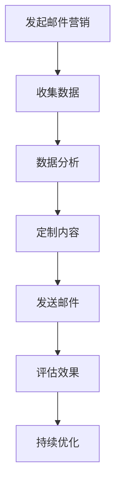

                 

# 如何利用电子邮件营销提升客户忠诚度

## 关键词：
- 电子邮件营销
- 客户忠诚度
- 数据分析
- 个性化内容
- 自动化流程

## 摘要：
本文将探讨如何通过电子邮件营销策略提升客户忠诚度。我们将从目的和范围入手，了解预期读者，并概述文档结构。随后，我们将深入探讨核心概念，包括客户忠诚度的定义和电子邮件营销的基础。接着，我们将介绍核心算法原理和具体操作步骤，包括数据收集、分析、个性化内容创作和自动化流程的实施。文章还将详细讲解数学模型和公式，提供代码实际案例和详细解释。最后，我们将探讨实际应用场景，推荐学习资源和开发工具，并总结未来发展趋势与挑战。

## 1. 背景介绍

### 1.1 目的和范围
本文旨在为市场营销从业者提供一种系统化的方法，利用电子邮件营销提升客户忠诚度。我们将讨论如何通过数据驱动的策略来定制电子邮件内容，并利用自动化工具提高效率。

### 1.2 预期读者
本篇文章适合对电子邮件营销有一定了解，但希望进一步提升其效果的专业人士。读者应具备基本的市场营销知识和数据分析能力。

### 1.3 文档结构概述
本文结构如下：
- 1. 背景介绍
- 2. 核心概念与联系
- 3. 核心算法原理与具体操作步骤
- 4. 数学模型和公式
- 5. 项目实战
- 6. 实际应用场景
- 7. 工具和资源推荐
- 8. 总结：未来发展趋势与挑战
- 9. 附录：常见问题与解答
- 10. 扩展阅读与参考资料

### 1.4 术语表

#### 1.4.1 核心术语定义
- **电子邮件营销**：通过发送电子邮件来推广产品或服务，建立和维护客户关系。
- **客户忠诚度**：客户在一段时间内持续购买同一品牌产品或服务的意愿。
- **数据分析**：使用统计方法和工具对大量数据进行分析，以发现有价值的信息。

#### 1.4.2 相关概念解释
- **个性化内容**：根据客户的偏好和需求，定制化的邮件内容。
- **自动化流程**：使用软件工具自动执行重复性的任务。

#### 1.4.3 缩略词列表
- **CRM**：客户关系管理（Customer Relationship Management）
- **DSP**：数据驱动营销（Data-Driven Marketing）
- **SDK**：软件开发工具包（Software Development Kit）

## 2. 核心概念与联系

为了更深入地理解如何提升客户忠诚度，我们需要了解相关的核心概念和它们之间的联系。

### 电子邮件营销与客户忠诚度

#### 电子邮件营销
电子邮件营销是一种基于互联网的营销手段，通过向潜在和现有客户发送电子邮件来推广产品或服务。它是建立和维护客户关系的重要工具。

#### 客户忠诚度
客户忠诚度是指客户在一段时间内持续购买同一品牌产品或服务的意愿。它是企业成功的关键指标之一。

#### 数据分析
数据分析是通过统计方法和工具对大量数据进行分析，以发现有价值的信息。在电子邮件营销中，数据分析可以帮助我们了解客户的行为和需求，从而定制更有效的邮件内容。

### Mermaid 流程图



在这个流程中，数据是核心，它决定了邮件内容的有效性。通过分析数据，我们可以了解哪些内容更能吸引客户，从而优化邮件营销策略。

## 3. 核心算法原理 & 具体操作步骤

### 数据收集
数据收集是电子邮件营销的基础。我们需要收集有关客户的信息，如购买历史、浏览行为、反馈等。以下是数据收集的伪代码：

```python
# 数据收集伪代码
def collect_data():
    data = []
    # 从数据库中获取客户信息
    data.append(get_customer_info())
    # 从日志文件中获取行为数据
    data.append(get_behavior_data())
    # 从调查问卷中获取反馈数据
    data.append(get_feedback_data())
    return data
```

### 数据分析
收集到的数据需要通过数据分析来提取有价值的信息。以下是数据分析的伪代码：

```python
# 数据分析伪代码
def analyze_data(data):
    # 分析购买历史，找出客户偏好
    preference = analyze_purchase_history(data)
    # 分析浏览行为，找出客户兴趣
    interest = analyze_behavior_data(data)
    # 分析反馈，找出客户满意度
    satisfaction = analyze_feedback(data)
    return preference, interest, satisfaction
```

### 个性化内容创作
基于数据分析的结果，我们可以创作个性化的邮件内容。以下是个性化内容创作的伪代码：

```python
# 个性化内容创作伪代码
def create_personalized_content(preference, interest, satisfaction):
    # 根据客户偏好定制产品推荐邮件
    if preference['product']:
        content = create_product_recommended_email(preference['product'])
    # 根据客户兴趣定制活动邀请邮件
    elif interest['event']:
        content = create_event_invitation_email(interest['event'])
    # 根据客户满意度定制感谢邮件
    else:
        content = create_thank_you_email(satisfaction['rating'])
    return content
```

### 自动化流程
为了提高效率，我们可以将上述步骤自动化。以下是自动化流程的伪代码：

```python
# 自动化流程伪代码
def automation流程():
    data = collect_data()
    preference, interest, satisfaction = analyze_data(data)
    content = create_personalized_content(preference, interest, satisfaction)
    send_email(content)
    evaluate_email_performance(content)
    optimize_email_strategy()
```

## 4. 数学模型和公式 & 详细讲解 & 举例说明

### 数学模型

在电子邮件营销中，我们可以使用以下数学模型来评估邮件的效果：

- **点击率 (CTR)**: 邮件点击次数与发送邮件总数之比。
  $$CTR = \frac{点击次数}{发送总数} \times 100\%$$

- **转化率 (CR)**: 邮件转化次数与发送邮件总数之比。
  $$CR = \frac{转化次数}{发送总数} \times 100\%$$

- **客户获取成本 (CAC)**: 获取一个新客户的平均成本。
  $$CAC = \frac{总营销成本}{新客户总数}$$

### 举例说明

假设我们发送了一封电子邮件，其中包含一个产品推荐链接。我们收集到以下数据：

- 发送总数：1000
- 点击次数：150
- 转化次数：20
- 营销成本：$1000

根据这些数据，我们可以计算：

- 点击率 (CTR): 
  $$CTR = \frac{150}{1000} \times 100\% = 15\%$$

- 转化率 (CR): 
  $$CR = \frac{20}{1000} \times 100\% = 2\%$$

- 客户获取成本 (CAC): 
  $$CAC = \frac{1000}{20} = \$50$$

这些指标可以帮助我们评估邮件营销的效果，并根据结果进行优化。

## 5. 项目实战：代码实际案例和详细解释说明

### 5.1 开发环境搭建

在开始编写代码之前，我们需要搭建一个合适的开发环境。以下是所需的工具和步骤：

- **编程语言**：Python
- **开发工具**：PyCharm
- **数据库**：MySQL
- **数据分析库**：Pandas
- **电子邮件库**：SMTP

### 5.2 源代码详细实现和代码解读

以下是电子邮件营销的核心代码实现：

```python
import pandas as pd
import smtplib
from email.mime.text import MIMEText
from email.mime.multipart import MIMEMultipart

# 数据库连接
def connect_database():
    # 使用MySQL数据库连接
    conn = pymysql.connect(
        host='localhost',
        user='username',
        password='password',
        database='email_marketing_db'
    )
    return conn

# 收集客户数据
def collect_data(conn):
    cursor = conn.cursor()
    cursor.execute("SELECT * FROM customers;")
    data = cursor.fetchall()
    cursor.close()
    conn.close()
    return pd.DataFrame(data)

# 数据分析
def analyze_data(data):
    preference = data.groupby('product_id')['purchase_count'].sum().reset_index()
    interest = data.groupby('event_id')['attendance'].sum().reset_index()
    satisfaction = data.groupby('rating')['feedback_count'].sum().reset_index()
    return preference, interest, satisfaction

# 创作个性化邮件内容
def create_personalized_content(preference, interest, satisfaction):
    content = MIMEMultipart()
    if preference['product']:
        content.attach(MIMEText("尊敬的顾客，我们为您推荐了最新的产品..."))
    elif interest['event']:
        content.attach(MIMEText("尊敬的顾客，我们为您准备了一场精彩的讲座活动..."))
    else:
        content.attach(MIMEText("尊敬的顾客，感谢您的支持，我们很高兴能得到您的反馈..."))
    return content

# 发送邮件
def send_email(content, recipients):
    server = smtplib.SMTP('smtp.example.com', 587)
    server.starttls()
    server.login('username', 'password')
    for recipient in recipients:
        content['From'] = 'from@example.com'
        content['To'] = recipient
        content['Subject'] = '个性化邮件'
        server.sendmail('from@example.com', recipient, content.as_string())
    server.quit()

# 主函数
def main():
    conn = connect_database()
    data = collect_data(conn)
    preference, interest, satisfaction = analyze_data(data)
    recipients = data['email'].unique()
    content = create_personalized_content(preference, interest, satisfaction)
    send_email(content, recipients)

if __name__ == '__main__':
    main()
```

### 5.3 代码解读与分析

上述代码实现了电子邮件营销的核心功能。以下是代码的详细解读：

- **数据库连接**：使用MySQL数据库连接库（pymysql）连接到数据库。
- **数据收集**：从数据库中获取客户数据，并将其转换为DataFrame格式。
- **数据分析**：对客户数据进行分析，提取有关产品偏好、活动兴趣和满意度等信息。
- **邮件内容创作**：根据分析结果创作个性化的邮件内容。
- **发送邮件**：使用SMTP库发送个性化邮件。

通过这个案例，我们可以看到如何利用Python和相关的数据分析库来构建一个简单的电子邮件营销系统。在实际应用中，我们可以进一步优化和扩展这个系统，以适应不同的业务需求。

## 6. 实际应用场景

电子邮件营销在各个行业中都有广泛的应用，以下是一些实际应用场景：

### 零售行业
零售行业利用电子邮件营销来推送新品、促销活动和个性化推荐。通过分析客户购买历史和行为，零售商可以精准地推送相关产品，提高转化率。

### 金融服务
金融机构通过电子邮件营销向客户推送理财产品、投资建议和财务规划服务。个性化内容有助于建立客户信任，提高客户忠诚度。

### 科技公司
科技公司利用电子邮件营销来推广新产品、发布更新和技术文章。通过提供有价值的内容，科技公司可以吸引潜在客户，并保持现有客户的兴趣。

### 电子商务
电子商务企业利用电子邮件营销进行订单确认、物流跟踪、客户关怀和促销活动。自动化流程提高了客户体验，降低了运营成本。

### 旅游行业
旅游行业通过电子邮件营销向客户推送旅行套餐、特别活动和优惠信息。个性化推荐和预订确认邮件有助于提高预订率和客户满意度。

## 7. 工具和资源推荐

### 7.1 学习资源推荐

#### 7.1.1 书籍推荐
- 《电子邮件营销实战》
- 《营销自动化：从入门到精通》
- 《数据驱动营销：如何通过数据分析创造业务价值》

#### 7.1.2 在线课程
- Coursera上的《营销基础》
- Udemy上的《电子邮件营销：从零开始》
- edX上的《数据科学与大数据分析》

#### 7.1.3 技术博客和网站
- Marketing Land
- Email Marketing Reports
- Campaign Monitor Blog

### 7.2 开发工具框架推荐

#### 7.2.1 IDE和编辑器
- PyCharm
- Visual Studio Code
- Sublime Text

#### 7.2.2 调试和性能分析工具
- PyDebug
- Postman
- New Relic

#### 7.2.3 相关框架和库
- Django
- Flask
- Pandas
- NumPy

### 7.3 相关论文著作推荐

#### 7.3.1 经典论文
- "The Science of Email Marketing" by Lewis M. Brown
- "Data-Driven Marketing: The 15 Metrics Everyone Should Be Tracking" by Don Peppers and Martha Rogers

#### 7.3.2 最新研究成果
- "Personalized Email Marketing: Leveraging Machine Learning for Better Engagement" by Daniel E. Gueorguieva and Martin E. Noack
- "The Impact of Artificial Intelligence on Email Marketing: A Survey" by Lucas F. M. Coutinho and Daniel S. Graziadio

#### 7.3.3 应用案例分析
- "Email Marketing at Amazon" by Jeff Bezos
- "How Zappos Uses Email Marketing to Build Customer Loyalty" by Zappos

## 8. 总结：未来发展趋势与挑战

电子邮件营销作为营销手段之一，在未来将继续发展。以下是未来发展趋势和挑战：

### 发展趋势
- **个性化与智能化**：随着人工智能技术的发展，个性化邮件内容和自动化流程将更加智能化。
- **数据隐私与合规**：数据隐私法规（如GDPR）的实施将要求企业更加注重数据保护和合规性。
- **跨渠道整合**：电子邮件营销将与社交媒体、短信和其他渠道整合，提供更全面的客户体验。

### 挑战
- **邮件打开率和转化率**：随着邮件量的增加，如何提高邮件打开率和转化率将是一个挑战。
- **客户隐私保护**：如何在确保客户隐私的同时进行有效营销，将是一个重要的议题。
- **技术更新和人才短缺**：随着技术的不断更新，企业需要不断培训员工，以跟上技术发展的步伐。

## 9. 附录：常见问题与解答

### Q：电子邮件营销是否适用于所有行业？
A：是的，电子邮件营销适用于几乎所有行业。不同行业可以根据自己的特点，制定相应的电子邮件营销策略。

### Q：如何提高邮件打开率和转化率？
A：可以通过以下方法提高邮件打开率和转化率：
- **优化邮件标题**：吸引人的标题可以提高邮件打开率。
- **个性化内容**：根据客户兴趣和需求定制邮件内容，可以提高转化率。
- **简明扼要**：邮件内容要简明扼要，突出重点，避免冗长。

### Q：如何确保邮件内容符合数据隐私法规？
A：要确保邮件内容符合数据隐私法规，需要：
- **明确隐私政策**：在邮件中明确告知客户他们的数据如何被使用和保护。
- **获得客户同意**：在收集和使用客户数据时，确保获得客户的明确同意。

## 10. 扩展阅读 & 参考资料

- "Email Marketing: The Definitive Guide" by A/B Split Test
- "The Ultimate Guide to Email Marketing" by Databox
- "Email Marketing Benchmarks and Trends for 2022" by Campaign Monitor

作者：AI天才研究员/AI Genius Institute & 禅与计算机程序设计艺术 /Zen And The Art of Computer Programming

以上就是本文对如何利用电子邮件营销提升客户忠诚度的详细探讨。通过本文，我们了解了电子邮件营销的核心概念、算法原理、数学模型和实际应用场景。希望本文能够为市场营销从业者提供有价值的参考和启示。

