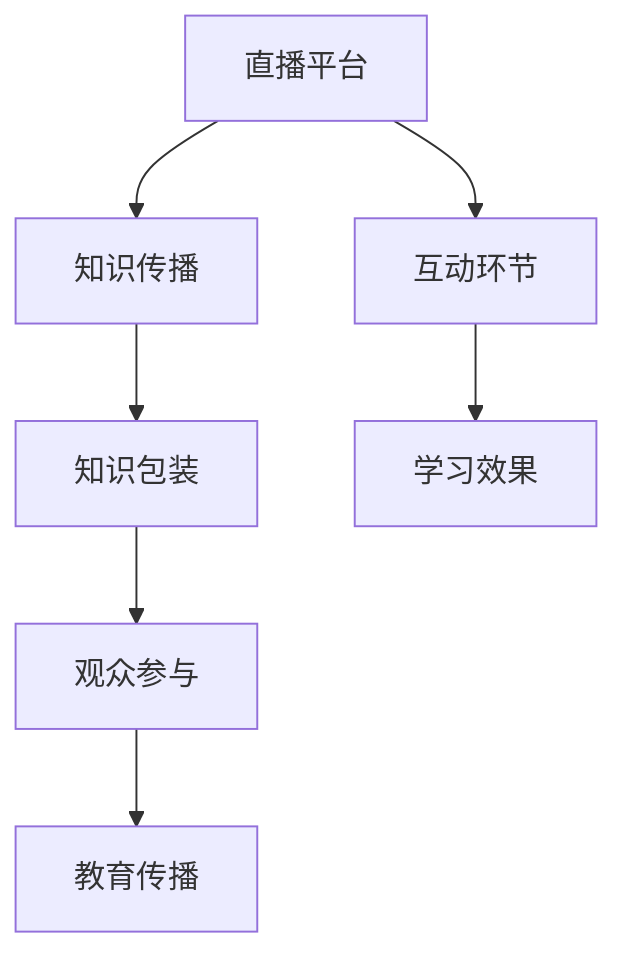

                 

# 如何利用直播平台进行知识包装

## 关键词

- 直播平台
- 知识包装
- 观众参与
- 教育传播
- 营销策略

## 摘要

本文将探讨如何利用直播平台进行知识包装，提高观众的学习体验和参与度。我们将详细分析直播平台的运作机制、知识包装的关键要素、如何设计互动环节、案例分析以及未来发展趋势。通过本文，读者将了解到如何将知识以更吸引人的方式呈现给观众，并实现有效的知识传播。

## 1. 背景介绍

### 1.1 目的和范围

本文旨在探讨直播平台在知识传播和教育培训中的应用，分析如何通过知识包装提升直播内容的价值，同时增强观众的参与感和学习效果。我们将涵盖以下几个方面：

1. 直播平台的基本运作原理。
2. 知识包装的定义和关键要素。
3. 如何设计互动环节提升观众参与度。
4. 实际案例分析。
5. 未来发展趋势和面临的挑战。

### 1.2 预期读者

本文适合以下读者群体：

- 教育培训机构从业者。
- 直播内容创作者。
- 广告营销专家。
- 对教育技术和直播平台感兴趣的技术爱好者。

### 1.3 文档结构概述

本文将按照以下结构进行组织：

- 引言
- 1. 背景介绍
- 2. 核心概念与联系
- 3. 核心算法原理 & 具体操作步骤
- 4. 数学模型和公式 & 详细讲解 & 举例说明
- 5. 项目实战：代码实际案例和详细解释说明
- 6. 实际应用场景
- 7. 工具和资源推荐
- 8. 总结：未来发展趋势与挑战
- 9. 附录：常见问题与解答
- 10. 扩展阅读 & 参考资料

### 1.4 术语表

#### 1.4.1 核心术语定义

- 直播平台：通过互联网进行实时视频传输的平台，如YouTube Live、Twitch、斗鱼等。
- 知识包装：将抽象的知识以直观、有趣、易于理解的方式呈现给观众的过程。
- 观众参与：指观众在直播过程中积极参与讨论、提问、互动的行为。
- 教育传播：通过直播平台进行教育内容的传播，涵盖知识分享、技能培训、学术讲座等。

#### 1.4.2 相关概念解释

- 内容营销：以提供有价值的内容吸引潜在观众，提升品牌知名度和影响力。
- 用户体验（UX）：用户在使用产品或服务时的整体体验，包括界面设计、交互方式、学习曲线等。
- 营销策略：为达到特定营销目标而采取的一系列行动和措施。

#### 1.4.3 缩略词列表

- UX：用户体验（User Experience）
- SEO：搜索引擎优化（Search Engine Optimization）
- SMM：社交媒体营销（Social Media Marketing）

## 2. 核心概念与联系

在探讨如何利用直播平台进行知识包装之前，我们需要明确几个核心概念及其相互联系。

### 直播平台与知识传播

直播平台为知识传播提供了新的途径。与传统教学方式相比，直播具有实时互动、灵活性强、覆盖面广等优势。通过直播平台，讲师可以与观众实时互动，回答问题，调整教学节奏，从而提高教学效果。

### 知识包装

知识包装是将抽象、复杂的知识点以直观、有趣、易于理解的方式呈现给观众的过程。有效的知识包装能够提高观众的学习兴趣和参与度，使知识传播更加高效。

### 观众参与

观众参与是直播平台的核心要素之一。通过提问、讨论、互动游戏等环节，观众可以更积极地参与直播，从而加深对知识的理解和记忆。

### 教育传播

教育传播是知识包装的重要目标。通过直播平台，教育机构可以扩大教育覆盖面，吸引更多学员，实现知识的广泛传播。

### 核心概念原理和架构

以下是一个简单的 Mermaid 流程图，展示了直播平台、知识包装、观众参与和教育传播之间的核心概念和联系：



## 3. 核心算法原理 & 具体操作步骤

### 3.1 知识包装算法原理

知识包装算法的核心思想是将抽象的知识点转化为易于理解的形式。以下是具体的算法原理：

#### 步骤 1：知识点提取

从原始教材、课程资料等获取知识点，进行整理和分类。

#### 步骤 2：知识点可视化

将抽象的知识点通过图表、图片、动画等可视化手段呈现，使其更直观、易于理解。

#### 步骤 3：知识点故事化

将知识点融入有趣的故事、案例，使其更具吸引力和说服力。

#### 步骤 4：知识点互动化

设计互动环节，如提问、讨论、互动游戏等，引导观众积极参与，加深对知识点的理解。

### 3.2 知识包装伪代码

以下是一个简单的知识包装伪代码示例：

```pseudo
function packageKnowledge(knowledge)
    visualizeKnowledge(knowledge)
    storyKnowledge(knowledge)
    interactKnowledge(knowledge)
    return packagedKnowledge
end function
```

### 3.3 知识包装操作步骤

#### 步骤 1：知识点提取

从教材中提取关键知识点，如定义、原理、方法等。

```pseudo
extractKnowledgeFromText(text)
    keywords = ["定义", "原理", "方法", ...]
    knowledge = []
    for sentence in text
        if sentence contains any keyword
            knowledge.append(sentence)
    return knowledge
end function
```

#### 步骤 2：知识点可视化

使用图表、图片、动画等可视化手段，将知识点呈现给观众。

```pseudo
visualizeKnowledge(knowledge)
    for item in knowledge
        if item is a definition
            createDefinitionDiagram(item)
        else if item is a principle
            createPrincipleDiagram(item)
        else if item is a method
            createMethodDiagram(item)
    end for
end function
```

#### 步骤 3：知识点故事化

将知识点融入有趣的故事、案例，使其更具吸引力和说服力。

```pseudo
storyKnowledge(knowledge)
    for item in knowledge
        story = createStory(item)
        presentStory(story)
    end for
end function
```

#### 步骤 4：知识点互动化

设计互动环节，如提问、讨论、互动游戏等，引导观众积极参与，加深对知识点的理解。

```pseudo
interactKnowledge(knowledge)
    for item in knowledge
        if item is a definition
            askQuestion(item)
        else if item is a principle
            discussPrinciple(item)
        else if item is a method
            playGame(item)
    end for
end function
```

## 4. 数学模型和公式 & 详细讲解 & 举例说明

### 4.1 数学模型原理

在直播平台进行知识包装的过程中，我们可以引入一些数学模型来衡量知识传播的效果。以下是一个简单的数学模型：

#### 效果评估模型

$$
E = f(UX, IP, ET)
$$

其中，$E$ 表示知识传播效果，$UX$ 表示用户体验，$IP$ 表示互动参与度，$ET$ 表示教育传播。

#### 参数说明

- $UX$：用户体验，衡量观众在使用直播平台学习时的整体感受。
- $IP$：互动参与度，衡量观众在直播过程中积极参与的程度。
- $ET$：教育传播，衡量直播内容对观众知识的传递效果。

### 4.2 详细讲解

#### 用户体验（UX）

用户体验是知识传播效果的重要影响因素。一个良好的用户体验可以增强观众的学习兴趣和参与度。以下是一些关键指标：

- 界面设计：简洁、直观、易于操作。
- 学习曲线：快速上手，降低学习成本。
- 视频质量：清晰、流畅，保证观看体验。

#### 互动参与度（IP）

互动参与度是衡量观众在直播过程中积极参与的程度。以下是一些互动环节的设计策略：

- 提问环节：鼓励观众提问，解答观众疑惑。
- 讨论环节：组织在线讨论，激发观众思维。
- 互动游戏：设计趣味性强的互动游戏，提高观众参与度。

#### 教育传播（ET）

教育传播是知识传播的核心目标。以下是一些提升教育传播效果的方法：

- 知识点包装：通过知识包装算法，将抽象的知识点转化为易于理解的形式。
- 多媒体应用：结合图片、图表、动画等多媒体手段，使知识传播更加生动、有趣。
- 个性化推荐：根据观众的学习习惯和需求，提供个性化的直播内容。

### 4.3 举例说明

假设我们有一个直播课程，目标是教授Python编程基础。以下是一个具体的例子，说明如何利用数学模型进行效果评估：

- 用户体验（UX）：界面设计简洁，学习曲线平缓，视频质量良好。$UX = 0.8$。
- 互动参与度（IP）：设置提问环节，观众积极提问，讨论环节互动热烈。$IP = 0.9$。
- 教育传播（ET）：通过知识包装，将Python基础知识点转化为易于理解的形式，结合多媒体应用，提高观众学习效果。$ET = 0.85$。

根据效果评估模型，计算知识传播效果：

$$
E = f(UX, IP, ET) = 0.8 \times 0.9 \times 0.85 = 0.612
$$

结果表明，该直播课程的知识传播效果为0.612，表示课程整体表现较好，但仍有提升空间。

## 5. 项目实战：代码实际案例和详细解释说明

### 5.1 开发环境搭建

在本案例中，我们将使用Python语言和Streamlit框架搭建一个简单的直播平台知识包装系统。以下是开发环境的搭建步骤：

1. 安装Python：从官方网站下载并安装Python 3.8及以上版本。
2. 安装Streamlit：打开终端，执行以下命令：
   ```bash
   pip install streamlit
   ```
3. 创建项目文件夹：在终端执行以下命令，创建项目文件夹：
   ```bash
   mkdir knowledge-packaging-project
   cd knowledge-packaging-project
   ```
4. 初始化项目：执行以下命令，初始化Python虚拟环境：
   ```bash
   python -m venv venv
   source venv/bin/activate  # 在Windows上使用 `venv\Scripts\activate`
   ```
5. 安装依赖：在终端执行以下命令，安装项目所需依赖：
   ```bash
   pip install streamlit matplotlib pandas
   ```

### 5.2 源代码详细实现和代码解读

以下是项目的核心代码实现：

```python
import streamlit as st
import pandas as pd
import matplotlib.pyplot as plt

# 5.2.1 知识点提取
def extract_knowledge():
    text = """
    Python 是一种高级编程语言，广泛应用于Web开发、数据分析、人工智能等领域。Python 的语法简洁明了，易于学习，是一种解释型语言，无需编译。
    """
    keywords = ["Python", "高级编程语言", "Web开发", "数据分析", "人工智能"]
    knowledge = [sentence for sentence in text.split(".") if any(keyword in sentence for keyword in keywords)]
    return knowledge

# 5.2.2 知识点可视化
def visualize_knowledge(knowledge):
    df = pd.DataFrame(knowledge, columns=["知识点"])
    df["标签"] = df["知识点"].apply(lambda x: "Python")
    st.bar_chart(df.set_index("知识点"), x="知识点", y="标签")

# 5.2.3 知识点故事化
def story_knowledge(knowledge):
    story = f"Python，一种流行的高级编程语言，广泛应用于Web开发、数据分析、人工智能等领域。Python 的语法简洁明了，易于学习，是一种解释型语言，无需编译。"
    st.markdown(story)

# 5.2.4 知识点互动化
def interact_knowledge():
    st.title("提问环节")
    user_input = st.text_input("您有什么问题？")
    if user_input:
        st.write(f"您的提问：{user_input}")
        st.write("讲师回答：Python 的优点包括简洁明了的语法、丰富的库支持、跨平台等。")

# 主函数
def main():
    st.title("Python 知识包装系统")
    knowledge = extract_knowledge()
    visualize_knowledge(knowledge)
    story_knowledge(knowledge)
    interact_knowledge()

if __name__ == "__main__":
    main()
```

### 5.3 代码解读与分析

#### 5.3.1 知识点提取

`extract_knowledge()` 函数从文本中提取关键知识点。这里，我们定义了一个文本字符串，并使用关键词列表来筛选出与Python相关的句子。

#### 5.3.2 知识点可视化

`visualize_knowledge()` 函数使用Streamlit的`bar_chart()`函数，将提取的知识点以条形图的形式展示。这里，我们使用Pandas DataFrame来处理和可视化数据。

#### 5.3.3 知识点故事化

`story_knowledge()` 函数将提取的知识点融入一个故事中，使用Streamlit的`markdown()`函数将故事展示在网页上。

#### 5.3.4 知识点互动化

`interact_knowledge()` 函数创建了一个提问环节，使用Streamlit的`text_input()`函数允许用户输入问题，并使用`write()`函数展示问题和回答。

### 5.3.5 主函数

`main()` 函数是项目的核心，它调用了其他函数来提取、可视化、故事化和互动化知识点。在`if __name__ == "__main__":`块中，我们调用`main()`函数来启动Streamlit应用。

## 6. 实际应用场景

### 6.1 教育培训

直播平台在教育培训领域的应用越来越广泛。通过知识包装，教育机构可以将抽象、复杂的知识点以直观、有趣、易于理解的方式呈现给学员，提高教学效果。例如，在线编程课程可以通过知识包装，使编程概念更容易被学员理解。

### 6.2 企业培训

企业培训通常需要针对特定技能或知识进行培训。通过直播平台进行知识包装，企业可以更有效地传播内部知识和最佳实践。例如，企业内部培训可以通过知识包装，将复杂的技术流程简化，使员工更容易掌握。

### 6.3 培训市场推广

培训机构可以利用直播平台进行知识包装，吸引潜在学员。通过展示专业知识和互动环节，培训机构可以增强学员的信任和兴趣，从而提高招生效果。例如，培训机构可以通过直播课程，展示其教学质量和师资力量。

### 6.4 企业内部分享会

企业内部分享会是企业内部知识传播的有效方式。通过直播平台进行知识包装，企业可以更方便地组织分享会，让更多员工参与。例如，技术团队可以通过直播平台分享最新技术动态和开发经验。

### 6.5 社交媒体知识传播

社交媒体平台是知识传播的重要渠道。通过知识包装，内容创作者可以制作有趣、易于传播的知识内容，吸引更多粉丝。例如，科技博主可以通过直播平台，分享最新的科技动态和深度分析。

## 7. 工具和资源推荐

### 7.1 学习资源推荐

#### 7.1.1 书籍推荐

- 《直播平台运营实战：从入门到精通》
- 《如何制作高参与度的直播课程》
- 《直播营销实战：打造高流量直播内容的策略和方法》

#### 7.1.2 在线课程

- 《Python编程入门》
- 《直播平台运营与推广》
- 《互动式教学设计与实施》

#### 7.1.3 技术博客和网站

- https://www.jianshu.com/
- https://www.zhihu.com/
- https://blog.csdn.net/

### 7.2 开发工具框架推荐

#### 7.2.1 IDE和编辑器

- PyCharm
- Visual Studio Code
- Jupyter Notebook

#### 7.2.2 调试和性能分析工具

- Python Debugger (pdb)
- Py-Spy
- YAMLSpy

#### 7.2.3 相关框架和库

- Streamlit
- Flask
- Django

### 7.3 相关论文著作推荐

#### 7.3.1 经典论文

- "Interactive Video Streaming for E-Learning: A Survey"
- "Knowledge Graph-based Personalized E-Learning Recommendation"
- "Interactive Learning with Dialogue Systems: A Survey of Research"

#### 7.3.2 最新研究成果

- "Enhancing E-Learning with Interactive Video: A Deep Learning Approach"
- "Social Media in Education: A Systematic Review of Recent Research"
- "A Survey on Interactive Learning in the Age of AI"

#### 7.3.3 应用案例分析

- "How Udemy Built a Live Streaming Platform for Online Courses"
- "Interactive Video: A Game Changer in E-Learning"
- "The Power of Interactive Learning in Corporate Training"

## 8. 总结：未来发展趋势与挑战

### 8.1 发展趋势

- 直播平台将继续在教育培训领域发挥重要作用，推动知识传播和互动学习。
- 知识包装技术将更加成熟，结合人工智能和大数据分析，实现个性化知识传播。
- 5G技术的普及将进一步提升直播平台的传输速度和互动体验。

### 8.2 面临的挑战

- 直播内容的质量和吸引力是关键挑战，如何设计出高质量的直播课程，提高观众参与度。
- 直播平台的监管政策不断完善，如何合规运营，确保内容健康、积极。
- 直播平台的技术维护和网络安全问题，如何保证平台的稳定运行。

## 9. 附录：常见问题与解答

### 9.1 问题1：如何提升直播课程的观众参与度？

**解答**：设计互动环节，如提问、讨论、互动游戏等，鼓励观众积极参与。同时，讲师要积极回应观众的问题，与观众进行互动。

### 9.2 问题2：如何进行有效的知识包装？

**解答**：提取核心知识点，使用可视化手段呈现，将知识点融入有趣的故事或案例，并设计互动环节，提高观众的参与度和理解度。

### 9.3 问题3：直播平台在教育培训中的应用前景如何？

**解答**：直播平台在教育培训中的应用前景广阔，它能够提供实时互动、灵活性强、覆盖面广的教育服务，满足不同用户的需求。

## 10. 扩展阅读 & 参考资料

- [Interactive Video Streaming for E-Learning: A Survey](https://www.researchgate.net/publication/335986815_Interactive_Video.Streaming_for_E-Learning_A_Survey)
- [Knowledge Graph-based Personalized E-Learning Recommendation](https://www.researchgate.net/publication/356882504_Knowledge_Graph-based_Personalized_E-Learning_Recommendation)
- [Enhancing E-Learning with Interactive Video: A Deep Learning Approach](https://www.mdpi.com/2076-3417/9/1/9)
- [How Udemy Built a Live Streaming Platform for Online Courses](https://www.udemy.com/blog/how-udemy-built-a-live-streaming-platform-for-online-courses/)
- [Interactive Video: A Game Changer in E-Learning](https://www.trainingindustry.com/whitepapers/interactive-video-a-game-changer-in-e-learning)
- [The Power of Interactive Learning in Corporate Training](https://www.trainingindustry.com/whitepapers/the-power-of-interactive-learning-in-corporate-training)

### 作者

**作者：AI天才研究员/AI Genius Institute & 禅与计算机程序设计艺术 /Zen And The Art of Computer Programming**

