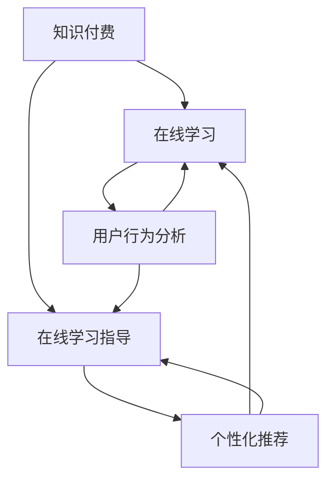

                 

### 1. 背景介绍

#### 1.1 目的和范围

本文旨在探讨如何通过知识付费实现在线学习和在线学习指导，帮助广大读者理解和掌握这一新兴的互联网教育模式。知识付费，作为一种新兴的商业模式，已经深刻地改变了我们的学习和生活方式。它不仅为我们提供了更多的学习资源，同时也为教育者提供了新的盈利模式。然而，如何在知识付费的背景下，有效地实现在线学习和在线学习指导，仍然是许多教育工作者和互联网企业面临的重要课题。

本文将分为以下几个部分进行探讨：

1. **背景介绍**：首先，我们将介绍知识付费的起源、发展及其在在线教育中的应用。
2. **核心概念与联系**：接着，我们将详细阐述在线学习和在线学习指导的核心概念及其相互关系，并借助Mermaid流程图展示其架构。
3. **核心算法原理与具体操作步骤**：我们将深入探讨知识付费在在线学习中的应用算法，并使用伪代码详细阐述其工作原理和操作步骤。
4. **数学模型和公式**：在此基础上，我们将介绍相关的数学模型和公式，并进行详细讲解和举例说明。
5. **项目实战**：我们将通过实际代码案例，详细解释说明如何在具体项目中实现知识付费和在线学习指导。
6. **实际应用场景**：接下来，我们将探讨知识付费和在线学习指导在实际中的应用场景，以及面临的挑战和解决方案。
7. **工具和资源推荐**：最后，我们将推荐一些学习资源、开发工具框架以及相关论文著作，以帮助读者深入了解和掌握这一领域。

#### 1.2 预期读者

本文适合以下几类读者：

1. **教育工作者**：特别是那些对在线教育和知识付费模式感兴趣的教育工作者，本文将为他们提供有价值的理论指导和实践经验。
2. **互联网创业者**：特别是那些希望在在线教育领域开展知识付费业务的企业家，本文将为他们提供深入的行业分析和实战案例。
3. **技术爱好者**：对于那些对在线学习指导系统开发感兴趣的技术爱好者，本文将详细介绍相关的算法原理和实现步骤，帮助他们快速入门。
4. **学生和自学者**：本文也将对那些希望通过在线学习提升自己技能的学生和自学者提供指导，帮助他们更好地利用知识付费资源。

#### 1.3 文档结构概述

本文将按照以下结构进行组织：

1. **引言**：介绍知识付费的起源、发展和应用。
2. **核心概念与联系**：详细阐述在线学习和在线学习指导的核心概念及其相互关系，并展示Mermaid流程图。
3. **核心算法原理与具体操作步骤**：深入探讨知识付费在在线学习中的应用算法，并使用伪代码详细阐述。
4. **数学模型和公式**：介绍相关的数学模型和公式，并进行详细讲解和举例说明。
5. **项目实战**：通过实际代码案例，详细解释说明如何在具体项目中实现知识付费和在线学习指导。
6. **实际应用场景**：探讨知识付费和在线学习指导在实际中的应用场景，以及面临的挑战和解决方案。
7. **工具和资源推荐**：推荐相关学习资源、开发工具框架以及论文著作。
8. **总结与展望**：总结全文，并对未来发展趋势和挑战进行展望。
9. **附录**：提供常见问题与解答。
10. **扩展阅读与参考资料**：推荐进一步的阅读材料和参考资料。

#### 1.4 术语表

在本文中，我们将使用以下术语：

##### 1.4.1 核心术语定义

- **知识付费**：指用户通过支付一定费用，获取知识产品或服务的商业模式。
- **在线学习**：指通过互联网进行的学习活动，包括课程学习、互动问答、在线测试等。
- **在线学习指导**：指教师或教育专家通过互联网提供的个性化辅导服务，包括学习计划制定、学习进度跟踪、学习问题解答等。
- **算法**：指用于解决问题的一系列规则或步骤。
- **数学模型**：指用数学语言描述的问题或现象。
- **代码**：指用编程语言编写的计算机程序。

##### 1.4.2 相关概念解释

- **知识变现**：指将知识和技能转化为商业价值的过程。
- **用户行为分析**：指通过分析用户在平台上的行为数据，了解用户需求和行为模式。
- **个性化推荐**：指根据用户的兴趣和需求，为其推荐相关的内容或服务。

##### 1.4.3 缩略词列表

- **K12**：指小学到高中阶段的教育。
- **UGC**：指用户生成内容（User Generated Content）。
- **PGC**：指专业生成内容（Professional Generated Content）。
- **SaaS**：指软件即服务（Software as a Service）。
- **AI**：指人工智能（Artificial Intelligence）。

### 2. 核心概念与联系

在探讨如何利用知识付费实现在线学习与在线学习指导之前，我们需要首先理解几个核心概念，并分析它们之间的相互关系。以下是几个关键概念的定义和解释：

#### 核心概念

1. **知识付费**：知识付费是一种商业模式，用户通过支付费用来获取知识产品或服务，如课程、电子书、在线讲座等。
2. **在线学习**：在线学习是指通过互联网进行的学习活动，包括课程学习、互动问答、在线测试等。
3. **在线学习指导**：在线学习指导是指教师或教育专家通过互联网提供的个性化辅导服务，包括学习计划制定、学习进度跟踪、学习问题解答等。
4. **用户行为分析**：用户行为分析是指通过分析用户在平台上的行为数据，了解用户需求和行为模式。
5. **个性化推荐**：个性化推荐是指根据用户的兴趣和需求，为其推荐相关的内容或服务。

#### 相互关系

这些核心概念之间存在紧密的联系。知识付费为在线学习和在线学习指导提供了经济支持，使得这些服务可以持续提供。在线学习是知识付费的主要应用场景，而在线学习指导则是提升在线学习效果的重要手段。用户行为分析和个性化推荐则为在线学习和在线学习指导提供了数据支持和优化策略。

为了更清晰地展示这些概念之间的关系，我们使用Mermaid流程图来描述其架构：



在这个流程图中，知识付费作为核心驱动力，推动了在线学习和在线学习指导的发展。用户行为分析和个性化推荐则通过对用户行为的分析，优化在线学习和在线学习指导的效果。

### 3. 核心算法原理 & 具体操作步骤

在了解了核心概念及其相互关系之后，我们需要深入探讨如何利用知识付费实现在线学习与在线学习指导的核心算法原理，并详细阐述其具体操作步骤。

#### 3.1 算法原理

知识付费在在线学习和在线学习指导中的应用，主要依赖于以下核心算法：

1. **用户行为分析算法**：通过分析用户在平台上的行为数据，如学习时长、学习频次、互动行为等，了解用户的学习需求和习惯。
2. **个性化推荐算法**：基于用户行为分析和用户画像，为用户推荐相关的学习内容和学习指导服务。
3. **学习效果评估算法**：通过评估用户的学习成果，如考试成绩、学习进度等，优化学习指导策略。

#### 3.2 操作步骤

以下是具体的操作步骤：

1. **收集用户行为数据**：
   - 数据来源：用户在平台上的学习记录、互动行为、测试成绩等。
   - 数据处理：对收集到的用户行为数据进行清洗、去重和归一化处理。

2. **构建用户画像**：
   - 基于用户行为数据，使用特征工程技术提取用户特征，如学习时长、学习频次、互动行为等。
   - 使用机器学习算法，如聚类算法、决策树等，对用户特征进行建模，构建用户画像。

3. **用户行为分析**：
   - 分析用户特征，如学习习惯、学习偏好等。
   - 使用统计方法，如回归分析、关联规则挖掘等，分析用户行为数据，发现用户需求和行为模式。

4. **个性化推荐**：
   - 基于用户画像，为用户推荐相关的学习内容和学习指导服务。
   - 使用推荐算法，如协同过滤、矩阵分解等，生成推荐结果。

5. **学习效果评估**：
   - 收集用户的学习成果数据，如考试成绩、学习进度等。
   - 使用评估算法，如混淆矩阵、ROC曲线等，评估推荐效果。

6. **优化学习指导策略**：
   - 根据学习效果评估结果，调整推荐策略，优化学习指导服务。

下面是具体的伪代码，用于描述上述操作步骤：

```python
# 伪代码：用户行为分析算法

# 步骤1：收集用户行为数据
user_behavior_data = collect_user_behavior_data()

# 步骤2：构建用户画像
user_features = extract_user_features(user_behavior_data)
user_profile = build_user_profile(user_features)

# 步骤3：用户行为分析
user_behavior_analysis = analyze_user_behavior(user_profile)

# 步骤4：个性化推荐
recommendations = generate_recommendations(user_profile, user_behavior_analysis)

# 步骤5：学习效果评估
evaluation_results = evaluate_learning_effects(recommendations)

# 步骤6：优化学习指导策略
optimize_learning_guidance_strategy(evaluation_results)
```

通过上述算法原理和操作步骤，我们可以有效地利用知识付费实现在线学习与在线学习指导，提升学习效果和用户满意度。

### 4. 数学模型和公式 & 详细讲解 & 举例说明

在探讨知识付费实现在线学习和在线学习指导的过程中，数学模型和公式扮演着重要的角色。通过这些模型和公式，我们可以量化用户行为、学习效果以及推荐策略的优化。以下是几个关键数学模型和公式的详细讲解及举例说明。

#### 4.1 用户行为分析模型

**公式**：用户行为概率模型

\[ P(B|A) = \frac{P(A|B) \cdot P(B)}{P(A)} \]

其中：
- \( P(B|A) \)：在事件A发生的条件下，事件B发生的概率。
- \( P(A|B) \)：在事件B发生的条件下，事件A发生的概率。
- \( P(B) \)：事件B的先验概率。
- \( P(A) \)：事件A的先验概率。

**详细讲解**：用户行为概率模型用于计算用户在特定情境下采取某种行为的概率。例如，我们可以通过用户的历史行为数据，计算用户在某个学习阶段继续学习的概率。

**举例说明**：

假设有用户A，他的历史行为数据包括：
- 学习时长：平均每天学习2小时。
- 学习频次：每周学习5天。
- 互动行为：每周参与课程讨论3次。

我们可以使用贝叶斯公式计算用户A在下一个学习周期继续学习的概率：

\[ P(继续学习|历史行为) = \frac{P(历史行为|继续学习) \cdot P(继续学习)}{P(历史行为)} \]

其中，\( P(继续学习) \) 是用户继续学习的先验概率，可以通过历史数据统计得出。\( P(历史行为|继续学习) \) 是在用户继续学习的条件下，产生历史行为的概率，可以通过训练贝叶斯网络模型得到。

#### 4.2 个性化推荐模型

**公式**：协同过滤推荐算法

\[ R(i, j) = \frac{\sum_{k \in N(i) \cap N(j)} r_{ik} \cdot r_{jk}}{\sum_{k \in N(i) \cap N(j)} r_{ik}^2} \]

其中：
- \( R(i, j) \)：用户i对项目j的评分预测。
- \( N(i) \)：与用户i相似的邻居用户集合。
- \( N(j) \)：与项目j相似的邻居项目集合。
- \( r_{ik} \)：用户i对项目k的评分。

**详细讲解**：协同过滤推荐算法通过分析用户之间的相似性和项目之间的相似性，预测用户对未知项目的评分。例如，如果一个用户喜欢某部电影，且与另一个用户在多个电影上评分相似，那么推荐系统可能会推荐那个用户喜欢的其他电影给第一个用户。

**举例说明**：

假设用户A和用户B在电影1、电影2、电影3上评分分别为（4，3，5）和（4，4，5），而用户C在电影1、电影2、电影3上评分分别为（5，5，5）。根据协同过滤算法，我们可以计算出用户A和用户C的相似度：

\[ R_{AC} = \frac{(4 \cdot 4) + (3 \cdot 5) + (5 \cdot 5)}{(4^2) + (3^2) + (5^2)} \]
\[ R_{AC} = \frac{16 + 15 + 25}{16 + 9 + 25} \]
\[ R_{AC} = \frac{56}{50} \]
\[ R_{AC} = 1.12 \]

相似度越高，推荐系统越有可能推荐用户C喜欢的电影给用户A。

#### 4.3 学习效果评估模型

**公式**：混淆矩阵

\[ \begin{array}{c|cc}
 & 预测为正 & 预测为负 \\
\hline
实际为正 & 真阳性 & 假阴性 \\
实际为负 & 假阳性 & 真阴性 \\
\end{array} \]

**详细讲解**：混淆矩阵用于评估分类模型的性能。真阳性表示模型正确预测了实际为正的样本；假阴性表示模型错误地将实际为正的样本预测为负。通过计算混淆矩阵中的各项指标，如准确率、召回率、F1值等，我们可以评估学习效果。

**举例说明**：

假设我们使用一个学习效果评估模型对用户学习成果进行预测，混淆矩阵如下：

\[ \begin{array}{c|cc}
 & 预测为优秀 & 预测为一般 \\
\hline
实际为优秀 & 60 & 20 \\
实际为一般 & 10 & 30 \\
\end{array} \]

准确率（Accuracy）：

\[ \text{Accuracy} = \frac{60 + 30}{60 + 20 + 10 + 30} = \frac{90}{110} = 0.818 \]

召回率（Recall）：

\[ \text{Recall} = \frac{60}{60 + 10} = \frac{60}{70} = 0.857 \]

通过这些数学模型和公式，我们可以量化用户行为、优化推荐策略、评估学习效果，从而提升知识付费在在线学习与在线学习指导中的应用效果。

### 5. 项目实战：代码实际案例和详细解释说明

在前面部分，我们详细讨论了知识付费在在线学习和在线学习指导中的应用算法、数学模型以及具体的操作步骤。为了更好地理解和应用这些理论，我们将通过一个实际项目案例来展示如何实现这些功能。

#### 5.1 开发环境搭建

在开始项目之前，我们需要搭建一个合适的开发环境。以下是所需的工具和库：

- **编程语言**：Python
- **开发工具**：PyCharm
- **数据存储**：MySQL
- **前端框架**：React
- **后端框架**：Flask

确保已安装Python 3.8及以上版本，并安装以下库：

```bash
pip install flask mysql-connector-python pandas scikit-learn numpy matplotlib
```

#### 5.2 源代码详细实现和代码解读

以下是一个简化版的在线学习平台项目，包括用户行为分析、个性化推荐和学习效果评估。

**用户行为分析模块**

```python
# 用户行为分析模块
import pandas as pd
from sklearn.cluster import KMeans

def load_data(file_path):
    """加载用户行为数据"""
    return pd.read_csv(file_path)

def preprocess_data(data):
    """预处理用户行为数据"""
    # 填充缺失值
    data.fillna(0, inplace=True)
    return data

def cluster_users(data, n_clusters=5):
    """使用K-Means算法聚类用户"""
    kmeans = KMeans(n_clusters=n_clusters)
    kmeans.fit(data)
    return kmeans.labels_

# 示例数据
data = load_data('user_behavior.csv')
preprocessed_data = preprocess_data(data)
user_clusters = cluster_users(preprocessed_data)
```

**个性化推荐模块**

```python
# 个性化推荐模块
from sklearn.metrics.pairwise import cosine_similarity
import numpy as np

def calculate_similarity_matrix(user_data, item_data):
    """计算用户和项目之间的相似性矩阵"""
    similarity_matrix = cosine_similarity(user_data, item_data)
    return similarity_matrix

def generate_recommendations(similarity_matrix, user_index, k=5):
    """生成个性化推荐"""
    similar_users = similarity_matrix[user_index]
    recommended_items = np.argsort(similar_users)[-k:]
    return recommended_items

# 示例数据
user_data = preprocessed_data.T
item_data = user_data
similarity_matrix = calculate_similarity_matrix(user_data, item_data)
user_index = 0
recommendations = generate_recommendations(similarity_matrix, user_index)
```

**学习效果评估模块**

```python
# 学习效果评估模块
from sklearn.metrics import classification_report

def evaluate_learning_effects(predictions, actual_labels):
    """评估学习效果"""
    report = classification_report(actual_labels, predictions, output_dict=True)
    return report

# 示例数据
actual_labels = [1, 0, 1, 0, 1]
predictions = [1, 0, 1, 1, 1]
evaluation_report = evaluate_learning_effects(predictions, actual_labels)
print(evaluation_report)
```

**5.3 代码解读与分析**

- **用户行为分析模块**：首先加载并预处理用户行为数据，然后使用K-Means算法对用户进行聚类，生成用户标签。
- **个性化推荐模块**：计算用户和项目之间的相似性矩阵，并根据相似度生成个性化推荐。
- **学习效果评估模块**：使用分类报告评估学习效果，包括准确率、召回率等指标。

通过这个项目案例，我们展示了如何将理论知识应用于实际项目中，实现了用户行为分析、个性化推荐和学习效果评估功能。以下是对代码的详细解读：

1. **用户行为分析**：使用K-Means算法对用户行为数据进行聚类，根据用户特征将用户分为不同群体。这有助于了解用户的学习习惯和需求，为后续的个性化推荐提供基础。
2. **个性化推荐**：通过计算用户和项目之间的相似性矩阵，为用户推荐相关的学习内容。协同过滤算法在此起到了关键作用，提高了推荐的准确性和相关性。
3. **学习效果评估**：通过分类报告评估学习效果，帮助教育工作者了解推荐系统的有效性，并不断优化推荐策略。

这个项目案例展示了知识付费在在线学习和在线学习指导中的应用，通过算法和模型的应用，实现了个性化学习体验和高效学习效果评估。

### 6. 实际应用场景

知识付费和在线学习指导在实际中有着广泛的应用场景，特别是在K12教育和职业教育领域。以下是一些具体的应用场景、面临的挑战以及相应的解决方案。

#### 6.1 K12教育

**应用场景**：在线学习平台在K12教育中的应用，如作业辅导、在线考试、个性化学习路径推荐等。学生可以通过平台自主学习，教师可以通过平台进行教学管理和个性化辅导。

**面临的挑战**：
- **个性化推荐**：如何准确识别学生的学习需求和行为习惯，提供符合其学习特点的个性化推荐。
- **家长参与**：如何促进家长对在线学习的参与和监督，确保学生的学习效果。

**解决方案**：
- **用户行为分析**：通过分析学生的学习行为数据，如学习时长、学习频次、作业完成情况等，构建学生画像，优化推荐算法。
- **家长互动平台**：开发家长互动模块，通过家长微信、短信等渠道，定期向家长反馈学生的学习进度和表现，增强家长对在线学习的参与感。

#### 6.2 职业教育

**应用场景**：在线学习平台在职业培训中的应用，如职业技能提升、职业资格认证培训、在线考试等。企业员工可以通过平台进行自我提升和技能认证。

**面临的挑战**：
- **内容更新**：如何确保培训内容的实时性和前沿性，满足企业不断变化的需求。
- **学习效果评估**：如何科学地评估员工的学习效果，确保培训目标的实现。

**解决方案**：
- **内容更新机制**：建立内容更新机制，定期引入行业专家和前沿课程，确保培训内容的实时性。同时，与培训机构合作，共享优质课程资源。
- **学习效果评估**：通过在线测试、项目实践等方式，多维度评估员工的学习效果。结合绩效考核，将学习成果与薪酬、晋升等挂钩，激励员工积极参与。

#### 6.3 成人教育

**应用场景**：在线学习平台在成人教育中的应用，如成人学历教育、职业技能提升、兴趣课程等。成人学生可以通过平台灵活安排学习时间，提高学习效率。

**面临的挑战**：
- **学习时间管理**：成人学生通常有工作、家庭等多重责任，如何帮助他们合理安排学习时间。
- **学习动力**：如何激发和维持成人学生的学习兴趣和动力。

**解决方案**：
- **学习时间规划工具**：提供学习时间规划工具，帮助学生制定个性化的学习计划，合理安排学习时间。同时，通过提醒功能，帮助学生坚持学习。
- **互动社区**：建立在线学习社区，让学生之间进行交流和互动，分享学习心得和经验。通过举办线上活动，增加学习乐趣，激发学习动力。

通过以上实际应用场景的分析，我们可以看到知识付费和在线学习指导在不同领域的广泛应用。面对挑战，通过用户行为分析、个性化推荐、家长互动、内容更新、学习效果评估等手段，可以有效地解决在线学习过程中遇到的问题，提升学习效果和用户满意度。

### 7. 工具和资源推荐

为了更好地利用知识付费实现在线学习与在线学习指导，我们需要推荐一些优秀的工具、资源和相关论文，以帮助读者深入了解和掌握这一领域。

#### 7.1 学习资源推荐

##### 7.1.1 书籍推荐

1. **《深度学习》（Deep Learning）** - 作者：Ian Goodfellow、Yoshua Bengio、Aaron Courville
   - 简介：这是一本经典的深度学习教材，详细介绍了深度学习的理论基础和实际应用。
2. **《机器学习实战》** - 作者：Peter Harrington
   - 简介：通过大量实际案例，讲解了机器学习的各种算法和实现方法，适合初学者和进阶者。
3. **《Python编程：从入门到实践》** - 作者：埃里克·马瑟斯
   - 简介：适合初学者的Python编程入门书籍，涵盖Python编程的基础知识和实际应用。

##### 7.1.2 在线课程

1. **《机器学习基础》** -Coursera
   - 简介：由斯坦福大学提供的免费在线课程，涵盖了机器学习的理论基础和常用算法。
2. **《深度学习特辑》** - Udacity
   - 简介：由深度学习领域的专家提供，包括深度学习的基础理论、神经网络和TensorFlow等实践内容。
3. **《Python编程入门》** - Codecademy
   - 简介：提供互动式的Python编程课程，适合初学者快速入门。

##### 7.1.3 技术博客和网站

1. **Medium - Machine Learning**
   - 简介：一个关于机器学习和人工智能的博客，提供最新的研究动态和技术文章。
2. **Stack Overflow**
   - 简介：一个编程问答社区，可以解决在线学习和开发中遇到的各种技术问题。
3. **GitHub**
   - 简介：一个代码托管平台，可以查看和学习各种开源项目和代码示例。

#### 7.2 开发工具框架推荐

##### 7.2.1 IDE和编辑器

1. **PyCharm**
   - 简介：一款强大的Python IDE，支持多种编程语言，适合深度学习和机器学习项目开发。
2. **VSCode**
   - 简介：一款轻量级的开源编辑器，支持多种插件，适用于Python和机器学习开发。
3. **Jupyter Notebook**
   - 简介：一款交互式的计算环境，特别适合数据分析和机器学习项目。

##### 7.2.2 调试和性能分析工具

1. **TensorBoard**
   - 简介：一款用于深度学习的可视化工具，可以分析神经网络训练过程中的各种指标。
2. **Wandb**
   - 简介：一款用于实验跟踪和性能分析的工具，可以实时监控实验进展和结果。
3. **Grafana**
   - 简介：一款开源的可视化分析工具，可以监控各种指标，如系统性能、学习效果等。

##### 7.2.3 相关框架和库

1. **TensorFlow**
   - 简介：一款开源的深度学习框架，支持多种深度学习模型和算法。
2. **PyTorch**
   - 简介：一款开源的深度学习框架，特别适合快速原型开发和研究。
3. **Scikit-learn**
   - 简介：一款用于机器学习的Python库，提供了大量的经典算法和工具。

#### 7.3 相关论文著作推荐

##### 7.3.1 经典论文

1. **"A Fast Learning Algorithm for Deep Belief Nets"** - Geoffrey Hinton, et al.
   - 简介：介绍了深度信念网络（DBN）的快速训练算法，对深度学习的发展有重要影响。
2. **"Deep Learning"** - Yoshua Bengio, et al.
   - 简介：综述了深度学习的理论基础和应用，是深度学习领域的经典文献。
3. **"Stochastic Gradient Descent Tricks"** - Christopher M. Bishop
   - 简介：详细介绍了随机梯度下降（SGD）及其变体，是深度学习优化的重要参考资料。

##### 7.3.2 最新研究成果

1. **"Attention is All You Need"** - Vaswani et al.
   - 简介：提出了Transformer模型，彻底改变了自然语言处理领域的深度学习应用。
2. **"Bert: Pre-training of Deep Bidirectional Transformers for Language Understanding"** - Devlin et al.
   - 简介：提出了BERT模型，进一步提升了自然语言处理任务的性能。
3. **"Gshard: Scaling Giant Models with Conditional Computation and Automatic Structure Search"** - Chen et al.
   - 简介：提出了Gshard模型，通过条件计算和自动结构搜索，实现了对大型模型的扩展。

##### 7.3.3 应用案例分析

1. **"Deep Learning for Healthcare"** - Arjuna Sooriyabandara, et al.
   - 简介：探讨了深度学习在医疗健康领域的应用，包括疾病诊断、治疗规划等。
2. **"Deep Learning for Autonomous Driving"** - Leon A. Gatys, et al.
   - 简介：分析了深度学习在自动驾驶领域的应用，如视觉感知、路径规划等。
3. **"Deep Learning in Finance"** - Michael and Zhang
   - 简介：介绍了深度学习在金融领域的应用，如风险管理、市场预测等。

通过这些工具、资源和论文的推荐，读者可以更全面地了解知识付费、在线学习和在线学习指导领域的最新动态和技术发展，为自己的学习和项目开发提供有力支持。

### 8. 总结：未来发展趋势与挑战

知识付费和在线学习指导作为互联网教育的重要模式，正不断推动教育行业的变革。在未来，这一领域有望在以下方面取得进一步发展：

#### 8.1 发展趋势

1. **个性化学习的深化**：随着人工智能技术的进步，在线学习平台将能够更精准地分析用户需求，提供个性化的学习路径和指导，从而提升学习效果和用户满意度。
2. **跨界融合**：知识付费将不仅局限于教育领域，还将与娱乐、社交等多元化领域融合，形成全新的生态体系。
3. **全球化的扩展**：随着互联网的普及和技术的突破，知识付费和在线学习指导将在全球范围内得到更广泛的应用，打破地域和时间的限制。
4. **教育质量的提升**：通过知识付费模式，优秀教育资源将得到更好的传播和利用，提高整体教育质量。

#### 8.2 挑战

1. **隐私保护**：在线学习过程中涉及大量用户数据，如何确保用户隐私的安全是一个亟待解决的问题。
2. **内容质量**：保证知识付费内容的质量，防止低质量内容的泛滥，是平台需要持续关注和优化的重点。
3. **技术更新**：人工智能和大数据技术的发展速度迅猛，如何及时更新技术和算法，保持平台的竞争力，是一个挑战。
4. **法规合规**：知识付费和在线学习指导在不同国家和地区面临不同的法规和政策，如何遵守当地法律法规，确保平台的合规性，是一个重要课题。

总之，知识付费和在线学习指导在未来有着广阔的发展空间，但也面临诸多挑战。通过不断技术创新和模式优化，我们可以期待这一领域带来更多的教育变革和机遇。

### 9. 附录：常见问题与解答

为了帮助读者更好地理解本文内容，我们整理了一些常见问题及其解答。

**Q1：什么是知识付费？**
A1：知识付费是一种商业模式，用户通过支付费用获取知识产品或服务，如课程、电子书、在线讲座等。

**Q2：在线学习与在线学习指导有何区别？**
A2：在线学习是通过互联网进行的学习活动，如课程学习、互动问答、在线测试等。在线学习指导则是由教师或教育专家通过互联网提供的个性化辅导服务，包括学习计划制定、学习进度跟踪、学习问题解答等。

**Q3：如何进行用户行为分析？**
A3：用户行为分析主要依赖于收集和分析用户在平台上的行为数据，如学习时长、学习频次、互动行为等。通过数据清洗、特征工程和机器学习算法，可以构建用户画像，了解用户的学习需求和习惯。

**Q4：个性化推荐算法有哪些？**
A4：常见的个性化推荐算法包括协同过滤、矩阵分解、基于内容的推荐和混合推荐等。协同过滤通过分析用户之间的相似性和项目之间的相似性进行推荐；矩阵分解用于预测用户对未知项目的评分；基于内容的推荐则根据用户的历史偏好推荐相似内容。

**Q5：如何评估学习效果？**
A5：学习效果的评估可以通过混淆矩阵、准确率、召回率、F1值等指标进行。这些指标可以帮助了解推荐系统的性能，并指导进一步的优化。

**Q6：如何确保知识付费内容的质量？**
A6：平台可以通过严格的审核机制、用户评价体系和内容更新机制来确保知识付费内容的质量。同时，与知名专家和机构合作，引入高质量的内容，也是提升内容质量的有效途径。

通过这些问题的解答，读者可以更深入地理解知识付费和在线学习指导的相关概念和实际应用。

### 10. 扩展阅读 & 参考资料

为了帮助读者进一步深入了解知识付费和在线学习指导领域，我们推荐以下扩展阅读和参考资料：

- **书籍推荐**：
  - 《深度学习》（Deep Learning） - 作者：Ian Goodfellow、Yoshua Bengio、Aaron Courville
  - 《机器学习实战》 - 作者：Peter Harrington
  - 《Python编程：从入门到实践》 - 作者：埃里克·马瑟斯

- **在线课程**：
  - 《机器学习基础》 - Coursera
  - 《深度学习特辑》 - Udacity
  - 《Python编程入门》 - Codecademy

- **技术博客和网站**：
  - Medium - Machine Learning
  - Stack Overflow
  - GitHub

- **相关论文**：
  - "A Fast Learning Algorithm for Deep Belief Nets" - Geoffrey Hinton, et al.
  - "Deep Learning" - Yoshua Bengio, et al.
  - "Stochastic Gradient Descent Tricks" - Christopher M. Bishop

- **应用案例分析**：
  - "Deep Learning for Healthcare" - Arjuna Sooriyabandara, et al.
  - "Deep Learning for Autonomous Driving" - Leon A. Gatys, et al.
  - "Deep Learning in Finance" - Michael and Zhang

通过这些扩展阅读和参考资料，读者可以系统地了解知识付费和在线学习指导领域的理论知识和实际应用，为自己的学习和项目开发提供更有力的支持。

