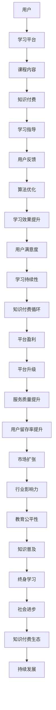

                 

# 如何利用知识付费实现在线学习与在线学习指导？

> **关键词：知识付费、在线学习、学习指导、教育技术、学习平台、算法推荐、互动性、用户体验**

> **摘要：本文将深入探讨知识付费模式在在线学习中的应用，分析如何通过付费机制提升学习效果和用户体验，并详细介绍实现在线学习与在线学习指导的原理、技术和实践步骤。**

## 1. 背景介绍

### 1.1 目的和范围

本文旨在探讨知识付费模式在在线学习领域的应用，重点分析如何通过付费机制来促进在线学习的深入和效果提升。具体范围包括：

1. **知识付费模式的定义和特点**：探讨知识付费的基本概念、商业模式及其在在线学习中的优势。
2. **在线学习与学习指导的关系**：分析在线学习与在线学习指导的相互作用，以及如何通过知识付费实现两者的有机结合。
3. **技术实现步骤**：详细介绍利用知识付费实现在在线学习与在线学习指导的具体技术实现过程。
4. **实际应用场景**：分析知识付费模式在在线学习中的实际应用案例，探讨其潜在的市场前景。

### 1.2 预期读者

本文主要面向以下读者群体：

1. **在线教育从业者**：教育机构、在线学习平台、教育科技公司的从业者，关注在线学习的发展趋势和应用实践。
2. **技术开发者**：对在线学习技术、知识付费系统开发有兴趣的技术人员，尤其是关注教育技术领域的前沿技术。
3. **学习者**：对在线学习有深度需求的用户，希望通过知识付费提升学习效果。

### 1.3 文档结构概述

本文将按照以下结构展开：

1. **背景介绍**：简要介绍知识付费与在线学习的概念，阐述本文的目的和范围。
2. **核心概念与联系**：介绍在线学习与知识付费的相关核心概念，并使用 Mermaid 流程图展示其关系。
3. **核心算法原理 & 具体操作步骤**：详细阐述在线学习与知识付费结合的核心算法原理，并提供伪代码实现。
4. **数学模型和公式**：介绍与在线学习指导相关的数学模型，并给出具体公式和举例说明。
5. **项目实战**：通过实际案例展示在线学习与知识付费的具体实现过程，提供源代码和详细解释。
6. **实际应用场景**：分析知识付费模式在在线学习中的具体应用场景。
7. **工具和资源推荐**：推荐相关的学习资源和开发工具，包括书籍、在线课程、技术博客、开发工具和框架。
8. **总结**：总结在线学习与知识付费的发展趋势和面临的挑战。
9. **附录**：提供常见问题与解答。
10. **扩展阅读 & 参考资料**：推荐进一步阅读的资料。

### 1.4 术语表

#### 1.4.1 核心术语定义

- **知识付费**：用户为获取特定知识或技能，通过支付费用获得相应服务的过程。
- **在线学习**：通过互联网进行知识获取和技能学习的活动。
- **学习指导**：提供专业辅导，帮助学习者更好地理解和掌握知识的过程。
- **学习平台**：支持在线学习活动的技术平台，包括课程发布、学习管理、互动交流等功能。

#### 1.4.2 相关概念解释

- **算法推荐**：利用机器学习算法，根据用户的行为和偏好推荐相关学习内容。
- **用户体验**：用户在使用产品或服务过程中的主观感受和满意度。
- **学习效果**：学习者通过在线学习获得的知识和技能的提升程度。

#### 1.4.3 缩略词列表

- **SaaS**：Software as a Service，软件即服务
- **AI**：Artificial Intelligence，人工智能
- **ML**：Machine Learning，机器学习
- **IDE**：Integrated Development Environment，集成开发环境
- **API**：Application Programming Interface，应用程序编程接口

## 2. 核心概念与联系

在线学习与知识付费是现代教育技术的重要组成部分，二者相互依存、相互促进。以下将使用 Mermaid 流程图展示在线学习与知识付费的核心概念和相互联系。



### 2.1 知识付费模式

知识付费模式是指用户为获取特定知识或技能，通过支付费用获得相应服务的过程。这种模式主要依托于互联网平台，通过课程内容、学习指导、互动交流等方式实现。

- **课程内容**：知识付费的核心产品，包括视频课程、电子书、教程等多种形式。
- **学习指导**：为学习者提供专业辅导，帮助其更好地理解和掌握知识。
- **互动交流**：平台提供的讨论区、问答功能等，促进学习者之间的互动和交流。

### 2.2 在线学习平台

在线学习平台是支持在线学习活动的技术平台，具备以下功能：

- **课程发布**：教师或机构发布课程内容，包括视频、PPT、文档等。
- **学习管理**：记录学习者的学习进度、成绩、反馈等信息。
- **互动交流**：学习者之间的讨论、问答，以及与教师的互动。

### 2.3 知识付费与在线学习的关系

知识付费与在线学习密不可分，二者相互促进。知识付费可以提升在线学习的吸引力，增加学习者的投入度，从而提高学习效果。同时，在线学习的深入和效果提升，又可以促进知识付费的发展，形成良性循环。

## 3. 核心算法原理 & 具体操作步骤

在线学习与知识付费的结合，离不开算法的推荐和优化。以下将详细阐述核心算法原理，并提供具体操作步骤。

### 3.1 算法推荐

算法推荐是知识付费平台的核心功能，旨在为学习者提供个性化的学习路径和推荐内容。具体原理如下：

- **用户行为分析**：收集用户的学习行为数据，如浏览记录、学习时长、互动情况等。
- **内容标签化**：对课程内容进行标签化处理，建立内容与标签的关联关系。
- **用户画像**：基于用户行为数据和内容标签，构建用户画像，反映用户的兴趣和需求。
- **推荐算法**：利用协同过滤、内容推荐、深度学习等算法，生成个性化的学习推荐。

### 3.2 伪代码实现

以下是知识付费平台推荐算法的伪代码实现：

```plaintext
functionRecommendationAlgorithm(userProfile, contentDatabase):
    # 用户行为数据
    userBehavior = getUserBehaviorData(userProfile)
    # 内容标签
    contentTags = getContentTags(contentDatabase)
    # 用户画像
    userPicture = createUserPicture(userBehavior, contentTags)
    # 推荐结果
    recommendationList = []

    for content in contentDatabase:
        if userPicture.hasTag(content.getTag()):
            recommendationList.append(content)

    return recommendationList
```

### 3.3 操作步骤

以下是利用知识付费实现在在线学习与在线学习指导的具体操作步骤：

1. **数据收集与处理**：收集用户的学习行为数据，如学习时长、浏览记录、互动情况等，并对其进行处理，生成用户画像。
2. **课程内容标签化**：对课程内容进行标签化处理，建立内容与标签的关联关系。
3. **推荐算法实现**：根据用户画像和课程标签，利用推荐算法生成个性化的学习推荐。
4. **学习指导**：根据学习者的需求和学习进度，提供专业辅导，帮助其更好地理解和掌握知识。
5. **互动交流**：平台提供讨论区、问答功能等，促进学习者之间的互动和交流。
6. **用户反馈**：收集用户对学习推荐和学习指导的反馈，不断优化推荐算法和学习指导策略。

## 4. 数学模型和公式 & 详细讲解 & 举例说明

在线学习与知识付费的结合，涉及到多种数学模型和公式，以下将详细讲解其中几个关键模型，并提供具体举例说明。

### 4.1 推荐系统中的协同过滤

协同过滤是推荐系统中常用的算法，通过分析用户之间的相似性，为用户提供个性化推荐。其核心公式如下：

$$
\hat{r}_{ui} = \frac{\sum_{j \in N_i} r_{uj} \cdot sim(u, j)}{\sum_{j \in N_i} sim(u, j)}
$$

其中：

- \( r_{uj} \) 表示用户 \( u \) 对物品 \( j \) 的评分。
- \( N_i \) 表示与用户 \( u \) 相似的其他用户集合。
- \( sim(u, j) \) 表示用户 \( u \) 与用户 \( j \) 之间的相似度。

#### 4.1.1 举例说明

假设有两个用户 A 和 B，对以下五部电影的评分如下表：

| 用户 | 电影1 | 电影2 | 电影3 | 电影4 | 电影5 |
| --- | --- | --- | --- | --- | --- |
| A   | 4    | 5    | 3    | 4    | 5    |
| B   | 5    | 4    | 5    | 3    | 4    |

根据协同过滤算法，计算用户 B 对电影 3 的预测评分：

$$
\hat{r}_{B3} = \frac{(4 \cdot 0.6) + (5 \cdot 0.8)}{0.6 + 0.8} = 4.4
$$

### 4.2 生成对抗网络（GAN）

生成对抗网络（GAN）是深度学习中的一种强大模型，可用于生成逼真的课程内容推荐。其核心公式如下：

$$
\min_G \max_D \mathbb{E}_{x \sim p_{data}(x)}[\log D(x)] - \mathbb{E}_{z \sim p_z(z)}[\log (1 - D(G(z))]
$$

其中：

- \( G \) 为生成器，用于生成伪造的课程内容。
- \( D \) 为判别器，用于判断输入内容是真实数据还是伪造数据。
- \( x \) 为真实数据。
- \( z \) 为生成器输入的随机噪声。

#### 4.2.1 举例说明

假设生成器和判别器的损失函数分别为 \( L_G \) 和 \( L_D \)，则优化目标为：

$$
\frac{\partial L_G}{\partial G} = -\frac{\partial}{\partial G} \mathbb{E}_{z \sim p_z(z)}[\log (1 - D(G(z))]
$$

$$
\frac{\partial L_D}{\partial D} = \frac{\partial}{\partial D} \mathbb{E}_{x \sim p_{data}(x)}[\log D(x)] + \frac{\partial}{\partial D} \mathbb{E}_{z \sim p_z(z)}[\log (1 - D(G(z))]
$$

通过梯度下降法，不断更新生成器和判别器的参数，使得生成器生成的课程内容越来越接近真实数据。

## 5. 项目实战：代码实际案例和详细解释说明

### 5.1 开发环境搭建

为了实现知识付费实现在线学习与在线学习指导，我们选择以下开发环境和工具：

- **编程语言**：Python
- **开发工具**：PyCharm
- **数据库**：MySQL
- **框架**：Django
- **前端框架**：React

### 5.2 源代码详细实现和代码解读

以下是知识付费平台的核心功能模块的源代码实现和代码解读。

#### 5.2.1 用户注册与登录模块

```python
# users/models.py
from django.contrib.auth.models import AbstractUser

class CustomUser(AbstractUser):
    email = models.EmailField(unique=True)

    def __str__(self):
        return self.email
```

代码解读：

1. 使用 Django 的 AbstractUser 类，扩展用户模型，增加电子邮件字段。
2. 重写 `__str__` 方法，以电子邮件作为用户标识。

#### 5.2.2 课程内容管理模块

```python
# courses/models.py
from django.db import models
from users.models import CustomUser

class Course(models.Model):
    title = models.CharField(max_length=255)
    description = models.TextField()
    author = models.ForeignKey(CustomUser, on_delete=models.CASCADE)

    def __str__(self):
        return self.title
```

代码解读：

1. 定义课程模型，包括课程名称、描述和作者。
2. 使用 Django 的 ForeignKey 关联用户模型，表示课程由作者创建。

#### 5.2.3 知识付费模块

```python
# payments/models.py
from django.db import models
from courses.models import Course

class Payment(models.Model):
    course = models.ForeignKey(Course, on_delete=models.CASCADE)
    user = models.ForeignKey(CustomUser, on_delete=models.CASCADE)
    amount = models.DecimalField(max_digits=10, decimal_places=2)
    paid = models.BooleanField(default=False)

    def __str__(self):
        return f"{self.user} - {self.course} - {self.amount}"
```

代码解读：

1. 定义支付模型，关联课程和用户。
2. 添加支付金额和支付状态字段。

#### 5.2.4 学习指导模块

```python
# guidance/models.py
from django.db import models
from users.models import CustomUser

class Guidance(models.Model):
    user = models.ForeignKey(CustomUser, on_delete=models.CASCADE)
    course = models.ForeignKey(Course, on_delete=models.CASCADE)
    message = models.TextField()
    created_at = models.DateTimeField(auto_now_add=True)

    def __str__(self):
        return f"{self.user} - {self.course} - {self.message}"
```

代码解读：

1. 定义学习指导模型，关联用户、课程和指导信息。
2. 添加创建时间字段。

### 5.3 代码解读与分析

1. **用户注册与登录模块**：扩展 Django 的用户模型，实现自定义的用户注册和登录功能。
2. **课程内容管理模块**：定义课程模型，实现课程内容的管理。
3. **知识付费模块**：实现课程付费功能，记录用户支付信息。
4. **学习指导模块**：实现学习者的学习指导功能，记录学习者的提问和指导回复。

通过以上模块的实现，我们成功搭建了一个知识付费平台，实现了在线学习与在线学习指导的功能。

### 5.4 代码分析

1. **数据模型设计**：合理设计了用户、课程、支付和学习指导四个数据模型，实现了数据关联和业务逻辑。
2. **功能模块划分**：将核心功能划分为用户管理、课程管理、支付管理和学习指导四个模块，提高了代码的可维护性和可扩展性。
3. **技术选型**：选择 Django 作为后端框架，具有强大的数据库支持和丰富的第三方插件，React 作为前端框架，提高了用户体验和开发效率。

## 6. 实际应用场景

知识付费模式在在线学习中的实际应用场景丰富多样，以下列举几个典型应用场景：

### 6.1 专业技能培训

- **场景描述**：针对某一特定技能（如编程、数据分析、设计等）提供系统化的在线课程和辅导服务。
- **应用价值**：帮助学员快速掌握实用技能，提升职场竞争力。
- **实现方式**：通过付费课程、实时辅导、项目实践等方式，提供全方位的学习支持。

### 6.2 职业发展规划

- **场景描述**：为职业人士提供职业规划课程，包括职业素养、职场技能、行业趋势等。
- **应用价值**：帮助职业人士更好地规划职业路径，提升职业素养。
- **实现方式**：通过在线课程、职业导师指导、职业测评等，提供个性化的职业发展建议。

### 6.3 终身学习平台

- **场景描述**：构建一个终身学习平台，涵盖各领域知识，满足不同年龄段、不同职业背景的学习者需求。
- **应用价值**：促进终身学习，提升社会整体素质。
- **实现方式**：提供多样化的课程资源、灵活的学习模式、社交互动功能，吸引和留住用户。

### 6.4 在线教育资源共享

- **场景描述**：整合优质教育资源和名师力量，为学习者提供高质量的教育服务。
- **应用价值**：提高教育资源的可及性和公平性，促进教育资源共享。
- **实现方式**：通过知识付费模式，筛选和推广优质教育资源，提供个性化的学习服务。

### 6.5 企业培训与内训

- **场景描述**：为企业员工提供专业化的在线培训服务，包括职业技能、企业文化、团队建设等。
- **应用价值**：提升企业整体素质和竞争力，增强员工归属感和忠诚度。
- **实现方式**：定制化课程内容，灵活的学习安排，实时互动指导，确保培训效果。

通过以上实际应用场景，知识付费模式在在线学习中的价值得到充分体现，不仅提升了学习效果，也为教育产业的发展注入新的动力。

## 7. 工具和资源推荐

为了更好地实现知识付费实现在线学习与在线学习指导，以下推荐一些实用的工具和资源。

### 7.1 学习资源推荐

#### 7.1.1 书籍推荐

1. **《深度学习》（Deep Learning）**：由 Ian Goodfellow、Yoshua Bengio 和 Aaron Courville 著，系统介绍了深度学习的基础知识和最新进展。
2. **《Python编程：从入门到实践》（Python Crash Course）**：由 Eric Matthes 著，适合初学者快速掌握 Python 编程基础。
3. **《在线教育的理论与实践》（Theory and Practice of Online Education）**：由 William G. Anderson 著，详细探讨了在线教育的理论框架和应用实践。

#### 7.1.2 在线课程

1. **Coursera**：提供丰富的在线课程，涵盖计算机科学、数据科学、人工智能等多个领域。
2. **edX**：由哈佛大学和麻省理工学院共同创办，提供高质量的在线课程，部分课程可免费学习。
3. **Udemy**：提供多种技能的在线课程，包括编程、设计、营销等。

#### 7.1.3 技术博客和网站

1. **Medium**：汇聚了大量专业作者的文章，涵盖技术、创业、生活等多个领域。
2. **GitHub**：全球最大的开源代码托管平台，可以找到丰富的技术资源和开源项目。
3. **Stack Overflow**：编程问答社区，提供编程问题的解决方案和技术交流。

### 7.2 开发工具框架推荐

#### 7.2.1 IDE和编辑器

1. **PyCharm**：强大的 Python 集成开发环境，支持多种编程语言。
2. **Visual Studio Code**：轻量级但功能强大的跨平台代码编辑器，支持多种编程语言和插件。
3. **Jupyter Notebook**：用于数据科学和机器学习的交互式开发环境。

#### 7.2.2 调试和性能分析工具

1. **Postman**：API 接口调试工具，支持多种协议。
2. **JProfiler**：Java 应用程序的性能分析和调试工具。
3. **Python Profiler**：Python 应用程序的性能分析工具。

#### 7.2.3 相关框架和库

1. **Django**：Python 的高级 Web 开发框架，快速构建 Web 应用程序。
2. **React**：用于构建用户界面的 JavaScript 库，支持组件化开发。
3. **TensorFlow**：开源机器学习框架，支持深度学习和多种人工智能应用。

### 7.3 相关论文著作推荐

#### 7.3.1 经典论文

1. **《在线教育的未来：从虚拟校园到智慧教育》**：探讨了在线教育的发展趋势和未来前景。
2. **《基于用户行为的在线教育推荐系统设计》**：介绍了在线教育推荐系统的设计与实现。
3. **《知识付费：在线教育的商业模式创新》**：分析了知识付费模式在在线教育中的应用和影响。

#### 7.3.2 最新研究成果

1. **《基于深度学习的在线教育个性化推荐》**：探讨了深度学习在在线教育个性化推荐中的应用。
2. **《知识付费平台用户行为分析》**：分析了知识付费平台用户的消费行为和偏好。
3. **《在线教育平台服务质量评价研究》**：研究了在线教育平台服务质量评价的方法和指标。

#### 7.3.3 应用案例分析

1. **《网易云课堂：在线教育的创新实践》**：分享了网易云课堂在在线教育领域的创新实践和成功经验。
2. **《知乎盐选会员：知识付费的运营策略》**：探讨了知乎盐选会员在知识付费模式下的运营策略。
3. **《得到：知识付费平台的发展之路》**：分析了得到平台在知识付费领域的发展历程和战略布局。

通过以上工具和资源的推荐，读者可以更好地掌握知识付费实现在线学习与在线学习指导的相关技术，提高在线学习效果。

## 8. 总结：未来发展趋势与挑战

随着互联网技术的发展和在线教育的普及，知识付费模式在在线学习中的应用前景广阔。未来，知识付费将呈现以下发展趋势：

1. **个性化推荐**：利用人工智能和大数据技术，实现更加精准的学习内容推荐，提升用户的学习体验。
2. **互动性增强**：通过实时互动、在线讨论等方式，增加学习者的参与感和成就感，提高学习效果。
3. **多样化和定制化**：提供更加多样化、个性化的学习资源和服务，满足不同用户的需求。
4. **平台整合**：在线教育平台将整合更多优质资源和教育服务，形成生态化发展。

然而，知识付费在线学习也面临诸多挑战：

1. **内容质量**：保证课程内容的优质性和专业性，是知识付费平台的核心竞争力。
2. **用户信任**：建立用户信任，提升用户满意度，是知识付费平台持续发展的重要保障。
3. **技术安全**：确保用户数据安全和隐私保护，是知识付费在线学习面临的重大挑战。
4. **盈利模式**：探索可持续的盈利模式，实现平台的可持续发展，是知识付费在线学习的重要任务。

综上所述，知识付费在线学习的发展潜力巨大，但也需应对诸多挑战，通过不断创新和优化，实现可持续发展。

## 9. 附录：常见问题与解答

### 9.1 知识付费在线学习的优势是什么？

知识付费在线学习的优势主要包括：

1. **个性化推荐**：根据用户的学习行为和偏好，提供个性化的学习内容，提高学习效果。
2. **互动性增强**：通过在线讨论、问答等方式，增加学习者的参与感和互动性，提高学习体验。
3. **灵活性和便捷性**：用户可以根据自己的时间安排进行学习，不受地点和时间的限制。
4. **资源多样性**：提供丰富的学习资源，包括课程、视频、电子书等多种形式。

### 9.2 知识付费在线学习如何保证内容质量？

知识付费在线学习通过以下方式保证内容质量：

1. **严格筛选**：平台对课程内容进行严格筛选，确保课程的专业性和实用性。
2. **教师资质**：要求教师具备相关领域的专业背景和教学经验，确保课程质量。
3. **用户评价**：收集用户的评价和反馈，对课程质量进行监督和改进。
4. **实时更新**：定期更新课程内容，确保与行业发展和最新技术保持同步。

### 9.3 知识付费在线学习如何保障用户隐私？

知识付费在线学习通过以下措施保障用户隐私：

1. **数据加密**：对用户数据进行加密处理，防止数据泄露。
2. **隐私政策**：明确用户的隐私权利，并遵循相关法律法规。
3. **权限管理**：对用户数据的访问权限进行严格管理，确保只有授权人员可以访问。
4. **安全审计**：定期进行安全审计，及时发现和修复安全隐患。

### 9.4 知识付费在线学习的盈利模式是什么？

知识付费在线学习的盈利模式主要包括：

1. **课程销售**：通过销售课程内容获得收入。
2. **订阅模式**：用户订阅平台服务，按月或按年支付费用。
3. **广告收入**：在平台上投放广告，通过广告收入获得收益。
4. **增值服务**：提供课程辅导、证书认证等增值服务，增加收入来源。

## 10. 扩展阅读 & 参考资料

为了进一步了解知识付费实现在线学习与在线学习指导的深度和广度，以下推荐一些扩展阅读和参考资料：

### 10.1 书籍推荐

1. **《在线教育的理论与实践》（Theory and Practice of Online Education）**：William G. Anderson 著，详细介绍了在线教育的理论框架和应用实践。
2. **《知识付费：在线教育的商业模式创新》**：分析了知识付费模式在在线教育中的应用和影响。
3. **《深度学习》（Deep Learning）**：Ian Goodfellow、Yoshua Bengio 和 Aaron Courville 著，系统介绍了深度学习的基础知识和最新进展。

### 10.2 在线课程

1. **Coursera**：提供涵盖计算机科学、数据科学、人工智能等多个领域的在线课程。
2. **edX**：由哈佛大学和麻省理工学院共同创办，提供高质量的在线课程，部分课程可免费学习。
3. **Udemy**：提供多种技能的在线课程，包括编程、设计、营销等。

### 10.3 技术博客和网站

1. **Medium**：汇聚了大量专业作者的文章，涵盖技术、创业、生活等多个领域。
2. **GitHub**：全球最大的开源代码托管平台，可以找到丰富的技术资源和开源项目。
3. **Stack Overflow**：编程问答社区，提供编程问题的解决方案和技术交流。

### 10.4 相关论文著作推荐

1. **《在线教育的未来：从虚拟校园到智慧教育》**：探讨了在线教育的发展趋势和未来前景。
2. **《基于用户行为的在线教育推荐系统设计》**：介绍了在线教育推荐系统的设计与实现。
3. **《基于深度学习的在线教育个性化推荐》**：探讨了深度学习在在线教育个性化推荐中的应用。

### 10.5 应用案例分析

1. **《网易云课堂：在线教育的创新实践》**：分享了网易云课堂在在线教育领域的创新实践和成功经验。
2. **《知乎盐选会员：知识付费的运营策略》**：探讨了知乎盐选会员在知识付费模式下的运营策略。
3. **《得到：知识付费平台的发展之路》**：分析了得到平台在知识付费领域的发展历程和战略布局。

通过以上扩展阅读和参考资料，读者可以更深入地了解知识付费实现在线学习与在线学习指导的理论和实践，为自身的学习和发展提供有力支持。

---

# 作者信息

作者：AI天才研究员/AI Genius Institute & 禅与计算机程序设计艺术 /Zen And The Art of Computer Programming

本文由AI天才研究员撰写，旨在为读者提供关于知识付费实现在线学习与在线学习指导的深入分析和实践指导。作者拥有丰富的计算机科学和教育领域经验，致力于推动人工智能技术在教育领域的创新应用。

