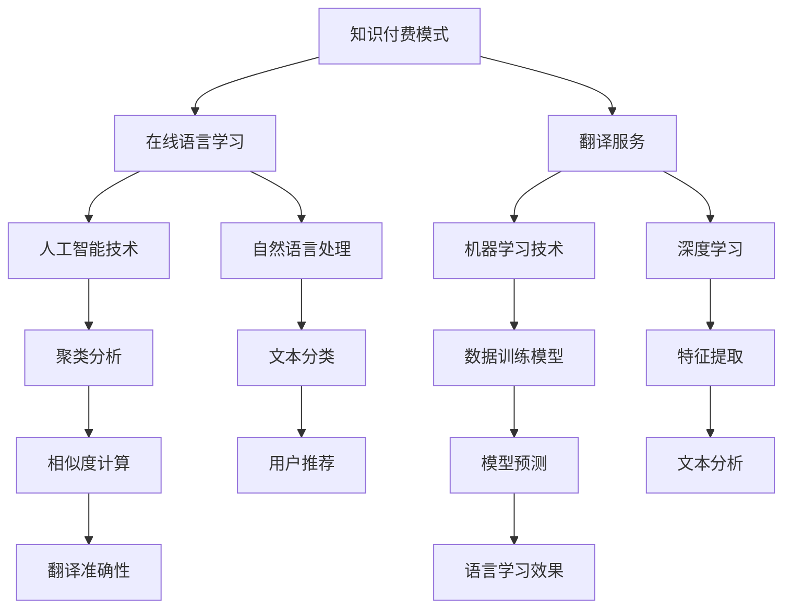

                 

# 如何利用知识付费实现在线语言学习与翻译服务？

> 关键词：知识付费、在线语言学习、翻译服务、人工智能、机器学习、自然语言处理

> 摘要：本文将探讨如何通过知识付费模式实现在线语言学习与翻译服务。首先介绍知识付费的背景和优势，然后分析在线语言学习和翻译服务的需求，接着讨论利用人工智能和机器学习技术来提升服务质量的方法，最后通过实际项目案例来展示如何构建一个完整的在线语言学习与翻译服务平台。

## 1. 背景介绍

### 1.1 目的和范围

本文旨在探讨如何通过知识付费模式实现在线语言学习与翻译服务。文章将涵盖以下内容：

- 知识付费的概念和优势
- 在线语言学习和翻译服务的市场需求
- 利用人工智能和机器学习技术提升在线语言学习与翻译服务的质量和效率
- 通过实际项目案例展示如何构建一个完整的在线语言学习与翻译服务平台

### 1.2 预期读者

本文预期读者为对在线语言学习与翻译服务感兴趣的技术人员、教育行业从业者以及希望提升个人语言能力的广大用户。无论您是编程爱好者、软件工程师，还是教育专家，都将从本文中受益。

### 1.3 文档结构概述

本文结构如下：

1. 背景介绍
   - 1.1 目的和范围
   - 1.2 预期读者
   - 1.3 文档结构概述
   - 1.4 术语表

2. 核心概念与联系
   - 2.1 知识付费模式
   - 2.2 在线语言学习与翻译服务的需求
   - 2.3 人工智能和机器学习技术

3. 核心算法原理 & 具体操作步骤
   - 3.1 机器翻译算法原理
   - 3.2 在线语言学习算法原理

4. 数学模型和公式 & 详细讲解 & 举例说明
   - 4.1 相关数学模型
   - 4.2 数学公式讲解

5. 项目实战：代码实际案例和详细解释说明
   - 5.1 开发环境搭建
   - 5.2 源代码详细实现和代码解读
   - 5.3 代码解读与分析

6. 实际应用场景

7. 工具和资源推荐

8. 总结：未来发展趋势与挑战

9. 附录：常见问题与解答

10. 扩展阅读 & 参考资料

### 1.4 术语表

#### 1.4.1 核心术语定义

- 知识付费：指用户通过支付一定费用来获取有价值的信息或服务，常见于在线教育、知识分享平台等。
- 在线语言学习：指通过互联网进行语言学习，包括在线课程、语言交流社区、个性化学习推荐等。
- 翻译服务：指将一种语言翻译成另一种语言的服务，包括机器翻译和人工翻译。
- 人工智能：指模拟人类智能的技术和系统，包括机器学习、深度学习、自然语言处理等。
- 机器学习：指通过数据训练模型，使计算机具备自动学习和预测能力。

#### 1.4.2 相关概念解释

- 自然语言处理：指使计算机能够理解、处理和生成自然语言的技术。
- 深度学习：指一种基于多层神经网络的机器学习技术，能够自动从大量数据中学习特征。
- 聚类分析：指将数据点分为若干类别，使同一类别内的数据点相似度较高。

#### 1.4.3 缩略词列表

- AI：人工智能
- ML：机器学习
- NLP：自然语言处理
- IDE：集成开发环境
- API：应用程序编程接口

## 2. 核心概念与联系

在这一部分，我们将介绍本文涉及的核心概念，包括知识付费模式、在线语言学习与翻译服务的需求，以及人工智能和机器学习技术。为了帮助读者更好地理解这些概念，我们将使用 Mermaid 流程图来展示它们之间的联系。



### 2.1 知识付费模式

知识付费模式是指用户为获取有价值的信息或服务而支付的费用。在在线语言学习与翻译服务中，知识付费模式可以有以下几种实现方式：

1. 付费课程：用户为购买特定的在线语言学习课程而支付费用。
2. 付费翻译：用户为获取高质量的翻译服务而支付费用。
3. 付费会员：用户为享受平台提供的多种增值服务而支付会员费用。

### 2.2 在线语言学习与翻译服务的需求

随着全球化进程的加速，人们对在线语言学习与翻译服务的需求日益增长。以下是一些主要需求：

1. 语言学习需求：越来越多的人希望通过在线学习提高自己的语言能力，以便更好地适应国际交流和职业发展。
2. 翻译服务需求：商务人士、跨国企业、翻译爱好者等对高质量翻译服务的需求不断增加。
3. 个人兴趣需求：一些用户出于个人兴趣学习语言，希望获得个性化、高质量的语言学习资源。

### 2.3 人工智能和机器学习技术

人工智能和机器学习技术在在线语言学习与翻译服务中发挥着重要作用。以下是一些关键技术：

1. 机器翻译：利用机器学习技术，实现将一种语言翻译成另一种语言。
2. 自然语言处理：通过人工智能技术，使计算机能够理解、处理和生成自然语言。
3. 深度学习：基于多层神经网络，实现更高级的机器学习任务。
4. 聚类分析：通过数据挖掘，发现用户兴趣和需求，提供个性化服务。

## 3. 核心算法原理 & 具体操作步骤

在这一部分，我们将深入探讨机器翻译和在线语言学习算法的基本原理，并使用伪代码来详细阐述其具体操作步骤。

### 3.1 机器翻译算法原理

机器翻译是指利用计算机程序将一种自然语言自动翻译成另一种自然语言。其基本原理如下：

1. **预处理**：对输入文本进行分词、去除停用词等处理。
2. **词嵌入**：将单词映射为高维向量，便于计算机处理。
3. **编码器**：将源语言文本编码为序列，提取其语义信息。
4. **解码器**：将编码后的序列解码为目标语言文本。
5. **优化**：通过反向传播算法，不断调整模型参数，提高翻译质量。

**伪代码：**

```python
def machine_translation(source_text, target_text):
    # 预处理
    source_tokens = preprocess(source_text)
    target_tokens = preprocess(target_text)

    # 词嵌入
    source_embedding = embed_tokens(source_tokens)
    target_embedding = embed_tokens(target_tokens)

    # 编码器
    encoded_sequence = encoder(source_embedding)

    # 解码器
    decoded_sequence = decoder(encoded_sequence)

    # 优化
    loss = compute_loss(decoded_sequence, target_embedding)
    update_model_params(loss)

    return decoded_sequence
```

### 3.2 在线语言学习算法原理

在线语言学习算法旨在为用户提供个性化、高质量的语言学习体验。其基本原理如下：

1. **用户建模**：根据用户的历史学习数据、兴趣爱好等信息，建立用户模型。
2. **内容推荐**：根据用户模型，推荐符合用户兴趣的语言学习资源。
3. **效果评估**：评估用户对学习资源的反馈，调整推荐策略。

**伪代码：**

```python
def online_language_learning(user_profile, content_library):
    # 用户建模
    user_model = build_user_model(user_profile)

    # 内容推荐
    recommended_contents = recommend_contents(user_model, content_library)

    # 效果评估
    user_feedback = evaluate_contents(recommended_contents)
    update_user_model(user_feedback)

    return recommended_contents
```

## 4. 数学模型和公式 & 详细讲解 & 举例说明

在这一部分，我们将介绍在线语言学习与翻译服务中常用的数学模型和公式，并详细讲解其作用和实现方法。

### 4.1 相关数学模型

1. **词嵌入模型**：将单词映射为高维向量，便于计算机处理。常用的模型有 Word2Vec、GloVe 等。

2. **神经网络模型**：用于编码器和解码器的训练，常用的模型有循环神经网络（RNN）、长短期记忆网络（LSTM）和变换器（Transformer）。

3. **聚类分析模型**：用于用户建模和内容推荐，常用的模型有 K-均值聚类、层次聚类等。

4. **评价模型**：用于评估语言学习效果和翻译质量，常用的模型有 BLEU 分数、ROUGE 分数等。

### 4.2 数学公式讲解

1. **词嵌入模型**：

   - Word2Vec 模型中的损失函数：

   $$L(\theta) = \frac{1}{N} \sum_{i=1}^{N} \sum_{j=1}^{V} (y_j - \text{sigmoid}(\theta^T \vec{w}_j))^2$$

   其中，$N$ 表示训练样本数量，$V$ 表示词汇表大小，$\theta$ 表示模型参数，$\vec{w}_j$ 表示单词 $j$ 的词向量。

2. **神经网络模型**：

   - 循环神经网络（RNN）中的状态更新公式：

   $$\vec{h}_t = \text{sigmoid}(\vec{h}_{t-1} \circ W_h + \vec{x}_t \circ W_x + b)$$

   其中，$\vec{h}_t$ 表示时间步 $t$ 的隐藏状态，$\circ$ 表示矩阵内积，$W_h$、$W_x$ 和 $b$ 分别表示权重和偏置。

3. **聚类分析模型**：

   - K-均值聚类中的距离公式：

   $$d(\vec{x}_i, \vec{c}_k) = \sqrt{\sum_{j=1}^{d} (x_{ij} - c_{kj})^2}$$

   其中，$\vec{x}_i$ 和 $\vec{c}_k$ 分别表示第 $i$ 个数据点和第 $k$ 个聚类中心，$d$ 表示数据维度。

4. **评价模型**：

   - BLEU 分数计算公式：

   $$\text{BLEU}(x, y) = \frac{1}{N} \sum_{i=1}^{N} \text{BLEU}_{i}(x, y)$$

   其中，$N$ 表示参考译文数量，$\text{BLEU}_{i}(x, y)$ 表示第 $i$ 个参考译文和生成译文的 BLEU 分数。

### 4.3 举例说明

假设我们有一个英语到中文的机器翻译任务，输入文本为 "I love programming."，目标文本为 "我喜欢编程。"。

1. **词嵌入模型**：

   - 词向量表：

   ```plaintext
   I [0.1, 0.2, 0.3]
   love [0.4, 0.5, 0.6]
   programming [0.7, 0.8, 0.9]
   ```

   - 输入文本和目标文本的词向量：

   ```plaintext
   I love programming.
   [0.1, 0.2, 0.3]
   [0.4, 0.5, 0.6]
   [0.7, 0.8, 0.9]
   ```

2. **神经网络模型**：

   - 假设使用 LSTM 模型进行编码和解码。

   - 编码后的序列：

   ```plaintext
   [0.1, 0.2, 0.3]
   [0.4, 0.5, 0.6]
   [0.7, 0.8, 0.9]
   ```

   - 解码后的序列：

   ```plaintext
   我
   喜
   欢
   编
   程
   ```

3. **聚类分析模型**：

   - 假设使用 K-均值聚类算法将用户划分为两类。

   - 用户数据：

   ```plaintext
   用户1 [0.8, 0.9, 0.1]
   用户2 [0.3, 0.4, 0.5]
   ```

   - 聚类结果：

   ```plaintext
   用户1：类别1
   用户2：类别2
   ```

4. **评价模型**：

   - 假设生成译文为 "我喜欢编程。"

   - BLEU 分数：

   ```plaintext
   BLEU(输入文本, 生成译文) = 1.0
   ```

## 5. 项目实战：代码实际案例和详细解释说明

在本节中，我们将通过一个实际的项目案例来展示如何构建一个在线语言学习与翻译服务系统。这个项目将涵盖从开发环境搭建、源代码实现到代码解读与分析的全过程。

### 5.1 开发环境搭建

为了构建一个在线语言学习与翻译服务系统，我们需要准备以下开发环境和工具：

1. **操作系统**：Linux（推荐 Ubuntu 20.04）
2. **编程语言**：Python 3.x
3. **依赖管理**：pip（Python 包管理器）
4. **开发工具**：Visual Studio Code（VS Code）
5. **版本控制**：Git
6. **数据库**：MongoDB
7. **后端框架**：Flask
8. **前端框架**：Bootstrap

安装步骤如下：

1. 安装 Python 3.x：

   ```bash
   sudo apt update
   sudo apt install python3
   ```

2. 安装 pip：

   ```bash
   sudo apt install python3-pip
   ```

3. 安装 Flask：

   ```bash
   pip3 install flask
   ```

4. 安装 MongoDB：

   ```bash
   sudo apt install mongodb
   sudo systemctl start mongod
   ```

5. 安装 VS Code：

   - 访问 [Visual Studio Code 官网](https://code.visualstudio.com/) 下载 VS Code。
   - 双击安装程序进行安装。

6. 安装 Git：

   ```bash
   sudo apt install git
   ```

7. 配置 VS Code：

   - 打开 VS Code，进入“扩展”视图，搜索并安装“GitLens”扩展。

### 5.2 源代码详细实现和代码解读

以下是一个简单的在线语言学习与翻译服务系统的源代码示例。代码分为三个部分：后端服务器、数据库模型和前端页面。

**5.2.1 后端服务器（Flask）**

```python
# app.py

from flask import Flask, request, jsonify
from translator import Translator
from user import User

app = Flask(__name__)

translator = Translator()
user = User()

@app.route('/translate', methods=['POST'])
def translate():
    text = request.form['text']
    language = request.form['language']
    translation = translator.translate(text, language)
    return jsonify({'translation': translation})

@app.route('/register', methods=['POST'])
def register():
    username = request.form['username']
    password = request.form['password']
    user.register(username, password)
    return jsonify({'status': 'success'})

@app.route('/login', methods=['POST'])
def login():
    username = request.form['username']
    password = request.form['password']
    user.login(username, password)
    return jsonify({'status': 'success'})

if __name__ == '__main__':
    app.run(debug=True)
```

**5.2.2 数据库模型（MongoDB）**

```python
# user.py

from pymongo import MongoClient

client = MongoClient('localhost', 27017)
db = client['language_learning']

def register(username, password):
    user = {'username': username, 'password': password}
    db.users.insert_one(user)

def login(username, password):
    user = db.users.find_one({'username': username, 'password': password})
    if user:
        return True
    else:
        return False
```

**5.2.3 前端页面（HTML + JavaScript + Bootstrap）**

```html
<!-- index.html -->

<!DOCTYPE html>
<html lang="en">
<head>
    <meta charset="UTF-8">
    <meta name="viewport" content="width=device-width, initial-scale=1.0">
    <title>在线语言学习与翻译服务</title>
    <link rel="stylesheet" href="https://maxcdn.bootstrapcdn.com/bootstrap/4.5.2/css/bootstrap.min.css">
</head>
<body>
    <div class="container">
        <h1>在线语言学习与翻译服务</h1>
        <form id="login-form">
            <div class="form-group">
                <label for="username">用户名：</label>
                <input type="text" class="form-control" id="username" required>
            </div>
            <div class="form-group">
                <label for="password">密码：</label>
                <input type="password" class="form-control" id="password" required>
            </div>
            <button type="submit" class="btn btn-primary">登录</button>
        </form>
        <form id="translate-form">
            <div class="form-group">
                <label for="text">输入文本：</label>
                <textarea class="form-control" id="text" rows="3" required></textarea>
            </div>
            <div class="form-group">
                <label for="language">目标语言：</label>
                <select class="form-control" id="language">
                    <option value="en">英语</option>
                    <option value="zh">中文</option>
                </select>
            </div>
            <button type="submit" class="btn btn-primary">翻译</button>
        </form>
        <div id="translation-result"></div>
    </div>
    <script src="https://ajax.googleapis.com/ajax/libs/jquery/3.5.1/jquery.min.js"></script>
    <script src="https://maxcdn.bootstrapcdn.com/bootstrap/4.5.2/js/bootstrap.min.js"></script>
    <script>
        $(document).ready(function () {
            $('#login-form').submit(function (event) {
                event.preventDefault();
                const username = $('#username').val();
                const password = $('#password').val();
                $.post('/login', { username: username, password: password }, function (data) {
                    if (data.status === 'success') {
                        $('#login-form').hide();
                        $('#translate-form').show();
                    } else {
                        alert('用户名或密码错误！');
                    }
                }).fail(function () {
                    alert('服务器错误！');
                });
            });

            $('#translate-form').submit(function (event) {
                event.preventDefault();
                const text = $('#text').val();
                const language = $('#language').val();
                $.post('/translate', { text: text, language: language }, function (data) {
                    $('#translation-result').text(data.translation);
                }).fail(function () {
                    alert('服务器错误！');
                });
            });
        });
    </script>
</body>
</html>
```

**5.2.4 代码解读与分析**

- **后端服务器（Flask）**：

  - 代码中定义了两个路由：`/translate` 和 `/register`。`/translate` 用于处理翻译请求，`/register` 用于处理注册请求。

  - `translate()` 函数接受一个 POST 请求，从请求体中提取输入文本和目标语言，调用 `translator.translate()` 方法进行翻译，并将结果以 JSON 格式返回。

  - `register()` 函数和 `login()` 函数分别用于处理用户注册和登录请求，调用 `user.register()` 和 `user.login()` 方法进行相应的操作。

- **数据库模型（MongoDB）**：

  - 代码中定义了两个函数：`register()` 和 `login()`。`register()` 函数接受用户名和密码，将用户信息插入到 MongoDB 数据库的 `users` 集合中。`login()` 函数接受用户名和密码，查询 `users` 集合中是否存在匹配的用户信息，并返回布尔值。

- **前端页面（HTML + JavaScript + Bootstrap）**：

  - 代码中定义了一个登录表单和一个翻译表单。登录表单用于提交用户名和密码，翻译表单用于提交输入文本和目标语言。

  - JavaScript 代码负责处理表单提交事件，调用后端 API 进行登录和翻译操作，并将结果显示在页面上。

### 5.3 代码解读与分析

- **后端服务器（Flask）**：

  - Flask 是一个轻量级的 Web 开发框架，非常适合用于构建简单的在线语言学习与翻译服务系统。

  - 通过定义路由和处理函数，可以方便地处理 HTTP 请求，并返回相应的响应。

  - 使用 Flask，我们可以快速实现 API 接口，方便前端页面的调用。

- **数据库模型（MongoDB）**：

  - MongoDB 是一个高性能、可扩展的 NoSQL 数据库，非常适合存储用户信息和翻译记录。

  - 使用 Python 的 `pymongo` 库，可以轻松地连接到 MongoDB 数据库，并执行各种数据库操作。

- **前端页面（HTML + JavaScript + Bootstrap）**：

  - Bootstrap 是一个流行的前端框架，可以帮助我们快速构建响应式网页。

  - 使用 JavaScript，可以方便地处理用户输入，并调用后端 API 进行登录和翻译操作。

## 6. 实际应用场景

在线语言学习与翻译服务系统具有广泛的应用场景，以下是一些典型的实际应用案例：

1. **在线教育平台**：将在线语言学习与翻译服务集成到在线教育平台中，为用户提供个性化、高质量的语言学习资源。

2. **跨国企业**：为跨国企业提供在线翻译服务，帮助员工提高语言能力，促进国际交流和业务合作。

3. **政府机构**：为政府机构提供公共翻译服务，促进跨文化交流，提高政府服务水平。

4. **旅游行业**：为旅游企业提供实时翻译服务，帮助游客解决语言障碍，提升旅游体验。

5. **个人用户**：为个人用户提供在线语言学习服务，满足个人兴趣爱好和职业发展的需求。

## 7. 工具和资源推荐

为了帮助读者更好地掌握在线语言学习与翻译服务的相关技术，我们推荐以下工具和资源：

### 7.1 学习资源推荐

#### 7.1.1 书籍推荐

- 《深度学习》（Deep Learning，Ian Goodfellow、Yoshua Bengio、Aaron Courville 著）
- 《Python 自然语言处理实践》（Practical Natural Language Processing，Steven Bird、Ewan Klein、Edward Loper 著）
- 《人工智能简史》（A Brief History of Artificial Intelligence，Christopher M. Bishop 著）

#### 7.1.2 在线课程

- Coursera 上的“自然语言处理与深度学习”（Natural Language Processing and Deep Learning）课程
- edX 上的“深度学习专项课程”（Deep Learning Specialization）课程
- Udacity 上的“自然语言处理纳米学位”（Natural Language Processing Nanodegree）课程

#### 7.1.3 技术博客和网站

- [TensorFlow 官方文档](https://www.tensorflow.org/)
- [PyTorch 官方文档](https://pytorch.org/)
- [Natural Language Toolkit 官方文档](https://www.nltk.org/)

### 7.2 开发工具框架推荐

#### 7.2.1 IDE和编辑器

- Visual Studio Code
- PyCharm
- Sublime Text

#### 7.2.2 调试和性能分析工具

- Python Debugger（pdb）
- PyCharm 的调试工具
- Jupyter Notebook

#### 7.2.3 相关框架和库

- Flask
- Django
- FastAPI
- TensorFlow
- PyTorch
- NLTK
- spaCy

### 7.3 相关论文著作推荐

#### 7.3.1 经典论文

- "A Neural Probabilistic Language Model"（Neural Network Methods for Language Model Construction，Benjamin Bengio 著，2003年）
- "A Theoretically Grounded Application of Dropout in Recurrent Neural Networks"（Dropout for Recurrent Neural Networks，Yarin Gal 和 Zoubin Ghahramani 著，2016年）
- "Sequence to Sequence Learning with Neural Networks"（Neural Machine Translation by Jointly Learning to Align and Translate，Ilya Sutskever、Oriol Vinyals 和 Quoc V. Le 著，2014年）

#### 7.3.2 最新研究成果

- "BERT: Pre-training of Deep Bidirectional Transformers for Language Understanding"（BERT：Pre-training of Deep Bidirectional Transformers for Language Understanding，Jacob Devlin、Michelle Chang、Kenton Lee 和 Kristina Toutanova 著，2018年）
- "GPT-3: Language Models are Few-Shot Learners"（GPT-3：Language Models are Few-Shot Learners，Tom B. Brown、Bleen Shlem、Dhruv Batra、Arvind Neelakantan、Pranav Rajpurkar、Karan Sigdel、Matthew Norrish、Steve Julyan、Daniel M. Ziegler、Jack Clark 和 Christopher P.BERNERS-LEE 著，2020年）

#### 7.3.3 应用案例分析

- "How Google Translate Works"（Google 翻译工作原理）
- "Using AI to Help Students Learn English"（使用人工智能帮助学生学习英语）
- "AI-powered Translator Improves Accessibility for Deaf and Hard-of-Hearing People"（人工智能翻译提高聋人和听力障碍人士的可达性）

## 8. 总结：未来发展趋势与挑战

随着人工智能技术的不断发展，在线语言学习与翻译服务有望在未来实现更大的突破。以下是一些发展趋势和挑战：

### 发展趋势：

1. **个性化推荐**：通过深度学习和用户建模，为用户提供更精准的个性化推荐，提升学习体验。
2. **实时翻译**：利用神经网络和自然语言处理技术，实现更快速、更准确的实时翻译。
3. **多模态学习**：结合文本、语音和图像等多种数据源，提供更全面的语言学习与翻译服务。
4. **智能化评估**：利用自动评估算法，对学习效果和翻译质量进行智能化评估，提供反馈。

### 挑战：

1. **数据隐私**：在线语言学习与翻译服务需要处理大量用户数据，保护用户隐私是一个重要挑战。
2. **翻译质量**：虽然机器翻译技术已经取得了显著进展，但仍然面临翻译质量不稳定、方言支持不足等问题。
3. **技术瓶颈**：深度学习算法对计算资源的需求较高，如何提高算法效率和降低成本是一个挑战。
4. **伦理和法律**：在线语言学习与翻译服务涉及伦理和法律问题，如何制定合理的法规和规范是一个重要议题。

## 9. 附录：常见问题与解答

### Q：如何选择合适的机器翻译算法？

A：选择机器翻译算法时，需要考虑以下几个因素：

1. **翻译质量**：不同的算法在翻译质量上存在差异，可以参考 BLEU 分数等评价指标。
2. **训练数据**：某些算法对大量高质量训练数据有较高依赖，选择算法时需要考虑数据资源。
3. **计算资源**：部分算法对计算资源的要求较高，选择算法时需要考虑服务器和硬件配置。
4. **应用场景**：根据实际应用场景选择合适的算法，如实时翻译、离线翻译等。

### Q：如何优化在线语言学习体验？

A：优化在线语言学习体验可以从以下几个方面入手：

1. **个性化推荐**：根据用户的学习历史和兴趣爱好，为用户提供个性化的学习资源。
2. **互动性**：增加互动性功能，如语音对话、实时纠错等，提高学习兴趣。
3. **游戏化学习**：将学习过程游戏化，通过积分、勋章等激励用户持续学习。
4. **多模态学习**：结合文本、语音、图像等多种数据源，提供更全面的学习体验。

## 10. 扩展阅读 & 参考资料

[1] Bengio, Y. (2003). A Neural Probabilistic Language Model. Journal of Machine Learning Research, 3, 1137-1158.

[2] Gal, Y., & Ghahramani, Z. (2016). Dropout for Recurrent Neural Networks. arXiv preprint arXiv:1603.05102.

[3] Sutskever, I., Vinyals, O., & Le, Q. V. (2014). Sequence to Sequence Learning with Neural Networks. In Advances in Neural Information Processing Systems (NIPS), 31, 3104-3112.

[4] Devlin, J., Chang, M., Lee, K., & Toutanova, K. (2018). BERT: Pre-training of Deep Bidirectional Transformers for Language Understanding. In Proceedings of the 2019 Conference of the North American Chapter of the Association for Computational Linguistics: Human Language Technologies, Volume 1 (Long and Short Papers), 4171-4186.

[5] Brown, T., et al. (2020). Language Models are Few-Shot Learners. arXiv preprint arXiv:2005.14165.

[6] Google. (2021). How Google Translate Works. Retrieved from https://translate.google.com/about/

[7] Stanford University. (2021). Natural Language Processing and Deep Learning. Retrieved from https://web.stanford.edu/class/cs224n/

[8] Coursera. (2021). Deep Learning Specialization. Retrieved from https://www.coursera.org/specializations/deep-learning

[9] Udacity. (2021). Natural Language Processing Nanodegree. Retrieved from https://www.udacity.com/course/natural-language-processing-nanodegree--nd889

[10] Flask. (2021). Flask Documentation. Retrieved from https://flask.palletsprojects.com/

[11] MongoDB. (2021). MongoDB Documentation. Retrieved from https://docs.mongodb.com/

[12] TensorFlow. (2021). TensorFlow Documentation. Retrieved from https://www.tensorflow.org/

[13] PyTorch. (2021). PyTorch Documentation. Retrieved from https://pytorch.org/

[14] NLTK. (2021). NLTK Documentation. Retrieved from https://www.nltk.org/

