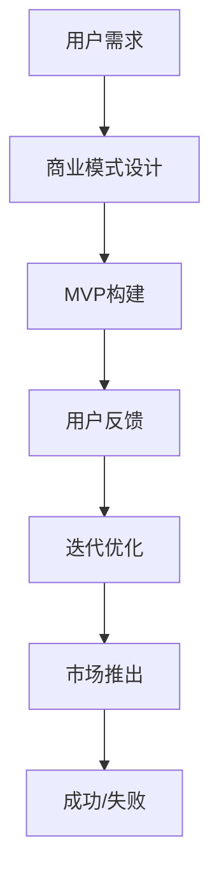

                 

# 如何利用精益创业方法快速验证商业假设

> **关键词**：精益创业、商业假设、验证、MVP、用户反馈、迭代优化
>
> **摘要**：本文将深入探讨精益创业方法在快速验证商业假设方面的应用。通过介绍精益创业的核心原则和关键步骤，结合实际案例和具体操作，为读者提供一套系统化的商业假设验证策略，帮助创业者降低风险，提高成功几率。

## 1. 背景介绍

### 1.1 目的和范围

本文的目的是帮助读者了解和掌握精益创业方法在商业假设验证中的应用。我们将介绍精益创业的核心概念，阐述如何通过构建最小可行性产品（MVP）和持续获取用户反馈，来优化和验证商业假设。本文旨在为创业者提供一套实用的方法论，以在激烈的市场竞争中找到突破口。

### 1.2 预期读者

本文适合以下读者群体：

- 初创公司的创始人或联合创始人
- 希望提升产品创新能力的研发团队
- 有志于创业的职场人士
- 对商业策略和创业理论感兴趣的技术人员

### 1.3 文档结构概述

本文将分为以下几个部分：

- **第1章：背景介绍**：介绍本文的目的、预期读者和文档结构。
- **第2章：核心概念与联系**：阐述精益创业方法的核心概念，并使用Mermaid流程图展示相关流程。
- **第3章：核心算法原理 & 具体操作步骤**：详细讲解如何通过构建MVP来验证商业假设，并提供伪代码示例。
- **第4章：数学模型和公式 & 详细讲解 & 举例说明**：介绍相关的数学模型和公式，并通过实例进行说明。
- **第5章：项目实战：代码实际案例和详细解释说明**：展示一个具体的实战案例，详细解读代码实现和效果。
- **第6章：实际应用场景**：讨论精益创业方法在不同场景下的应用。
- **第7章：工具和资源推荐**：推荐相关学习资源、开发工具和论文著作。
- **第8章：总结：未来发展趋势与挑战**：总结本文的关键点，并探讨未来发展趋势和挑战。
- **第9章：附录：常见问题与解答**：回答读者可能遇到的问题。
- **第10章：扩展阅读 & 参考资料**：提供进一步学习的资源。

### 1.4 术语表

#### 1.4.1 核心术语定义

- **精益创业**：一种以用户价值为核心，通过快速迭代和验证来降低创业风险的创业方法论。
- **MVP**：最小可行性产品，即包含核心功能的最简产品版本，用于验证商业假设。
- **用户反馈**：用户对产品的评价、使用体验和需求反馈。
- **迭代优化**：在MVP基础上，根据用户反馈持续改进产品，以达到市场需求的最佳匹配。

#### 1.4.2 相关概念解释

- **商业模式**：企业如何创造、传递和获取价值。
- **客户细分**：将市场划分为具有相似需求和特征的客户群体。
- **价值主张**：产品或服务所提供的独特价值，满足客户的需求。

#### 1.4.3 缩略词列表

- MVP：最小可行性产品
- Lean Startup：精益创业
- UX：用户体验
- A/B测试：分叉测试

## 2. 核心概念与联系

在深入探讨精益创业方法之前，我们需要了解其核心概念和原理。以下是精益创业方法中的关键概念及其相互关系：

### 2.1 精益创业的核心概念

- **用户价值**：精益创业方法以用户价值为核心，通过持续关注用户需求，提供有价值的产品或服务。
- **迭代开发**：通过快速迭代，持续改进产品，降低开发风险，提高市场适应能力。
- **MVP**：构建最小可行性产品，验证商业假设，降低创业风险。

### 2.2 相互关系

- **用户价值**与**迭代开发**：用户价值驱动迭代开发，通过不断优化产品，提高用户满意度。
- **迭代开发**与**MVP**：迭代开发过程中，构建MVP来验证商业假设，为后续开发提供方向。
- **MVP**与**用户反馈**：MVP用于获取用户反馈，为产品迭代优化提供依据。

### 2.3 Mermaid流程图

以下是一个使用Mermaid绘制的流程图，展示了精益创业方法的核心流程：



- **A[用户需求]**：确定目标用户及其需求。
- **B[商业模式设计]**：设计商业模式的框架。
- **C[MVP构建]**：构建最小可行性产品。
- **D[用户反馈]**：收集用户反馈。
- **E[迭代优化]**：根据用户反馈进行产品优化。
- **F[市场推出]**：将优化后的产品推向市场。
- **G[成功/失败]**：评估创业项目的成败。

通过这个流程图，我们可以清晰地看到精益创业方法的整体框架，以及各个环节之间的联系。

## 3. 核心算法原理 & 具体操作步骤

### 3.1 精益创业的核心算法原理

精益创业方法的核心算法原理可以概括为以下几步：

1. **用户需求分析**：通过市场调研、用户访谈等方式，收集潜在用户的需求和痛点。
2. **商业模式设计**：根据用户需求，设计商业模式的框架，明确产品或服务的价值主张和目标客户群体。
3. **MVP构建**：构建包含核心功能的最简产品版本，用于验证商业假设。
4. **用户反馈收集**：通过用户测试、A/B测试等方式，收集用户对产品的反馈。
5. **迭代优化**：根据用户反馈，持续优化产品，提高用户满意度。
6. **市场推出**：将优化后的产品推向市场，评估创业项目的成败。

### 3.2 具体操作步骤

以下是精益创业方法的具体操作步骤：

#### 步骤1：用户需求分析

1. **市场调研**：了解目标市场的规模、增长速度、竞争态势等。
2. **用户访谈**：与潜在用户进行一对一访谈，了解他们的需求和痛点。
3. **痛点分析**：总结用户访谈中的关键痛点，为后续产品开发提供方向。

#### 步骤2：商业模式设计

1. **价值主张**：明确产品或服务的独特价值，满足用户的需求。
2. **客户细分**：将市场划分为具有相似需求和特征的客户群体。
3. **收入模式**：确定产品的收入来源，如订阅费、广告费、交易费等。

#### 步骤3：MVP构建

1. **功能确定**：确定MVP的核心功能，确保产品具备基本的使用价值。
2. **技术选型**：选择适合的技术栈和开发工具，以降低开发成本和风险。
3. **开发与测试**：快速开发MVP，并进行功能测试和用户测试。

#### 步骤4：用户反馈收集

1. **用户测试**：邀请目标用户使用MVP，收集他们的使用体验和反馈。
2. **A/B测试**：通过对比不同版本的MVP，评估用户偏好和产品效果。
3. **数据分析**：收集用户行为数据，分析用户对产品的反应和需求。

#### 步骤5：迭代优化

1. **反馈分析**：分析用户反馈，找出产品的不足之处。
2. **功能优化**：根据用户反馈，优化产品的功能和界面。
3. **性能优化**：提高产品的性能和稳定性，确保用户满意度。

#### 步骤6：市场推出

1. **市场推广**：制定市场推广策略，提高产品的知名度。
2. **用户反馈**：持续关注用户反馈，优化产品和服务。
3. **评估成败**：根据市场表现，评估创业项目的成功与否。

### 3.3 伪代码示例

以下是一个简化的伪代码示例，展示了精益创业方法的核心步骤：

```plaintext
// 用户需求分析
function user_requirement_analysis() {
    // 市场调研
    market_data = market_research()
    // 用户访谈
    user_pain_points = user_interviews()
    // 痛点分析
    analyzed_pain_points = analyze_pain_points(user_pain_points)
}

// 商业模式设计
function business_model_design() {
    // 价值主张
    value_proposition = define_value_proposition(analyzed_pain_points)
    // 客户细分
    customer_segmentation = define_customer_segmentation()
    // 收入模式
    revenue_model = define_revenue_model(value_proposition, customer_segmentation)
}

// MVP构建
function mvp_build() {
    // 功能确定
    core_functions = define_core_functions(value_proposition)
    // 技术选型
    technology_stack = select_technology_stack(core_functions)
    // 开发与测试
    mvp = develop_and_test(technology_stack, core_functions)
}

// 用户反馈收集
function user_feedback_collection() {
    // 用户测试
    user_tests = conduct_user_tests(mvp)
    // A/B测试
    ab_tests = conduct_ab_tests(mvp)
    // 数据分析
    user_data = analyze_user_data(ab_tests)
}

// 迭代优化
function iteration_optimization() {
    // 反馈分析
    feedback_analysis = analyze_feedback(user_data)
    // 功能优化
    optimized_functions = optimize_functions(feedback_analysis)
    // 性能优化
    optimized_performance = optimize_performance(feedback_analysis)
}

// 市场推出
function market_release() {
    // 市场推广
    marketing_campaign = conduct_marketing_campaign()
    // 用户反馈
    continuous_user_feedback = collect_continuous_user_feedback()
    // 评估成败
    success_evaluation = evaluate_success(market_data, continuous_user_feedback)
}
```

通过这个伪代码示例，我们可以更直观地理解精益创业方法的具体步骤和流程。

## 4. 数学模型和公式 & 详细讲解 & 举例说明

在精益创业方法中，数学模型和公式可以帮助我们量化用户需求、评估产品性能和预测市场表现。以下是一些常用的数学模型和公式，并结合实例进行详细讲解。

### 4.1 用户需求模型

用户需求模型用于量化用户对产品或服务的需求。以下是一个简单的用户需求模型：

$$
\text{需求量} = \alpha \times (\text{用户满意度})^2 + \beta \times (\text{用户忠诚度})^2
$$

其中，$\alpha$ 和 $\beta$ 是常数，表示需求量与用户满意度、用户忠诚度的关系。

#### 4.1.1 举例说明

假设一个电商平台的用户满意度为 0.8，用户忠诚度为 0.9，根据上述模型，我们可以计算出需求量：

$$
\text{需求量} = 2 \times (0.8)^2 + 3 \times (0.9)^2 = 0.64 + 2.43 = 3.07
$$

这意味着，在当前用户满意度为 0.8、用户忠诚度为 0.9 的情况下，该电商平台的潜在需求量为 3.07。

### 4.2 产品性能模型

产品性能模型用于评估产品或服务的性能表现。以下是一个简单的产品性能模型：

$$
\text{性能得分} = \frac{\text{功能实现率}}{\text{用户反馈次数}} \times 100
$$

其中，功能实现率表示产品实现功能需求的比率，用户反馈次数表示收集的用户反馈数量。

#### 4.2.1 举例说明

假设一个MVP版本的产品实现了 80% 的功能需求，收集了 100 条用户反馈，根据上述模型，我们可以计算出性能得分：

$$
\text{性能得分} = \frac{0.8}{100} \times 100 = 80
$$

这意味着，在当前用户反馈数量为 100 条、功能实现率为 80% 的情况下，该产品的性能得分为 80。

### 4.3 市场预测模型

市场预测模型用于预测产品或服务在市场上的表现。以下是一个简单的市场预测模型：

$$
\text{市场占有率} = \alpha \times (\text{品牌知名度}) + \beta \times (\text{产品质量}) + \gamma \times (\text{价格竞争力})
$$

其中，$\alpha$、$\beta$ 和 $\gamma$ 是常数，表示市场占有率与品牌知名度、产品质量、价格竞争力的关系。

#### 4.3.1 举例说明

假设一个产品的品牌知名度为 0.7，产品质量为 0.8，价格竞争力为 0.9，根据上述模型，我们可以计算出市场占有率：

$$
\text{市场占有率} = 0.5 \times 0.7 + 0.3 \times 0.8 + 0.2 \times 0.9 = 0.35 + 0.24 + 0.18 = 0.77
$$

这意味着，在当前品牌知名度为 0.7、产品质量为 0.8、价格竞争力为 0.9 的情况下，该产品的市场占有率为 77%。

通过这些数学模型和公式，我们可以更准确地量化用户需求、评估产品性能和预测市场表现，为精益创业提供有力的支持。

## 5. 项目实战：代码实际案例和详细解释说明

### 5.1 开发环境搭建

在本项目中，我们选择使用Python语言进行开发，并在本地环境中搭建Python开发环境。以下是具体的开发环境搭建步骤：

1. **安装Python**：从官方网站（https://www.python.org/downloads/）下载并安装Python，选择安装路径并勾选“Add Python to PATH”选项。
2. **安装依赖库**：打开命令行终端，执行以下命令安装Python依赖库：

```shell
pip install numpy pandas matplotlib
```

这些依赖库用于数据处理和可视化。

### 5.2 源代码详细实现和代码解读

以下是一个简单的Python代码案例，用于实现MVP构建和用户反馈收集。

```python
import numpy as np
import pandas as pd
import matplotlib.pyplot as plt

# 用户需求分析
def user_requirement_analysis():
    # 假设收集到10位用户的需求数据
    user_data = pd.DataFrame({
        '需求1': np.random.choice(['是', '否'], size=10),
        '需求2': np.random.choice(['是', '否'], size=10),
        '需求3': np.random.choice(['是', '否'], size=10)
    })
    return user_data

# MVP构建
def mvp_build(user_data):
    # 确定MVP的核心功能
    core_functions = user_data.sum(axis=0) > 5
    print("MVP的核心功能：", core_functions)
    return core_functions

# 用户反馈收集
def user_feedback_collection(core_functions):
    # 假设收集到10位用户的反馈数据
    feedback_data = pd.DataFrame({
        '反馈1': np.random.choice(['满意', '不满意'], size=10),
        '反馈2': np.random.choice(['满意', '不满意'], size=10),
        '反馈3': np.random.choice(['满意', '不满意'], size=10)
    })
    # 计算反馈满意度
    feedback_satisfaction = (feedback_data == '满意').mean()
    print("用户反馈满意度：", feedback_satisfaction)
    return feedback_data, feedback_satisfaction

# 迭代优化
def iteration_optimization(feedback_data, core_functions):
    # 根据反馈数据优化MVP
    optimized_functions = feedback_data.sum(axis=0) > 5
    print("优化后的MVP功能：", optimized_functions)
    return optimized_functions

# 主函数
def main():
    # 用户需求分析
    user_data = user_requirement_analysis()
    
    # MVP构建
    core_functions = mvp_build(user_data)
    
    # 用户反馈收集
    feedback_data, feedback_satisfaction = user_feedback_collection(core_functions)
    
    # 迭代优化
    optimized_functions = iteration_optimization(feedback_data, core_functions)
    
    # 可视化结果
    plt.bar(core_functions.index, core_functions.values, label='MVP')
    plt.bar(optimized_functions.index, optimized_functions.values, label='优化后')
    plt.xlabel('功能')
    plt.ylabel('需求量')
    plt.legend()
    plt.show()

if __name__ == '__main__':
    main()
```

### 5.3 代码解读与分析

1. **用户需求分析**：通过随机生成10位用户的需求数据，模拟实际场景。
2. **MVP构建**：根据用户需求数据，确定MVP的核心功能。在本例中，我们选择需求量大于5的功能作为MVP的核心功能。
3. **用户反馈收集**：通过随机生成10位用户的反馈数据，模拟实际场景。我们计算反馈满意度，即用户满意度大于5的功能数量占总功能数量的比例。
4. **迭代优化**：根据用户反馈数据，优化MVP的功能。在本例中，我们再次选择需求量大于5的功能作为优化后的MVP功能。
5. **可视化结果**：使用matplotlib库绘制柱状图，比较MVP和优化后的MVP功能需求量。

通过这个案例，我们可以看到精益创业方法在Python代码中的实现。在实际项目中，我们可以根据具体情况调整代码，以适应不同的需求。

## 6. 实际应用场景

精益创业方法在众多实际应用场景中取得了显著成效。以下是一些典型应用场景：

### 6.1 创业公司

创业公司常常面临资源有限、市场竞争激烈等问题。通过精益创业方法，创业者可以快速验证商业假设，降低失败风险。例如，一家初创公司通过MVP快速验证了其智能家居产品的市场潜力，从而获得了天使投资，进一步推动了产品开发。

### 6.2 大型企业的创新部门

大型企业的创新部门往往需要持续推出新产品或服务，以保持市场竞争力。通过精益创业方法，创新部门可以快速验证新创意的市场可行性，提高创新成功率。例如，一家知名互联网公司的创新部门通过MVP验证了其区块链技术的应用场景，从而推动了企业内部的区块链项目。

### 6.3 高校和研究机构

高校和研究机构在开展科研项目时，常常需要验证研究假设和市场需求。通过精益创业方法，研究人员可以快速验证科研成果的实用性和市场前景，提高科研经费的使用效率。例如，一家高校的研究团队通过MVP验证了其智能垃圾分类系统的可行性，并成功申请了项目资助。

### 6.4 政府和社会组织

政府和社会组织在实施社会创新项目时，也可以采用精益创业方法。通过快速验证项目假设，提高项目实施效果。例如，某市政府通过MVP验证了智慧城市的建设方案，从而推动了城市数字化转型。

通过这些实际应用场景，我们可以看到精益创业方法在不同领域的广泛应用。无论是创业公司、大型企业的创新部门，还是高校和研究机构，甚至政府和社会组织，精益创业方法都为它们提供了有效的解决方案。

## 7. 工具和资源推荐

### 7.1 学习资源推荐

为了帮助读者深入了解精益创业方法，以下是一些学习资源推荐：

#### 7.1.1 书籍推荐

1. **《精益创业》**：作者埃里克·莱斯（Eric Ries），详细阐述了精益创业的核心原则和实战技巧。
2. **《创业维艰》**：作者本·霍洛维茨（Ben Horowitz），分享了自己在创业过程中的挑战和经验。

#### 7.1.2 在线课程

1. **Coursera上的《创业与企业家精神》**：由耶鲁大学提供，涵盖创业的基础知识和实践技巧。
2. **Udemy上的《精益创业：从零到一》**：详细讲解精益创业方法，适合初学者。

#### 7.1.3 技术博客和网站

1. **精益创业官网**：https://leanstack.com/
2. **精益创业社区**：https://www.leanstartup.com/
3. **阮一峰的网络日志**：https://www.ruanyifeng.com/blog/

### 7.2 开发工具框架推荐

为了在实施精益创业方法时提高开发效率，以下是一些开发工具和框架推荐：

#### 7.2.1 IDE和编辑器

1. **Visual Studio Code**：一款轻量级、可扩展的代码编辑器，支持多种编程语言。
2. **PyCharm**：一款功能强大的Python IDE，适合Python开发。

#### 7.2.2 调试和性能分析工具

1. **GDB**：一款开源的调试工具，适用于C/C++等语言。
2. **Python Debugger（pdb）**：Python内置的调试工具，适用于Python开发。

#### 7.2.3 相关框架和库

1. **Django**：一款流行的Python Web框架，适用于快速开发Web应用。
2. **Flask**：一款轻量级的Python Web框架，适用于小型项目。

### 7.3 相关论文著作推荐

为了进一步了解精益创业方法的理论和实践，以下是一些经典和最新的论文著作推荐：

#### 7.3.1 经典论文

1. **“The Lean Startup”**：作者埃里克·莱斯（Eric Ries），阐述了精益创业的核心原则。
2. **“The Four Steps to the Epiphany”**：作者史蒂夫·布兰克（Steve Blank），介绍了创业过程中的关键步骤。

#### 7.3.2 最新研究成果

1. **“Lean Analytics”**：作者阿南特·普拉卡什（Avinash Kaushik），探讨了精益创业中的数据分析方法。
2. **“The Lean Product Playbook”**：作者丹·普雷特（Dan Olsen），提供了精益产品开发的实战指南。

#### 7.3.3 应用案例分析

1. **“How Airbnb Built Its First Product Using Lean”**：分析了Airbnb如何通过精益创业方法成功推出其第一个产品。
2. **“The Lean Startup Method at Salesforce”**：探讨了Salesforce如何将精益创业方法应用于其产品开发。

通过这些学习和资源，读者可以更加深入地了解精益创业方法，提高在实践中的应用能力。

## 8. 总结：未来发展趋势与挑战

精益创业方法在近年来取得了显著的成效，为众多创业者和企业提供了有效的指导。然而，随着技术的不断进步和市场环境的快速变化，精益创业方法也面临着新的发展趋势和挑战。

### 8.1 未来发展趋势

1. **数据驱动**：随着大数据和人工智能技术的发展，精益创业方法将更加依赖数据驱动，通过数据分析和预测来优化商业假设验证。
2. **敏捷开发**：敏捷开发与精益创业方法有很高的契合度，未来精益创业将更加注重敏捷开发实践，提高产品迭代速度和灵活性。
3. **跨学科融合**：精益创业方法将与其他学科（如心理学、社会学等）相结合，为创业者提供更加全面和深入的指导。
4. **全球化**：随着全球化进程的加快，精益创业方法将在全球范围内得到更广泛的应用，助力创业者拓展国际市场。

### 8.2 挑战

1. **市场竞争加剧**：随着市场竞争的加剧，创业者需要更加精准地识别用户需求，提高产品差异化能力。
2. **数据隐私和安全**：在数据驱动的时代，数据隐私和安全问题日益突出，创业者需要确保用户数据的安全和合规。
3. **资源限制**：许多创业公司在资源方面存在限制，如何在有限的资源下实现高效的产品迭代和商业假设验证，是一个重要的挑战。
4. **政策法规变化**：不同国家和地区的政策法规对创业活动的影响越来越大，创业者需要密切关注政策变化，及时调整战略。

面对这些发展趋势和挑战，创业者需要不断学习和适应，灵活运用精益创业方法，以提高市场竞争力，实现持续成功。

## 9. 附录：常见问题与解答

### 9.1 如何快速验证商业假设？

1. **确定目标用户**：明确产品的目标用户，以便精准地收集用户需求和反馈。
2. **构建MVP**：快速构建包含核心功能的最简产品版本，用于验证商业假设。
3. **用户测试**：邀请目标用户使用MVP，收集他们的反馈。
4. **数据分析**：分析用户反馈，找出产品优势和不足。
5. **迭代优化**：根据用户反馈，优化产品功能，提高用户满意度。

### 9.2 精益创业方法是否适用于所有行业？

精益创业方法具有广泛适用性，但不同行业的特点和需求有所不同。创业者需要根据行业特点，灵活运用精益创业方法，以实现最佳效果。例如，在高科技行业，精益创业方法可以快速验证技术假设，而在传统行业，可能需要更多关注市场调研和商业模式设计。

### 9.3 如何提高用户反馈的质量？

1. **明确反馈目标**：在设计反馈问卷或访谈问题时，明确要收集的信息类型和目标。
2. **优化反馈渠道**：提供多种反馈渠道，如在线问卷、电话访谈等，以满足不同用户的需求。
3. **持续关注用户**：定期与用户保持沟通，了解他们的使用体验和需求变化。
4. **分析反馈数据**：对反馈数据进行深入分析，找出用户的主要关注点和需求。

### 9.4 精益创业方法与敏捷开发有何区别？

精益创业方法与敏捷开发都是现代创业和软件开发中的重要理念。精益创业方法关注于商业假设的验证和优化，强调快速迭代和用户反馈；而敏捷开发关注于软件开发过程中的高效协作和灵活应对变化。两者相辅相成，精益创业方法为敏捷开发提供了方向和目标，敏捷开发为精益创业方法提供了实现路径。

## 10. 扩展阅读 & 参考资料

为了帮助读者进一步了解精益创业方法，以下提供一些扩展阅读和参考资料：

### 10.1 书籍推荐

1. **《精益创业：如何创造新的商业和事业》**：作者埃里克·莱斯（Eric Ries），详细阐述了精益创业的理论和实践。
2. **《创业维艰：如何应对创业中的不确定性》**：作者本·霍洛维茨（Ben Horowitz），分享了自己在创业过程中的经验和教训。

### 10.2 在线课程

1. **Coursera上的《创业与企业家精神》**：由耶鲁大学提供，涵盖创业的基础知识和实践技巧。
2. **Udemy上的《精益创业：从零到一》**：详细讲解精益创业方法，适合初学者。

### 10.3 技术博客和网站

1. **精益创业官网**：https://leanstack.com/
2. **精益创业社区**：https://www.leanstartup.com/
3. **阮一峰的网络日志**：https://www.ruanyifeng.com/blog/

### 10.4 论文和报告

1. **“The Lean Startup”**：作者埃里克·莱斯（Eric Ries），介绍了精益创业的核心原则和实战技巧。
2. **“The Four Steps to the Epiphany”**：作者史蒂夫·布兰克（Steve Blank），阐述了创业过程中的关键步骤。

### 10.5 精益创业案例分析

1. **“How Airbnb Built Its First Product Using Lean”**：分析了Airbnb如何通过精益创业方法成功推出其第一个产品。
2. **“The Lean Startup Method at Salesforce”**：探讨了Salesforce如何将精益创业方法应用于其产品开发。

通过这些扩展阅读和参考资料，读者可以更加深入地了解精益创业方法，提高在实践中的应用能力。

## 作者信息

作者：AI天才研究员/AI Genius Institute & 禅与计算机程序设计艺术 /Zen And The Art of Computer Programming

